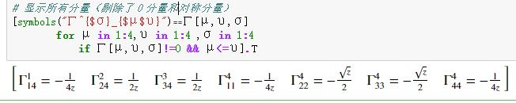
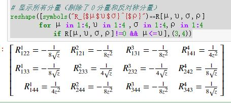
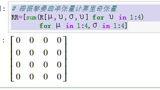

# 黎曼曲率张量

## 曲率概念的意义

`导数算符对易子`$$[\nabla_a,\nabla_b]=\nabla_a\nabla_b-\nabla_b\nabla_a$$：对标量场的作用结果为０(无挠性决定的)，但对一般张量场未必为０。

`黎曼曲率张量`就是这种非对易性的表现。

<!--more-->

## 探究导数算符对易子

先把目标集中在$$(\nabla_a\nabla_b-\nabla_b\nabla_a)$$作用在对偶矢量$$\omega_c$$上的情况上。

首先，下式左边展开后相减，再根据无挠性，得到：
$$
(\nabla_a\nabla_b-\nabla_b\nabla_a)(f \omega_c)=f (\nabla_a\nabla_b-\nabla_b\nabla_a)\omega_c,\quad \forall f\in\mathscr{F}_M,\omega_c\in\mathscr{F}_M(0,1)
$$
选择在$$p$$点相等的对偶矢量$$\omega_b,\omega'_b,\left. \omega_b\right|_p=\left.\omega'_b\right|_p$$，于是$$\Omega_b\overset{\Delta}{=}\omega'_b-\omega_b, \quad \left.\Omega_b\right|_p=0$$，引入坐标系$${x^\mu}$$并使坐标域含$$p$$，于是有：
$$
\begin{aligned}\left[(\nabla_a\nabla_b-\nabla_b\nabla_a)\Omega_c\right]_p &=\left[(\nabla_a\nabla_b-\nabla_b\nabla_a)[\Omega_\mu(dx^\mu)_c]\right]_p &\text{张量展开}\\ &=\left.\Omega_\mu\right|_p(\nabla_a\nabla_b-\nabla_b\nabla_a)(dx^\mu)_c  &\text{利用上式}\\ &=0  &\text{根据约定}\end{aligned}
$$
这说明，对流形$$M$$上的任意一点$$p$$而言，$$\left.[\nabla_a,\nabla_b]\omega_c\right|_p$$只依赖于$$\omega_c$$在$$p$$点的值，而与$$\omega_c$$其它部分无关。

## 引入曲率张量概念

上一段的结论说明$$[\nabla_a,\nabla_b]$$是一个`线性算符(映射)`：
$$
\begin{aligned} [\nabla_a,\nabla_b]&:&\mathscr{T}_p(0,1)&\to& &\mathscr{T}_p(0,3) \\ & &\left.\omega_c\right|_p&\mapsto& &\left.[\nabla_a,\nabla_b]\omega_c\right|_p\end{aligned}
$$
可以将这个线性映射用张量表示，也就是说$$[\nabla_a,\nabla_b]$$对应一个张量$$R^{\quad d}_{abc}$$，满足：
$$
\left.[\nabla_a,\nabla_b]\omega_c\right|_p=\left.R^{\quad d}_{abc}\omega_d\right|_p
$$
考虑到$$p$$点选择的任意性，于是有：
$$
[\nabla_a,\nabla_b]\omega_c=R^{\quad d}_{abc}\omega_d,\quad \forall \omega_c\in\mathscr{F}_M(0,1)
$$
我们称$$R^{\quad d}_{abc}$$为`黎曼曲率张量`。

只要选定了导数算符，就可以谈`黎曼曲率张量`。

如果有度规张量场$$g_{ab}$$，那么导数算符$$\nabla_a$$就是与$$g_{ab}$$适配的，进而有唯一确定的`黎曼曲率张量场`。  

黎曼曲率张量场为０的度规，称之为`平直度规`。欧氏度规和闵氏度规都是平直度规。

## 导数算符作用张量场的非对易性

根据矢量场与对偶矢量场相互作用的结果是标量场的事实，可推出导数算符$$\nabla_a$$作用于矢量场$$v^a$$的非对易性：
$$
[\nabla_a,\nabla_b]v^c=-R^{\quad c}_{abd}v^d,\quad \forall v^c\in\mathscr{F}_M(1,0)
$$
进而有：
$$
[\nabla_a,\nabla_b]T^{c_1 \dots c_k}_{\ \qquad d_1 \dots c_l}=-\sum_{i=1}^k{R^{\quad c_i}_{abe}T^{c_1 \dots e \dots c_k}_{\ \qquad \quad d_1 \dots d_l}}+\sum_{j=1}^l{R^{\quad e}_{abd_j}T^{c_1 \dots c_k}_{\ \qquad d_1 \dots e \dots d_l}}
$$

## 黎曼曲率张量的性质

1. $$R^{\quad d}_{abc}=-R^{\quad d}_{bac} , \quad R^{\ \ \quad d}_{(ab)c}=0$$
2. 循环恒等式：$$ R^{\ \ \quad d}_{[abc]}=0$$
3. 比安基恒等式：$$ \nabla_{[a} R^{\  \quad e}_{bc]d}=0$$
4. $$R_{abcd}=-R_{abdc},\quad R_{ab(cd)}=0$$
5. $$R_{abcd}=-R_{cdab}$$

注意：最后两个性质，引入度规$$g_{ab}$$，$$R_{abcd}\overset{\Delta}{=}g_{de}R^{\quad e}_{abc}$$

## 黎曼曲率张量的迹

我们知道：相似矩阵有相同的`迹`，所有相似矩阵都对应同一个线性变换，进而对应同一个张量。所以这`迹`也就是张量的`迹`,其值为：$$T^a_{\ \ a}=g^{ac}T_{ac}$$，是张量$$T^a_b$$的`迹`，也是张量$$T_{ab}$$的`迹`。

类似地，也可以对$$R_{abcd}$$进行求`"迹"`，根据黎曼张量的性质和度规的对称性，对６个可能分别计算：

$$
\begin{aligned}g^{ab}R_{abcd}&=g^{(ab)}R_{[ab]cd}=0\\ g^{ac}R_{abcd}&=-g^{ac}R_{bacd}=g^{ac}R_{badc}=R^{\ \quad a}_{bad}\\ g^{ad}R_{abcd}&=-g^{ad}R_{bacd}=-R^{\ \quad a}_{bac}\\ g^{bc}R_{abcd}&=-g^{bc}R_{abdc}=-R^{\ \quad b}_{abd} \\ g^{bd}R_{abcd}&=R^{\ \quad b}_{abc} \\ g^{cd}R_{abcd}&=g^{cd}R_{cdab}=g^{(cd)}R_{[cd]ab}=0\end{aligned}
$$

由此可见，这６个`"迹"`，只有一个是独立的，选择其中一个定义为`里奇张量`：
$$
R_{ac}\overset{\Delta}{=}g^{bd}R_{abcd}=R^{\ \quad b}_{abc}
$$
于是有：
$$
\begin{aligned}g^{ab}R_{abcd}&=0,\quad g^{cd}R_{abcd}=0\\ g^{ac}R_{abcd}&=R_{bd}, \quad g^{bd}R_{abcd}=R_{ac} \\ g^{ad}R_{abcd}&=-R_{bc},\quad g^{bc}R_{abcd}=-R_{ad} \end{aligned}
$$
对`里奇张量`$$R_{ac}$$进一步缩并，得到`标量曲率`$$R\overset{\Delta}{=}g^{ac}R_{ac}$$。　此外，里奇张量也是对称的：
$$
R_{ac}=R_{ca}, \quad R_{[ac]}=0
$$
`黎曼曲率张量`$$R^{\quad d}_{abc}$$的无迹部分，叫做`外尔张量`$$C_{abcd}$$：
$$
C_{abcd}\overset{\Delta}{=}R_{abcd}-\frac{2}{n-2}(g_{a[c} R_{d]b}-g_{b[c} R_{d]a})+\frac{2}{(n-1)(n-2)}R g_{a[c} g_{d]b}, \quad \dim(M)\ge 3
$$
外尔张量有如下性质：

1. $$C_{abcd}=-C_{bacd}=-C_{abdc}=C_{cdab},\quad C_{[abc]d}=0$$
2. $$C_{abcd}$$的各种迹都为０.

## 由度规计算黎曼曲率

首先计算，用双重导数算符作用于对偶矢量场，再取反称部分，计算结果：
$$
\begin{aligned}\nabla_{[a}\nabla_{b]}\omega_c&=\partial_{[a}\nabla_{b]}\omega_c-\Gamma^{d}_{\ \ [ab]}\nabla_d\omega_c-\Gamma^{d}_{\ \ [a|c|}\nabla_{b]}\omega_d \\ &=\partial_{[a}\nabla_{b]}\omega_c-\Gamma^{d}_{\ \ c[a}\nabla_{b]}\omega_d \\ &=\partial_{[a}\partial_{b]}\omega_c-\omega_d\partial_{[a}\Gamma^d_{\ \ b]c}-\Gamma^d_{\ \ c[b}\partial_{a]}\omega_d-\Gamma^{d}_{\ \ c[a}\partial_{b]}\omega_d+\Gamma^{e}_{\ \ c[a}\Gamma^{d}_{\ \ b]e}\omega_d \\ &=-\omega_d\partial_{[a}\Gamma^d_{\ \ b]c}-2\Gamma^{d}_{\ \ c([a}\partial_{b])}\omega_d+\Gamma^{e}_{\ \ c[a}\Gamma^{d}_{\ \ b]e}\omega_d \\ &=-\omega_d\partial_{[a}\Gamma^d_{\ \ b]c}+\Gamma^{e}_{\ \ c[a}\Gamma^{d}_{\ \ b]e}\omega_d \\ &=(-\partial_{[a}\Gamma^d_{\ \ b]c}+\Gamma^{e}_{\ \ c[a}\Gamma^{d}_{\ \ b]e})\omega_d \end{aligned}
$$
而根据黎曼张量的定义有：
$$
R^{\quad d}_{abc}\omega_d=2\nabla_{[a}\nabla_{b]}\omega_c
$$
进而有黎曼曲率张量的表达式(考虑到对偶矢量$$\omega_d$$是任意选择的)：
$$
R^{\quad d}_{abc}=-2\partial_{[a}\Gamma^d_{\ \ b]c}+2\Gamma^{e}_{\ \ c[a}\Gamma^{d}_{\ \ b]e}
$$
对应的黎曼曲率张量分量是(将反称部分展开)：
$$
R^{\ \quad \rho}_{\mu \upsilon \sigma}=\Gamma^\rho_{\ \ \mu \sigma,\upsilon}-\Gamma^\rho_{\ \ \upsilon \sigma,\mu}+\Gamma^\lambda_{\ \ \sigma\mu}\Gamma^\rho_{\ \ \upsilon \lambda}-\Gamma^\lambda_{\ \ \sigma\upsilon }\Gamma^\rho_{\ \ \mu \lambda}
$$
最后，得到里奇张量的分量表达式：
$$
R_{\mu \sigma}=R^{\ \quad \upsilon}_{\mu \upsilon \sigma}=\Gamma^\upsilon_{\ \ \mu \sigma,\upsilon}-\Gamma^\upsilon_{\ \ \upsilon \sigma,\mu}+\Gamma^\lambda_{\ \ \sigma\mu}\Gamma^\upsilon_{\ \ \upsilon \lambda}-\Gamma^\lambda_{\ \ \sigma\upsilon }\Gamma^\upsilon_{\ \ \mu \lambda}
$$

## 范例

求度规$$ds^2=z^{-1/2}(-dt^2+dz^2)+z(dx^2+dy^2)$$的黎曼张量在$$\{t,x,y,z\}$$系的全部分量。 

用`julia`解决这个问题。首先设置变量，设置度规张量，并计算逆度规：

```julia
using SymPy

@vars t x y z real=true
xv = [t,x,y,z]

# 度规张量及其逆
g = sympy.eye(4) .* [-z^(-1//2),z,z,z^(-1//2)]
gi = inv(g);
```

根据度规计算克氏符:

```julia
# 根据度规计算克氏符
Γ = sum([(1//2)*gi[σ,ρ]*(diff(g[μ,ρ],xv[υ])+
            diff(g[υ,ρ],xv[μ])-diff(g[μ,υ],xv[ρ])) 
        for μ in 1:4,υ in 1:4 ,σ in 1:4] 
    for ρ in 1:4)

# 显示所有分量（剔除了０分量和对称分量）
[symbols("Γ^{$σ}_{$μ$υ}")⩵Γ[μ,υ,σ] 
        for μ in 1:4,υ in 1:4 ,σ in 1:4
            if Γ[μ,υ,σ]!=0 && μ<=υ].T
```



根据克氏符计算黎曼曲率张量:

```julia
#　根据克氏符计算黎曼曲率张量
R=[diff(Γ[μ,σ,ρ],xv[υ])-diff(Γ[υ,σ,ρ],xv[μ])+
    sum(Γ[μ,σ,λ]*Γ[υ,λ,ρ]-Γ[υ,σ,λ]*Γ[μ,λ,ρ] 
        for λ in 1:4) 
    for μ in 1:4,υ in 1:4 ,σ in 1:4,ρ in 1:4]

# 显示所有分量（剔除了０分量和反对称分量）
reshape([symbols("R_{$μ$υ$σ}^{$ρ}")⩵R[μ,υ,σ,ρ] 
        for μ in 1:4,υ in 1:4 ,σ in 1:4,ρ in 1:4 
            if R[μ,υ,σ,ρ]!=0 && μ<=υ],(3,4))
```



根据黎曼曲率张量计算里奇张量:

```julia
# 根据黎曼曲率张量计算里奇张量
RR=[sum(R[μ,υ,σ,υ] for υ in 1:4) 
        for μ in 1:4,σ in 1:4]
```



