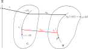

> `李变换群`，就是李群作用于流形，这种“作用”其实就是变换，这种变换的集合构成的群。 就是`李群的实现`，或 `李群的表示`。

<!--more-->

## 李变换群

前面已经接触过了`单参微分同胚群`$$\phi:\mathbb{R}\times M \to M$$。只需要把$$\mathbb{R}$$换成李群$$G$$就得到了李变换群。

考虑李群$$G$$和流形$$M$$，$$C^\infty$$映射$$\sigma:G\times M\to M$$成为上的一个`李变换群`，若

- 1） $$\forall g\in G,\quad \sigma_g:M\to M$$是微分同胚；
- 2）$$\sigma_{gh}=\sigma_g \circ \sigma_h,\quad \forall g,h\in G$$。

$$\sigma$$可诱导出另外两个映射(方框中)：

$$
\sigma(g,p)=\boxed{\sigma_g(p)=\sigma_p(g)},\quad \forall g\in G, p\in M
$$

条件2）保证了，从李群$$G=\{g\}$$到李变换群$$\{\sigma_g:M\to M|g\in G\}$$的自然映射$$g\mapsto\sigma_g$$是一个同态映射。这个同态映射成为$$G$$的一个`实现`，则称$$M$$为`实现空间`。  如果这个同态是同构，则称$$G$$为`忠实实现`。

可以说，李群$$G$$决定了流形$$M$$上的一个李变换群。

## 单参微分同胚群

特别地，李群$$G$$的每个`单参子群`决定了流形$$M$$上的一个`单参微分同胚群`。



如图，李群$$G$$的李代数$$\mathscr{G}$$的一个元素$$A_e$$唯一确定一个单参数子群$$\gamma(t)$$。在流形$$M$$上任意选一点$$p$$，在单参子群$$\gamma\in G$$的作用下，得到流形$$M$$上的一个单参微分同胚群$$(\sigma_p\circ\gamma) (t)$$。 进而在流形$$M$$的$$p$$点确定唯一的矢量$$\xi_p$$：
$$
\xi_p=\left.\frac{d}{dt}\right|_{t=0}\sigma_p(\gamma(t))=\sigma_{p*}\left.\frac{d}{dt}\right|_{t=0}\gamma(t)=\sigma_{p*}A_e
$$
由此可见：

>  对于给定的李变换群$$\sigma:G\times M\to M$$，李群$$G$$的李代数$$\mathscr{G}$$的每个元素$$A_e$$对应流形$$M$$上的一个$$C^\infty$$矢量场$$\xi$$。 故有映射$$\chi:\mathscr{G}\to \{\xi\}$$

## Killing矢量场

进一步考虑一个特殊情况：带度规流形$$(M,g_{ab})$$，而李群$$G$$是$$M$$的等度规群，即李变换群$$\sigma:G\times M\to M$$的每个$$\sigma_g:M\to M$$都是等度规映射。

这时，李群$$G$$的每个单参子群$$\gamma(t)$$产生的单参微分同胚群$$\{\sigma_{\gamma(t)}|t\in \mathbb{R}\}$$升格为单参等度规群。其轨道切矢$$\xi$$就是$$(M,g_{ab})$$上的Killing矢量场。即，

$$
\chi:\mathscr{G}\to \mathscr{K}
$$

Killing矢量场，在对易子为李括号下，也成为李代数。 事实上，映射$$\chi:\mathscr{G}\to \mathscr{K}$$对李括号保到只相差一个符号的程度：

$$
\chi([A_e,B_e])=-[\chi(A_e),\chi(B_e)],\quad \forall A_e,B_e\in \mathscr{G}
$$

于是有必要映入新的映射$$\psi:\mathscr{G}\to \mathscr{K}$$，能够保李括号：

$$
\psi(A_e)=-\chi(A_e),\quad A_e\in \mathscr{G}\\
\psi[A_e,B_e]=[\psi(A_e),\psi(B_e)],\quad \forall A_e,B_e\in \mathscr{G}
$$

进而保证了，映射$$\psi:\mathscr{G}\to \mathscr{K}$$是李代数同态映射。

> 如果的每个Killing矢量场都是完备矢量场，则每个都能产生单参等度规群，进而等度规群$$G$$（因而其李代数$$\mathscr{G}$$）与$$\mathscr{K}$$的维度相同，于是$$\psi:\mathscr{G}\to \mathscr{K}$$就是李代数同构。

## "另类"Killing矢量场

前面谈的是基于等度规映射Killing矢量场。并且在此基础上有三条性质：

- 1）$$\mathscr{K}=\{\xi\}$$是矢量空间；
- 2）矢量场对易子作为李括号使得$$\mathscr{K}$$成为李代数；
- 3）映射$$\chi:\mathscr{G}\to \mathscr{K}$$在相差一个负号的意义下“保李括号”。

单我们发现，即使不要求等度规，矢量场集合$$\{\xi\}$$也能满足这三条。所以不妨也可直接将$$\{\xi\}$$定义称Killing矢量场，称之为流形$$M$$上关于李群$$G$$的Killing矢量场。

以后说到“Killing矢量场”，如果没有加定语说明，表示原生意义上的Killing矢量场；如果加了如上定语约束，则是这里的“另类”Killing矢量场。

当然，如果对映射$$\sigma:G\times M\to M$$不加要求，$$\dim \mathscr{K}$$可能小于$$\dim \mathscr{G}$$。

但是，如果映射$$\sigma:G\times M\to M$$是`有效的`，即

$$
\sigma_g(p)=p \quad \Rightarrow \quad g=e,\quad \forall p \in M
$$

(这个条件等价于$$g\mapsto \sigma_g$$是一一映射， 还等价于$$G$$在$$M$$上的实现是忠实的)， 那么 $$\chi:\mathscr{G}\to \mathscr{K}$$是同构映射，进而$$\psi:\mathscr{G}\to \mathscr{K}$$是李代数同构。

## 计算李代数结构常数

利用基于等度规映射的Killing矢量场计算等度规群的李代数的结构常数。

这里部分步骤，我可以用Julia来计算， 以后有类似的更复杂的，可以复制这段代码，作点修改就可以计算了。

【范例目标】：3维欧氏空间$$(\mathbb{R}^3,\delta_{ab})$$中的2维球面$$(S^2,h_{ab})$$。

首先，这个球面的等度规群是三维空间转动群$$G=\mathrm{SO}(3)$$。

其次，计算这个球面的诱导度规$$h_{ab}$$:

```julia
using SymPy

@vars θ φ real=true

# 坐标变换
X=[sin(θ)*cos(φ),sin(θ)*sin(φ),cos(θ)]
Q=[θ,φ]

# 三维欧氏度规矩阵g
g = sympy.eye(3) .* [1,1,1]

# 计算二维球面上的诱导度规矩阵h，及其逆hi
M=[diff(x,q) for x in X, q in Q]
h= simplify.(sympy.Matrix(M'*g*M))
hi = inv(h)
h
```

计算结果： $$\begin{bmatrix}1 & 0 \\ 0 & \sin^{2} θ\end{bmatrix}$$

第三步：根据度规计算克氏符，然后列出所有Killing方程：

```julia
# 待求的Killing矢量场的分量
ξ = SymFunction("ξ^1,ξ^2")

# 根据度规计算克氏符
Γ = sum([(1//2)*hi[σ,ρ]*(diff(h[μ,ρ],Q[υ])+
            diff(h[υ,ρ],Q[μ])-diff(h[μ,υ],Q[ρ])) 
        for μ in 1:2,υ in 1:2 ,σ in 1:2] 
    for ρ in 1:2)

# 列出所有独立Killing方程组
eqs = [(0⩵diff(sum(h[υ,ρ]*ξ[ρ](θ,φ) for ρ in 1:2),Q[μ])+
        diff(sum(h[μ,ρ]*ξ[ρ](θ,φ) for ρ in 1:2),Q[υ])-
        2*sum(Γ[μ,υ,σ]*sum(h[σ,ρ]*ξ[ρ](θ,φ) for ρ in 1:2) 
            for σ in 1:2)) 
    for μ in 1:2,υ in 1:2  if μ ≤ υ ]
```

结果是：$$\begin{bmatrix}0 = 2 \frac{\partial}{\partial θ} \operatorname{ξ^{1}}{\left (θ,φ \right )}\\0 = \sin^{2}{\left (θ \right )} \frac{\partial}{\partial θ} \operatorname{ξ^{2}}{\left (θ,φ \right )} + \frac{\partial}{\partial φ} \operatorname{ξ^{1}}{\left (θ,φ \right )}\\0 = 2 \operatorname{ξ^{1}}{\left (θ,φ \right )} \sin{\left (θ \right )} \cos{\left (θ \right )} + 2 \sin^{2}{\left (θ \right )} \frac{\partial}{\partial φ} \operatorname{ξ^{2}}{\left (θ,φ \right )}\end{bmatrix}$$

第四步，求解这组方程的通解。

首先通过观察，很容易得到第一组特解：

$$
(\xi_3)^a=-\left(\frac{\partial}{\partial \varphi}\right)^a, \quad \xi_3=(0,-1)
$$

由方程１和３有$$\xi^1(\theta,\varphi)=f(\varphi),\quad \xi^2(\theta,\varphi)=g(\theta)h(\varphi)$$ ，回代方程3，并分离变量得：

$$
-\frac{f(\varphi)}{h'(\varphi)}=\frac{g(\theta)}{\cot(\theta)}=C
$$

当$$C=0$$，只有全0平凡解。所以必须$$C\ne0$$，于是有：

$$
f(\varphi)=-C \ h'(\varphi),\quad g(\theta)=C \cot(\theta)
$$

回代方程2得：

$$
h''(\varphi)+h(\varphi)=0
$$

得到$$h(\varphi)$$得两个特解: $$\sin(\varphi),\quad \cos(\varphi)$$。

最后，整理得到剩余两个特解：

$$
(\xi_2)^a=-\cos\theta \left(\frac{\partial}{\partial \varphi}\right)^a+\cot\theta \sin\theta\left(\frac{\partial}{\partial \varphi}\right)^a, \quad \xi_2=(-\cos\theta,\cot\theta\sin\theta)\\ (\xi_1)^a=\sin\theta \left(\frac{\partial}{\partial \varphi}\right)^a+\cot\theta \cos\theta\left(\frac{\partial}{\partial \varphi}\right)^a, \quad \xi_1=(\sin\theta,\cot\theta\cos\theta)
$$

这三个特解，可选作Killing矢量场得一组基矢量。

第五步，获得李代数得结构常数表达式 （只要写出，上面这三组基矢量的三组对易子即可）

$$
[\xi_1,\xi_2]^a=(\xi_3)^a,\quad [\xi_2,\xi_3]^a=(\xi_1)^a,\quad [\xi_3,\xi_1]^a=(\xi_2)^a
$$

