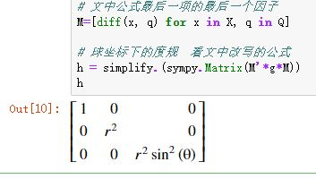
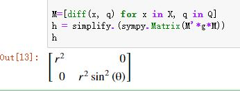
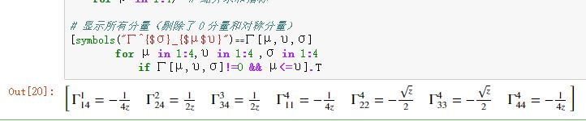
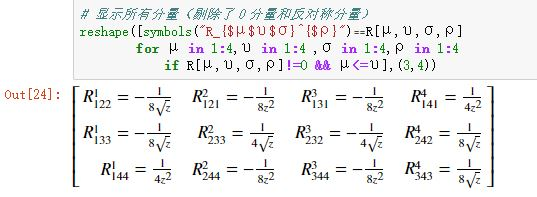
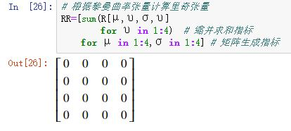
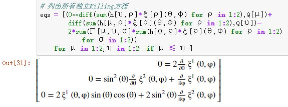

> `Julia`，对数学符号真太友好了。
>
> 前面的笔记中，我曾穿插了些相关的符号计算，本文作为一个汇总，并且未来的一些有特点的代码，我也将汇总于此，用作备忘。
>
> 用`Julia`进行数学符号计算的关键：1）先要写出（多重）数组友好的公式，然后用`Julia`实现之； 2）使用了SymPy，外加`Julia`本身的语法优势。
>
> 我曾想过将代码封装成函数，但发现直接用代码似乎更好。首先代码不复杂，其次， 暴露代码细节还能和数学公式相互对照，不容易出错。 有种“所见即所得”的感觉。

<!--more-->

## 张量变换

首先将张量变换关系写成具体指标，并调整成矩阵友好的形式:

$$
\eta'_{\mu\upsilon}=\frac{dx^\alpha}{dx'^\mu}\frac{dx^\beta}{dx'^\upsilon}\eta_{\alpha\beta}=\frac{dx^\alpha}{dx'^\mu}\eta_{\alpha\beta}\frac{dx^\beta}{dx'^\upsilon}
$$

####  1） 同维变换   比如，坐标变换引起的张量变换

以笛卡尔坐标到球坐标的变换为例求球坐标下的度规，用`Julia`实现之：

```julia
using SymPy

@vars r θ φ real=true

# 笛卡尔坐标到球坐标的变换
X = [r*sin(θ)*cos(φ), r*sin(θ)*sin(φ), r*cos(θ)]
Q = [r, θ, φ]

# 欧氏度规及逆度规
g = sympy.eye(3) .* [1, 1, 1] 
gi = inv(g)

# 文中公式最后一项的最后一个因子
M=[diff(x, q) for x in X, q in Q]

# 球坐标下的度规  看文中改写的公式
h = simplify.(sympy.Matrix(M'*g*M))
h
```



#### 2）降维变换  比如，求子流形的诱导度规

上面类似的方法也用来计算球面上的诱导度规，用`Julia`实现之（只有注释对应的代码和前面不一样）：

```julia
#
#   除了注释部分，其它和前一段代码完全一样
#
using SymPy

@vars r, θ φ real=true

X = [r*sin(θ)*cos(φ), r*sin(θ)*sin(φ), r*cos(θ)]
# 球面只有两个参数， r是常量，所以不在坐标列表中
Q = [θ, φ]

g = sympy.eye(3) .* [1, 1, 1] 
gi = inv(g)

M=[diff(x, q) for x in X, q in Q]
h = simplify.(sympy.Matrix(M'*g*M))
h
```



## 克氏符

`克氏符`的分量（具体指标）表达式：

$$
\Gamma^\sigma_{\ \ \mu \upsilon}=\frac{1}{2}g^{\sigma \rho}[g_{\upsilon \rho,\mu}+g_{\mu \rho,\upsilon}-g_{\mu \upsilon,\rho}]
$$

显然，这个计算要用到三重数组。我们约定表示克氏符数组的头两个位置分配给下指标，最后一个位置分配给上指标，即用$$\Gamma[\mu,\upsilon,\sigma]$$代表$$\Gamma^\sigma_{\ \ \mu \upsilon}$$。

此外，$$g_{\upsilon \rho,\mu}=\partial_\mu g_{\upsilon \rho}$$， 而$$\{g^{\sigma\rho}\}$$是$$\{g_{\sigma\rho}\}$$的逆矩阵，在数组中分别表示为$$\mathrm{gi}[\sigma,\rho]$$和$$g[\sigma,\rho]$$。

【范例】 求度规$$ds^2=z^{-1/2}(-dt^2+dz^2)+z(dx^2+dy^2)$$的克氏符在$$\{t,x,y,z\}$$系的全部分量。 

有了这些约定，很容易用`Julia`计算之：

```julia
using SymPy

@vars t x y z real=true

# 坐标变量
X = [t,x,y,z]

# 度规张量及其逆
g = sympy.eye(4) .* [-z^(-1//2),z,z,z^(-1//2)]
gi = inv(g);

# 根据度规计算克氏符
Γ = sum([(1//2)*gi[σ,ρ]*(diff(g[υ,ρ],X[μ])+
            diff(g[μ,ρ],X[υ])-diff(g[μ,υ],X[ρ]))  # 公式部分
        for μ in 1:4, υ in 1:4, σ in 1:4]   # 三重数组生成指标
    for ρ in 1:4)  # 缩并求和指标

# 显示所有分量（剔除了０分量和对称分量）
[symbols("Γ^{$σ}_{$μ$υ}")⩵Γ[μ,υ,σ] 
        for μ in 1:4,υ in 1:4 ,σ in 1:4
            if Γ[μ,υ,σ]!=0 && μ<=υ].T
```



## 黎曼曲率张量

黎曼曲率张量分量：

$$
R^{\ \quad \rho}_{\mu \upsilon \sigma}=\Gamma^\rho_{\ \ \mu \sigma,\upsilon}-\Gamma^\rho_{\ \ \upsilon \sigma,\mu}+\Gamma^\lambda_{\ \ \sigma\mu}\Gamma^\rho_{\ \ \upsilon \lambda}-\Gamma^\lambda_{\ \ \sigma\upsilon }\Gamma^\rho_{\ \ \mu \lambda} \\ R_{\mu \sigma}=R^{\ \quad \upsilon}_{\mu \upsilon \sigma}
$$

黎曼曲率张量涉及四重数组，约定表示黎曼曲率张量数组的头三个位置分配给下指标，最后一个位置分配给上指标，即用$$R[\mu,\upsilon,\sigma,\rho]$$代表$$R^{\ \quad \rho}_{\mu \upsilon \sigma}$$。

继续沿用克氏符的范例，用`Julia`计算之：

```julia
#　根据克氏符计算黎曼曲率张量
R=[diff(Γ[μ,σ,ρ],X[υ])-diff(Γ[υ,σ,ρ],X[μ])+
    sum(Γ[μ,σ,λ]*Γ[υ,λ,ρ]-Γ[υ,σ,λ]*Γ[μ,λ,ρ]  # 公式部分
        for λ in 1:4) # 第3、4项的缩并求和指标
    for μ in 1:4,υ in 1:4 ,σ in 1:4,ρ in 1:4] # 四重数组生成指标

# 显示所有分量（剔除了０分量和反对称分量）
reshape([symbols("R_{$μ$υ$σ}^{$ρ}")⩵R[μ,υ,σ,ρ] 
        for μ in 1:4,υ in 1:4 ,σ in 1:4,ρ in 1:4 
            if R[μ,υ,σ,ρ]!=0 && μ<=υ],(3,4))
```



继续计算里奇张量：

```julia
# 根据黎曼曲率张量计算里奇张量
RR=[sum(R[μ,υ,σ,υ] 
        for υ in 1:4)  # 缩并求和指标
    for μ in 1:4,σ in 1:4] # 矩阵生成指标
```



## Killing方程

Killing方程的分量形式，并改写成数组友好的形式：

$$
\begin{aligned}&\nabla_\mu\xi_\upsilon+\nabla_\upsilon\xi_\mu=0\\ \Leftrightarrow \quad & \partial_\mu\xi_\upsilon+\partial_\upsilon\xi_\mu-2\Gamma^\sigma_{\ \ \mu\upsilon}\xi_\sigma=0\\ \Leftrightarrow \quad & \boxed{\partial_\mu (g_{\upsilon\rho}\xi^\rho)+\partial_\upsilon(g_{\mu\rho}\xi^\rho)-2\Gamma^\sigma_{\ \ \mu\upsilon}g_{\sigma\rho}\xi^\rho=0}\end{aligned}
$$

【范例】3维欧氏空间$$(\mathbb{R}^3,\delta_{ab})$$中的2维球面$$(S^2,h_{ab})$$。根据方框中的公式用`Julia`很容易列出所以Killing方程

```julia
using SymPy

@vars θ φ real=true

# 待求的Killing矢量场的分量
ξ = SymFunction("ξ^1,ξ^2")

# 坐标变换
X=[sin(θ)*cos(φ),sin(θ)*sin(φ),cos(θ)]
Q=[θ,φ]

# 三维欧氏度规矩阵
g = sympy.eye(3) .* [1,1,1]

# 计算二维球面上的诱导度规矩阵h，及其逆hi
M=[diff(x,q) for x in X, q in Q]
h= simplify.(sympy.Matrix(M'*g*M))
hi = inv(h)

# 根据度规计算克氏符
Γ = sum([(1//2)*hi[σ,ρ]*(diff(h[υ,ρ],Q[μ])+
            diff(h[μ,ρ],Q[υ])-diff(h[μ,υ],Q[ρ])) 
        for μ in 1:2,υ in 1:2 ,σ in 1:2] 
    for ρ in 1:2)

# 列出所有独立Killing方程
eqs = [(0⩵diff(sum(h[υ,ρ]*ξ[ρ](θ,φ) for ρ in 1:2),Q[μ])+
        diff(sum(h[μ,ρ]*ξ[ρ](θ,φ) for ρ in 1:2),Q[υ])-
        2*sum(Γ[μ,υ,σ]*sum(h[σ,ρ]*ξ[ρ](θ,φ) for ρ in 1:2) 
            for σ in 1:2)) 
    for μ in 1:2,υ in 1:2  if μ ≤ υ ]
```



至于，这个方程组通解的求解，还是要靠手工进行。【参见：[李变换群]() 的末尾部分】