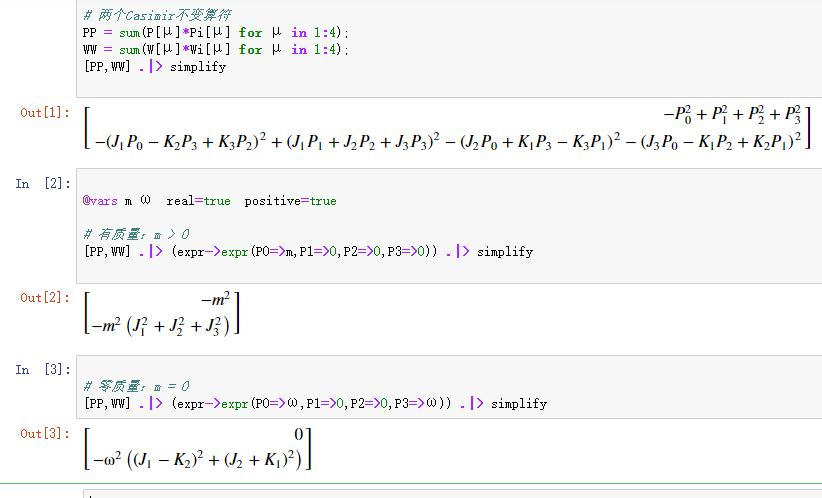

> `Julia`，对数学符号真太友好了。
>
> 前面的笔记中，我曾穿插了些相关的符号计算，本文作为一个汇总，并且未来的一些有特点的代码，我也将汇总于此，用作备忘。
>
> 用`Julia`进行张量符号计算的关键：1）先要写出（多重）数组友好的公式，然后用`Julia`实现之； 2）使用了`SymPy`，外加`Julia`本身的语法优势。
>
> 我曾想过将代码封装成函数，但发现直接用代码似乎更好。首先代码不复杂，其次， 暴露代码细节还能和数学公式相互对照，不容易出错。 有种“所见即所得”的感觉。

<!--more-->

## 张量变换

首先将张量变换关系写成具体指标，并调整成矩阵友好的形式:

$$
\eta'_{\mu\upsilon}=\frac{dx^\alpha}{dx'^\mu}\frac{dx^\beta}{dx'^\upsilon}\eta_{\alpha\beta}=\frac{dx^\alpha}{dx'^\mu}\eta_{\alpha\beta}\frac{dx^\beta}{dx'^\upsilon}
$$

####  1） 同维变换   比如，坐标变换引起的张量变换

以笛卡尔坐标到球坐标的变换为例求球坐标下的度规，用`Julia`实现之：

```julia
using SymPy

@vars r θ φ real=true

# 笛卡尔坐标到球坐标的变换
X = [r*sin(θ)*cos(φ), r*sin(θ)*sin(φ), r*cos(θ)]
Q = [r, θ, φ]

# 欧氏度规及逆度规
g = sympy.eye(3) .* [1, 1, 1] 
gi = inv(g)

# 文中公式最后一项的最后一个因子
M=[diff(x, q) for x in X, q in Q]

# 球坐标下的度规  看文中改写的公式
h = simplify.(sympy.Matrix(M'*g*M))
h
```


#### 2）降维变换  比如，求子流形的诱导度规

上面类似的方法也用来计算球面上的诱导度规，用`Julia`实现之（只有注释对应的代码和前面不一样）：

```julia
#
#   除了注释部分，其它和前一段代码完全一样
#
using SymPy

@vars r, θ φ real=true

X = [r*sin(θ)*cos(φ), r*sin(θ)*sin(φ), r*cos(θ)]
# 球面只有两个参数， r是常量，所以不在坐标列表中
Q = [θ, φ]

g = sympy.eye(3) .* [1, 1, 1] 
gi = inv(g)

M=[diff(x, q) for x in X, q in Q]
h = simplify.(sympy.Matrix(M'*g*M))
h
```


## 克氏符

`克氏符`的分量（具体指标）表达式：

$$
\Gamma^\sigma_{\ \ \mu \upsilon}=\frac{1}{2}g^{\sigma \rho}[g_{\upsilon \rho,\mu}+g_{\mu \rho,\upsilon}-g_{\mu \upsilon,\rho}]
$$

显然，这个计算要用到三重数组。我们约定表示克氏符数组的头两个位置分配给下指标，最后一个位置分配给上指标，即用$\Gamma[\mu,\upsilon,\sigma]$代表$\Gamma^\sigma_{\ \ \mu \upsilon}$。

此外，$g_{\upsilon \rho,\mu}=\partial_\mu g_{\upsilon \rho}$， 而$\{g^{\sigma\rho}\}$是$\{g_{\sigma\rho}\}$的逆矩阵，在数组中分别表示为$\mathrm{gi}[\sigma,\rho]$和$g[\sigma,\rho]$。

【范例】 求度规$ds^2=z^{-1/2}(-dt^2+dz^2)+z(dx^2+dy^2)$的克氏符在$\{t,x,y,z\}$系的全部分量。 

有了这些约定，很容易用`Julia`计算之：

```julia
using SymPy

@vars t x y z real=true

# 坐标变量
X = [t,x,y,z]

# 度规张量及其逆
g = sympy.eye(4) .* [-z^(-1//2),z,z,z^(-1//2)]
gi = inv(g);

# 根据度规计算克氏符
Γ = sum([(1//2)*gi[σ,ρ]*(diff(g[υ,ρ],X[μ])+
            diff(g[μ,ρ],X[υ])-diff(g[μ,υ],X[ρ]))  # 公式部分
        for μ in 1:4, υ in 1:4, σ in 1:4]   # 三重数组生成指标
    for ρ in 1:4)  # 缩并求和指标

# 显示所有分量（剔除了０分量和对称分量）
[symbols("Γ^{$σ}_{$μ$υ}")⩵Γ[μ,υ,σ] 
        for μ in 1:4,υ in 1:4 ,σ in 1:4
            if Γ[μ,υ,σ]!=0 && μ<=υ].T
```


## 黎曼曲率张量

黎曼曲率张量分量：

$$
R^{\ \quad \rho}_{\mu \upsilon \sigma}=\Gamma^\rho_{\ \ \mu \sigma,\upsilon}-\Gamma^\rho_{\ \ \upsilon \sigma,\mu}+\Gamma^\lambda_{\ \ \sigma\mu}\Gamma^\rho_{\ \ \upsilon \lambda}-\Gamma^\lambda_{\ \ \sigma\upsilon }\Gamma^\rho_{\ \ \mu \lambda} \\ R_{\mu \sigma}=R^{\ \quad \upsilon}_{\mu \upsilon \sigma}
$$

黎曼曲率张量涉及四重数组，约定表示黎曼曲率张量数组的头三个位置分配给下指标，最后一个位置分配给上指标，即用$R[\mu,\upsilon,\sigma,\rho]$代表$R^{\ \quad \rho}_{\mu \upsilon \sigma}$。

继续沿用克氏符的范例，用`Julia`计算之：

```julia
#　根据克氏符计算黎曼曲率张量
R=[diff(Γ[μ,σ,ρ],X[υ])-diff(Γ[υ,σ,ρ],X[μ])+
    sum(Γ[μ,σ,λ]*Γ[υ,λ,ρ]-Γ[υ,σ,λ]*Γ[μ,λ,ρ]  # 公式部分
        for λ in 1:4) # 第3、4项的缩并求和指标
    for μ in 1:4,υ in 1:4 ,σ in 1:4,ρ in 1:4] # 四重数组生成指标

# 显示所有分量（剔除了０分量和反对称分量）
reshape([symbols("R_{$μ$υ$σ}^{$ρ}")⩵R[μ,υ,σ,ρ] 
        for μ in 1:4,υ in 1:4 ,σ in 1:4,ρ in 1:4 
            if R[μ,υ,σ,ρ]!=0 && μ<=υ],(3,4))
```


继续计算里奇张量：

```julia
# 根据黎曼曲率张量计算里奇张量
RR=[sum(R[μ,υ,σ,υ] 
        for υ in 1:4)  # 缩并求和指标
    for μ in 1:4,σ in 1:4] # 矩阵生成指标
```


## Killing方程

Killing方程的分量形式，并改写成数组友好的形式：

$$
\begin{aligned}&\nabla_\mu\xi_\upsilon+\nabla_\upsilon\xi_\mu=0\\ \Leftrightarrow \quad & \partial_\mu\xi_\upsilon+\partial_\upsilon\xi_\mu-2\Gamma^\sigma_{\ \ \mu\upsilon}\xi_\sigma=0\\ \Leftrightarrow \quad & \boxed{\partial_\mu (g_{\upsilon\rho}\xi^\rho)+\partial_\upsilon(g_{\mu\rho}\xi^\rho)-2\Gamma^\sigma_{\ \ \mu\upsilon}g_{\sigma\rho}\xi^\rho=0}\end{aligned}
$$

【范例】3维欧氏空间$(\mathbb{R}^3,\delta_{ab})$中的2维球面$(S^2,h_{ab})$。根据方框中的公式用`Julia`很容易列出所有Killing方程

```julia
using SymPy

@vars θ φ real=true

# 待求的Killing矢量场的分量
ξ = SymFunction("ξ^1,ξ^2")

# 坐标变换
X=[sin(θ)*cos(φ),sin(θ)*sin(φ),cos(θ)]
Q=[θ,φ]

# 三维欧氏度规矩阵
g = sympy.eye(3) .* [1,1,1]

# 计算二维球面上的诱导度规矩阵h，及其逆hi
M=[diff(x,q) for x in X, q in Q]
h= simplify.(sympy.Matrix(M'*g*M))
hi = inv(h)

# 根据度规计算克氏符
Γ = sum([(1//2)*hi[σ,ρ]*(diff(h[υ,ρ],Q[μ])+
            diff(h[μ,ρ],Q[υ])-diff(h[μ,υ],Q[ρ])) 
        for μ in 1:2,υ in 1:2 ,σ in 1:2] 
    for ρ in 1:2)

# 列出所有独立Killing方程
eqs = [(0⩵diff(sum(h[υ,ρ]*ξ[ρ](θ,φ) for ρ in 1:2),Q[μ])+
        diff(sum(h[μ,ρ]*ξ[ρ](θ,φ) for ρ in 1:2),Q[υ])-
        2*sum(Γ[μ,υ,σ]*sum(h[σ,ρ]*ξ[ρ](θ,φ) for ρ in 1:2) 
            for σ in 1:2)) 
    for μ in 1:2,υ in 1:2  if μ ≤ υ ]
```


至于，这个方程组通解的求解，还是要靠手工进行。【参见：[李变换群]() 的末尾部分】

## Levi-Civita记号

> 20200425 追加

以三指标`Levi-Civita记号`$\varepsilon_{ijk}$为例。下面这个段代码关键点：1）重复指标取0；2）求逆序数。   

```julia
#  三指标Levi-Civita记号
ε= [ Sym((length(Set([i,j,k]))==3)*       #  存在重复指标，取0
    (-1)^(sum([i,j,k][σ]>[i,j,k][ρ]   
            for σ in 1:3,ρ in  1:3  if σ<ρ) % 2)) # 计算逆序数。偶数取1，奇数取-1
    for  i in 1:3, j in 1:3, k in 1:3 ] ;

#  四维evi-Civita记号
ε4= [ Sym((length(Set([i,j,k,l]))==4)*       #  存在重复指标，取0
    (-1)^(sum([i,j,k,l][σ]>[i,j,k,l][ρ]   
            for σ in 1:4,ρ in  1:4  if σ<ρ) % 2)) # 计算逆序数。偶数取1，奇数取-1
    for  i in 1:4, j in 1:4, k in 1:4,l in 1:4 ] ;
```

对于更多指标的情况，只需要将这段代码多加一个指标，然后3改成4即可。

## 关于逆变指标和协变指标

> 20200514追加

首先，作为符号而言$\textcolor{red}{A_1^2}$，在`julia`中会解释成$A_1$的2次幂。所以为了能在`julia`中有进行相关的计算，必须作些约定：

- 1）`julia`中的指标统统表示逆变指标【以逆变指标作为默认】，比如对应记作$\textcolor{red}{A}$；
- 2）假设存在度规；
- 3）所有协变指标的分量通过度规用逆变指标表出，对应记作$\textcolor{red}{Ai}$。

举个例子【对应的`julia`代码见后，其中有详细注释】：

$$
\boxed{P^2=P_\mu P^\mu,\qquad W^2=W_\mu W^\mu}\\  W^\mu=-\frac{1}{2}\varepsilon^{\mu\upsilon\rho\sigma}J_{\upsilon\rho}P_\sigma\quad  W_\mu=-\frac{1}{2}\varepsilon_{\mu\upsilon\rho\sigma}J^{\upsilon\rho}P^\sigma\\ J^{\upsilon\rho}=\begin{pmatrix}0 & -K^1 & -K^2 & -K^3\\K^1 & 0 & J^3 & -J^2\\K^2 & -J^3 & 0 & J^1\\K^3 & J^2 & -J^1 & 0\end{pmatrix}\\\quad \\ \textcolor{red}{计算：}{W_\mu W^\mu=????}
$$

```julia
using SymPy
using LinearAlgebra

#  三指标Levi-Civita记号
ε= [ Sym((length(Set([i,j,k]))==3)* 
    (-1)^(sum([i,j,k][σ]>[i,j,k][ρ]   
            for σ in 1:3,ρ in  1:3  if σ<ρ) % 2))
    for  i in 1:3, j in 1:3, k in 1:3 ] ;
                            
#  四指标evi-Civita记号
ε4= [ Sym((length(Set([i,j,k,l]))==4)* 
    (-1)^(sum([i,j,k,l][σ]>[i,j,k,l][ρ]   
            for σ in 1:4,ρ in  1:4  if σ<ρ) % 2))
    for  i in 1:4, j in 1:4, k in 1:4,l in 1:4 ] ;

# 闵氏度规
η = sympy.diag(-1,1,1,1);

# 庞加莱群的十个无穷小生成元
# E[1:4] 对应4个平移生成元
# E[5:7] 对应3个转动生成元
# E[8:10]对应3个伪转动生成元
@vars P0 P1 P2 P3 J1 J2 J3 K1 K2 K3 real=true
E=[P0,P1,P2,P3,J1,J2,J3,K1,K2,K3];
                            
# J:  两上标洛伦兹生成元矩阵
# Ji: 两下标洛伦兹生成元矩阵
J=[Sym(0) for i in 1:4 , j in 1:4];
J[2:4,2:4]=[sum(ε[k,i,j]*E[4+k] for k in 1:3) for i in 1:3,j in 1:3];
J[1,2:4]=-E[8:10];
J[2:4,1]=E[8:10];
Ji=[sum(J[μ,υ]*η[μ,ρ]*η[υ,σ] for μ in 1:4,υ in 1:4)  for ρ in 1:4,σ in 1:4];

# P:  逆变平移生成元
# Pi: 协变平移生成元
P=E[1:4];
Pi = [sum(η[υ,σ]*P[σ] for σ in 1:4) for υ in 1:4];

# W:  上标Pauli–Lubanski矢量
# Wi: 下标Pauli–Lubanski矢量
W=Sym(-1//2)*[sum(ε4[μ,υ,ρ,σ]*Ji[υ,ρ]*Pi[σ] 
        for υ in 1:4,ρ in 1:4,σ in 1:4) 
    for μ in 1:4];
Wi=Sym(-1//2)*[sum(ε4[μ,υ,ρ,σ]*J[υ,ρ]*P[σ] 
        for υ in 1:4,ρ in 1:4,σ in 1:4) 
    for μ in 1:4];

# 两个Casimir不变算符
PP = sum(P[μ]*Pi[μ] for μ in 1:4);
WW = sum(W[μ]*Wi[μ] for μ in 1:4);
[PP,WW] .|> simplify

@vars m ω  real=true  positive=true

# 有质量：m > 0
[PP,WW] .|> (expr->expr(P0=>m,P1=>0,P2=>0,P3=>0)) .|> simplify

# 零质量：m = 0
[PP,WW] .|> (expr->expr(P0=>ω,P1=>0,P2=>0,P3=>ω)) .|> simplify
```

