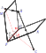

> 带度规流形任意点的切空间和平直空间没有数学上的差别，进而平直空间上发展起来的旋量都是可以移到带度规流形上而无需改变。
>
> 旋量概念是度规依赖的，进而可始终在正交归一基底下讨论。
>
> 旋量概念源自$$\mathrm{SU}(2)$$对$$\mathrm{SO}(3)$$是双重覆盖，将表示空间（或 时空）的旋转“劈”为两半，其中一半就是旋量空间上的逆变旋量，另一半是其共轭空间的共轭逆变旋量。
>
> 一个逆变矢量可以表示成一个逆变旋量与一个共轭逆变旋量的张量积。
>
> 一个协变矢量可以表示成一个协变旋量与一个共轭协变旋量的张量积。
>
> 引入了旋量的抽象指标表示，可以方便无歧义地进行相关的运算。
>
> 关于旋量运算的约定：1）旋量度规按指标左上右下缩并；2）泡利矩阵前加因子$$1/\sqrt{2}$$。
>
> 本篇的计算草稿：https://gitee.com/chaoskey/notes/blob/master/code/0076.ipynb

<!--more-->

## 三维欧氏空间的旋转

#### 泡利矩阵

引入`泡利矩阵`$$\sigma_\mu$$(都是厄米矩阵)

$$
\sigma_1=\begin{pmatrix} 0 & 1 \\ 1 & 0 \end{pmatrix},\quad \sigma_2=\begin{pmatrix} 0 & -i \\ i & 0 \end{pmatrix},\quad \sigma_3=\begin{pmatrix} 1 & 0 \\ 0 & -1 \end{pmatrix}\\ \quad \\ \sigma_1^{\ 2}=\sigma_2^{\ 2}=\sigma_3^{\ 2}=I\\ \sigma_1\sigma_2=-\sigma_2\sigma_1=i\sigma_3\quad \text{【按1-2-3-1循环置换后也成立】}
$$

#### 自旋矩阵

与任意旋转关联的一个量（以前叫哈密顿的`四元数`），现在称为`自旋矩阵`，又被称作`旋量变换`、`旋转算符`。绕$$\boldsymbol{n}$$轴旋转$$\theta$$的`自旋矩阵`表示$$R(\boldsymbol{\theta})$$：

$$
\begin{aligned}R(\boldsymbol{\theta})&=\exp\left(-\frac{i}{2}\boldsymbol{\theta}\cdot\boldsymbol{\sigma}\right)\\&=I\cos\frac{\theta}{2}-i(\boldsymbol{n}\cdot\boldsymbol{\sigma})\sin\frac{\theta}{2}\end{aligned}\\ \quad\\ \boldsymbol{\theta}=\theta \boldsymbol{n}\quad\boldsymbol{n}\cdot\boldsymbol{\sigma}=\sigma_\mu n^\mu\quad |\boldsymbol{n}|=1
$$

容易验证，自旋矩阵$$R$$是特殊酉矩阵$$R\in\mathrm{SU}(2)$$：

$$
RR^\dagger=I,\quad \det R=1
$$

围绕定轴$$\boldsymbol{n}$$转过$$\theta$$角，相当于两个平面反射的组合（如图）。这就是半角出现的原因。

#### 组合旋转

在$$R_1$$所描述的旋转之后，续之以$$R_2$$所描述的旋转，给出的净变化由单一旋转$$R_3$$描绘：

$$
R_3=R_2 R_1
$$

假如$$R_1=R(\boldsymbol{\theta}),\quad R_2=R(\boldsymbol{\varphi})$$，那么

$$
\begin{aligned}R_3&=\left(I\cos\frac{\varphi}{2}-i(\boldsymbol{n}_\varphi\cdot\boldsymbol{\sigma})\sin\frac{\varphi}{2}\right)\left(I\cos\frac{\theta}{2}-i(\boldsymbol{n}_\theta\cdot\boldsymbol{\sigma})\sin\frac{\theta}{2}\right)\\ &=I\left(\cos\frac{\varphi}{2}\cos\frac{\theta}{2}-\sin\frac{\varphi}{2}\sin\frac{\theta}{2}(\boldsymbol{n}_\varphi\cdot\boldsymbol{n}_\theta)\right)\\ &\quad -i\left(\boldsymbol{n}_\varphi\sin\frac{\varphi}{2}\cos\frac{\theta}{2}+\boldsymbol{n}_\theta\cos\frac{\varphi}{2}\sin\frac{\theta}{2}+(\boldsymbol{n}_\varphi\times\boldsymbol{n}_\theta)\sin\frac{\varphi}{2}\sin\frac{\theta}{2}\right)\cdot\boldsymbol{\sigma}\end{aligned}
$$

由此可确定$$R_3(\boldsymbol{\psi})$$。特别地，若$$R_1=R(\frac{\pi}{2}(0,0,1)),\quad R_2=R(\frac{\pi}{2}(1,0,0))$$，那么

$$
\begin{aligned}R_3&=\frac{1}{2}I-i\frac{\sqrt{3}}{2}(\frac{1}{\sqrt{3}},\frac{1}{\sqrt{3}},\frac{1}{\sqrt{3}})\cdot\boldsymbol{\sigma}\\ &=I\cos\frac{\psi}{2}I-i\sin\frac{\psi}{2}(\boldsymbol{n}_\psi\cdot\boldsymbol{\sigma})\end{aligned}\\ \psi=\frac{2\pi}{3},\quad \boldsymbol{n}_\psi=(\frac{1}{\sqrt{3}},\frac{1}{\sqrt{3}},\frac{1}{\sqrt{3}})
$$

#### 自旋矩阵的性质

自旋矩阵具有如下性质：

1）$$(\boldsymbol{n}\cdot\boldsymbol{\sigma})^2=I$$

2）$$\mathrm{tr}(\boldsymbol{n}\cdot\boldsymbol{\sigma})=0$$

3）$$[R, (\boldsymbol{n}\cdot\boldsymbol{\sigma})]=R (\boldsymbol{n}\cdot\boldsymbol{\sigma})- (\boldsymbol{n}\cdot\boldsymbol{\sigma})R=0$$

4）$$\dfrac{dR}{d\theta}=-i(\boldsymbol{n}\cdot\boldsymbol{\sigma})R$$

#### 矢量的关联矩阵

矢量$$\boldsymbol{x}$$的关联矩阵【是厄米矩阵】：

$$
X=\boldsymbol{x}\cdot\boldsymbol{\sigma}=x^\mu\sigma_\mu=\begin{pmatrix} x^3 & x^1-ix^2 \\ x^1+ix^2 & -x^3 \end{pmatrix}\\ \quad \\ \det X=-(x^1)^2-(x^2)^2-(x^3)^2 \\ X^2=(\boldsymbol{x}\cdot\boldsymbol{x})I\quad X^\dagger=X
$$

旋转效应可总结为：

$$
X\mapsto X'=RXR^\dagger,\quad R\in SU(2)
$$

很明显，无论取$$R$$还是$$-R$$，都不会改变旋转的本质，都对应同一个$$\mathrm{SO}(3)$$元素。

$$\mathrm{SO}(3)$$和$$\mathrm{SU}(2)$$（特殊酉群）是`局域同构`的。至于为何强调`局域`，是因为$$\mathrm{SU}(2)$$对$$\mathrm{SO}(3)$$是双重覆盖，即任意特殊酉矩阵（幺正矩阵）及其负号矩阵代表同一个旋转。

#### 无穷小旋转

对无穷小旋转动$$\theta\to 0$$而言，$$R(\boldsymbol{\theta})$$可写成（忽略高阶无穷小）

$$
R=I-\frac{i}{2}(\boldsymbol{\theta}\cdot\boldsymbol{\sigma})
$$

进而有矢量$$\boldsymbol{x}$$关联矩阵$$X=\boldsymbol{x}\cdot\boldsymbol{\sigma}$$的无穷小变换：

$$
\boldsymbol{x}\cdot\boldsymbol{\sigma}\mapsto R(\boldsymbol{x}\cdot\boldsymbol{\sigma})R^\dagger
$$

即（再次忽略高阶无穷小）

$$
\boldsymbol{x}\cdot\boldsymbol{\sigma}\mapsto (\boldsymbol{x}\cdot\boldsymbol{\sigma})+\frac{i}{2}\left[(\boldsymbol{x}\cdot\boldsymbol{\sigma})(\boldsymbol{\theta}\cdot\boldsymbol{\sigma})-(\boldsymbol{\theta}\cdot \boldsymbol{\sigma})(\boldsymbol{x}\cdot\boldsymbol{\sigma})\right]
$$

容易证明【将$$(\boldsymbol{a}\cdot\boldsymbol{\sigma})(\boldsymbol{b}\cdot\boldsymbol{\sigma})=a^\mu b^\upsilon \sigma_\mu \sigma_\upsilon$$展开，再合并同类项即得】

$$
(\boldsymbol{a}\cdot\boldsymbol{\sigma})(\boldsymbol{b}\cdot\boldsymbol{\sigma})=(\boldsymbol{a}\cdot\boldsymbol{b})I+i(\boldsymbol{a}\times\boldsymbol{b})\cdot\boldsymbol{\sigma}
$$

进而有

$$
\boxed{\begin{aligned}\boldsymbol{x}\cdot\boldsymbol{\sigma}&\mapsto (\boldsymbol{x}\cdot\boldsymbol{\sigma})+(\boldsymbol{\theta}\times\boldsymbol{x})\cdot\boldsymbol{\sigma} \\ &\Longleftrightarrow \\ \boldsymbol{x}&\mapsto [1+\boldsymbol{\theta}\times]\boldsymbol{x}\end{aligned}}
$$

## 四维闵氏时空的旋转

#### 矢量的关联矩阵

在闵氏时空中，矢量$$\boldsymbol{x}$$的关联矩阵【注意$$\mu=0,1,2,3\quad \sigma_0=I$$】：

$$
X=tI+\boldsymbol{x}\cdot\boldsymbol{\sigma}=x^\mu\sigma_\mu=\begin{pmatrix} x^0+x^3 & x^1-ix^2 \\ x^1+ix^2 & x^0-x^3 \end{pmatrix}\\ \quad \\ \det X=(x^0)^2-(x^1)^2-(x^2)^2-(x^3)^2,\quad t=x^0
$$

#### 洛伦兹变换

四维闵氏时空矢量的关联矩阵和三维欧氏空间矢量的关联矩阵很类似。时空旋转，由空间旋转和洛伦兹旋转组成，一共6个参数：

$$
\begin{aligned}L(\boldsymbol{\theta},\boldsymbol{\alpha})&=L(\boldsymbol{\alpha})R(\boldsymbol{\theta})=\exp\left(\frac{1}{2}(\boldsymbol{\alpha}-i\boldsymbol{\theta})\cdot\boldsymbol{\sigma}\right)\\&=\left[I\cosh\frac{\alpha}{2}+(\boldsymbol{n}_\alpha\cdot \boldsymbol{\sigma})\sinh\frac{\alpha}{2}\right]\left[I\cos\frac{\theta}{2}-i(\boldsymbol{n}\cdot\boldsymbol{\sigma})\sin\frac{\theta}{2}\right]\end{aligned}\\\quad\\  \boldsymbol{\theta}=\theta \boldsymbol{n}\quad \boldsymbol{n}\cdot \boldsymbol{\sigma}=\sigma_i n^i\quad |\boldsymbol{n}|=1\\   \boldsymbol{\alpha}=\alpha \boldsymbol{n}_\alpha\quad  \boldsymbol{n}_\alpha\cdot \boldsymbol{\sigma}=\sigma_i n^i_\alpha\quad |\boldsymbol{n}_\alpha|=1\\ i=1,2,3
$$

其中$$R(\boldsymbol{\theta})$$仅仅是空间旋转部分，前面研究过了，所以只需要研究洛伦兹旋转部分：

$$
\begin{aligned}L(\boldsymbol{\alpha})&=\exp\left(\frac{1}{2}\boldsymbol{\alpha}\cdot\boldsymbol{\sigma}\right)\\&=I\cosh\frac{\alpha}{2}+(\boldsymbol{n}_\alpha\cdot \boldsymbol{\sigma})\sinh\frac{\alpha}{2}\end{aligned}
$$

相应的洛伦兹变换：

$$
\begin{aligned}X&\mapsto LXL^\dagger\\ &\text{或} \\ tI+\boldsymbol{x}\cdot\boldsymbol{\sigma}&\mapsto t'I+\boldsymbol{x'}\cdot\boldsymbol{\sigma}=L(tI+\boldsymbol{x}\cdot\boldsymbol{\sigma})L^\dagger\end{aligned}
$$

进而有【将$$L(\boldsymbol{\alpha})$$代入，强算后，再比较1和$$\boldsymbol{\sigma}$$的系数】

$$
\begin{aligned}t'&=(\cosh\alpha)t+(\sinh\alpha)(\boldsymbol{n}_\alpha\cdot\boldsymbol{x})\\ \boldsymbol{x}'&=\left[(\sinh\alpha)t+(\cosh\alpha)(\boldsymbol{n}_\alpha\cdot\boldsymbol{x})\right]\boldsymbol{n}_\alpha\quad \text{【与}\boldsymbol{n}_\alpha\text{相平行部分发生变换】}\\&\qquad+\left[\boldsymbol{x}-(\boldsymbol{n}_\alpha\cdot\boldsymbol{x})\boldsymbol{n}_\alpha\right]\quad \text{【与}\boldsymbol{n}_\alpha\text{相垂直部分不变】}\end{aligned}
$$

#### 无穷小变换

同时考虑空间无穷小旋转$$\theta\to 0$$和洛伦兹无穷小旋转$$\alpha\to 0$$，有

$$
L(\boldsymbol{\theta},\boldsymbol{\alpha})=I-i(\boldsymbol{n}\cdot\boldsymbol{\sigma})\frac{\theta}{2}+(\boldsymbol{n}_\alpha\cdot \boldsymbol{\sigma})\frac{\alpha}{2}
$$

进而有

$$
\begin{aligned}t'&=t+\boldsymbol{x}\cdot\boldsymbol{\alpha}\\\boldsymbol{x}'&= \boldsymbol{x}+t\boldsymbol{\alpha}+\boldsymbol{\theta}\times\boldsymbol{x}\end{aligned}
$$

## (伪)黎曼流形上对称性

考虑一个给定度规的流形$$(M,g_{ab})$$，如果要讨论其对称性，首当其冲就是要求保度规，所以可以用其上的等度规李群$$G$$来刻画对称性。

此外，由于有度规，在流形每点$$p$$的切空间$$V_p$$上都存在正交归一基底$$\{(e_\mu)^a\}$$。

由流形$$(M,g_{ab})$$及其上等度规李群$$G$$生成的李变换群$$\{\phi:G\times M\to M\}$$的每个李变换$$\phi_g:M\to M$$都是等度规变换。也就是说正交归一基底$$\{(e_\mu)^a\}$$，在这个变换下，$$\{\phi^*_g(e_\mu)^a\}$$依然保持正交归一。【保度规 =》保内积】

上述事实表明，带度规流形任意点的切空间和平直空间没有数学上的差别，进而平直空间上发展起来的旋量都是可以移到带度规流形上而无需改变。 如果每点都指定一个旋量，自然就得到旋量场的概念。

正交归一坐标基底下$$\{(e_\mu)^a\}$$，度规可以表示成：

$$
g_{ab}=\delta_{ab}\quad \delta_{\mu\upsilon}=\mathrm{diag}(1,1,1) \quad \text{【三维欧氏空间】} \\ g_{ab}=\eta_{ab}\quad \eta_{\mu\upsilon}=\mathrm{diag}(-1,1,1,1) \quad \text{【四维闵氏时空】}
$$

【注意，我特意保证这两种度规的空间部分一致，方便后面尽可能给出一致的公式】

## 基本旋量

#### 逆变旋量

无论是三维欧氏空间，还是四维闵氏空间，都有空间旋转$$R(\boldsymbol{\theta})$$的部分
$$
R(\boldsymbol{\theta})=I\cos\frac{\theta}{2}-i(\boldsymbol{n}\cdot\boldsymbol{\sigma})\sin\frac{\theta}{2}
$$

很明显

$$
R((\theta+2\pi)\boldsymbol{n})=-R(\theta\boldsymbol{n})
$$

这就是前面提到到的：$$\mathrm{SU}(2)$$对$$\mathrm{SO}(3)$$是双重覆盖。为了更显式描绘这个特征，我们抽取出空间（或 时空）旋转变换的一半，用一个二分量向量表示之，称为`旋量`：
$$
\xi=\begin{pmatrix} \xi^1 \\ \xi^2 \end{pmatrix}
$$
旋量的变换规律遵循如下规律：
$$
\xi\mapsto\xi'=R\xi\quad \text{【三维欧氏空间】}\\ \xi\mapsto\xi'=L\xi\quad \text{【四维闵氏时空】}
$$

这个量由于没有抵消因子，当旋转$$2\pi$$时，$$\xi$$显式出现反向特征。【以后若无特别说明，论述通用于三维欧氏空间和四维闵氏时空】

类似张量的抽象指标，用大写希腊字母标记旋量的分量：
$$
(\xi^\Sigma)=\begin{pmatrix} \xi^1 \\ \xi^2 \end{pmatrix}\quad \Sigma=1,2
$$
将用大写拉丁字母表示旋量本身，与旋量分量$$\xi^\Sigma$$对应的旋量是$$\xi^A$$。于是旋量变换可改写成：
$$
\boxed{\xi^A\mapsto\xi'^A=L^A_{\ B}\xi^B}
$$
其中，$$L^B_{\ A}$$是自旋矩阵$$L^\Omega_{\ \Sigma}\in \mathrm{SU}(2)$$对应的旋量表示。

很明显，旋量$$\xi^A$$属于二维复矢量空间（记作$$W$$），称之为`逆变旋量`。

#### 协变旋量

进而，可考虑$$W$$的`对偶空间`$$W^*$$，其元素则对应记作（比如）$$\eta_A\in W^*$$，称之为`协变旋量`，这是$$W\to \mathbb{C}$$的`线性`映射。协变旋量变换是：
$$
\boxed{\eta_A\mapsto\eta'_A=L_A^{\ \ B}\eta_B}\\ \quad \\ L_A^{\ \ B}\overset{\Delta}{=}(L^A_{\ \ B})^{-1} \quad \text{【逆映射：指标上下交换】}
$$
容易验证，旋量间内积不变：
$$
\xi'^A\eta'_A=(L^A_{\ \ B}\xi^B)(L_A^{\ \ C}\xi_C)=\xi^B\eta_B
$$
####  共轭逆变旋量

然后，可以考虑$$W$$的`共轭空间`$$\overline{W}$$，其元素记作（比如）$$\zeta^{A'}\in \overline{W}$$，称之为`共轭逆变旋量`。共轭逆变旋量变换是：
$$
\boxed{\chi^{A'}\mapsto\chi'^{A'}=\chi^{B'}\bar{L}^{\ \ A'}_{B'}}\\ \quad \\ \bar{L}^{\ \ A'}_{B'}\overset{\Delta}{=}\overline{L^A_{\ \ B}} \quad \text{【共轭转置：指标左右交换+共轭】}
$$
####  共轭协变旋量

最后，有$$W$$的`共轭对偶空间`$$\overline{W}^*$$，其元素记作（比如）$$\zeta_{A'}\in \overline{W}^*$$，称之为`共轭协变旋量`，这是$$W\to \mathbb{C}$$的`反线性`映射。共轭协变旋量变换是：
$$
\boxed{\zeta_{A'}\mapsto\zeta'_{A'}=\zeta_{B'}\bar{L}_{\ \ A'}^{B'}}\\ \quad \\ \bar{L}_{\ \ A'}^{B'}\overset{\Delta}{=}\left(\overline{L^A_{\ \ B}}\right)^{-1} \quad \text{【逆映射与共轭转置的复合】}
$$
根据上面的符号约定，我们有如下关系：

$$
\overline{\xi^A}=\overline{\xi}^{A'},\quad \overline{\eta_A}=\overline{\eta}_{A'}
$$

## 旋量张量

自然也可以在二维复矢量空间$$W$$上将$$(k,l;k',l')$$型`旋量张量`$$T$$也定义成多重线性映射：
$$
T:\underbrace{W^*\otimes\dots\otimes W^*}_{k}\otimes \underbrace{W\otimes\dots\otimes W}_{l}\otimes \underbrace{\overline{W}^*\otimes\dots\otimes \overline{W}^*}_{k'}\otimes\underbrace{\overline{W}\otimes\dots\otimes \overline{W}}_{l'} \to \mathbb{C}
$$

根据这个定义，$$(2,1;1,0)$$型张量的标准记法是$$T^{AB\ \ D'}_{\ \quad C}$$。

$$(k,l;k',l')$$型`旋张量`$$T$$的`共轭`$$\overline{T}$$是$$(k',l';k,l)$$型`旋量张量`，比如：

$$
\overline{T^{AB\ \ D'}_{\ \quad C}}=\overline{T}^{DA'B'}_{\qquad C'}
$$

我们可以对不带撇指标进行缩并，也可以对带撇指标进行缩并。但要注意，不能对字母部分相同的带撇和不带撇指标进行缩并。

最后，`旋量张量`不妨也可简称为`旋量`：`高阶旋量`就是`旋量张量`的意思。

## 旋量空间 

#### 旋量度规

类似空间（时空）$$M$$上的度规$$g_{ab}$$具有提升和下降张量指标的功能，我们自然期待给二维复矢量空间$$W$$适配一个类似的旋量张量，称之为`旋量度规`$$\epsilon_{AB}$$，期待也具有提升和下降旋量指标的功能，即【注意：默认左上右下缩并】：

$$
\boxed{\begin{aligned}\xi^A=\epsilon^{AB}\xi_B &\quad \xi_A=\xi^B\epsilon_{BA} \\ \bar{\xi}^{A'}=\bar{\epsilon}^{A'B'}\bar{\xi}_{B'} &\quad \bar{\xi}_{A'}=\bar{\xi}^{B'}\bar{\epsilon}_{B'A'}\end{aligned}}
$$

我们称$$(W,\epsilon_{AB})$$为`旋量空间`，其中每个元素成为`旋量`，其上的张量则是`旋量张量`（或 `高阶旋量`）。

#### 旋量度规反称性

如图考虑两条映射路径：

紫色所示映射，有两种表示方式：红色复合映射 和 蓝色复合映射。【这个映射图利用了逆变（协变）旋量变换关系和期待中的旋量度规降指标功能】即：

$$
\begin{aligned}&\xi'_A=\epsilon_{BA} L^B_{\ \ C} \xi^C=L_A^{\ \ B} \epsilon_{CB} \xi^C \\ \Rightarrow & \epsilon_{BA} L^B_{\ \ C} =L_A^{\ \ B} \epsilon_{CB}\\ \Rightarrow & \boxed{\epsilon_{AB} L^A_{\ \ C}L^B_{\ \ D}= \epsilon_{CD}}\end{aligned}
$$

这说明**旋量度规$$\epsilon_{AB}$$在自旋变换作用下是不变的**。结合$$L^A_{\ \ B}\in \mathrm{SU}(2)$$的条件约束，在具体指标下，经过强算可以解出$$\epsilon_{\Sigma\Omega}$$所有分量：

$$
\epsilon_{\Sigma\Omega}=\begin{pmatrix} \alpha & \beta \\  \gamma & \delta \end{pmatrix}=\begin{pmatrix} 0 & \beta \\  -\beta & 0 \end{pmatrix}
$$

这说明这是一个反称张量，即【类似也可推出另个公式】：

$$
\boxed{\begin{aligned}\epsilon_{AB}&=-\epsilon_{BA}\\ &\quad \\ \bar{\epsilon}_{A'B'}&=-\bar{\epsilon}_{B'A'}\end{aligned}}
$$

#### 旋量度规的负逆性

根据旋量度规的上升下降指标的约定：

$$
\begin{aligned}\xi^A&=\epsilon^{AB}\xi_B=\epsilon^{AB}(\xi^C\epsilon_{CB})\\ &=\epsilon^{AB}\epsilon_{CB}\xi^C=\boxed{-\epsilon^{AB}\epsilon_{BC}\xi^C}\end{aligned}
$$

这意味着$$(-\epsilon^{AB}\epsilon_{BC})$$是恒等映射，即【类似还可推出另外一个等式】

$$
\boxed{\begin{aligned}\epsilon^{AB}\epsilon_{BC}&=-\delta^A_C\\ &\quad \\ \bar{\epsilon}^{A'B'}\bar{\epsilon}_{B'C'}&=-\delta^{A'}_{C'} \end{aligned}}
$$

为了保持上升下降指标功能一致性，引入定义【保证和前面结论协调的前提下】：

$$
\boxed{\begin{aligned}\epsilon^{\ \ A}_{B}&=-\epsilon^{A}_{\ \ B}\overset{\Delta}{=}\delta^A_B \quad &\bar{\epsilon}^{\ \ A'}_{C'}=-\bar{\epsilon}^{A'}_{\ \ C'}=\delta^{A'}_{C'} \\ & \quad & \\ \epsilon^{\ \ A}_{A}&=2=-\epsilon^{A}_{\ \ A} &\quad  \bar{\epsilon}^{\ \ A'}_{A'}=2=-\bar{\epsilon}^{A'}_{\ \ A'}\end{aligned}}
$$

#### 旋量内积

用旋量度规$$\epsilon_{AB}$$提升下降指标的功能，可以定义旋量内积，由反称性还知旋量是零模的：

$$
\boxed{\begin{aligned}\xi_A\phi^A=\epsilon_{AB}\xi^A\phi^B&=-\xi^A\phi_A \\ &\quad \\ \xi_A\xi^A=0\end{aligned}}
$$

## 基旋量

在二维复矢量空间$$W$$中，选择两个线性独立的基底$$\{\omicron^A，\iota^A\}$$，称之为`基旋量`，满足：

$$
\boxed{\begin{aligned}\omicron_A\iota^A&=\epsilon_{AB}\omicron^A\iota^B=1\\ \bar{\omicron}_{A'}\bar{\iota}^{A'}&=\bar{\epsilon}_{A'B'}\bar{\omicron}^{A'}\bar{\iota}^{B'}=1\end{aligned}}
$$

#### 旋量度规的基旋量表示

旋量的一般表示（系数待定）

$$
\xi^A = \xi^1\omicron^A+\xi^2\iota^A
$$

在等式两边同乘某个基旋量：

$$
\xi^1=-\iota_A\xi^A \\ \xi^2=\omicron_A\xi^A
$$

进而：

$$
\epsilon^{AB}\xi_B = \xi^A = -\iota_B\xi^B\omicron^A+\omicron_B\xi^B\iota^A\\ = \iota^B\xi_B\omicron^A-\omicron^B\xi_B\iota^A \\ = (\iota^B\omicron^A-\omicron^B\iota^A)\xi_B
$$

所以【类似还可推出另外三个等式】：

$$
\boxed{\begin{aligned}\epsilon^{AB}&=\omicron^A\iota^B-\iota^A\omicron^B \\ &\quad \\ \epsilon_{AB} &= \omicron_A\iota_B-\iota_A\omicron_B\\ \bar{\epsilon}^{A'B'} &= \bar{\omicron}^{A'}\bar{\iota}^{B'}-\bar{\iota}^{A'}\bar{\omicron}^{B'}\\ \bar{\epsilon}_{A'B'} &= \bar{\omicron}_{A'}\bar{\iota}_{B'}-\bar{\iota}_{A'}\bar{\omicron}_{B'} \end{aligned}}
$$

根据这四个关系，容易验证：

$$
\boxed{\bar{\epsilon}_{A'B'}=\overline{\epsilon_{AB}},\quad \bar{\epsilon}^{A'B'}=\overline{\epsilon^{AB}}}
$$

#### 旋量度规的分量

有了基旋量，及旋度度规的基底表示，很自然可以写出基底下的旋量度规的分量：

$$
\boxed{\begin{aligned}\epsilon_{\Sigma\Omega}=\begin{pmatrix} 0 & 1 \\  -1& 0 \end{pmatrix}\quad\epsilon^{\Sigma\Omega}=\begin{pmatrix} 0 & 1 \\  -1& 0 \end{pmatrix}\\ \bar{\epsilon}_{\Sigma'\Omega'}=\begin{pmatrix} 0 & 1 \\  -1& 0 \end{pmatrix}\quad\bar{\epsilon}^{\Sigma'\Omega'}=\begin{pmatrix} 0 & 1 \\  -1& 0 \end{pmatrix}\end{aligned}}
$$

#### 旋量度规恒等式

对任意三个旋量$$\xi^A,\eta^A,\zeta^A$$，其分量按如下构造的行列式等式必然成立：

$$
\begin{vmatrix} \xi^1 & \eta^1 & \zeta^1 \\ \xi^2 & \eta^2 & \zeta^2  \\ \xi^\Sigma & \eta^\Sigma  & \zeta^\Sigma \end{vmatrix}=0,\quad \Sigma=1,2
$$

利用旋量度规，可将上式等价表示为（并由具体指标改为抽象指标）：

$$
(\epsilon_{AB}\eta^A\zeta^B)\xi^C+(\epsilon_{AB}\zeta^A\xi^B)\eta^C+(\epsilon_{AB}\xi^A\eta^B)\zeta^C=0\\ \Longleftrightarrow \\ \epsilon_{AB}\xi^C\eta^A\zeta^B+\epsilon_{AB}\xi^B\eta^C\zeta^A+\epsilon_{AB}\xi^A\eta^B\zeta^C=0\\ \Longleftrightarrow \\ \epsilon_{BC}\epsilon_{A}^{\ \ D}\xi^A\eta^B\zeta^C+\epsilon_{CA}\epsilon_{B}^{\ \ D}\xi^A\eta^B\zeta^C+\epsilon_{AB}\epsilon_{C}^{\ \ D}\xi^A\eta^B\zeta^C=0\\ \Longleftrightarrow \\ \boxed{\begin{aligned}\epsilon_{BC}\epsilon_{A}^{\ \ D}+\epsilon_{CA}\epsilon_{B}^{\ \ D}&+\epsilon_{AB}\epsilon_{C}^{\ \ D}=0\\ &\Longleftrightarrow \\ \epsilon_{BC}\epsilon_{AD}+\epsilon_{CA}\epsilon_{BD}&+\epsilon_{AB}\epsilon_{CD}=0\end{aligned}}
$$

方括号中的两个恒等式，就是我们要的。

#### 用旋量度规表示行列式

有了旋量度规的分量容易验证，$$W$$空间上的线性变换的行列式可表示成：

$$
\boxed{\det(L)=\frac{1}{2}\epsilon_{AB}\epsilon^{CD}L^A_{\ \ C}L^B_{\ \ D}}
$$

特别地，对自旋变换$$L^A_{\ \ B}$$而言，$$\det L=1$$，即有【第二式完全类似】：

$$
\boxed{\begin{aligned}\epsilon_{AB}L^A_{\ \ C}L^B_{\ \ D}&=\epsilon_{CD}\\ &\quad \\ \bar{\epsilon}_{A'B'}\bar{L}^{\ \ A'}_{C'}\bar{L}^{\ \ B'}_{D'}&=\bar{\epsilon}_{C'D'}\end{aligned}}
$$

这和前面"**旋量度规$$\epsilon_{AB}$$在自旋变换作用下是不变的**"的说法是一致的。

#### 用基旋量表示泡利矩阵

将泡利矩阵写成具体指标形式【添加额外系数$$1/\sqrt{2}$$，使后续公式更简洁】：

$$
\sigma_0^{\ \Sigma\Sigma'}=\frac{1}{\sqrt{2}}\begin{pmatrix} 1 & 0 \\ 0 & 1 \end{pmatrix},\sigma_1^{\ \Sigma\Sigma'}=\frac{1}{\sqrt{2}}\begin{pmatrix} 0 & 1 \\ 1 & 0 \end{pmatrix}\\ \sigma_2^{\ \Sigma\Sigma'}=\frac{1}{\sqrt{2}}\begin{pmatrix} 0 & -i \\ i & 0 \end{pmatrix},\quad \sigma_3^{\ \Sigma\Sigma'}=\frac{1}{\sqrt{2}}\begin{pmatrix} 1 & 0 \\ 0 & -1 \end{pmatrix}
$$

然后可写成抽象指标形式（用基旋量表出）：

$$
\sigma_0^{\ AA'}=\frac{1}{\sqrt{2}}(\omicron^A\bar{\omicron}^{A'}+\iota^A\bar{\iota}^{A'})\\ \sigma_1^{\ AA'}=\frac{1}{\sqrt{2}}(\omicron^A\bar{\iota}^{A'}+\iota^A\bar{\omicron}^{A'})\\ \sigma_2^{\ AA'}=-\frac{i}{\sqrt{2}}(\omicron^A\bar{\iota}^{A'}-\iota^A\bar{\omicron}^{A'})\\ \sigma_3^{\ AA'}=\frac{1}{\sqrt{2}}(\omicron^A\bar{\omicron}^{A'}-\iota^A\bar{\iota}^{A'})
$$

## 矢量(张量)和旋量的对应关系

#### 矢量的关联矩阵

我们已经知道矢量$$x^a$$关联矩阵$$X^{AA'}$$的自旋变换

$$
X'^{AA'}= L^A_{\ \ B}\bar{L}^{\ \ A'}_{B'}X^{BB'}
$$

自旋变换一半就是旋量变换：

$$
\xi^A=L^A_{\ \ B}\xi^B
$$

若希望恢复完整的自旋变换，则需补上另一半：

$$
\eta^{A'}=\eta^{B'}\bar{L}^{\ \ A'}_{B'}
$$

于是有：

$$
\xi^A\eta^{A'}=L^A_{\ \ B}\bar{L}^{\ \ A'}_{B'}\xi^B\eta^{B'}
$$

由此可见，**矢量变换很像二阶旋量变换**。可以更明确地用`矢量关联(1,1;0,0)型旋量`表示：

$$
x^{AA'}\overset{\Delta}{=}X^{AA'}=x^\mu\sigma_\mu^{\ \ AA'}
$$

对三维欧氏空间$$\mu=1,2,3$$；对四维闵氏时空$$\mu=0,1,2,3\quad x^0=t\quad \sigma_0=I$$。

类似，也有也期待有（$$\sigma^\mu_{\ \ AA'}$$待定义）：

$$
x_{AA'}\overset{\Delta}{=}X_{AA'}=x_\mu\sigma^\mu_{\ \ AA'}
$$

#### 泡利矩阵的逆

为了确保上式成立，$$\sigma^\mu_{\ \ AA'}$$只能定义成：

$$
\sigma^\mu_{\ \ AA'}=g^{\mu\upsilon}\sigma_\upsilon^{\ \ BB'}\epsilon_{BA}\bar{\epsilon}_{B'A'}
$$

用基旋量表示之：

$$
\sigma^0_{\ AA'}=\frac{1}{\sqrt{2}}g^{00}(\omicron_A\bar{\omicron}_{A'}+\iota_A\bar{\iota}_{A'})\\ \sigma^1_{\ AA'}=\frac{1}{\sqrt{2}}g^{11}(\omicron_A\bar{\iota}_{A'}+\iota_A\bar{\omicron}_{A'})\\ \sigma^2_{\ AA'}=-\frac{i}{\sqrt{2}}g^{22}(\omicron_A\bar{\iota}_{A'}-\iota_A\bar{\omicron}_{A'})\\ \sigma^3_{\ AA'}=\frac{1}{\sqrt{2}}g^{33}(\omicron_A\bar{\omicron}_{A'}-\iota_A\bar{\iota}_{A'})
$$

进而可推导出

$$
\sigma_\mu^{\ \ AA'}\sigma^\upsilon_{\ \ AA'}=-\delta^\upsilon_\mu\\ \sigma_\mu^{\ \ AA'}\sigma^\mu_{\ \ BB'}=-\delta^A_B\delta^{A'}_{B'}
$$

#### 矢量的旋量表示

最后得到矢量的旋量显示表达式：
$$
x^\mu=-\sigma^\mu_{\ \ AA'}x^{AA'}\\ \quad \\ x_\mu=-\sigma_\mu^{\ \ AA'}x_{AA'}
$$

#### 张量的旋量表示

对任意张量，也可以用旋量表示之，比如：

$$
T_\alpha^{\ \ \beta\gamma}=(-1)^3\sigma_\alpha^{\ \ AA'}\sigma^\beta_{\ \ BB'}\sigma^\gamma_{\ \ CC'}T_{AA'}^{\quad BB'CC'} \\ T_{AA'}^{\quad BB'CC'}=\sigma^\alpha_{\ \ AA'}\sigma_\beta^{\ \ BB'}\sigma_\gamma^{\ \ CC'} T_\alpha^{\ \ \beta\gamma}
$$

进而可推导出：

$$
g_{AA'BB'}=-\epsilon_{AB}\bar{\epsilon}_{A'B'}\\ \quad \\ g^{AA'BB'}=-\epsilon^{AB}\bar{\epsilon}^{A'B'}
$$

注意：这意味着$$g_{AA'BB'},g^{AA'BB'}$$可对指标对进行提升和下降操作，但要注意添加一个负号。比如：
$$
g_{AA'BB'}T^{BB'}=-T_{AA'}
$$
## 关于指标对的反称或对称分解恒等式

考虑任意一个形如$$T^{\dots}_{\quad \dots AA'\dots BB'\dots }$$的旋量张量，为简单起见，用$$T_{AA'BB'}$$表示之。其中有两组**指标对**$$AA'$$和$$BB'$$，每一个指标对看成一个整体。本节研究这两组指标对的交换对称性。

可直接验证一个恒等式【右边展开后合并易得】：
$$
\frac{1}{2}(T_{AA'BB'}-T_{BB'AA'})=T_{(AB)[A'B']}+T_{[AB](A'B')}
$$
反称部分意味着存在旋量度规因子$$\epsilon_{AB}$$或$$\bar{\epsilon}_{A'B'}$$，对称部分则可分别选择对称旋量张量$$\phi_{AB}$$或$$\psi_{A'B'}$$代表之：
$$
\boxed{\frac{1}{2}(T_{AA'BB'}-T_{BB'AA'})=\phi_{AB}\bar{\epsilon}_{A'B'}+\epsilon_{AB}\psi_{A'B'}}
$$
通过对等式两边同乘$$\bar{\epsilon}^{A'B'}$$或$$\epsilon^{AB}$$可完全确定$$\phi_{AB}$$或$$\psi_{A'B'}$$
$$
\boxed{\begin{aligned}\phi_{AB}=\frac{1}{2}\bar{\epsilon}^{A'B'}T_{(AB)A'B'}=\frac{1}{2}T_{(AB)A'}^{\ \qquad A'} \\ \psi_{A'B'}=\frac{1}{2}\epsilon^{AB}T_{(A'B')AB}=\frac{1}{2}T_{(A'B')A}^{\ \qquad A}\end{aligned}}
$$
【结论】：反称张量$$T_{ab}=T_{[ab]}$$对应的旋量张量（局部反对称也行），可以按上面的方式分解。

特别地，如果$$T_{AA'BB'}$$是**实数性**，易知这两个张量并不独立：$$\bar{\psi}_{AB}=\phi_{AB}$$。进而：
$$
\boxed{\frac{1}{2}(T_{AA'BB'}-T_{BB'AA'})=\phi_{AB}\bar{\epsilon}_{A'B'}+\epsilon_{AB}\bar{\phi}_{A'B'}}
$$
类似的，也可直接验证另一个恒等式【右边展开后合并易得】：
$$
\frac{1}{2}(T_{AA'BB'}+T_{BB'AA'})=T_{(AB)(A'B')}+T_{[AB][A'B']}
$$
其中，第二项两个反称指标分别对应$$\epsilon_{AB}$$和$$\bar{\epsilon}_{A'B'}$$两个因子，意味着：
$$
\boxed{\begin{aligned}T_{[AB][A'B']}&=\frac{1}{4}\epsilon_{AB}\bar{\epsilon}_{A'B'}T\\ T_{[AB]A'}^{\qquad A'}&=\frac{1}{2}\epsilon_{AB}T \\ &\quad \\ T\overset{\Delta}{=}T_{AA'}^{\quad AA'}&=-T_a^{\ a}\end{aligned}}
$$
进而
$$
\boxed{\frac{1}{2}(T_{AA'BB'}+T_{BB'AA'})=T_{(AB)(A'B')}+\frac{1}{4}\epsilon_{AB}\bar{\epsilon}_{A'B'} T}
$$
【结论】：对称张量$$T_{ab}=T_{(ab)}$$对应的旋量张量（局部对称也行），可以按上面的方式分解。

-----

至此，旋量代数的基本工具已经完备了。