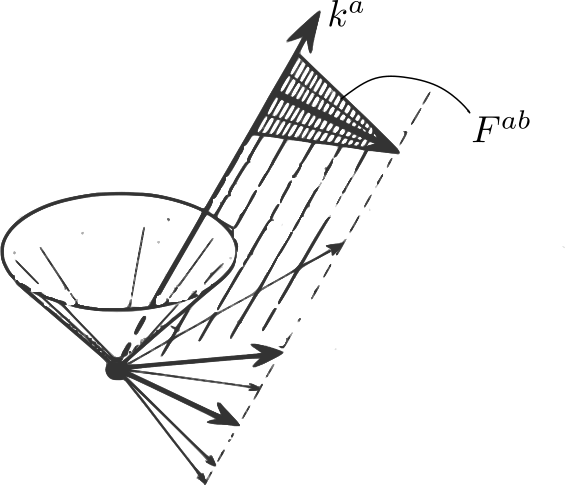
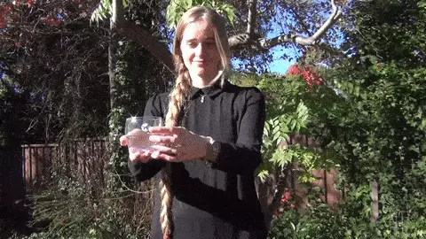
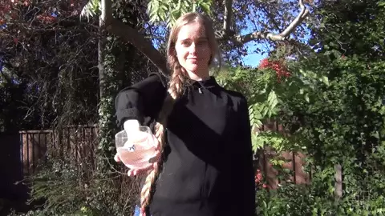
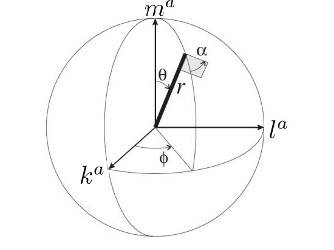

> 上一篇，引入旋量概念以及旋量代数。本篇在此基础上给出旋量的一个直观的几何解释。
>
> 本篇限定讨论闵氏空间上的旋量。
>
> 本篇的计算草稿：https://gitee.com/chaoskey/notes/blob/master/content/code/0077.ipynb

<!--more-->

## 旋量的几何解释

一个旋量可以（如图）可解释成：（1）旗杆     “焊接”    （2）旗    “加上”    （3）旗与它周围事物之间的“指向-缠绕”关系。

 

当旗绕旗杆旋转$$2\pi$$时，旗可以完全复原【（1）+（2）两部分整体可复原】，但第（3）部分无法复原，旗杆需要再转$$2\pi$$才能使（3）复原。也就是说：旗绕旗杆旋转$$2\pi$$的任意奇数倍，旋量反向；旋转$$2\pi$$的任意偶数倍，旋量复原。   

关于第（3）部分的理解，如下图（杯子(旗子)+环境(妹子)构成“指向-缠绕”）：

 

 

## 零模矢量（旗杆）

给定一个旋量$$\xi^A\in W$$，我们可以构造一个作为“旗杆”的实零四维矢量$$k^a\in V_p$$：

$$
k^a\to k^{AA'}=\xi^A\bar{\xi}^{A'}
$$

或写成分量形式【注意，第一篇中约定泡利矩阵前有因子$$1/\sqrt{2}$$】：

$$
k^\mu\sigma_\mu^{\ \ \Sigma\Sigma'}=\xi^\Sigma\bar{\xi}^{\Sigma'}\\ \quad \\ \frac{1}{\sqrt{2}}\begin{pmatrix} k^0+k^3 & k^1-ik^2 \\ k^1+ik^2 & k^0-k^3 \end{pmatrix} = \begin{pmatrix} \xi^1\bar{\xi}^{1'} & \xi^1\bar{\xi}^{2'} \\ \xi^2\bar{\xi}^{1'} & \xi^2\bar{\xi}^{2'} \end{pmatrix}
$$

右侧行列式为0，意味着$$k^a$$的确是零模矢量。此外，也可直接验证之：

$$
\begin{aligned}g_{AA'BB'}k^{AA'}k^{BB'}&=-(\epsilon_{AB}\xi^A\xi^B)(\bar{\epsilon}_{A'B'}\bar{\xi}^{A'}\bar{\xi}^{B'})\\ &=-(\xi_B\xi^B)(\bar{\xi}_{B'}\bar{\xi}^{B'})=-|\xi_B\xi^B|^2=0\end{aligned}
$$

因此可将$$\xi^A$$看成零模矢量$$k^a$$的“平方根”。 

对任意两个旋量$$\xi^A$$和$$\eta^A$$，我们有：

$$
g_{AA'BB'}\xi^A\bar{\xi}^{A'}\eta^B\bar{\eta}^{B'}=-(\xi_B\eta^B)(\bar{\xi}_{B'}\bar{\eta}^{B'})=-|\xi_B\eta^B|^2
$$

因此，任意旋量$$\xi^A$$和$$\eta^A$$所关联的零模矢量，都有一个非正内积（特指$$(-1,1,1,1)$$对应的度规），这些零模矢量躺在光锥的同一半上（我们通常称之为`未来光锥`）。所以矢量空间$$V_p$$有一个自然的时间方向。 

如果$$\eta^A$$和$$\xi^A$$相差一个相位因子【旗因子】，比如，$$\eta^A=c\xi^A,\quad |c|=1，\quad c=e^{i\alpha}$$，那么$$\eta^A$$和$$\xi^A$$关联着同一个零模矢量$$k^a$$，所以**每个零模矢量都关联着一个单参旋量族**。

## 二重矢量（旗）

为了进一步揭示“旗因子”的影响，转而研究由同一旋量$$\xi^A$$产生的实二重矢量$$F^{ab}$$：

$$
F^{ab}\to F^{AA'BB'}=\xi^A\xi^B\bar{\epsilon}^{A'B'}+\bar{\xi}^{A'}\bar{\xi}^{B'}\epsilon^{AB}
$$

这个量只有不多余6个不同分量（$$F^{\mu\upsilon}=-F^{\upsilon\mu}$$）。

对给定非0旋量$$\xi^A$$，总能找到另一个旋量$$\eta^a$$，满足：

$$
\xi_A\eta^A=1
$$

很明显，$$\{\xi^A,\eta^A\}$$构成一组基旋量，进而：

$$
\epsilon^{AB}=\xi^A\eta^B-\eta^A\xi^B
$$

于是有：

$$
\begin{aligned}F^{AA'BB'}&=\xi^A\xi^B(\bar{\xi}^{A'}\bar{\eta}^{B'}-\bar{\eta}^{A'}\bar{\xi}^{B'})+\bar{\xi}^{A'}\bar{\xi}^{B'}(\xi^A\eta^B-\eta^A\xi^B)\\ &=\xi^A\bar{\xi}^{A'}(\xi^B\bar{\eta}^{B'}+\eta^B\bar{\xi}^{B'})-(\xi^A\bar{\eta}^{A'}+\eta^A\bar{\xi}^{A'})\xi^B\bar{\xi}^{B'}\\ &=\boxed{k^{AA'}l^{BB'}-l^{AA'}k^{BB'}}\end{aligned}
$$

其中：

$$
l^{AA'}\overset{\Delta}{=}\xi^A\bar{\eta}^{A'}+\eta^A\bar{\xi}^{A'}
$$

容易验证：

$$
\overline{l^{AA'}}=l^{AA'},\quad  l^{AA'}l_{AA'}=-2,\quad k^{AA'}l_{AA'}=0
$$

即【利用矢量的旋量表示】：

$$
\overline{l^{a}}=l^{a},\quad  l^{a}l_{a}=2,\quad k^{a}l_{a}=0
$$

这说明，$$l^a$$是类空的，长度为$$\sqrt{2}$$的实四维矢量。并且和$$k^a$$正交。【在第一张图上也标记了对应的矢量】

在下面的变换下，

$$
\eta^A\to \eta^A+c\xi^A
$$

$$\{\xi^A,\eta^A\}$$始终能构成同样好基旋量，同时有：【在第一张图上也标记了对应的矢量】

$$
l^a\to l^a+(c+\bar{c})k^a
$$

因此，由$$\xi^A$$构成的旋量张量$$F^{AA'BB'}$$代表着由两个四维矢量$$k^a$$和$$l^a$$构成的一个二重矢量$$F^{ab}$$：

$$
F^{ab}=k^a l^b- l^a k^b
$$

## “指向-缠绕”

考察旋量$$\xi^A$$乘上“旗因子”$$e^{i\alpha}$$变换，则有：

$$
\xi^A_{\text{旋转}}=e^{i\alpha}\xi^A\quad \eta^A_{\text{旋转}}=e^{-i\alpha}\eta^A
$$

首先这个变换对矢量$$k^a$$没有影响，但对矢量$$l^a$$有影响（绕$$k^a$$旋转$$2\alpha$$）：

$$
\begin{aligned}l^a_{\text{旋转}}\to l^{AA'}_{\text{旋转}}&=e^{2i\alpha}\xi^A\bar{\eta}^{A'}+e^{-2i\alpha}\eta^A\bar{\xi}^{A'}\\ &=\cos 2\alpha(\xi^A\bar{\eta}^{A'}+\eta^A\bar{\xi}^{A'})+\sin 2\alpha(i\xi^A\bar{\eta}^{A'}-i\eta^A\bar{\xi}^{A'})\\  &\to  \boxed{l^a\cos 2\alpha+m^a\sin 2\alpha}\end{aligned}
$$

其中

$$
m^a\to m^{AA'}\overset{\Delta}{=}i(\xi^A\bar{\eta}^{A'}-\eta^A\bar{\xi}^{A'})
$$

$$m^a$$共享了矢量$$l^a$$的下述性质：1）实的；2）类空的；3）长度$$\sqrt{2}$$；4）与旗杆的零模四维矢量$$k^a$$正交；5）除相差$$k^a$$实倍数$$(c+\bar{c})$$外，唯一由起初的旋量$$\xi^A$$确定。  此外， $$m^a$$和$$l^a$$也是正交的。

因此，$$\{l^a,m^a\}$$为某个二维空间提供基矢，“旗的尖端”就是在此二维空间中经历了旋转，并且旋转的角度是$$2\alpha$$。

## 旋量、旗杆和旗

如果我们将$$k^a$$这个零模四维矢量想象成从地球某点O照到月球某点P的激光，那么OP在三维空间的表示如图：

进而四维矢量$$k^a$$的分量可表示成：

$$
(k^\mu)=\begin{pmatrix} k^0 \\ k^1 \\ k^2 \\ k^3  \end{pmatrix}=\begin{pmatrix} r \\ r\sin \theta \cos \phi \\ r\sin \theta \sin \phi \\ r \cos \theta  \end{pmatrix}
$$

根据旋量和矢量的关系，可解出对应旋量$$\xi^A$$的分量（精确到相差一个不确定“旗因子”）：

$$
(\xi^\Sigma)=\begin{pmatrix} \xi^1 \\ \xi^2  \end{pmatrix}=\sqrt[4]{2}\sqrt{r}\begin{pmatrix} \cos\frac{\theta}{2}\ e^{-i(\phi-\alpha)/2} \\ \sin\frac{\theta}{2}\ e^{i(\phi+\alpha)/2}   \end{pmatrix}
$$

旋量$$\eta^A$$可由$$\xi^A$$确定（精确到可加一个$$\xi^A$$的倍数）：

$$
(\eta^\Sigma)=\begin{pmatrix} \eta^1 \\ \eta^2  \end{pmatrix}=\dfrac{1}{\sqrt[4]{2}\sqrt{r}}\begin{pmatrix} -\sin\frac{\theta}{2}\ e^{-i(\phi+\alpha)/2} \\ \cos\frac{\theta}{2}\ e^{i(\phi-\alpha)/2}   \end{pmatrix}
$$

利用四维矢量$$l^a$$和旋量$$l^{AA'}$$的关系：
$$
l^\mu\sigma_\mu^{\ \ AA'}= l^{AA'}=\xi^A\bar{\eta}^{A'}+\eta^A\bar{\xi}^{A'}\\ \text{改写成分量形式}\\ \frac{1}{\sqrt{2}}\begin{pmatrix} l^0+l^3 & l^1-il^2 \\ l^1+il^2 & l^0-l^3 \end{pmatrix} =\begin{pmatrix} \xi^1\bar{\eta}^{1'} & \xi^1\bar{\eta}^{2'} \\ \xi^2\bar{\eta}^{1'} & \xi^2\bar{\eta}^{2'} \end{pmatrix}+\begin{pmatrix} \eta^1\bar{\xi}^{1'} & \eta^1\bar{\xi}^{2'} \\ \eta^2\bar{\xi}^{1'} & \eta^2\bar{\xi}^{2'} \end{pmatrix}
$$

将旋量分量表达式代入，并解出四维矢量$$l^a$$的所有分量：

$$
(l^\mu)=\begin{pmatrix} l^0 \\ l^1 \\ l^2 \\ l^3  \end{pmatrix}=\sqrt{2}\begin{pmatrix} 0 \\ \cos\theta\cos\phi\cos\alpha+\sin\phi\sin\alpha \\ \cos\theta\sin\phi\cos\alpha-\cos\phi\sin\alpha \\ -\sin \theta \cos \alpha  \end{pmatrix}
$$

最后，不难算出二重矢量$$F^{ab}$$（“旗”）的分量：

$$
F^{\mu\upsilon}=k^\mu l^\upsilon- l^\mu k^\upsilon
$$

-----

后续内容：旋量场及其上的分析
