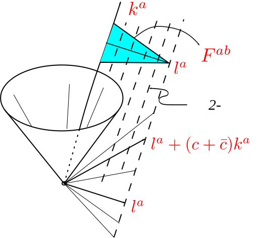

> 带度规流形任意点的切空间和平直空间没有数学上的差别，进而平直空间上发展起来的旋量都是可以移到带度规流形上而无需改变。
>
> 学习中....

<!--more-->

## 旋量的几何解释

一个旋量可以（如图）可解释成：（1）旗杆     “焊接”    （2）旗    “加上”    （3）旗与它周围事物之间的“指向-缠绕”关系。

 

当旗绕旗杆旋转$$2\pi$$时，旗可以完全复原【（1）+（2）两部分整体可复原】，但第（3）部分无法复原，旗杆需要再转$$2\pi$$才能使（3）复原。也就是说：旗绕旗杆旋转$$2\pi$$的任意奇数倍，旋量反向；旋转$$2\pi$$的任意偶数倍，旋量复原。   

关于第（3）部分的理解，如下图（杯子(旗子)+环境(妹子)构成“指向-缠绕”）：

 

 

## 零模矢量（旗杆）

给定一个旋量$$\xi^A\in W$$，我们可以构造一个作为“旗杆”的实零四维矢量$$k^a\in V_p$$：
$$
k^a\to k^{AA'}=\xi^A\bar{\xi}^{A'}
$$
或写成分量形式：
$$
k^\mu\sigma_\mu^{\ \ \Sigma\Sigma'}=\xi^\Sigma\bar{\xi}^{\Sigma'}\\ \quad \\ \begin{pmatrix} k^0+k^3 & k^1-ik^2 \\ k^1+ik^2 & k^0-k^3 \end{pmatrix} = \begin{pmatrix} \xi^1\bar{\xi}^{1'} & \xi^1\bar{\xi}^{2'} \\ \xi^2\bar{\xi}^{1'} & \xi^2\bar{\xi}^{2'} \end{pmatrix}
$$
右侧行列式为0，意味着$$k^a$$的确是零模矢量。此外，也可直接验证之：
$$
\begin{aligned}g_{AA'BB'}k^{AA'}k^{BB'}&=-(\epsilon_{AB}\xi^A\xi^B)(\bar{\epsilon}_{A'B'}\bar{\xi}^{A'}\bar{\xi}^{B'})\\ &=-(\xi_B\xi^B)(\bar{\xi}_{B'}\bar{\xi}^{B'})=-|\xi_B\xi^B|^2=0\end{aligned}
$$
因此可将$$\xi^A$$看成零模矢量$$k^a$$的“平方根”。 

对任意两个旋量$$\xi^A$$和$$\eta^A$$，我们有：
$$
g_{AA'BB'}\xi^A\bar{\xi}^{A'}\eta^B\bar{\eta}^{B'}=-(\xi_B\eta^B)(\bar{\xi}_{B'}\bar{\eta}^{B'})=-|\xi_B\eta^B|^2
$$
因此，任意旋量$$\xi^A$$和$$\eta^A$$所关联的零模矢量，都有一个非正内积（特指$$(-1,1,1,1)$$对应的度规），这些零模矢量躺在光锥的同一半上（我们通常称之为`未来光锥`）。所以矢量空间$$V_p$$有一个自然的时间方向。 

如果$$\eta^A$$和$$\xi^A$$相差一个相位因子【旗因子】，比如，$$\eta^A=c\xi^A,\quad |c|=1，\quad c=e^{i\alpha}$$，那么$$\eta^A$$和$$\xi^A$$关联着同一个零模矢量$$k^a$$，所以**每个零模矢量都关联着一个单参旋量族**。

## 二重矢量（旗）及其“指向-缠绕”

为了进一步揭示“旗因子”的影响，转而研究由同一旋量$$\xi^A$$产生的实二重矢量$$F^{ab}$$：
$$
F^{ab}\to F^{AA'BB'}=\xi^A\xi^B\bar{\epsilon}^{A'B'}+\bar{\xi}^{A'}\bar{\xi}^{B'}\epsilon^{AB}
$$
从

曾祥飞----411303198904081018

此外，考虑一个实旋量张量：
$$
e_{AA'BB'CC'DD'}=i(\epsilon_{AB}\epsilon_{CD}\bar{\epsilon}_{A'C'}\bar{\epsilon}_{B'D'}-\bar{\epsilon}_{A'B'}\bar{\epsilon}_{C'D'}\epsilon_{AC}\epsilon_{BD})
$$
定义了一个$$V$$上的全反称的(0,4)型张量，并给出了$$V$$的一个定向。

$$V$$上的(2,0)型张量来看，$$F^{AA'BB'}$$是反称的，比如：$$F^{AA'BB'}=-F^{BB'AA'}$$。此外，$$F^{AA'BB'}$$可写成形如：
$$
F^{AA'BB'}=k^{AA'}m^{BB'}-m^{AA'}k^{BB'}
$$
其中，$$k^{AA'}$$是零模的，$$m^{AA'}$$正交于$$k^{AA'}$$。我们称为旋量$$\xi^A$$所关联的`零旗`(`null flag`)。两个旋量$$\eta^A$$和$$\xi^A$$关联同一个零旗，当且仅当，两者最多相差一个负号，即$$\eta^A=\pm\xi^A$$。在$$V$$上是不可能构造出一个旋量$$\xi^A$$关联的张量，使得能够区分$$\xi^A$$和$$-\xi^A$$。

现在我们回到时空的各种场的一般问题，最早是出现在量子理论中。收到前面讨论的引导，我们将寻求希尔伯特空间上群$$\mathrm{ISL}(2,\mathbb{C})$$的幺正表示。我们现在将时空上定义旋量场和旋量张量场，满足$$\mathrm{ISL}(2,\mathbb{C})$$下的"变换律"。通过这些场构造希尔伯特空间（随后我们将这样做），这些变换律可生成想要的$$\mathrm{ISL}(2,\mathbb{C})$$表示。

我们在闵氏时空$$(\mathbb{R}^4,\eta_{ab})$$上定义一个旋量场，简单地说，就是时空到旋量空间$$W$$的映射。类似地，旋量张量场可定义称时空到$$W$$上的张量空间的映射。我们按如下方法定义旋量上$$\mathrm{ISL}(2,\mathbb{C})$$上的一个操作。任意$$g\in \mathrm{ISL}(2,\mathbb{C})$$关联一个变换$$\xi^A(x)\to L^A_{\ \ B}\xi^B[P^{-1}(x)]$$，其中，$$L^A_{\ \ B}\in \mathrm{SL}(2,\mathbb{C})$$是$$g$$的"齐次部分"，$$P$$是$$G$$关联的庞加莱群元素。用这种方法，通过强算，得到旋量场的矢量空间上的$$\mathrm{ISL}(2,\mathbb{C})$$表示。然而，这种表示并不符合庞加莱群的真实表示。因为对每个庞加莱元素$$P$$，都有两个$$\mathrm{ISL}(2,\mathbb{C})$$元素。在庞加莱群元$$P$$关联的旋量场上，可以定义一个变换$$P^*$$，但会遇到符号任意性：
$$
(P^*\xi)^A(x)=\pm L^A_{\ \ B}\xi^B[P^{-1}(x)]
$$

