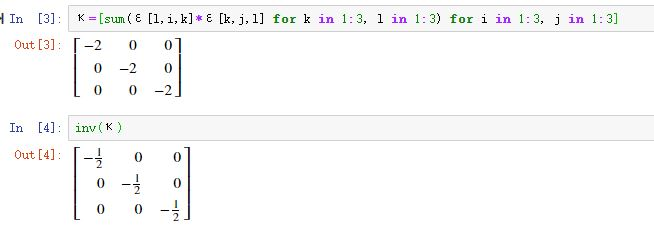

> 同一李群（李代数）有无数表示，本篇侧重`伴随表示`。
>
> 对半单李代数而言，Killing型就是李代数上的度规，称作嘉当度规。
>
>  Casimir算符，就是和李代数任意元素对易的算符。

<!--more-->

## 群的伴随同构

群$G$关于群元$g\in G$`群伴随同构`$I_g$

$$
\boxed{\begin{aligned}\textcolor{blue}{I_g}:&G\overset{\textcolor{red}{同构}}{\to} G \\ &h \mapsto \textcolor{blue}{I_g(h)}\overset{\Delta}{=}\textcolor{red}{ghg^{-1}} \qquad I_g(e)=e \end{aligned}}
$$

所以，这是一个单位元不变的群自同构。

## 李群的伴随可逆线性变换

特别对李群而言，可在单位元$e$处，通过$I_g$诱导出一个推前映射$\mathscr{A\!d}_g\overset{\Delta}{=}I_{g*}$

$$
\boxed{\begin{aligned}\textcolor{blue}{\mathscr{A\!d}_g}:&\mathscr{G}\overset{\textcolor{red}{线性可逆}}{\to} \mathscr{G} \\ &A \mapsto \textcolor{blue}{\mathscr{A\!d}_g(A)}=\textcolor{red}{\left.\frac{d}{dt}\right|_{t=0}\left[g\exp(tA)g^{-1}\right]}\end{aligned}}
$$

因为

$$
\begin{aligned}&\left.\frac{d}{dt}\right|_{t=0}\left[g\exp(tA)g^{-1}\right]\\ =&\left.\frac{d}{dt}\right|_{t=0}I_g(\exp(tA))\qquad \textcolor{red}{群G的伴随同构}\\ =&I_{g*}\left(\left.\frac{d}{dt}\right|_{t=0}\exp(tA)\right)\qquad \textcolor{red}{推前映射的性质}\\ =&\mathscr{A\!d}_g(A)\qquad \textcolor{red}{定义及切矢}\end{aligned}
$$

或者说

$$
\boxed{\exp(t \mathscr{A\!d}_g(A))=g\exp(t A)g^{-1}}
$$

上面这些关系可图解为


容易看出：

1）$\mathscr{A\!d}_g$是一个线性变换；【因为$I_{g*}$作为推前映射是线性的】

2）$\mathscr{A\!d}_g$是一个可逆变换。【因为$I_g$是同构映射，进而$I_{g*}$是可逆的】

## 李群的伴随表示

因为$\mathscr{A\!d}_g$是可逆线性变换，即$\mathscr{A\!d}_g\in \mathscr{T}_\mathscr{G}(1,1)$，所以$\mathscr{A\!d}$也可以看成一个映射

$$
\boxed{\begin{aligned}\textcolor{blue}{\mathscr{A\!d}}:&G\overset{\textcolor{red}{同态}}{\to} \mathscr{T}_\mathscr{G}(1,1)\cong \mathrm{GL}(m,\mathbb{R}) \\ &g \mapsto \textcolor{blue}{\mathscr{A\!d}(g)}\overset{\Delta}{=}\textcolor{red}{\mathscr{A\!d}_g}\end{aligned}}
$$

容易看出：

1）$\mathscr{A\!d}$是一个同态映射；【因为推前映射有性质：$(\psi\circ\phi)_*=\psi_*\circ\phi_*$】

2）任选可逆$\mathscr{T}_\mathscr{G}(1,1)$的一组基底后，同构于$\mathrm{GL}(m,\mathbb{R})$。

所以，$\mathscr{A\!d}$称为李群$G$的`伴随表示`。

## 李代数的伴随线性变换

利用李代数上的李括号定义一个类似$\mathscr{A\!d}_a$的变换$\mathscr{ad}_A$：

$$
\boxed{\begin{aligned}\textcolor{blue}{\mathrm{ad}_A}:&\mathscr{G}\overset{\textcolor{red}{线性}}{\to} \mathscr{G} \\ &B \mapsto \textcolor{blue}{\mathrm{ad}_A(B)}\overset{\Delta}{=}\textcolor{red}{[A,B]}\end{aligned}}
$$

由李括号的双线性性，容易看出$\mathrm{ad}_A$是切空间（李代数）上的线性变换，因此可用$(1,1)$型张量表示，此外，李代数上的元素自然也是矢量。进而，可用抽象指标重写上面这个映射：

$$
(\mathrm{ad}_A)^c_{\ \ b}B^b=[A,B]^c=C^c_{\ \ ab}A^a B^b
$$

进而可抛掉被作用对象【其中$\textcolor{red}{C^c_{\ \ ab}}$是李代数$\mathscr{G}$的结构常数】：

$$
\boxed{(\textcolor{blue}{\mathrm{ad}_A})^c_{\ \ b}=A^a\textcolor{red}{C^c_{\ \ ab}}}
$$

$\mathscr{A\!d}_g$和$\mathrm{ad}_A$有一个重要的关系：

$$
\boxed{\mathscr{A\!d}_{\exp(A)}=\delta+\mathrm{ad}_A+\frac{1}{2!}(\mathrm{ad}_A)^2+\frac{1}{3!}(\mathrm{ad}_A)^3+\dots}
$$

其中，$\delta$代表恒等映射（$\delta^a_{\ \ b}$），$(\mathrm{ad}_A)^2$代表恒等映射（$(\mathrm{ad}_A)^a_{\ \ c}(\mathrm{ad}_A)^c_{\ \ b}$），等等。

因为有这重关系，所以线性变换$\mathrm{ad}_A$被称作`李代数的伴随线性变换`。注意，这个线性变换没有可逆的要求。

## 李代数的伴随表示

仿照群额伴随表示的分析套路，因为$\mathrm{Ad}_A$是线性变换（不要求可逆），即$\mathrm{ad}_A\in \mathscr{T}_\mathscr{G}(1,1)$，所以$\mathrm{ad}$也可以看成一个映射

$$
\boxed{\begin{aligned}\textcolor{blue}{\mathrm{ad}}:&\mathscr{G}\overset{\textcolor{red}{线性同态}}{\to} \mathscr{T}_\mathscr{G}(1,1)\cong \mathscr{G\!L}(m,\mathbb{R}) \\ &A \mapsto \textcolor{blue}{\mathrm{ad}(A)}\overset{\Delta}{=}\textcolor{red}{\mathrm{ad}_A}\end{aligned}}
$$

注意，这里的$\mathscr{T}_\mathscr{G}(1,1)$不要求可逆，所以同构于$\mathscr{G\!L}(m,\mathbb{R}) $。此外还容易看出：

1）$\mathrm{ad}$是线性映射；【利用李括号的双线性易证】

2）$\mathrm{ad}$是同态映射。【利用李括号雅可比恒等式易证保李括号】

所以，$\mathrm{ad}$称为李代数$\mathscr{G}$的`伴随表示`。

至此，我们可发现一个重要而自然的关系：

$$
\boxed{\mathscr{A\!d}_*=\mathrm{ad}}
$$

意思是：**李群伴随表示的推前映射就是对应李代数伴随表示**。

## 各种伴随映射的关系


## Killing型

利用李代数的伴随变$\mathrm{ad}_A$换可以定义`Killing型`

$$
\begin{aligned}\kappa:&\mathscr{G}\times \mathscr{G}\to \mathbb{R} \\ &(A,B)\mapsto \kappa(A,B)\overset{\Delta}{=}\mathrm{tr}(\mathrm{ad}_A\mathrm{ad}_B)\\ &\qquad \qquad =(\mathrm{ad}_A)^a_{\ \ b}(\mathrm{ad}_B)^b_{\ \ a}\end{aligned}
$$

如果如下性质：

1）$\kappa(A,B)=\kappa(B,A)$；【利用两个方阵积的“迹”的可交换性易得】

2）$\kappa([A,B],C)=\kappa(A,[B,C])$；【利用多个方阵乘积的“迹”的可轮换性易证】

3）$\kappa(A,B)$满足双线性性。【易验证】

利用李代数结构常数的定义，并在抽象指标表示下，容易推导出：

$$
\boxed{\kappa_{cd}=C^a_{\ \ cb} C^b_{\ \ da}}
$$

关于$\kappa$的非退化性，我们有一个结论【这里我只关心结论不关心证明】：

> $\kappa$非退化的充要条件$\mathscr{G}$是为半单李代数。

所以，半单李代数$\mathscr{G}$的Killing型$\kappa_{ab}$可充当$\mathscr{G}$的度规，称为`嘉当度规`。

需要注意的是，$\kappa_{ab}$的号差因$\mathscr{G}$而异，但我们关心的物理中遇到的李代数的$\kappa_{ab}$多半是负定的，因而存在正交归一基底$\{(E_\mu)^a\}$，使得

$$
\boxed{\kappa_{\mu\upsilon}=\kappa_{ab}(E_\mu)^a(E_\upsilon)^b=-\delta_{\mu\upsilon}}
$$

正如普通的度规，在李代数空间上，嘉当度规$\kappa_{ab}$也可用来升降指标，比如：

$$
C_{\rho\mu\upsilon}=\kappa_{\rho\sigma}C^\sigma_{\ \ \mu\upsilon}
$$

进而，关于结构常数，降指标后是全反称额：

$$
\boxed{C_{\rho\mu\upsilon}=C_{[\rho\mu\upsilon]}}
$$

## Casimir算符

如果只关心半单李代数（因为存在嘉当度规），可以定义`Casimir算符`。

$$
\boxed{C=\kappa^{\mu\upsilon}E_\mu E_\upsilon}
$$

从矢量角度看，基底可如前面记作$(E_\mu)^a$，而矢量也可以看成线性映射或算符，所以这里去掉了抽象指标。比如：$\left(\frac{\partial}{\partial t}\right)^a$实际对应算符$\frac{\partial}{\partial t}$。 

进而，可计算Casimir算符和任意基底$E_\rho$对易子：

$$
\begin{aligned}\ [C,E_\rho]&=\kappa^{\mu\upsilon}[E_\mu E_\upsilon,E_\rho]\\ &=\kappa^{\mu\upsilon}E_\mu [E_\upsilon , E_\rho]+\kappa^{\mu\upsilon}[E_\mu,E_\rho]E_\upsilon\\ &=\kappa^{\mu\upsilon}C^\tau_{\ \ \upsilon\rho}E_\mu E_\tau+\kappa^{\mu\upsilon}C^\tau_{\ \ \mu\rho}E_\tau E_\upsilon \qquad \textcolor{red}{结构常数的定义}\\ &=\kappa^{\mu\upsilon}C^\tau_{\ \ \upsilon\rho}E_\mu E_\tau+\kappa^{\upsilon\mu}C^\tau_{\ \ \upsilon\rho}E_\tau E_\mu\\ &=\kappa^{\mu\upsilon}C^\tau_{\ \ \upsilon\rho}(E_\mu E_\tau+E_\tau E_\mu)\\ &=2\kappa^{\mu\upsilon}\kappa^{\lambda\tau} C_{\lambda\upsilon\rho}E_{(\mu} E_{\tau)} \qquad \textcolor{red}{上行括号内是对称的}\\ &=2\kappa^{\mu\upsilon}\kappa^{\lambda\tau}E_{(\mu} E_{\tau)}C_{[\lambda\upsilon\rho]} \qquad \textcolor{red}{下指标结构常数全反称性}\\ &=2\kappa^{(\mu|\upsilon}\kappa^{\lambda|\tau)}E_{\mu} E_{\tau}C_{[\lambda\upsilon\rho]} \qquad \textcolor{red}{括号全缩并时可传染}\\ &=2\kappa^{\mu(\upsilon}\kappa^{\lambda)\tau}E_{\mu} E_{\tau}C_{[\lambda\upsilon\rho]}=0 \qquad \textcolor{red}{异种括号缩并为零}   \end{aligned}
$$

即：

$$
\boxed{[C,E_\rho]=0}
$$

这说明：

> 半单李代数$\mathscr{G}$上的Casimir算符与$\mathscr{G}$的一切基底对易，进而与$\mathscr{G}$的一切元素对易。

$$
\boxed{[C,\mathscr{G}]=0}
$$

## 求SO(3)的李代数的Casimir算符

我们知道李代数$\mathscr{SO}(3)$的三个基底算符（以前的笔记计算过）：

$$
E_1=z\partial_y-y\partial_z\\ E_2=x\partial_z-z\partial_x \\ E_3=y\partial_x-x\partial_y
$$

对应的结构常数（以前的笔记计算过）：

$$
[E_i,E_j]=\varepsilon^k_{\ \ ij}E_k\\ C^k_{\ \ ij}=\varepsilon^k_{\ \ ij}
$$

进而容易算出嘉当度规：

$$
\kappa_{ij}=-2\delta_{ij}\quad \kappa^{ij}=-\frac{1}{2}\delta^{ij}
$$

因为（我直接用julia计算）

```julia
using SymPy
using LinearAlgebra

#  Levi-Civita记号
ε= [ Sym((i≠j && i≠k && j≠k )*       #  存在重复指标，取0
    (-1)^(sum([i,j,k][σ]>[i,j,k][ρ]   
            for σ in 1:3,ρ in  1:3  if σ<ρ) % 2)) # 计算逆序数。偶数取1，奇数取-1
    for  i in 1:3, j in 1:3, k in 1:3 ] ;

# 计算嘉当度规
κ=[sum(ε[l,i,k]*ε[k,j,l] for k in 1:3, l in 1:3) for i in 1:3, j in 1:3]
```



进而容易算出Casimir算符

$$
C=\kappa^{ij}E_iE_j=-\frac{1}{2}\delta^{ij}E_iE_j=-\frac{1}{2}((E_1)^2+(E_2)^2+(E_3)^2)
$$

## 广义Casimir算符

可以定义n阶的广义Casimir算符

$$
I_n=C^{\beta_1}_{\ \ \alpha_1\beta_2}C^{\beta_2}_{\ \ \alpha_2\beta_3}\dots C^{\beta_n}_{\ \ \alpha_n\beta_1}E^{\alpha_1}E^{\alpha_2}\dots E^{\alpha_n},\quad n\ge2 \\ E^\alpha=\kappa^{\alpha\beta}E_\beta
$$

可以证明与半单李代数中的一切元素对易，但它们并不是独立的。

首先，二阶Casimir算符，就是普通的Casimir算符

$$
I_2=C
$$

更特别地，对$\mathscr{SO}(3)$李代数而言

$$
I_3=-2I_2=-2C
$$

> 后面这三段我没细研究，先把结论写出来，回头研究。

事实上，$\mathscr{SO}(3)$上所有的广义Casimir算符$I_n(n\ge2)$都正比于$C$，因此$\mathscr{SO}(3)$的独立Casimir算符只有一个$C$。

一般而言，秩为$l$的半单李代数有$l$个独立Casimir算符。

正如$\mathscr{SO}(3)$代数中Casimir算符$C(\sim J^2)$的本征值$j(j+1)$可用来对$\mathrm{SO}(3)$群的不可约表示进行编号，广义Casimir算符的本征值全体可以用来对不可约表示进行完全编号。因此，Casimir算符的寻找是重要的。


