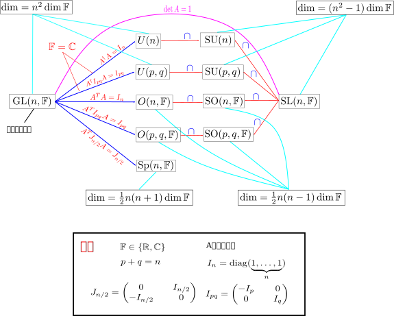
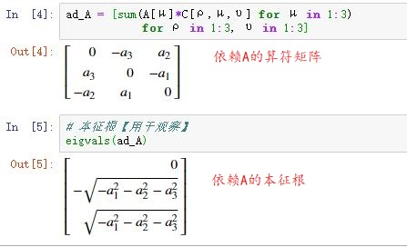
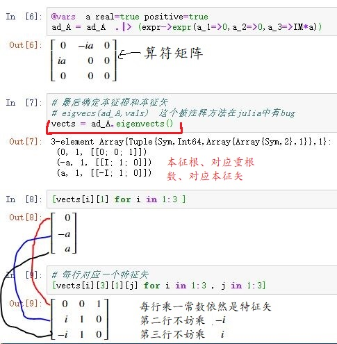

> 用图示方法梳理典型群。
>
> 一个半单李代数的结构由一组`根向量`决定。
>
> 所谓`根矢量`，就是在`标准形式`下，非零本征根在`零根空间`中的分量。
>
> 所谓`标准形式`，选择某个特定基底的李代数表示，这组特定基底满足：具有最多非重根数（实数根）。
>
> 所谓`零根空间`，就是零本征根（可能有重根）的所有本征矢量张成的空间。
>
> 所谓`根系`，就是半单李代数标准形式下的所有本征根，有时简称“根”。如果没有加粗，表示实数根$$\alpha$$；如果加粗了，表示根矢量$$\boldsymbol{\alpha}$$。
>
> 嗅到一股量子力学的味道。
>
> 最后是根矢量图示法。
>
> 本篇草稿： https://gitee.com/chaoskey/notes/blob/master/code/0083.ipynb

<!--more-->

## 典型群

## 一些概念的补缺

> 只补充我以前笔记尚未涉及的、我认为必要的。 用纯语言进行提要。

所谓李代数的`理想`,，就是一个“好的”李子代数。所谓“好的”，这个子代数和整个李代数的李括号封闭到这个子代数自身。所以，这个`理想`又被称作`不变李子代数`。

所谓李代数的`中心`，就是一个极大可交换理想，即所有的两个元素的李括号等于0.

关于李代数的`伴随表示`，上一篇笔记有详细的介绍。

所谓`单李代数`，就是指“单纯的”李代数。所谓“单纯的”，就是指不含真理想。

所谓`半单李代数`，就是指“半单纯的”李代数。所谓“半单纯的”，就是除$$\{0\}$$外，不含可交换理想（即，阿贝尔理想）。

`单纯李代数`必定是`半单李代数`，反过来不一定正确。 有一个定理如下：

> $$\mathscr{G}$$是半单李代数，当且仅当，$$\mathscr{G}$$可表示为一些理想的直和，并且这些理想都是单李代数。

 还有一个定理，可更方便判断李代数是否是半单的，上一篇笔记也有涉及。

> 李代数是半单的，当且仅当，对应的Killing型式非退化的，即存在嘉当度规。

## 各种李代数的相互关系

> 由于我只关心半单李代数，这里只列各种李代数的关系，方便有个整体印象。其它我不关心的李代数，请自行翻书。

## 量子力学与李代数

> 以量子力学为例，来概要说明李代数的重要性。

量子力学的数学结构与泛函分析和李代数理论密切相关，其中所涉及的幺正变换（酉变换）还会涉及李群的表示论---- 更有趣的式，量子力学中的很多方法和结果都可以在半单李代数理论中找到对应，比如：

- 力学量完全集 $$\longleftrightarrow$$嘉当子代数的基；
- "好"量子数 $$\longleftrightarrow$$权和最高权
- 力学量完全集的共同本征矢量 $$\longleftrightarrow$$权空间中的元素；
- 升、降算符 $$\longleftrightarrow$$根向量；

## 半单李代数的标准形式

考虑半单李代数$$\mathscr{G}$$的一组基底$$\{(E_\mu)^a\}$$，$$\mathscr{G}$$中的任意一个元素$$A^a$$可表示成

$$
A^a=A^\mu (E_\mu)^a
$$

考虑另一个元素

$$
X^a=X^\mu (E_\mu)^a
$$

满足：

$$
[A,X]^a=\lambda X^a
$$

可改写伴随变换(`算符`)$$\mathrm{ad}_A$$本征方程的形式

$$
\boxed{(\mathrm{ad}_A)^a_{\ \ b} X^b=\lambda X^a},\quad (\mathrm{ad}_A)^a_{\ \ b}=A^c C^a_{\ \ cb}
$$

对应的分量形式：【方便具体计算】

$$
A^\mu C^\rho_{\ \ \mu\upsilon} X^\upsilon=\lambda X^\rho
$$

注意到：虽然本征方程的本征根和本征矢取决于的$$A^a$$选择，但如果我们附加一个要求：**这个特征方程有最大可能的非重根数（实数根）**，那么不难想到：可以在某种程度上确定$$A^a$$及其对应的本征根和本征矢。

实际上，有一个重要的基本定理--**嘉当定理**，描述了这种情况下本征根的性质：

> 设选择一个$$A^a\in \mathscr{G}$$，使得上面这个本征方程有最大的非重根数(实数根)，那么对半单李代数而言，只有0根可能是重根，其它非零根不可能是重根。

## 求标准形式的一个例子

现在以$$\mathscr{G}=\mathscr{SO}(3)$$为例，求这种情况下的$$A^a$$及其对应的本征根和本征矢量。【用`Julia`求解，具体看我的草稿】

首先，求解一般情况下的本征根（复数域）

然后，为了确保出现最大可能非重根数（实数根），根号内必取正，于是可选择特定$$A^\mu$$：$$a_1=0,a_2=0,a_3=i\  a,\quad a>0$$，进而可算出对应的本征根和本征矢量

最后，可写出三个本征根及其本征矢量

$$
\begin{aligned}A^a&=i\ \alpha (E_3)^a\\ \quad \\ (K_1)^a&=(E_3)^a\qquad \qquad \quad [A,K_1]^a=0 \\ (H_{\pm \alpha})^a&=(E_1)^a\pm i\ (E_2)^a\quad [A,H_{\pm \alpha}]^a=\pm \alpha (H_{\pm \alpha})^a\end{aligned}
$$

所以，$$\mathscr{SO}(3)$$标准形式基底为：【随后的段落将解释标准形式的本征矢量为何要用$$K,H$$两个符号区分】

$$
\{(K_1)^a,(H_{\pm\alpha})^a\}
$$

## 嘉当李子代数（零根空间）

> 有了上面这个具体例子提供的感性认识下，我们可以继续讨论。

在这个标准形式下，如果0的重根数（简并度）为$$l$$，那么称$$l$$为`半单李代数的秩`。对应$$l$$个线性无关的本征矢$$\{(K_i)^a\}$$，并且可张成李代数$$\mathscr{G}$$的一个$$l$$维`零根空间`

$$
\boxed{\mathscr{K}=\mathrm{span}(\{(K_i)^a\})}\\ \quad \\ [A,\mathscr{K}]^a=0\quad \boxed{[A,K_i]^a=(\mathrm{ad}_A)^a_{\ \ b}(K_i)^b=0},\quad i=1,\dots,l
$$

此外，不难验证，这个零根空间$$\mathscr{K}$$满足李括号的雅可比恒等式，进而$$\mathscr{K}$$是$$\mathscr{G}$$的李子代数，称之为`嘉当子代数`，这是一个阿贝尔李子代数。

根据嘉当定理，标准形式下，非0根不可能出现重根，所以$$\alpha$$根对应的本征矢不妨记作$$(H_\alpha)^a$$

$$
\boxed{[A,H_\alpha]^a=(\mathrm{ad}_A)^a_{\ \ b}(H_\alpha)^b=\alpha (H_\alpha)^a}
$$

## 标准形式下的结构常数

因为$$[A,K_i]^a=0,\quad i=1,\dots,l$$，所以在标准形式下，我们选择的特定$$A^a$$可用零根空间的基底展开

$$
\boxed{A^a=\chi^i(K_i)^a}
$$

容易推导出：

$$
\boxed{\begin{aligned}(\mathrm{ad}_A)^a_{\ \ b} [K_i,K_i]^b&=0\\(\mathrm{ad}_A)^a_{\ \ b} [K_i,H_\alpha]^b&= \alpha [K_i,H_\alpha]^a\\(\mathrm{ad}_A)^a_{\ \ b} [H_\alpha,H_\beta]^b&= (\alpha+\beta) [H_\alpha,H_\beta]^a\end{aligned}}
$$

这意味着，$$[K_i,K_i]^a,[K_i,H_\alpha]^a,[H_\alpha,H_\beta]^b$$，这三个李括号也都算符$$\mathrm{ad}_A$$的本征矢。根据嘉当定理，非零本征根是非简并的，进而

$$
[K_i,H_\alpha]^a\propto (H_\alpha)^a\\ [H_\alpha,H_\beta]^a\propto (H_{\alpha+\beta})^a,\quad \alpha+\beta\ne0
$$

于是有（分别选取比例系数$$\alpha_i,h^{\alpha+\beta}_{\ \ \quad \alpha\beta}$$后）

$$
\begin{aligned}\ [K_i,K_j]^a&=0\\ \ [K_i,H_\alpha]^a&= \alpha_i (H_\alpha)^a\\ \ [H_\alpha,H_\beta]^a&= h^{\alpha+\beta}_{\ \ \quad \alpha\beta}(H_{\alpha+\beta})^a,\quad \alpha+\beta\ne 0\\ \ [H_\alpha,H_{-\alpha}]^a&= h^i_{\ \alpha,-\alpha}(K_i)^a\end{aligned}\\  \boxed{\alpha=\chi^i\alpha_i}
$$

这样，我们就可以把$$\alpha_i,\quad i=1,\dots,l$$看作是$$l$$维零根空间的一个矢量的分量，$$\chi^i$$则可以看成这个矢量空间的基，这样就把一个作为实数的根看成是一个矢量，称为`根矢量`。

可完整写出这个标准形式下的李代数结构常数

$$
\boxed{\begin{aligned}C^\tau_{\ \ ij}&=0\\ C^\tau_{\ \ i\alpha}&=\alpha_i\delta^\tau_{\ \ \alpha}\\ \ C^\tau_{\ \ \alpha\beta}&= h^{\alpha+\beta}_{\ \ \quad \alpha\beta}\delta^\tau_{\ \ \alpha+\beta} \end{aligned}}
$$

## 标准形式下本征根的对称性

通过反证法，并利用上面的关系取$$\beta=-\alpha$$，不难证明下面这个定理

> 一个半单李代数，若$$\alpha$$是非零实根，那么$$(-\alpha)$$也一定是它的根。

## 标准形式的归一化

标准型的所有独立本征基底可记作$$\left\{(K_i)^a,(H_{\alpha})^a\right\}$$，根据这一基底下的结构常数，可算出半单李代数的嘉当度规分量$$\kappa_{\mu\upsilon}$$

$$
\begin{aligned}\kappa_{\mu\upsilon}&=C^\rho_{\ \ \mu\sigma}C^\sigma_{\ \ \upsilon\rho}\\ &= C^i_{\ \ \mu j}C^j_{\ \ \upsilon i}+C^\alpha_{\ \ \mu j}C^j_{\ \ \upsilon\alpha}+C^i_{\ \ \mu\beta}C^\beta_{\ \ \upsilon i}+C^\alpha_{\ \ \mu\beta}C^\beta_{\ \ \upsilon\alpha} \end{aligned}
$$

这里对指标作个约定（前面事实上已经用了这个约定）：用$$i,j,k$$表示0根基底对应的指标，$$\alpha,\beta,\gamma$$表示非0根，并且用根本身作为基底对应的指标。

零根空间上的嘉当度规分量

$$
\kappa_{ij}=C^\alpha_{\ \ i\beta}C^\beta_{\ \ j\alpha}=\boxed{(n-l)\alpha_i\alpha_j}
$$

零根基底和非零根基底对应的嘉当度规分量

$$
\kappa_{k\gamma}= C^i_{\ \ k\beta}C^\beta_{\ \ \gamma i}+C^\alpha_{\ \ k\beta}C^\beta_{\ \ \gamma\alpha}= -\alpha_i\alpha_k\delta^\tau_{\ \ \gamma}+\alpha_k h^{\gamma+\alpha}_{\ \ \quad \gamma\alpha}\delta^\alpha_{\ \ \alpha+\gamma}=0
$$

非零根基底间的嘉当度规分量

$$
\begin{aligned}\kappa_{\gamma\zeta}&= C^i_{\ \ \gamma j}C^j_{\ \ \zeta i}+C^\alpha_{\ \ \gamma j}C^j_{\ \ \zeta\alpha}+C^i_{\ \ \gamma\beta}C^\beta_{\ \ \zeta i}+C^\alpha_{\ \ \gamma\beta}C^\beta_{\ \ \zeta\alpha}\\ &= C^i_{\ \ j\gamma}C^j_{\ \ i\zeta}-C^\alpha_{\ \ j\gamma}C^j_{\ \ \zeta\alpha}-C^i_{\ \ \gamma\beta}C^\beta_{\ \ i\zeta}+C^\alpha_{\ \ \gamma\beta}C^\beta_{\ \ \zeta\alpha}\\ &= \alpha_i\alpha_j\delta^i_{\ \gamma}\delta^j_{\ \zeta}-\alpha_j h^{\alpha+\zeta}_{\ \ \quad \zeta\alpha}\delta^\alpha_{\ \ \gamma}\delta^j_{\ \ \alpha+\zeta}-\alpha_i h^{\gamma+\beta}_{\ \ \quad \gamma\beta}\delta^\beta_{\ \ \zeta}\delta^i_{\ \ \gamma+\beta}+C^\alpha_{\ \ \gamma\beta}C^\beta_{\ \ \zeta\alpha}\\ &= C^\alpha_{\ \ \gamma\beta}C^\beta_{\ \ \zeta\alpha}=h^{\gamma+\beta}_{\ \quad \gamma\beta}h^{\zeta+\alpha}_{\ \quad \zeta\alpha}\delta^\alpha_{\ \ \gamma+\beta}\delta^\beta_{\ \ \zeta+\alpha}\\ &=\sum_{\alpha=\gamma+\beta,\quad \beta=\zeta+\alpha}{ h^{\gamma+\beta}_{\ \quad \gamma\beta}h^{\zeta+\alpha}_{\ \quad \zeta\alpha}\delta^\alpha_{\ \ \gamma+\beta}\delta^\beta_{\ \ \zeta+\alpha}}\\ &=\sum_{\alpha=\gamma+\beta,\quad \zeta=-\gamma}{ h^{\gamma+\beta}_{\ \quad \gamma\beta}h^{\zeta+\alpha}_{\ \quad \zeta\alpha}}\\ &= \boxed{\begin{cases} \sum_{\beta}{ h^{\gamma+\beta}_{\ \quad \gamma\beta}h^{\beta}_{\ \ -\gamma(\gamma+\beta)}} &\text{if } \zeta= -\gamma \\ 0 &\text{if } \zeta\ne -\gamma \end{cases}}\end{aligned}
$$

由此可见，在标准形式下的嘉当度规分量，大部分为0。当然嘉度规分量的大小取决于本征基底$$\left\{(K_i)^a,(H_{\alpha})^a\right\}$$的选择。因此，通过适当选取本征基底的大小，一定可以使嘉当度规所有的非0分量归一。在这种归一化基底下，嘉当度规必定有如下形式。

$$
\kappa_{\mu\upsilon}=\begin{array}{cc} & \begin{array}{cc} & &  & \alpha & -\alpha & & \dots & & &\beta & -\beta \\ & &  & \downarrow & \downarrow & & \dots & & & \downarrow & \downarrow \end{array} \\ \begin{array}{cc} \\ \alpha & \rightarrow \\ -\alpha  & \rightarrow \\ \vdots \\ \beta  & \rightarrow \\ -\beta  & \rightarrow \end{array} & \left(\def\arraystretch{1.5}\begin{array}{c|c}  \{\kappa_{ij}\} & \boldsymbol{0}  \\ \hline \boldsymbol{0} & \begin{array}{cc}0 & \ 1 \ & 0 & \dots & 0 & 0 & \ 0 \ \\ 1 & 0 & 0 & \dots & 0 & 0 & 0 \\  & \vdots & & \vdots & & \vdots \\ 0 & 0 & 0 & \dots & 0 & 0 & 1 \\ 0 & 0 & 0 & \dots & 0 & 1 & 0  \end{array}\end{array}\right) \end{array}
$$

现在关注零根空间的度规，由于

$$
\det\{\kappa_{\mu\upsilon}\}\ne0 \Longrightarrow \det\{\kappa_{ij}\}\ne0
$$

所以可以引入零根空间的逆度规$$\{\kappa^{ij}\}$$，进而

$$
\begin{aligned}h^i_{\ \alpha,-\alpha}&=C^i_{\ \alpha,-\alpha}=\kappa^{ik}C_{k,\alpha,-\alpha}\\&=\kappa^{ik}C_{-\alpha,k,\alpha}=\kappa^{ik}\kappa_{\alpha,-\beta}C^{\beta}_{\ \ k,\alpha}\\&=\kappa^{ik}\kappa_{\alpha,-\alpha}C^{\alpha}_{\ \ k,\alpha}=\kappa^{ik}C^{\alpha}_{\ \ k,\alpha}\\ &= (n-l)\kappa^{ik}\alpha_k= \boxed{(n-l)\alpha^i} \end{aligned}
$$

这说明

$$
[H_\alpha,H_{-\alpha}]^a=(n-l)\alpha^i(K_i)^a
$$

## 小结

李代数标准形式的可总结如下：

$$
\boxed{\begin{aligned}\ [K_i,K_j]^a&=0\\ \ [K_i,H_\alpha]^a&= \alpha_i (H_\alpha)^a\\ \ [H_\alpha,H_\beta]^a&= h^{\alpha+\beta}_{\ \ \quad \alpha\beta}(H_{\alpha+\beta})^a,\quad \alpha+\beta\ne 0\\ \ [H_\alpha,H_{-\alpha}]^a&= (n-l)\alpha^i(K_i)^a\end{aligned}}
$$

今后，称这组基为李代数$$\mathscr{G}$$的`标准基`，有时也称为`嘉当-外尔基`。

常数$$h^{\alpha+\beta}_{\ \ \quad \alpha\beta}$$可以有一定的选择自由度，一种选择是使基反称

$$
\boxed{h^{\alpha+\beta}_{\ \ \quad \alpha\beta}=-h^{-\alpha-\beta}_{\ \ \quad -\alpha,-\beta}=h^{-\alpha-\beta}_{\ \ \quad -\beta,-\alpha}}
$$

$$\mathrm{span}\{(K_i)^a\}$$构成了李代数$$\mathscr{G}$$的最大阿贝尔子代数。

一个半单李代数的结构由一组根向量决定。

## 根系的一些性质

所谓`根系`，就是半单李代数标准形式下的所有本征根，有时简称“根”。如果没有加粗，表示实数根$$\alpha$$；如果加粗了，表示根矢量$$\boldsymbol{\alpha}$$。

> 如果$$\boldsymbol{\alpha}$$和$$\boldsymbol{\beta}$$是根，那么$$2\dfrac{\boldsymbol{\alpha}\cdot\boldsymbol{\beta}}{\boldsymbol{\alpha}\cdot\boldsymbol{\alpha}}$$必然是**一个整数**，并且$$\boldsymbol{\beta}-2\dfrac{\boldsymbol{\alpha}\cdot\boldsymbol{\beta}}{\boldsymbol{\alpha}\cdot\boldsymbol{\alpha}}\boldsymbol{\alpha}$$也是一个根。

> 如果$$\boldsymbol{\alpha}$$是根，那么，$$\boldsymbol{\beta}=k \boldsymbol{\alpha}$$也是根，仅当$$k=0,\pm 1$$时。

> 包含$$\boldsymbol{\beta}$$的$$\boldsymbol{\alpha}$$根链：$$\dots,\boldsymbol{\beta}+2\boldsymbol{\alpha},\boldsymbol{\beta}+\boldsymbol{\alpha},\boldsymbol{\beta},\boldsymbol{\beta}-\boldsymbol{\alpha},\boldsymbol{\beta}-2\boldsymbol{\alpha},\dots$$，最多只可能有四个根，即：$$2\dfrac{\boldsymbol{\alpha}\cdot\boldsymbol{\beta}}{\boldsymbol{\alpha}\cdot\boldsymbol{\alpha}}=0,\pm 1,\pm 2,\pm 3$$。

## 根矢量图示法

根系的性质中，其中最让人侧目的是

$$
\boxed{2\frac{\boldsymbol{\alpha}\cdot\boldsymbol{\beta}}{\boldsymbol{\alpha}\cdot\boldsymbol{\alpha}}\in \mathbb{Z}}
$$

若令

$$
\cos\varphi=\frac{\boldsymbol{\alpha}\cdot\boldsymbol{\beta}}{|\boldsymbol{\alpha}||\boldsymbol{\beta}|}
$$

则

$$
\begin{aligned}\cos^2\varphi&=\frac{1}{4}\left(2\frac{\boldsymbol{\alpha}\cdot\boldsymbol{\beta}}{\boldsymbol{\alpha}\cdot\boldsymbol{\alpha}}\right)\left(2\frac{\boldsymbol{\alpha}\cdot\boldsymbol{\beta}}{\boldsymbol{\beta}\cdot\boldsymbol{\beta}}\right)\\ &=\boxed{0,\frac{1}{4},\frac{1}{2},\frac{3}{4},1}\end{aligned}
$$

由于“若$$\boldsymbol{\alpha}$$是根矢量，那么$$-\boldsymbol{\alpha}$$也是根矢量”，那么只需考虑5种情况。

$$
\boxed{\varphi=0^\circ,30^\circ,45^\circ,60^\circ,90^\circ}
$$

这5种情况的根矢量关系：

$$
\boxed{\def\arraystretch{1.5} \begin{array}{c:c:c:c:c} \varphi=0^\circ & \varphi=30^\circ & \varphi=45^\circ & \varphi=60^\circ & \varphi=90^\circ \\ \hline 全同 & 长\sqrt{3}倍比 & 长\sqrt{2}倍比 & 等长 & 垂直  \\ \hdashline \boldsymbol{\alpha}=\boldsymbol{\beta} & \dfrac{|\boldsymbol{\alpha}|}{|\boldsymbol{\beta}|}=\sqrt{3},\dfrac{1}{\sqrt{3}} & \dfrac{|\boldsymbol{\alpha}|}{|\boldsymbol{\beta}|}=\sqrt{2},\dfrac{1}{\sqrt{2}} & |\boldsymbol{\alpha}|=|\boldsymbol{\beta}| & \boldsymbol{\alpha}\cdot\boldsymbol{\beta}=0\end{array}}
$$

## 1秩和2秩李代数图示

根据根矢量关系，下面这个根矢量图是很明显的。【Dynkin图见下一篇笔记】

本篇的主题是半单李代数的标准形式，关于根系的性质点到为止。

