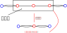
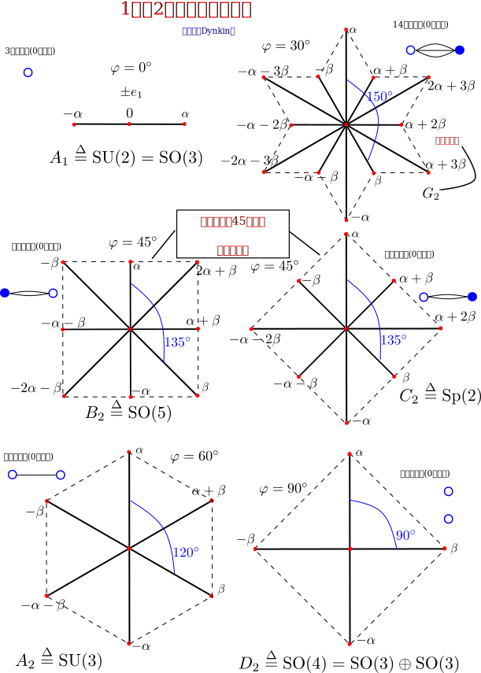
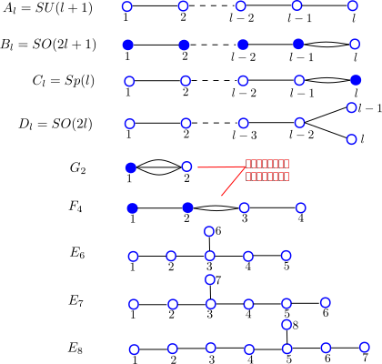
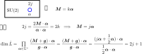

> `Dynkin图`，可以完全确定“单根矢量几何”，所有根矢量都可用单根线性表出。
>
> 根系虽然不唯一，但这种不唯一性不会导致“几何”意义上的变化。
>
>  `权`，就是零根空间（嘉当子代数）所有基底的共同本征矢对应的本征根组成的矢量。而这个共同本征矢被称作`权矢量`。
>
> 非零根标准基底对应升降算符。正根对应升算符，负根对应降算符。
>
> `权矢量`在升降算符的作用后，依然是`权矢量`，并且对应的`权`被提高或降低了。
>
> 如果某个`权矢量`被升算符作用后得零，那么该`权矢量`是最高权矢量，对应的权是最高权。
>
> 通过`Dynkin图`可衍生出不可约表示图，利用相关性质容易计算出不可约表示维度。

<!--more-->

## 单根系

所谓`不可约`，就是不存在非平凡理想。所谓`平凡`，就是空集(0)和自身两种情况。

所谓`完全可约`，就是指可表示有限个不可约表示的直和。

所谓`正根`，就是在$$l$$维零根空间中，第一个不为零的坐标为正的根。比如 $$(0,0,\textcolor{red}{1},-1)$$。根据半单李代数的对称性，必有对应的`负根`。 所有的正根集记作$$\Sigma^+$$。

一个根比另一个根更大$$\boldsymbol{\alpha}>\boldsymbol{\beta}$$，是指$$\boldsymbol{\alpha}-\boldsymbol{\beta}$$是正的。

所谓`单根`（又叫`素根`），也是一个正根，但无法将其分解成其它正根之和。比如：以$$B_2$$代数为例只有两个单根$$\textcolor{blue}{(0,1)},\textcolor{blue}{(1,-1)}$$，而$$(1,0)=\textcolor{blue}{(1,-1)}+\textcolor{blue}{(0,1)}$$和$$(1,1)=\textcolor{blue}{(0,1)}+(1,0)$$不是单根。

关于单根有一个定理：

> $$l$$秩半单李代数，正好有$$l$$个单根，记作$$\Pi=\{\boldsymbol{\alpha}_1,\dots,\boldsymbol{\alpha}_1\}\subset\Sigma^+$$（约定**从小到大**排序），被称作`单根系`或$$\pi$$系。有如下性质：
>
> 1）任意两个不同单根的内积非正：$$\boldsymbol{\alpha}\cdot\boldsymbol{\beta}\le 0,\quad\boldsymbol{\alpha}\ne\boldsymbol{\beta}\quad\boldsymbol{\alpha},\boldsymbol{\beta}\in \Pi $$；
>
> 2）任意根都可写成单根的线性组合：$$\boldsymbol{\alpha}=\pm\sum^l_{i=1}{m_i\boldsymbol{\alpha}_i},\quad m_i\in \mathbb{Z}^+\cup\{0\},\quad\boldsymbol{\alpha}_i\in \Pi,\quad \forall \boldsymbol{\alpha}\in\Sigma$$

## 单根之间的关系

沿用上一篇的结论

$$
\cos^2\varphi=\frac{1}{4}\frac{2\boldsymbol{\alpha}\cdot\boldsymbol{\beta}}{\boldsymbol{\alpha}\cdot\boldsymbol{\alpha}}\frac{2\boldsymbol{\alpha}\cdot\boldsymbol{\beta}}{\boldsymbol{\beta}\cdot\boldsymbol{\beta}}=0,\frac{1}{4},\frac{1}{2},\frac{3}{4}，1
$$

对两个单根而言有附加条件

$$
\cos\varphi\ne 180^\circ \Longrightarrow \boxed{\cos^2\varphi\ne 1}\\\boldsymbol{\alpha}\cdot\boldsymbol{\beta}\le 0\Longrightarrow \boxed{\cos\varphi=\frac{\boldsymbol{\alpha}\cdot\boldsymbol{\beta}}{|\boldsymbol{\alpha}||\boldsymbol{\beta}|}\le 0}
$$

所以只有四种情况

$$
\boxed{\varphi=90^\circ,120^\circ,135^\circ,150^\circ}
$$

这四种情况的单根矢量关系：

$$
\boxed{\def\arraystretch{1.5} \begin{array}{c:c:c:c} \varphi=90^\circ & \varphi=120^\circ & \varphi=135^\circ & \varphi=150^\circ \\ \hline 垂直 & 等长 & 长\sqrt{2}倍比 & 长\sqrt{3}倍比  \\ \hdashline \boldsymbol{\alpha}\cdot\boldsymbol{\beta}=0 & |\boldsymbol{\alpha}|=|\boldsymbol{\beta}| & \dfrac{|\boldsymbol{\alpha}|}{|\boldsymbol{\beta}|}=\sqrt{2},\dfrac{1}{\sqrt{2}} & \dfrac{|\boldsymbol{\alpha}|}{|\boldsymbol{\beta}|}=\sqrt{3},\dfrac{1}{\sqrt{3}}\end{array}}
$$

## Dynkin图（单根角图）

> 根系图只能绘制秩$$l=1,2$$的情况； 而单根角图能绘制$$l>2$$的任意情况。

绘制约定：

- 1）空圆表示长根，实圆表示短根；
- 2）相互正交（$$90^\circ$$）不连线；$$120^\circ$$夹角连一线；$$135^\circ$$夹角连两线；$$150^\circ$$夹角连三线。
- 3）从左到右的单根，按从小到大排列。
- 4）任意一点不能有三条以上的线相连；必须是树形，不能包含闭环。
- 5）合法角图中，若将简单链缩为一点，依然是合法角图。 所谓“简单链”，就是单重连线的一个链。【通过缩为一点判断角图的合法性】。 比如下面这个角图是不合法的

对于1和2秩的Dynkin图见下图的蓝色部分：

## 以Dynkin图分类根系

下图是`单李代数`的所有分类。

## 关于根系的不唯一性

先回顾“半单李代数标准形式”的本征方程【见上一篇笔记】

$$
(\mathrm{ad}_A)^a_{\ \ b}X^b=\lambda X^a
$$

虽然$$A^a$$的选取有一定的"自由"，但不完全自由，因为必须要保证本征根的非重根的个数最多。在这种情况下，只有零根可能存在重根。并且所选的$$A^a$$只能出现在零根空间（嘉当子代数）中，即

$$
A^a=\chi^i(K_i)^a
$$

进而，以作为$$\{\chi^i\}$$作为“基底”，可将本征根表出【加粗的“矢量”就是根矢量】：

$$
\alpha=\chi^i\alpha_i,\quad \boldsymbol{\alpha}\overset{\Delta}{=}(\alpha_1,\dots,\alpha_l)
$$

由此可见

- 从`实数根`的角度看，$$A^a$$在嘉当子代数（零根空间）的不同选择，只会导致所有实数根乘上一个比例系数。【总结：$$A^a$$的选择可能会导致整个“根矢量几何”等比放大或缩小】
- 从`根矢量`的角度看，对于同一个实数根，$$A^a$$的选择虽然会改变`根矢量`的分量。但是不会改变`根矢量`和`实数根`的正负对应性，也不会改变任意两个根矢量的“几何”关系。 【总结：$$A^a$$的选择可能会导致整个“根矢量几何”的旋转】

所以，根系的不唯一性，不会导致“几何”意义上的变化。

## 权与权空间

考虑$$l$$秩李代数$$\mathscr{L}$$的伴随表示$$\hat{L}$$

$$
\boxed{\begin{aligned}\hat{L}:&\mathscr{L}\to \mathscr{GL}(m,\mathbb{C})\\ &A\mapsto \hat{L}(A)\overset{\Delta}{=}\textcolor{red}{\mathrm{ad}_A}\quad\qquad\qquad \textcolor{blue}{伴随表示习惯写法}\\ &\qquad\qquad =(\mathrm{ad}_A)^a_{\ \ b}=A^c C^a_{\ \ cb}\quad \textcolor{blue}{抽象指标写法} \end{aligned}}
$$

选择标准基$$\{(K_i)^a,(H_\alpha)^a\}$$，由于$$\hat{L}(K_i), i=1,\dots,l$$是相互对易的，所以有共同的本征矢$$\textcolor{red}{|u\rangle\overset{\Delta}{=}u^a\in \mathscr{L}}$$

$$
\hat{L}(K_i)|u\rangle=\Lambda_i |u\rangle,\quad i=1,\dots,l
$$

可以将不妨将$$\boldsymbol{\Lambda}=(\Lambda_1,\dots,\Lambda_l)$$看成一个$$l$$维矢量，称为`权`，所以被认为是$$l$$维权空间$$\Delta_{\hat{L}}$$。

一般而言，'权'，是一个"矢量"，但不叫“权矢量”；`权矢量`，特指权$$\boldsymbol{\Lambda}$$对应的本征矢量$$|u_\boldsymbol{\Lambda}\rangle$$。

有时也经常直接用“权”来表示权矢量，比如：权$$\boldsymbol{\Lambda}=(1,2,3)$$，对应的权矢量也可记作$$|u_\boldsymbol{\Lambda}\rangle=|123\rangle$$。此时，“权”就是“权矢量”。

对于给定权$$\boldsymbol{\Lambda}$$，可能有多个本征矢（简并的），非简并的权，称作`单权`。

所谓`正权`，在$$l$$维权空间中，是和“正根”完全对标的类似概念。一个权比另一个权更高$$\boldsymbol{\Lambda_1}>\boldsymbol{\Lambda_2}$$，是指$$\boldsymbol{\Lambda_1}-\boldsymbol{\Lambda_2}$$是正的。

【**注意区分**】`权`$$\boldsymbol{\Lambda}=(\Lambda_1,\dots,\Lambda_l)\in\Delta_{\hat{L}}$$和根矢量$$\boldsymbol{\alpha}=(\alpha_1,\dots,\alpha_l)\in\Sigma$$

- `根矢量`，粗略来说，就是标准形式下非零根在**零根空间（嘉当子代数）**下分量组成“矢量”，由标准分解唯一确定，进而由李代数$$\mathscr{G}$$本身唯一确定。所以非零根矢量空间$$\Sigma$$没加下标。 根矢量的概念涉及李代数的结构。
- `权`，伴随表示$$\hat{L}$$作用于**零根空间（嘉当子代数）**所有标准基后，共同本征矢各自对应的本征根组成“矢量”。所以，权空间$$\Delta_{\hat{L}}$$有下标，表示依赖李代数$$\mathscr{G}$$的一个伴随表示$$\hat{L}$$。权的概念涉及李代数的表示。

关于李代数的表示论，有一个重要的定理

> 考虑伴随表示$$\hat{L}$$的一个权$$\boldsymbol{\Lambda}$$，及其对应的本征矢$$|u_\boldsymbol{\Lambda}\rangle$$，并设$$\Sigma$$是李代数$$\mathscr{L}$$的非零根系。 如果$$\hat{L}(H_\alpha)|u_\boldsymbol{\Lambda}\rangle\ne 0,\quad \boldsymbol{\alpha}\in\Sigma$$，那么$$\boldsymbol{\Lambda}+\boldsymbol{\alpha}$$也是表示$$\hat{L}$$的一个权，并且对应的本征矢就是$$\hat{L}(H_\alpha)|u_\boldsymbol{\Lambda}\rangle$$。 如果$$\boldsymbol{\Lambda}+\boldsymbol{\alpha}$$不是权，那么$$\hat{L}(H_\alpha)|u_\boldsymbol{\Lambda}\rangle=0$$。

因为【提要】

$$
\begin{aligned}\quad &\hat{L}(K_i)\hat{L}(H_\alpha)|u_\boldsymbol{\Lambda}\rangle\\ =&[\hat{L}(K_i),\hat{L}(H_\alpha)]|u_\boldsymbol{\Lambda}\rangle+\hat{L}(H_\alpha)\hat{L}(K_i)|u_\boldsymbol{\Lambda}\rangle\\ =&\hat{L}([K_i,H_\alpha])|u_\boldsymbol{\Lambda}\rangle+\Lambda_i\hat{L}(H_\alpha)|u_\boldsymbol{\Lambda}\rangle\quad \textcolor{red}{保李括号}\\ =&\hat{L}(\alpha_i H_\alpha)|u_\boldsymbol{\Lambda}\rangle+\Lambda_i\hat{L}(H_\alpha)|u_\boldsymbol{\Lambda}\rangle\quad \textcolor{red}{因为标准基}\\ =&(\alpha_i+\Lambda_i)\hat{L}(H_\alpha)|u_\boldsymbol{\Lambda}\rangle\\ \Longleftrightarrow \qquad & \boxed{\hat{L}(K_i)\hat{L}(H_\alpha)|u_\boldsymbol{\Lambda}\rangle=(\Lambda_i+\alpha_i)\hat{L}(H_\alpha)|u_\boldsymbol{\Lambda}\rangle} \end{aligned}
$$

由此可见：【假设$$\alpha$$是正根】

- $$\hat{L}(H_\alpha)$$的作用，使本征矢量$$|u_\boldsymbol{\Lambda}\rangle$$（态）的权$$\boldsymbol{\Lambda}$$升高一个正根$$\boldsymbol{\alpha}$$，所以$$H_\boldsymbol{\alpha}$$被称作`升算符`；
- $$\hat{L}(H_{-\alpha})$$的作用，使$$|u_\boldsymbol{\Lambda}\rangle$$的权$$\boldsymbol{\Lambda}$$降低一个$$\boldsymbol{\alpha}$$，所以$$H_{-\boldsymbol{\alpha}}$$被称作`降算符`。

## 权系的一些性质

所谓`权系`和`根系`有密切关系。

考虑$$\hat{L}$$是半单李代数$$\mathscr{L}$$的一个不可约表示，$$\boldsymbol{\Lambda}\in \Delta_{\hat{L}},\boldsymbol{\alpha}\in \Sigma$$，于是有

> 1）$$2\dfrac{\boldsymbol{\Lambda}\cdot\boldsymbol{\alpha}}{\boldsymbol{\alpha}\cdot\boldsymbol{\alpha}}\in \mathbb{Z}$$，而$$\boldsymbol{\Lambda}-2\dfrac{\boldsymbol{\Lambda}\cdot\boldsymbol{\alpha}}{\boldsymbol{\alpha}\cdot\boldsymbol{\alpha}}\boldsymbol{\alpha}\in \Delta_{\hat{L}}$$，它与$$\boldsymbol{\Lambda}$$被称为`等价的权`。

> 2）等价的权具有相同的简并度。

> 3）设$$\boldsymbol{\Lambda}$$是单权，若$$\boldsymbol{\Lambda}+k\boldsymbol{\alpha}\in \Delta_{\hat{L}},k\in \mathbb{Z}$$，则$$k$$必有上下限$$-p\le k\le q,\quad p,q\ge 0$$，并且$$2\dfrac{\boldsymbol{\Lambda}\cdot\boldsymbol{\alpha}}{\boldsymbol{\alpha}\cdot\boldsymbol{\alpha}}=p-q$$。

## 最高权(首权)

在有限维表示中，必有一个最高权$$\boldsymbol{M}$$，升算符作用到最高权矢量上得零：

$$
\hat{L}(H_\alpha)|u_\boldsymbol{M}\rangle=0,\quad \alpha>0
$$

这也是计算最高权得主要方法。

关于最高权有一个定理：

> 单李代数不可约表示的最高权是单权，两个不可约表示等价的充要条件是它们的最高权相等。

甚至，一个不可约半单李代数可完全用首权来标记：

$$
\boxed{M_{\alpha_i}=\frac{2\boldsymbol{M}\cdot\boldsymbol{\alpha}_i}{\boldsymbol{\alpha}_i\cdot\boldsymbol{\alpha}_i}\in \mathbb{N}\cup\{0\}},\quad i = 1,\dots,l,\quad \boldsymbol{\alpha}_i\in \Pi
$$

根据这个定理，对于一个李代数，首先画出对应的单根图（Dynkin图），然后再每个单根上方用非负整数$$M_{\alpha_i}$$标记，于是这个图就代表这个李代数的一个特定不可约表示图。比如：

## 不可约表示的维数

前面通过不可约表示图可求出首权（最高权），而不可约表示维数的计算与首权有密切的联系。

> 考虑半单李代数$$\mathscr{L}$$的一个不可约表示$$\hat{L}$$，其首权为$$M$$，那么不可约表示的维数是$$\dim \hat{L}=\prod\limits_{\boldsymbol{\alpha}\in\Sigma^+}{\dfrac{(\boldsymbol{M}+\boldsymbol{g})\cdot\boldsymbol{\alpha}}{\boldsymbol{g}\cdot\boldsymbol{\alpha}}},\quad \boldsymbol{g}=\dfrac{1}{2}\sum\limits_{\boldsymbol{\alpha}\in \Sigma^+}{\boldsymbol{\alpha}}$$

经过简单细致计算不难算出，$$A_2$$的不可约表示$$(n,m)$$维数是$$(3n+1)(3m+1)$$。【计算过程和下面例子的完全类似】

最简单代数$$A_1$$（对应$$\mathrm{SU}(2)$$群）：

