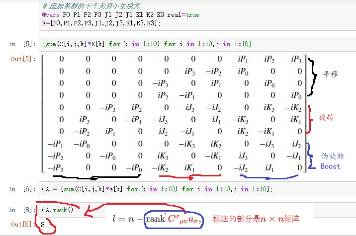
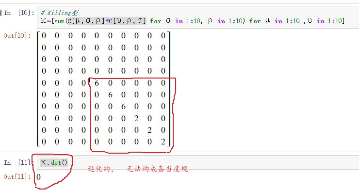

> 本篇主题是Casimir算符。
>
> 半单李群李代数的Casimir算符可以完全确定。
>
> 而非半单李群李代数的Casimir算符，只能算出独立Casimir算符的个数，具体形式似乎要靠猜测试探？？？？？
>
> 一旦确定了Casimir算符，可以仿照二次Casimir算符的本征值的计算方法确定对应本征值。

<!--more-->

## 二次Casimir算符的本征值

在（外尔-嘉当）标准基$\{(K_i)^a,(H_\alpha)^a\}$下，（二次）Casimir算符可以改写成：

$$
\begin{aligned}C&=\kappa^{\mu\upsilon}E_\mu E_\upsilon\\&=\kappa^{ij}K_iK_j+\sum_\alpha{H_\alpha H_{-\alpha}}\end{aligned}
$$

考虑某个不可约表示的最高权$\boldsymbol{M}$，及其权向量$|u_{\boldsymbol{M}}\rangle$。于是有

$$
\begin{aligned}\textcolor{red}{C}|u_{\boldsymbol{M}}\rangle&=\kappa^{ij}\textcolor{blue}{M_i M_j}|u_{\boldsymbol{M}}\rangle+\sum_\alpha{H_\alpha H_{-\alpha}|u_{\boldsymbol{M}}\rangle}\quad \textcolor{red}{权}\\ &=\kappa^{ij}M_i M_j|u_{\boldsymbol{M}}\rangle+\sum_{\textcolor{blue}{\alpha\in\Sigma^+}}{H_\alpha H_{-\alpha}|u_{\boldsymbol{M}}\rangle}\quad \textcolor{red}{最高权提升得0}\\ &=\kappa^{ij}M_i M_j|u_{\boldsymbol{M}}\rangle+\sum_{\alpha\in\Sigma^+}{\textcolor{blue}{[H_\alpha, H_{-\alpha}]}|u_{\boldsymbol{M}}\rangle}\quad \textcolor{red}{再次最高权提升得0}\\ &=\kappa^{ij}M_i M_j|u_{\boldsymbol{M}}\rangle+\sum_{\alpha\in\Sigma^+}{\textcolor{blue}{\alpha^i K_i}|u_{\boldsymbol{M}}\rangle}\quad \textcolor{red}{因为是标准形式}\\ &=(\textcolor{blue}{\boldsymbol{M}\cdot\boldsymbol{M}} )|u_{\boldsymbol{M}}\rangle+\sum_{\alpha\in\Sigma^+}{(\textcolor{blue}{\boldsymbol{\alpha}\cdot\boldsymbol{M}} )|u_{\boldsymbol{M}}\rangle}\quad \textcolor{red}{改写成内积形式}\\ &=(\boldsymbol{M}\cdot\boldsymbol{M} )|u_{\boldsymbol{M}}\rangle+\textcolor{blue}{2(\boldsymbol{g}\cdot\boldsymbol{M} )}|u_{\boldsymbol{M}}\rangle\quad \textcolor{red}{\boldsymbol{g}=\frac{1}{2}\sum_{\alpha\in\Sigma^+}{\boldsymbol{\alpha}}}\\ &=\left\{\textcolor{red}{\boldsymbol{M}\cdot(\boldsymbol{M} +2\boldsymbol{g})}\right\}|u_{\boldsymbol{M}}\rangle\end{aligned}
$$

对特定不可约表示而言，上一篇笔记已经详细介绍了最高权的计算。所以，二次Casimir算符的本征值问题，就此解决。

## 广义Casimir不变算符

广义Casimir不变算符【以前的笔记涉及过】

$$
I_n=C^{\beta_1}_{\ \ \alpha_1\beta_2}C^{\beta_2}_{\ \ \alpha_2\beta_3}\dots C^{\beta_n}_{\ \ \alpha_n\beta_1}E^{\alpha_1}E^{\alpha_2}\dots E^{\alpha_n},\quad n\ge2 \\ E^\alpha=\kappa^{\alpha\beta}E_\beta
$$

关键点是：不全是独立的，我们的目标是找出所有独立的Casimir不变算符。

G. Racah证明了：

> 对$l$秩半单李代数，可构造出$l$个不变算符，而它们的本征值可以完全标记这个半单李代数的不可约表示。

特别地，G. Racah还证明了各种情况下的独立Casimir不变算符：

$$
\begin{aligned}A_l:\qquad & I_2,I_3,\dots,I_{l+1}\\ B_l:\qquad & I_2,I_4,\dots,I_{2l} \\ C_l:\qquad & I_2,I_4,\dots,I_{2l} \\ D_l:\qquad & I_2,I_4,\dots,I_{2l-2},\textcolor{red}{I_l},\quad \textcolor{red}{红色标记的部分感觉是错的} \\ G_2:\qquad & I_2,I_6\\ F_4:\qquad & I_2,I_6,I_8,I_{12} \\ E_6:\qquad & I_2,I_5,I_6,I_8,I_9,I_{12} \\ E_7:\qquad & I_2,I_6,I_8,I_{10},I_{12},I_{14},I_{18}\\ E_8:\qquad & I_2,I_8,I_{12},I_{14},I_{18},I_{20},I_{24},I_{30}   \end{aligned}
$$

以后，我们只需要查这个表，针对性，直接算出对应的不变算符。就算找到了所有独立的Casimir不变算符。

## 非半单李群的不变算符

**非半单李群**，比如欧几里得群和庞加莱群。一般而言，无法找出嘉当度规，因此无法构造正常意义下的Casimir算符，但不妨碍构造出一种与所有无穷小算符都对易的不变算符。 不妨也称之为Casimir不变算符。

$n$个参数$(a_1,\dots,a_n)$的任意李群的独立Casimir算符的个数

$$
l=n-\mathrm{rank}\ \textcolor{red}{C^\sigma_{\ \ \mu\upsilon} a_\sigma},\quad \textcolor{red}{标注的部分是n\times n 矩阵}
$$

根据这个定理，可以算出（十个参数）庞加莱群的独立Casimir算符个数（一共两个）：

```julia
using SymPy
using LinearAlgebra

#  Levi-Civita记号
ε= [ Sym((length(Set([i,j,k]))==3)*       #  存在重复指标，取0
    (-1)^(sum([i,j,k][σ]>[i,j,k][ρ]   
            for σ in 1:3,ρ in  1:3  if σ<ρ) % 2)) # 计算逆序数。偶数取1，奇数取-1
    for  i in 1:3, j in 1:3, k in 1:3 ] ;

# 单位矩阵
δ = sympy.diag(1,1,1);

# 庞加莱群李代数的结构常数
C=[Sym(0) for i in 1:10 , j in 1:10 , k in 1:10];
C[5:7,5:7,5:7]=IM*ε;
C[8:10,8:10,5:7]=-IM*ε;
C[2:4,5:7,2:4]=IM*ε;   C[5:7,2:4,2:4]=-IM*ε;
C[1,8:10,2:4]=IM*δ;    C[8:10,1,2:4]=-IM*δ;
C[2:4,8:10,1]=IM*δ;    C[8:10,2:4,1]=-IM*δ;
C[5:7,8:10,8:10]=IM*ε; C[8:10,5:7,8:10]=-IM*ε;

# 庞加莱群的十个参数
@vars p0 p1 p2 p3 j1 j2 j3 k1 k2 k3 real=true
a=[p0,p1,p2,p3,j1,j2,j3,k1,k2,k3];

# 庞加莱群的十个无穷小生成元
@vars P0 P1 P2 P3 J1 J2 J3 K1 K2 K3 real=true
E=[P0,P1,P2,P3,J1,J2,J3,K1,K2,K3];

# 和结构常数对比
[sum(C[i,j,k]*E[k] for k in 1:10) for i in 1:10,j in 1:10]                            

# 计算红色部分的秩
CA = [sum(C[i,j,k]*a[k] for k in 1:10) for i in 1:10,j in 1:10];
CA.rank()                        
```

计算结果如图：



庞加莱群是一个非半单李群，因为对应的Killing型是退化的



所以，**无法**按半单李群的Casimir算符的计算公式得到庞加莱群的不变算符。

我翻了很多书，都没说清楚**非半单李群**的不变算符如何得到？？？？。 这些书都是直接给出两个不变算符，然后验证的确是不变算符（和其它算符对易），又因为前面的定理（计算）可以保证只有两个独立不变算符，所以完整了。

$$
\boxed{P^2=P_\mu P^\mu,\qquad W^2=W_\mu W^\mu}\\  W_\mu=-\frac{1}{2}\varepsilon_{\mu\upsilon\rho\sigma}J^{\upsilon\rho}P^\sigma\\ J^{\upsilon\rho}=\begin{pmatrix}0 & -K^1 & -K^2 & -K^3\\K^1 & 0 & J^3 & -J^2\\K^2 & -J^3 & 0 & J^1\\K^3 & J^2 & -J^1 & 0\end{pmatrix}
$$


