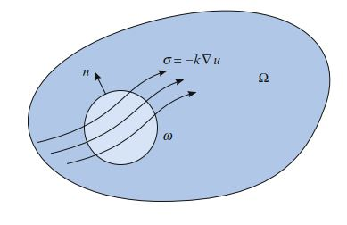

[有限元法解偏微分方程（FEniCS）]()

[有限元法求解牛顿流体（FEniCS）]()

这两篇笔记仅做入门之用。  为了深入掌握，建议阅读《Automated Solution of Differential Equations by the Finite Element Method》。 为此，我一边学习一边翻译权当笔记。

# I.方法论》2.有限元方法（一）

有限元方法已经成为求解微分方程的通用方法。有限元方法的成功大部分可以归因于它的通用性和优雅性，它允许在一个通用框架内分析和求解来自科学所有领域的各种微分方程。有限元方法成功的另一个因素是公式的灵活性，可以通过选择近似的有限元空间来控制离散化的属性。

在本章中，我们回顾有限元方法，并总结整本书中使用的一些基本概念和符号。

在接下来的章节中，我们将更详细地讨论这些概念，并特别关注有限元方法的实现和自动化，这是FEniCS项目的一部分。

<!--more-->

## 2.1 一个简单的模型问题

1813年，西蒙·丹尼斯·泊松（SiméonDenis Poisson）在《哲学公报》上发表了他的著名公式，作为对皮埃尔-西蒙·拉普拉斯(Pierre-Simon Laplace)早些时候发表的公式的修正。

泊松方程是一个二阶偏微分方程，未知场$u = u(x)$的$-\Delta u$等于域$Ω\subset \mathbb{R}^d$上给定函数$f = f(x)$，可能会被Ω的边界∂Ω上的u的边界条件集所约束：

$$
\begin{aligned}-\Delta u = f & \qquad \mathrm{in} \ \Omega \\ u = u_0 & \qquad \mathrm{on} \ \Gamma_D \subset  \partial \Omega \\ -\partial_n u = g & \qquad \mathrm{on} \ \Gamma_N \subset  \partial \Omega \end{aligned} \tag{2.1}
$$

Dirichlet边界条件$u=u_0$表示u在边界子集$\Gamma_D$上的约束值，而Neumann边界条件$-\partial_n u = g$则表示u在其余边界$\Gamma_N=\partial \Omega - \Gamma_D$上的负归一化梯度的约束值。泊松方程是引力，电磁，热传导，流体流动和许多其他物理过程的简单模型。在许多更复杂的物理模型中，它也作为基本构建块出现，包括Navier-Stokes方程，我们将在第20、21、22、23、24、25、28和29章中回头讨论。

为了推导泊松方程（2.1），我们可以考虑一个模型，该模型用于研究受到热源$f$作用、约束的区域$\Omega$中物体中的温度u。 令$\sigma=\sigma(x)$表示热通量，根据能量守恒，对任何测试体$\omega \subset \Omega$，从其边界$\partial \omega$流出的能量必须和热源$f$发出的能量平衡：

$$
\int_{\partial\omega}{\sigma \cdot n ds} = \int_\omega{fdx}  \tag{2.2}
$$

左边的积分部分，我们发现有：

$$
\int_\omega{\nabla \cdot \sigma ds} = \int_\omega{fdx}  \tag{2.3}
$$

由于上式对于任意测试体$\omega \subset \Omega$均成立，因此在整个$\Omega$中, $\nabla \cdot \sigma = f$（在$\sigma$和$f$上具有适当的规律性假设）。如果现在我们假设热通量$\sigma$与温度$u$的负梯度成比例（傅立叶定律）:

$$
\sigma = -\kappa \nabla u  \tag{2.4}
$$

于是得到下面这个方程组：

$$
\begin{aligned}\nabla \cdot \sigma = f & \qquad \mathrm{in} \ \Omega \\ \sigma + \nabla u = 0  & \qquad \mathrm{in} \  \Omega\end{aligned}  \tag{2.5}
$$

我们假设热传导系数为$\kappa = 1$。 如图2.1下所示。 将第一个方程式中的$\sigma$替换为$-\nabla u$，我们得到前面的泊松方程（2.1）。反之，通过对泊松方程（2.1）引入$\sigma =-\nabla u$作为辅助变量，也可以得出上面这个第一阶方程组（2.5）。 我们还注意到泊松方程（2.1）的两个边界条件：Dirichlet和Neumann边界条件，分别对应于温度和热通量的约束值。

图2.1: 泊松方程是任意测试体积$\omega \subset \Omega$中能量平衡的简单结果。

## 2.2 有限元离散化

### 2.2.1 泊松方程离散化

为了用有限元方法离散化泊松方程（2.1），我们首先乘以测试函数$v$，然后部分积分以得：

$$
\int_\Omega{\nabla u \cdot \nabla v dx} - \int_{\partial \Omega}{\partial_n u v ds} = \int_\Omega{f v dx}  \tag{2.6}
$$

让测试函数(test function)$v$在已知解u的Dirichlet边界$\Gamma_D$上消失，我们得出以下经典的变分问题：找到$u \in V$，使得

$$
\int_\Omega{\nabla u \cdot \nabla v dx} = \int_\Omega{f v dx} - \int_{\Gamma_N}{g v ds} \qquad \forall v \in \hat{V}  \tag{2.7}
$$

测试空间(test space)$\hat{V}$被定义为：

$$
\hat{V} = \left\{v \in H^1(\Omega) : v=0 \ \mathrm{on} \ \Gamma_D \right\}  \tag{2.8}
$$

试验空间(trial space)$V$, 则是测试空间的Dirichlet条件平移后得到的空间：

$$
\hat{V} = \left\{u \in H^1(\Omega) : u=u_0 \ \mathrm{on} \ \Gamma_D \right\}  \tag{2.9}
$$

现在，我们可以通过将变分问题（2.7）限制在一对离散空间来离散泊松方程：找到$u_h \in V_h \subset V$ 满足：

$$
\int_\Omega{\nabla u_h \cdot \nabla v dx} = \int_\Omega{f v dx} - \int_{\Gamma_N}{g v ds} \qquad \forall v \in \hat{V}_h \subset \hat{V}  \tag{2.10}
$$

我们在这里注意到，在$\Gamma_D$上的Dirichlet条件$u = u_0$直接进入试验空间$V_h$的定义（这是一个基本边界条件），而在$\Gamma_N$上的Neumann条件$−\partial_n u = g$则进入了变分问题（它是自然边界条件）。 

为了求解这个离散的变分问题（2.10），我们必须构造合适的一对离散试验和测试空间$V_h$和$\hat{V}_h$。我们后面将回到这个问题，在此之前，现在我们假设对$V_h$有一个基$\{\phi_j\}^N_{j=1}$，对于$\hat{V}$也有一个基$\{\hat{\phi}_j\}^N_{j=1}$。在此，N表示空间$V_h$和$\hat{V}_h$的尺寸。然后，我们可以将$u_h$用试验空间的基函数来展开：

$$
u_h(x) = \sum_{j=1}^N{U_j \phi_j(x)}  \tag{2.11}
$$

其中，$U\in \mathbb{R}^N$是要被计算的具有确定自由度的向量。将其带入离散化的变分问题中，并用离散测试空间$\hat{V}_h$的基函数来充当测试函数$v$，于是：

$$
\begin{aligned}\sum_{j=1}^N{U_j \int_\Omega{\nabla \phi_j \cdot \nabla  \hat{\phi}_i dx}} = \int_\Omega{f \hat{\phi}_i dx} - \int_{\Gamma_N}{g \hat{\phi}_i ds}  \\  i = 1,2,\dots,N \end{aligned}  \tag{2.12}
$$

因此，我们可以通过求解线性系统来计算有限元解$u_h = \sum^N_{j=1}{U_j \phi_j}$:

$$
A U = b  \tag{2.13}
$$

其中：

$$
A_{ij}=\int_\Omega{\nabla \phi_j \cdot \nabla  \hat{\phi}_i dx} \\ b_i = \int_\Omega{f \hat{\phi}_i dx} - \int_{\Gamma_N}{g \hat{\phi}_i ds}  \tag{2.14}
$$

### 2.2.2 一阶方程组离散化

我们可以类似地离散一个一阶方程组（2.5）： 将第一个一阶方程乘以一个测试函数v，并将第二个一阶方程乘以另一个测试函数τ，然后进行积分再相加合并，得到

$$
\begin{aligned}\int_\Omega{\left[(\nabla \cdot \sigma) v  + \sigma \cdot \tau - u \nabla \cdot \tau\right]dx}+ \int_{\partial \Omega}{u \tau \cdot n ds} = \int_\Omega{ f v dx}  \\ \forall(v,\tau)\in \hat{V} \end{aligned} \tag{2.15}
$$

在Neumann边界$\Gamma_N$上已知单位通量$\sigma \cdot n = g$，因此我们取$\tau \cdot n = 0$。 将u的值带入到Dirichlet边界$\Gamma_D$上，我们得出以下变分问题：找出$(u,\sigma) \in V$，使得

$$
\begin{aligned}\int_\Omega{\left[(\nabla \cdot \sigma) v  + \sigma \cdot \tau - u \nabla \cdot \tau\right]dx} = \int_\Omega{ f v dx} - \int_{\Gamma_D}{u_0 \tau \cdot n ds} \\ \forall (v,\tau)\in \hat{V} \end{aligned} \tag{2.16}
$$

试验空间和测试空间的合适选择是

$$
\begin{aligned} V=\left\{ (v,\tau) : v\in L^2(\Omega), \tau \in H(\mathrm{div},\Omega), \tau \cdot n = g \ \mathrm{on} \ \Gamma_N \right\} \\ \hat{V}=\left\{ (v,\tau) : v\in L^2(\Omega), \tau \in H(\mathrm{div},\Omega), \tau \cdot n = 0 \ \mathrm{on} \ \Gamma_N \right\}  \end{aligned}  \tag{2.17}
$$

请注意，这个变分问题（2.16）与前面的变分问题（2.7）的不同之处在于，$\Gamma_D$上的Dirichlet条件$u = u_0$进入了变分公式（现在是自然边界条件），而Neumann条件$\sigma \cdot n = g$则在$\Gamma_N$上进入试验空间V的定义（现在是基本边界条件）。

同样，我们将变分问题限制在一对离散的试验和测试空间$V_h \subset V$和$\hat{V}_h\subset \hat{V}$上，并有限元解形如：

$$
(u_h,\sigma_h) = \sum^N_{j=1}{U_j(\phi_j,\psi_j)}  \tag{2.18}
$$

其中，$\left\{(\phi_j,\psi_j)\right\}^N_{j=1}$是试验空间$V_h$的基底。 通常，$\phi_j$或$\psi_j$都将消失，因此这个基底实际上是$L^2$空间基数和$H(\mathrm{div})$空间基数的张量积。因此，我们通过求解线性方程组$A U = b$来获得$U \in \mathbb{R}^N$自由度的线性系统

$$
A_{ij}=\int_\Omega{\left[(\nabla \cdot \psi_j)  \hat{\phi}_i  + \psi_j \cdot \hat{\psi}_i - \phi_j \nabla \cdot \hat{\psi}_i\right]dx} \\ b_i = \int_\Omega{f \hat{\phi}_i dx} - \int_{\Gamma_D}{u_0 \hat{\psi}_i \cdot n ds}  \tag{2.19}
$$

这种有限元离散化（2.19）就是混合方法（`mixed method`）的一个例子。这种表述需要很小心地为各种不同的函数空间选择兼容的方法，比如这里的$L^2$和$H(\mathrm{div})$。稳定的离散化必须满足所谓的`inf-sup`或`Ladyzhenskaya-Babuška-Brezzi`（LBB）条件。该理论解释了为什么与标准方法相比，混合方法中的许多有限元空间显得复杂。后面的第3章中，我们将给出了这种有限元空间的几个例子。

## 2.3 有限元抽象形式

### 2.3.1 线性问题

我们在上面看到，泊松方程（2.1）或（2.5）的有限元解可以通过将有限维（连续）变分问题限制为有限维（离散）变分问题并通过求解线性系统来获得。

为了对此进行形式化，我们考虑以下规范形式编写的一般线性变分问题：寻找$u \in V$满足

$$
a(u,v) = L(v)  \qquad \forall v \in \hat{V} \tag{2.20}
$$

其中$V$是试验空间(trial space)，$\hat{V}$是测试空间(test space)。因此，我们用双线性形式$a$和线性形式（泛函）$L$表示变分问题：

$$
a: V \times \hat{V} \to \mathbb{R} \\ L: \hat{V} \to \mathbb{R}  \tag{2.21}
$$

和前面一样，我们通过限制一对离散的试验和测试空间来离散化这个形式的变分问题（2.20）：找出$u_h \in V_h \subset V$使得

$$
a(u_h,v) = L(v) \qquad \forall v \in \hat{V}_h \subset \hat{V}  \tag{2.22}
$$

为了解决这种形式化的离散变分问题（2.22），我们将$u_h$展开为：

$$
u_h = \sum^N_{j=1}{U_j \phi_j}  \tag{2.23}
$$

取$v = \hat{\phi}_i,  \ i = 1,2,\dots, N$。和前面一样，$\{\phi_j\}^N_{j=1}$是离散试验空间$V_h$的基底，$\{\hat{\phi}_i\}^N_{i=1}$则是离散测试空间$\hat{V}_h$的基底。它满足：

$$
\sum^N_{j=1}{U_j a(\phi_j,\hat{\phi}_i)} = L(\hat{\phi}_i),\qquad i = 1,2,\dots, N  \tag{2.24}
$$

然后可以通过求解线性方程组$A U = b$来计算$U \in \mathbb{R}^N$自由度的线性系统，其中

$$
A_{ij} = a(\phi_j, \hat{\phi}_i), \qquad i,j = 1,2,\dots,N \\ b_i = L(\hat{\phi}_i) \qquad i = 1,2,\dots,N  \tag{2.25}
$$

### 2.3.2 非线性问题

我们还考虑以下规范形式编写的非线性变分问题：寻找$u \in V$满足

$$
F(u; v) = 0, \qquad  \forall v \in \hat{V}  \tag{2.26} 
$$

现在$F:V \times \hat{V} \to \mathbb{R}$是一个半线性形式，分号后的参数中是线性的。和前面一样，我们通过限制一对离散的试验和测试空间来离散化此变分问题（2.26）：寻找$u_h \in V_h \subset V$满足

$$
F(u_h; v) = 0, \qquad  \forall v \in \hat{V}_h \subset \hat{V}  \tag{2.27}
$$

然后可以通过求解非线性方程组来计算有限元解$u_h = \sum^N_{j=1}{U_j \phi_j}$：

$$
b(U) = 0  \tag{2.28}
$$

其中$b:\mathbb{R}^N \to \mathbb{R}^N$和

$$
b_i(U) = F(u_h; \hat{\phi}_i), \qquad i=1,2,\dots,N  \tag{2.29}
$$

为了用牛顿法或牛顿法的某些变体求解这种非线性方程组（2.28），我们要计算雅可比行列式A = b'。我们注意到，如果半线性形式$F$对$u$是可微的，则雅可比矩阵A的项由下式给出：

$$
\begin{aligned}A_{ij}(u_h) &= \frac{\partial b_i(U)}{\partial U_j} =  \frac{\partial}{\partial U_j}  F(u_h; \hat{\phi}_i) \\ &=  F'(u_h; \hat{\phi}_i) \frac{\partial u_h}{\partial U_j} =  F'(u_h; \hat{\phi}_i) \phi_j  \overset{\Delta}{=}   F'(u_h; \phi_j,\hat{\phi}_i) \end{aligned}  \tag{2.30}
$$

在每个牛顿迭代中，我们必须计算（组装）矩阵A和向量b，并通过以下方式更新解向量U:

$$
U^{k+1} = U^k - \delta U^k ,\qquad k = 0,1,\dots  \tag{2.31}
$$

其中，$\delta U^k$是下面这个线性方程组的解：

$$
A(u^k_h) \delta U^k = b(u^k_h)  \tag{2.32}
$$

我们注意到，对于每个固定的$u_h$，$a = F'(u_h; \cdot, \cdot）$是双线性形式，而$L=F(u_h; \cdot)$是线性形式。因此，在每次牛顿迭代中，我们都是求解标准形式的线性变分问题（2.20）：寻找$\delta u \in V_{h,0}$满足

$$
F'(u_h; \delta u, v) = F(u_h; v) ,\qquad \forall v\in \hat{V}_h   \tag{2.33}
$$

其中，$V_{h,0} = \{v - w : v, w \in  V_h\}$。 正如上一小节2.3.1的离散化（2.33）一样，我们重新找到了一个线性方程组（2.32）。

**例子2.1 (非线性泊松方程)** 例如，考虑以下非线性泊松方程：

$$
\begin{aligned}-\nabla \cdot ( (1+u) \nabla u )= f & \qquad \mathrm{in} \ \Omega \\ u = 0 & \qquad \mathrm{on} \ \partial \Omega  \end{aligned}  \tag{2.34}
$$

在（2.34）两边乘上测试函数$v$, 并且进行分部积分得到：

$$
\int_\Omega{((1+u)\nabla u)\cdot \nabla v dx} = \int_{\partial \Omega}{f v dx}   \tag{2.35}
$$

这是非线性变分问题（2.26），其中:

$$
F(u; v) = \int_\Omega{((1+u)\nabla u)\cdot \nabla v dx} - \int_{\partial \Omega}{f v dx}   \tag{2.36}
$$

对半线性形式$F(u; v)$进行关于$u=u_h$的线性化，我们得到

$$
F'(u_h; \delta u, v) = \int_\Omega{(\delta u\nabla u)\cdot \nabla v dx}  + \int_\Omega{((1+u)\nabla \delta u)\cdot \nabla v dx}   \tag{2.37}
$$

因此，我们可以通过以下方式计算雅可比矩阵$A(u_h)$：

$$
\begin{aligned} A_{ij}(u_h) &= F'(u_h; \phi_j, \hat{\phi}_i) \\  &= \int_\Omega{(\phi_j \nabla u)\cdot \nabla \hat{\phi}_i dx}  + \int_\Omega{((1+u)\nabla \phi_j)\cdot \nabla \hat{\phi}_i dx}  \end{aligned} \tag{2.38}
$$

【第二章未完待续】

