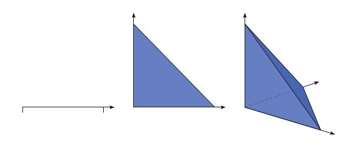
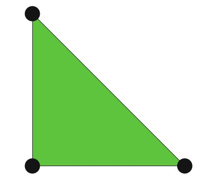
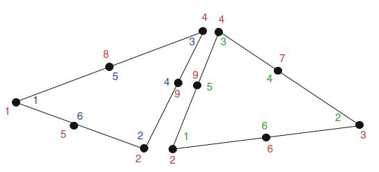
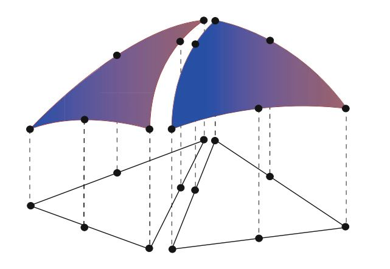
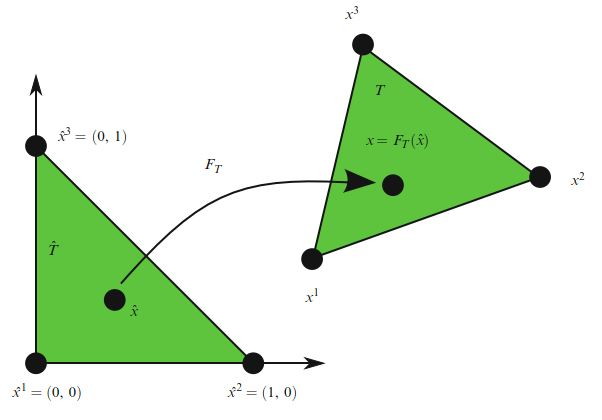

[有限元法解偏微分方程（FEniCS）]()

[有限元法求解牛顿流体（FEniCS）]()

这两篇笔记仅做入门之用。  为了深入掌握，建议阅读《Automated Solution of Differential Equations by the Finite Element Method》。 为此，我一边学习一边翻译权当笔记。

# I.方法论》2.有限元方法（二）

## 2.4 有限元函数空间

在前面的讨论中，我们假设总可以构造无限维函数空间的离散子空间$V_h \subset V$。有限元方法的一个核心方面是通过将由一组有限元定义的局部函数空间拼凑在一起来构造此类子空间。至此，我们对有限元函数空间的构造进行了总体概述，并将在第3章和第4章中回头讨论一些特定函数空间的构造：$H^1, H(\mathrm{curl}), H(\mathrm{div}), L^2$。

<!--more-->

### 2.4.1 网格

为了定义$V_h$，我们首先将域$\Omega$划分为有限单元格集(a finite set of cells)$\mathcal{T}_h = \{T\}$，内部不相交，并且满足：

$$
\cup_{T\in \mathcal{T}_h} T = \Omega \tag{2.39}
$$

这些单元格一起形成了域$\Omega$的网格。单元格通常是简单的多边形形状，例如：区间、三角形、四边形、四面体或六面体，如下图所示。但是其他形状也是可能的，特别是弯曲的单元格可以正确捕获非多边形区域的边界。

图2.2 一、二、三维空间的有限元单元格示例。

### 2.4.2 有限元定义

一旦将域$\Omega$划分为一组单元格，就可以在每个单元格T上定义一个局部函数空间$\mathcal{V}$，并使用这些局部函数空间来构建全局函数空间$V_h$。单元格T与局部函数空间$\mathcal{V}$以及用于描述$\mathcal{V}$中函数的一组规则一起称为`有限元`。该定义是由Ciarlet（1976）首次正式提出的，并且至今仍然是标准的表述（Brenner and Scott，2008）。形式化定义如下：有限元是一个三元组$(T, \mathcal{V}, \mathcal{L})$，其中

- 区域$T$是$\mathbb{R}^d$的有界封闭子集（$d=1,2,3,\dots$），具有非空的内部和分段光滑边界；

- 空间$\mathcal{V} = \mathcal{V}(T)$是在$n$维$T$上的有限维函数空间；

- 自由度（节点）的集合$\mathcal{L} = \{\ell_1,\ell_2,\dots,\ell_n\}$是对偶空间$\mathcal{V}'$的基底；也就是$\mathcal{V}$上有界线性泛函的空间。

图2.3 线性拉格朗日三角形的自由度是通过在三角形的三个顶点值给出的。

例如，考虑上图中三角形上的标准线性拉格朗日有限元。这个单元格T由三角形给定，空间$\mathcal{V}$则由是$T$上的一阶多项式的空间（维数为3的空间）给定。我们可以指定$T$的三个顶点值作为$\mathcal{V}'$的基底；那是：

$$
\begin{aligned}\ell_i : \mathcal{V} \to \mathbb{R} \\  \ell_i(v) = v(x^i) \end{aligned}  \tag{2.40}
$$

对于$i = 1,2,3$，其中$x_i$是第i个顶点的坐标。为了确认这确实是有限元，我们需要验证$\mathcal{L}$是$\mathcal{V}'$的基底。这等效于$\mathcal{L}$的唯一性。也就是说，如果$v \in \mathcal{V}$并且$\ell_i(v)= 0,\quad \forall l_i$，那么有$v = 0$（Brenner and Scott，2008）。对于线性拉格朗日三角形，我们注意到如果$v$在每个顶点为零，那么则$v$在任何地方都必须为零，因为一个平面由其在三个非共线点的值唯一地确定。由此可见，线性拉格朗日三角形确实是一个有限元。一般而言，确定$\mathcal{L}$的唯一性可能并非易事。

### 2.4.3 节点基底

通过引入$\mathcal{V}$的节点基底，可以大大简化用局部函数空间$\mathcal{V}$的基函数表示的$V_h$中有限元解。$\mathcal{V}$的节点基底$\{\phi_i\}^n_{i=1}$是$\mathcal{V}$的基底，若满足：

$$
\ell_i(\phi_j) = \delta_{ij},\quad i,j=1,2,\dots,n   \tag{2.41}
$$

因此，任何$v \in \mathcal{V}$都可以表示为：

$$
v = \sum^n_{i=1}{\ell_i(v)\phi_i}  \tag{2.42}
$$

特别地，对于线性拉格朗日三角形，$\mathcal{V}$中的任何函数$v$可由$v = \sum^3_{i=1}{v(x^i)\phi_i}$给出。换句话说，对任何函数$v$，可以通过计算$v$处$\mathcal{L}$中的线性泛函值来获得$v$的展开系数。因此，我们可以将$u_h$的展开系数U和$\mathcal{L}$的线性泛函互相称为对方的自由度。

**例2.2 (线性拉格朗日单纯形的节点基底)** 顶点为$x^1 = 0$和$x^2 = 1$的线性拉格朗日区间的节点基底为：

$$
\phi_1(x)=1-x, \quad \phi_2(x) = x  \tag{2.43}
$$

顶点为$x^1=(0, 0), x^2=(1, 0), x^3=(0, 1)$的线性拉格朗日三角形的节点基底为：

$$
\phi_1(x)=1-x_1-x_2, \quad \phi_2(x) = x_1, \quad \phi_3(x) = x_2  \tag{2.44}
$$

顶点为$x^1=(0, 0, 0), x^2=(1, 0, 0),x^3=(0, 1, 0), x^4=(0, 0, 1)$的线性拉格朗日四面体的节点基底是：

$$
\begin{aligned} &\phi_1(x) = 1-x_1-x_2-x_3, & \phi_2(x)=x_1 \\ &\phi_3(x)=x_2, & \phi_4(x)=x_3 \end{aligned}  \tag{2.45}
$$

对于任何有限元$(T, \mathcal{V}, \mathcal{L})$，可以通过求解大小为$n \times n$的线性方程组来计算节点基底。 为了看出这一点，令$\{\psi_i\}^n_{n=1}$是$\mathcal{V}$的任意基底（主基底）。如果$\mathcal{V}$是一个完全多项式空间，或者可以通过奇异值分解或Gram-Schmidt程序计算得出，则这样的基底很容易构造。参见Kirby（2004）。然后，我们可以以主基底项为节点基底建立展开式：

$$
\phi_j = \sum^n_{k=1}{\alpha_{jk}\psi_k}, \quad j = 1,2,\dots, n  \tag{2.46}
$$

带入到本小节（2.4.3节）第一个公式中，有：

$$
\sum^n_{k=1}{\alpha_{jk}\ell_i(\psi_k)} = \delta_{ij},\quad i,j=1,2,\dots,n  \tag{2.47}
$$

换句话说，可以通过求解线性方程组来计算以主基底展开的节点基函数的系数$\alpha$:

$$
B \alpha^T = I  \tag{2.48}
$$

其中， $B_{ij}=\ell_i(\psi_j)$

### 2.4.4 局部到全局映射

现在，要从有限元的给定集合$\left\{(T, \mathcal{V}_T, \mathcal{L}_T)\right\}_{T\in \mathcal{T}_h}$， 定义$\Omega$上的全局函数空间$V_h = \mathrm{span}\left\{\phi_i\right\}^N_{i=1}$，我们还需要指定如何将局部函数空间修补在一起。 为此，我们为每个单元格$T\in \mathcal{T}_h$指定一个局部到全局的映射：

$$
\iota_T : [1,n_T] \to [1, N]  \tag{2.49}
$$

该映射指定了如何将局部自由度$\mathcal{L}_T = \{\ell^T_i\}^{n_T}_{i=1}$映射到全局自由度$\mathcal{L} = \{\ell_i\}^N_{i=1}$。更确切地说，全局自由度定义为：

$$
\ell_{\iota_T(i)}(v) = \ell^T_i(v|_T), \quad i = 1,2,\dots,n_T  \tag{2.50}
$$

对于任何$v\in V_h$，因此，每个局部自由度$\ell^T_i \in \mathcal{L}_T$对应于由局部到全局映射$\iota_T$确定的全局自由度$\ell_{\iota_T(i)} \in \mathcal{L}$。正如我们将看到的，局部到全局的映射以及自由度的选择决定了全局函数空间$V_h$的连续性。

对于标准连续分段线性，可以通过简单地将$i=1,2,3$的每个局部顶点数$i$映射到相应的全局顶点数$\iota_T(i)$来定义局部到全局的映射。 对于连续的分段二次，可以将局部到全局的映射基于全局顶点和边号，如图2.4所示，用于由两个三角形组成的简单网格。

图2.4 由两个三角形组成的简单网格的局部到全局映射。 左三角形（T）的六个局部自由度被映射到全局自由度$\iota_T(i)=1,2,4,4,9,8,5  \quad  \ i = 1,2,\dots,6$。并且右三角形（T'）的六个局部自由度则被映射到全局自由度$\iota_{T'}(i)=2,3,4,7,9,6  \quad \ i = 1,2,\dots,6$。

### 2.4.5 全局函数空间

现在可以将全局函数空间$V_h$定义为满足以下两个条件的$\Omega$上的一组函数。首先要求

$$
v|_T = \mathcal{V}_T \qquad \forall T \in \mathcal{T}_h  \tag{2.51}  
$$

即，对每个单元格$T$，$v$的限制位于局部函数空间$\mathcal{V}_T$中。其次，我们要求对于任何一对单元格$(T,T') \in \mathcal{T}_h \times \mathcal{T}_h$和任何一对$(i, i') \in [1,n_T] \times [1, n_{T'}]$都满足：

$$
\iota_{T}(i) = \iota_{T'}(i') \tag{2.52}
$$

进而有：

$$
 \ell^T_i(v|_T) = \ell^{T'}_{i'}(v|_{T'}) \tag{2.53}
$$

换句话说，如果两个局部自由度$\ell_i^T$和$\ell_{i'}^{T'}$映射到相同的全局自由度，则它们必须针对每个函数$v \in V_h$达成一致。在此，$v|_T$表示v在T内部的限制（的连续扩展）。对于通过将两个二次拉格朗日三角形拼凑在一起而获得连续的分段二次空间，在图2.5中对此进行了说明。

图2.5 将一对单元格$(T, T')$上的一对二次局部函数空间拼凑在一起，形成一个在$\Omega= T \cup T'$上的全局连续分段二次函数空间。

注意，通过这种构造，$V_h$中的函数在单元格边界上是未定义的， 除非（2.53）强制约束$V_h$中的函数在单元格边界上是连续的。 但是，这通常不是问题，因为我们可以在函数限制到局域单元格下执行所有操作。

局部到全局的映射以及自由度的选择决定了全局函数空间$V_h$的连续性。 对于线性拉格朗日三角形，选择顶点处的值作为自由度，可确保$V_h$中的所有函数在任意一对相邻三角形的公共边的两个顶点处连续，因此沿整个公共边也连续。 因此，$V_h$中的函数在整个域$\Omega$中都是连续的。 结果，由拉格朗日三角形产生的分段线性空间是$H^1$-符合的, 即$V_h \subset H^1(\Omega)$。

人们还可以考虑由每个边的中点定义的自由度。 这就是所谓的Crouzeix-Raviart三角形。 因此，相应的全局Crouzeix-Raviart空间$V_h$仅在边缘中点处连续。 Crouzeix-Raviart三角形是$H^1$-不符合的元的一个示例。 也就是说，由一组Crouzeix–Raviart元构成的函数空间$V_h$不是$H_1$的子空间。 自由度的其他选择可以确保法向分量的连续性，例如，$H(\mathrm{div})$-符合的Brezzi–Douglas–Marini元； 或者确保切向分量的连续性，例如，$H(\mathrm{curl})$-符合的Nédélec元。 在第3章中，给出了其它元的示例，这些元可通过选择自由度和局部到全局映射来确保不同种类的连续性。

### 2.4.6 参考元的映射

如我们所见，全局函数空间$V_h$可以用网格$\mathcal{T}_h$：一组有限元$\{(T, \mathcal{V}_T, \mathcal{L}_T)\}_{T \in \mathcal{T}_h}$和一组局部到全局映射$\{\iota_T\}_{T\in \mathcal{T}_h}$来描述 。 我们可以通过引入参考有限元$(\hat{T},\hat{\mathcal{V}}, \hat{\mathcal{L}})$来进一步简化此描述，其中$\hat{\mathcal{L}}= \{\hat{\ell}_1,\hat{\ell}_2,\dots,\hat{\ell}_{\hat{n}}\}$和一组可逆映射$\{F_T\}_{T \in \mathcal{T}_h}$，它们将参考元$\hat{T}$映射到网格的元：

$$
T=F_T(\hat{T})\qquad \forall T\in \mathcal{T}_h \tag{2.54}
$$

如图2.6所示。 注意，$\hat{T}$通常不是网格的一部分。

图2.6: 从参考单元格$\hat{T}$到单元格$T \in \mathcal{T}_h$的（仿射）映射$F_T$。

对于比如（2.7）中这样的离散函数空间$H^1$，映射$F_T$通常是仿射的。 也就是说，$F_T$可以写成$F_T(\hat{x})= A_T \hat{x} + b_T$的形式，其中$A_T \in \mathbb{R}^{d \times d}, b_T \in \mathbb{R}^d$，或者也可是等参的(isoparametric)，在这种情况下$F_T$的分量就是$\hat{\mathcal{V}}$中的函数。 对于比如（2.16）中的离散函数空间$H(\mathrm{div})$，或者$H(\mathrm{curl})$，适当的映射是分别保留法向分量和切向分量的协变和协变Piola映射； 参见Rognes等.（2009）。 为简单起见，我们将下面的讨论限制在$F_T$是`仿射的`或`等参的`情况下。

对于每个单元格$T \in \mathcal{T}_h$，由映射$F_T$生成一个T上的函数空间：

$$
\mathcal{V}_T = \{v : v = \hat{v} \circ F_T^{-1}, \hat{v} \in \hat{\mathcal{V}} \} \tag{2.55}
$$

也就是说,对每个函数$v = v(x)$，都存在某些$\hat{v} \in \hat{\mathcal{V}}$，可以将其表示为$v(x)=  \hat{v}(F_T^{-1}(x))=  \hat{v} \circ F_T^{-1}(x)$。

映射$F_T$还可以在$\mathcal{V}_T$上产生一组自由度$\mathcal{L}_T$

$$
\mathcal{L}_T = \{\ell_i : \ell_i(v) = \hat{\ell}_i(v \circ F_T), \quad  i = 1, 2,\dots, \hat{n}\} \tag{2.56}
$$

由了映射集$\{F_T\}_{T \in \mathcal{T}_h}$，我们就可以从参考有限元$(\hat{T}, \hat{\mathcal{V}}, \hat{\mathcal{L}})$生成有限元集$\{(T, \mathcal{V}_T, \mathcal{L}_T)\}_{T \in \mathcal{T}_h}$ ：

$$
\begin{aligned} T &= F_T(\hat{T}) \\ \mathcal{V}_T &= \{v : v = \hat{v}  \circ F_T^{-1},  \quad \hat{v} \in  \hat{\mathcal{V}}\} \\ \mathcal{L}_T &= \{\ell_i : \ell_i(v) = \hat{\ell}_i(v \circ F_T), \quad i = 1, 2,\dots, \hat{n} = n_T\} \end{aligned}  \tag{2.57}
$$

通过这种构造，我们还能从满足$\hat{\ell}_i(\hat{\phi}_j)=\delta_{ij}$的参考元上的一组节点基函数$\{\hat{\phi}_i\}^{\hat{n}}_{i=1}$，获得T上的节点基函数$\{\phi^T_i\}^{n_T}_{i=1}$。

为了看到这一点，我们令$\phi^T_i=\hat{\phi}_i \circ F^{-1}_T, \quad  i=1,2,\dots,n_T$，发现有

$$
\ell_i^T(\phi_j^T)=\hat{\ell}_i(\phi_j^T \circ F_T) = \hat{\ell}_i(\hat{\phi}_j \circ F_T^{-1} \circ F_T) =  \hat{\ell}_i(\hat{\phi}_j) = \delta_{ij} \tag{2.58}
$$

因此$\{\phi^T_i\}^{n_T}_{i=1}$是$\mathcal{V}_T$的节点基底。

因此，我们可以定义指定网格$\mathcal{T}_h$的函数空间$V_h$： 一个参考有限元$(\hat{T}, \hat{\mathcal{V}}, \hat{\mathcal{L}})$，一组局部到全局映射$\{\iota_T\}_{T \in \mathcal{T}_h}$和一组映射$\{F_T\}_{T \in \mathcal{T}_h}$。 一般而言，对于所有的单元格T， 这个映射不必具有相同的类型，并且并非所有有限元都需要由同一参考有限元生成。 特别地，可以对弯曲边界上的单元格采用不同的（较高阶）的等参映射。

上面的构造，对于所谓的`仿射等价元`（affine-equivalent elements）（Brenner和Scott，2008）是有效的，如$H^1$-符合的拉格朗日有限元族。 对于$H(\mathrm{div})$-符合的和$H(\mathrm{curl})$的元，例如Brezzi–Douglas–Marini和Nédélec元，也可以使用类似的构造，其中必须使用适当的Piola映射来映射基函数（而一个仿射映射仍可能用于几何映射）。 但是，并非所有有限元都可以使用这种简单的构造从参考有限元中生成。 例如，对于Hermite有限元族来说，这种构造是失败的（Ciarlet，2002； Brenner和Scott，2008）。

## 2.5 有限元求解器

有限元为离散化微分方程提供了一种强大的方法，但是求解出代数系统的结果，即使对于线性系统，也带来了挑战。 一个好的求解器必须处理代数系统的稀疏性和可能出现的不适情况，并且必须能在并行计算机上很好地扩展。 线性求解不仅是线性问题的基本操作，而且用牛顿方法的非线性求解、特征值求解，或者时间步长的每次迭代中也是如此。

一个经典的，最近重新重视的，是基于高斯消去的直接解法。 得益于支持并行可伸缩性和块结构识别的技术，诸如UMFPACK（Davis，2004）和SuperLU（Li，2005）之类的程序包使直接法在相当大的问题上具有竞争力。

1970年代和1980年代见证了现代迭代方法的出现。 这些源自经典的迭代方法，例如松弛方法以及Hestenes和Stiefel（1952）的共轭梯度迭代。 与直接法相比，这些技术可以使用更少的内存，并且更易于并行化。

多重网格方法（Brandt，1977； Wesseling，1992）在网格的层次结构上使用松弛技术来在近似线性时间内求解椭圆方程，通常可用于求解对称问题。 但是，它们所要求网格的层次结构可能并不总是可用。 这促使引入了模拟网格粗化的代数多重网格方法（algebraic multigrid methods，AMG），该方法仅对矩阵项起作用。 成功的AMG发行版，包括Hypre软件包（Falgout和Yang，2002）和ML软件包（Trilinos的一部分）发行（Heroux等，2005）。

共轭梯度和GMRES（Saad and Schultz，1986）等Krylov方法可生成了一系列逼近线性系统解的近似值。 这些方法仅基于矩阵向量乘积。 通过使用预处理器可以显着改善这些方法的性能，这些预处理器可以转换线性系统

$$
A U = b \tag{2.59}
$$

进而

$$
P^{-1} A U = P^{-1} b  \tag{2.60}
$$

这就是所谓的左预处理。 预处理器$P^{-1}$也可以从右开始应用，可见$A U =(A P^{-1})(P U)$，并求解矩阵$A P^{-1}$的这个修正系统，然后再从$P U$求解出U。 为了确保良好的收敛性，预处理器$P^{-1}$应该是$A^{-1}$的很好近似。 一些预处理是严格代数的，这意味着它们仅使用A中的可用信息。 诸如高斯-塞德尔（Gauss-Seidel）之类的经典松弛方法可以用作预处理，所谓的不完全因子分解也可以用作预处理（Manteuffel，1980； Axelsson，1986； Saad，1994）。 无论是几何还是代数的多重网格，都可以充当强大的因式分解。 其他种类的预处理器需要有关微分方程求解的专门知识，并且可能需要新的与物理过程相关的矩阵建模。 这种方法有时称为基于物理学的预处理器。 诸如FEniCS之类的自动化系统提供了一个有趣的机会，可以协助开发和实施这些功能强大但使用较少的方法。

幸运的是，这里讨论的许多方法都包含在现代库中，例如PETSc（Balay等人，2004）和Trilinos（Heroux等人，2005）。 FEniCS通常通过这些软件包与刚才讨论过的求解器进行交互，因此主要需要从较高的角度了解各种方法，例如何时使用各种方法以及如何访问它们。

【第二章未完待续】

