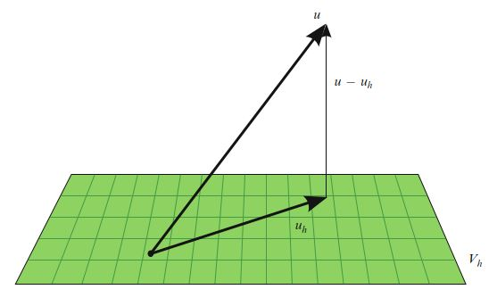
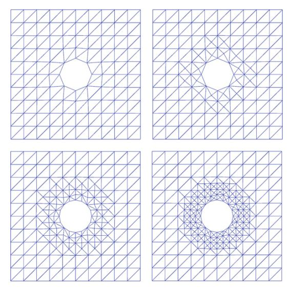

[有限元法解偏微分方程（FEniCS）]()

[有限元法求解牛顿流体（FEniCS）]()

这两篇笔记仅做入门之用。  为了深入掌握，建议阅读《Automated Solution of Differential Equations by the Finite Element Method》。 为此，我一边学习一边翻译权当笔记。

# I.方法论》2.有限元方法（三）

## 2.6 有限元误差估计和适应性

相对于（2.20）精确解$u$，有限元近似解$u_h$的误差$e = u - u_h$可以是`先验的`，也可以是`后验的`。 

`先验`误差估计表示精确（未知）解的规则性方面（terms of the regularity）的误差，并且可以提供有关有限元方法收敛顺序的有用信息。 `后验`误差估计以则可表示为计算量（如残差）的误差，并且（可能）表示为辅助对偶问题的解，具体如下所述。

<!--more-->

### 2.6.1 先验误差分析

我们考虑这个线性变分问题（2.20）。 我们首先假设双线性形式$a$和线性形式$L$是连续的（有界的）。 也就是说，存在一个常数$C>0$，使得

$$
\begin{aligned}a(v, w) &\le C \|v\|_V  \|w\|_V \\ L(v) &\le  C \|v\|_V\end{aligned} \tag{2.61}
$$

$\forall v, w \in V$。为简单起见，我们在本节中假设$V = \hat{V}$是希尔伯特空间。 对于（2.1），这对应于齐次Dirichlet边界条件和$V = H_0^1(\Omega)$的情况。 完全可以扩展到一般情况$V = \hat{V}$； 参见例如Oden和Demkowicz（1996）。 我们进一步假设双线性形式$a$是矫顽的 (V-椭圆)； 也就是说，存在一个常数$\alpha>0$，使得

$$
a(v, v) \ge \alpha \|v\|_V^2, \quad \forall v \in V \tag{2.62}
$$

然后根据Lax-Milgram定理（Lax和Milgram，1954），存在一个唯一解$u \in V$满足变分问题（2.20）。

为了推导出由离散变分问题（2.22）定义的近似解$u_h$的`先验`误差估计，我们首先注意到

$$
a(u-u_h, v) = a(u, v)-a(u_h, v) = L(v) - L(v) = 0  \tag{2.63}
$$

对于所有$v \in V_h \subset V$（Galerkin正交）。 通过双线性形式$a$的矫顽性和连续性，我们发现

$$
\begin{aligned}\alpha \|u - u_h\|_V^2 &\le a(u - u_h, u - u_h) = a(u - u_h, u - v) + a(u_h - u, v - u_h) \\ &= a(u - u_h, u - v) \le C\|u - u_h\|_V \|u - v\|_V \end{aligned} \tag{2.64}
$$

即有，

$$
\|u - u_h\|_V \le \frac{C}{\alpha} \|u - v\|_V,\quad  \forall v \in V_h \tag{2.65}
$$
 

估计值（2.65）被称为Cea引理。 我们注意到，当双线性形式$a$是对称时，它也是一个内积。 然后我们可以取$\|v\|_V = \sqrt{a(v, v)}$和$C=\alpha=1$。 在这种情况下，$u_h$是$u$在$V_h$的a-投影，而Cea引理指出：

$$
\|u - u_h\|_V \le \|u - v\|_V,\quad \forall v \in V_h  \tag{2.66}
$$

也就是说，$u_h$是子空间$V_h$中变分问题（2.20）的最佳解。 如图2.7所示。

图2.7 如果双线性形式$a$是对称的，则有限元解$u_h \in V_h \subset V$是$u\in V$在子空间$V_h$上的a-投影，进而是子空间$V_h$中u的最佳近似（对于由双线性形式a所定义范数而言）。  并且采用Galerkin正交化$\langle u - u_h, v \rangle_a \equiv a(u - uh,v)= 0,\quad  v \in V_h$。 

Cea的引理配合适当的插值估计，现在能产生$u_h$的`先验`误差估计。 通过选择$v =\pi_h u$，其中$\pi_h:V \to V_h$是到$V_h$的插值算子，我们发现

$$
\|u - u_h\|_V \le \frac{C}{\alpha}\|u - \pi_h u\|_V \le \frac{C C_i}{\alpha} \|h^p D^{q+1} u\|_{L^2}  \tag{2.67}
$$

其中$C_i$是一个插值常数，p和q的值取决于插值的精度和$\|\cdot\|_V$的定义。 对于$V = H_0^1$中的泊松方程解，我们有$C=\alpha=1$和$p=q=1$。

### 2.6.2 后验误差分析

`能量范数误差估计`（Energy norm error estimates）。 双线性形式的连续性和矫顽性还允许导出后验误差估计。 这种类型的误差估计，是将误差的大小关联到由下式定义的（弱）残差$r : V \to \mathbb{R}$的大小 ：

$$
r(v) = L(v) - a(u_h, v) \tag{2.68}
$$

注意：弱残差在形式上与`强残差`$R \in \hat{V}'$相关，即$r(v) = \langle R, v\rangle ,\quad \forall v \in \hat{V}$。

我们首先注意到，误差$e=u-u_h$的V-范数 等于 残差$r$的V'-范数。 要看清这一点，请注意，利用双线性形式a的连续性，我们有

$$
\begin{aligned}r(v) &= L(v) - a(u_h, v) = a(u, v) - a(u_h, v) \\ &= a(u - u_h, v)  \le C\|u - u_h\|_V \|v\|_V  \end{aligned}  \tag{2.69} 
$$

此外，利用矫顽性，我们发现

$$
\begin{aligned}\alpha \|u - u_h\|_V^2 &\le a(u - u_h, u - u_h) = a(u, u - u_h) - a(u_h, u - u_h) \\ &= L(u - u_h) - a(u_h, u - u_h) = r(u - u_h)  \end{aligned} \tag{2.70}
$$

即有：

$$
\alpha \|u - u_h\|_V \le \|r\|_{V'} \le C \|u - u_h\|_V \tag{2.71}
$$

其中，$\|r\|_{V'} = \sup_{v \in V,v \ne 0} r(v)/\|v\|_V$。.

估计式（2.67）和（2.71）有时称为`能量范数`误差估计。 当双线性形式a是对称时，进而可定义一个内积时，就是这种情况。 然后可以取$\|v\|_V=a(v, v)$和$C=\alpha=1$。在这种情况下，得出

$$
\eta \equiv \|e\|_V = \|r\|_{V'}  \tag{2.72}
$$

术语`能量范数`所指的$a(v,v)$，在许多应用中对应于物理能量。

`面向目标的错误估计`(Goal-oriented error estimates)。 经典先验和后验误差估计（2.67）和（2.71）,分别与精确解u的规则性误差$e=u-u_h$的V-范数  和 有限元解$u_h$的残差$r = L(v)-a(u_h,v)$ 有关。 但是，在应用中，通常需要将计算出的解的某个输出函数$\mathcal{M}:V\to \mathbb{R}$中的误差控制在给定的公差$\epsilon> 0$内。 典型的函数是计算出的解的平均值，例如浸入流场中的物体的升力或阻力。 在这种情况下，理想的情况是选择有限元空间$V_h \subset V$，以使有限元解$u_h$满足

$$
\eta \equiv |\mathcal{M}(u) - \mathcal{M}(u_h)| \le \epsilon \tag{2.73}
$$

为了最少的计算量。 我们在这里假设输出函数和变分问题都是线性的，但是分析很容易扩展到完全非线性的情况[Eriksson et al.1995, Becker and Rannacher 2001]。

为了估计输出函数$\mathcal{M}$的误差，我们引入了一个辅助对偶问题：找到$z \in V$，使得

$$
a^*(z, v) = \mathcal{M}(v) \quad \forall v \in \hat{V}^* \tag{2.74}
$$

在这里对偶问题中，我们注意到函数$\mathcal{M}$作为数据输入。 对偶（伴随）双线性形式$a^*: V^* \times \hat{V}^* \to \mathbb{R}$由下式定义：

$$
a^*(v, w) = a(w, v) \quad \forall (v, w) \in  V^* \times \hat{V}^* \tag{2.75}
$$

对偶的试验空间和测试空间，则由下式给出：

$$
\begin{aligned}V^* &= Vˆ \\  \hat{V}^* &= V_0 = \{v - w : v, w \in V\} \end{aligned} \tag{2.76}
$$

也就是说，对偶的试验空间对应原始的测试空间，  对偶的测试空间则是原始的试验空间（满足模边界条件，modulo boundary conditions）。 特别是，如果$V = u_0 + \hat{V}$，则$V^* = \hat{V}^* = \hat{V}$，对偶测试函数和对偶试验函数都在Dirichlet边界处消失。 对偶问题的定义使我们得出以下误差表示：

$$
\begin{aligned} \mathcal{M}(u) - \mathcal{M}(u_h) &= \mathcal{M}(u - u_h) \\  &= a^*(z, u - u_h) = a(u - u_h, z) \\ & = L(z) - a(u_h, z) \\ &= r(z) \end{aligned} \tag{2.77}
$$

据此发现，这个误差可由对偶解的残差来精确表示：

$$
\mathcal{M}(u) - \mathcal{M}(u_h) = r(z) \tag{2.78}
$$

### 2.6.3 适应性

如前所述，可以根据已经算出的有限元解$u_h$， 基于V-范数来估计误差， 或者基于输出函数来估计残差$r$的大小。 这可以以几种不同的方式来完成。 该估算通常涉及各部分的集成，以恢复原始PDE的逐元强残差，可能要与单元格或拼接在一起的单元格组上的局部问题的解相结合。 对于泊松方程（2.1）的标准分段线性有限元逼近，可以得到以下估计：

$$
\|u − u_h\|_V \equiv \|\nabla e\|_{L^2} \le C \left(\sum_{T \in \mathcal{T}_h} h^2_T\|R\|^2_T + h_T\|[\partial_n u_h]\|^2_{\partial T} \right)^{1/2}  \tag{2.79}
$$

其中$R|_T = f|_T+\Delta u_h|_T$是强残差，$h_T$表示网格大小（每个单元格T周围最小外接球的直径），$[\partial_n u_h]$表示法向导数跨过网格构面（facet）的跳跃 。有关此估计的推导，请参见例如 Elman et al. (2005)。 令$\eta_T^2= h^2_T \|R\|^2_T + h_T \|[\nabla_n u_h]\|^2_{\partial T}$，我们得到的估计：

$$
\|u - u_h\|_V \le \eta_h \equiv C \left(\sum_T {\eta^2_T}\right)^{1/2} \tag{2.80}
$$

自适应算法试图确定网格大小$h=h(x)$，使得$\eta_h \le \epsilon$。 从初始的粗网格开始，逐个检查每个单元格，如果误差指示器$\eta_T$比较大，那么细化该网格。 有几种可用的策略，例如细化所有$\eta_T$较大的单元格的上半部分，即按$\eta_T$的大小排序的所有单元格的前20％。 其他策略包括细化所有$\eta_T$高于$\max_{T\in \mathcal{T}_h}\eta_T$特定比例(比如：>MAX10%)的单元格，或细化所有单元格的最高特定比例（比如：TOP10%），以使它们的误差指标之和占$\eta_h$的重要部分（所谓的Dörfler标记（Dörfler （1996））。

图2.8 通过对原始粗网格的连续细化获得的一系列自适应细网格。 

一旦网格被细化，就可以计算出新的解和新的误差指示器。 然后重复该过程，直到要么$\eta_h \le \epsilon$（停止标准），要么可用资源（CPU时间和内存）耗尽为止。 自适应算法会产生一系列连续细分的网格，如图2.8所示。 对于与时间依赖的问题，自适应算法需要根据空间和时间确定局部网格大小和（局部）时间步长。 理想情况下，误差估计$\eta_h$接近实际误差，这是由效率指标$\eta_h/\eta$测得的，效率指标$\eta_h/\eta$应当接近并以1为界。

## 2.7 自动化有限元方法

FEniCS项目寻求使微分方程的求解自动化。 这是一项艰巨的任务，但可以通过有限元方法的自动化来解决。 特别是，这种自动化依赖于以下关键步骤：

- (i) 离散化的自动化，

- (ii) 离散解的自动化，

- (iii) 自动化的误差控制。

自2003年成立以来，FEniCS项目主要关注离散化的自动化，从而开发了形式编译器（the form compilers）FFC和SyFi/SFC，代码生成接口UFC，形式语言（the form language）UFL，以及作为为DOLFIN的一部分的`一般组装实现`（a generic assembler implemented）。 结果，现在可以使用FEniCS通过有限元方法自动离散化大量偏微分方程对应的变分问题。 用于离散解的自动化； 也就是说，由于变分问题的自动离散化而产生的线性和非线性系统的解，线性代数的最新库的接口已经作为DOLFIN的一部分实现了。 现在正在进行的工作正在寻求通过自动误差估计和适应性来自动进行误差控制。 在接下来的章节中，我们将回到有限元方法自动化的特定方面，这些方法是FEniCS项目的一部分。 FEniCS项目背后的数学方法也已经在许多科学著作中进行了描述。 欲了解更多信息，请参见Logg（2007）； Logg and Wells（2010）； Kirby（2004）; Kirby和Logg（2006）； Alnæs等。 （2009）； Alnæs和Mardal（2010）； Kirby等。 （2005，2006）; Kirby and Logg（2007，2008）; Kirby and Scott（2007）； Kirby（2006b）; Ølgaard等。 （2008）； Rognes等。 （2009）； Ølgaard和Wells（2010）； Logg（2009）。

## 2.8 历史评注

1915年，鲍里斯·格里高里维奇·加勒金（Boris Grigoryevich Galerkin）提出了求解微分方程的通用方法（Galerkin，1915年）。   Bubnov早些时候提出了一种类似的方法。 Galerkin方法或Bubnov–Galerkin方法最初是用全局多项式表述的，可以追溯到莱布尼兹，欧拉，拉格朗日，狄里克雷特，哈密顿，卡斯蒂利亚诺（Castigliano，1879），瑞利（Rayleigh，1870）和里兹（ Ritz，1908年）。 具有分段多项式空间$(V_h,\hat{V}_h)$的Galerkin方法被称为`有限元方法`。 有限元方法是工程师在1950年代为结构分析而引入的，并且由库兰特（Courant，1943年）独立提出的。  在1960年代，工程师和数学家对有限元方法的使用激增。 从那时起，有限元方法的机制被扩展并精炼为用于设计和分析微分方程数值方法的综合框架。 参见Zienkiewicz等。 （2005）； Strang和Fix（1973）； Ciarlet（1976）； Becker等（1981）； Hughes（1987）; Brenner and Scott（2008）。 最近，对混合变分问题的兼容（稳定）离散的追求导致有限元外部演算的发展（Arnold等，2006a）。

对有限元方法进行后验误差分析的工作可以追溯到Babuška和Rheinboldt（1978）的开创性工作。 重要参考资料包括Bank and Weiser（1985）的著作。 Zienkiewicz和Zhu（1987）； Eriksson和Johnson（1991，1995a）; Eriksson and Johnson，1995b，c）； Eriksson等（1998）； Ainsworth and Oden（1993）和评议论文（Eriksson等，1995；Verfürth，1994，1999； Ainsworth和Oden，2000； Becker和Rannacher，2001）。

【第二章完结】