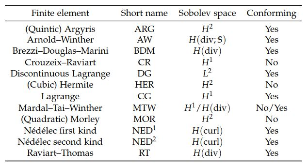
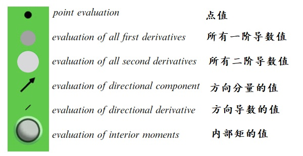
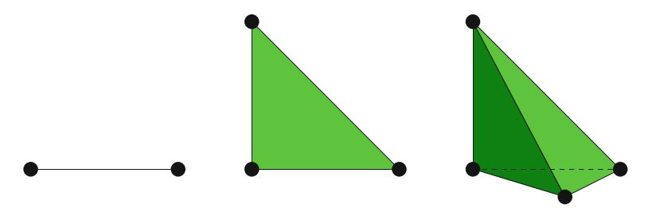
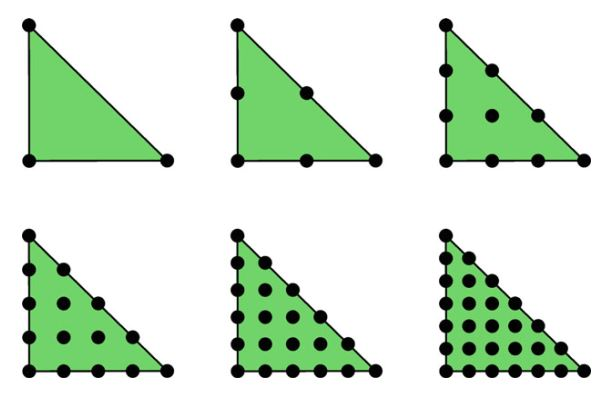
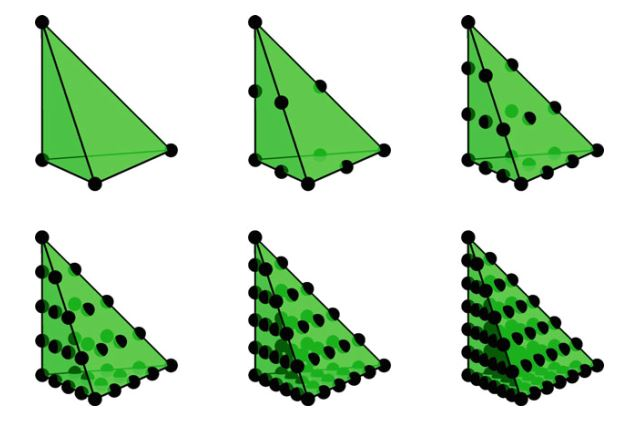
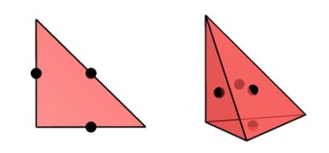

# I.方法论》3.常见有限元（一）

本章简要介绍了文献中的有限元。 这里介绍的许多单元已经作为FEniCS项目的一部分实现了； 一些是未来的工作。 有限元的范围远远超出了我们在此考虑的范围。 特别是，我们仅考虑基于简单多项式的单元。 因此，我们绕过了在四边形和六面体，复合和宏单元技术以及XFEM类型方法中定义的单元。 即使在基于简单多项式单元中，也可以扩展单元列表。 尽管如此，本章还是全面介绍了一些最常见的和较不寻常的有限元。

<!--more-->

## 3.1 有限元定义

Ciarlet（1975）在一系列讲义中首次引入了有限元的Ciarlet定义，并在其1978年的著作（Ciarlet，2002）之后变得流行。 今天，它仍然是标准定义，例如参见Brenner和Scott（2008）。 第2章也介绍了该定义，内容如下：

**定义3.1（有限元（Ciarlet，2002年））** 有限元被定义成一个三元组$(T, \mathcal{V}, \mathcal{L})$，其中

- 域$T$是$\mathbb{R}^d$的有界封闭子集（对于$d = 1, 2, 3, \dots$），具有非空内部和分段光滑边界；

- $\mathcal{V} = \mathcal{V}(T)$是在$T$上的$n$维有限维函数空间；

- 自由度（节点）的集合$\mathcal{L} = \{\ell_1, \ell_2, \dots , \ell_n\}$是对偶空间$\mathcal{V'}$的基底; 也就是$\mathcal{V}$上的有界线性泛函的空间。

相似的想法早在Ciarlet和Raviart（1972）中已有介绍，其中讨论了一组插值点$\{x^i\}_i$的唯一可解性（unisolvence）。 当由$\ell_i(v) = v(x^i)$给出自由度时，就与$\mathcal{L}$的唯一可解性（unisolvence）密切相关。 Bramble和Zlámal（1970）也讨论了基于一组点上的插值函数值和导数值，唯一确定多项式的条件，尽管未使用术语“唯一可解性（unisolvence）”。

对于任何有限元，都可以定义$\mathcal{V}$的局部基底，这就是自由度的对偶。 满足$\ell_i(\phi_j^T) = \delta_{ij}, \quad 1 \le i, j \le n$的基底$\{\phi_1^T, \phi_2^T, \dots , \phi_n^T\}$，被称为`节点基底`（nodal basis）。 通常在有限元计算中要使用此基底。 

与有限元关联的`局部插值算子`，有时也称为`节点插值`（nodal interpolant）。  给定$T$上的函数$f$，`节点插值`由下式定义：

$$
\Pi_T(f) = \sum_{i=1}^n{\ell_i(f) \phi_i^T}  \tag{3.1}
$$

假设$f$足够光滑，对于可以很好定义的、作用与其上的所有自由度。

一旦一个局部有限元空间被定义了，那么定义一个镶嵌在$\mathcal{T}_h$上的全局有限元空间，就相对简单了。 一个全局空间定义所包含的任意函数，在每个$T \in \mathcal{T}_h$上的限制都是躺在局部空间$\mathcal{V}(T)$中的函数，这些函数还满足任何所需的连续性要求。 通常，所选择的每个局部单元的自由度，满足：如果两个相邻胞$T$和$T'$的公共面上的自由度一致，则函数将满足所需的连续性条件。

在构造全局有限元空间时，通常会构造单个参考有限元$(\hat{T}, \hat{\mathcal{V}}, \hat{\mathcal{L}})$，并将其映射 到网格中的每个胞。 当我们处理简单几何时，在$\hat{T}$和每个$T \in \mathcal{T}_h$间的这个映射是仿射的。 仿射等价（affine equivalence）这个概念，虽然最初是为误差估计而定义的，但是对计算也很有用的。 令$F_T : \hat{T} \to T$表示这个仿射映射。 让$v \in \mathcal{V}$。 那么这个仿射映射所关联的`拉回映射`（pullback），由$\mathcal{F}^*(v)(\hat{x}) = v(F_T(\hat{x})),\quad \forall \hat{x} \in \hat{T}$给出。 给定一个$\hat{\ell} \in \hat{\mathcal{V}}'$，其`推前映射`（pushforward）作用于$v \in \mathcal{V}$中的函数的结果，则由$\mathcal{F}_*(\hat{\ell})(v) = \hat{\ell}(\mathcal{F}^*(v))$给出。

**定义3.2（仿射等价）** 令 $(\hat{T}, \hat{\mathcal{V}}, \hat{\mathcal{L}})$和$(T, \mathcal{V}, \mathcal{L})$都是有限元，并且$F_T : \hat{T} \to T$是一个非退化的仿射映射。 如果$\mathcal{F}^*(\mathcal{V}) = \hat{\mathcal{V}}$,并且$\mathcal{F}_*(\hat{\mathcal{L}}) = \mathcal{L}$，那么称这两个有限元是`仿射等价`的。

仿射等效的一个推论是：只需要构造一个节点基底，然后就可以将其映射到网格中的每个胞。 而且，当使用某些类型的Piola映射时，这种等价概念还可以扩展到某些矢量值单元。 在这种情况下，仿射映射是相同的，但是相应的拉回映射（pull-back）和推前映射（push-forward）需要进行了适当的修改。 还值得指出的是，并非所有有限元都生成仿射等价族或Piola等价族。 拉格朗日单元在$H^1$中是仿射等价的，而Hermite单元和Argyris单元则不是。 Raviart–Thomas单元在$H(\mathrm{div})$中Piola等价的，而Mardal–Tai–Winther单元则不是。

表3.1列出了本章讨论的有限元字典。

表3.1 本章讨论的有限元字典，包括全名和相应的（最高阶次）Sobolev空间单元，还有符合与否。

## 3.2 记号

- 域$T \subset \mathbb{R}^d$上阶次最高为$q$的多项式空间，被记作$\mathcal{P}_q(T)$；而相应的d-矢量场，则被记作$[\mathcal{P}_q(T)]^d$。

- 如果$E \subseteq V$，那么有限元空间$E$被称为V-符合的（V-conforming）。 如果不是，则称为（V-）不符合的。

- $\mathcal{L}$的元素，通常是指单元$(T, \mathcal{V}, \mathcal{L})$的`自由度`。 当描述有限元族时，通常以某种示意记号来表示自由度。 我们在下面的列表和图3.1中总结了此处使用的表示法。

图3.1 用于自由度的记号摘要。  比如，三个同心球表示一组由内部矩定义的三个自由度。

**点值（Point evaluation）**。 点$x$处的黑色球体（圆盘）表示函数$v$在该点处的值：

$$
\ell(v) = v(x) \tag{3.2}
$$

对于具有$d$个分量的矢量值函数$v$，黑色球体表示对所有分量的求值，因此对应$d$个自由度。

**所有一阶导数值**。 点$x$处的深灰色略大的球体（圆盘）表示该点上函数$v$的所有一阶导数的值：

$$
\ell_i(v) =\frac{\partial v(x)}{\partial x_i} \quad i = 1,\dots, d  \tag{3.3}
$$

因此对应于$d$个自由度。

**所有二阶导数值**。  点$x$处的浅灰色甚至更大的球体（圆盘）表示该点上函数$v$的所有二阶导数的值：

$$
\ell_{ij}(v) = \frac{\partial^2 v(x)}{\partial x_i \partial x_j} \quad 1 \le i \le j \le d \tag{3.4}
$$

因此对应$d(d + 1)/2$个自由度。

**方向分量的值**。  点$x$处沿方向$n$的箭头，表示在点$x$处的矢量值函数$v$的沿方向$n$的值：

$$
\ell(v) = v(x) \cdot n \tag{3.5}
$$

方向$n$通常是维面（facet）的法线方向，或者是维面或边的切线方向。 有时，我们会在某点使用箭头来表示一个函数在维面或边上分量的矩（对权重函数积分）。

**方向导数的值**。 点$x$处沿方向$n$的黑线，表示在点$x$处标量函数$v$沿方向$n$的方向导数的值：

$$
\ell(v) = \nabla v(x) \cdot n \tag{3.6}
$$

**内部矩的值（Evaluation of interior moments）**。 一组同心球（圆盘）表示内部矩自由度； 也就是说，这种自由度，是通过在域$T$内部，对权重函数进行积分而定义得到的。 球体颜色为白色，黑色，白色等。

我们注意到，对于下面介绍的某些有限元，文献将使用不同的符号和编号方案，因此我们的表示形式可能与单元的原始表示形式完全不同。 特别是，Raviart–Thomas单元族和第一种Nédélec空间的族传统上从0开始编号，而我们随后对有限元外微积分，采用了最新的方案-从1开始编号。

## 3.3 H¹有限元

$H^1$空间是分析和离散化二阶椭圆问题弱形式的基础，而且$H^1$的有限元子空间可产生了一些最著名的有限元。 通常，这些单元使用$C^0$近似空间，因为有界域上的分段光滑函数属于$H^1$，当且仅当它连续的（Braess，2007，定理5.2）。 我们考虑经典的拉格朗日单元，以及一个不符合的的例子，Crouzeix-Raviart空间。 值得注意的是，稍后考虑的Hermite单元在技术上仅是$H^1$单元，但可以用作更光滑空间的不符合的单元。 同样，更光滑的单元（例如Argyris）可用于离散化$H^1$，尽管这在实践中不太常见。

### 3.3.1 拉格朗日单元

最著名和使用最广泛的有限元是$\mathcal{P}_1$拉格朗日单元。 这个最低阶次三角形有时称为`Courant`三角形，在Courant（1943）发表的开创性论文之后，其中变分技术与$\mathcal{P}_1$三角形一起使用导出有限差分法。 有时，这被视为“有限元法”，但实际上，这是由多项式阶次参数化得到单元族，这些单元族将单变量拉格朗日多项式一般化为单纯形，方盒形和其他形状。 较高阶次的拉格朗日单元提供较高阶的近似性质。 而且，这些可以减轻使用线性单元时观察到的锁定现象，或者改进的离散稳定性。 参见Taylor和Hood（1973）； Scott和Vogelius（1985）。

**定义3.3（拉格朗日单元）** `拉格朗日单元`（CGq）被定义为（对$q = 1, 2, \dots$）：

$$
T \in \{\mathrm{interval}, \mathrm{triangle}, \mathrm{tetrahedron}\}  \tag{3.7}
$$

$$
\mathcal{V} = \mathcal{P}_q(T)  \tag{3.8}
$$

$$
\mathcal{l}_i(v) = v(x^i), i = 1, \dots , n(q)  \tag{3.9}
$$

其中， $\{x^i\}^{n(q)}_{i=1}$是$T$中`点的枚举`：

$$
x = \left\{\begin{aligned} i/q & \quad 0 \le i \le q \quad T \  \mathrm{interval} \\ (i/q, j/q) & \quad  0 \le i + j \le q \quad T\  \mathrm{triangle} \\ (i/q, j/q, k/q) & \quad 0 \le i + j + k \le q \quad T \  \mathrm{tetrahedron} \end{aligned} \right. \tag{3.10}
$$

因此，拉格朗日有限元的维数对应于$T$上$q$次完全多项式的维数，即为：

$$
n(q) = \left\{\begin{aligned} q+1 & \quad T \  \mathrm{interval} \\ \frac{1}{2}(q+1)(q+2) & \quad T\  \mathrm{triangle} \\ \frac{1}{6}(q+1)(q+2)(q+3) &  \quad T \  \mathrm{tetrahedron} \end{aligned} \right. \tag{3.11}
$$

上面的定义为点集$\{x^i\}$提供了一个选择。 但是，这不是唯一可能的选择。 通常，可以保证点集$\{x^i\}$是唯一可解的，并且允许边界点进行$C^0$拼接。 该点集必须包括顶点，每个边上的$q-1$个点，每个面的$\frac{1}{2}(q-1)(q-2)$个点，依此类推。 边界点应对称放置，以使相邻胞上的点匹配。 尽管通过巧妙地选择这些点可以极大地改善数值条件和插值属性（Warburton，2005），但出于本章的目的，可以假定这些点位于等距晶格（an equispaced lattice）上。 参见图3.2、3.3和3.4。

图3.2 线性拉格朗日区间，三角形和四面体。

图3.3 拉格朗日CGq三角形 q = 1, 2, 3, 4, 5, 6.

图3.4 拉格朗日CGq四面体 q = 1, 2, 3, 4, 5, 6.

令$\Pi^q_T$表示由$q$次拉格朗日单元的自由度定义的插值，我们从Brenner和Scott（2008）得到

$$
\begin{aligned}\|u − \Pi^q_T u\|_{H^1(T)} &\le C h^q_T|u|_{H^{q+1}(T)} \\  \|u - \Pi^q_T u\|_{L^2(T)} &\le C h^{q+1}_T|u|_{H^{q+1}(T)} \end{aligned} \tag{3.12}
$$

其中，在这里和始终，$C$被用来表示正常数，不依赖$h_T$，而是依赖阶次$q$和单纯形的长宽比（the aspect ratio），并且$u$是足够正则的函数（或矢量场）。

向量值或张量值的拉格朗日单元通常是通过对每个分量使用拉格朗日单元来构造的。

### 3.3.2 Crouzeix–Raviart单元

Crouzeix–Raviart单元在Crouzeix和Raviart（1973）中引入，被作为一种求解固定Stokes方程的技术。 对于线性拉格朗日单元，全局单元空间由分段线性多项式组成。 但是，与拉格朗日单元相反，全局基函数并不一定要在所有点上都是连续的。 连续性仅在维面的中点被要求。 因此，该单元不是$H^1$-符合的，但通常用于$H^1$函数（和矢量场）的非符合的近似。 Crouzeix-Raviart单元的其他应用包括线性弹性（Hansbo和Larson，2003）和Reissner-Mindlin板（Arnold和Falk，1989）。

图3.5 Crouzeix–Raviart单元在三角形和四面体上。自由度是每个维面中点的点值。

**定义3.4（Crouzeix–Raviart单元）** （线性）Crouzeix–Raviart单元（CR）由下式定义：

$$
T \in \{\mathrm{triangle}, \mathrm{tetrahedron}\} \tag{3.13}
$$

$$
\mathcal{V} = \mathcal{P}_1(T) \tag{3.14}
$$

$$
\mathcal{l}_i(v) = v(x^i), i = 1, \dots , n \tag{3.15}
$$

其中$\{x_i\}$是域$T$每个维面的质心（中点）。

因此，$T \subset \mathbb{R}^d$上Crouzeix–Raviart单元的维度为

$$
n = d + 1, d = 2, 3 \tag{3.16}
$$

令$\Pi_T$表示由自由度定义的插值算符，Crouzeix-Raviart单元作为线性拉格朗日单元来进行插值（Braess，2007，第3章.I）：

$$
\begin{aligned}\|u - \Pi_T u\|_{H^1(T)} &\le C h_T|u|_{H^2(T)} \\  \|u - \Pi_T u\|_{L^2(T)} &\le C h^2_T|u|_{H^2(T)} \end{aligned} \tag{3.17}
$$

向量值的Crouzeix-Raviart单元可以通过对每个分量使用Crouzeix-Raviart单元来定义，或者通过在每个维面的中点使用维面法线和维面切向分量作为自由度来定义。 Crouzeix-Raviart单元可以扩展到更高的奇数阶次（q = 3、5、7 ...）（Crouzeix和Falk，1989）。

【第三章未完待续】

