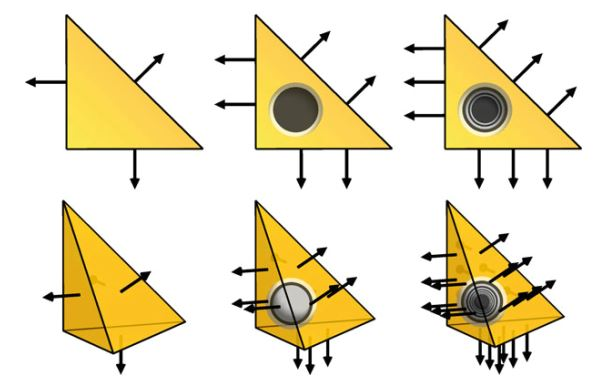
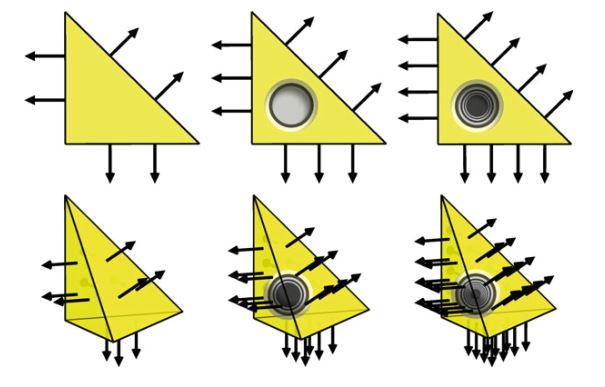
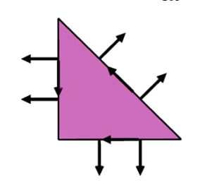
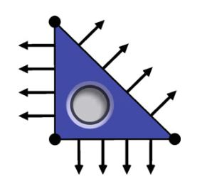
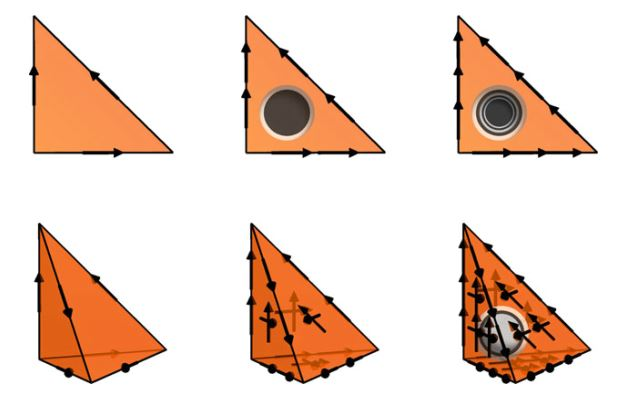
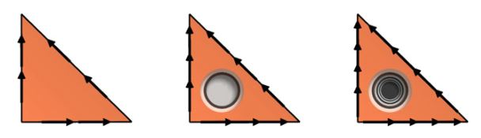
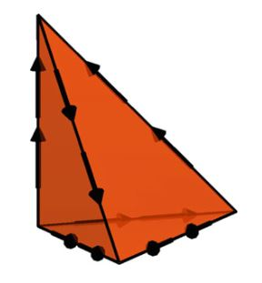

# I.方法论》3.常见有限元（二）

【<a href="">第3章前续</a> | <a href="#第三章-常见有限元">总目录</a>】

## 3·4 H（div）有限元

Sobolev空间$H(\mathrm{div})$由分量和弱散度（the weak divergence）都平方可积的`矢量场`组成。 这是一个比d-矢量场（$[H^1]^d, \quad d \ge 2$）还要更弱的要求。 这个空间自然是与二阶椭圆问题，多孔介质流和弹性方程的混合形式有关的。 对于$H(\mathrm{div})$-符合的有限元族，虽然每个分量不必是连续的，但是法向分量必须是连续的。 为了确保这种连续性，$H(\mathrm{div})$-符合的单元的自由度通常包括单元的维面（facets）上的法向分量。

<!--more-->

$H(\mathrm{div})$-符合的两个主要单元族是Raviart–Thomas单元和Brezzi–Douglas–Marini单元。这两个族如后所述。 此外还包括：可以离散化具有平方可积的逐行散度对称张量场空间的Arnold-Winther单元，和Mardal-Tai-Winther单元。 【译者注：所谓`逐行散度`（row-wise divergence），比如对矩阵而言，就是对每行求散度】

### 3·4·1 Raviart–Thomas单元

Raviart-Thomas单元由Raviart和Thomas（1977）引入。 这是对三角形上二阶椭圆方程混合形式离散化的第一个单元。 这个单元的空间$\mathcal{V}$被设计成最小多项式空间$\mathcal{V} \subset \mathcal{P}_q(T), \quad q = 1, 2, \dots$，从中可以将散度映射到$\mathcal{P}_{q-1}(T)$。  此后不久，Nédélec（1980）将其扩展到四面体和方盒体。 因此，有时也将其称为Raviart–Thomas–Nédélec单元。 在这里，我们将其二维和三维的版本都标记为Raviart–Thomas单元。

以下给出的定义是基于Nédélec（1980）（和Brezzi和Fortin（1991））提出的。  原始的Raviart–Thomas论文使用略有不同的形式。 此外，Raviart和Thomas最初是从$q=0$开始计数的。 因此，这种最低阶次的单元，传统上被称为$\mathrm{RT}_0$单元。 为了保持一致性，这种$\mathcal{P}_q(T)$中的多项式有限元阶次$q$，我们在这里改用$q=1$来标记最低阶次单元（Nédélec也是如此） 。

图3.6 三角形和四面体上的1次，2次和3次Raviart-Thomas单元的自由度图示。  这个自由度是指相对于维面（相应还有边和面）上$\mathcal{P}_{q-1}$的法向分量矩； 对于更高阶次单元，则是相对于$[\mathcal{P}_{q-2}]^d$的内部矩。 或者，如图所示，法向分量的矩，可用法向分量的点值替代。

**定义3.5（Raviart–Thomas单元）** Raviart–Thomas单元（$\mathrm{RT}_q, \quad q = 1, 2, \dots$）的定义为：

$$
T \in \{\mathrm{triangle}, \mathrm{tetrahedron}\} \tag{3.18}
$$

$$
\mathcal{V} = [\mathcal{P}_{q-1}(T)]^d + x \mathcal{P}_{q-1}(T) \tag{3.19}
$$

$$
\mathcal{L} = \left\{\begin{aligned}\int_f{ v \cdot n p ds} & \quad \text{ 对基函数集 } p \in \mathcal{P}_{q-1}(f) \ \text{ 对每个维面 } f \\ \int_T v \cdot p dx & \quad \text{ 对基函数集 } p \in [\mathcal{P}_{q-2}(T)]^d, \  q \ge 2 \end{aligned}\right. \tag{3.20}
$$

例如，三角形上最低阶次Raviart–Thomas空间是一个三维空间，由以下形式的矢量场组成

$$
v(x) = \alpha + \beta x \tag{3.21}
$$

其中，$\alpha$是矢量值常量，$\beta$ 是标量常量。

$\mathrm{RT}_q$的维数：

$$
n(q) = \left\{\begin{aligned}q(q+2) & \quad T \ \mathrm{triangle} \\ \frac{1}{2}q(q+1)(q+3) & \quad T \ \mathrm{tetrahedron}  \end{aligned}\right. \tag{3.22}
$$

令$\Pi^q_T, q = 1, 2, \dots$表示由自由度定义的插值算符，我们有（Brezzi和Fortin，1991，第III.3章）。

$$
\begin{aligned}\|u - \Pi^q_T u\|_{H(\mathrm{div})(T)} &\le C h^q_T|u|_{H^{q+1}(T)} \\ \|u - \Pi^q_T u\|_{L^2(T)} &\le C h^q_T|u|_{H^q(T)} \end{aligned} \tag{3.23}
$$

### 3·4·2 Brezzi–Douglas–Marini单元

Brezzi–Douglas–Marini单元由Brezzi，Douglas和Marini在Brezzi等人（1985a）的二维（三角形）基础上引入的。 这个单元可被看作是使用完全多项式空间的Raviart–Thomas单元的另一种选择。 后来被Nédélec（1986）和Brezzi等人（1987a）将其扩展到三维的（四面体，棱柱和立方体）。 此处给出的定义基于Nédélec（1986）的。

引入Brezzi–Douglas–Marini单元，可用于二阶椭圆方程的混合公式。 但是，它对于弹性应力张量的弱对称离散化也是有用的。 参见Farhloul和Fortin（1997）； Arnold等（2007） 。

图3.7 三角形和四面体上的1次，2次和3次Brezzi–Douglas–Marini单元的图示。  这个自由度是指相对于维面（相应还有边和面）上$\mathcal{P}_q$的法向分量矩； 对于更高阶次单元，则是相对于$\mathrm{NED}^1_{q-1}$的内部矩。 或者，如图所示，法向分量的矩，可用法向分量的点值替代。

**定义3.6（Brezzi–Douglas–Marini单元）**  Brezzi–Douglas–Marini单元（$\mathrm{BDM}_q,\quad q = 1, 2, \dots$）的定义为

$$
T \in \{\mathrm{triangle}, \mathrm{tetrahedron}\} \tag{3.24}
$$

$$
\mathcal{V} = [\mathcal{P}_q(T)]^d  \tag{3.25}
$$

$$
\mathcal{L} = \left\{\begin{aligned}\int_f{ v \cdot n p ds} & \quad \text{ 对基函数集 } p \in \mathcal{P}_q(f) \ \text{ 对每个维面 } f \\ \int_T v \cdot p dx & \quad \text{ 对基函数集 } p \in \mathrm{NED}^1_{q-1}(T), \  q \ge 2 \end{aligned}\right. \tag{3.26}
$$

其中，$\mathrm{NED}^1$指是后面第3.5.1节中定义的第一种Nédélec$H(\mathrm{curl})$单元。

$\mathrm{BDM}_q$的维数： 

$$
n(q) = \left\{\begin{aligned}(q+1)(q+2) & \quad T \ \mathrm{triangle} \\ \frac{1}{2}(q+1)(q+2)(q+3) & \quad T \ \mathrm{tetrahedron}  \end{aligned}\right. \tag{3.27}
$$

令$\Pi^q_T,\quad q = 1, 2, \dots$表示由自由度定义的插值算符，于是有（Brezzi和Fortin，1991，第III.3章）：

$$
\begin{aligned}\|u - \Pi^q_T u\|_{H(\mathrm{div})(T)} &\le C h^q_T|u|_{H^{q+1}(T)} \\ \|u - \Pi^q_T u\|_{L^2(T)} &\le C h^{q+1}_T|u|_{H^{q+1}(T)} \end{aligned} \tag{3.28}
$$

Brezzi–Douglas–Marini单元的一个轻微修改，约束在单元空间$\mathcal{V}$上，通过仅允许$q-1$次多项式（而不是$q$次完全多项式）在边界的法向分量。 Brezzi等人（1987b）在矩形上建议使用这种单元，并且Brezzi和Fortin（1991）也给出了在三角形上的类似的物。 以类似的精神，Brezzi等人（1985b），在合适的边界上，调整三角形间的多项式阶次，推导出具有不同阶次的单元。

### 3·4·3 Mardal–Tai–Winther单元

Mardal-Tai-Winther单元由Mardal等人 (2002)引入，用作适用于二维Darcy和Stokes流速度空间的有限元。 在Darcy流方程中，速度空间仅要求$H(\mathrm{div})$-正则性。 此外，基于$H^1$-符合的有限元的离散化通常不稳定。 另一方面，对于Stokes方程，速度空间明确规定了$H^1$-正则性。 Mardal–Tai–Winther单元是$H(\mathrm{div})$-符合的，但是$H^1$-不符合的。 在Tai和Winther（2006）中，该单元被扩展到三维，但是在这里我们仅介绍二维情况。

图3.8 Mardal–Tai–Winther单元的图示。 这个自由度是每个维面上的法向分量的两个矩和每个维面上的切向分量的一个矩。 在此图中，法向分量的矩可用法向分量的点值描述。

**定义3.7（Mardal–Tai–Winther单元）** Mardal–Tai–Winther单元 ($\mathrm{MTW}$)被定义为： 

$$
T = \mathrm{triangle} \tag{3.29}
$$

$$
\begin{aligned}\mathcal{V} = \{v &\in [\mathcal{P}_3(T)]^2, \\  & \qquad \mathrm{s.t.} \ \mathrm{div}\ v\in\mathcal{P}_0(T) \text{ and } v\cdot n|_f\in\mathcal{P}_1(T),\\ &\qquad \qquad \text{ 对每个维面}f   \} \end{aligned}  \tag{3.30}
$$

$$
\mathcal{L} = \left\{\begin{aligned}\int_f{ v \cdot n p ds} & \quad \text{ 对基函数集 } p \in \mathcal{P}_1(f) \text{ 对每个维面} f \\ \int_f v \cdot t dx & \quad \text{ 对每个维面} f \end{aligned}\right. \tag{3.31}
$$

$\mathrm{MTW}$的维数为： 

$$
n = 9 \tag{3.32}
$$

令$\Pi_T$表示由自由度定义的插值算子，我们有

$$
\begin{aligned}\|u - \Pi_T u\|_{H^1(T)} &\le C h_T|u|_{H^2(T)} \\ \|u - \Pi_T u\|_{H(\mathrm{div})(T)} &\le C h_T|u|_{H^2(T)}  \\ \|u - \Pi_T u\|_{L^2(T)} &\le C h^2_T|u|_{H^2(T)} \end{aligned} \tag{3.33}
$$

### 3·4·4 Arnold–Winther单元

Arnold-Winther单元由Arnold和Winther（2002）引入。 这篇论文提出了用于线性弹性应力-位移公式的首个稳定的混合（非复合）有限元。 被用于应力空间的这种有限元，在这里表示为Arnold-Winther单元。 此有限元是一个逐行$H(\mathrm{div})$-符合的对称张量单元。 此有限元是为多项式阶次的层次结构引入的，并且被Adams和Cockburn（2005）和Arnold等人（2008年）扩展到了三维。 但这里我们仅介绍最低阶次的二维情况。

图3.9 Arnold–Winther单元的图示。 这里的24个自由度是顶点值，在每个维面上张量场的每一行的法向分量的两个第一矩和三个内部矩。

**定义3.8（Arnold–Winther单元）** （最低阶次）Arnold–Winther单元 ($\mathrm{AW}$)被定义为：

$$
T = \mathrm{triangle} \tag{3.34}
$$

$$
\mathcal{V} = \left\{v\in\mathcal{P}_3(T;S): \mathrm{div}\ v\in \mathcal{P}_1(T;\mathbb{R}^2) \right\}  \tag{3.35}
$$

$$
\mathcal{L} = \left\{\begin{aligned}v(x^k)_{ij} & \quad  1 \le i \le j \le 2 \ \text{在每个顶点} x^k \\ \int_f{ \sum^2_{j=1}{v_{ij} n_j} p ds} & \quad \text{ 对基函数集 } p \in \mathcal{P}_1(f), \\ & \qquad \text{ 对每个维面} f,\ 1 \le i \le 2 \\ \int_T v_{ij} dx & \quad 1 \le i \le j \le 2 \end{aligned}\right. \tag{3.36}
$$

$\mathrm{AW}$的维数为：

$$
n = 24 \tag{3.37}
$$

令$\Pi_T$表示由自由度定义的插值算子，我们有

$$
\begin{aligned}\|u - \Pi_T u\|_{H(\mathrm{div})(T)} &\le C h^2_T|u|_{H^3(T)}  \\ \|u - \Pi_T u\|_{L^2(T)} &\le C h^3_T|u|_{H^3(T)} \end{aligned} \tag{3.38}
$$

## 3·5 H（curl）有限元

Sobolev空间$H(\mathrm{curl})$经常出现在与电磁有关的问题中。 Nédélec单元（俗称边单元）被广泛用于解决此类问题，并且是“非标准”（即非最低拉格朗日）有限元的典范（Nédélec，1980，1986）。 为了使分段多项式成为$H(\mathrm{curl})$-符合的，切向分量必须是连续的。 因此，$H(\mathrm{curl})$-符合的有限元的自由度通常包括切向分量。

Nédélec（1980，1986）在论文中引入了四族有限元空间。 第一篇论文（1980年）介绍了四面体，立方体和棱柱上的两个有限元空间族：一个是$H(\mathrm{div})$-符合的族，另一个是$H(\mathrm{curl})$-符合的族。 这两个族分别被称为第一种Nédélec$H(\mathrm{div})$单元和第一种Nédélec$H(\mathrm{curl})$单元。 $H(\mathrm{div})$单元可以看作是Raviart–Thomas单元的三维扩展。（因此，作为前面的Raviart–Thomas单元而呈现。） 后面将介绍第一种Nédélec$H(\mathrm{curl})$单元。

第二篇论文（1986年）介绍了更多的有限元空间族： 相应有, 一个是 $H(\mathrm{div})$-符合的族， 另一个是$H(\mathrm{curl})$-符合的族。  相应的，这两个族分别被称为第二种Nédélec $H(\mathrm{div})$单元和第二种Nédélec $H(\mathrm{curl})$单元。 $H(\mathrm{div})$单元可看作是Brezzi–Douglas–Marini单元的三维扩展。 (因此，作为前面的Brezzi–Douglas–Marini单元而呈现。) 后面将介绍第二种Nédélec $H(\mathrm{curl})$单元。

Nédélec在他的两篇经典论文中只考虑了三维情况。 但是，也可以定义一个二维`curl`和二维$H(\mathrm{curl})$-符合的有限元空间。 在此，我们在三角形上展示Nédélec单元。 尽管是否能将这些单元归到Nédélec名下不得而知，但出于完整性考虑，我们还是将它们包括在内。

Nédélec的工作在许多方面都预见了Arnold等人（2006a）最近提出的有限元外微积分。 ，其中第一种空间表现为$\mathcal{P}_q^-\Lambda^k$空间，第二种则表现为$\mathcal{P}_q\Lambda^k$。 此外，在Nédélec（1980）中使用微分算子（弹性应变）来表征函数空间，预示着Arnold等人（2006b）使用的`微分复形`（differential complexes）。 

### 3·5·1 第一种Nedelec H（curl）单元

图3.10 三角形和四面体上的1次，二次和三次$H(\mathrm{curl})$单元的图示。 请注意，这些单元可能被视为Raviart–Thomas单元的旋转。 对于一次Nédélec单元，其自由度是边上的平均值，或者是边中点处的切向分量的值。 因此，有“边单元”之称。 

**定义3.9（第一种Nédélec H(curl)单元）** 对$q = 1, 2, \dots$ , 定义空间：

$$
S_q(T) = \left\{s \in [\mathcal{P}_q(T)]^d : s(x) \cdot x = 0 \quad \forall x \in T\right\} \tag{3.39}
$$

第一种Nédélec单元 ($\mathrm{NED}^1_q,\quad q = 1, 2, \dots$)被定义为(二维的情况)：

$$
T = \mathrm{triangle} \tag{3.40}
$$

$$
\mathcal{V} = [\mathcal{P}_{q-1}(T)]^2 + S_q(T)  \tag{3.41}
$$

$$
\mathcal{L} = \left\{\begin{aligned}\int_e{ v \cdot t p ds} & \quad \text{ 对基函数集 } p \in \mathcal{P}_{q-1}(e) \text{ 对每个边} e \\ \int_T v \cdot p dx & \quad \text{ 对基函数集 } p \in [\mathcal{P}_{q-2}(T)]^2,\quad q \ge 2 \end{aligned}\right. \tag{3.42}
$$

其中t是边的切线; 对于的三维情况：

$$
T = \mathrm{tetrahedron} \tag{3.43}
$$

$$
\mathcal{V} = [\mathcal{P}_{q-1}(T)]^3 + S_q(T)  \tag{3.44}
$$

$$
\mathcal{L} = \left\{\begin{aligned}\int_e{ v \cdot t p dl} & \quad \text{ 对基函数集 } p \in \mathcal{P}_{q-1}(e) \text{ 对每个边} e \\ \int_f{ v \times n \cdot p ds} & \quad \text{ 对基函数集 } p \in [\mathcal{P}_{q-2}(f)]^2, \\ &\qquad \qquad  \text{ 对每个面} f, \quad q \ge 2 \\ \int_T v \cdot p dx & \quad \text{ 对基函数集 } p \in [\mathcal{P}_{q-3}]^3,\quad q \ge 3 \end{aligned}\right. \tag{3.45}
$$

$\mathrm{NED}^1_q$的维数为：

$$
n(q) = \left\{\begin{aligned}q(q+2) & \quad T \ \mathrm{triangle} \\ \frac{1}{2}q(q+2)(q+3) & \quad T \ \mathrm{tetrahedron}  \end{aligned}\right. \tag{3.46}
$$

令$\Pi^q_T$表示由上面的自由度定义的插值算符，我们有（Nédélec, 1980, 定理2）

$$
\begin{aligned}\|u - \Pi^q_T u\|_{H(\mathrm{curl})(T)} &\le C h^q_T|u|_{H^{q+1}(T)}  \\ \|u - \Pi^q_T u\|_{L^2(T)} &\le C h^q_T|u|_{H^q(T)} \end{aligned} \tag{3.47}
$$

### 3·5·2 第二种Nedelec H（curl）单元

图3.11  三角形上1次，2次和3次Nédélec $H(\mathrm{curl})$单元的图示。 请注意，这些单元可能被视为Brezzi–Douglas–Marini单元的旋转。

图3.12 四面体上第二种Nédélec $H(\mathrm{curl})$单元的图示。

**定义3.10（第二种Nédélec H(curl)单元）** 第二种Nédélec单元($\mathrm{NED}^2_q,\quad q = 1, 2, \dots$)被定义为（二维的情况）：

$$
T = \mathrm{triangle} \tag{3.48}
$$

$$
\mathcal{V} = [\mathcal{P}_q(T)]^2   \tag{3.49}
$$

$$
\mathcal{L} = \left\{\begin{aligned}\int_e{ v \cdot t p ds} & \quad \text{ 对基函数集 } p \in \mathcal{P}_q(e) \text{ 对每个边} e \\ \int_T v \cdot p dx & \quad \text{ 对基函数集 } p \in \mathrm{RT}_{q-1}(T),\quad q \ge 2 \end{aligned}\right. \tag{3.50}
$$

其中t是边的切线; 对于的三维情况：

$$
T = \mathrm{tetrahedron} \tag{3.51}
$$

$$
\mathcal{V} = [\mathcal{P}_q(T)]^3  \tag{3.52}
$$

$$
\mathcal{L} = \left\{\begin{aligned}\int_e{ v \cdot t p dl} & \quad \text{ 对基函数集 } p \in \mathcal{P}_q(e) \text{ 对每个边} e \\ \int_f{ v \cdot p ds} & \quad \text{ 对基函数集 } p \in \mathrm{RT}_{q-1}(f), \\ &\qquad \qquad \text{ 对每个面} f, \quad q \ge 2 \\ \int_T v \cdot p dx & \quad \text{ 对基函数集 } p \in \mathrm{RT}_{q-2}(T),\quad q \ge 3 \end{aligned}\right. \tag{3.53}
$$

$\mathrm{NED}^2_q$的维数为：

$$
n(q) = \left\{\begin{aligned}(q+1)(q+2) & \quad T \ \mathrm{triangle} \\ \frac{1}{2}(q+1)(q+2)(q+3) & \quad T \ \mathrm{tetrahedron}  \end{aligned}\right. \tag{3.54}
$$

令$\Pi^q_T$表示由上面的自由度定义的插值算符，我们有（Nédélec, 1986, 命题3）

$$
\begin{aligned}\|u - \Pi^q_T u\|_{H(\mathrm{curl})(T)} &\le C h^q_T|u|_{H^{q+1}(T)}  \\ \|u - \Pi^q_T u\|_{L^2(T)} &\le C h^{q+1}_T|u|_{H^{q+1}(T)} \end{aligned} \tag{3.55}
$$

【<a href="">第3章后续</a>】

