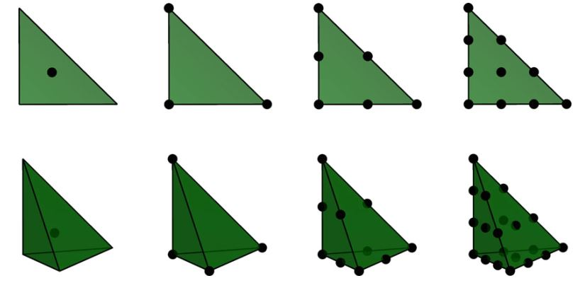
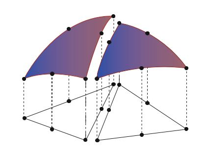
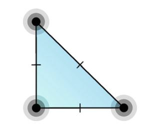
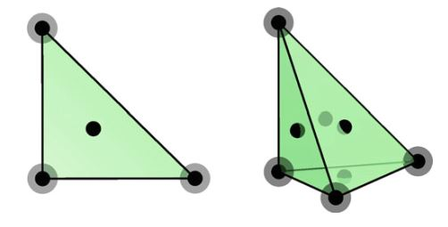
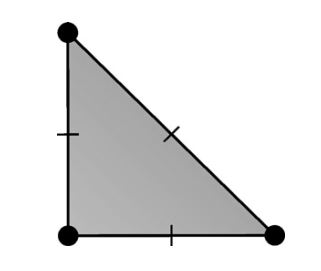
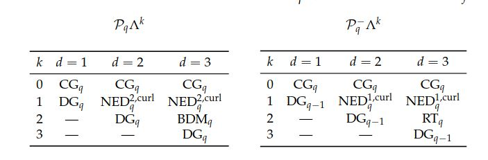
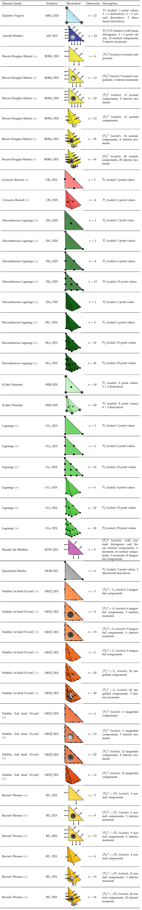

# I.方法论》3.常见有限元（三）

<center>【<a href="">第3章前续</a> | <a href="#第三章-常见有限元">总目录</a>】</center>

## 3.6 L² 有限元

$L^2$单元，通常指的是其元素非$C^0$的有限元空间。 这些单元自然存在于泊松方程，Stokes流和弹性的混合公式中。 或者，这样的单元也可以以不符合的方式被使用，而不是直接施以所期望的弱连续性。 不连续Galerkin（DG）方法为此提供了一个典型例子。 在这种情况下，单元维面的数值通量被组合为弱形式的一部分。 DG方法的许多变体就是以不同的数值通量来定义的。 DG方法最初是针对双曲问题开发的，但现已成功应用于许多椭圆和抛物线问题中。 而且，每个单独单元的去耦化为并行性和hp适应性提供了更多的机会。

<!--more-->

### 3.6.1 不连续拉格朗日



<center>图3.13  三角形和四面体上的0次，1次，2次和3次不连续拉格朗日单元的图示。可以任意选择自由度，只要可以张成对偶空间$\mathcal{V}'$。  在这里，自由度被选为与标准拉格朗日有限元相同，不同之处在于这个自由度被视为单元的内部。</center>



<center>图3.14 不连续拉格朗日有限元的所有自由度都在该单元内部，这意味着这些单元没有强加全局连续性。 此处针对不连续的二次拉格朗日单元进行了图示。</center>

**定义3.11 (不连续拉格朗日单元)** 不连续拉格朗日单元（$\mathrm{DG}_q, \quad q=0,1,2,\dots$）被定义为：

$$
T \in \{\mathrm{interval}, \mathrm{triangle}, \mathrm{tetrahedron}\} \tag{3.56}
$$

$$
\mathcal{V} = \mathcal{P}_q(T) \tag{3.57}
$$

$$
\ell_i(v) = v(x^i) \tag{3.58}
$$

其中， $\{x^i\}^{n(q)}_{i=1}$是$T$上由下式定义的点序列：

$$
x = \left\{\begin{aligned}i/q &\quad 0 \le i \le q &T \ \mathrm{interval} \\ (i/q,j/q) &\quad 0 \le i+j \le q &T \ \mathrm{triangle} \\ (i/q,j/q,k/q) &\quad 0 \le i+j+k \le q &T \ \mathrm{tetrahedron}  \end{aligned} \right. \tag{3.59}
$$

$\mathrm{DG}_q$的维度是：

$$
n(q) = \left\{\begin{aligned}q+1 & \quad T \ \mathrm{interval} \\ \frac{1}{2}(q+1)(q+2) &\quad T \ \mathrm{triangle} \\ \frac{1}{6}(q+1)(q+2)(q+2) &\quad T \ \mathrm{tetrahedron}  \end{aligned} \right. \tag{3.60}
$$

令$\Pi^q_T$表示上面这个自由度的插值算符，$q$次$\mathrm{DG}_q$单元的插值性质：

$$
\|u - \Pi^q_T u\|_{L^2(T)} \le C h^{q+1}_T|u|_{H^{q+1}(T)} \tag{3.61}
$$

## 3.7 H²有限元

$H^2$单元通常用于四阶问题的近似，或用于至少$C^1$连续的其他空间。 由于连续性要求的局限性，符合的单元通常具有较高的多项式阶次，但是事实证明，较低阶次的不符合单元已经被证明是成功的。 因此，我们在这里考虑符合的Argyris单元，以及不符合的Hermite单元和Morley单元。

### 3.7.1 Argyris单元

Argyris单元（Argyris等人，1968； Ciarlet，2002）是基于三角形$T$上的五次多项式的空间$\mathcal{P}_5(T)$的。 可以将其各单元之间以完全$C^1$连续性拼接在一起，并且在三角剖分的顶点处是$C^2$连续的。



<center>图3.15 五次Argyris三角形。  这个自由度是三角形顶点处的点值，所有一阶导数值和所有二阶导数值，以及在每个边中点处的法向导数值。</center>

**定义3.12 (Argyris单元)** (5次) Argyris单元 ($\mathrm{ARG}_5$)被定义为：

$$
T = \mathrm{triangle} \tag{3.62}
$$

$$
\mathcal{V} = \mathcal{P}_5(T) \tag{3.63}
$$

$$
\mathcal{L}=\left\{\begin{aligned} v(x^i) & \quad \text{对每个顶点}x^i \\ \mathrm{grad}\ v(x^i)_j & \quad \text{对每个顶点}x^i,\text{每个分量}j \\ D^2v(x^i)_{jk} & \quad \text{对每个顶点}x^i,\text{每个分量}jk,j\le k \\ \mathrm{grad}\ v(m^i) \cdot n & \quad \text{对每个边中点}m^i \end{aligned} \right. \tag{3.64}
$$

$\mathrm{ARG}_5$的维数：

$$
n = 21 \tag{3.65}
$$

令$\Pi_t$表示上面自由度的插值算符，这个（5次）Argyris单元的插值性质为 (Braess, 2007, 第II.6章节):

$$
\begin{aligned}\|u - \Pi_T u\|_{H^2(T)} \le C h^4_T|u|_{H^6(T)} \\ \|u - \Pi_T u\|_{H^1(T)} \le C h^5_T|u|_{H^6(T)} \\ \|u - \Pi_T u\|_{L^2(T)} \le C h^6_T|u|_{H^6(T)} \end{aligned} \tag{3.66}
$$

对Argyris单元，其对偶基底中的法向导数  阻止了它成为仿射插值等价。 这样就阻止了将节点基底构建在参考胞元上并且仿射映射的做法。 Domínguez和Sayas的最新工作（2008）开发了一种可纠正此问题的转换，与直接在网格中的每个单元上形成基底相比，所需的计算工作量更少。 可以将Argyris单元素推广到高于五次的多项式，依然给出$C^1$连续性，并且在顶点处$C^2$连续（Šolín等人，2004）。

### 3.7.2 Hermite单元

Hermite单元是经典三次Hermite插值多项式在线段上的推广（Ciarlet，2002）。 Hermite型单元几乎从一开始就出现在有限元文献中，至少早在Ciarlet和Raviart（1972）的经典论文中就出现了。 长期以来，它们一直被认为是有用的$C^1$-符合的单元（Braess，2007； Ciarlet，2002）。 在仿射映射下，Hermite单元形成仿射插值等价族（Brenner和Scott，2008）。

在三角形上，三次多项式空间是十维的，而Hermite单元的十个自由度是在三角形顶点和质心处的点值，以及顶点处梯度分量值。 可类似地推广到四面体。



<center>图3.16 3次Hermite三角形和四面体。自由度是顶点和质心处的点值，以及顶点处所有一阶导数值。 </center>

**定义3.13 (Hermite单元)** (3次) Hermite单元 (\mathrm{HER})被定义如下：

$$
T \in \{\mathrm{interval}, \mathrm{triangle}, \mathrm{tetrahedron}\} \tag{3.67}
$$

$$
\mathcal{V} = \mathcal{P}_3(T) \tag{3.68}
$$

$$
\mathcal{L}=\left\{\begin{aligned} v(x^i) & \quad \text{对每个顶点}x^i \\ \mathrm{grad}\ v(x^i)_j & \quad \text{对每个顶点}x^i,\text{每个分量}j \\ v(b) & \quad \text{对(3维中各面的)质心}b \end{aligned} \right. \tag{3.69}
$$

$\mathrm{HER}$的维数：

$$
n = \left\{\begin{aligned} 10 & \quad T \ \mathrm{triangle} \\ 20 & \quad T \ \mathrm{tetrahedron}  \end{aligned} \right. \tag{3.70}
$$

令$\Pi_T$表示由上述自由度定义的插值算符，（三次）Hermite单元的插值性质为：

$$
\begin{aligned}\|u - \Pi_T u\|_{H^1(T)} \le C h^3_T|u|_{H^4(T)} \\ \|u - \Pi_T u\|_{L^2(T)} \le C h^4_T|u|_{H^4(T)} \end{aligned} \tag{3.71}
$$

与线段上的三次Hermite函数不同，三次Hermite三角形和四面体不能以完全$C^1$的方式连接在一起。 三次Hermite单元可以扩展到更高的次数（Brenner和Scott，2008年）。

### 3.7.3 Morley单元

Morley（1968）定义的Morley三角形是一个简单的$H^2$-不符合的二次单元，被用于四阶问题中。 其函数空间$\mathcal{V}$只是$\mathcal{P}_2(T)$，这是二次的六维空间。 自由度包括每个顶点的逐点值和每个边中点法向导数的值。 有趣的是，Morley三角形既不是$C^1$也不是$C^0$，但是它适用于四阶问题的已知最简单的单元。

Morley单元是由Morley（1968，1971）首次引入工程文献的。 在数学文献中，Lascaux和Lesaint（1975）在研究板弯曲单元的拼接测试中考虑了这一点。 Morley单元的最新应用还包括了Huang等（2008）； Ming和Xu（2006）。



<center>图3.17 二次Morley三角形。 自由度是在顶点处的点值和在每个边中点法向导数的值。</center>

**定义3.14 (Morley单元)** （2次）Morley单元 ($\mathrm{MOR}$) 被定义为：

$$
T = \mathrm{triangle} \tag{3.72}
$$

$$
\mathcal{V} = \mathcal{P}_2(T) \tag{3.73}
$$

$$
\mathcal{L}=\left\{\begin{aligned} v(x^i) & \quad \text{对每个顶点}x^i \\ \mathrm{grad}\ v(m^i) \cdot n & \quad \text{对每个边中点}m^i \end{aligned} \right. \tag{3.74}
$$

Morley单元的维数：

$$
n = 6 \tag{3.75}
$$

让$\Pi_T$表示由上述自由度定义的插值算符，（二次）Morley单元的插值性质为：

$$
\begin{aligned}\|u - \Pi_T u\|_{H^1(T)} \le C h^2_T|u|_{H^3(T)} \\ \|u - \Pi_T u\|_{L^2(T)} \le C h^3_T|u|_{H^3(T)} \end{aligned} \tag{3.76}
$$

## 3.8 强化有限元

如果$U$，$V$是线性空间，则可以定义新的线性空间$W$：

$$
W = \{w = u + v : u \in U, v \in V\} \tag{3.77}
$$

在这里，我们称如此选择的空间$W$为`强化空间`（enriched space）。

有限元空间的强化可以提高稳定性，特别是对于混合有限元方法。 例如，使用Stokes方程的气泡函数（bubble functions）的拉格朗日单元的强化，或者使用线性弹性的Raviart-Thomas单元的强化（Arnold等，1984a，b）。 此后，气泡函数被用于许多方面。 我们在此定义一个气泡单元，以方便参考。 气泡单元的使用例子包括：

用于Stokes方程的`MINI单元`。 在最低阶次的情况下，线性矢量拉格朗日单元被三次矢量气泡单元所强化 ，用于进行速度逼近（Arnold等，1984b）。

用于弱对称线性弹性的`PEERS单元`。 应力张量的每一行都近似于，被三次气泡单元的旋度所强化的，最低阶次Raviart–Thomas单元（Arnold等，1984a）。

**定义3.15 (气泡单元，Bubble element)** 气泡单元 ($B_q, q\ge (d+1)$)被定义为：

$$
T \in \{\mathrm{interval}, \mathrm{triangle}, \mathrm{tetrahedron}\} \tag{3.78}
$$

$$
\mathcal{V} = \{v \in \mathcal{P}_q(T) : v|_{\partial T}=0\} \tag{3.79}
$$

$$
\ell_i(v)=v(x^i), \quad i=1,\dots,n(q) \tag{3.80}
$$

其中， $\{x^i\}^{n(q)}_{i=1}$是$T$中的点序列，被定义为：

$$
x = \left\{\begin{aligned}& (i+1)/q \quad 0 \le i \le q-2 \quad T \ \mathrm{interval} \\ & ((i+1)/q,(j+1)/q) \quad 0 \le i+j \le q-3 \quad  T \ \mathrm{triangle} \\  &((i+1)/q,(j+1)/q,(k+1)/q) \quad 0 \le i+j+k \le q-4 \quad  T \ \mathrm{tetrahedron}  \end{aligned} \right. \tag{3.81}
$$

气泡单元的维数：

$$
n(q) = \left\{\begin{aligned}q-1 & \quad T \ \mathrm{interval} \\ \frac{1}{2}(q-2)(q-1) &\quad T \ \mathrm{triangle} \\ \frac{1}{6}(q-3)(q-2)(q-1) &\quad T \ \mathrm{tetrahedron}  \end{aligned} \right. \tag{3.82}
$$

## 3.9 有限元外微积分(FEEC) 

最近证明，多年来发现或发明的许多有限元都可以作为更一般的有限元的特殊情况， 在一个统一的框架中表述和分析。 这种新的框架称为有`有限元外微积分`(FEEC,finite element exterior calculus) ，并在Arnold等人的文章中进行了总结（2006a）。 在有限元外微积分中，两个有限元空间$\mathcal{P}_q \Lambda^k(T)$和$\mathcal{P}_q^- \Lambda^k(T)$被定义为一般的$d \ge 1$维单纯形。 $\mathcal{P}_q \Lambda^k(T)$单元是$T$上微分k-形式的多项式空间，其自由度的选择必须确保维面上迹的连续性。 当这些单元被解释为常规单元时，通过微分k-形式与标量或矢量值函数之间的适当标识，可以得到一系列众所周知的单元（$ 0 \le k \le d \le 3$）。 在表3.2中，我们总结了这些单元与本章前面介绍过的单元之间的关系。



<center>表3.2 有限元外微积分所定义的有限元 $\mathcal{P}_q \Lambda^k$和$\mathcal{P}_q^- \Lambda^k$之间的关系，以及本章所使用的编号和标签。</center>

## 3.10 小结

在下表中，我们总结了本章讨论的单元列表。 为简便起见，我们仅包括最高$q=3 $次的单元。 对于更高次的单元，我们参考（作为FEniCS一部分的）脚本dolfin-plot，该脚本可用于轻松绘制各种单元的自由度：

```bash
# Bash code
$ dolfin-plot BDM tetrahedron 3
$ dolfin-plot N1curl triangle 4
$ dolfin-plot CG tetrahedron 5
```

下表中用（*）所表示的单元得到FEniCS的完全支持。



<center>【第3章完结】</center>
