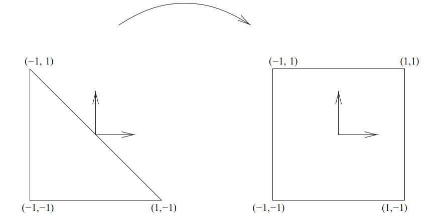

# I.方法论》4.构造通用参考单元（一）

本章介绍了在参考域上构造通用有限元类的数学框架。 FIAT和SyFi项目均使用此框架，请分别参见第13章和第15章。 我们的目标是提供一个框架，可以自动构建具有非常复杂基底的单纯有限元。 我们从有限元的经典Ciarlet定义及其“节点”基底（这个抽象概念，比标准的面向节点的拉格朗日多项式更加通用和强大）出发开展工作。

<!--more-->

迄今为止，我们的方法还没有包括样条线型空间（例如在`等几何分析`中变得越来越流行（Hughes等人，2005）），也没有完全解决XFEM（Chessa等人，2002）或hp-型方法（ Schwab，1998）。 但是，在`等几何分析`中，基函数很容易通过样条线理论由简单递归关系来定义，因此不需要FIAT或SyFi之类的工具。 XFEM通过特殊的基函数增强现有的有限元空间来捕获奇异的行为 - 我们的方法可以提供常规基底，而不是“额外”的（基）函数。 最后，可以处理hp方法中施加的约束，虽然用我们的方法困难，但是对四面体hp基底是合适的（Ainsworth和Coyle，2003年）。 我们稍后再讨论其中一些问题。

## 4.1 背景

有限元文献包含大量的近似空间和自由度，其中许多在第3章中进行过介绍。 某些应用,比如Cahn-Hilliard和其他四阶问题，可受益于非常光滑的有限元基底，而多孔介质流则需要通过分段多项式函数来离散化矢量场，其中只有跨胞边界的法向分量是连续的。 电磁学中的许多问题都通过使用到Nédélec单元来获得切向连续的矢量场（Nédélec，1980，1986）。 许多单元经过精心设计以满足`inf-sup`条件（Brezzi和Fortin，1991； Girault和Raviart，1986），最初是为了解释不可压缩流问题离散化的稳定性而设计的。 此外，有些问题需要低阶离散化，而另一些问题可以通过高阶多项式来有效解决。

自动生成有限元方法的计算机程序，尽管需要面对文献中已发现的大量有限元族，但它也提供了一条便捷的途径，可以更广泛地使用Raviart-Thomas，Nédélec和其他难于编程的单元。 理想的情况是，人们希望在抽象的层次上描述不同的有限元空间，然后计算机代码可以识别出如何对基函数进行求值和微分。 此类目标在很大程度上由FIAT和SyFi项目实现，其实现在第13章和第15章中将有描述。

对于有限元系统的最终用户而言，像FIAT和SyFi之类的项目最终仍可能是神秘的，因为与有限元库的交互通常是通过构造全局有限元运算符的工具来进行的。 如果满足两个条件，则最终用户通常会感到满意。 首先，有限元系统应支持目标应用领域中常用的单元。 其次，它提供了近似阶次的灵活性。

通过只实现一组先验的有限元，就完全有可能满足许多用户的需求。 在某些时候，这甚至看起来更理想。 例如，在大量研究，诸如Raviart-Thomas-Nédélec单元和Brezzi-Douglas-Marini单元族的研究，导致新的单元族的发展大大放缓了。 然后，Arnold，Falk和Winther在外微积分背景下进行的最新工作不仅使人们对现有单元族有了更好的了解，而且还带来了性能得到改善的新一波单元，请参见Arnold等（2006a）的概述。 有限元基底的生成系统可以更容易地吸收这些及其未来的发展。 自动化还提供了标准库可能无法提供的近似阶次方面的通用性。 最后，最终用户甚至可以轻松定义自己的新单元，并在对其进行数学分析之前测试其数值属性。

在本章中，我们描述了诸如FIAT，SyFi和Exterior项目（Logg和Mardal，2009）之类的数学形式。 这种形式起于由Ciarlet（2002）经典定义给出的有限元。 然后，它使用基本的线性代数，根据易于实现且在浮点运算中表现良好的多项式，为抽象有限元构造适当的基底。 我们专注于为单个固定参考单元构建节点基底。 正如我们将在第11章和第15章中看到的那样，形式编译器（例如FFC和SFC）将在单个参考单元上工作。

文献中还存在其他方法，例如Szabó等人 （1991）研究的层次基底（the hierarchical bases ），还有Ainsworth和Coyle（2003）等人对$H(\mathrm{curl})$和$H(\mathrm{div})$空间扩展的工作。 这些方法可以为有限元方法中的网格和多项式阶次的定义提供更大的灵活性，但是它们在组装过程中也需要更多的注意，并且通常针对每个单元族视情况构造基底。 当它们可用时，它们的构造可能比使用此处所研究的技术更方便，但是该技术更易于应用于“任意”有限元，因此在自动软件的环境中应该被考虑。

## 4.2 预备

FIAT和SyFi都使用了Ciarlet引入的有限元抽象定义的略微修改版。

**定义4.1 (有限元(Ciarlet, 2002))** 一个有限元被定义成一个三元组$(T, \mathcal{V}, \mathcal{L})$：

- 域$T$是$\mathbb{R}^d,\quad d=1,2,3,\dots$的有界闭子集，具有非空内部和分段光滑边界；

- $\mathcal{V} = \mathcal{V}(T)$是$T$上的$n$维有限维函数空间；

- 自由度（节点）集$\mathcal{L} = \{\ell_1, \ell_2, \dots , \ell_n\}$ 是对偶空间$\mathcal{V}'$的基底；也就是$V$上的有界线性泛函空间。

在此定义中，术语“有限元”，不仅指网格中的特定胞，还指代相关的函数空间和自由度。 通常，域$T$是一些简单的多边形或多面体，函数空间$\mathcal{V}$则由多项式组成。

给定一个有限元，可以使用以下定义来计算该单元的的具体基底（通常称为节点基底）。

**定义4.2** 有限元$(T, \mathcal{V}, \mathcal{L})$的节点基底，是一个函数集$\{\phi_i\}^n_{i=1},\quad 1\le i,j\le n$，满足： 

$$
\ell_i(\phi_j) = \delta_{ij}  \tag{4.1}
$$

本章中的主要问题是此节点基底的构建。 对于任何给定的有限元，都可以用基本代数显式地构造节点基底。 但是，这会变得很乏味，因为我们考虑了许多不同的单元族，并希望包括每个族的任意次单元。  因此，我们在这里提出了一个新的范式，用于支持自动构建节点基底的计算机程序。

除了构造节点基底之外，我们还需要记住，有限元需要被修补在一起，使得在网格上形成分段多项式场。 针对特定问题的特定有限元方法的适用性（或稳定性）取决于问题的连续性要求。 通常会选择特定单元的自由度，以满足这些连续性要求。

因此，除了计算节点基底之外，这里开发的框架还简化了用于以下任务的软件：

1. 基函数及其导数在各点的取值。

2. 将基函数（或自由度）与$T$的拓扑维面（例如其顶点，边及其在边上的位置）相关联。

3. 将每个基本函数与其他元数据相关联，这些元数据描述了用于基函数及其导数取值的映射。

4. 提供用于计算任意函数的自由度的规则（Dirichlet边界条件的需要）。

第1点在符号计算框架（SyFi）中相对简单，但是如果使用数值算术（FIAT）来实现，则需要格外小心。  当有限元小于或大于$C^0$连续时，中间的两点包括客户代码所需的信息，用以对参考基底进行变换，并且组装成全局自由度。  最终的任务，是以某点取值、微分、（更一般地）对点和权重求和的形式，非常类似于正交规则。

## 4.3 数学框架

### 4.3.1 基底变更

构造节点基底的基本思想来自基本线性代数：一个将所需的（节点）基底构造为另一种可用基底的线性组合。  我们将从张成$\mathcal{V}$的某个基底$\{\psi_i\}^n_{i=1}$开始。  据此，我们将每个节点基函数$\phi_j$构造为：

$$
\phi_j = \sum^n_{k=1}{\alpha_{jk}\psi_k} \tag{4.2}
$$

任务是计算出矩阵$\alpha$, 使得每个固定的$\phi_j$满足： 

$$
\ell_i(\phi_j) = \delta_{ij} \tag{4.3}
$$

并且使用上面$\phi_j$的展开式，得到： 

$$

\delta_{ij} = \sum^n_{k=1}{\ell_i(\alpha_{jk}\psi_k)}  = \sum^n_{k=1}{\alpha_{jk}\ell_i(\psi_k)}  \tag{4.4}
$$

所以，对固定的$j$, 我们有$n$元方程组：

$$
 \sum^n_{k=1}{B_{ik}\alpha_{jk}} = \delta_{ij}  \tag{4.5}
$$

其中，

$$
B_{ik} = \ell_i(\psi_k) \tag{4.6}
$$

这是广义范德蒙矩阵的一种。 当然 (4.5) 还可以写成：

$$
B \alpha^T= I \tag{4.7}
$$

并且有：

$$
\alpha = B^{-T} \tag{4.8}
$$

在实践中，假定总能找到一个很容易计算自由度的原始基底。 自由度通常涉及点取值，微分，积分等。

### 4.3.2 多项式空间

在定义4.1中，我们在有限维函数空间$\mathcal{V}$中定义了有限元。 尽管不是严格必须的，但有限元中使用的函数通常是多项式。 虽然我们的一般策略，原则上，将容纳非多项式基底，但本章仅处理多项式。 最常见的空间是$[\mathcal{P}_q]^d$，即$\mathbb{R}^d$中的$q$次多项式空间。  表示$[\mathcal{P}_q]^d$的方式有很多。  我们将讨论幂和伯恩斯坦（Bernstein）基底以及正交基底（例如Dubiner，雅可比和勒让德）。  这些基底中的每一个都有明确的表示形式或递归关系，使它们易于求值和微分。  相反，大多数有限元基底是通过定义4.2求解线性方程组来确定的。  除了$[\mathcal{P}_q]^d$之外，对于某些单元，我们还将需要$\mathcal{H}^d_q$，即$d$元齐$q$次多项式的空间。

通常，这个技术被开发用于单纯形的，其多项式没有很好的张量积结构。 但是，SyFi支持矩形域，而FIAT不支持。

**幂基底**。 在线段上，对能张成$\mathcal{P}_q$的单项式或幂式基底$\{x^i\}^q_{i=0}$，任何$\psi\in\mathcal{P}_q$都可以写成：

$$
\psi = a_0 + a_1 x + \dots + a_q x^q = \sum^q_{i=0}{a_i x^i} \tag{4.9}
$$

对二维的三角形上情况，$[\mathcal{P}_q]^2$是由形如$\{x^i y^j\}^{i + j \le q}_{i,j=0}$函数张成的，对三维的情况也有类似的定义。

这个基底很容易求值，微分和积分。 但是，这种基底在数值计算中是非常病态的（ill-conditioned）。 例如，$\mathcal{P}_{10}$中，使用幂基底的质量矩阵的条件数是5E+14，而伯恩斯坦多项式和拉格朗日多项式的对应条件数分别为4E+6和2E+3。

**勒让德基底**。 在区间，矩形或箱形上流行的多项式基底是勒让德基底。 该多项式基底还可用于表示高阶次多项式。 此基底在区间[-1，1]上可定义为

$$
\psi_i(x) =\frac{1}{2^i i!}\frac{d^i}{dx^i}(x^2 − 1)^i,\quad i = 0, 1, \dots \tag{4.10}
$$

这些多项式的一个很好的特性是它们是$L^2$内积正交的；即，

$$
\int^1_{-1}{\psi_i(x)\psi_j(x) dx} = \left\{\begin{aligned}\frac{2}{2i+1} &\quad  i = j\\ 0 &\quad  i \ne j\end{aligned}\right. \tag{4.11}
$$

勒让德多项式可以通过张量积扩展到任意维度的矩形域。 例如，2维情况下的基底：

$$
\psi_{ij}(x, y) = \psi_i(x)\psi_j(y), \quad i, j \le q \tag{4.12}
$$

这些多项式的递归关系可以在Karniadakis和Sherwin（2005）中找到。

**雅可比基底**。 雅可比多项式$P_i^{\alpha,\beta}(x)$推广了勒让德多项式，给出了加权内积的正交性。 特别地，$\int^1_{-1}{(1-x)^\alpha(1 + x)^\beta P_i^{\alpha,\beta} P_j^{\alpha,\beta} dx} = 0, \quad i \ne j$。 这种多项式由下给出：

$$
\begin{aligned}P_0^{\alpha,\beta} &= 1 \\ P_1^{\alpha,\beta} &=\frac{1}{2}(\alpha − \beta + (\alpha + \beta + 2) x) \end{aligned} \tag{4.13}
$$

第三项开始（$j \ge 1$）是递归式：

$$
P_{i+1}^{\alpha,\beta}(x) = (a_i^{\alpha,\beta}x + b_i^{\alpha,\beta})P_i^{\alpha,\beta}(x) − c_i^{\alpha,\beta}P_{i-1}^{\alpha,\beta}(x) \tag{4.14}
$$

一般来说，雅可比多项式被用在1维的情况，而在张量积域中的使用频率远低于勒让德多项式，但它们在构造基于单纯形的正交基中起着重要作用，我们现在转向它。

**Dubiner基底**。 又被称为单纯域中的正交多项式，尽管它们缺乏勒让德多项式的某些旋转对称性。 Dubiner基底， 常被用在单纯谱单元（simplicial spectral elements，Dubiner，1991）中，这在文献中有许多不同的名称。 它是一个$L^2$-正交基底，可以通过将奇异坐标更改为固定三角形，映射到正方形上的雅可比多项式的特定张量积来构造。 令$P_n^{\alpha,\beta}$表示权重为$\alpha,\beta$的第n个雅可比多项式。 然后，定义新坐标：

$$
\begin{aligned}\eta_1 &= 2\left(\frac{1 + x}{1 − y} \right)− 1 \\ \eta_2 &= y \end{aligned}\tag{4.15}
$$

图4.1 从参考三角形到矩形区域的折叠坐标变换。

它将具有顶点$(-1,-1),(-1,1),(1,-1)$的三角形映射到正方形$[-1,1]^2$，如图4.1所示。 这是定义Dubiner多项式的自然域，但是通过仿射映射可以很容易将它们映射到其他具有顶点$(0,0),(0,1),(1,0)$的三角形的域。 然后，定义:

$$
\psi_{ij}(x, y) = P_i^{0,0}(\eta_1)\left(\frac{1 − \eta_2}{2}\right)^i P_j^{2i+1,0}(\eta_2) \tag{4.16}
$$

尽管从定义中看并不明显，但$\psi_{ij}(x,y)$实际是关于x和y的$i + j$次多项式。 另外，对$(i,j) \ne (p,q)$，$\psi_{ij}$与$\psi_{pq}$是$L^2$-正交的。

尽管此基底比幂基底更复杂，但即使用高阶次多项式，对数值计算也是良好的。  这个多项式也可以进行分层排序，使得对于每个$n>1$，$\{\psi_i\}^n_{i=1}$构成$\mathcal{P}_{n-1}$的基底。 一个可能的缺点，这种基底缺少在其他基底具有的旋转对称性。

**Bernstein基底**。 Bernstein基底是另一中具有良好条件数的基底，可用于生成有限元基底。 在1维情况中，$\mathcal{P}_q$中的基函数形如：

$$
\psi_i^q = \left(\begin{aligned}q \\ i \end{aligned}\right)x^i(1 − x)^{q−i}, \quad i = 0, \dots , q \tag{4.17}
$$

并且，$\mathcal{P}_q$可由$\{\psi_i^q\}^q_{i=0}$张成.

请注意，Bernstein基底由$x$和$1-x$的幂组成，它们是[0,1]的重心坐标，根据这一点，可以轻松地将这种基底推广到更高维的单纯形上。 令$b_1, b_2, b_3$是为参考三角形的重心坐标（译者注：对2维的情况，也被称作面积坐标）； 也就是说，$b_1 = 1-x-y,b_2 = x,b_3 = y$。 那么这种基底形如：

$$
\psi_{ijk}^q = \frac{q!}{i!j!k!}b^i_1 b^j_2 b_3^k, \quad i + j + k = q \tag{4.18}
$$

于是$\mathcal{P}_q$的基底是：

$$
\{\psi_{ijk}^q\}^{i+j+k=q}_{i,j,k\ge 0} \tag{4.19}
$$

四面体上的Bernstein多项式，甚至更高维的单纯形，都是完全相似的。

这些多项式虽然在有限元社区中并不常见，但在图形和样条曲线中是众所周知的。 它们具有旋转对称性，并且是非负的，因此给出正质量矩阵，尽管它们不是分层的。 最近，Kirby（2011，2010b）分析了基于Bernstein多项式的有限元算子。 在这些论文中， 利用Bernstein多项式的特殊性质来开发有限元算子的无矩阵应用算法，其复杂度与谱单元不相上下。

**齐次多项式**。 有时, 另一组有用的多项式是齐次多项式$\mathcal{H}_q$。 这就是所有项具有相同次数的多项式。 对二维的情况，$\mathcal{H}_q$形如下式的多项式张成：

$$
\{x^i y^j\}_{i+j=q} \tag{4.20}
$$

类似，也可定义d维的情况。

**矢量值或张量值的多项式**。 可先前讨论的标量值多项式直接推广到矢量或张量值多项式。 令$\{e_i\}$为$\mathbb{R}^d$中的正则基底。 那么向量值多项式的基底为：

$$
\phi_{ij} = \phi_j e_i \tag{4.21}
$$

类似的定义，可将基底推广到张量值情况。

【第四章未完待续】
