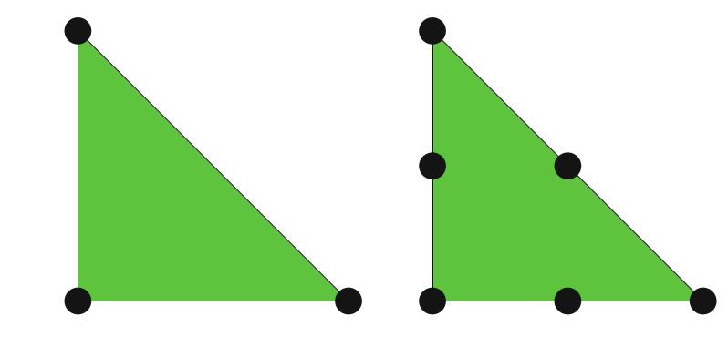
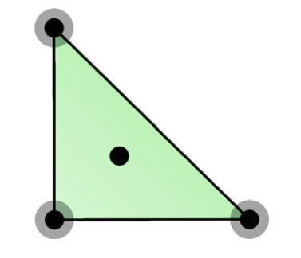
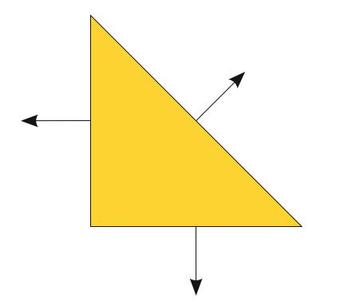
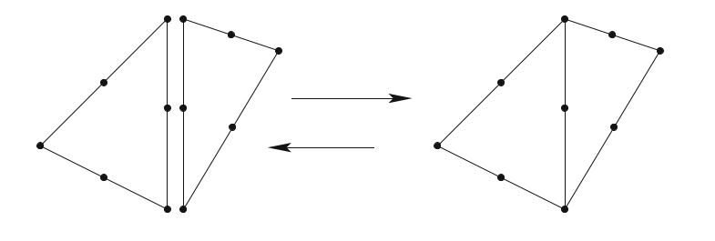

# I.方法论》4.构造通用参考单元（二）

【<a href="">第4章前续</a> | <a href="#第四章-构造通用参考单元">总目录</a>】

## 4.4 单元的例子

我们用一些标准的有限元来说明这些概念。 也请读者参考第3章，以便更全面地审查单元及其属性。

<!--more-->

**例4.1 拉格朗日单元**

图4.2 一次和二次的拉格朗日单元。

图4.2所示， 最常见的拉格朗日单元。 其自由度由黑点表示，黑点表示点值。 一次单元显示在左边的三角形中，其自由度包括每个顶点的点值。 也就是说，自由度$\ell_i:V \to \mathbb{R}$为：

$$
\ell_i(v) = \int_T{v \delta_{x_i} dx} = v(x_i) \tag{4.22}
$$

其中，$x_i$是顶点$(0,0), (1,0), (0,1)$ ，而$\delta$是狄拉克函数。  相应的基函数是$1−x−y, x, y$。  二次单元显示在右边的三角形中。  它具有六个自由度，三个在顶点，三个在边上，都是点值。  拉格朗日单元产生分段连续多项式，因此非常适合用作$H^1$的近似。  在任意维上的单纯形上，$q$次拉格朗日单元可张$\mathcal{P}_q$。

**例4.2 Hermite单元**

图4.3 三次Hermite单元。

图4.3所示，2维参考三角形上的Hermite单元。  黑点表示点值，而深灰色圆圈表示x和y偏导数值。  也就是说，与顶点$x_i$相关的自由度$\ell_{i_k}:\mathcal{V} \to \mathbb{R}$为：

$$
\ell_{i_1}(v) = \int_T{v \delta_{x_i} dx} = v(x_i) \tag{4.23}
$$

$$
\ell_{i_2}(v) = \int_T{\frac{\partial v}{\partial x} \delta_{x_i} dx}=\frac{\partial}{\partial x} v(x_i)  \tag{4.24}
$$

$$
\ell_{i_3}(v) = \int_T{\frac{\partial v}{\partial y} \delta_{x_i} dx} =\frac{\partial}{\partial y} v(x_i) \tag{4.25}
$$

再加上一个内部点值，一共十个自由度，这与$\mathcal{P}_3$中的自由度数相同。  Hermite单元的一个特征就是它在顶点处具有连续导数（但是不一定有$H^2$-符合的近似）。

**例4.3 Raviart–Thomas单元**

图4.4 三角形的一次Raviart–Thomas单元。

如图4.4所示，这是最低阶的Raviart–Thomas单元。  与之前的单元相比，此单元有一个向量值函数空间。  箭头代表法线矢量； 也就是说，自由度$\ell_i:\mathcal{V} \to \mathbb{R}$：

$$
\ell_i(v) = \int_T{v \cdot n_i dx} \tag{4.26}
$$

其中，$n_i$是边$i$上的向外法向矢量。  Raviart–Thomas单元是具有三个自由度的矢量空间。  因此，标准基底$[\mathcal{P}_q]^d$不是合适的起点，我们改用$V = [\mathcal{P}_0]^2 \oplus x \mathcal{H}_0$。  Raviart–Thomas单元通常用于$H(\mathrm{div})$中的近似值。  我们注意到，也可以根据法向分量的点值来定义此单元。

### 4.4.1 其它多项式空间的基底

上面介绍的基底适合构造许多有限元，但是正如我们刚刚看到的，它们并非在所有情况下都有效。  二维的Raviart–Thomas函数空间由下张成：

$$
[\mathcal{P}_n]^2 \oplus  \left(\begin{aligned}y \\ x\end{aligned}\right) \mathcal{H}_n^2 \tag{4.27}
$$

因此，该单元需要用$\left(\begin{aligned}y \\ x\end{aligned}\right) \mathcal{H}_n^2$加强多项式向量$(P_n^2)^2$的基底。  另一方面，三角形上的Brezzi-Douglas-Fortin-Marini单元被定义为：

$$
\{u \in [\mathcal{P}_n(T)]^2 : u \cdot n \in \mathcal{P}_{n−1}(E_i), E_i \in \mathcal{E}(T)\} \tag{4.28}
$$

其中， $\mathcal{E}(T)$ 表示$T$的维面。

因此，该单元要求从$[\mathcal{P}_n(T)]^2$中剔除一部分函数。 这种剔除由约束$u \cdot n \in \mathcal{P}_{n-1}(E_i)$表示。

该空间基底的获得，有些微妙。  FIAT和SyFi已经开发了不同的，但在数学上等效的解决方案。  在SyFi中，由于它使用符号表示，因此可以轻松地用幂基底来表达多项式，并将与垂直于边缘的n阶多项式相对应的系数设置为零。  FIAT以类似的方式利用勒让德多项式的正交性来表示约束。  也就是说，在边缘$E_i$上，以下约束适用：

$$
\ell_i^C(u) = \int_{E_i}{(u \cdot n)\mu_n^i} = 0 \tag{4.29}
$$

其中，$\mu_n^i$是边$E_i$上的n次勒让德多项式。

通常，假设有$m$个约束和$n - m$个自由度。令

$$
V^1_{ij} = \ell_i(\phi_j), 1 \le i \le n − m, 1 \le j \le n \tag{4.30}
$$

$$
V^2_{ij} = \ell^C_i(\phi_j), n-m < i \le n, 1 \le j \le n \tag{4.31}
$$

和

$$
V = \left(\begin{aligned}V^1 \\ V^2\end{aligned}\right) \tag{4.32}
$$

现在考虑矩阵方程

$$
V \alpha^T= I^{n,n−m} \tag{4.33}
$$

其中，$I^{n,n-m}$表示$n \times (n-m)$单位矩阵。  如前所述，$\alpha$的第$j$列$\{\phi_j\}$中第$j$项的，以$\{\psi_i\}$为节点基底函数的展开系数。  此外，$V^2 \alpha^T= 0$，意味着节点基底函数应该满足约束条件。  除了Brezzi-Douglas-Fortin-Marini单元之外，还有根据约束多项式定义的其他例子，比如Nédélec（Nédélec，1980），Arnold-Winther（Arnold and Winther，2002），Mardal-Tai-Winther（ Mardal等，2002），Tai-Winther（Tai和Winther，2006）和Bell（Ciarlet，2002）的单元族。

## 4.5 多项式空间上的操作

在这里，我们展示了如何根据线性代数运算来转换各种重要运算，并假设这些运算可在原始基底$\{\psi_i\}^n_{i=1}$上执行。

### 4.5.1 求值

为了计算在给定点$x \in T$处的节点基底$\{\phi_i\}^n_{i=1}$，只需简单地计算向量

$$
\Psi_i = \psi_i(x) \tag{4.34}
$$

进而

$$
\phi_i(x) \equiv \Phi_i = \sum_j{\alpha_{ij} \Psi_j} \tag{4.35}
$$

通常，节点基函数被要求是在点组$\{x_j\}^m_{j=1} \subset T$上的。    出于性能原因，优先考虑执行矩阵乘积。  因此，不妨定义$\Psi_{ij}=\Psi_i(x_j)$和$\Phi_{ij}=\Phi_i(x_j)$。 然后，所有节点基函数都可以通过乘法来计算：

$$
\Phi_{ij} = \sum_k{\alpha_{ik}\Psi_{kj}} \tag{4.36}
$$

### 4.5.2 微分

微分则更复杂，并提供更多选择。  令$\alpha=（\alpha_1, \alpha_2, \dots, \alpha_d）$为多重索引，因此

$$
D^\alpha \equiv \frac{\partial^{|\alpha|}}{\partial x_1^{\alpha_1} \partial x_2^{\alpha_2} \dots \partial x_d^{\alpha_d}} \tag{4.37}
$$

其中，$|\alpha| = \sum^d_{i=1} \alpha_i$，并且我们想计算数组：

$$
\Phi_i^\alpha = D^\alpha \phi_i(x) \tag{4.38}
$$

对一些$x \in T$。

一个明显的选择是对原始基函数$\{\psi_i\}$微分得到一个数组：

$$
\Psi_i^\alpha = D^\alpha \psi_i(x) \tag{4.39}
$$

进而

$$
\Phi_i^\alpha = \sum_j{\alpha_{ij}\Psi^\alpha_{ji}} \tag{4.40}
$$

根据这些预设，可以方便地计算$\{\psi_i\}$的所有导数。  在符号计算或使用幂基底时，通常这是对的。  对于Bernstein，雅可比和勒让德多项式，有递归关系可用，请参见Karniadakis和Sherwin（2005）； Kirby（2010b）。  通常情况下，Dubiner基底包含一个坐标奇点，以防止自动微分作用于顶部顶点。  Kirby（2010a）的最新工作重新制定了递归关系以考虑这种可能性。

如果乐意的话（或者由特定开始基底所要求的），还可以计算$\{\phi_i\}$的一阶导数矩阵，并构造比它们更高阶的导数。  对于每个坐标方向$x_k$，构造矩阵$D^k$以满足：

$$
\frac{\partial \phi_i}{\partial x_i} = D^k_{ij} \phi_j \tag{4.41}
$$

如何做到这种依赖于所选择基底的操作。  有关基于Dubiner的更详细信息，请参见Dubiner（1991）。

### 4.5.3 积分

在参考域上，对基函数（包括基本函数和/或其导数的乘积）的积分，可以通过数值，符号或精确地用一些已知公式来执行。  通常，正交的情况很容易执行。  例如，可以从各种参考单元获得正交规则（Dunavant，1985； Keegan等，2008；Šolín等，2004）。

### 4.5.4 维面（facet）关联

正如我们在定义Brezzi-Douglas-Marini单元时所看到的，有必要有与多边形域的各个维面相关联的多项式。  Bernstein多项式通过重心坐标表示，因此自然与维面关联。  勒让德和雅可比多项式也很容易与重心坐标中的一维面关联。

### 4.5.5 线性泛函

线性泛函通常是根据积分，逐点求值和微分的线性组合进行转换的。

### 4.5.6 参考单元的映射

FEniCS软件和许多其他有限元代码中，普遍采用的一种惯例是将节点基函数从参考胞元映射到网格中的每个胞元。  有时，这就像更改坐标一样简单。 在其他情况下，则更为复杂。  为了完整起见，我们简要地描述了根据参考单元映射创建全局有限元的基底。  因此，令$T$为网格中的一个全局多边形，$\hat{T}$为对应的参考多边形。  在坐标$x \in T$和$\hat{x} \in \hat{T}$之间，我们使用映射

$$
x = F_T(\hat{x}) = A_T(\hat{x}) + x_0 \tag{4.42}
$$

这个映射的雅可比：

$$
J(\hat{x}) =\frac{\partial x}{\partial \hat{x}} = \frac{\partial A_T(\hat{x})}{\partial \hat{x}}  \tag{4.43}
$$

目前，FEniCS仅支持$T$和$\hat{T}$间的仿射映射，这意味着$x = F_T(\hat{x})= A_T \hat{x} + x_0$和$J = A_T$。  等参单元的一个基函数，被定义成参考单元上的相应基函数：

$$
\phi(x) = \hat{\phi}(\hat{x}) \tag{4.44}
$$

然后可以在参考多边形上执行积分，

$$
\int_T{\phi(x) dx} = \int_{\hat{T}}{\hat{\phi}(\hat{x}) \mathrm{det} \ J d\hat{x}}  \tag{4.45}
$$

空间导数由参考单元上的导数和使用链规则的几何映射来定义，

$$
\frac{\partial \phi}{\partial x_i} = \sum_j{\frac{\partial \hat{\phi}}{\partial \hat{x}_j}\frac{\partial \hat{x}_j}{\partial x_i} } \tag{4.46}
$$

上面基函数映射通常对于$H^1$中的近似值。  对于$H(\mathrm{div})$或$H(\mathrm{curl})$的近似，必须使用Piola映射，其中基函数的映射不同于几何映射。  也就是说，对于$H(\mathrm{div})$单元，Piola映射为：

$$
\phi(x) = \frac{1}{|\mathrm{det} \ J|} J \hat{\phi}(\hat{x}) \tag{4.47}
$$

当通过UFC使用网格实体编号时（参见第16章），使用$\frac{1}{\mathrm{det} \ J}$代替$\frac{1}{|\mathrm{det} \ J|}$是有利的。 这是因为行列式的符号与法向矢量的符号相关，参见Rognes等（2009），以了解Piola映射及其在FFC中的实施的更多信息。  某些单元，比如Rannacher-Turek单元（Turek，1999； Rannacher和Turek，1992），相对参考单元的类似定义，在全局定义时具有更好的性质。

### 4.5.7 局部到全局的自由度映射

图4.5 在一对胞元上将一对二次局部函数空间拼接在一起，以形成全局连续的分段二次函数空间。 

如图4.5所示，有限元通过自由度连续地拼接在一起。  为了完成这种拼接，单元应提供决定是否应共享某些相邻单元自由度的标识符。  一种替代方案是使参考胞元上的每个自由度与参考胞元中的一个点相关。  然后，几何映射通过（4.42）给出网格中的全局点，该全局点标识了自由度。 也就是说，如果不同单元对应于网格中的相同全局点，则它们的自由度是共享的。  也就是说，每个自由度可以与参考单元上的局部网格实体，例如顶点，边或面有关。  单元映射后，自由度将与全局网格中的相应网格实体相关。 此替代方法要求对相应的网格实体进行编号。

【第4章完结】

