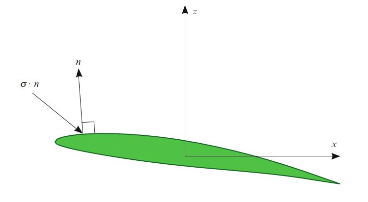
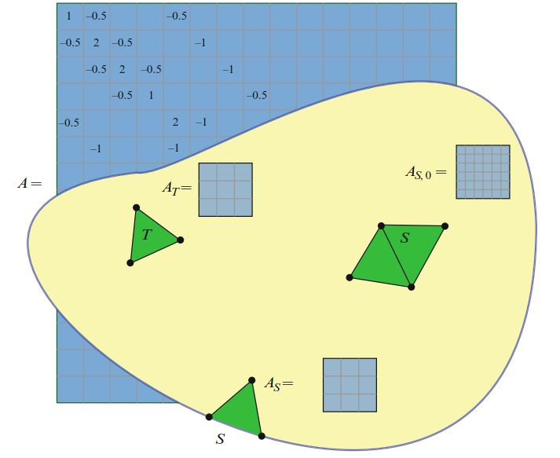

# I.方法论》5.有限元变分形式

<center>【<a href="#第五章-有限元变分形式">总目录</a>】</center>

FEniCS软件的大部分都致力于变分形式的公式（UFL），变分形式的离散化（FIAT，FFC，SyFi）以及相应离散运算（UFC，DOLFIN）的组装。  本章总结了FEniCS所使用变分形式的表示。

<!--more-->

## 5·1 背景

在第二章中，我们介绍了以下典型的变分问题：需求$u \in V$, 满足

$$
a(u, v) = L(v) \quad \forall v \in  \hat{V} \tag{5.1}
$$

其中，$V$给出试探空间， $\hat{V}$给出测试空间。双线性形式

$$
a : V \times \hat{V} \to \mathbb{R} \tag{5.2}
$$

将一对试探和测试函数映射到一个实数，并且对两个参数都是线性的。  类似地，线性形式$L:\hat{V} \to \mathbb{R}$将给定测试函数映射到实数。  我们也能构造出非线性变分问题的离散化：需求$u \in V$，以满足

$$
F(u; v) = 0 \quad \forall v \in \hat{V} \tag{5.3}
$$

在里，$F:V \times \hat{V} \to \mathbb{R}$也是将一对函数映射到实数。  这个半线性形式$F$对函数$u$是非线性的，而对测试函数$v$是线性的。  或者，我们可以考虑映射

$$
L_u \equiv F(u; \cdot) : \hat{V} \to \mathbb{R} \tag{5.4}
$$

并注意到，对于任何固定的$u$，$L_u$都是$\hat{V}$上的线性形式。  在第2章中，我们还考虑了在给定函数$M:V \to \mathbb{R}$下的误差估计。  在这里，可能的非线性函数$M$将给定的函数$u$映射到实数$M(u)$。

在所有这些例子中，核心概念是将给定的函数元组映射为实数的形式。  我们将这些称为多重线性形式。  下面，我们将多重线性形式的概念形式化，讨论多重线性形式的离散化，以及相关概念，例如多重线性形式的作用，导数和伴随。

## 5·2 多重线性形式

一个形式，是从给定的函数空间序列$\{V_j\}^\rho_{j=1}$的乘积到实数的映射：

$$
a : V_\rho \times \dots \times V_2 \times V_1 \to \mathbb{R} \tag{5.5}
$$

如果形式$a$对其每个参数都是线性的，那么我们说此形式是多重线性的。  形式的参数个数$\rho$是形式的元数（arity）。  请注意，空间是从右到左编号的。  正如我们将在下面的5.3节中看到的那样，这是考虑多重线性形式的离散化时的惯例。

形式通常可以用一个或更多系数参数化。  一个典型的例子是正则变分问题（5.1）的右手边的$L$，它是在给定系数$f$上参数化的线性形式。  我们将使用符号$a(f; v) \equiv L_f(v) \equiv L(v)$，并将测试函数$v$称为自变量，将函数$f$称为系数。 通常，我们将对每个参数都是线性的（但对系数上可能是非线性的）形式称为多重线性形式。  这种多重线性形式是参数空间和系数空间序列乘积的映射：

$$
\begin{aligned}a : W_1 \times W_2 \times \dots \times W_n \times V_\rho \times \dots \times V_2 \times V_1 \to  \mathbb{R} \\ a \mapsto a(w_1, w_2, \dots , w_n; v_\rho, \dots , v_2, v_1)\end{aligned} \tag{5.6}
$$

参数空间$\{V_j\}^\rho_{j=1}$和系数空间$\{W_j\}^n_{j=1}$可能都是相同的空间，但是它们通常是不同的，例如当Dirichlet边界条件施加于一个或多个空间时，或者当多重线性形式时 产生于混合问题的离散化时，例如第2.2.2节。

在有限元应用中，形式的元数通常为$\rho=2$，在这种情况下，形式被称为是双线性的，或者在$\rho=1$的情况下，形式被称为是线性的。  在$\rho=0$的特殊情况下，我们将多重线性形式称为函数。  有时还可能考虑使用较高元数的形式（$\rho>2$）。  下面，我们举例说明一些不同元数的多重线性形式。

### 5·2·1 例子

`泊松方程`。 考虑电导率为$\kappa=\kappa(x)$的泊松方程，

$$
−\mathrm{div}(\kappa \mathrm{grad} u) = f \tag{5.7}
$$

假设边界$\partial \Omega$上的Dirichlet边界条件，相应的正则变分问题被定义在一对多重线性形式中：$a(\kappa; u，v)= \int_\Omega{\kappa \mathrm{grad} \ u \cdot \mathrm{grad} \ v dx}$和$L(v)=\int_\Omega{f v dx}$。   在此，$a$是双线性形式（$\rho=2$），$L$是线性形式（$\rho=1$）。  这两种形式都有一个系数（$n=1$），分别为$\kappa$和$f$：

$$
\begin{aligned}a &= a(\kappa; u, v) \\ L &= L(f ; v)\end{aligned} \tag{5.8}
$$

我们通常从表示中删除系数，并使用简写表示$a = a(u, v)$和$L = L(v)$。


`不可压缩Navier-Stokes方程`。 不可压缩流的速度$u$和压强$p$满足不可压缩Navier-Stokes方程：

$$
\begin{aligned}\rho(\dot{u} + \mathrm{grad} \ u \cdot u) − \mathrm{div} \ \sigma(u, p) &= f  \\ \mathrm{div} \ u &= 0\end{aligned} \tag{5.9}
$$

其中，应力张量$\sigma$由$\sigma(u, p)=2\mu \epsilon(u)− pI$给出，$\epsilon$为对称梯度; 即$\epsilon(u)= \frac{1}{2}(\mathrm{grad} \ u +(\mathrm{grad} \ u)^T)$，$\rho$是流密度，$f$是力密度(body force)。  这里考虑通过将非线性项$\mathrm{grad} \ u \cdot u$与测试函数$v$积分而获得的形式：

$$
a(u; v) = \int_\Omega{(\mathrm{grad} \ u \cdot u) \cdot v dx} \tag{5.10}
$$

这是一个线性形式（$\rho=1$），有一个系数（$n=1$）。  我们可以通过在固定速度$\bar{u}$附近线性化来获得：

$$
a(u; v) = a(\bar{u}; v) + a'(\bar{u}; v)\delta u + \mathcal{O}(\delta u^2) \tag{5.11}
$$

其中，$u = \bar{u} + \delta u$。 线性算子$a'$由下式给出: 

$$
\begin{aligned}a'(\bar{u}; \delta u, v) &\equiv a'(v; \bar{u})\delta u \\ &= \int_\Omega{[(\mathrm{grad} \ \delta u \cdot \bar{u}) \cdot v + (\mathrm{grad} \ \bar{u} \cdot \delta u) \cdot v] dx}\end{aligned} \tag{5.12}
$$

这是一个双线性形式（$\rho=2$），系数为（$n=1$）。 我们也可以考虑三重线性形式：

$$
a(w, u, v) = \int_\Omega{(\mathrm{grad} \ u \cdot w) \cdot v dx} \tag{5.13}
$$

可以将此三重线性形式组装成三阶张量，并将其应用于$w$的给定展开系数向量，以获得与双线性形式$a(w; u, v)$对应的二阶张量（矩阵）。  这对于用不动点迭代方法求解Navier-Stokes方程可能很有用，在这种情况下，$w$是从先前迭代获得的对流速度的给定（冻结）值。  由于组装全局三张量的成本，在实践中很少这样做。  但是，在每个局部胞元上，对应的局部三阶张量可能会与局部展开系数$w$缩并以计算与$a(w;  u, v)$对应的矩阵。

`升力和阻力（Lift and drag）`。 在求解Navier-Stokes方程时，可能需要计算浸入流体中某些物体的升力和阻力。  升力和阻力由作用在对象的力的z分量和x分量给出（相对x方向的流）：

$$
\begin{aligned}L_{\mathrm{lift}}(u, p; ) &= \int_\Gamma(\sigma(u, p)\cdot n) \cdot e_z ds \\  L_{\mathrm{drag}}(u, p; ) &= \int_\Gamma(\sigma(u, p) \cdot  n) \cdot e_x ds \end{aligned} \tag{5.14}
$$

此处，$\Gamma$是物体的边界，$n$是$\Gamma$的向外单位法线，而$e_x, e_z$分别是$x$方向和$z$方向上的单位矢量。  如图5.1所示。  这两种形式的元数都是$\rho=0$，并且这两种形式都有两个系数。



<center>图5.1 物体（此处为NACA 63A409机翼）的升力和阻力分别是物体表面$\Gamma$上应力$\sigma\cdot n$的垂直分量和水平分量的积分。 在每个点，应力张量$\sigma$与向外单位法向矢量$n$的乘积给出作用在表面上的每单位面积的力。</center>

### 5·2·2 正则形式

FEniCS可自动处理一大类多重线性形式的表示和求值，但不是全部。  FEniCS当前仅限于可以表示为给定网格的胞元（域），外部维面（边界）和内部维面上的积分之和的形式。  特别是，FEniCS可处理表示如下的正则形式：

$$
\begin{aligned}&a(w_1, w_2,\dots , w_n; v_\rho, \dots , v_2, v_1) \\ = &\sum^{n_c}_{k=1}\int_{\Omega_k}{I_k^c dx} + \sum^{n_f}_{k=1} \int_{\Gamma_k}{I_k^f ds} + \sum^{n^0_f}_{k=1} \int_{\Gamma^0_k}{I_k^{f,0} dS} \end{aligned} \tag{5.15}
$$

在此，每个$\Omega_k$表示覆盖计算域$\Omega$某子集的网格胞元并集。  同样，每个$\Gamma_k$表示网格边界上维面的某个子集，而$\Gamma^0_k$表示网格内部维面的某个子集。  后者对于不连续Galerkin方法的公式化特别有意义，该方法通常涉及跨胞元边界（内部维面）的积分。  每个子集的贡献是一些被积子集的积分。  因此，第$k$个胞元子集的贡献是被积量$I_k^c$等在$\Omega_k$上的积分。

可以考虑（5.15）的扩展，其中涉及单个胞元（切割胞元）或维面的子集上的点值或积分。  FEniCS当前不支持此类扩展，但将来可能会添加。

## 5·3 离散多重线性形式

正如我们在第2章中看到的那样，可以通过求解线性方程组$A U = b$来获得正则变分问题（5.1）的有限元逼近$u_h = \sum^N_{j=1}{U_j \phi_j} \approx  u$，其中

$$
\begin{aligned}A_{ij} &= a(\phi_j, \hat{\phi}_i), \quad i,j = 1, 2, \dots , N \\ b_i &= L(\hat{\phi}_i),\quad  i = 1, 2, \dots , N \end{aligned} \tag{5.16}
$$

这里，在给定试探空间和测试空间的基底下，$A$和$b$是离散算符，分别对应于双线性形式$a$和线性形式$L$。  请注意，离散算符被定义为作用于基函数的多重线性形式的转置，可由以下事实解释：在双线性形式$a(u, v)$中，试探函数$u$与矩阵$A$的列相关联， 而测试函数$v$与矩阵$A$的行（方程式）相关联。

通常，我们可以离散化一个$\rho$重线性形式$a$以获得秩为$\rho$的张量$A$。  离散算符$A$定义如下：

$$
A_i = a(w_1, w_2, \dots , w_n; \phi_{i_\rho}^\rho,\dots , \phi_{i_2}^2, \phi_{i_1}^1) \tag{5.17}
$$

其中，$i =(i_1, i_2, \dots, i_\rho)$是长度为$\rho$的多重索引，而$\{\phi_k^j\}^N_{k=1}$是$V_{j,h}\subset V_j, j = 1,2,\dots,\rho$的基底。  这个离散算符是秩为$\rho$且维数为$N_1 \times N_2\times\dots\times N_\rho$的典型稀疏张量。

可以使用称为组装（assembly）的算法高效地计算离散算符$A$，这是下一章的主题。  正如我们将看到的那样，一个重要的工具是胞元张量（`the cell tensor`），它是由网格的局部胞元上双线性形式的离散化而得到的。  特别地，考虑可以表示为网格$\mathcal{T}_h=\{T\}$的每个胞元$T$的局部贡献之和的多重线性形式的离散化。

$$
\begin{aligned}&a(w_1, w_2, \dots, w_n; v_\rho, \dots , v_2, v_1) \\ = &\sum_{T\in \mathcal{T}_h} a_T(w_1, w_2, \dots , w_n; v_\rho, \dots , v_2, v_1)\end{aligned} \tag{5.18}
$$

对于$j = 1,2,\dots,\rho$，在$T$上使用局部有限元基底$\{\phi_k^{T,j}\}^{n_j}_{k=1}$来离散化$a_T$，得到胞元张量

$$
A_{T,i} = a_T(w_1, w_2, \dots , w_n; \phi^{T,\rho}_{i_\rho}, \dots , \phi^{T,2}_{i_2}, \phi^{T,1}_{i_1}) \tag{5.19}
$$

胞元张量$A_T$是典型的稠密张量，其秩为$\rho$和维度为$n_1 \times n_2\times\dots\times n_\rho$。  离散算符A可以通过对每个胞元张量$A_T$贡献适当求和来获得。  我们将在后面的第6章中进行详细介绍。

类似地，可以将外部和内部维面张量$A_S$和$A_{S, 0}$定义为网格边界上或内部的维面的贡献。  如（5.19）所述，可用维面$S$代替积分域$T$来定义外部维面张量$A_S$。  $A_S$的维度通常与$A_T$的维度相同。  内部维面张量$A_{S, 0}$的定义则略有不同，通过考虑由包含共享公共维面$S$的两个单元组成的宏单元（如图5.2所示）来定义。  有关详细信息，请参见Ølgaard等（2008）。



<center>图5.2 网格上的胞元张量$A_T$，外部维面张量$A_S$和内部维面张量$A_{S, 0}$，分别通过胞元，外部维面或内部维面对多重线性形式的局部贡献的离散化获得的。  通过组装来自所有胞元和维面张量的局部贡献，可以通过多重线性形式离散化来获得全局离散算符$A$。</center>

## 5·4 多重线性形式的作用

考虑双线性形式

$$
a(u, v) = \int_\Omega{ \mathrm{grad}\ u \cdot \mathrm{grad}\ v dx} \tag{5.20}
$$

来自从泊松方程左侧的离散化。  这里，$u$和$v$是一对试探和测试函数。  另外，我们可以将$v$视为一个测试函数，并将$u$视为一个给定的解，以获得系数$u$上参数化的线性形式：

$$
(\mathcal{A}a)(u; v) = \int_\Omega{ \mathrm{grad} \ u \cdot \mathrm{grad} \ v dx} \tag{5.21}
$$

我们将线性形式$\mathcal{A}a$称为双线性形式$a$的作用。  通常，具有$n$个系数的$\rho$重线性形式的作用是具有$n+1$个系数的$(\rho−1)$线性形式。  特别地，双线性形式的作用是线性形式，而线性形式的作用是函数。

双线性形式的作用在求解微分方程的无矩阵法的定义中起着重要作用。  考虑通过Krylov子空间方法（例如GMRES（广义最小残差方法）（Saad和Schultz，1986）或CG（共轭梯度方法）（Hestenes和Stiefel，1952））求解正则形式（5.1）的变分问题。  Krylov方法，通过由向量$b, A b, A^2 b, \dots, A^k b\quad k \ll N$张成的$\mathbb{R}^N$子空间寻求$U$的近似，来获得线性方程组$A U = b$的近似解$U \in \mathbb{R}^N$。  这些向量可以通过重复应用前面定义的离散算符$A$来计算：

$$
A_{ij} = a(\phi^2_j, \phi^1_i) \tag{5.22}
$$

对任何给定的矢量$U \in \mathbb{R}^N$，有

$$
\begin{aligned}(AU)_i =&\sum^N_{j=1}A_{ij}U_j =\sum^N_{j=1}a(\phi^2_j, \phi^1_i)U_j \\ = &a \left(\sum^N_{j=1}U_j\phi^2_j, \phi^1_i\right) = a(u_h, \phi^1_i) = (\mathcal{A}a)(u_h; \phi^1_i)\end{aligned} \tag{5.23}
$$

其中，$u_h = \sum^N_{j=1}U_j\phi^2_j$是对应于系数向量$U$的有限元近似。  换句话说，矩阵$A$在给定向量$U$上的应用，是由相应的有限元近似下双线性形式取值的作用给出：

$$
(AU)_i = (\mathcal{A}a)(u_h; \phi^1_i) \tag{5.24}
$$

因此，可以通过对线性形式（双线性形式$a$的作用$\mathcal{A}a$）的计算（组装）来求解变分问题（5.1），以代替先计算（组装）矩阵$A$，后重复计算与$A$的矩阵-矢量积。  哪种方法更有效取决于与矩阵组装相比作用的计算效率，以及可用的预处理器。  对于多重线性形式作用的进一步讨论，参考Bagheri和Scott（2004）。

UFL形式语言通过调用`action`函数来支持计算多重线性形式的作用：

```python
# Python code
a = inner(grad(u), grad(v))*dx
Aa = action(a)
```

## 5·5 多重线性形式的导数

当离散化非线性变分问题时，可能需要计算一个或多个系数的多重线性形式的导数。  考虑这个非线性变分问题：需求$u \in V$，满足

$$
a(u; v) = 0 \quad \forall v \in \hat{V} \tag{5.25}
$$

为了用牛顿方法解决这个问题，我们在固定值$\bar{u}$附近进行线性化处理，以获得

$$
0 = a(u; v) \approx a(\bar{u}; v) + a'(\bar{u}; v)\delta u \tag{5.26}
$$

对于给定的非线性变分问题（5.25）的近似解$\bar{u}$，我们可能希望通过求解以下线性变分问题来改善近似解：需求$\delta u \in V$，满足

$$
a'(\bar{u}; \delta u, v) \equiv a'(\bar{u}; v)\delta u = −a(\bar{u}; v) \quad \forall v  \in  \hat{V} \tag{5.27}
$$

在这里，$a'$是一个双线性形式，具有两个参数$\delta u$和$v$，以及一个系数$\bar{u}$。  此外，$−a$是具有一个参数$v$和一个系数$\bar{u}$的线性形式。

当系数不止一个时，我们使用符号$\mathrm{D}_w$表示相对于特定系数$w$的导数。  通常，具有$n>0$个系数的$\rho$重线性形式的导数$\mathcal{D}$是具有$n$个系数的$(\rho+1)$重线性形式。  要使用无矩阵牛顿法求解变分问题（5.25），我们将需要针对给定的有限元近似$u_h$和增量$\delta u_h$重复计算线性形式$(\mathcal{A}\mathcal{D}_u a)(\bar{u}_h, \delta u_h; v)$ 。

注意，可以等效地考虑将牛顿法应用于非线性离散系统方程组，该方程组是通过将有限元方法直接应用于变分问题（5.25）而获得的，如第二章所述。

UFL形式语言通过调用`derivative`函数来支持计算多重线性形式的导数：

```python
# Python code
a = inner((1 + u)*grad(u), grad(v))*dx
Da = derivative(a, u)
```

## 5·6 双线性形式的伴随

双线性形式$a$的伴随$a^*$是通过交换两个参数而获得的形式：

$$
a^*(v, w) = a(w, v) \quad \forall v \in V^1 \ \forall w \in V^2 \tag{5.28}
$$

双线性形式的伴随在有限元方法的误差分析中起着重要的作用，正如我们在第2章中看到的，以及将在第29章中进一步讨论的那样，其中我们考虑了一般非线性变分的线性伴随问题（对偶问题） 问题（5.25）。  对偶问题采取形式

$$
(\mathcal{D}_u a)^*(u; z, v) = \mathcal{D}_u \mathcal{M}(u; v) \quad \forall v \in V \tag{5.29}
$$

或简写成

$$
a'*(z, v) = \mathcal{M}'(v) \quad \forall v \in V \tag{5.30}
$$

其中，$(\mathcal{D}_u a)^*$是双线性形式，$\mathcal{D}_u M$是线性形式（泛函$\mathcal{M}$的导数），$z$是对偶问题的解。  UFL形式语言通过调用`adjoint`函数来支持计算多重线性形式的伴随函数：

```python
# Python code
a = div(u)*q*dx
a_star = adjoint(a)
```

## 5·7 关于试探函数和测试函数的说明

在文献中通常考虑双线性形式，其中试探函数$u$是第一个参数，而测试函数$v$是第二个参数：

$$
a = a(u, v) \tag{5.31}
$$

通过这种表示法，可以将离散算符$A$定义为

$$
A_{ij} = a(\phi_j, \phi_i) \tag{5.32}
$$

也就是说，必须引入转置以解决以下事实：试探和测试函数的次序与矩阵中行和列的次序不匹配。  或者，可以更改试探和测试函数的次序，并写成$a = a(v，u)$，并避免在离散算符$A_{ij} = a(\phi_i, \phi_j)$的定义中进行转置。  这在定义和实现变分形式的通用软件，诸如FEniCS之类的软件系统中很实用。

在本书以及FEniCS项目的所有代码和文档中，我们采用了以下折衷方案。  变分形式使用常规的试探和测试函数次序表示； 那就是，

$$
a = a(u, v) \tag{5.33}
$$

但对使用非常规编号的试探和测试函数。  此时，$v$是双线性形式的第一个参数，$u$是第二个参数。  这样可以确保人们可以用常规符号表示有限元的变分问题，但同时又允许实现使用一种更实际的编号方案。


