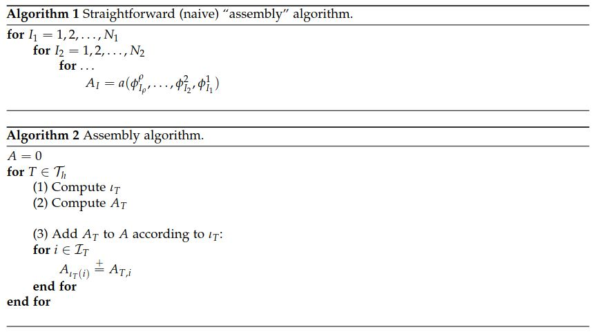
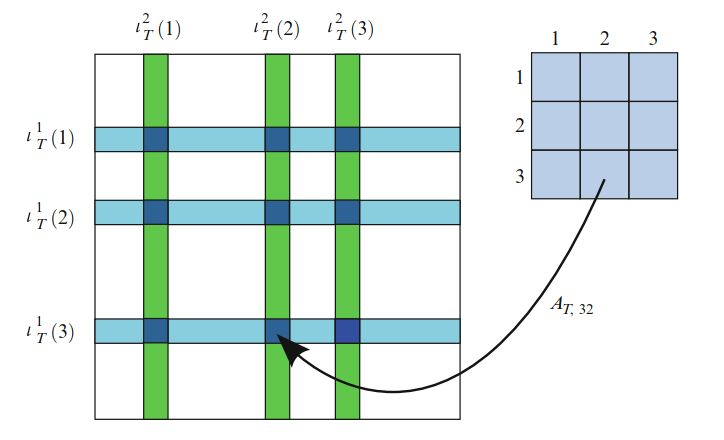
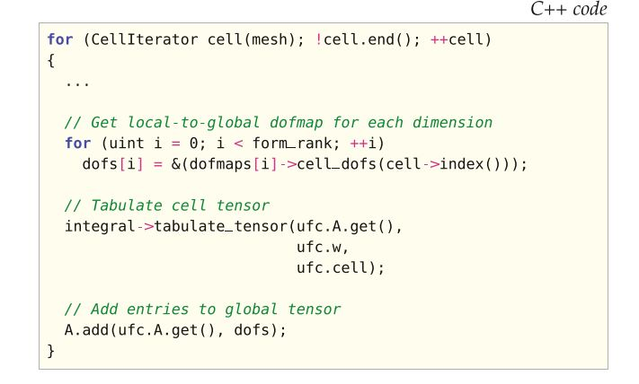
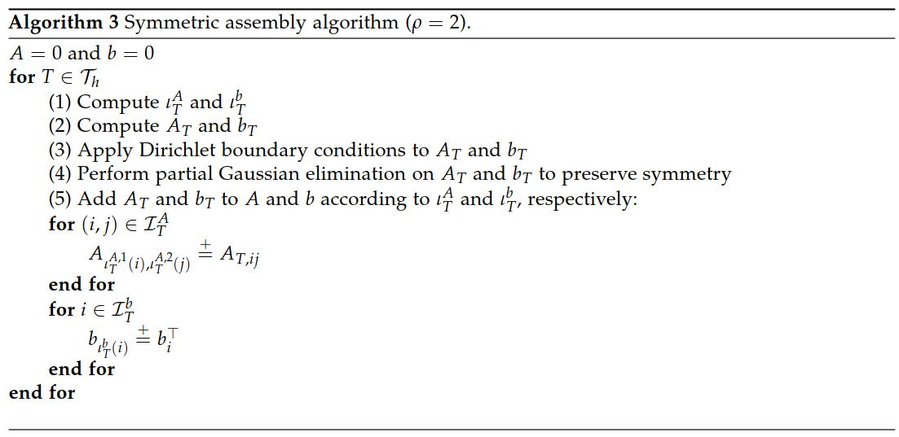

# I.方法论》6.有限元组装

【<a href="">总目录</a>】

有限元方法可以看作是形成离散线性系统$AU = b$或非线性系统$b(U)= 0$的方法，对应于微分方程变分形式的离散化。 因此，有限元方法实现的核心部分是根据变分形式计算矩阵和向量。  在本章中，我们描述了用于计算离散算符（张量）$A$的标准算法。  将此算法称为`有限元组装`（finite element assembly）。  我们还将讨论标准算法的效率以及对无矩阵方法的扩展。

<!--more-->

## 6.1 组装算法

正如第5章所见，$\rho$重线性形式$V_\rho \times \dots \times V_2 \times V_1 \to \mathbb{R}$的离散算符，就是由下式定义的$\rho$秩张量$A$：

$$
A_I = a(\phi^\rho_{I_\rho} , \dots , \phi^2_{I_2} , \phi^1_{I_1} ) \tag{6.1}
$$

其中，$I = (I_1, I_2, \dots , I_\rho)$ 是长度为$\rho$的多重索引， $\{\phi_k^j\}^{N_j}_{k=1}$是$V_{j,h} \subset V_j, \quad j = 1, 2, \dots , \rho$的基底.  这个离散算符是典型的稀疏张量，其秩为$\rho$，维数为$N_1 \times N_2 \times \dots \times N_\rho$。

一种计算张量$A$的简单算法是遍历其所有项并按`算法1`所述逐一计算。 由于该算法有两个主要缺点，而在实践中很少使用。  首先，它没有考虑到稀疏张量$A$的大多数项可能为零。  其次，没有考虑到每个条目通常是来自基函数$\phi^1_{I_1},\phi^2_{I_2},\dots \phi^\rho_{I_\rho}$所支持的胞元集的贡献（积分）之和。 其结果导致，在计算对张量$A$不同项的局部贡献时，必须多次访问网格的每个胞元。  因此，通常通过对网格的胞元进行迭代，并将每个局部胞元对全局张量$A$的贡献相加来计算张量$A$.  为了了解如何将张量$A$分解为局部贡献的总和，我们先回顾第5章对胞元张量$A_T$的定义：

$$
A_{T,i} = a_T(\phi^{T,\rho}_{i_\rho}, \dots , \phi^{T,2}_{i_2}, \phi^{T,1}_{i_1}) \tag{6.2}
$$

其中，$i=(i_1, i_2, \dots, i_\rho)$是长为$\rho$的多重索引，$A_{T,i}$是$\rho$秩张量$A_T$的第$i$项，$a_T$是胞元$T\in \mathcal{T}_h$对多重线性形式的局部贡献， $\{\phi_k^{T,j}\}^{n_j}_{k=1}$是$T$上$V_{j, h}$的局部有限元基底。  在此，我们假设多重线性形式可表示为域$\Omega$上的积分，进而可以自然分解为局部贡献之和。  如果这个形式包含维面或边界积分的贡献，则可以类似地将多重线性形式分解为维面的局部贡献。

为了制定通用的组装算法，令$\iota_T^j: [1,n_j] \to [1, N_j]$表示第2章介绍的，为每个离散函数空间$V_{j,h}, \quad j = 1,2,\dots,\rho$引入局部到全局映射，并且为每个$T \in \mathcal{T}_h$由下式定义的局部到全局的集映射$\iota_T:\mathcal{I}_T \to \mathcal{I}$：

$$
\iota_T(i) = (\iota^1_T(i_1), \iota^1_T(i_1), \dots , \iota^\rho_T(i_\rho)) \quad \forall i \in \mathcal{I}_T \tag{6.3}
$$

其中， $\mathcal{I}_T$是索引集

$$
\begin{aligned}\mathcal{I}_T &= \prod^\rho_{j=1}[1, n_j] \\ &= \{(1, 1, \dots , 1), (1, 1, \dots , 2), \dots , (n_1, n_2,\dots , n_{\rho−1}), (n_1, n_2,\dots , n_\rho)\}\end{aligned} \tag{6.4}
$$

即，$\iota_Τ$将局部自由度的元组映射为全局自由度的元组。  此外，令$\mathcal{T}_I\subset \mathcal{T}_h$表示$\{\phi_{I_j}^j\}^\rho_{j=1}$均非零的网格胞元的子集。  我们注意到，如果$T \in \mathcal{T}_I$，那么$\iota_T$是可逆的。  现在，我们可以通过对网格胞元的局部贡献求和来计算张量$A$：

$$
\begin{aligned}A_I &= \sum_{T \in \mathcal{T}_h}a_T(\phi^\rho_{I_\rho} , \dots , \phi^2_{I_2}, \phi^1_{I_1} ) = \sum_{T \in \mathcal{T}_I}a_T(\phi^\rho_{I_\rho} , \dots , \phi^2_{I_2}, \phi^1_{I_1} ) \\ &= \sum_{T\in \mathcal{T}_I}a_T\left(\phi^{T,\rho}_{(\iota^\rho_T)^{−1}(I_\rho)}, \dots , \phi^{T,2}_{(\iota^2_T)^{−1}(I_2)}, \phi^{T,1}_{(\iota^1_T)^{−1}(I_1)}\right) = \sum_{T\in \mathcal{T}_I}A_{T,\iota^{−1}_T(I)} \end{aligned} \tag{6.5}
$$

可以通过对所有胞元$T\in \mathcal{T}_h$进行一次迭代来有效地执行此计算。 在每个胞元$T$上，计算胞元张量$A_T$，然后将其添加到全局张量$A$中（算法2），如图6.1。

图6.1  使用局部到全局映射$\iota_T$，将胞元张量$A_T$的项添加到全局张量$A$，图中描绘了，在三角形上分段线性单元的二秩张量（矩阵）的组装。  在每个单元$T$上，计算一个$3\times3$矩阵$A_T$，并将其各项添加到全局矩阵中。  将第一行的项分别添加到由$\iota^2_T(1),\iota^2_T(2),\iota^2_T(3)$标定列的全局矩阵的第$\iota^1_T(1)$行。  第二行的项则添加到全局矩阵的第$\iota^1_T(2)$行等。

## 6.2 实现

图6.2 DOLFIN中的组装算法（算法2）的实际实现（摘录）（来自DOLFIN 1.0中的`Assembler.cpp`）。  

在FEniCS中，组装算法（算法2）作为DOLFIN的一部分实现（见图6.2）。  组装算法的步骤（1），（2）和（3），DOLFIN依赖于外部代码。  步骤（1）和（2），DOLFIN调用由形式编译器（例如FFC或SyFi）生成的代码。  特别是，DOLFIN通过UFC接口分别针对步骤（1）和（2）调用了两个函数`tabulate_dofs`和`tabulate_tensor`。  步骤（3）通过DOLFIN的`GenericTensor::add`接口执行，并映射到多个线性代数后端之一作相应的操作，比如`PETSc`的`MatSetValues`和`Trilinos/Epetra`的`SumIntoGlobalValues`。

在典型的组装实现中，胞元张量$A_T$的计算是组装算法最昂贵的操作。  但是，对于DOLFIN，由形式编译器生成了用于计算$A_T$的优化算法（请参见第7章和第8章），因此将局部张量$A_T$的项添加到全局张量$A$中的适当位置的这步操作，通常会构成总组装时间的重要部分。  该操作是昂贵的，因为即使将稀疏矩阵的布局初始化了，向稀疏张量的任意项添加值也不是一件容易的事。  在标准情况下，当$A$是稀疏矩阵（2秩的张量）时，线性代数后端将稀疏矩阵存储为`行压缩存储`（compressed row storage, CRS）格式或其他某种稀疏格式。  对于每个给定的项，线性代数后端必须沿着第$I$行搜索以找到存储给定第$J$行的值的位置。  结果，对于许多问题，目前在FEniCS中用于稀疏矩阵的组装速度受到插入到稀疏线性代数数据结构中的速度的限制。  稀疏矩阵的初始化会带来额外的成本，这涉及稀疏模式的计算。  对于大多数线性代数库，有必要在插入项之前初始化稀疏矩阵的布局，以实现可容许的插入速度。  稀疏模式的计算是一个中等成本的操作，但是在非线性问题的情况下，通常会随时间摊销。

算法2可以轻松扩展为在网格的维面上组装。  在维面上进行组装，对于处理包含在网格（外部维面）边界上积分的变分形式（以解决Neumann边界条件）以及作为不连续Galerkin公式一部分在网格的内部维面上包含积分的形式都是必要的。  因此，DOLFIN实现了三种不同的组装算法。  它们分别是胞元，外部维面和内部维面上的组装。

## 6.3 边界条件的对称应用

对于对称问题，以保持矩阵对称性的方式应用Dirichlet边界条件是有用的，因为这允许使用限于对称矩阵的求解算法，例如共轭梯度法和Cholesky分解 。  边界条件的对称应用可以通过在组装成全局张量$A$之前修改胞元张量$A_T$来处理。  在DOLPHIN的类`SystemAssembler`中实现了应用对称性边界条件的组装。

为了解释对称组装算法，请考虑全局系统$AU=b$以及相应的单元矩阵$A_T$和单元向量$b_T$。  如果全局索引$I$与Dirichlet边界条件$U_I = D_I$关联，则可以强行设定$A_{II} = 1, A_{IJ}=0，\quad I \ne J$和$b_I = D_I$。  可调用DOLFIN函数`DirichetBC::apply`应用此方法。  但是，为了保持矩阵的对称性，我们可以执行部分高斯消去法来获得$A_{JI} = A_{IJ}=0,\quad I \ne J$。 局部地，可通过从第$J$个方程中减去第$I$行乘以$A_{JI}$来实现的。  这些部分高斯消去是在单元级别的线性系统上执行的。  然后将局部线性系统添加到全局矩阵。  结果，Dirichlet条件被多次添加到全局向量，每个胞元一次，通过对$A$对角线项添加多次来补偿。 算法3中对此进行了总结。  或者，可以选择从线性系统中消去与Dirichlet边界条件相对应的自由度（因为这些值是已知的）。  最后，这些值出现在线性系统的右侧。  此算法没有消去与Dirichlet边界条件相关的自由度。  取而代之的是，保留这些自由度以维持线性系统的维数，以便它始终与解的自由度总数（包括已知的Dirichlet值）匹配。

## 6.4 并行组装

如果线性代数后端支持分布式矩阵以及进程内和进程外矩阵项的插入，并且网格数据结构支持分布式网格，则在分布式并行环境中，组装算法将保持不变。  PETSc（Balay等人，2001，2004）和Trilinos/Epetra（Heroux等人，2005）都支持分布式矩阵和向量。  有效的并行组装依赖于适当划分的网格和适当分布的自由度图，以最大程度地减少进程间的通信。  通常，仅使用形式编译器是不可能生成有效的自由度映射，因为自由度映射应反映网格的划分。  取而代之的是，可以使用由形式编译器生成的自由度映射来在运行时构造合适的映射。  DOLFIN支持分布式网格，并且能为分布式组装计算分布式自由度映射。

多线程组装比分布式组装表面上看更简单，并且鉴于多核体系结构的快速增长，它具有吸引力。  可以使用例如OpenMP轻松修改组装代码，在胞元上并行化组装循环。  多线程组装需要格外小心，以免多个线程不会写入同一内存位置（当多个线程尝试写入同一内存位置时，这称为竞争条件）。  最近，DOLFIN（从1.0版开始）基于对网格的胞元进行着色，从而使两个相邻胞元（在拉格朗日单元的情况下，具有相同顶点的单元）都不具有相同的颜色，进而实现了多线程组装。  然后可以遍历网格的颜色，对于每种颜色，使用OpenMP并行化组装循环。  这样可确保没有两个胞元会从同一位置（网格中）读取数据，或将数据写入同一位置（全局张量中）。

## 6.5 无矩阵方法

对形如$AU = b$的线性系统，Krylov子空间方法和其他一些迭代方法的一个特点是，它们仅依赖矩阵算符$A$对向量的作用，而无需直接操纵$A$。  这与直接线性求解器相反。  因此，如果可以计算$A$对任意向量$v$的作用，则可以使用Krylov求解器来求解系统$AU=b$，而无需组装$A$。  对于非常适合Krylov求解器的，并且$A$的组装成本很高（就CPU时间和/或内存而言）的问题，这种无矩阵的方法可能很有吸引力。  无矩阵方法的一个缺点是，常用于改善Krylov求解器的收敛性和鲁棒性的预处理器要涉及$A$的操纵，进而无法应用无矩阵方法。  为了进行组装，无矩阵方法用向量$Av$（$A$对给定向量$v$的作用）的重复组装代替矩阵$A$的组装。  有效地应用这些方法的关键要素是向量的快速组装。  与插入稀疏矩阵相比，插入密集向量的成本相对较低。  因此，胞元张量的计算是主要成本。  FEniCS支持线性或线性化算法作用的组装。

