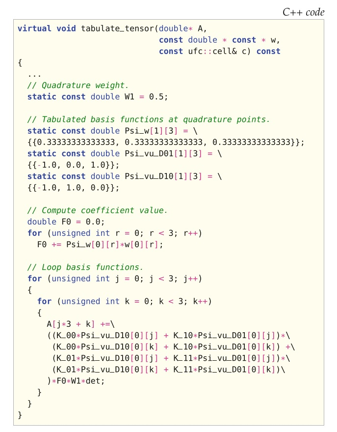
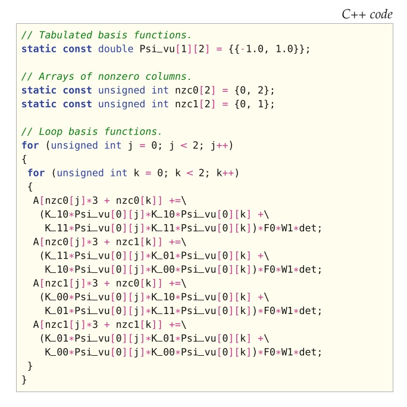
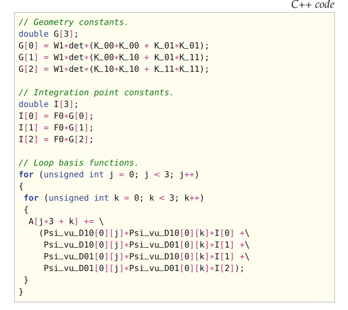
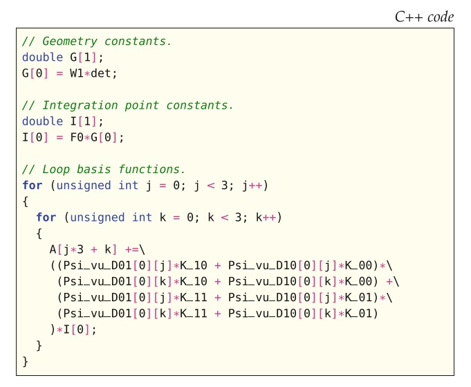
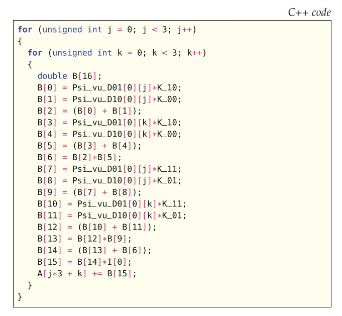

# I.方法论》7.有限元变分形式的正交表示（一）

【<a href="#第七章-有限元变分形式的正交表示">总目录</a>】

本章介绍了与有限元变分形式相关的局部单元张量数值积分的常规运行时正交方法，尤其是可以减少浮点运算次数的自动优化。  运行时正交方法的替代方法是第8章中介绍的张量表示。  正交和张量方法都在FFC中实现了（参见第11章）。  在本章中，我们讨论了四种用于优化所生成代码的运行时性能的正交表示策略，并表明优化策略比单纯的实现带来了运行时性能的显着提高。  我们还研究了针对不同方程的正交和张量方法的性能，这将导致人们希望能够在两种表示形式之间进行选择。

<!--more-->

## 7.1 标准正交表示

为了说明在FFC中实现的标准正交表示和优化，我们考虑加权拉普拉斯算子$-\nabla\cdot(w\nabla u)$的双线性形式，其中$u$是未知的，$w$是给定的系数。 此方程变分问题的双线性形式为

$$
a(u, v) = \int_\Omega{ w\nabla u \cdot \nabla v dx} \tag{7.1}
$$

通过使用可直接在正交点求值的“正交函数”，正交方法可以处理的情况，所涉及的所有函数并非都来自有限元空间。 而张量表示法仅支持所有函数都来自有限元空间的情况（必要时使用插值法）。  因此，为了确保在表示之间进行适当的性能比较，我们假设形式中的所有函数（包括系数函数）都来自有限元函数空间。  对于（7.1），所有函数都将来自

$$
V_h=\left\{v\in H^1(\Omega) : v|_T \in P_q(T) \ \forall T \in \mathcal{T} \right\} \tag{7.2}
$$

其中，$P_q(T)$表示$\Omega$的标准三角剖分$\mathcal{T}$的单元$T$上$q$次拉格朗日多项式空间。  如果令$\{\phi_i^T\}$表示能够张成$T$上离散函数空间$V_h$的局部有限元基底，那么单元$T$的局部单元张量可以计算为：

$$
A_{T,i} = \int_T{ w\nabla\phi_{i_1}^T \cdot \nabla\phi_{i_2}^T dx} \tag{7.3}
$$

其中，$i = (i_1, i_2)$。

（7.3）中局部单元张量的表达式可以用UFL表示（请参阅第17章），FFC会从中生成形式的中间表示形式（请参阅第11章）。  假设从参考单元$T_0$到给定单元$T\in \mathcal{T}$的标准仿射映射$F_T:T_0\to \mathcal{T}$，那么此中间表示为

$$
\begin{aligned}A_{T,i} = \sum^N_{q=1}\sum^n_{\alpha_3=1}\Phi_{\alpha_3}(X^q) w_{\alpha_3}&\sum^d_{\beta=1}\sum^d_{\alpha_1=1}\frac{\partial X_{\alpha_1}}{\partial x_\beta}\frac{\partial \Phi_{i_1}(X^q)}{\partial X_{\alpha_1}}\\ & \qquad \sum^d_{\alpha_2=1}\frac{\partial X_{\alpha_2}}{\partial x_\beta}\frac{\partial \Phi_{i_2}(X^q)}{\partial X_{\alpha_2}} \mathrm{det} \ F_T' W^q \end{aligned}\tag{7.4}
$$

其中，使用了从参考坐标$X$到实际坐标$x = F_T(X)$的变量变化。  在上面的等式中，$N$表示积分点数，$d$是$\Omega$的维数，$n$是$w$的局部基底的自由度个数，$\Phi_i$表示参考单元上的基函数，$\mathrm{det} \ F_T'$是雅可比行列式，$W^q$是积分点$X^q$的正交权重。  默认情况下，FFC应用可精确积分变分形式的正交方案。

根据（7.4）中的表示，由FFC生成用于计算局部单元张量各项的代码。  代码如图7.1所示。  为正交表示所生成代码，按如下方式构造。  首先，取决于当前单元$T$几何量的值，例如雅可比矩阵$\partial X_{\alpha_1}/\partial x_\beta$和$\partial X_{\alpha_2}/\partial x_\beta$的逆分量的计算，在代码中分配的变量`K_01`（此代码未显示，因为它对于理解正交表示的性质并不重要）。  接下来，在参考单元的积分点上的基函数及其导数值，如$\Phi_{\alpha_3}(X^q)$和$\partial\Phi_{i_1}(X^q)/\partial X_{\alpha_1}$。  有限元基函数由FIAT计算。  参考单元上的基函数及其导数独立于当前单元$T$，因此编译成表并存储在图7.1中的表Psi_w，Psi_vu_D01和Psi_vu_D10中。  将基函数值制成表后，开始循环积分点。  在该示例中，我们考虑了线性单元，并且仅需要一个积分点就可进行精确积分。  因此，省略了积分点上的循环。  积分点循环中的首个任务是计算当前积分点的系数值。  对于所考虑的问题，这涉及计算系数$w$的值。  图7.1中用于计算F0的代码是表示$\sum^n_{\alpha_3=1}\Phi_{\alpha_3}(X^q)w_{\alpha_3}$的精确变换。  图7.1中代码的最后一部分是基函数索引$i_1$和$i_2$上的循环，其中添加了从当前积分点到局部单元张量$A_T$中每项的贡献。  要生成正交表示的代码，应使用FFC命令行选项`-r quadrature`。

图7.1 与使用二维线性单元的加权拉普拉斯算子相关的，双线性形式的部分生成代码。  像K_00这样的变量是雅可比矩阵逆矩阵的分量，而$\mathrm{det}$是雅可比矩阵的行列式。  没有显示计算这些变量的代码。  A包含局部单元张量的值，w包含加权函数$w$的节点值。

## 7.2 正交优化

现在，我们讨论用于提高所生成代码的运行时性能的优化。  在FFC中实现的优化策略的基本原理：以减少计算局部单元张量次数的方式来操作表达式。  以下各节所描述的策略，除了零消除操作外，都具有一些共同的特征，可以归类为： 

**移动不变的循环代码**   简而言之，该过程力图确定与一个或多个求和索引无关的项，并将它们移到这些特定索引的循环之外。  例如，在（7.4）中，关于系数$w$，正交权重$W_q$和行列式$\mathrm{det}\ F'_T$的项均与基函数索引$i_1$和$i_2$无关，因此对于每个积分点只需要计算一次。  可以在Alfred等人（1986）的文章中找到对此技术的一般性讨论，也称为“循环外提（loop hoisting）”。 

**重用通用项**   表达式中，可识别的多次出现的项，只计算一次，存储为临时值，然后在表达式中所有出现的地方重复使用。  这可能对运算次数有很大影响，因为用于计算AT中各项的表达式位于基函数索引上的循环内，如图7.1中用于标准正交表示的代码所示。

要打开优化，除了以下各节中提供的任何FFC优化选项外，还应附加使用命令行选项`-O`。

### 7.2.1 零消除操作

对于特定问题，某些基函数及其导数可能在所有积分点均为零值。  由于这些值是在编译时列出的，因此可以识别包含非零值的列。  这样可以减少与这些表有关索引的维循环。  但是，减少表的结果是必须创建索引映射才能正确访问值。  映射导致内存在运行时无法连续访问，并且可能导致运行时性能下降。

可以通过使用命令行选项`-f eliminate_zeros`打开此优化。  用此选项生成的加权拉普拉斯方程的代码如图7.2所示。  为简洁起见，仅包含与图7.1不同的代码。

图7.2 使用带优化选项`-f eliminate_zeros`的二维线性单元，为加权拉普拉斯算子生成部分代码。  数组nzc0和nzc1包含用于值映射的非零列索引。  注意是如何零消除的，这里使用表（Psi_vu）来替换图7.1中基函数导数的两张表Psi_vu_D01和Psi_vu_D10。 

尽管零消除导致涉及索引$j$和$k$的维循环数从3减小到2，但是操作数量却增加了。  原因是映射导致在循环内同时计算四个项，并与图7.1中的代码相比，用于计算每个项的代码并未显著减少。  实际上，通常不建议单独使用这种优化策略，但结合以下各节中概述的策略，可以显著提高运行时性能。  当形式包含混合单元时，此效果尤其明显，其中基函数表中的许多值均为零。  应用此策略时要小心的另一个原因是，由于项数的增加可能由于硬件限制而阻止FFC编译。

### 7.2.2 化简表达式

用于计算局部单元张量各项的表达式可能会变得非常复杂。  由于此类表达式通常位于循环内部，因此降低复杂度可以显着减少总操作数。  可用表达式$x(y + z)+ 2xy$来说明此方法，在将第1项展开后，通过同类项分组和可以简化为$x(3y + z)$，这样就从五个操作减少到三个操作 。  这种策略的另一个好处是，在简化之前进行表达式的展开通常会允许对更多的项进行预先计算并提到循环外部，如本节开头所述。 对于加权拉普拉斯方程，项

$$
\sum^d_{\beta=1}\sum^d_{\alpha_1=1}\frac{\partial X_{\alpha_1}}{\partial x_\beta}\frac{\partial \Phi_{i_1}(X^q)}{\partial X_{\alpha_1}}\sum^d_{\alpha_2=1}\frac{\partial X_{\alpha_2}}{\partial x_\beta}\frac{\partial \Phi_{i_2}(X^q)}{\partial X_{\alpha_2}} \tag{7.5}
$$

将被展开为

$$
\sum^d_{\beta=1}\sum^d_{\alpha_1=1}\sum^d_{\alpha_2=1}\frac{\partial X_{\alpha_1}}{\partial x_\beta}\frac{\partial X_{\alpha_2}}{\partial x_\beta}\frac{\partial \Phi_{i_1}(X^q)}{\partial X_{\alpha_1}}\frac{\partial \Phi_{i_2}(X^q)}{\partial X_{\alpha_2}} \tag{7.6}
$$

其中，$(\partial X_{\alpha_1}/\partial x_\beta)(\partial X_{\alpha_2}/\partial x_\beta)$独立于索引$i_1$和$i_2$，因此可以移出这些循环。

应使用FFC命令行选项`-f simplify_expressions`来生成启用了此优化的代码。  由此选项为（7.4）中表示生成的代码，如图7.3所示，其中再次仅包含与图7.1不同的代码。

图7.3  使用带优化选项`-f simplify_expressions`的二维线性单元，为加权拉普拉斯算子生成代码部分。 

由于表达式的展开，许多与几何相关的项以及移到基函数索引j和k循环之外，并存储在数组G中。  另外，请注意如何通过将变量det和W1移到括号之外来简化用于计算G中值的表达式。  类似地，仅依赖于积分点的项被外提并存储在数组I中。  与图7.1中标准正交表示的代码相比，操作数量有所减少。  因此可以期待运行时性能的提高。

就FFC代码生成时间和内存消耗而言，上述优化是执行正交优化中最昂贵的，因为它涉及在展开表达式时创建新项。 该过程不适用于复杂的表达式，但是就减少操作数而言，在许多情况下它是最有效的方法。  这种特殊的优化策略，加上一节中概述的零消除，是FFC中首先实现的策略。  有关更多详细信息，请读者参考Ølgaard和Wells（2010）的研究， 以及与张量表示的比较。

### 7.2.3 积分点常量预计算

上一节中描述的优化是以增加代码生成时间为代价的。  为了在减少操作次数的同时减少生成时间，可以采取另一种方法，包括在不首展开表达式的情况下外提相对于积分点为常量的表达式。

要通过这种优化生成代码，应使用FFC命令行选项`-f precompute_ip_const`。  用这种方法生成的用于（7.4）中表示的代码如图7.4所示。

图7.4   使用带有优化选项`-f precompute_ip_const`的二维线性单元，为加权拉普拉斯算子生成代码部分。

从生成的代码中可以明显看出，这种策略不会导致这种特定形式的操作数显著减少。  但是，对于具有许多系数的更复杂的形式，可以外提项数将显着增加，从而改善运行时性能。

### 7.2.4 基常量预计算

此优化策略是上节所描述策略的扩展。  除了与几何和积分点相关的外提项外，还会在循环内部预先计算依赖于基底索引的值。  对于某些在循环内频繁出现的项，这将导致操作减少，从而一旦计算出给定值就可以重新使用。

要通过这种优化生成代码，应使用FFC命令行选项`-f precompute_basis_ const`。  图7.5所示，用这种方法为（7.4）中表达式生成的代码，其中仅包括与图7.4不同的代码。  在这种特殊情况下，如果与先前的方法相比，则不会实现额外的操作减少，因为在索引j和k循环内没有可重用的项。

图7.5  使用带有优化选项`-f precompute_basis_const`的二维线性单元，为加权拉普拉斯算子生成代部分。  数组B包含依赖于索引j和k的预计算的值。

### 7.2.5 进一步优化

初步研究表明，可以通过应用两个附加优化来提高正交表示的性能。  查看图7.5中的代码，我们看到数组B中大约一半的临时值仅取决于循环索引j，因此可以将其外提，就像我们在上一节中对其项所做的那样。  另一种方法是针对生成的代码中的j和k展开循环。  这将导致可重用值数量急剧增加，并且该方法可以很容易地与所有其他优化策略结合使用。  但是，临时值的总数也会增加。  因此，这种优化策略可能不适用于所有形式。

对单纯形上不高于6次的多项式的积分，FFC实施了一些有效的正交方案。  对于高于6次的多项式，它调用FIAT（请参阅第13章）以计算正交方案。  FIAT提供的方案基于映射到单纯形的Gauss–Legendre–Jacobi规则（有关此类方案的详细信息，请参阅Karniadakis和Sherwin（2005））。  这意味着，为了积分七阶多项式，FFC将在每个空间方向上使用四个正交点，即在三维中每个胞元有$4^3 = 64$个点。  正交表示的进一步优化可通过对单纯形上更高阶多项式实施更有效的正交方案来实现，因为积分点数量的减少将带来运行时性能的提高。  但是，FFC确实为用户提供了一个选项，可以指定变分形式的正交度，从而允许不精确的正交。  要将正交度设置为1，应使用命令行选项`-f quadrature_degree=1`。

【<a href="">第7章后续</a>】

