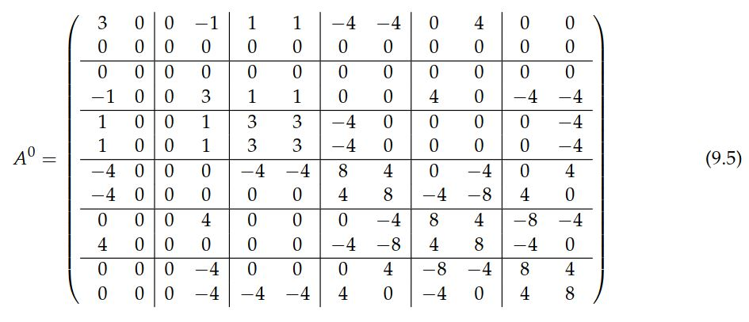
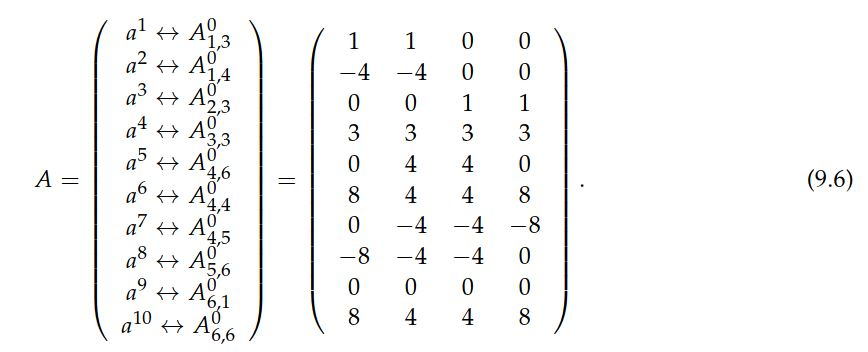
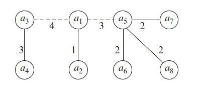
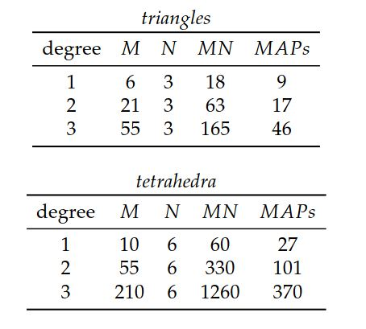
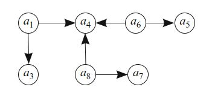
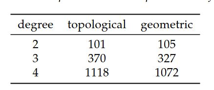

# I.方法论》9.有限元矩阵计算的离散优化

第8章中，用于单元张量$A_T$计算的张量缩并结构不仅可以构造变分形式编译器，而且还可以优化编译器。  对于典型的变分形式，参考张量$A^0$具有显著的结构，允许以较低计算成本在任意胞元$T$上计算单元张量$A_T$。  利用这种结构减少运算次数，自然会导致离散数学中的几个问题。  本章介绍了一些可能的优化，并讨论了构成FErari项目核心的编译时组合优化问题（Kirby等，2006； Kirby和Scott，2007； Kirby和Logg，2008），这是 第12章的主题。
  
<!--more-->

在本章中，我们考虑两种基本的优化。  首先，我们考虑参考张量中成对行之间的关系。  这自然会导出一个图，用于建模这些成对行之间的接近度。  如果两行相互“接近”，则可以复用第一行计算的结果，来计算第二行所需的量。  使用汉明距离和线性关系来计算两个这样的行的接近度。  这种方法产生了一个（几乎）是度量空间的加权图，因此我们将这种优化称为“拓扑的”。  其次，我们考虑参考张量的多行（2行以上）之间的关系。  这种关系通常依赖于行集，这些行集被视为欧几里得空间中的向量。  因为我们使用平面和超平面来减少计算量，所以我们将这些优化描述为“几何的”。  为了进行比较，我们简要讨论了使用更传统的优化过稠密线性代数软件包的优化。

## 9.1 优化框架

在第8章中发展的张量范式可表示为

$$
A_{T,i} = \sum_{\alpha\in \mathcal{A}} A^0_{i\alpha} G_T^\alpha \quad \forall i \in \mathcal{I} \tag{9.1}
$$

或简写成

$$
A_T = A^0 : G_T \tag{9.2}
$$

其中，$\mathcal{I}$是单元张量$A_T$所允许多重索引集，而$\mathcal{A}$是几何张量$G_T$所允许多索引集。  可以在编译时计算参考张量$A^0$，然后在运行时与$G_T$缩并，以获得有限元网格中每个胞元$T$的单元张量$A_T$。  计算大小为$n_T \times n_T$的局部有限元刚度矩阵的情况，对应的$\mathcal{I}$包含长为2的$|\mathcal{I}|=n^2_T$个多重索引，其中$n_T$是$T$上局部有限元空间的维数。

就矩阵-向量乘积而言，重做（9.2）很方便：

$$
A^0 : G_T \leftrightarrow \tilde{A}^0\tilde{g}_T \tag{9.3}
$$

在此，矩阵$\tilde{A}^0$躺在$\mathbb{R}^{|\mathcal{I}|\times|\mathcal{A}|}$中，向量$\tilde{g}_T$躺在$\mathbb{R}^{|\mathcal{A}|}$中。 然后可以将所得的矩阵-向量乘积变形到单元张量$A_T$中。  由于必须对有限元网格中的每个胞元$T$进行此计算，因此尝试使此操作尽可能高效是有意义的。

在下文中，我们将删除（9.3）的下标和上标，并考虑计算通用矩阵-矢量积的问题

$$
y = Ax \tag{9.4}
$$

其中，$A = \tilde{A}^0$是先验已知的常矩阵，而$x=\tilde{g}_T$是任意矢量。  我们将研究$A$的结构，可减少形成这些乘积所需的算术运算次数。  通过这种结构，我们能够生成一个计算系统作用的例程，可以比使用常规稀疏或稠密线性代数例程执行的操作更少。

在继续进行数学公式描述之前，我们先举一个要优化的矩阵A的示例。  在（9.5）中的参考张量$A^0$，用于计算标准刚度矩阵，可离散化二维拉普拉斯算子与三角形上二次拉格朗日单元。  4秩张量在此被描述成项为2×2矩阵的6×6矩阵。  完全的分析将使用对应的扁平化36×4矩阵$A$。

## 9.2 拓扑优化

与标准矩阵-矢量乘法所需的144个乘法-加法对相比，可以用更少的运算将对应于（9.5）中描述的参考张量$A^0$的矩阵$A$应用于任意矢量$x$。这就需要对$A$进行仔细的分析，并需要为将特定$A$应用于一般$x$生成专用代码。  对$A \in \mathbb{R}^{M \times N}$，令$\{a^i\}^M_{i=1} \subset \mathbb{R}^N$表示$A$的行。  矢量$y = Ax$可由形如$y_i = a^ix$的$M$个点乘来计算。  下面，我们研究$A$各行之间的关系，以找到矩阵-矢量积的优化计算。

就所描述的目的，我们考虑（9.5）的以下子集，该子集将仅花40个乘-加对，但包含我们用作优化的较大版本的所有关系：

检查（9.6），发现$a^9$为零； 因此，不需要将其乘以$x$的项。  特别地，如果$a^i$有$z$个项为零，那么点乘$a^i x$需要$N−z$个乘-加对，而不是$N$。

如果对某些$i \ne j$，$a^i = a^j$，显然$A$的第6行和第10行就是，于是有$y_i = y_j$，并且只需要执行一个点乘，而不是两个。  类似地，对于某个数$\alpha$，$\alpha a^i = a^j$，正如$A$的第1行和第2行。  这意味着在计算$y_i$之后，可以用一个乘法来计算$y_j=\alpha y_i$。

除了上面讨论的相等和共线性以外，还可以考虑$A$的行间其他关系。  进一步检查（9.6）中的$A$，会发现行间有一些共同的项，但既不相等也不共线。  这样的行间汉明距离很小。 即，两行间不同的项数少。  如第5行和第6行所示，这种情况经常发生。  我们可以写成$a^j = a^i+(a^j-a^i)$，其中$a^j-a^i$具有$d_H \le N$个非零项，而$d_H$是$a^i$与$a^j$之间的汉明距离。  一旦计算出$y_i$，就可以将$y_j$计算为

$$
y_j = y_i +(a_j − a_i)x \tag{9.7}
$$

只需$d_H$个额外的乘-加对。  如果$d_H$小于$N$，则可节省大量存储。

在Wolf和Heath（2009）中，这些二元关系被扩展为包括两个向量的部分共线性。  例如，第6行和第7行有部分共线，即$a^6_{2:4} = −a^7_{2:4}$。 这样可以通过以下方式计算$y_j$：

$$
y_j = \alpha(y_i − y_{i,\text{不匹配}}) + a^j_{\text{不匹配}} x \tag{9.8}
$$

下标表示向量的不匹配部分用零填充。  这样的关系将$y_j$的计算减少到不匹配贡献的减法，用$y_i$计算结果的缩放，然后再与$a_j$中不匹配的项进行额外的乘法。

所有这些结构示例都与$A$的单个行或$A$的一对行有关。 行对之间的这种二元关系适用于图论结构的表述，如9.3节所述。  $A$的行间也发生高阶关系。  例如，可以第1行和第3行相加，再缩放构成第4行。  在这种情况下，一旦知道$a^1 x$和$a^3 x$，则可以使用一个加法和一个乘法来计算结果，而直接计算点乘$a^4 x$则需要四个乘法和三个加法。

## 9.3 图问题

如果我们只考虑A的行间的二元关系，那么我们自然会得到一个加权的无向图，其顶点是$A$的$a_i$行。  权重为$d$的$a^i$和$a^j$的边表示：如果$a^i x$已知，那么可用$d$个乘-加对来计算$a^j x$。  实际上，这种边还需要用指示关系类型的信息标记，例如相等性，共线性或低汉明距离。

为了通过图找到最佳计算，我们使用Prim的算法(Prim, 1957)来计算最小生成树。  最小生成树是连接图的所有顶点并且具有最小总边权重的树。  Kirb等（2006年）证明了，在行间给定的一组关系下，最小生成树实际上编码了一种算法，该算法可以最佳地减少所需的算术运算次数。  这里的讨论假定初始图是已连接的。 原则上，每个$a^i$与任何$a^j$的距离都不超过$N$。  然而，实际上，图中仅包含$d < N − z$的边，因为$N$是不考虑$y_j$的计算$y_i$的成本。  这通常会使图断开连接，因此必须构造最小的生成森林而不是树（一组不相交的树，它们一起连接所有顶点）。  使用二元关系的最小生成树的示例如图9.1所示。 另请参阅表9.1。

图9.1 （9.6）中向量的最小生成树（森林）。 虚边表示不会减少操作次数（相对于N − z），因此是不连通图形。 

  

表9.1 图优化过的拉普拉斯算子（MAPS）的乘-加对的数量与乘-加对的基本数量（MN）相比。

 
然后可以使用这种森林来确定评估$A x$的有效算法，如下所示。  从一些$a^i$开始，最多直接以$N$个乘-加对来计算$y^i = a^i x$。  如果$a^i$的一个或多个项为零，则乘-加对的数量可能小于N。  然后，如果$a^j$是森林中$a^i$的最近邻居，则使用$a^j$和$a^i$间的关系来计算$y^j = a^j x$。  然后，取$a^j$的最近邻居，并继续直到$y$的所有项都已计算出。

注意到输入张量$G_T \leftrightarrow x$对于某些算子（如拉普拉斯算子）是对称的，可以进一步改进。  在两维空间中，拉普拉斯算子$G_T$是2×2的，只有3个唯一项，而在三维空间中，则是3×3，只有6个唯一项。  此事实可用于构造具有较少列的修改后的参考张量$A^0$。 对于其他算子，它可能沿某些轴而不是全部轴具有对称性。

Heath和Wolf提出了对该算法的细微改动。  他们没有选择一个任意的起始行$a^i$，而是使用“内积”（标记为IP）这个额外顶点来丰富图。  每个$a^i$与IP的距离为$N − z$，其中$z$是$a^i$中消失的项数。  顶点IP始终被选为最小生成树的根。  它允许对诸如稀疏性等一元关系进行更稳健的处理，并检测部分共线性关系。
 
## 9.4 几何优化

当考虑多于两行间的关系时，优化问题可能不再用图来表述，而是需要一些其他结构。  在这些情况下，通常很难证明已经找到了最佳解决方案，并且怀疑相关组合的问题是NP难题。

第一次尝试，可以完全根据数据之间的线性相关性进行工作，如下所示。 令$B=\{b^i\}_i\subseteq\{a^i\}^N_{i=1}$是$A$的非零行的最大集合，这样就没有两行是共线的。  然后枚举所有线性相关的三元组，

$$
S = \left\{ {b^i, b^j, b^k}\subseteq B : \exist \alpha_1, \alpha_2, \alpha_3 \ne 0 , \alpha_1 b^i + \alpha_2 b^j + \alpha_3 b^k = 0 \right\} \tag{9.9}
$$

现在的想法是确定$B$的一些子集$C$，可以使用$S$中的关系来递归构造$B$中的其余行。

给定一些$C \subset B$，我们可以如下定义$C$的`闭包`，记作$\bar{C}$。  首先，如果$b \in C$，则$b \in \bar{C}$。  其次，如果$b \in B$并且存在$c, d \in \bar{C}$使得$\{b, c, d\} \in S$，那么$b \in \bar{C}$也成立。  如果$\bar{C} = B$，我们说$C$是$B$的生成器，或者$C$生成$B$。

递归定义建议了一个贪心过程，用于构造任何集合$C$的闭包。  $B$中的每个向量都放置在优先级队列中，其初值是与其他向量无关地计算成本。  当$C \ne B$时，将具有最低计算成本的$B\backslash C$向量添加到$C$，并根据$S$更新$B$的优先级。  此过程将构造一个有向无环图，该图指示所使用的线性相关性。  每个$b\in C$将没有邻居，而每个$b \in \bar{C}\backslash C$将指向$\bar{C}$的另外两个成员。  该图称为生成图。  使用（9.6），我们得到以下$B$，$S$和$C$集，其生成图如图9.2所示：

$$
\begin{aligned}B &= \{a_1, a_3, a_4, a_5, a_6, a_7, a_8\} \\ S &= \{(a_1, a_3, a_4), (a_4, a_5, a_6), (a_4, a_7, a_8)\} \\ C &= \{a_3, a_4, a_5, a_7\} \end{aligned} \tag{9.10}
$$

图9.2 （9.6）中的向量生成图。

表9.2 在四面体上使用二至四次多项式的拉普拉斯算子进行拓扑和几何优化的比较。  在每种情况下，都会报告优化算法的最终MAP数量。  没有报告$q = 1$的情况，因为两种策略产生的操作次数相同。 

如果$C$生成$B$，则生成图表示用于计算$\{y^i = b^i x\}_i$的优化（但可能不是最佳）过程。  根据此图对向量$b^i$进行拓扑排序。  然后，对于拓扑顺序中的每个$b^i$，如果$b^i$没有邻居，则显式计算$b^i x$。  否则，$b^i$将指向另外两个向量$b^j$和$b^k$，其与x的点乘是已知的。  由于生成图是根据一组线性相关的三元组$S$构建的，因此必须存在一些$\beta_1,\beta_2$，使得$b^i =\beta_1 b^j+\beta_2 b^k$。  因此，我们可以通过下式计算$y^i$

$$
y^i = b^i x = \beta_1 b^j x + \beta_2 b^k x \tag{9.11}
$$

它只需要两个乘-加对，而不是$N$个。

为了充分利用线性相关性信息，我们希望找到一个生成器$C$，它具有尽可能少的成员。  我们说，如果没有也能生成$B$的$C'\subset C$，那么生成器$C$对于$B$而言是最小的。  一个更严格的要求是使生成器最小。  如果没有其他生成器$C'$具有更低的基数，则生成器$C$是最小的。  Kirby和Scott（2007）考虑了构建最小生成器的更完整的细节和启发式方法。 目前尚不清楚这种启发式方法是否构成了最小生成器，或者发现最小生成器是个困难问题。

给定一个$B$的最小生成器$C$，可以考虑在$C$的元素间搜索更高阶的线性关系，例如一组具有三维跨度的四项。  在这种情况下，生成图及其用法的讨论是相同的。

在Wolf和Heath（2009）中，研究了超图模型中$A$的行间二元关系和高阶关系。  尽管贪婪算法为图模型提供了最佳解决方案，但事实证明，直接推广到超图可能不是最优的。  虽然超图问题很可能非常棘手，但是启发式算法的性能很好，并提供了除图模型之外的其他优化。  因此，即使找到的是非最佳解决方案，它仍然可以改善算术要求。

在表9.2中，使用四面体上的二次至四次多项式对拉普拉斯算子的拓扑和几何优化进行了比较。  在几何情况下，对向量$a^i$进行过滤以使其具有唯一的方向。 也就是说，每类共线向量仅保留一个向量。  然后，使用成对线的性相关性向量为其余向量构建生成图。  然后，针对该集合的生成器搜索四个向量的集合之间的线性相关性，并构造生成图。  也许令人惊讶的是，几何优化发现浮点运算次数减少量与基于图的二元关系相当或更好。  这些如表9.2所示。

## 9.5 稠密线性代数的优化

作为试图找到一种用来计算单元张量AT简化算法的优化替代，可以考虑通过高效的稠密线性代数来计算单元张量。  如上所述，我们注意到单元张量$A_T$的项可以由矩阵-向量乘积$\bar{A}^0\bar{g}_T$计算。  尽管在$\bar{A}^0$中可能出现零，但这通常是一个稠密的矩阵，因此可以使用2级BLAS有效地计算矩阵-矢量积，尤其是使用`dgemv`的调用。  BLAS存在许多优化的实现，包括手动优化的实现，凭经验和自动调整的库（Whaley等，2001）以及用于自动推导算法的形式化方法（Bientinesi等，2005）。

注意到可以在一个矩阵-矩阵乘法中为一批单元$\{T_i\}_i\subset \mathcal{T}$计算单元张量，于是可进一步优化单元张量$A_T$的计算：

$$
\left[\bar{A}^0 \bar{g}_{T_1}, \bar{A}^0 \bar{g}_{T_2},\dots \right]  =\bar{A}^0 \left[\bar{g}_{T_1}, \bar{g}_{T_2},\dots \right]  (9.12)
$$

可以使用单个3级BLAS调用（`dgemm`）而不是2级BLAS调用的序列来有效地计算此矩阵-矩阵乘积，通常可以提高浮点性能。

## 9.6 实现注记

本章讨论的优化的子集可以作为FErari Python模块的一部分使用。  FErari(0.2.0)实现的优化是基于寻找单元张量的各项间二元关系的。  启用优化后，FFC在编译时调用FErari以生成优化的代码。  当从命令行调用FFC时，可以通过`-O`参数打开FFC的优化，或者从DOLFIN Python接口调用即时编译器时，通过设置`parameters["form_compiler"]["optimize"] = True`来打开FFC的优化。  请注意，仅当FFC基于第8章所描述张量表示时生成的代码，才使用FErari优化。  当FFC基于正交生成代码时，优化的处理方式有所不同，如第7章所述。  Kirby和Logg（2008）详细介绍了针对几个问题所改善的运行时间。

