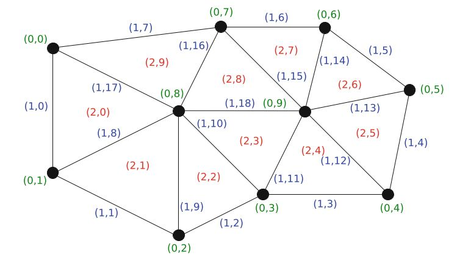
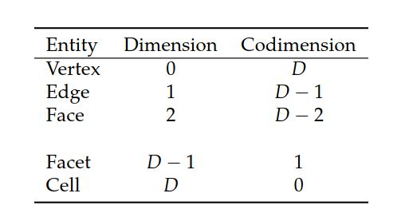
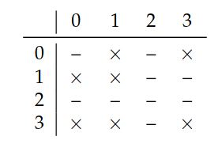
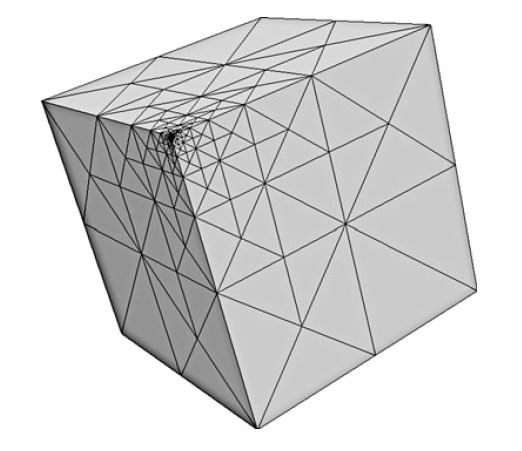

# II.实现》10.DOLFIN：C++/Python有限元库》网格

<center>【<a href="">第10章前续</a> | <a href="">总目录</a>】</center>

### 10.3.2 网格

DOLFIN的核心部分是其网格库和Mesh类。  网格库为计算网格提供了数据结构和算法，包括网格连通性（重合关系），网格细化，网格划分和网格相交的计算。

<!--more-->

网格库是用C++实现的，已进行了最小化存储需求的优化，并实现对网格数据的有效访问。  特别是，DOLFIN网格存储在少量连续数组中，在其上是轻量级的面向对象层，可提供对底层数据的查看。  有关网格库设计和实现的详细讨论，请参见Logg（2009）。

**创建一个网格**。  DOLFIN提供了用于创建简单网格的功能，例如单位正方形和单位立方体，球体，矩形和盒子的网格。  以下代码演示如何创建单位正方形的16×16三角形网格（由2×16×16 = 512个三角形组成）和单位立方体的16×16×16四面体网格（由6×16×16×16 = 24,576个四面体组成）。

```c++
// C++ code
UnitSquareMesh unit_square(16, 16);
UnitCubeMesh unit_cube(16, 16, 16);
```

```python
# Python code
unit_square = UnitSquareMesh(16, 16)
unit_cube = UnitCubeMesh(16, 16, 16)
```

通过指定网格的胞元和顶点，可以显式构造简单网格（由间隔，三角形或四面体组成的网格）。  类`MeshEditor`提供了用于创建简单网格的接口。  以下代码演示了如何创建两个三角形组成的网格来覆盖单位正方形：

```c++
// C++ code
Mesh mesh;
MeshEditor editor;
editor.open(mesh, "triangle", 2, 2);
editor.init_vertices(4);
editor.init_cells(2);
editor.add_vertex(0, 0.0, 0.0);
editor.add_vertex(1, 1.0, 0.0);
editor.add_vertex(2, 1.0, 1.0);
editor.add_vertex(3, 0.0, 1.0);
editor.add_cell(0, 0, 1, 2);
editor.add_cell(1, 0, 2, 3);
editor.close();
```

```python
# Python code
mesh = Mesh();
editor = MeshEditor();
editor.open(mesh, "triangle", 2, 2)
editor.init_vertices(4)
editor.init_cells(2)
editor.add_vertex(0, [0.0, 0.0])
editor.add_vertex(1, [1.0, 0.0])
editor.add_vertex(2, [1.0, 1.0])
editor.add_vertex(3, [0.0, 1.0])
editor.add_cell(0, [0, 1, 2])
editor.add_cell(1, [0, 2, 3])
editor.close()
```

**从文件读取网格**。  尽管内置类UnitSquare和UnitCube可用于测试典型应用程序，但仍需要从文件读取由外部网格生成器生成的网格。  要从文件读取网格，只需将文件名提供给Mesh类的构造函数即可：

```c++
// C++ code
Mesh mesh("mesh.xml");
```

```python
# Python code
mesh = Mesh("mesh.xml")
```


网格必须以DOLFIN XML格式存储。  以下示例说明了单位正方形2×2网格的XML格式：


```xml
<?xml version="1.0" encoding="UTF-8"?>

<dolfin xmlns:dolfin="http://fenicsproject.org">
<mesh celltype="triangle" dim="2">
<vertices size="9">
<vertex index="0" x="0" y="0"/>
<vertex index="1" x="0.5" y="0"/>
<vertex index="2" x="1" y="0"/>
<vertex index="3" x="0" y="0.5"/>
<vertex index="4" x="0.5" y="0.5"/>
<vertex index="5" x="1" y="0.5"/>
<vertex index="6" x="0" y="1"/>
<vertex index="7" x="0.5" y="1"/>
<vertex index="8" x="1" y="1"/>
</vertices>
<cells size="8">
<triangle index="0" v0="0" v1="1" v2="4"/>
<triangle index="1" v0="0" v1="3" v2="4"/>
<triangle index="2" v0="1" v1="2" v2="5"/>
<triangle index="3" v0="1" v1="4" v2="5"/>
<triangle index="4" v0="3" v1="4" v2="7"/>
<triangle index="5" v0="3" v1="6" v2="7"/>
<triangle index="6" v0="4" v1="5" v2="8"/>
<triangle index="7" v0="4" v1="7" v2="8"/>
</cells>
</mesh>
</dolfin>
```

可以使用命令`dolfin-convert`将以其他数据格式存储的网格转换为DOLFIN XML格式，如下文更详细的解释。


**网格实体**。 从概念上讲，网格（由类Mesh建模）由一组网格实体组成。  网格实体是一对$(d, i)$，其中$d$是网格实体的拓扑维数，而$i$是网格实体的唯一索引。  网格实体在每个拓扑维数中从$0$到$n_d−1$编号，其中$n_d$是拓扑维数$d$的网格实体数。




<center>图10.3 网格的每个实体由一对$(d, i)$标识，对其指定了拓扑维数$d$和在$d$维实体集中的唯一索引i。</center>



<center>表10.1 网格实体及其维数/余维数。 实体的余维数为$D-d$，其中$D$为最大维数，$d$为维数。</center>


为了方便起见，将拓扑0维网格实体称为`顶点`，将1维实体称为`边`，将2维实体称为`面`。  余1维实体称为`维面`(facet)，而余0维实体称为`胞元`(cell)。  这些概念总结在图10.3和表10.1中。  我们注意到，三角形网格由顶点，边和胞元组成，并且这些边也可以称为维面，而胞元则称为面。  我们进一步注意到，四面体网格由顶点，边，面和胞元组成，并且这些面也可以称为维面。  这些概念由类MeshEntity，Vertex，Edge，Face，Facet和Cell来实现。  这些类不存储任何数据。  相反，它们是轻量级对象，提供基础网格数据的视图。  可以从一个Mesh，一个拓扑维数和一个索引创建一个MeshEntity。  以下代码演示了如何在网格上创建各种实体：


```c++
// C++ code
MeshEntity entity(mesh, 0, 33); // vertex number 33
Vertex vertex(mesh, 33); // vertex number 33
Cell cell(mesh, 25); // cell number 25
```

```python
# Python code
entity = MeshEntity(mesh, 0, 33) # vertex number 33
vertex = Vertex(mesh, 33) # vertex number 33
cell = Cell(mesh, 25) # cell number 25
```


**网格拓扑和几何**。  网格的拓扑与其几何分开存储。  网格的拓扑是对网格各个实体间关系的描述，而几何则描述了这些实体如何嵌入$\mathbb{R}^d$中。

用户很少直接面对MeshTopology和MeshGeometry类，因为大多数关于网格的算法都可以用网格迭代器来表示。  但是，用户有时可能需要访问网格的维数，这涉及访问作为网格的一部分存储的MeshTopology或MeshGeometry，如以下代码示例所示：


```c++
// C++ code
uint gdim = mesh.topology().dim();
uint tdim = mesh.geometry().dim();
```

```python
# Python code
gdim = mesh.topology().dim()
tdim = mesh.geometry().dim()
```

应当注意，拓扑和几何维数可能不同。  特别是对于网格边界这种情况，通常是嵌入在$\mathbb{R}^{D+1}$中的拓扑$D$维网格。  也就是说，几何维数为$D+1$。


**网格连通性**。  网格的拓扑由网格的连通性（重合关系）表示，这是对网格实体间相互连接的完整描述。  这种连通性通过MeshConnectivity类存储在DOLFIN中。  对于每对拓扑维$d \to d'\quad d, d'= 0, 1, \dots, D$，将一个这样的数据集存储为类MeshTopology的一部分，其中$D$是拓扑维。




<center>表10.2 DOLFIN计算网格的连通性$d \to d'$，对每对$d,d' = 0, 1, \dots, D$。 该表指示哪些连通性对（用×表示）已计算了，以便计算四面体网格的连通性$1 \to 1$（边-边连通性）。</center>

创建Mesh时，将创建最小的MeshTopology。 仅存储从胞元（$D$维）到顶点（$0$维度）的连通性（MeshConnectivity $D \to 0$）。  当要求某种连通性时，例如连通性$1 \to 1$（边-边连通性），DOLFIN自动计算所要求连通性所需的任何其他连通性。  表10.2对此进行了说明，其中我们指出了计算$1 \to 1$连通性需要哪些连通性。  以下代码演示了如何初始化四面体网格（$D=3$）的各种网格连通：


```c++
// C++ code
mesh.init(2); // Compute faces
mesh.init(0, 0); // Compute vertex neighbors for each vertex
mesh.init(1, 1); // Compute edge neighbors for each edge
```

```python
# Python code
mesh.init(2) # Compute faces
mesh.init(0, 0) # Compute vertex neighbors for each vertex
mesh.init(1, 1) # Compute edge neighbors for each edge
```


**网格迭代器**。  在网格上运行的算法通常可以用迭代器表示。  网格库提供了用于在网格实体上进行迭代的常规迭代器MeshEntityIterator，以及专用的网格迭代器VertexIterator，EdgeIterator，FaceIterator，FacetIterator和CellIterator。  


以下代码说明了如何遍历给定网格的所有胞元的所有顶点的所有重合（连接）顶点。  如果两个顶点都属于同一个胞元，则将它们视为邻居。  对于单纯形网格，这等效于连接两个顶点的边。

```c++
// C++ code
for (CellIterator c(mesh); !c.end(); ++c)
    for (VertexIterator v0(*c); !v0.end(); ++v0)
        for (VertexIterator v1(*v0); !v1.end(); ++v1)
            cout << *v1 << endl;
```

```python
# Python code
for c in cells(mesh):
    for v0 in vertices(c):
        for v1 in vertices(v0):
            print v1
```

也可以使用通用迭代器MeshEntityIterator实现如下： 

```c++
// C++ code
uint D = mesh.topology().dim();
for (MeshEntityIterator c(mesh, D); !c.end(); ++c)
    for (MeshEntityIterator v0(*c, 0); !v0.end(); ++v0)
        for (MeshEntityIterator v1(*v0, 0); !v1.end(); ++v1)
            cout << *v1 << endl;
```


```python
# Python code
D = mesh.topology().dim()
for c in entities(mesh, D):
    for v0 in entities(c, 0):
        for v1 in entities(v0, 0):
            print v1
```

**网格函数**。  MeshFunction类是用于存储与Mesh相关数据的有用类。  这使得存储，例如决定性参数，子域指示符，网格胞元上的细化标记或网格维面上的边界标记，变得很容易。  MeshFunction是一个离散函数，在给定拓扑维数$d$的每个网格实体上取一个值。  存储在MeshFunction中的值的数量等于$d$维实体$n_d$的数量。  MeshFunction是关于值类型的模板，因此可以用于存储任何类型的值。  为了方便起见，由VertexFunction，EdgeFunction，FaceFunction，FacetFunction和CellFunction类来具体命名MeshFunction。  以下代码说明了如何创建一对MeshFunction，一个用于在胞元上存储子域指示器，另一个用于在维面上存储边界标记：


```c++
// C++ code
CellFunction<uint> sub_domains(mesh);
sub_domains.set_all(0);
for (CellIterator cell(mesh); !cell.end(); ++cell)
{
    Point p = cell.midpoint();
    if (p.x() > 0.5)
        sub_domains[cell] = 1;
}

FacetFunction<uint> boundary_markers(mesh);
boundary_markers.set_all(0);
for (FacetIterator facet(mesh); !facet.end(); ++facet)
{
    Point p = facet.midpoint();
    if (near(p.y(), 0.0) || near(p.y(), 1.0))
        boundary_markers[facet] = 1;
}
```

```python
# Python code
sub_domains = CellFunction("uint", mesh)
sub_domains.set_all(0)
for cell in cells(mesh):
p = cell.midpoint()
if p.x() > 0.5:
sub_domains[cell] = 1

boundary_markers = FacetFunction("uint", mesh)
boundary_markers.set_all(0)
for facet in facets(mesh):
    p = facet.midpoint()
    if near(p.y(), 0.0) or near(p.y(), 1.0):
        boundary_markers[facet] = 1
```

**网格数据**。  MeshData类提供了一种将数据与Mesh关联的简单方法。  它允许将任意MeshFunction（以及其他量）与Mesh关联。  以下代码说明了如何在网格上附加和检索名为“sub_domains”的MeshFunction：


```c++
// C++ code
MeshFunction<uint>* sub_domains = mesh.data().create_mesh_function("sub_domains");
sub_domains = mesh.data().mesh_function("sub_domains");
```

```python
# Python code
sub_domains = mesh.data().create_mesh_function("sub_domains")
sub_domains = mesh.data().mesh_function("sub_domains")
```

要列出与给定网格相关的数据，请在C++中发出命令`info(mesh.data(), true)`或在Python中发出`info(mesh.data(), True)`。

**网格细化**。  如下面的代码示例所示，可以调用`refine`函数，通过统一或局部细化来细化网格。


```c++
// C++ code

// Uniform refinement
mesh = refine(mesh);

// Local refinement
CellFunction<bool> cell_markers(mesh);
cell_markers.set_all(false);
Point origin(0.0, 0.0, 0.0);
for (CellIterator cell(mesh); !cell.end(); ++cell)
{
    Point p = cell.midpoint();
    if (p.distance(origin) < 0.1)
        cell_markers[cell] = true;
}
mesh = refine(mesh, cell_markers);
```


```python
# Python code

# Uniform refinement
mesh = refine(mesh)

# Local refinement
cell_markers = CellFunction("bool", mesh)
cell_markers.set_all(False)
origin = Point(0.0, 0.0, 0.0)
for cell in cells(mesh):
    p = cell.midpoint()
    if p.distance(origin) < 0.1:
        cell_markers[cell] = True
mesh = refine(mesh, cell_markers)
```


目前，局部细化默认为按边平分进行递归细化（Rivara，1984，1992）。 图10.4中显示了通过重复标记靠近立方体一角的胞元获得的局部细化网格的示例。





<center>图10.4 通过重复标记靠近立方体一角的胞元来获得的局部细化网格。</center>


**并行网格**。 在分布式内存体系结构上并行运行程序时（通过使用mpirun包装器调用程序来使用MPI），DOLFIN会自动划分和分布网格。  然后，每个进程将全局网格一部分存储为标准网格对象。  此外，它存储辅助数据，以正确计算每个进程上的本地到全局映射以及将数据传送到相邻区域。  在10.4节中讨论了使用DOLFIN进行并行计算。


<center>【<a href="">第10章后续</a>】</center>


