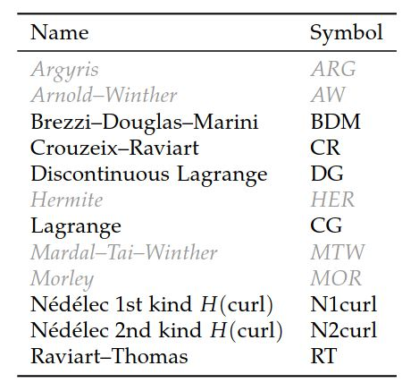
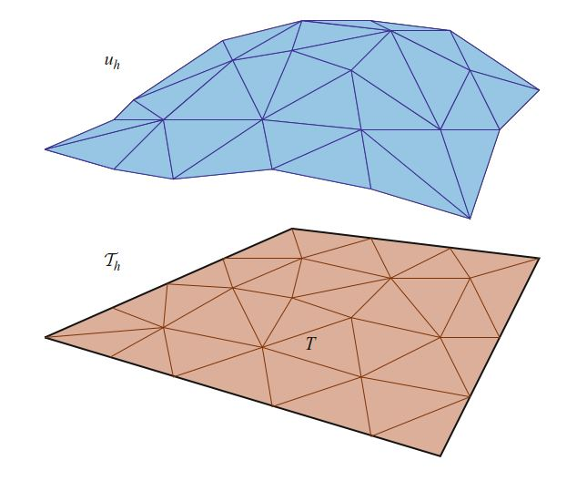

# II.实现》10.DOLFIN：C++/Python有限元库》有限元/函数/表达式

<center>【<a href="">第10章前续</a> | <a href="#第十章-dolfincpython有限元库">总目录</a>】</center>

### 10·3·3 有限元

第2章和第3章讨论的有限元的概念（Ciarlet定义）是由DOLFIN FiniteElement类实现的。  此类在C++和Python接口中的实现方式有所不同。

<!--more-->

FiniteElement类的C++实现依赖于由形式编译器（例如FFC或SFC）生成的代码，分别在第11章和第15章中进行了讨论。  FiniteElement类本质上是UFC类ufc::finite_element的包装器类。  C++ FiniteElement提供了ufc::finite_element的所有功能。  DOLFIN C ++接口的用户通常不会直接使用FiniteElement类，但是它是FunctionSpace类的重要构建块，下面将对此进行讨论。  但是，开发高级算法的用户需要对有限元基函数进行运行时评估，他们需要熟悉FiniteElement接口。  有关详细信息，请参阅DOLFIN程序员参考。

Python接口也提供了FiniteElement类。  Python FiniteElement类直接从UFL Python模块导入（请参见第17章）。  就其本身而论，它只是可用于定义变分问题的特定有限元标签。  可以使用DOLFIN FunctionSpace类更方便地定义变分问题，因此Python接口的用户很少会遇到FiniteElement类。  但是，希望使用Python开发算法的高级用户，  而此算法需要UFC接口中定义的功能（例如基函数的运行时求值），可以通过在Python接口内显式生成代码来访问此类功能。  这可以通过调用DOLFIN的`jit`函数（即时编译）来完成，该函数将UFL FiniteElement作为输入并返回一个包含ufc::finite_element和ufc::dofmap的对。  返回的对象是通过首先生成相应的C++代码，然后将该C++代码编译并包装到Python模块中来创建的。  因此，返回的对象可直接在Python中使用。  

FiniteElement的自由度可以通过调用plot(element)从Python接口直接绘制。  这将画出有限元的形状图，并按照第3章中的符号表示其自由度。




<center>表10.3 DOLFIN 1.0支持的有限元列表。 FEniCS部分支持灰色斜体单元，但并非整个工具链都支持。</center>

表10.3列出了DOLFIN当前支持的有限元（以及工具链FIAT–UFL–FFC / SFC–UFC）。  FiniteElement可以使用其全名或简称来指定（来自Python），如以下代码示例所示：

```python
// UFL code

element = FiniteElement("Lagrange", tetrahedron, 5)
element = FiniteElement("CG", tetrahedron, 5)

element = FiniteElement("Brezzi-Douglas-Marini", triangle, 3)
element = FiniteElement("BDM", triangle, 3)

element = FiniteElement("Nedelec 1st kind H(curl)", tetrahedron, 2)
element = FiniteElement("N1curl", tetrahedron, 2)
```

### 10·3·4 函数空间

DOLFIN FunctionSpace类表示有限元函数空间$V_h$，如第2章所定义。  FunctionSpace的数据用由Mesh，DofMap和FiniteElement组成的三元组表示：

<center>FunctionSpace = (Mesh, DofMap, FiniteElement)</center>

Mesh定义了计算域及其离散化。  FiniteElement定义了Mesh的任何给定胞元上的局部函数空间。  请注意，如果在同一Mesh上创建两个或更多FunctionSpaces，则该Mesh在两个FunctionSpaces间共享。

**创建函数空间**。 对于FiniteElement类，在C++和Python接口中对FunctionSpace的处理方式有所不同。  在C++中，FunctionSpace的实例化依赖于生成的代码。  例如，我们在这里考虑创建一个FunctionSpace，用来表示三角形上的连续分段线性拉格朗日多项式。  首先，必须以UFL形式语言定义相应的有限元。  为此，我们将以下代码输入到名为Lagrange.ufl的文件中：


```python
// UFL code
element = FiniteElement("Lagrange", triangle, 1)
```

然后，我们可以使用FFC之类的形式编译器生成C++代码：

```bash
# Bash code
ffc -l dolfin Lagrange.ufl
```

这将生成一个名为Lagrange.h的文件，我们可以将其包含在C++程序中以实例化给定Mesh上的FunctionSpace：


```c++
// C++ code

#include <dolfin.h>
#include "Lagrange.h"

using namespace dolfin;

int main()
{
    UnitSquare mesh(8, 8);
    Lagrange::FunctionSpace V(mesh);

    ...
    return 0;

}
```

在典型的应用中，不是通过单独的`.ufl`文件生成FunctionSpace，而是将其作为变分问题的生成代码的一部分来生成的。

从Python接口，可以直接创建一个FunctionSpace，如以下代码所示，该代码创建与上述示例相同的函数空间（三角形上的分段线性拉格朗日多项式）：


```python
# Python code

mesh = UnitSquare(8, 8)
V = FunctionSpace(mesh, "Lagrange", 1)
```


**混合空间**。  可以从函数空间的任意组合来创建混合函数空间。  作为示例，我们在这里考虑为，离散化的Stokes或不可压缩的Navier–Stokes方程，创建Taylor–Hood函数空间。  此混合函数空间是速度场的矢量值连续分段二次函数空间和压力场的标量连续分段线性函数空间的张量积。  可以很容易地以UFL格式文件（用于代码生成并随后将其包含在C++程序中）或直接在Python脚本中定义，如以下代码示例所示：

```python
// UFL code
V = VectorElement("Lagrange", triangle, 2)
Q = FiniteElement("Lagrange", triangle, 1)
W = V*Q
```


```python
# Python code
V = VectorFunctionSpace(mesh, "Lagrange", 2)
Q = FunctionSpace(mesh, "Lagrange", 1)
W = V*Q
```

DOLFIN允许生成任意嵌套的混合函数空间。  混合功能空间可以用作构建较大混合空间的块。  当从两个以上的函数空间（被嵌套在同一级别）创建混合函数空间时，则必须使用MixedElement构造函数（在UFL/C++中）或MixedFunctionSpace构造函数（在Python中）。  这是因为Python会将表达式V*Q*P解释为(V*Q)*P，这将创建一个包含两个子空间的混合函数空间：混合空间V*Q和空间P。  如果不是这样，则必须使用UFL/C++中的MixedElement([V, Q, P])或Python中的MixedFunctionSpace([V, Q, P])来定义混合函数空间。

**子空间**。  对于混合函数空间，可以访问其子空间。  这些子空间通常不同于，被用来在其自由度映射（DofMap对象）中创建混合空间的，函数空间。 子空间对于将边界条件应用于混合单元的组件特别有用。  我们在下面会回到这个问题。


### 10·3·5 函数

Function类表示了，在第2章中定义的，有限元空间$V_h$中一个有限元函数$u_h$：

$$
u_h(x) = \sum^N_{j=1} U_j\phi_j(x) \tag{10.2}
$$

其中，$U \in \mathbb{R}^N$是函数$u_h$的自由度矢量，而$\{\phi_j\}^N_{j=1}$是$V_h$的基底。  Function被表示成FunctionSpace和GenericVector中的项：

<center>Function = (FunctionSpace, GenericVector)</center>

FunctionSpace定义了函数空间Vh，而GenericVector持有自由度向量U； 参见图10.5。  在分布式内存体系结构上并行运行时，FunctionSpace和GenericVector分布在各个进程中。




<center>图10.5 由三角形单元组成的网格上的分段线性有限元函数$u_h$。 自由度向量U由网格顶点处的$u_h$值给出。</center>

**创建Function**。 function!creation

要在FunctionSpace上创建Function，只需以FunctionSpace作为参数调用Function类的构造函数，如以下代码示例所示：


```c++
// C++ code
Function u(V);
```

```python
# Python code

u = Function(V)
```

如果在同一个FunctionSpace上创建了两个或更多Function，则FunctionSpace将在这些Function之间共享。

Function通常被用于保存偏微分方程计算出的解。  然后，可以通过求解方程组来获得自由度U，如以下代码例子所示：


```c++
// C++ code
Function u(V);
solve(A, u.vector(), b);
```

```python
# Python code

u = Function(V)
solve(A, u.vector(), b)
```

线性系统的组装和求解过程由Linear/NonlinearVariationalSolver类自动处理，下面将对其进行详细讨论。

**Function求值**。  可以在计算域内的任意点对Function求值。  首先定位包含给定点的网格胞元，然后计算该胞元上基函数的线性组合来，这就是Function的计算值。  查找胞元，利用了一个有效的搜索树算法，该算法是CGAL的一部分。

以下代码示例说明了标量值和向量值函数在C++和Python接口中的函数求值：


```c++
// C++ code

# Evaluation of scalar function
double scalar = u(0.1, 0.2, 0.3);

# Evaluation of vector-valued function
Array<double> vector(3);
u(vector, 0.1, 0.2, 0.3);
```

```python
# Python code

# Evaluation of scalar function
scalar = u(0.1, 0.2, 0.3)

# Evaluation of vector-valued function
vector = u(0.1, 0.2, 0.3)
```

当并行运行在分布式网格时，这些函数只能在存储在本地进程中的网格部分点上求值。

**子函数**。  对于在混合FunctionSpace上构造的Function，可以访问Function的子功能（组件），例如绘制混合系统的分量解。  子函数可以以浅拷贝或深拷贝的形式访问。  默认情况下，子函数以浅拷贝形式访问，这意味着子函数与其父函数共享数据。  它们提供对父函数数据的视图。  有时，也可能希望将子函数作为深层副本进行访问。  深度复制的子函数不会与父函数共享其数据（即，所持有自由度向量）。  Function对象的浅层副本和深层副本本身都是Function对象，并且可以（除某些例外）用作常规的Function对象。

在C++和Python中，创建子函数的浅层副本和深层副本的方式有所不同，如以下代码示例所示：

```c++
// C++ code

Function w(W);

// Create shallow copies
Function& u = w[0];
Function& p = w[1];

// Create deep copies
Function uu = w[0];
Function pp = w[1];
```

```python
# Python code

w = Function(W)

# Create shallow copies
u, p = w.split()

# Create deep copies
uu, pp = w.split(deepcopy=True)
```

请注意，从Python接口访问组件，例如w[0]不会像在C++接口中那样创建新的Function对象。  而是创建一个UFL表达式，该表达式表示原始Function的一个分量。

### 10·3·6 表达式

Expression类与Function类密切相关，因为它表示在有限元素空间上可以被求值的函数。 但是，Function必须定义在自由度矢量各项上，而Expression可以根据例如坐标值，其他几何实体或表查询自由地定义。

通过Expression类的子类，并重载`eva`l函数，可以在C++和Python中定义一个Expression，如下面的代码示例所示，这个示例将函数$f(x, y)= sin x cos y$定义为Expression：

```c++
// C++ code
class MyExpression : public Expression
{
    void eval(Array<double>& values, const Array<double>& x) const
    {
        values[0] = sin(x[0])*cos(x[1]);
    }
};

MyExpression f;
```

```python
# Python code

class MyExpression(Expression):
    def eval(self, values, x):
        values[0] = sin(x[0])*cos(x[1])

f = MyExpression()
```

对于向量值（或张量值）Expression，还必须指定Expression的值形状。 下面的代码示例演示如何实现向量值函数$g(x, y) = (\sin x, \cos y)$。 在C++和Python中，值的形状定义略有不同。


```c++
// C++ code

class MyExpression : public Expression
{
    void eval(Array<double>& values, const Array<double>& x) const
    {
        values[0] = sin(x[0]);
        values[1] = cos(x[1]);
    }

    uint value_rank() const
    {
        return 1;
    }

    uint value_dimension(uint i) const
    {
        return 2;
    }

};

MyExpression g;
```

```python
# Python code

class MyExpression(Expression):

    def eval(self, values, x):
        values[0] = sin(x[0])
        values[1] = cos(x[1])

    def value_shape(self):
        return (2,)

g = MyExpression()
```

上面的用于表达式定义的函子（functor）构造很强大，并且允许用户定义复杂的表达式，对它的求值可能涉及作为`eval`函数一部分的任意运算。  对于诸如$f (x, y) = \sin x \cos y$和$g(x, y) = (\sin x, \cos y)$的简单表达式，Python接口的用户可以使用更简单的语法：


```python
# Python code

f = Expression("sin(x[0])*cos(x[1])")
g = Expression(("sin(x[0])", "cos(x[1])"))
```

上面的代码将自动生成DOLFIN C++ Expression类的子类，这些子类会使`eval`函数重载。  这样做的好处是效率更高，因为对eval函数的回调是在C++中而不是在Python中进行的。

在Python接口中，能被用来实现一个时间依赖表达式的一个特性是，在表达式字符串中使用变量。  例如，可以使用变量$t$表示时间：


```python
# Python code
h = Expression("t*sin(x[0])*cos(x[1])", t=0.0)
    while t < T:
        h.t = t
        ...
        t += dt
```

$t$变量在这里已被用于创建时间依赖表达式。  可以使用任意变量名称，只要它们不与内置函数的名称（例如$\sin$或$\exp$）冲突即可。

除上述示例外，Python接口还通过提供C++ Expression类的定义来直接定义C++ Expression类的（更复杂的）子类。 有关更多信息，请参阅DOLFIN程序员参考。

<center>【<a href="">第10章后续</a>】</center>
