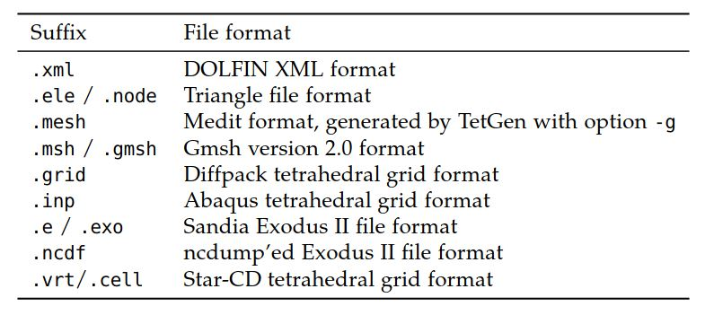
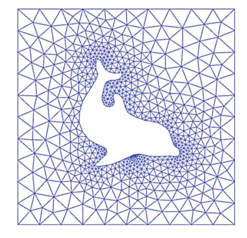
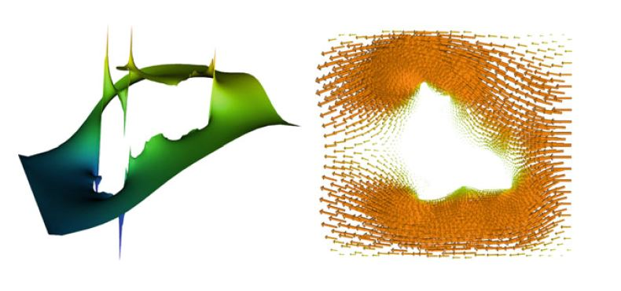

# II.实现》10.DOLFIN：C++/Python有限元库》变分问题/文件/可视化

<center>【<a href="">第10章前续</a> | <a href="#第十章-dolfincpython有限元库">总目录</a>】</center>

### 10·3·10 变分问题

变分问题（偏微分方程的有限元离散化）可以在DOLFIN中使用`solve`函数轻松解决。  线性和非线性问题都可以解决。  线性问题必须表示为以下规范形式：寻求$u \in V$使得

$$
a(u, v) = L(v) \qquad \forall  v \in \hat{V} \tag{10.8}
$$

<!--more-->

非线性问题必须表示为以下规范形式：寻求$u \in V$使得

$$
F(u; v) = 0 \qquad \forall v \in \hat{V} \tag{10.9}
$$

在以双线性形式$a$和线性形式$L$表示的线性变分问题的情况下，通过组装相应线性系统的矩阵$A$和向量$b$，然后将边界条件应用于该系统，最终求解这个线性系统。  对于以线性形式$F$和双线性形式$J$（F的导数或雅可比行列）表示的非线性变分问题，其解是通过牛顿法计算的。

下面的代码示例演示如何求解根据双线性形式$a$，线性形式$L$和以DirichletBC对象给出的Dirichlet边界条件列表指定的线性变分问题：

```c++
// C++ code
std::vector<const BoundaryCondition*> bcs;
bcs.push_back(&bc0);
bcs.push_back(&bc1);
bcs.push_back(&bc2);

Function u(V);
solve(a == L, u, bcs);
```

```python
# Python code

bcs = [bc0, bc1, bc2]

u = Function(V)
solve(a == L, u, bcs=bcs)
```

为了解决非线性变分问题，必须提供线性形式F，对于C++，还必须提供其（双线性形式的）导数J。  在Python中，这个导数是自动计算的，但也可以指定为手动的。  在许多情况下，所使用的函数导数，以.ufl格式文件或Python脚本的一部分，来轻松计算导数。 我们在这里展示了如何使用Python接口解决非线性问题。  非线性变分问题可以类似地用C++解决。


```python
# Python code
u = Function(V)
v = TestFunction(V)
F = inner((1 + u**2)*grad(u), grad(v))*dx - f*v*dx

# Let DOLFIN compute Jacobian
solve(F == 0, u, bcs=bcs)

# Differentiate to get Jacobian
J = derivative(F, u)

# Supply Jacobian manually
solve(F == 0, u, bcs=bcs, J=J)
```

通过使用LinearVariational{Problem,Solver}和NonlinearVariational{Problem,Solver}类，可以对求解过程进行更高级的控制。  以下代码示例说明了这些类的用法：


```python
# Python code
u = Function(V)
problem = LinearVariationalProblem(a, L, u, bcs=bcs)
solver = LinearVariationalSolver(problem)
solver.parameters["linear_solver"] = "gmres"
solver.parameters["preconditioner"] = "ilu"
solver.solve()
```

```python
# Python code
u = Function(V)
problem = NonlinearVariationalProblem(F, u, bcs=bcs, J=J)
solver = NonlinearVariationalSolver(problem)
solver.parameters["linear_solver"] = "gmres"
solver.parameters["preconditioner"] = "ilu"
solver.solve()
```

这些类可以类似地用于C++。

求解器类提供了可以调整以控制求解过程的一系列参数。  例如，要查看LinearVariationalSolver或 NonlinearVariationalSolver的可用参数列表，请发出以下命令：


```c++
// C++ code
info(solver.parameters, true)
```

```python
# Python code
info(solver.parameters, True)
```

### 10·3·11 文件I/O和可视化

**预处理**。  DOLFIN仅在内置网格，形如UnitSquare，UnitCube等，有网格生成功能。  必须使用外部软件来生成更复杂的网格。  为了简化此过程，DOLFIN提供了一个简单的脚本`dolfin-convert`来将网格从其他格式转换为DOLFIN XML格式。  表10.4列出了当前支持的文件格式。  以下代码说明了如何将网格从Gmsh格式（suffix .msh或.gmsh）转换为DOLFIN XML格式：


```bash
# Bash code
dolfin-convert mesh.msh mesh.xml
```



<center>表10.4 `dolfin-convert`脚本支持的文件格式列表。</center>

将网格转换为DOLFIN XML文件格式后，可以将其读取到程序中，如以下代码示例所示：


```c++
// C++ code
Mesh mesh("mesh.xml");
```

```python
# Python code
mesh = Mesh("mesh.xml")
```

**后期处理**。  从C++或Python发出`plot`命令，可以对解（Function），Mesh或MeshFunction 进行可视化：


```c++
// C++ code
plot(u);
plot(mesh);
plot(mesh_function);
```

```python
# Python code
plot(u)
plot(mesh)
plot(mesh_function)
```

使用plot命令生成示例图10.6和10.7。 在Python中，还可以绘制表达式和有限元：


```python
# Python code
plot(grad(u))
plot(u*u)

element = FiniteElement("BDM", tetrahedron, 3)
plot(element)
```



<center>图10.6 使用DOLFIN `plot`命令绘制网格，此处是DOLFIN分发的网格dolfin-1.xml.gz。</center>



<center>图10.7 使用DOLFIN `plot`命令绘制标量值和矢量值函数，来自图10.6网格上Stokes方程解的压力（左）和速度（右）。</center>

~~要通过Python与绘图窗口进行交互（旋转，缩放），请调用函数`interactive`，或在`plot`命令中添加可选参数`interactive = True`。~~ 【译者注：`interactive`目前已经弃用了】  `plot`命令提供了基本的绘图功能，高级的后期处理可以通过外部软件（例如ParaView和MayaVi2）更好地处理。  通过将解（Function对象）存储为PVD格式（ParaView Data，一种基于XML的格式）来轻松实现此目的。  可以在C++和Python中通过写入扩展名为.pvd的文件来完成，如以下代码示例所示：


```c++
// C++ code
File file("solution.pvd");
file << u;
```

```python
# Python code

file = File("solution.pvd")
file << u
```

标准PVD格式基于ASCII的，因此，对于大型数据集，文件可能会变得非常大。  要使用压缩的二进制格式，在创建基于PVD的File对象时可以使用字符串"compressed"：


```c++
// C++ code
File file("solution.pvd", "compressed");
```

如果将多个函数写入同一文件（通过重复使用<<），则数据将解释为时间序列，然后可以在ParaView或MayaVi2中对其进行动画处理。  时间序列的每个帧都存储为.vtu（VTK非结构化数据）文件，并参考存储在.pvd文件中的文件。  写入时间相关数据时，存储每个快照的时间t可能很有用。 如下所示：


```c++
// C++ code
File file("solution.pvd", "compressed");
file << std::make_pair<const Function*, double>(&u, t);
```

```python
# Python code
file = File("solution.pvd", "compressed");
file << (u, t)
```

在对使用可变时间步长的仿真进行动画处理时，存储的时间就特别有用。

PVD格式支持并行后期处理。  并行运行时，将为每个分区上的数据创建一个.pvd文件和一个.vtu文件。  可以使用ParaView无缝查看并行计算的结果。

**DOLFIN XML格式**。 

DOLFIN XML是DOLFIN的本机格式。 XML的优点是它是一种健壮且易于阅读的格式。  如果文件被压缩，则与二进制格式相比，文件大小的开销也很小。

可以使用标准流运算符<<和>>向DOLFIN XML文件中写入DOLFIN中的许多类，如以下代码示例所示：


```c++
// C++ code
File vector_file("vector.xml");
vector_file << vector;
vector_file >> vector;

File mesh_file("mesh.xml");
mesh_file << mesh;
mesh_file >> mesh;

File parameters_file("parameters.xml");
parameters_file << parameters;
parameters_file >> parameters;
```

```python
# Python code
vector_file = File("vector.xml")
vector_file << vector
vector_file >> vector

mesh_file = File("mesh.xml")
mesh_file << mesh
mesh_file >> mesh

parameters_file = File("parameters.xml")
parameters_file << parameters
parameters_file >> parameters
```

由于FunctionSpace的表示（进而Function的表示）依赖于生成的代码，因此无法读取/写入Function和FunctionSpace对象。

DOLFIN自动处理压缩的XML文件的读写。  因此，可以通过将网格和其他数据存储在压缩的XML文件中（带有suffix .xml.gz）来节省空间。

**时间序列**。  对于时间依赖问题，能以够快速读/写数据的格式，来存储解序列或网格可能很有用。 为此，DOLFIN提供了TimeSeries类。  这使得能够存储（自由度）向量序列和（或）网格。  以下代码说明了如何将矢量序列和网格存储到TimeSeries：


```c++
// C++ code
TimeSeries time_series("simulation_data");

while (t < T)
{
    ...
    time_series.store(u.vector(), t);
    time_series.store(mesh, t);
    t += dt;
}
```

```python
# Python code
time_series = TimeSeries("simulation_data")

while t < T:
    ...
    time_series.store(u.vector(), t)
    time_series.store(mesh, t)
    t += dt
```

TimeSeries中的数据以二进制格式存储，每个存储的数据集（Vector或Mesh）均具有一个文件，并具有一个公共索引。  如下面的代码示例所示，可以通过调用成员函数retrieve从TimeSeries中检索数据。  如果在请求时刻没有存储的数据集，那么将为Vector做线性插值。  对于网格，将使用最接近的数据点。

```c++
// C++ code
time_series.retrieve(u.vector(), t);
time_series.retrieve(mesh, t);
```

```python
# Python code
time_series.retrieve(u.vector(), t)
time_series.retrieve(mesh, t)
```

<center>【<a href="">第10章后续</a>】</center>


