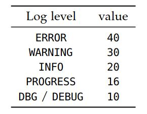

# II.实现》10.DOLFIN：C++/Python有限元库》日志/诊断/参数

<center>【<a href="">第10章前续</a> | <a href="#第十章-dolfincpython有限元库">总目录</a>】</center>

### 10·3·12 日志／诊断

DOLFIN提供了一个简单的接口来统一处理日志消息，包括警告和错误。  所有消息都收集到单个流中，这使整个程序（包括DOLFIN库）的输出的目的地和格式可由用户控制。

<!--more-->

**打印消息**。  通常使用`info`命令打印来自DOLFIN的消息报文。  该命令采用字符串参数和要格式化的变量的可选列表，与标准C printf命令非常相似。  请注意，`info`命令自动将换行符附加到给定的字符串。  另外，C++用户可以将`dolfin::cout`和`dolfin::endl`对象用于消息的C++样式格式，如下所示。


```c++
// C++ code
info("Assembling system of size %d x %d.", M, N);
cout << "Assembling system of size " << M << " x " << N << "." << endl;
```

```python
# Python code
info("Assembling system of size %d x %d." % (M, N))
```

`info`命令和`dolfin::cout/endl`对象与标准C printf命令和`std::cout/endl`对象的不同之处在于，输出定向到特殊的流中，其输出可以重定向到标准输以及其他目标。  特别是，可能会完全禁用DOLFIN的输出，或选择打印消息的详细程度，如下所述。

**警告和错误**。  除了`info`命令之外，DOLFIN还提供了`warning`和`error`命令，可分别用于发出警告和错误。  这两个命令的工作方式与info命令大致相同。  但是，`warning`命令将在给定的消息前加上`*** Warning: `，而`error`命令在C++和Python将引发可以捕获的异常。  这两个命令还将以比使用info打印的消息更高的日志级别打印消息。

**设置日志级别**。  DOLFIN日志级别确定通过日志系统打印的消息路由。 仅打印高于或等于当前日志级别的消息。 可以使用`set_log_level`函数设置DOLFIN的日志级别。  该函数需要一个指定日志级别的整数值。  为了简化日志级别的规范，可以使用表10.5中列出的许多预定日志级别之一。  默认日志级别为INFO。  通过从C++调用命令`set_log_active(false)`和从Python调用`set_log_active(False)`，可以完全关闭日志消息。  出于技术原因，用于调试消息的日志级别在C++中称为DBG，在Python中称为DEBUG。  表10.5中对此进行了总结。




<center>表10.5 DOLFIN中的日志级别。</center>

要以任意日志级别打印消息，可以指定`log`命令的日志级别，如下面的代码示例所示。 【译者注：目前较近Python版DOLFIN已经不支持`log`命令了，只支持前面`info`, `warning`，`error`这三个日志命令和日志级别设置命令`set_log_level`,`get_log_level`和`set_log_active`。】


```c++
// C++ code

info("Test message"); // will be printed
cout << "Test message" << endl; // will be printed
log(DBG, "Test message"); // will not be printed
log(15, "Test message"); // will not be printed

set_log_level(DBG);
info("Test message"); // will be printed
cout << "Test message" << endl; // will be printed
log(DBG, "Test message"); // will be printed
log(15, "Test message"); // will be printed

set_log_level(WARNING);
info("Test message"); // will not be printed
cout << "Test message" << endl; // will not be printed
warning("Test message"); // will be printed
std::cout << "Test message" << std::endl; // will be printed!
```

```python
# Python code

info("Test message") # will be printed
log(DEBUG, "Test message") # will not be printed
log(15, "Test message") # will not be printed

set_log_level(DEBUG)
info("Test message") # will be printed
log(DEBUG, "Test message") # will be printed
log(15, "Test message") # will be printed

set_log_level(WARNING)
info("Test message") # will not be printed
warning("Test message") # will be printed
print "Test message" # will be printed!
```

**对象打印**。  可以使用`info`命令来打印许多标准的DOLFIN对象，如下面的代码示例所示。


```c++
// C++ code
info(vector);
info(matrix);
info(solver);
info(mesh);
info(mesh_function);
info(function);
info(function_space);
info(parameters);
```

```python
# Python code
info(vector)
info(matrix)
info(solver)
info(mesh)
info(mesh_function)
info(function)
info(function_space)
info(parameters)
```

上面的命令将打印简短的非正式消息。 例如，命令`info(mesh)`可能会导致以下输出：

```txt
<Mesh of topological dimension 2 (triangles) with 25 vertices and 32 cells, ordered>
```

在Python接口中，也可以通过调用`print mesh`来打印相同的非正式消息。  要打印更详细的数据，可以将`info`函数的详细参数设置为true（默认为false），这将打印对象的详细摘要。


```c++
// C++ code
info(mesh, true);
```

```python
# Python code
info(mesh, True)
```

一些对象的详细输出可能很长。

**任务和进度条**。  除了用于打印消息的基本命令外，DOLFIN还提供了许多命令来组织模拟程序的诊断输出。  两个这样的命令是`begin`和`end`。 这些命令可用于程序的嵌套输出。 每次调用`begin`将缩进级别增加一个单位（两个空格），而每次调用`end`将缩进级别减小一个单位。

提供反馈的另一种方法是通过进度条。  DOLFIN为此提供了Progress类。  尽管已经尽力减少了更新进度条的开销，但还是要谨慎使用。  如果在循环的每次迭代中仅执行少量工作，则使用进度条的相对开销可能会很大。  下面的代码示例说明了`begin/end`命令和进度条的用法。


```c++
// C++ code
begin("Starting nonlinear iteration.");
info("Updating velocity.");
info("Updating pressure.");
info("Computing residual.");
end();

Progress p("Iterating over all cells.", mesh.num_cells());
for (CellIterator cell(mesh); !cell.end(); ++cell)
{
    ...
    p++;
}

Progress q("Time-stepping");
while (t < T)
{
    ...
    t += dt;
    q = t / T;
}
```

```python
# Python code
begin("Starting nonlinear iteration.")
info("Updating velocity.")
info("Updating pressure.")
info("Computing residual.")
end()

p = Progress("Iterating over all cells.", mesh.num_cells())
for cell in cells(mesh):
    ...
    p += 1

q = Progress("Time-stepping")
while t < T:
    ...
    t += dt
    q.update(t / T)
```


**设定计时器**。 可以使用Timer类完成计时。  Timer在创建时会自动启动，并在超出范围时自动停止。  Timer在创建时会自动启动，并在超出范围时自动停止。


```c++
// C++ code
void solve(const Matrix& A, Vector& x, const Vector& b)
{
    Timer timer("Linear solve");
    ...
}
```

```python
# Python code
def solve(A, b):
    timer = Timer("Linear solve")
    ...
    return x
```

可以显式调用Timer的start和stop成员函数。  要直接访问计时器的值，可以调用成员函数`value`。【译者注：成员函数`value`已经没有了，改用[`elapsed`](https://fenicsproject.org/olddocs/dolfinx/dev/python/_autogenerated/dolfin.common.timer.html)。】  可以通过调用`list_timings`函数来打印在程序执行期间创建的所有计时器的值摘要。


### 10·3·13 参数

DOLFIN保留了控制其各个组件行为的参数全局数据库。 通过统一的类型无关的接口（允许检索参数值）来控制参数，修改参数值以及向数据库添加新参数。  DOLFIN的不同组件（类）也依赖于该类每个本地实例的参数。  这允许为类的不同对象设置不同的参数值。

参数值可以是整数值，实值（标准双精度），字符串值或布尔值。 参数名称不得包含空格。

**访问参数**。  可以通过全局变量`parameters`访问全局参数。  以下代码说明了如何打印全局参数数据库中所有参数的值，以及如何访问和更改参数值。

```c++
// C++ code
info(parameters, True);
uint num_threads = parameters["num_threads"];
bool allow_extrapolation = parameters["allow_extrapolation"];
parameters["num_threads"] = 8;
parameters["allow_extrapolation"] = true;
```

```python
# Python code
info(parameters, True)
num_threads = parameters["num_threads"]
allow_extrapolation = parameters["allow_extrapolation"]
parameters["num_threads"] = 8
parameters["allow_extrapolation"] = True
```

可以通过访问名为`parameter`的成员变量来控制DOLFIN特定组件本地的参数。  以下代码说明了如何为Krylov求解器设置一些参数：


```c++
// C++ code
KrylovSolver solver;
solver.parameters["absolute_tolerance"] = 1e-6;
solver.parameters["report"] = true;
solver.parameters("gmres")["restart"] = 50;
solver.parameters("preconditioner")["reuse"] = true;
```

```python
# Python code
solver = KrylovSolver()
solver.parameters["absolute_tolerance"] = 1e-6
solver.parameters["report"] = True
solver.parameters["gmres"]["restart"] = 50
solver.parameters["preconditioner"]["reuse"] = True
```

上面的示例访问嵌套参数数据库"gmres"和"preconditioner"。  DOLFIN参数可以嵌套到任意深度，这有助于将参数组织到不同的类别中。  注意在两个接口中访问嵌套参数的细微差别。  在C++接口中，嵌套参数用方括号("...")访问，而在Python接口中，嵌套参数用方括号["..."]访问。  可以使用`info`函数查看某个组件可用的参数。

**添加参数**。  可以用`add`成员函数将参数（新参数的名称及其默认值）添加到现有参数数据库中。  通过创建Parameters类新实例来创建新参数数据库也很简单。  以下代码演示了如何创建一个新的参数数据库，并向其中添加一对整数值和浮点值参数：


```c++
// C++ code
Parameters parameters("my_parameters");
my_parameters.add("foo", 3);
my_parameters.add("bar", 0.1);
```

```python
# Python code
my_parameters = Parameters("my_parameters")
my_parameters.add("foo", 3)
my_parameters.add("bar", 0.1)
```

参数数据库类似于Python接口中的字典类。 用户可以遍历键，值和项：

```python
# Python code
for key, value in parameters.items():
    print key, value
```

Python字典也可以用于更新参数数据库：


```python
// Python code
d = dict(num_threads=4, krylov_solver=dict(absolute_tolerance=1e-6))
parameters.update(d)
```

也可以在Python接口中以更紧凑的方式创建参数数据库：

```python
// Python code
my_parameters = Parameters("my_parameters", foo=3, bar=0.1,
                           nested=Parameters("nested", baz=True))
```

**解析命令行参数**。  命令行参数可以解析到全局参数数据库或任何其他参数数据库。  以下代码说明了如何在C++和Python中解析命令行参数，以及如何将命令行参数传递给程序：

```c++
// C++ code
int main(int argc, char* argv[])
{
    ...
    parameters.parse(argc, argv);
    ...
}
```

```python
# Python code
parameters.parse()
```

```bash
# Bash code
python myprogram.py --num_threads 8 --allow_extrapolation true
```

**存储参数至文件**。  将参数值存储到文件中可能很有用，例如，记录哪些参数值用于运行模拟或重用上一次运行中的一组参数值。  以下代码说明了如何向DOLFIN XML文件中写入参数值，然后从中读取参数值：


```c++
// C++ code
File file("parameters.xml");
file << parameters;
file >> parameters;
```

```python
# Python code
file = File("parameters.xml")
file << parameters
file >> parameters
```

在启动时，DOLFIN自动扫描当前目录和用户主目录（按此顺序）中的目录`.config/fenics`以查找名为`dolfin_parameters.xml`的文件。  如果找到，这些参数将被读入DOLFIN的全局参数数据库。

<center>【<a href="">第10章后续</a>】</center>


