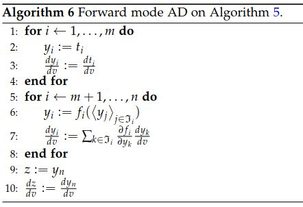
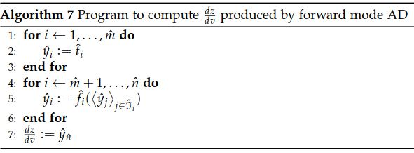
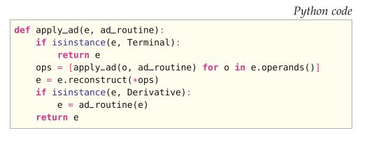

# II.实现》17.UFL：有限元形式语言》计算导数&算法(一)

<center>【<a href="">第17章前续</a> | <a href="#第十七章-ufl有限元形式语言">总目录</a>】</center>

## 17.7 计算导数

当由形式语言的终端用户声明任何种类的导数表达式时，都会构造一个表达式对象来表示它，但不会计算任何内容。 这种表达式对象的类型是Derivative的子类。在从导数表达式生成低级代码之前，必须应用某种求导数的算法，因为差分算符本身在C++等低级语言中不可用。 计算精确的导数很重要，它消除了差分除法的近似。 存在几种用于计算精确导数的替代算法。 所有相关算法都基于链规则，并结合每种表达式对象类型的规则差异。 算法之间的主要区别在于子表达式的重用程度以及子表达式的累积方式。

<!--more-->

将导数的计算混入每个形式编译器的代码生成策略中，这将导致实现工作的显著重复。 为了分离问题并保持代码的可管理性，微分作为UFL的一部分实现，以使形式编译器独立于UFL中所选择的微分策略。 因此，对已求值的导数表达式，使用与任何其他表达式相同的表示是有利的。 在形式编译器解释表达式之前，应先对差分算符进行求值，以使剩下的算符只能是非差分算符。 由于UFL不知道终端的空间导数，这是一个例外，因为它们是由形式编译器提供的。  

下面，讨论一些最简单的算法之间的异同。  在解释了当前在UFL中实现的算法之后，讨论了张量和索引记号以及高阶导数的扩展。 最后，本节以关于终端表达式的微分规则的一些注释收尾。

### 17.7.1 计算导数的方法

设计用于计算导数的算法时，要考虑到不同的最终目标。 符号微分（SD）将单个符号表达式作为输入，并为其求导生成新的符号表达式。 自动微分（AD）将用来计算一个函数的程序作为输入，并生成一个新程序以计算此函数的导数。 存在几种AD算法变体，最常见的两种是正向模式AD和反向模式AD（Griewank，1989）。 存在更高级的算法，并且是活跃的研究主题。 UFL表达式是一个符号表达式，由表达式树表示。 但是表达式树是有向无环图，表示用来对表达式求值的程序。 因此，在这种情况下，SD和AD之间的界限似乎变得不太明显。

单纯地应用，SD会产生巨大的表达式，这不但需要在计算过程中占用大量内存，而且如果直接编写代码则效率很低。 但是，一些符号微分效率低下的例证，如在Griewank（1989）中，是基于在一些独立的计算机代数系统（CAS）中计算导数的闭式表达式。 直接将大表达式的结果复制到计算机代码中可能会导致代码效率低下。  编译器可能无法检测到常见的子表达式，尤其是如果CAS中的化简和重写规则已更改了子表达式的结构并具有重用潜力时。

通常，AD是能够处理SD无法处理的算法。 将AD应用于通用源代码的工具必须处理许多复杂问题，例如子例程，全局变量，任意循环和分支（Bischof等，1992，2002； Giering和Kaminski，1998）。 由于UFL中对程序流结构的支持非常有限，因此UFL中的AD实施不会遇到这种麻烦。 在第17.7.2节中，将更详细地解释在UFL中SD和前向模式AD之间的相似性。

### 17.7.2 前向模式自动微分

回顾算法5，表示用于根据一组终端值$\{t_i\}$和一组基本算符$\{f_i\}$来计算表达式$z$的程序。 暂时假设$\{f_i\}$中没有微分算符。 然后可以扩展该算法以计算导数$\frac{dz}{dv}$，其中$v$表示任何类型的微分变量。 此扩展给出了算法6。

这种扩展程序以同时计算表达式$z$及其导数$\frac{dz}{dv}$的方式称为**前向模式自动微分**（AD）。 通过将$y_i$和$\frac{d y_i}{dv}$重命名得到新序列$\langle \hat{y}_j\rangle^{\hat{n}}_{j = 1}$的，如重写自算法6的算法7所示，该算法与算法5同构（它们具有完全相同的结构）。





由于算法5中的程序可以表示为DAG，而算法7与算法5同构，因此算法7中的程序也可以表示为DAG。 因此，计算$\frac{dz}{dv}$的程序可表示成由根据终端值和非微分算符构建的表达式树。

当前实现的用于计算UFL中的导数的算法紧密遵循正向模式AD。 由于结果是一个新的表达式树，因此该算法也可以称为符号微分。 在这方面，两者之间的区别在于实现细节。 为了确保我们可以正确地重用表达式，UFL中的化简规则避免了修改算符的操作数。 因此，形式编译器可以轻松检测表达式中自然重复的模式。 然后可以通过将子表达式放在哈希映射中来实现有效的通用子表达式消除。 但是，存在诸如`0∗f → 0`和`1∗f → f`之类的化简，称为**常数折叠**，这在构造差分算法时会自动简化其结果。 这些化简对于导数计算期间的存储器使用以及结果程序的性能至关重要。

### 17.7.3 张量和索引表达式的扩展

到目前为止，我们还没有考虑非标量表达式和带有自由索引表达式的导数。  此问题不会影响整体算法，但是会影响每种表达式类型的局部求导规则。

考虑带有A和B矩阵表达式的`diff(A, B)`表达式。 张量关于张量的导数的意思很容易通过索引记号来定义，此记号在微分规则中大量使用：

$$
\frac{dA}{dB}=\frac{d A_{ij}}{d B_{kl}} e_i \otimes e_j \otimes e_k \otimes e_l \tag{17.69}
$$

子表达式的导数经常是以被求值成字面常量。 对于索引表达式，重要的是，自由索引必须与导数一起正确传播。 因此，微分表达式有时会包含带有自由索引标记的字面常量。

当索引求和绑定索引$i$时，这是一个罕见而棘手的极端情况，比如 $(v_i v_i)$并且对其作关于$x_i$的求导尝试。 最简单的例子是表达式$(v_i v_i)_{,j}$，它具有一个自由索引$j$。 如果将$j$替换为$i$，则仍然可以很好地定义表达式，但是您永远不会手动编写$(v_i v_i)_{,i}$。 如果括号中的表达式定义为变量`e = v[i]*v[i]`，则表达式`e.dx(i)`看起来毫无问题。 但是，随着导数（包括索引$i$）传播到终端，这将引起问题。 如果在当前的UFL实现中遇到这种情况，将检测到该情况并触发错误消息。 要变通解决此问题，只需使用不同的索引实例。 在UFL的未来版本中，可以通过重新标记索引来将任何表达式 $(\sum_i e_i)_{,i}$更改为 $(\sum_j e_j)_{,i}$来处理这种情况。

### 17.7.4 高阶导数

简单的前向模式AD实现（例如算法6）仅考虑一个微分变量。 还必须支持使用微分变量的任何组合的高阶或嵌套微分算符。 一个简单的例子说明这样的表达式可以是

$$
a = \frac{d}{dx} \left(\frac{d}{dx} f (x) + 2\frac{d}{dy} g(x, y)\right) \tag{17.70}
$$

考虑泛函框架中嵌套导数的实现的探讨，可以浏览几篇论文（Karczmarczuk，2001； Pearlmutter和Siskind，2007； Siskind和Pearlmutter，2008）。

在当前的UFL实现中，已经用不同的方式解决了。 考虑方程（17.70），该方法只是首先计算最里面的导数$\frac{d}{dx} f (x)$和$\frac{d}{dy} g(x, y)$，然后计算外面的导数。 这种方法之所以可行，是因为与其他任何表达式一样，将求导计算的结果表示为表达式树。 之所以选择这种方法，是因为它易于实现且易于验证。 其他方法是否更快尚未进行调查。 此外，将来可以尝试使用可选的AD算法，例如反向模式，而无需担心在第一个实现中的嵌套导数。

外部控制器函数`apply_ad`可处理可能有嵌套导数的表达式的单变量AD例程。 这个AD例程是一个接受导数表达式节点并返回已计算的单变量导数表达式的函数。  该例程可以是算法7的实现。 `apply_ad`的结果在数学上与输入相等，但是没有剩余的导数表达式节点。

函数`apply_ad`的工作方式是：以后序遍历递归树，发现以导数根表示的子树，并将提供的AD例程应用于导数的子树。 由于`apply_ad`已访问导数节点的子节点，因此可以确保它们不含导数表达式节点，并且AD例程仅需要使用算法6和7处理上面讨论的情况。

`ad_routine`的复杂度应为$O(n)$，其中$n$为表达式树的大小。 导数表达式的大小与原始表达式成比例。 如果表达式树中有$d$个导数表达式节点，则此算法的复杂度为$O(dn)$，因为`ad_routine`要应用于子表达式$d$次。 最坏情况，`apply_ad`的复杂度为$O(n^2)$，但实际上$d \ll n$。 该算法的递归实现如图17.4所示。



<center>图17.4 apply_ad过程的简单递归实现。</center>

### 17.7.5 基本微分规则

要实现上述算法描述，我们必须为所有表达式节点类型实现微分规则。 算符的导数可以实现为与微分变量无关的通用规则，此乃众所周知，不再赘述。 终端表达式的导数取决于微分变量类型。 字面常量的导数当然总是为零，并且只有几何量的空间导数为非零。 由于UFL不知道形式参数（它们由形式编译器从外部提供），因此它们的空间导数( $\frac{\partial \phi^k}{\partial x_i}$ 和 $\frac{\partial w^k}{\partial x_i}$ ) 也被视为输入参数。 在所有导数计算中，均假设形式系数不依赖于微分变量。 还有另外两种情况需要解释，用户定义变量和关于Coefficient的系数的导数。

如果$v$是一个Variable，那么我们可为任意终端表达式t定义$\frac{dv}{dt} \equiv 0$。 如果$v$为标量值，则$\frac{dv}{dv}\equiv 1$。  此外，如果$V$是张量值Variable，那么它关于自身的导数就是 

$$
\frac{dV}{dV}=\frac{d V_{ij}}{d V_{kl}} e_i \otimes e_j \otimes e_k \otimes e_l = \delta_{ik}\delta_{jl}e_i \otimes e_j \otimes e_k \otimes e_l \tag{17.71}
$$

另外，变量关于除了自身的其它量的导数，等于其表示的表达式的导数：

$$
v = g \tag{17.72}
$$

$$
\frac{dv}{dz}= \frac{dg}{dz} \tag{17.73}
$$

最后，我们考虑算符导数，它表示关于函数$w$的所有系数$\{w_k\}$的微分。  考虑一个对象单元，它表示一个以$\{\phi_k\}$为基底的有限元空间$V_h$。 接下来考虑在此空间中定义的形式参数：

```python
# UFL code
# v = Argument(element) # 在较新版本中报错
v = Argument(element, 1)
w = Coefficient(element)
```

Argument实例$v$表示任何$v\in \{\phi_k\}$，而Coefficient实例$w$代表求和

$$
w = \sum_k w_k \phi_k(x) \tag{17.74}
$$

$w$关于任意$w_k$的导数是$V_h$中对应的基函数，

$$
\frac{\partial w}{\partial w_k}= \phi_k, \qquad k = 1, \dots , |V_h| \tag{17.75}
$$

可以用v表示，因为

$$
v \in \langle \phi_k\rangle^{|V_h|}_{k=1} = \left\langle \frac{\partial w}{w_k}\right\rangle^{|V_h|}_{k=1} \tag{17.76}
$$

请注意，$v$应该是尚未在形式中使用的基函数实例。

## 17.8 算法

在本节中，将讨论一些核心算法和关键实现问题，其中大部分与Python编程语言有关。 因此，本节主要面向开发人员以及需要在技术层面上与UFL相关的其他人员。 Python用户可能还会在这里发现一些有趣的技术。

### 17.8.1 Python中的有效树遍历

使用递归很自然地表示对树中所有节点执行一些操作：

```python
# Python code
def walk(expression, pre_action, post_action):
    pre_action(expression)
    for o in expression.operands():
        walk(o)
    post_action(expression)
```

此实现同时涵盖顺序遍历和后顺序遍历，在顺序遍历中每个节点在其子节点之前被访问，在后顺序遍历中每个节点在其子节点之后被访问。

在节点集合上实现迭代的一种更“pythonic”的方法是使用生成器。 最小的实现可能是

```python
# Python code
def post_traversal(root):
    for o in root.operands():
        yield post_traversal(o)
    yield root
```

然后启用自然的Python语法在表达式节点上进行迭代：

```python
# Python code
for e in post_traversal(expression):
    post_action(e)
```

为了提高效率，UFL中`post_traversal`的实际实现并未使用递归。 函数调用在Python中非常昂贵，这使得非递归实现比上面的实现快一个数量级。

### 17.8.2 Python中基于类型的函数分派

符号计算和编译器实现中的常见任务是基于表达式节点类型来选择某些操作。 对于选定的少数几个操作，这是通过使用Expr子类中的函数重载来完成的，但这并不适合所有操作。  在许多情况下，特定类型的操作可以在算法中更好地实现，而不是分布在类定义中。 这种实现模式称为“访问者”模式（Gamma等，1995）。 UFL中的实现与静态类型语言（例如C++）中使用的模式有所不同。

实现基于类型操作选择的一种方法是使用类型开关，它是一系列`if-tests`，如下所示：

```python
# Python code
def operation(expression):
    if isinstance(expression, IntValue):
        return int_operation(expression)
    elif isinstance(expression, Sum):
        return sum_operation(expression)
    # etc.
```

这种方法存在几个问题，其中一个是要检查的类型很多时的效率问题。 通过`MultiFunction`类可以实现一种效率与类型数无关的基于类型的函数分派机制。 底层机制是根据输入参数的类型进行字典查找（为O(1)），然后调用字典中的查找函数。 查找表仅在`MultiFunction`构造函数中构建一次。 使用Python的运行时类型检查功能会自动发现要插入表中的函数。

多重函数声明为`MultiFunction`的子类。 对于应该特别处理的每种类型，在子类中声明一个成员函数。 Expr类使用`CamelCaps`命名约定，该约定会自动将对应函数名称转换成`underscore_notation`（例如`IndexSum`和`index_sum`）。 如果没有为类型声明处理函数，则使用最接近的超类处理函数。 注意，`MultiFunction`实现专用于`Expr`类层次结构中的类型。 以下示例代码说明了多重函数的声明和使用：

```python
# Python code

from ufl.corealg.multifunction import MultiFunction # 译者添加

class ExampleFunction(MultiFunction):
    def __init__(self):
        MultiFunction.__init__(self)

    def terminal(self, expression):
        return "Got a Terminal subtype %s." % type(expression)

    def operator(self, expression):
        return "Got an Operator subtype %s." % type(expression)

    def argument(self, expression):
        return "Got an Argument."

    def sum(self, expression):
        return "Got a Sum."

m = ExampleFunction()

cell = triangle
# x = cell.x
x = SpatialCoordinate(cell)
element = FiniteElement("Lagrange", cell, 1)
# print(m(Argument(element)))
print(m(Argument(element,1)))
print(m(x))
print(m(x[0] + x[1]))
print(m(x[0] * x[1]))
```

注意，`argument`和`sum`将处理得到确切类型`Argument`和`Sum`的实例，而终端表达式和算符将处理类型`SpatialCoordinate`和`Product`，因为它们没有特定的处理程序。

### 17.8.3 表达式变换的实现

表达式的许多变换可以通过递归实现将某种特定类型的操作应用到每个表达式节点。 操作示例包括将表达式节点转换为字符串表示，使用符号外部库表达式的表示或具有某些不同属性的UFL表示。 此模式的一个简单变体可以使用多重函数来实现，来表示特定类型的操作：

```python
# Python code
def apply(e, multifunction):
    ops = [apply(o, multifunction) for o in e.operands()]
    return multifunction(e, *ops)
```

基本思想如下。 给定一个表达式节点e，首先将变换应用于每个子节点。 然后使用已变换过的子节点作为输入，根据e的类型返回一些特定的运算结果。

`Transformer`类实现了此模式。 使用这种模式定义一个新算法涉及到声明一个`Transformer`子类，并将特定类型的操作实现为此类的成员函数，就像使用`MultiFunction`一样。 区别在于成员函数对表达式节点的每个操作数都接受一个附加参数。 提供变换后的子节点作为这些附加参数。 以下代码将终端对象替换为在词典映射中找到的对象，并使用变换后的表达式树的`reconstructs`算符。 通过调用以类Visitor模式命名的visit函数将算法应用于表达式。

```python
# Python code

from ufl.algorithms import Transformer # 译者添加

class Replacer(Transformer):
    def __init__(self, mapping):
        Transformer.__init__(self)
        self.mapping = mapping

    def operator(self, e, *ops):
        return e.reconstruct(*ops)

    def terminal(self, e):
        return self.mapping.get(e, e)

f = Constant(triangle)
r = Replacer({f: f**2})
g = r.visit(2*f)  # 报错，我尚未找到原因
```

运行此代码后，结果为$g = 2f^2$。 `replace`函数的实际实现与此代码相似。

在某些情况下，不应在子节点的父节点之前访问子节点。 使用`Transformer`可以轻松表达这种区别，只需为变换后的操作数省略成员函数参数即可。 有关使用此模式的算法的许多示例，请参见源代码。

<center>【<a href="">第17章后续</a>】</center>
