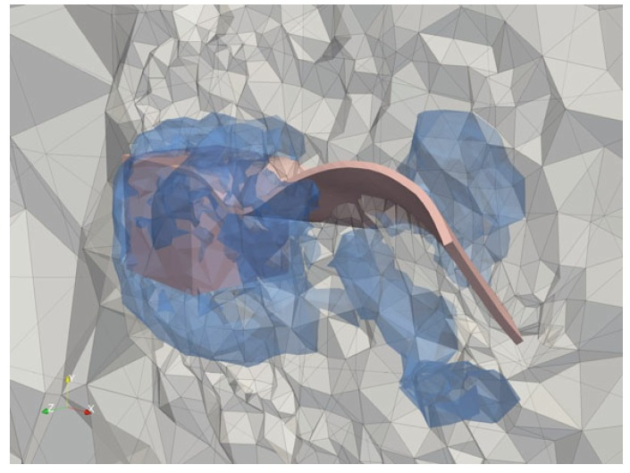
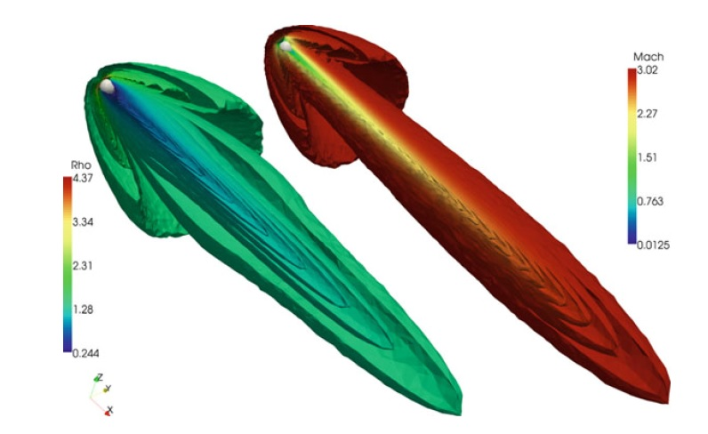
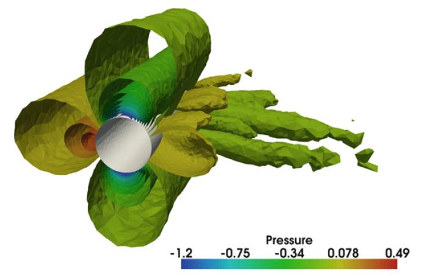
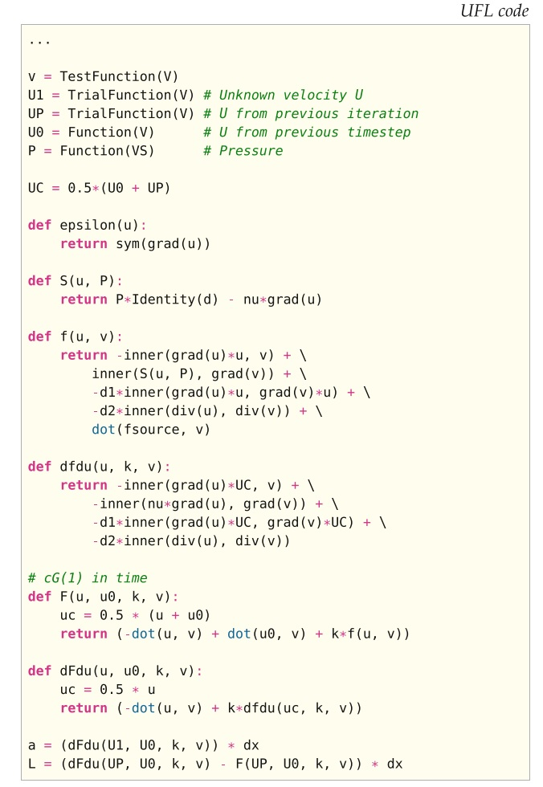
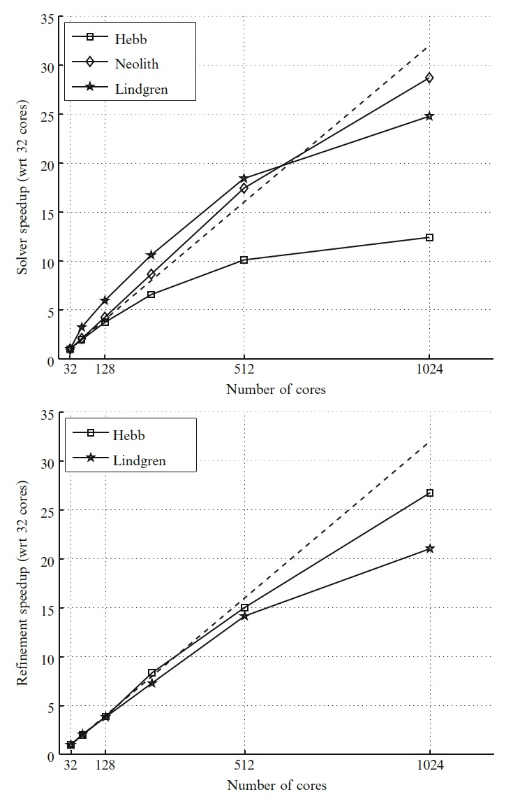
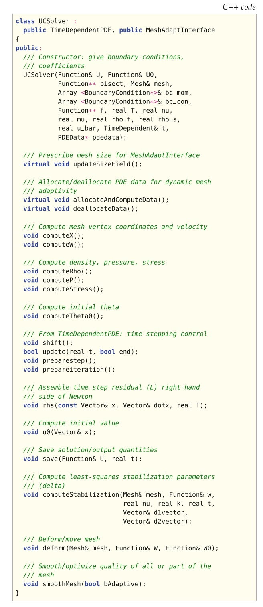
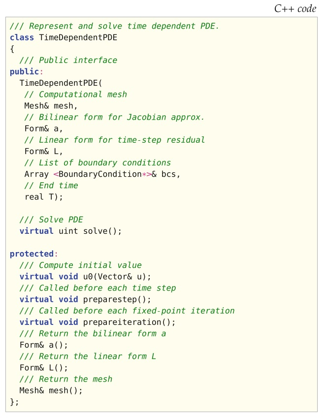

# II.实现》18.Unicorn：统一的连续介质力学求解器（上）

【<a href="#第十八章-unicorn统一的连续介质力学求解器">总目录</a>】

本章介绍了Unicorn技术，重点介绍了用于统一连续介质（UC）概念和自适应通用Galerkin（G2）离散化的简单，高效和通用算法和软件，将其作为统一的连续介质力学方法。 我们将介绍Unicorn如何适应FEniCS框架，如何为其他FEniCS组件提供接口，Unicorn提供了哪些接口和功能以及如何设计实现的。 我们还将介绍一些使用Unicorn计算的流固耦合（fluid–structure interaction）和适应性的例子。

<!--more-->

## 18.1 背景

Unicorn是一种求解器技术（模型，方法，算法和软件），其目标是自动模拟现实的连续介质力学应用，例如在湍流不可压缩或可压缩流中的固定或柔性物体（流固耦合）的阻力或升力计算。 参见图18.1。 Unicorn的基础是：    在Euler坐标（实验室坐标）中表述的统一连续介质（UC）建模（Hoffman等人，2011），以及带有用于跟踪相界面的移动网格的G2（一般Galerkin）自适应稳定有限元离散化技术。 UC模型由全域中作为连续介质的质量，动量，能量和相位的典型守恒方程组成，以及以柯西应力和相位变量作为定义材料特性和本构方程的数据。 Unicorn制定并实现了适用于UC模型的自适应G2方法，并为FEniCS工具链中的其他组件（FIAT，FFC，DOLFIN）提供接口，从而提供了有限元函数空间，弱形式和网格以及自动并行组装和线性代数的算法的表示 。

图18.1 流固耦合问题，包括在湍流中安置在立方体后面的标志。 该图显示了流固界面，压力的等值面和网格的切面。

Unicorn软件分为三个部分：

**库**   Unicorn库提供了通用的求解器技术，例如自动时间步长，误差估计，适应性，网格平滑和滑动/摩擦边界条件。

**求解器**    Unicorn求解器通过制定相关弱形式来实现UC模型的G2自适应离散化方法。 当前有两种主要的求解器：不可压缩的流体和固体（包括流固耦合）和可压缩的欧拉流体。  长期目标是统一不可压缩和可压缩的陈述。

**应用**    与求解器关联的是诸如具有特定几何形状，系数和参数的计算实验和基准之类的应用。 这些表示为构建在Unicorn求解器/库之上的独立程序，可以串行或并行运行（当前仅限于不可压缩的流）。

## 18.2 统一的连续介质建模

根据经典的连续介质力学（Gurtin，1981），我们在固定的欧拉坐标系中定义了一个统一的连续介质模型，该模型包括：

- 质量守恒，
- 动量守恒,
- 能量守恒,
- 相对流方程（phase convection equation）,
- 作为数据的应力本构方程，

其中应力是柯西应力（实验室应力），相位是指示函数，用于确定要使用的本构方程和材料参数。 请注意，在此连续介质描述中，将坐标系固定（欧拉），相位函数（指示器）根据相位对流方程来对流的。 在固相的情况下，网格以连续速度移动，以消除相界面的扩散。 我们将在以下第18.3.2节中对此进行详细阐述。

我们定义了该模型的两个变体，即不可压缩和可压缩，未来的目标是构造统一的不可压缩/可压缩模型和求解器。 在这里，我们将介绍重点放在不可压缩模型上。  

我们从一个用于质量和动量守恒的模型开始，在时空域$Q = \Omega \times [0, T]$上具有相函数$\theta$的对流方程，其中$\Omega$是$\mathbb{R}^3$中有边界$\Gamma$的开域：

$$
\frac{\partial \rho}{\partial t} + \frac{\partial}{\partial x_j}(u_j ρ) = 0,\qquad \text{(质量守恒)} \tag{18.1}
$$

$$
\frac{\partial m_i}{\partial t} + \frac{\partial}{\partial x_j}(u_j m_i) =\frac{\partial}{\partial x_j} \sigma_{ij} + f_i, \qquad \text{(动量守恒)} \tag{18.2}
$$

$$
\frac{\partial \theta}{\partial t}+\frac{\partial}{\partial x_j}(u_j \theta) = 0,\qquad\text{(相对流方程)} \tag{18.3}
$$

连同初始条件和边界条件，其中$\rho$是密度，$m_i =\rho u_i$是动量，$u_i$是速度。 如果我们假设连续介质是不可压缩的； 也就是$0 = D_t\rho = \frac{\partial}{\partial t} \rho + u_j \frac{\partial}{\partial x_j} \rho$，因此我们可以将不可压缩的UC方程表示为

$$
\rho \left(\frac{\partial u_i}{\partial t}+ u_j \frac{\partial u_i}{\partial x_j} \right) = \frac{\partial}{\partial x_j} \sigma_{ij} + f_i \tag{18.4)}
$$

$$
\frac{\partial u_j}{\partial x_j}= 0 \tag{18.5}
$$

$$
\frac{\partial \theta}{\partial t}+ u_j \frac{\partial \theta}{\partial x_j}= 0 \tag{18.6}
$$

我们注意到，要对流固耦合问题建模，我们可以简单地将总应力$\sigma$编写为使用$\theta$相函数的流体和固体应力的线性组合：$\sigma = \theta\sigma^f + (1 − \theta)\sigma^s$。  我们还可以将应力分解为压力$p\delta_{ij}$及其偏离部分：$\sigma_{ij} = \sigma_{ij}^D − p\delta{ij}$。

UC建模框架简单而紧凑，接近原始守恒方程的公式，并且不需要在不同坐标系之间进行映射。 这允许简单的操作并处理误差估计和实现。  

UC建模的一个关键设计选择是将柯西应力σ定义为数据，这意味着无论本构方程如何选择，守恒方程都将是固定的。 这提供了方法和软件设计的一般性，其中对本构方程的修改会影响本构方程的表述和实现，但不会影响守恒方程的表述和实现。

在Unicorn中，我们目前已实施了两个本构定律，有关详细信息请参见Hoffman等（2011）：

$$
\sigma^f_{ij} = 2\mu_f \epsilon(u)_{ij} \qquad \text{(牛顿流体)} \tag{18.7}
$$

$$
\frac{\partial \sigma^s_{ij}}{\partial t}= 2\mu_s\epsilon(u)_{ij} +\frac{\partial u_i}{\partial x_k} \sigma^s_{kj} + \sigma^s_{ik}\frac{\partial u_k}{\partial x_j}\ \text{\scriptsize (不可压缩新胡克型固体)} \tag{18.8}
$$

## 18.3 时空的一般Galerkin离散化

自适应G2方法（也称为自适应DNS / LES）已用于许多湍流计算中，但计算成本却非常低（Hoffman，2005； Hoffman和Johnson，2006； Hoffman，2006； Hoffman和Johnson，2007； Hoffman和Johnson，2007； Hoffman和Johnson，2007； Hoffman，2009年； Hoffman和Jansson，2009年； de Abreu等人，2010年），其中在输出量（例如阻力，升力和压力系数和Strouhal数）上获得了收敛，并且使用的网格点数比基于临时细化计算网格的标准LES方法少了几个数量级。

### 18.3.1 标准Galerkin

我们首先用标准的 cG(1)cG(1) FEM（Eriksson等人，1996）公式表示（18.9）在时间和空间上连续分段线性解。 我们让$w = (u, p, \theta)$表示精确解，$W = (U, P, \Theta)$是离散解，$v = (v^u, v^p, v^\theta)$是测试函数，$R(W) = (R_u(W), R_p(W), R_\theta(W))$是残差。 这个残差定义为

$$
\begin{aligned}R_u(W) &= \rho \left(\frac{\partial U_i}{\partial t}+ U_j \frac{\partial U_i}{\partial x_j} \right)−\frac{\partial}{\partial x_j}\left(\Sigma^D_{ij} − P\delta_{ij}\right) − f_i \\ R_p(W) &=\frac{\partial U_j}{\partial x_j} \\ R_\theta (W) &=\frac{\partial \Theta}{\partial t} + U_j \frac{\partial \Theta}{\partial x_j}\end{aligned}\tag{18.9}
$$

其中$\Sigma$表示离散的分段常应力。

为了计算解，我们强制执行Galerkin正交性

$$
\langle R(W), v\rangle = 0 \tag{18.10}
$$

对于测试空间$\hat{V}_{hk}$中的所有函数$v$，包括空间中的分段线性连续函数和时间上的分段常值不连续函数组成。 这里，$\langle\cdot, \cdot\rangle$表示时空中的$L^2$-内积。

对于对流占优问题，这种标准有限元表述是不稳定的，并且也源于压力和速度的等阶单元的不稳定结果。 因此，如下所述，我们增加了流线扩散（streamline–diffusion）稳定性。

在时间上具有梯形求积的cG(1)cG(1)的表述等效于空间中具有分段线性单元的Crank–Nicolson时间步长。 这具有成为非常简单，标准且熟悉的离散表述的优点。

### 18.3.2 局域ALE

如果相函数$\Theta$在同一胞元上具有不同的值，则将导致相界面的不良扩散。 通过引入移动的时空有限元空间和网格，它们沿着相界面对流的特性方向（Eriksson等，1996，有关“特征Galerkin方法”的部分），我们可以定义胞元维面的相界面，使界面保持不连续。

因此，我们在每个时空块上定义局部ALE坐标映射作为离散化的一部分，用于引入网格速度。 请注意，我们仍然使用全局Euler坐标进行计算，但是使用了移动的网格。

为了能够定义和补偿任意网格速度$\beta_h$，我们在每个时空块上定义一个局部坐标映射$\phi$：

$$
\begin{aligned}\frac{\partial}{\partial t} \phi(\bar{x}, t) &= \beta_h(\bar{x}, t) \\ (x, t) &= \phi(\bar{x}, t) \end{aligned}\tag{18.11}
$$

应用链式法则给出了关系

$$
\scriptsize \frac{\partial}{\partial t} U(x, t) + U(x, t) \cdot \nabla U(x, t) =\frac{\partial}{\partial t} \bar{U}(\bar{x}, t) + (\bar{U}(\bar{x}, t) − \beta_h)) \cdot \nabla \bar{U}(\bar{x}, t)\tag{18.12}
$$

在网格的固体部分中选择$\beta_h= U$可得出相对流方程的平凡解，我们可以将其从系统中删除。 然后，最后的离散UC方程是通过残差定义的

$$
\begin{aligned}R_u(W) &= \rho \left(\frac{\partial U_i}{\partial t}+ (U_j − β^h_j)\frac{\partial U_i}{\partial x_j} \right)−\frac{\partial}{\partial x_j}(\Sigma^D_{ij} − P\delta_{ij}) − f_i \\ R_p(W) &=\frac{\partial U_j}{\partial x_j}\end{aligned}\tag{18.13}
$$

因此，我们选择网格速度$\beta_h$作为网格的结构部分（接触结构胞元的顶点）中的离散材料速度$U$，在网格的其余部分中，我们使用网格平滑来确定βh最大化网格质量。 或者，可以在网格上使用局部网格修改操作（细化，粗化，交换）以保持质量（Compère等，2009）。

### 18.3.3 加权最小二乘稳定化

标准FEM表述是不稳定的。 因此，我们考虑形式$\langle R(W), v + \delta R(v)\rangle = 0,\ \forall v\in\hat{V}_{hk}$的加权标准最小二乘法（请参阅Eriksson等人（1996）； Hoffman和Johnson（2007）），其中$\delta \gt 0$是稳定化参数。 我们通过降低稳定化项，包括时间导数和$\Sigma^D$，来使之简化。 虽然不完全一致，但这样避免了剪切层不必要的拖尾效应。 因此，对于UC模型，稳定化方法采用以下形式：

$$
\begin{aligned}\left\langle R^u(W), v^u\right\rangle &= \left\langle \rho\left(\frac{\partial U_i}{\partial t}+ U_j\frac{\partial U_i}{\partial x_j}\right) − f_i\ ,\ v_i^u\right\rangle + \\ & \qquad \qquad \left\langle \Sigma^D_{ij} − P\delta_{ij}\ ,\ \frac{\partial}{\partial x_j} v^u_i\right\rangle + S D^u(W, v^u) = 0\end{aligned} \tag{18.14}
$$

$$
\left\langle R^p(W)\ ,\ v^p\right\rangle = \left\langle\frac{\partial U_j}{\partial x_j}\ ,\ v^p\right\rangle + S D^p(W, v^p) = 0 \tag{18.15}
$$

对所有$v \in \hat{V}_{hk}$，其中

$$
\begin{aligned}S D^u(W, v^u) &= \delta_1\left\langle U_j\frac{\partial U_i}{\partial x_j}+\frac{\partial P\delta_{ij}}{\partial x_i}\ ,\ U_j\frac{\partial v_i^u}{\partial x_j}\right\rangle \\ &\qquad\qquad + \delta_2\left\langle\frac{\partial U_j}{\partial x_j}\ ,\ \frac{\partial v^u_j}{\partial x_j}\right\rangle\end{aligned} \tag{18.16}
$$

$$
S D^p(W, v^p) = \delta_1\left\langle\frac{\partial P\delta_{ij}}{\partial x_i}+ U_j \frac{\partial U_i}{\partial x_j}\ ,\ \frac{\partial v^p}{\partial x_i}\right\rangle \tag{18.17}
$$

## 18.4 实现

在这里，我们概述了Unicorn的设计。 Unicorn求解器类`UCSolver`将Unicorn库中的技术与FEniCS的其他部分结合，合在一起公开一个接口（请参见清单18.6），以模拟连续介质力学中的应用。 求解器实现的主要部分是UC模型的G2离散化的弱形式（请参见图18.4），以及用于误差估计的应力和残差的形式。 来自应用程序的系数被连接到形式，然后由`TimeDependentPDE`类执行时间步进。 某些系数，例如$\delta$稳定化系数，也作为求解器的一部分（而不是作为形式）来进行计算。 求解器计算自适应算法的一次迭代（主求解，对偶求解和网格划分），其中，自适应循环是通过迭代运行一系列网格的求解器来实现的。

对于使用MPI的分布式内存体系结构，UCSolver已经实现并行化，我们可以在多个平台上展示数百个内核的强大扩展能力（见图18.5）。 整个自适应算法是并行的，包括Rivara网格修正和先验预测负载平衡。 Unicorn可以有效地模拟不可压缩的湍流的大规模并行应用（Jansson等，2010； Jansson，2011）。 图18.3给出了并行自适应圆柱体仿真的示例。

`UCSolver`的一个可压缩变体`CNSSolver`，用于适应G2的可压缩Euler流。 除了不可压缩性之外，更一般方法和算法与`UCSolver`的方法和算法非常接近。 长期目标是统一不可压缩/可压缩的表述。 关于可压缩`CNSSolver`的实现细节，请参阅Nazarov（2009）。  有关球体周围可压缩流的示例图，请参见图18.2。

图18.2 围绕球体的3维可压缩流的自适应计算的示例应用。

图18.3 具有并行自适应计算的圆柱体周围3维不可压缩湍流的示例应用。

图18.4 用于求解不可压缩的UC模型的牛顿迭代（近似雅可比）的双线性和线性形式的源代码。

图18.5 在几种不同的体系结构上，网格细化和整个求解器具有强大的伸缩结果：Lindgren（Cray XT6m），Hebb（BlueGene / L）和Neolith（带有InfiniBand的常规Linux群集）。 虚线表示理想的加速。

图18.6 Unicorn的类UCSolver的C++类接口。

### 18.4.1 Unicorn类/接口

以下类/接口中提供了关键概念的抽象：

**TimeDependentPDE**:   时间步进

在每个时间步中，非线性代数系统都通过不动点迭代来求解。

**ErrorEstimate**:   自适应误差控制

适应性是基于计算形式$\eta_K = \|hR(U)\|_T\|DZ\|_T$的局部误差指标，其中$Z$是所谓的对偶解。

**SpaceTimeFunction**:   时空系数

时空函数/系数的存储和求值。

**SlipBC**:   摩擦边界条件

Unicorn中湍流的有效计算是基于通过摩擦模型对湍流边界层进行建模的，其中滑移边界条件$u \cdot n = 0$作为代数系统的一部分而得到了强有力的实现。

**ElasticSmoother**:   弹性网格平滑/优化

根据弹性类比的胞元质量优化。

**MeshAdaptInterface**:   网格自适应接口

使用本地网格操作对MAdLib软件包的接口进行抽象以进行网格自适应。

### 18.4.2 TimeDependentPDE

我们考虑比如$\frac{\partial}{\partial t} u + A(u) = 0$的一般时间依赖方程，其中$A$表示空间中可能的非线性微分算符。 我们想定义一个类（数据结构和算法）来抽象G2方法的时间步进。 该方程作为输入给出，时间步进应自动生成。 我们对于cG(1)cG(1)方法通过应用简化的牛顿法做到这一点。 它封装在图18.7的C++类接口中，称为`TimeDependentPDE`。

图18.7 TimeDependentPDE的C++类接口。

清单18.8实现了带不动点迭代的时间步进骨架。

我们使用块对角准牛顿法，从公式完整的牛顿法开始，然后将各项从对角块中删除。 我们还使用本构定律作为恒等式来表示$U$各项中的$\Sigma$，与通过在$\Sigma$和$U$之间进行迭代相比，可以允许更大的时间步长。 参见Jansson（2009）；Hoffman等（2011年）了解更多详细信息，并讨论了不动点迭代及其实现的效率。

【第18章未完待续】

