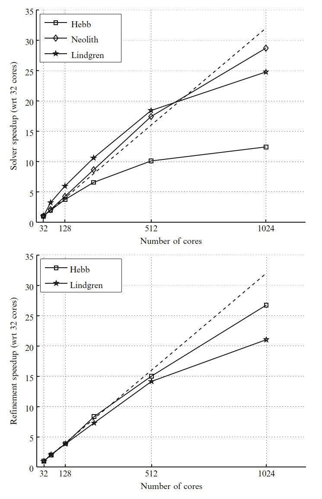
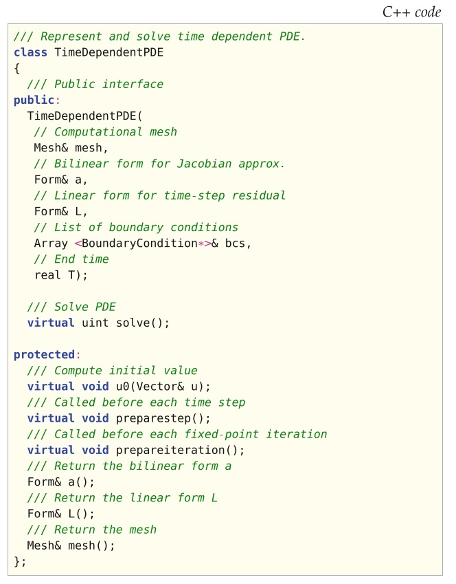

# II.实现》18.Unicorn：统一的连续介质力学求解器（中）

【<a href="">第18章前续</a> | <a href="#第十八章-unicorn统一的连续介质力学求解器">总目录</a>】

## 18·4 实现

在这里，我们概述了Unicorn的设计。 Unicorn求解器类`UCSolver`将Unicorn库中的技术与FEniCS的其他部分结合，合在一起公开一个接口（请参见清单18.6），以模拟连续介质力学中的应用。 求解器实现的主要部分是UC模型的G2离散化的弱形式（请参见图18.4），以及用于误差估计的应力和残差的形式。 来自应用程序的系数被连接到形式，然后由`TimeDependentPDE`类执行时间步进。 某些系数，例如$\delta$稳定化系数，也作为求解器的一部分（而不是作为形式）来进行计算。 求解器计算自适应算法的一次迭代（主求解，对偶求解和网格划分），其中，自适应循环是通过迭代运行一系列网格的求解器来实现的。

<!--more-->

对于使用MPI的分布式内存体系结构，UCSolver已经实现并行化，我们可以在多个平台上展示数百个内核的强大扩展能力（见图18.5）。 整个自适应算法是并行的，包括Rivara网格修正和先验预测负载平衡。 Unicorn可以有效地模拟不可压缩的湍流的大规模并行应用（Jansson等，2010； Jansson，2011）。 图18.3给出了并行自适应圆柱体仿真的示例。

`UCSolver`的一个可压缩变体`CNSSolver`，用于适应G2的可压缩Euler流。 除了不可压缩性之外，更一般方法和算法与`UCSolver`的方法和算法非常接近。 长期目标是统一不可压缩/可压缩的表述。 关于可压缩`CNSSolver`的实现细节，请参阅Nazarov（2009）。  有关球体周围可压缩流的示例图，请参见图18.2。

图18.2 围绕球体的3维可压缩流的自适应计算的示例应用。

图18.3 具有并行自适应计算的圆柱体周围3维不可压缩湍流的示例应用。

图18.4 用于求解不可压缩的UC模型的牛顿迭代（近似雅可比）的双线性和线性形式的源代码。

图18.5 在几种不同的体系结构上，网格细化和整个求解器具有强大的伸缩结果：Lindgren（Cray XT6m），Hebb（BlueGene / L）和Neolith（带有InfiniBand的常规Linux群集）。 虚线表示理想的加速。

图18.6 Unicorn的类UCSolver的C++类接口。

### 18·4·1 Unicorn类／接口

以下类/接口中提供了关键概念的抽象：

**TimeDependentPDE**:   时间步进

在每个时间步中，非线性代数系统都通过不动点迭代来求解。

**ErrorEstimate**:   自适应误差控制

适应性是基于计算形式$\eta_K = \|hR(U)\|_T\|DZ\|_T$的局部误差指标，其中$Z$是所谓的对偶解。

**SpaceTimeFunction**:   时空系数

时空函数/系数的存储和求值。

**SlipBC**:   摩擦边界条件

Unicorn中湍流的有效计算是基于通过摩擦模型对湍流边界层进行建模的，其中滑移边界条件$u \cdot n = 0$作为代数系统的一部分而得到了强有力的实现。

**ElasticSmoother**:   弹性网格平滑/优化

根据弹性类比的胞元质量优化。

**MeshAdaptInterface**:   网格自适应接口

使用本地网格操作对MAdLib软件包的接口进行抽象以进行网格自适应。

### 18·4·2 TimeDependentPDE

我们考虑比如$\frac{\partial}{\partial t} u + A(u) = 0$的一般时间依赖方程，其中$A$表示空间中可能的非线性微分算符。 我们想定义一个类（数据结构和算法）来抽象G2方法的时间步进。 该方程作为输入给出，时间步进应自动生成。 我们对于cG(1)cG(1)方法通过应用简化的牛顿法做到这一点。 它封装在图18.7的C++类接口中，称为`TimeDependentPDE`。

图18.7 TimeDependentPDE的C++类接口。

清单18.8实现了带不动点迭代的时间步进骨架。

我们使用块对角准牛顿法，从公式完整的牛顿法开始，然后将各项从对角块中删除。 我们还使用本构定律作为恒等式来表示$U$各项中的$\Sigma$，与通过在$\Sigma$和$U$之间进行迭代相比，可以允许更大的时间步长。 参见Jansson（2009）；Hoffman等（2011年）了解更多详细信息，并讨论了不动点迭代及其实现的效率。

### 18·4·3 ErrorEstimate

基于对偶的自适应误差控制算法需要以下组件：

**残差计算**  我们通过分段常数空间中的$L^2$-投影，计算残差$R(U)$在每个胞元中的平均值。

**对偶解**  我们使用与原始问题相同的技术来计算对偶问题的解。 对偶问题虽然在时间上是向后求解的，但通过时间坐标变换$s = T − t$，我们可以使用标准的`TimeDependentPDE`接口。

**时空函数存储/求值**   我们在计算对偶问题的同时计算误差指标，作为对胞元的时空积分：$\eta_T=\left\langle R(U)\ ,\ \frac{\partial}{\partial x}Z\right\rangle$，在这里我们需要对原始解$U$和对偶解$Z$进行求值。 $U$是对偶方程的系数。  这需要存储并对时空函数求值，该函数封装在`SpaceTimeFunction`类中。

**自适应网格**  计算误差指标后，我们选择指标最大的$p\%$进行细化。 然后通过递归Rivara胞元二等分法进行优化。Alternatively, one may use MAdLib (Compère et al., 2009) for more general mesh adaptation based on edge split, collapse and swap operations. 

Using these components, we can construct an adaptive algorithm. The adaptive algorithm is encapsulated in the C++ class interface in Figure 18.9 which we call ErrorEstimate.

图18.9 C++ class interface for ErrorEstimate.

### 18·4·4 SpaceTimeFunction

The error estimation algorithm requires, as part of solving the dual problem, the evaluation of space-time coefficients appearing in the definition of the dual problem. In particular, we must evaluate the primal solution U at time s = T − t. This requires storage and evaluation of a space-time function, which is encapsulated in the SpaceTimeFunction class (see listing 18.10).

图18.10 C++ class interface for SpaceTimeFunction.

The space-time functionality is implemented as a list of space functions at regular sample times, where evaluation is piecewise linear interpolation in time of the degrees of freedom.

### 18·4·5 SlipBC

For high Reynolds number problems such as car aerodynamics or airplane flight, it is not possible to resolve the turbulent boundary layer. One possibility is then to model turbulent boundary layers by a friction model:

u · n = 0, (18.18)
βu · τk + (σn) · τk = 0, k = 1, 2. (18.19)

We implement the normal component condition (slip) boundary condition strongly. By “strongly” we here mean an implementation of the boundary condition after assembling the left-hand side matrix and the right-hand side vector in the algebraic system, whereas the tangential components (friction) are implemented “weakly” by adding boundary integrals in the variational formulation. The row of the matrix and load vector corresponding to a degree of freedom is found and replaced by a new row according to the boundary condition.

The idea is as follows: Initially, the test function v is expressed in the Cartesian standard basis (e1, e2, e3). Now, the test function is mapped locally to normal-tangent coordinates with the basis (n, τ1, τ2), where n = (n1, n2, n3) is the normal, and τ1 = (τ11, τ12, τ13), τ2 = (τ21, τ22, τ23) are tangents to each node on the boundary. This allows us to let the normal direction be constrained and the tangent directions be free:

v = (v · n)n + (v · τ1)τ1 + (v · τ2)τ2. (18.20)

For the matrix and vector this means that the rows corresponding to the boundary need to be multiplied with n, τ1, τ2, respectively, and then the normal component of the velocity should be set to zero.

This concept is encapsulated in the class SlipBCwhich is a subclass of dolfin::BoundaryCondition for representing strong boundary conditions. For more details about the implementation of slip boundary conditions, we refer to Nazarov (2011).

### 18·4·6 ElasticSmoother

To maintain a discontinuous phase interface in the UC model, we define the mesh velocity βh as the discrete velocity U in the solid phase (specifically on the interface). The mesh velocity in the fluid can be chosen more arbitrarily, but has to satisfy mesh quality and size criteria. We construct a cell quality optimization/smoothing method based on a pure elastic variant of the UC (see the form in Figure 18.11). We define the following requirements for the mesh velocity βh:

1. βh = U in the solid phase part of the mesh.

2. Bounded mesh quality Q defined by

Q =

dF2F
det(F)d2

,

where d is the spatial dimension, in the fluid part of the mesh. Preferably the mesh smoothing should improve Q if possible.

3. Maintain mesh size h(x) close to a desired hˆ(x) given by a posteriori error estimation in an adaptive algorithm.

图18.11 Source code for the form representing one time step for the deformation gradient (F) evolution in the elastic smoother variant of the UC model.

Mesh smoothing is handled in Unicorn by an elastic model using the constitutive law σ = μ(I − (FF⊤)−1) where we recall F as the deformation gradient. We use the update law: ∂∂t F−1 = −F−1∇u where we thus need an initial condition for F. We set the initial condition F0 = F¯ where F¯ is the deformation gradient with regard to a scaled equilateral reference cell, representing the optimal shape with quality Q = 1.

Solving the elastic model can thus be seen as optimizing for the highest global quality Q in the mesh. We also introduce a weight on the Young’s modulus μ for cells with low quality, penalizing high average, but low local quality over mediocre global quality. We refer to the source code for more details.

Unicorn provides the ElasticSmoother class (see listing 18.13, which can be used to smooth/optimize for quality in all or part of the mesh.

We perform a robustness test of the elastic smoothing and the mesh adaptivity shown in 18.12 where we use the same geometry as the turbulent 3D flag problem, but define a zero inflow velocity and instead add a gravity body force to the flag to create a very large deformation with the flag pointing straight down. Both the elastic smoothing and the mesh adaptivity compute solutions, but as expected, the elastic mesh smoothing eventually cannot control the cell quality; there does not exist a mesh motion which can handle large rigid body rotations while bounding the cell quality.

图18.12 Robustness test with (a) elastic smoothing and (b) mesh adaptation. Note the badly shaped cells squeezed between the cube and flag.

图18.13 C++ class interface for ElasticSmoother.

### 18·4·7 MeshAdaptInterface

A critical component in the adaptive algorithm as described above is mesh adaptivity, which we define as constructing a mesh satisfying a given mesh size function h(x).  

We start by presenting the Rivara recursive bisection algorithm (Rivara, 1992) as a basic choice for mesh adaptivity (currently the only available choice for parallel mesh adaptivity), but which can only refine and not coarsen. Then the more general MAdLib is presented, which enables full mesh adaptation to the prescribed h(x) through local mesh operations: edge split, edge collapse and edge swap.

**Rivara recursive bisection**   The Rivara algorithm bisects (splits) the longest edge of a cell, thus replacing the cell with two new cells, and uses recursive bisection to eliminate non-conforming cells with hanging nodes. The same algorithm holds in both 2D/3D (triangles/tetrahedra). In 2D, it can be shown (Rivara, 1992) that the algorithm terminates in a finite number of steps, and that the minimum angle of the refined mesh is at least half the minimum angle of the starting mesh. In practice, the algorithm produces excellent quality refined meshes both in 2D and 3D.

**Local mesh operations**:   MAdLib MAdLib incorporates an algorithm and implementation of mesh adaptation in which a small set of local mesh modification operators are defined such as edge split, edge collapse and edge swap (see Figure 18.14 for an illustration of the edge swap operator). A mesh adaptation algorithm is defined which uses this set of local operators in a control loop to satisfy a prescribed size field h(x) and quality tolerance. Edge swapping is the key operator for improving the quality of cells, for example around a vertex with a large number of connected edges.

In the formulation of finite element methods, it is typically assumed that the cell size of a compu- tational mesh can be freely modified to satisfy a desired size field h(x) or to allow mesh motion. In state-of-the-art finite element software implementations, this is seldom the case (Bangerth et al., 2007; COMSOL, 2009).

The mesh adaptation algorithm in MAdLib gives the freedom to adapt to a specified size field using local mesh operations. The implementation is published as free/open-source software.

Unicorn provides the MeshAdaptInterface class (see listing 18.15), where one can subclass and implement virtual functions to control the mesh adaptation using MAdLib.

图18.14 Edge swap operation: (top) initial cavity with swap edge highlighted and (bottom) possible configuration after the swap.

图18.15 C++ class interface for MeshAdaptInterface.

---------------------------------------------------------------------------------

## 18·5 解决连续介质力学问题

### 18·5·1 流固耦合

### 18·5·2 适应性

### 18·5·3 Unicorn-HPC安装和基本测试

## 18·6 致谢

【第18章未完待续】

