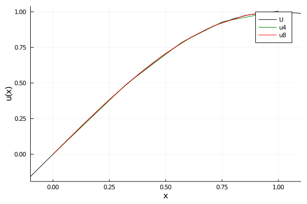

有限元法可归结为如下几个步骤：

1) 转换成变分问题（应该会用到边界条件）

2）对解域进行刨分（可以是不均匀）

3）构造基函数

4）推导出有限元方程

5）求解有限元方程

6）收敛性和误差估计

<!--more-->


```julia
# 奇怪：这个库必须放在最前面才能一次加载成功
using Plots
gr()

# 解决Colab不显示输出数学公式的问题
using Markdown: MD, LaTeX
function latex(expr)
    expr |> sympy.latex |> LaTeX
end;
```

考虑两点边值问题：

$$
\begin{aligned} &Lu=-\frac{d}{dx}\left(p\frac{du}{dx}\right)+qu=f ,\qquad a < x < b  \\ & u(a)=0,\frac{d}{dx}u(b)=0 \end{aligned}
$$

对应的变分方程(用到两个边界条件)：

$$
\begin{aligned}&a(u,v)=(f,v),\qquad \forall v \\  & a(u,v)=\int^b_a{\left(p\frac{du}{dx}\frac{dv}{dx}+quv\right)dx}\end{aligned}
$$

区间剖分（可以不均匀）：

$$
a = x_0 < x_1 < \dots < x_n=b \\ h_i=x_i-x_{i-1}, \qquad h = \mathrm{max} \{h_i\}
$$

与此对应的近似解序列$\{u_i\}$（待求）为：

$$
u_0=0, u_1,u_2,\dots,u_n
$$

通过这$n+1$个点的值可进行线性插值得到近似解$u_h(x)$：

$$
\begin{aligned}u_h(x)=\frac{x_i-x}{h_i}u_{i-1}+\frac{x-x_{i-1}}{h_i}u_i,\qquad  x_{i-1} < x < x_i \end{aligned}
$$


可引入线性无关的“山形函数”序列$\varphi_i(x)$构成基底：

![](data:image/jpeg;base64,/9j/4AAQSkZJRgABAQEAYABgAAD/4RDYRXhpZgAATU0AKgAAAAgABAE7AAIAAAAHAAAISodpAAQAAAABAAAIUpydAAEAAAAGAAAQyuocAAcAAAgMAAAAPgAAAAAc6gAAAAgAAAAAAAAAAAAAAAAAAAAAAAAAAAAAAAAAAAAAAAAAAAAAAAAAAAAAAAAAAAAAAAAAAAAAAAAAAAAAAAAAAAAAAAAAAAAAAAAAAAAAAAAAAAAAAAAAAAAAAAAAAAAAAAAAAAAAAAAAAAAAAAAAAAAAAAAAAAAAAAAAAAAAAAAAAAAAAAAAAAAAAAAAAAAAAAAAAAAAAAAAAAAAAAAAAAAAAAAAAAAAAAAAAAAAAAAAAAAAAAAAAAAAAAAAAAAAAAAAAAAAAAAAAAAAAAAAAAAAAAAAAAAAAAAAAAAAAAAAAAAAAAAAAAAAAAAAAAAAAAAAAAAAAAAAAAAAAAAAAAAAAAAAAAAAAAAAAAAAAAAAAAAAAAAAAAAAAAAAAAAAAAAAAAAAAAAAAAAAAAAAAAAAAAAAAAAAAAAAAAAAAAAAAAAAAAAAAAAAAAAAAAAAAAAAAAAAAAAAAAAAAAAAAAAAAAAAAAAAAAAAAAAAAAAAAAAAAAAAAAAAAAAAAAAAAAAAAAAAAAAAAAAAAAAAAAAAAAAAAAAAAAAAAAAAAAAAAAAAAAAAAAAAAAAAAAAAAAAAAAAAAAAAAAAAAAAAAAAAAAAAAAAAAAAAAAAAAAAAAAAAAAAAAAAAAAAAAAAAAAAAAAAAAAAAAAAAAAAAAAAAAAAAAAAAAAAAAAAAAAAAAAAAAAAAAAAAAAAAAAAAAAAAAAAAAAAAAAAAAAAAAAAAAAAAAAAAAAAAAAAAAAAAAAAAAAAAAAAAAAAAAAAAAAAAAAAAAAAAAAAAAAAAAAAAAAAAAAAAAAAAAAAAAAAAAAAAAAAAAAAAAAAAAAAAAAAAAAAAAAAAAAAAAAAAAAAAAAAAAAAAAAAAAAAAAAAAAAAAAAAAAAAAAAAAAAAAAAAAAAAAAAAAAAAAAAAAAAAAAAAAAAAAAAAAAAAAAAAAAAAAAAAAAAAAAAAAAAAAAAAAAAAAAAAAAAAAAAAAAAAAAAAAAAAAAAAAAAAAAAAAAAAAAAAAAAAAAAAAAAAAAAAAAAAAAAAAAAAAAAAAAAAAAAAAAAAAAAAAAAAAAAAAAAAAAAAAAAAAAAAAAAAAAAAAAAAAAAAAAAAAAAAAAAAAAAAAAAAAAAAAAAAAAAAAAAAAAAAAAAAAAAAAAAAAAAAAAAAAAAAAAAAAAAAAAAAAAAAAAAAAAAAAAAAAAAAAAAAAAAAAAAAAAAAAAAAAAAAAAAAAAAAAAAAAAAAAAAAAAAAAAAAAAAAAAAAAAAAAAAAAAAAAAAAAAAAAAAAAAAAAAAAAAAAAAAAAAAAAAAAAAAAAAAAAAAAAAAAAAAAAAAAAAAAAAAAAAAAAAAAAAAAAAAAAAAAAAAAAAAAAAAAAAAAAAAAAAAAAAAAAAAAAAAAAAAAAAAAAAAAAAAAAAAAAAAAAAAAAAAAAAAAAAAAAAAAAAAAAAAAAAAAAAAAAAAAAAAAAAAAAAAAAAAAAAAAAAAAAAAAAAAAAAAAAAAAAAAAAAAAAAAAAAAAAAAAAAAAAAAAAAAAAAAAAAAAAAAAAAAAAAAAAAAAAAAAAAAAAAAAAAAAAAAAAAAAAAAAAAAAAAAAAAAAAAAAAAAAAAAAAAAAAAAAAAAAAAAAAAAAAAAAAAAAAAAAAAAAAAAAAAAAAAAAAAAAAAAAAAAAAAAAAAAAAAAAAAAAAAAAAAAAAAAAAAAAAAAAAAAAAAAAAAAAAAAAAAAAAAAAAAAAAAAAAAAAAAAAAAAAAAAAAAAAAAAAAAAAAAAAAAAAAAAAAAAAAAAAAAAAAAAAAAAAAAAAAAAAAAAAAAAAAAAAAAAAAAAAAAAAAAAAAAAAAAAAAAAAAAAAAAAAAAAAAAAAAAAAAAAAAAAAAAAAAAAAAAAAAAAAAAAAAAAAAAAAAAAAAAAAAAAAAAAAAAAAAAAAAAAAAAAAAAAAAAAAAAAAAAAAAAAAAAAAAAAAAAAAAAAAAAAAAAAAAAAAAAAAAAAAAAAAAAAAAAAAAAAAAAAAAAAAAAAAAAAAAAAAAAAAAAAAAAAAAAAAAAAAAAAAAAAAAAAAAAAAAAAAAAAAAAAAAAAAAAAAAAAAAAAAAAAAAAAAAAAAAAAAAAAAAAAAAAAAAAAAAAAAAAAAAAAAAAAAAAAAAAAAAAAAAAAAAAAAAAAAAAAAAAAAAAAAAAAAAAAAAAAAAAAAAAAAAAAAAAAAAAAAAAAAAAAAAAAAAAAAAAAAAAAAAAAAAAAAAAAAAAAAAAAAAAAAAAAAAAAAAAAAAAAAAAAAAAAAAAAAAAAAAAAAAAAAAAAAAAAAAAAAAAAAAAAAAAAAAAAAAAAAAAAAAAAAAAAAAAAAAAAAAAAAAAAAAAAAAAAAAAAAAAAAAAAAAAAAAAAAAAAAAAAAAAAAAAAAAAAAAAAAAAAAAAAAAAAAAAAAAAAAAAAAAAAAAAAAAAAAAAAAAAAAAAAAAAAAAAAAAAAAAAAAAAAAAAAAAAAAAAAAAAAAAAAAAAAAAAAAAAAAAAAAAAAAAAAAAAAAAAAAAAAAAAAAAAAAAAAAAAAAAAAAAAAAAAAAAAAAAAAAAAAAAAAAAAAAAAAAAAAAAAAAAAAAAAAAAAAAAAAAAAAAAAAAAAAAAAAAAAAAAAAAAAAAAAAAAAAAAAAAAAAAAAAAAAAAAAAAAAAAAAAAAAAAAAAAAAAAAAAAAAAAAAAAAAAAAAAAAAAAAAAAAAAAAAAAAAAAAAAAAAAAAAAAAAAAAAAAAAAAAAOa3t+ayjAAAAAWQAwACAAAAFAAAEKCQBAACAAAAFAAAELSSkQACAAAAAzYzAACSkgACAAAAAzYzAADqHAAHAAAIDAAACJQAAAAAHOoAAAAIAAAAAAAAAAAAAAAAAAAAAAAAAAAAAAAAAAAAAAAAAAAAAAAAAAAAAAAAAAAAAAAAAAAAAAAAAAAAAAAAAAAAAAAAAAAAAAAAAAAAAAAAAAAAAAAAAAAAAAAAAAAAAAAAAAAAAAAAAAAAAAAAAAAAAAAAAAAAAAAAAAAAAAAAAAAAAAAAAAAAAAAAAAAAAAAAAAAAAAAAAAAAAAAAAAAAAAAAAAAAAAAAAAAAAAAAAAAAAAAAAAAAAAAAAAAAAAAAAAAAAAAAAAAAAAAAAAAAAAAAAAAAAAAAAAAAAAAAAAAAAAAAAAAAAAAAAAAAAAAAAAAAAAAAAAAAAAAAAAAAAAAAAAAAAAAAAAAAAAAAAAAAAAAAAAAAAAAAAAAAAAAAAAAAAAAAAAAAAAAAAAAAAAAAAAAAAAAAAAAAAAAAAAAAAAAAAAAAAAAAAAAAAAAAAAAAAAAAAAAAAAAAAAAAAAAAAAAAAAAAAAAAAAAAAAAAAAAAAAAAAAAAAAAAAAAAAAAAAAAAAAAAAAAAAAAAAAAAAAAAAAAAAAAAAAAAAAAAAAAAAAAAAAAAAAAAAAAAAAAAAAAAAAAAAAAAAAAAAAAAAAAAAAAAAAAAAAAAAAAAAAAAAAAAAAAAAAAAAAAAAAAAAAAAAAAAAAAAAAAAAAAAAAAAAAAAAAAAAAAAAAAAAAAAAAAAAAAAAAAAAAAAAAAAAAAAAAAAAAAAAAAAAAAAAAAAAAAAAAAAAAAAAAAAAAAAAAAAAAAAAAAAAAAAAAAAAAAAAAAAAAAAAAAAAAAAAAAAAAAAAAAAAAAAAAAAAAAAAAAAAAAAAAAAAAAAAAAAAAAAAAAAAAAAAAAAAAAAAAAAAAAAAAAAAAAAAAAAAAAAAAAAAAAAAAAAAAAAAAAAAAAAAAAAAAAAAAAAAAAAAAAAAAAAAAAAAAAAAAAAAAAAAAAAAAAAAAAAAAAAAAAAAAAAAAAAAAAAAAAAAAAAAAAAAAAAAAAAAAAAAAAAAAAAAAAAAAAAAAAAAAAAAAAAAAAAAAAAAAAAAAAAAAAAAAAAAAAAAAAAAAAAAAAAAAAAAAAAAAAAAAAAAAAAAAAAAAAAAAAAAAAAAAAAAAAAAAAAAAAAAAAAAAAAAAAAAAAAAAAAAAAAAAAAAAAAAAAAAAAAAAAAAAAAAAAAAAAAAAAAAAAAAAAAAAAAAAAAAAAAAAAAAAAAAAAAAAAAAAAAAAAAAAAAAAAAAAAAAAAAAAAAAAAAAAAAAAAAAAAAAAAAAAAAAAAAAAAAAAAAAAAAAAAAAAAAAAAAAAAAAAAAAAAAAAAAAAAAAAAAAAAAAAAAAAAAAAAAAAAAAAAAAAAAAAAAAAAAAAAAAAAAAAAAAAAAAAAAAAAAAAAAAAAAAAAAAAAAAAAAAAAAAAAAAAAAAAAAAAAAAAAAAAAAAAAAAAAAAAAAAAAAAAAAAAAAAAAAAAAAAAAAAAAAAAAAAAAAAAAAAAAAAAAAAAAAAAAAAAAAAAAAAAAAAAAAAAAAAAAAAAAAAAAAAAAAAAAAAAAAAAAAAAAAAAAAAAAAAAAAAAAAAAAAAAAAAAAAAAAAAAAAAAAAAAAAAAAAAAAAAAAAAAAAAAAAAAAAAAAAAAAAAAAAAAAAAAAAAAAAAAAAAAAAAAAAAAAAAAAAAAAAAAAAAAAAAAAAAAAAAAAAAAAAAAAAAAAAAAAAAAAAAAAAAAAAAAAAAAAAAAAAAAAAAAAAAAAAAAAAAAAAAAAAAAAAAAAAAAAAAAAAAAAAAAAAAAAAAAAAAAAAAAAAAAAAAAAAAAAAAAAAAAAAAAAAAAAAAAAAAAAAAAAAAAAAAAAAAAAAAAAAAAAAAAAAAAAAAAAAAAAAAAAAAAAAAAAAAAAAAAAAAAAAAAAAAAAAAAAAAAAAAAAAAAAAAAAAAAAAAAAAAAAAAAAAAAAAAAAAAAAAAAAAAAAAAAAAAAAAAAAAAAAAAAAAAAAAAAAAAAAAAAAAAAAAAAAAAAAAAAAAAAAAAAAAAAAAAAAAAAAAAAAAAAAAAAAAAAAAAAAAAAAAAAAAAAAAAAAAAAAAAAAAAAAAAAAAAAAAAAAAAAAAAAAAAAAAAAAAAAAAAAAAAAAAAAAAAAAAAAAAAAAAAAAAAAAAAAAAAAAAAAAAAAAAAAAAAAAAAAAAAAAAAAAAAAAAAAAAAAAAAAAAAAAAAAAAAAAAAAAAAAAAAAAAAAAAAAAAAAAAAAAAAAAAAAAAAAAAAAAAAAAAAAAAAAAAAAAAAAAAAAAAAAAAAAAAAAAAAAAAAAAAAAAAAAAAAAAAAAAAAAAAAAAAAAAAAAAAAAAAAAAAAAAAAAAAAAAAAAAAAAAAAAAAAAAAAAAAAAAAAAAAAAAAAAAAAAAAAAAAAAAAAAAAAAAAAAAAAAAAAAAAAAAAAAAAAAAAAAAAAAAAAAAAAAAAAAAAAAAAAAAAAAAAAAAAAAAAAAAAAAAAAAAAAAAAAAAAAAAAAAAAAAAAAAAAAAAAAAAAAAAAAAAAAAAAAAAAAAAAAAAAAAAAAAAAAAAAAAAAAAAAAAAAAAAAAAAAAAAAAAAAAAAAAAAAAAAAAAAAAAAAAAAAAAAAAAAAAAAAAAAAAAAAAAAAAAAAAAAAAAAAAAAAAAAAAAAAAAAAAAAAAAAAAAAAAAAAAAAAAAAAAAAAAAAAAAAAAAAAAAAAAAAAAAAAAAAAAAAAAAAAAAAAAAAAAAAAAAAAAAAAAAAAAAAAAAAyMDIwOjExOjAxIDE2OjIwOjQ5ADIwMjA6MTE6MDEgMTY6MjA6NDkAAAD3bYxsAAD/4QsZaHR0cDovL25zLmFkb2JlLmNvbS94YXAvMS4wLwA8P3hwYWNrZXQgYmVnaW49J++7vycgaWQ9J1c1TTBNcENlaGlIenJlU3pOVGN6a2M5ZCc/Pg0KPHg6eG1wbWV0YSB4bWxuczp4PSJhZG9iZTpuczptZXRhLyI+PHJkZjpSREYgeG1sbnM6cmRmPSJodHRwOi8vd3d3LnczLm9yZy8xOTk5LzAyLzIyLXJkZi1zeW50YXgtbnMjIj48cmRmOkRlc2NyaXB0aW9uIHJkZjphYm91dD0idXVpZDpmYWY1YmRkNS1iYTNkLTExZGEtYWQzMS1kMzNkNzUxODJmMWIiIHhtbG5zOmRjPSJodHRwOi8vcHVybC5vcmcvZGMvZWxlbWVudHMvMS4xLyIvPjxyZGY6RGVzY3JpcHRpb24gcmRmOmFib3V0PSJ1dWlkOmZhZjViZGQ1LWJhM2QtMTFkYS1hZDMxLWQzM2Q3NTE4MmYxYiIgeG1sbnM6eG1wPSJodHRwOi8vbnMuYWRvYmUuY29tL3hhcC8xLjAvIj48eG1wOkNyZWF0ZURhdGU+MjAyMC0xMS0wMVQxNjoyMDo0OS42MjU8L3htcDpDcmVhdGVEYXRlPjwvcmRmOkRlc2NyaXB0aW9uPjxyZGY6RGVzY3JpcHRpb24gcmRmOmFib3V0PSJ1dWlkOmZhZjViZGQ1LWJhM2QtMTFkYS1hZDMxLWQzM2Q3NTE4MmYxYiIgeG1sbnM6ZGM9Imh0dHA6Ly9wdXJsLm9yZy9kYy9lbGVtZW50cy8xLjEvIj48ZGM6Y3JlYXRvcj48cmRmOlNlcSB4bWxuczpyZGY9Imh0dHA6Ly93d3cudzMub3JnLzE5OTkvMDIvMjItcmRmLXN5bnRheC1ucyMiPjxyZGY6bGk+5re35rKMPC9yZGY6bGk+PC9yZGY6U2VxPg0KCQkJPC9kYzpjcmVhdG9yPjwvcmRmOkRlc2NyaXB0aW9uPjwvcmRmOlJERj48L3g6eG1wbWV0YT4NCiAgICAgICAgICAgICAgICAgICAgICAgICAgICAgICAgICAgICAgICAgICAgICAgICAgICAgICAgICAgICAgICAgICAgICAgICAgICAgICAgICAgICAgICAgICAgICAgICAgICAKICAgICAgICAgICAgICAgICAgICAgICAgICAgICAgICAgICAgICAgICAgICAgICAgICAgICAgICAgICAgICAgICAgICAgICAgICAgICAgICAgICAgICAgICAgICAgICAgICAgIAogICAgICAgICAgICAgICAgICAgICAgICAgICAgICAgICAgICAgICAgICAgICAgICAgICAgICAgICAgICAgICAgICAgICAgICAgICAgICAgICAgICAgICAgICAgICAgICAgICAgCiAgICAgICAgICAgICAgICAgICAgICAgICAgICAgICAgICAgICAgICAgICAgICAgICAgICAgICAgICAgICAgICAgICAgICAgICAgICAgICAgICAgICAgICAgICAgICAgICAgICAKICAgICAgICAgICAgICAgICAgICAgICAgICAgICAgICAgICAgICAgICAgICAgICAgICAgICAgICAgICAgICAgICAgICAgICAgICAgICAgICAgICAgICAgICAgICAgICAgICAgIAogICAgICAgICAgICAgICAgICAgICAgICAgICAgICAgICAgICAgICAgICAgICAgICAgICAgICAgICAgICAgICAgICAgICAgICAgICAgICAgICAgICAgICAgICAgICAgICAgICAgCiAgICAgICAgICAgICAgICAgICAgICAgICAgICAgICAgICAgICAgICAgICAgICAgICAgICAgICAgICAgICAgICAgICAgICAgICAgICAgICAgICAgICAgICAgICAgICAgICAgICAKICAgICAgICAgICAgICAgICAgICAgICAgICAgICAgICAgICAgICAgICAgICAgICAgICAgICAgICAgICAgICAgICAgICAgICAgICAgICAgICAgICAgICAgICAgICAgICAgICAgIAogICAgICAgICAgICAgICAgICAgICAgICAgICAgICAgICAgICAgICAgICAgICAgICAgICAgICAgICAgICAgICAgICAgICAgICAgICAgICAgICAgICAgICAgICAgICAgICAgICAgCiAgICAgICAgICAgICAgICAgICAgICAgICAgICAgICAgICAgICAgICAgICAgICAgICAgICAgICAgICAgICAgICAgICAgICAgICAgICAgICAgICAgICAgICAgICAgICAgICAgICAKICAgICAgICAgICAgICAgICAgICAgICAgICAgICAgICAgICAgICAgICAgICAgICAgICAgICAgICAgICAgICAgICAgICAgICAgICAgICAgICAgICAgICAgICAgICAgICAgICAgIAogICAgICAgICAgICAgICAgICAgICAgICAgICAgICAgICAgICAgICAgICAgICAgICAgICAgICAgICAgICAgICAgICAgICAgICAgICAgICAgICAgICAgICAgICAgICAgICAgICAgCiAgICAgICAgICAgICAgICAgICAgICAgICAgICAgICAgICAgICAgICAgICAgICAgICAgICAgICAgICAgICAgICAgICAgICAgICAgICAgICAgICAgICAgICAgICAgICAgICAgICAKICAgICAgICAgICAgICAgICAgICAgICAgICAgICAgICAgICAgICAgICAgICAgICAgICAgICAgICAgICAgICAgICAgICAgICAgICAgICAgICAgICAgICAgICAgICAgICAgICAgIAogICAgICAgICAgICAgICAgICAgICAgICAgICAgICAgICAgICAgICAgICAgICAgICAgICAgICAgICAgICAgICAgICAgICAgICAgICAgICAgICAgICAgICAgICAgICAgICAgICAgCiAgICAgICAgICAgICAgICAgICAgICAgICAgICAgICAgICAgICAgICAgICAgICAgICAgICAgICAgICAgICAgICAgICAgICAgICAgICAgICAgICAgICAgICAgICAgICAgICAgICAKICAgICAgICAgICAgICAgICAgICAgICAgICAgICAgICAgICAgICAgICAgICAgICAgICAgICAgICAgICAgICAgICAgICAgICAgICAgICAgICAgICAgICAgICAgICAgICAgICAgIAogICAgICAgICAgICAgICAgICAgICAgICAgICAgICAgICAgICAgICAgICAgICAgICAgICAgICAgICAgICAgICAgICAgICAgICAgICAgICAgICAgICAgICAgICAgICAgICAgICAgCiAgICAgICAgICAgICAgICAgICAgICAgICAgICAgICAgICAgICAgICAgICAgICAgICAgICAgICAgICAgICAgICAgICAgICAgICAgICAgICAgICAgICAgICAgICAgICAgICAgICAKICAgICAgICAgICAgICAgICAgICAgICAgICAgICAgICAgICAgICAgICAgICAgICAgICAgICAgICAgICAgICAgICAgICAgICAgICAgICAgICAgICAgICAgICAgICAgICAgICAgIAogICAgICAgICAgICAgICAgICAgICAgICAgICAgPD94cGFja2V0IGVuZD0ndyc/Pv/bAEMABwUFBgUEBwYFBggHBwgKEQsKCQkKFQ8QDBEYFRoZGBUYFxseJyEbHSUdFxgiLiIlKCkrLCsaIC8zLyoyJyorKv/bAEMBBwgICgkKFAsLFCocGBwqKioqKioqKioqKioqKioqKioqKioqKioqKioqKioqKioqKioqKioqKioqKioqKioqKv/AABEIAOgBzAMBIgACEQEDEQH/xAAfAAABBQEBAQEBAQAAAAAAAAAAAQIDBAUGBwgJCgv/xAC1EAACAQMDAgQDBQUEBAAAAX0BAgMABBEFEiExQQYTUWEHInEUMoGRoQgjQrHBFVLR8CQzYnKCCQoWFxgZGiUmJygpKjQ1Njc4OTpDREVGR0hJSlNUVVZXWFlaY2RlZmdoaWpzdHV2d3h5eoOEhYaHiImKkpOUlZaXmJmaoqOkpaanqKmqsrO0tba3uLm6wsPExcbHyMnK0tPU1dbX2Nna4eLj5OXm5+jp6vHy8/T19vf4+fr/xAAfAQADAQEBAQEBAQEBAAAAAAAAAQIDBAUGBwgJCgv/xAC1EQACAQIEBAMEBwUEBAABAncAAQIDEQQFITEGEkFRB2FxEyIygQgUQpGhscEJIzNS8BVictEKFiQ04SXxFxgZGiYnKCkqNTY3ODk6Q0RFRkdISUpTVFVWV1hZWmNkZWZnaGlqc3R1dnd4eXqCg4SFhoeIiYqSk5SVlpeYmZqio6Slpqeoqaqys7S1tre4ubrCw8TFxsfIycrS09TV1tfY2dri4+Tl5ufo6ery8/T19vf4+fr/2gAMAwEAAhEDEQA/APpGiiigAooooAKKKKACiiigAooooAKKKKACiiigCjput6drEl7Hpt2lw9hcta3KrkGKVQCVOfqPar1effCyBU1Px1OCm6XxNcggE54VOo7da9BoAKKKKACiiigAooooAKKKKACiiigAooooAKKKKACiiigAooooAKKKKACiiigAooooAKKKKACiiigAooooAKKKKACiiigAooooAKKKKACiiigAooooAKKKKACiiigAooooAKKKKACiiigAooooAKKKKAPNPhN/yMvxD/7GSX/0EV6XXn3w3s/sPi74gxB9+7XfOzjGPMhR8fhux+Feg0AFFUdN1vStZacaRqdnfm2fy5xa3CS+U391tpODweDVOHxGl54yutAsbdpTp8CS31yWASFpMmOMDqzkDcegCleTnFAG1RVK6u3k015NImtJbmRWFr50uIpZACdpZcnHynJAJGCcHGKp+FvEkHifRzdxRm3uIJntby1ZtzW08bbXjJ74I4PcEHvQBs0UUUAFFFFABRRRQAUUUUAFFFFABRRRQAUUUUAFFFFABRRRQAUUUUAFFFFABRRRQAUUVQ1TWbPR1txeSHzbqUQ28KDdJM57KvfAyT6AEmgC/RRWdo+t22twTPbLJFLbTGC4t5lCyQSDB2sASOhBBBIIIIJBoA0aKKKACiiigAooooAKKKKACiiigAooooAKKKKACiiigAooooAKKKKACiiigAoorn/HniZPB/gTVtdfG60tyYgf4pD8qD8WIoA5T4YeILDWvHXxCSyly8eroSh4JVYli3fTdE36Vyvxq1q/0LxPdXF55yW1xov2LRZIy+yO5lk2TOccbxESeewGO9cB8HX1rwD8VLR9Zytprky6ddhvvLcSRJPGGB6HdIo/774r6c1rw1a67qmj3l7NNt0m5N3FAhASSXaVVnyMnbkkYI5oA8/8F6Ho/hTVdR8T6VbR6X4cstIjsVmbEA1CRG3NcNuwCOiq5xncx6YNL4K1ey0zX/H8+tWcsUk95bXckaKblngmgXYuyMNuAO8EjI5PpXoHinQ28SeGrrSFuvsq3W1JZDHv3R7gXTGRwygr1/i71Yn0azm1m31UK0V7Apj86M4MkZ6o395c4OOxAIoA8t+F+h22mfEDXU1DQLiG4ec6hpMk1uWWxtZg52K54iYl2DIvPOOQDjo/hjsbVvHM1rEEtZPEk+xwu3e6xxrIcY/vq3Pc5rurmAXNrLAXkjEqFC8bbWXIxkHsfeo9P0+10uwhstPhWC3hXaka9vfPUknJJPJJJNAFiiiigAooooAKKKKACiiigAooooAKKKKACiiigAooooAKKKKACiiigAooooAK8c8Z+O/EE/iDxJ4f0S6fT50msNH08LEpZp7ol3n3HkbY1cDBwMZ9x7HXC+Kfh1D4r+IWiaxqMNm+madDL50RDCW4lIxGDjgooLHrnPqDQBD8Lft8Fx4j0+TWb3XdLsr2OKx1K9m855W8hDMA/cLJkeg5FVtXuriX9pDw9Zyr/o1volzPCTjHmM4ViO+cKB+Pua6Dxb4autR8P6do/hxxpdtFewvKbRvJMUEZL7YwOASyquMYwT6VlaL8PpoPDvh2S6n8jW9Lklnd5Ha5VhMWMsBLksUIYAHORtB55BAMW/1XUrr40T+F4fGF1ZaZd2Ud9G0SR7kmV9pt0kYEYIZGIAJ6DjnOhDO9r+0vdWtpgxX3htJ7xAAuHjnKpIT/ABHDFfYfSuvt/CHh20h06K20WxiTTHZ7JVgUfZ2b7xX0J71jX9onhG18T+N9UuY5tQazLAkYjghiVjHCuTk5Ykk8bmboOBQB2CSI+7YyttO04OcH0p1eLfswXlxqHgDW729laa5udcmlmkbq7tFEWJ9ySTXtNABRRRQAUUUUAFFFFABRRRQAUUUUAFFFFABRRRQAUUUUAFFFFABRRRQAV5X8XBJ4l8T+EfAkODDqV4b3UAe9vBhiv/Ajnp3UV6pXk/gGIeKvjR4x8ZMu61sGXRNPcEkN5f8ArSD0I3AEH0b8wDE8VeHX1/RfigtiuL7TdUg1CzZVyyyQ2sTfKPUqGUD3r1rwh4ig8W+DtL122wEvrdZGUfwP0dfwYEfhWB4G/wCR38ff9haH/wBJIqwPg4T4Y13xV8PZy+NIvTd2G5gR9kmAZVHfg8n3egD1eiiigAooooAKKKKACiiigAooooAKKKKACiiigAooooAKKKKACiiigAooooAKKKKACiiigAooooAKKKKACvK/jjcyarp2heBbGZo7vxPqCRSFeNtvGQ0jZ9js478/SvVK8p0L/ir/ANojWdZCObLwtZjTIHMYAa4ckyEE85ALDj1HY8gHa+FPDMfhufXDDcRyR6jqRu0ijj2i3HlRoI+vbZnt16V0NcP8Ov8AkMeOf+xkk/8ASeCu4oAKKKKACiiigAooooAKKKKACiiigAooooAKKKKACiiigAooooAKKKKAOc+IPihPBvgDV9cZsSW1ufI4zmVvljH/AH0RVL4UeHW8L/C7RNPnRkumtxc3W8YfzZfnYN6kFtv/AAGua+LECeLvGHhDwIPniubw6lqKA8C2hB+VuejEkfUV6rQB594DuY3+JnxFtQhEsWoWsjP2KtbKAPw2H86x/iTJ/wAIb8VfCfjhSqWl0x0TUSB1jkJZGJ6YByfX5fyvfD//AJLJ8Tf+vmw/9ENW/wDE7woPGnw61XR1XdctF5tqQcETJ8yfmRj6E0AdZRXK/DPxN/wl3w50jVpOLh4PKuFIxtlQ7H4+qk/Q11VABRRRQAUUUUAFFFFABRRRQAUUUUAFFFFABRRRQAUUUUAFFFFABRRRQAUUUUAFFFFABRRRQAUUUUAY3i7xBD4V8H6prdyfksrZpAMgbmxhRz6sQPxrlfgbo8+l/Cqxub8yNfavJJqVy8hyzvKchvxUKao/GVh4gufDXgKFsPr2oLJdYPK2sPzv2PXAx9K9PiiSGFIoUVI0UKqqMBQOABQBg+GNGt9Jv/EMttfx3h1DVGu5UTGbdzFGpjOCefkB5x94V0FcP8Ov+Qx45/7GST/0ngruKACiiigAooooAKKKKACiiigAooooAKKKKACiiigAooooAKKKKACiiuW+JXitfBXw71bW9u6WGHZAucZlc7U/AEgn2BoA5D4byDxd8WvGPjJir29o66Np7Y/gTmQg+7YP/Aj+PrFcf8KvC3/CH/DXStMlRRdtF9ou2Bzumk+ZsnuRkLn/AGRXYUAcD4Rgjh+MXxB8pdvmDTXb3Jhfn9K76uC8Iu7/ABi+IO+MptGmhckHcPJfniu9oA8l+He7wh8XvF3gqWf/AES8Ya1p0bLtwJD+9C8cgHA6/wAH1r1qvJPjEsnhfxR4S+IcCYt9Ju/smpuiZb7NN8pJHcDLAe7j8PWlYMoZSCpGQQetAC0UUUAFFFFABRRRQAUUUUAFFFFABRRRQAUUUUAFFFFABRRRQAUUUUAFFFFABRRRQAUUUUAFFFY/i7xDD4T8H6prtwAy2Ns8oQnG9gPlX8WIH40AcF4Xj/4Sj9oTxTr7FZrPw/bRaRZyBeBIRumGf7ytuU+zV6rXB/BnQZtC+GOnvf8AOoaoW1K8cptZpJju+YeoXaD9O1d5QBheHtI0/SNU182F81xPfX/2u7gZ1Jt5GjQAYAyAVVTzW7XAfD2aO58b/EGaSZnvBrEcToVwFiSBBHjA6/eHX+Efj39ABRRRQAUUUUAFFFFABRRRQAUUUUAFFFFABRRRQAUUUUAFFFFABXlPxQVPFnxE8HeBdrPC051jUABwIYgQgz6M24flXq1eT/DIHxd8S/F/juVi9uk/9jaYQuFMMRBZh3IY7T9S30AB6xRRRQBwvhX/AJLF4+/3NN/9EvXdVwvhX/ksXj7/AHNN/wDRL13VAGL4x8OxeLfBmq6DOVUX1s0aOwyEfqjfgwU/hXN/BbxHN4h+GFgt+CuoaWzabdqTkiSLCjPuV2k+5Nd9XlXh2RvB3x+13QJ5W+w+KIBq1kvl4RZ1yJVGP4iBuJ9hn3APVaKKKACiiigAooooAKKKKACiiigAooooAKKKKACiiigAooooAKKKKACiiigAooooAKKKKACvLfjMv/CRXnhXwNAytJrOqLNdR5/5dYQXkJGR9R67TXqVeS+C/wDir/jt4q8TylprPQ0XSNObJCq3JmwMckEHnP8AF9MAHrKIscapGoVFGFVRgAelLRRQBy3hXTdBsvE3iq40TUGur66vkfUoS4It5BGMKAAMcHPfnI7V1NeeeALNrL4l/EWNmDb9QtpQQOzwBsfhnFeh0AFFFFABRRRQAUUUUAFFFFABRRRQAUUUUAFFFFABRRRQAUUUUAcn8UPE6eEPhrrWreb5c62zRWxHXzn+VMfQkH6A0/4Z+G28JfDPQ9GlUrNBah51Ofllcl3HPozEfhXJ/EnyvFXxP8G+CGbfbLM+r6hGrfwRA+WGH91m3D/DrXqtABRRRQBwvhX/AJLF4+/3NN/9EvXdV534XnnHx48dW4j/ANHa1092k2nhhGQBnp0J49q9EoAK8r+ONtJpdn4f8cWUZa48N6ikkxQHLW0hCyDI7fdH0J/H1Ss/XtIh1/w7qGkXX+pvrZ4HI6gMpGfwzQBct7iK7tYri3cPFMgdGHRlIyD+VSV5v8DL+9k+Hr6Jq3F/4evZtMlBPOEOVP0w2B7LXpFABRRRQAUUUUAFFFFABRRRQAUUUUAFFFFABRRRQAUUUUAFFFFABRRRQAUUUUAFFFFAGF428SR+EfBGq67KN32K3Z0X+854QfixArE+D2gvoPwu0pbk7ry/Q39055LyTfPknucFRn2rF+LjDxH4g8J+AoyrDVb8Xl8jRlh9lg+cgkdNxGPqOo7+oqoVQqgBQMAAdKAFooooA5vw/aaFb+LvFEmkzyvqU1xA2pxOSVjfyV2bcjoUIPBP4dK6SuH8I/8AJUviB/182P8A6SJXcUAFFFFABRRRQAUUUUAFFFFABRRRQAUUUUAFFFFABRRRQAUUVyXxR8Sf8Ip8NdY1KNityYDBahQCxmk+RMA9SCc49AaAOU+FofxT8Q/GHjqZT5Ek40rTmLZBhi+8RjjBIU5+tesVzHw48M/8Ih8O9H0ZkCTw24a4wc5lb5nP/fRNdPQAUUUUAec+GLx1+Pnjqy2rsez0+Xd3BEZGP/Hq9GrzHwz/AMnHeNv+wdY/+g16dQAUUUUAeVJs8F/tGMmfK0/xnYlgCx2m8h68dBlD+Jb8K9Vrzb46aVc3Hw9Gu6WMan4cuo9UtnC5ICH5xkc7dpLH/cFd3ouq2+u6DY6tZHNvfW6XEf8AusoI/nQBeooooAKKKKACiiigAooooAKKKKACiiigAooooAKKKKACiiigAooooAKKKKACiisDxz4kTwj4F1fXX27rO2Z4gxwGkPCL+LFR+NAHFeCIz4s+NHizxfKhe00vboemSE5U7OZyP+B9COMMeteqVxPwg8Ny+FfhVo1hdgC7kiN1c85O+Vi+CfUBgv8AwGu2oAKKKKAOf0WfRZPF3iWLTbeSPU4pbf8AtKRs4kYwqY8c9kwOAK6CuH8I/wDJUviB/wBfNj/6SJXcUAFFFFABRRRQAUUUUAFFFFABRRRQAUUUUAFFFFABRRRQAV5P8REHiz4weDPCKhZbayd9a1BOWwqcRhh0wWyOf7w/H1gnAyeleV/CYf8ACS+L/GPjx5PMjv77+ztPw+QLaAABh2wxwcdiD65IB6pRRRQAUUUUAeeaLZi1/aE8USh932rR7OUjH3cM6Y/8cz+Neh1wun/8l81v/sAWn/o6au6oAKKKKAIL2zg1CwuLK8jElvcxNFKh6MrDBH5GvNPgbdzafpOt+Cb+XzLrwxqMlvGWYEtbsS0bfT734Y+lepV5P4mSLwV8fNC8SA7LPxRC2k3xPQTLt8pvQZwq/QGgD1iiiigAooooAKKKKACiiigAooooAKKKKACiiigAooooAKKKKACiiigAooooAK8r+Ln/ABU/ibwl4AQF4dUvftuohWH/AB6wfMVPoGOcH1WvVK8q+HxXxb8W/F/jF9rwWLjQ9PIT+CP5pGzjnLYwc9CR0xQB6rRRRQAUUUUAc7od5o8/jPxPb6fZyQ6jby2w1CdjxOzQAxkcnomB0HTvXRV5p4N/5L98SP8Arlpn/og16XQAUUUUAFFFFABRRRQAUUUUAFFFFABRRRQAUUUUAFFFFAHHfFfxJ/wi3wx1i+iZ1u5YTa2gjPzmaT5E2+pBO7Hopq98PvDSeEPh9o2hqCGtbYebkYzI3zuf++mauN8fI3iz4xeEfCSqXs9P3a3fjd8pCHbGCP8AeH/j1eq0AFFFFABRRRQBwun/APJfNb/7AFp/6Omruq4XT/8Akvmt/wDYAtP/AEdNXdUAFFFFABXEfF/w23iT4a6ilsSt9p4GoWbgnKyxfMMY7kbh+NdvSMoZSrAFSMEEdaAMXwZ4hTxX4J0nXIwB9utlkdQwO1+jLkejAj8K268u+FQ/4RbxZ4q8AySYisLkX+mRnoLWbnavfCscH3Neo0AFFFFABRRRQAUUUUAFFFFABRRRQAUUUUAFFFFABRRRQAUUUUAFFFFAHN/ELxKvhD4faxrZYLJbWzeTnvK3yoP++iKpfCfw9J4Y+F2i2Fyu26aD7RcZGD5khLkH3G7H4VzfxUjPinx/4K8Eo+6CW6bVdQjBAPkwj5c+zHePrj8PVaACiiigAooooA5XRNd0u9+JHijSLPSlt9Q0+O0N5fBVBut8ZZASOTtXjn1rqq888LWbW3x38eyswIurTTZVA/hAjkTB/FCfxr0OgAooooAKKKKACiiigAooooAKKKKACiiigAooooAKRmCqWYgKBkknpS1w/wAYvEj+GPhZq1zbki8uo/sVqFbDGSX5flxzkAs3/AaAMX4S7fE3iXxZ4+PzR6ne/YdPZkKkW0IABHsxx+K16lXP+BPDieEvAej6IiqrWlsqy7c/NIRlzz6sTXQUAFFFFABRRRQBwun/APJfNb/7AFp/6Omruq80tZZB+1FfRB2EbeFEZkB4JFzgEj1GT+Zr0ugAooooAKKKKAPK/iV5vhb4l+EPHEO8WfmtpGplAD+6lP7skdSA5Ld+QPx9UrmfiL4WHjP4e6voeAZbiAmAntKp3J/48o/DNVvhX4oPi74a6Rqcshe7EIt7vcSW86P5XJz3JG7/AIFQB19FFFABRRRQAUUUUAFFFFABRRRQAUUUUAFFFFABRRRQAUUUUAFFFcv8SfEyeEPhzrOsFiJIbcpBg4Jlf5E/8eYH8KAOR+G//FXfFHxb45dpGt4JP7F07K7V8qPazkA88tg9O5+g9WrkfhX4Y/4RD4Y6LpLx+XcLbia5BXB82T53B9SC236KK66gAooooAKKKKAOd03WYbn4ha5pCafDFNZ2lpM94uN84kMmFbjouw45P3j0roq4fQ/+S2eLf+wZp38567igAooooAKKKKACiiigAooooAjnuIbWBprmWOGJBlpJGCqv1Jqh/wAJNoP/AEG9O/8AAuP/ABqbWNHsNf0e50vWLZbqyuk2TQsSAw69Rgjp2rkh8Ffh0Ao/4RSy+Xpy/pjn5ufxoA6f/hJtB/6Denf+Bcf+NH/CTaD/ANBvTv8AwLj/AMa5r/hTHw7/AOhTsPyb/Gj/AIUx8O/+hTsPyb/GgDpf+Em0H/oN6d/4Fx/40f8ACTaD/wBBvTv/AALj/wAa5r/hTHw7/wChTsPyb/Gj/hTHw7/6FOw/Jv8AGgDpf+Em0H/oN6d/4Fx/415X408UaH4n+NnhLw22qWR07Si2q3cjXEflyTBT5UeScbhjdj0b8rcfhr4JyaqmmJpGnm/e7NmLX7PMJBKACQVxkLhgd5+Xkc10n/CmPh3/ANCnYfk3+NAHS/8ACTaD/wBBvTv/AALj/wAaP+Em0H/oN6d/4Fx/41zX/CmPh3/0Kdh+Tf40f8KY+Hf/AEKdh+Tf40AaR+JXgYHB8Y6Dn/sJRf8AxVJ/wsvwN/0OOg/+DKH/AOKrO/4Ux8O/+hTsPyb/ABo/4Ux8O/8AoU7D8m/xoA0f+Fl+Bv8AocdB/wDBlD/8VR/wsvwN/wBDjoP/AIMof/iqzv8AhTHw7/6FOw/Jv8apa54D+F/hPw9c3mreFdPjscjzpVsmmaPvncAWQcckED1oA5qDxt4VX9pG61VvEmkjT28MLAt39tj8oyfaAdm7ON2OcdcV6H/wsvwN/wBDjoP/AIMof/iqwtA8IfC3xBcXj6J4X0q6S3VYGn/s/wDcyDHWNmXa5+U5dcnPfnnoP+FceCP+hN8P/wDgrg/+JoAZ/wALL8Df9DjoP/gyh/8AiqP+Fl+Bv+hx0H/wZQ//ABVP/wCFceCP+hN8P/8Agrg/+Jo/4Vx4I/6E3w//AOCuD/4mgBn/AAsvwN/0OOg/+DKH/wCKo/4WX4G/6HHQf/BlD/8AFU//AIVx4I/6E3w//wCCuD/4mj/hXHgj/oTfD/8A4K4P/iaAGf8ACy/A3/Q46D/4Mof/AIqvMfBHjrwv4T+LfizRxr+mDQtWkXVLO7S8TyI5WH72PdnaCT29FHsK6eT/AIVPFrdxoz+EdJ/tW3uFgaxXQEaZi2MOFCHMeDnf933rqv8AhXHgj/oTfD//AIK4P/iaAGf8LL8Df9DjoP8A4Mof/iqP+Fl+Bv8AocdB/wDBlD/8VT/+FceCP+hN8P8A/grg/wDiaP8AhXHgj/oTfD//AIK4P/iaAGf8LL8Df9DjoP8A4Mof/iqP+Fl+Bv8AocdB/wDBlD/8VT/+FceCP+hN8P8A/grg/wDiaP8AhXHgj/oTfD//AIK4P/iaAOa8XfHXwb4Ws4Li21G31zfMI5YtLuopZI1KuQ+N2CMpg88bhnqAYNI/aI+HWqBRLqs2nSH+C8tnXtn7ygr7da1fFXwc8FeKbaJLnRbey8qbznfTbeKCSY7WUKzhdxHzZxkcgZ6VgeDfDvwle/8Asvhzwos92k0kM4u7GWdrSRDz5hl3eWcjjp3x3oA9H0PxJoviW0a58P6raalCuA7W0yvsJGQGA5U47HmtOo7e3htIFhtYY4YlztjjUKo5zwB71JQAUUUUAFFFFAHN+IviH4U8JajHY+I9bt7C6kiEyRShslCSA3APdSPwrJ/4XX8Ov+hrsvyf/wCJrsLrStPvpRJe2FtcSBdoeaFXIHpkjpyag/4R7Rf+gRYf+Ayf4UAct/wuv4df9DXZfk//AMTR/wALr+HX/Q12X5P/APE11P8Awj2i/wDQIsP/AAGT/Cj/AIR7Rf8AoEWH/gMn+FAHLf8AC6/h1/0Ndl+T/wDxNRz/ABw+HEELSt4ptWC9RHHIzH6ALk11v/CPaL/0CLD/AMBk/wAKP+Ee0X/oEWH/AIDJ/hQByVv8cfhxcwLKnim2VWzgSRSIw5xyCuRXnXxO+K/g3X/FHhDT4tcSfRLXUBf6nJHC7p+7/wBWhG0lsnPAz15xxXfyeKvC6a/d6Cng65k1i1ljVrJNOhZnic8ThgxXyx3JIxkDGa7UaFpC426XZDAIGLdO4we3egDg/wDhoX4Zf9DE3/gBcf8Axuj/AIaF+GX/AEMTf+AFx/8AG67r/hHtF/6BFh/4DJ/hSroGjo4ZNJsVZTkEWyAg/lQBwn/DQvwy/wChib/wAuP/AI3R/wANC/DL/oYm/wDAC4/+N16XRQB5p/w0L8Mv+hib/wAALj/43R/w0L8Mv+hib/wAuP8A43Xpdcr4z8e2XgabTX1myujp99MYDewKHEMm0lVKD5juwegNAHE2v7RvgdvFF/BcakselrBE1terZzlpZMtvRhtyMfLjjua1f+Ghfhl/0MTf+AFx/wDG677SL251HS47m+02fTJnLbrWd0Z0AYgElCV5AB4PertAHmn/AA0L8Mv+hib/AMALj/43R/w0L8Mv+hib/wAALj/43XpdFAHmn/DQvwy/6GJv/AC4/wDjdH/DQvwy/wChib/wAuP/AI3XpdFAHgOsftT6Vp3iS6ttN0r+2NJAU295DK8DklV3BkdOzbufTFdR4b/aJ8F+IrhLYR6paXLjiJ7JpSTkDA8rce/pjitPx7pfgfw9d/8ACWeKPC8Gpm6nit7u8miFx5AICI3luSMZCjCDPJOOTXW+Grh7nRw8mhSaF+8YC0k8vOOzfuyQM+h59aANVWDoGGcMMjIIP5HpS0UUAFFFFABRRRQAVBezT29hPNaWrXc8cbNHbq6oZWA4Xc3AyeMmp6KAPMPDegeLtP8Ai1e+Jb3TLZbPXrJPtoa5XNg0bEJGNufMOwLk4AyTzxg7ej/EPTn0Kx1LWp5IU1Z55bLbZOwEKyYUM0ZkXO0qc7hnPQdK7GaJZ4JIpNwWRSrbHKnBGOCMEH3HNQaXptpo2k2mmabF5NpZwpBBGCTtRRgDJ5PA6nk0Ac14p8TyzfDXXNa8IXircWEDypNNbsFBjUOw2sBn5cgHGMn2NdfVPV9KtNc0e60vUkeS0u4zFMiStGWU9RuUgjPsatqNqhRnAGOTn9aAFooooAK5bxxp2teINNbw9pUEENnqcMkV7qUrhvsyEYKrF1ZmBIBzgck9gepooA830S71zwl4A8KeH9WgNlq095FpcLWypcrsjBYu4LLhWjibOCSu4dSK9Iqje6LY6jqWn393E73OmyPJassrqEZkKMSAQG+Ukcg9avUAFFFFABUdw8sdtK9vEJpVQlIy23e2OBntk96kooA800Xwt4wtviovi/UItM2anZG1v7VJsmzVWBQI4jBkOByTjkkdAtWp/iCYfh7qPiOOLU5WuPtjafHHpzziEQlkUs0SkBCU3hnOMMeSBXoNZlh4d0rTPDUfh+ytFj0uOA2625YsPLIIIJJyc5PJOeaAOf1bxVLe/CbXNb0k3lleWmlTzJJPYyW5WVYS4ZVmQblz3wR711dhci9022ul24nhSQbTkfMAeD360y+0qy1HRp9KvIN9jcQm3lhDFQ0ZG0rkEHGOKksrODT7CCztFKQW8axRKWLFVUYAySSeB1NAE9FFFAFLV5NSh0i4k0O3t7q/VMwQ3Mpijc56FgCRxnt19Oo4/wAFeFfE/hvxTqtxqN/ZXdhq3l3t06qQ4u9myRUAAAThSCcnAAwSS1d7RQAUUUUAFFFFABRRRQAUUUUAFFFFABTJvN8iT7PsEu07N4O3djjOO2afRQBwFh4K8SQ/EOHxZc6zZie6sza6nbxws0exJFaNYQxyvAYMSerEgc8QeFPileeJvEF3YDw/5ca2Vxe2ZjugZLuOObykIV1VVD9QS3bnjBr0YgMpDDIPBB71RtND0mwukubHS7K2njtxapLDbojLCDkRggZCA87elAGVpfifUr/WhYXfhDWdOTBLXdw9u0K4APVJWJzkDgHnPocVfBt7dTeIfGFpcTTTQ2mrgQeaS2xXt4nKgk9AzHjtmutqvbafZ2U1xLZ2kFvJdSebO8UQUzPjG5iB8xwAMmgCxRRRQAVwPjrwHrXjZZYJtat7a1tZ4rrTI44GG2ZCvM3zfvF4fAG37/sK76igDzjXfiDrXhjVP7GOnWms3VtZWktzdC6+zB5p5/JWMJtYBicsAW6A+lej1VudK0+9Di8sLa4DursJYVbcy/dY5HJHY9qtUAFFFFABRRRQBx/jXwTd+N4brTr/AFYQaPJbYit4YPnFx/DK7k8hSFIUY56kiuj0e2vbTR7aDVLz7beIgE1wECB274A6DsO+Bzk1dooAKKKKACiiigAooooAKKKKACiiigAooooAKKKKACiiigAooooAKKKKACiiigAooooAKKKKACiiigAooooAKKKKACiiigAooooAKKKKACiiigAooooAKKKKACiiigAooooAKKKKACiiigAooooAKKKKACiiigAooooA/9k=)

$$
\boxed{\xi = \frac{x-x_{i-1}}{h_i}\qquad x_{i-1} < x < x_i\qquad 0<\xi<1}
$$


$$
\varphi_0(x)=\left\{\begin{aligned}&1-\xi,  &x_0 < x < x_1 \\ &0, & 其它\end{aligned}\right .
$$


$$
\varphi_i(x)=\left\{\begin{aligned}&\xi,  &x_{i-1} < x < x_i \\ &1-\xi,& x_i < x < x_{i+1} \\ &0, & 其它\end{aligned}\right . \qquad i=1,2,\dots,n-1
$$

$$
\varphi_n(x)=\left\{\begin{aligned}&\xi,  &x_{n-1} < x < x_n \\ &0, & 其它\end{aligned}\right .
$$


不难验证，前面的线性插值函数$u_h(x)$，可用这个序列$\varphi_i$为基底展开(下面考虑了$u_0=0$)：

$$
u_h(x)=\sum^n_{i=1}{u_i \varphi_i(x)}
$$

由图可知（亦可简单验算）：

$$
\varphi_i(x)\varphi_j(x)=0,  \qquad |i-j|\ge 2 \\
\frac{d\varphi_i}{dx}\frac{d\varphi_j}{dx}=0,  \qquad |i-j|\ge 2
$$

所以$a(\varphi_i,\varphi_j)$的非零值只可能有：

$$
\begin{aligned}&a(\varphi_{1},\varphi_1),a(\varphi_{2},\varphi_1) \\ &a(\varphi_{j-1},\varphi_j),a(\varphi_{j},\varphi_j),a(\varphi_{j+1},\varphi_j),\qquad j=2,\dots,n-1\\ & a(\varphi_{n-1},\varphi_n),a(\varphi_{n},\varphi_{n}) \end{aligned}
$$

可分别算出这三类非零值：

$$
a(\varphi_{j-1},\varphi_j)=\int^1_0{\left[-h_j^{-1}p(x_{j-1}+h_j\xi)+h_j q(x_{j-1}+h_j\xi)(1-\xi)\xi\right]d\xi}
$$

$$
\begin{aligned}a(\varphi_j,\varphi_j)&=\int^1_0{\left[h_j^{-1}p(x_{j-1}+h_j\xi)+h_j q(x_{j-1}+h_j\xi)\xi^2\right]d\xi} \\ & +\int^1_0{\left[h_{j+1}^{-1}p(x_{j}+h_{j+1}\xi)+h_{j+1} q(x_{j} +h_{j+1}\xi)(1-\xi)^2\right]d\xi}\end{aligned}
$$

$$
a(\varphi_{j+1},\varphi_j)=\int^1_0{\left[-h_{j+1}^{-1}p(x_{j}+h_{j+1}\xi)+h_{j+1} q(x_{j}+h_{j+1}\xi)(1-\xi)\xi\right]d\xi}
$$

$$
a(\varphi_n,\varphi_n)=\int^1_0{\left[h_n^{-1}p(x_{n-1}+h_n\xi)+h_n q(x_{n-1}+h_n\xi)\xi^2\right]d\xi} 
$$


```julia
using SciPy

# 
# “山形”基函数
#
function φ(t,i,x,h,n)
    if i > 1 && t>=x[i-1] && t<=x[i]
        return (t-x[i-1])/h[i-1]
    elseif i < n+2 && t>x[i] && t<=x[i+1]
        return 1-(t-x[i])/h[i]
    else
        return 0
    end
end;


# 
# a(φ_i,φ_j)
#
#   假设已有p(t),q(t)
#
function aa(i,j,x,h,n)
    if abs(i-j) >= 2
        return 0;
    end;
    
    if i==j-1
        α(ξ)=-p(x[j-1]+h[j-1]*ξ)/h[j-1]+h[j-1]*q(x[j-1]+h[j-1]*ξ)*(1-ξ)*ξ;
        return SciPy.integrate.quad(α, 0, 1)[1];
    end;
    
    if i==j && j<n+1
        β(ξ)=p(x[j-1]+h[j-1]*ξ)/h[j-1]+h[j-1]*q(x[j-1]+h[j-1]*ξ)*ξ^2+p(x[j]+h[j]*ξ)/h[j]+h[j]*q(x[j]+h[j]*ξ)*(1-ξ)^2;
        return SciPy.integrate.quad(β, 0, 1)[1];
    end;
    
    if i==j && j==n+1
        ϵ(ξ)=p(x[j-1]+h[j-1]*ξ)/h[j-1]+h[j-1]*q(x[j-1]+h[j-1]*ξ)*ξ^2;
        return SciPy.integrate.quad(ϵ, 0, 1)[1];
    end;
    
    if i==j+1
        γ(ξ)=-p(x[j]+h[j]*ξ)/h[j]+h[j]*q(x[j]+h[j]*ξ)*(1-ξ)*ξ;
        return SciPy.integrate.quad(γ, 0, 1)[1];
    end;      
end;
```

正式求解的julia代码：


```julia
using Random

# 参数选定
a=0; b=1
f(t)=(pi^2/2)sin(pi*t/2);
p(t) = 1;
q(t) = pi^2/4;


function NSolve(n)
    # 随机生成的不均匀的区间刨分
    h = [0.5*rand()+0.5 for i in 1:n];
    h = (b-a)*h/sum(h);
    x = zeros(n+1);
    x[1]=a; x[n+1]=b;
    x[2:n]=[sum(h[1:i]) for i in 1:(n-1)];
    h[n]=x[n+1]-x[n];

    # 计算a(φ_i,φ_j)矩阵（只需要计算可能非零值）
    A = zeros(n,n);

    for j in 1:n
        if j>1
            A[j,j-1]=aa(j,j+1,x,h,n);
        end;
        A[j,j]=aa(j+1,j+1,x,h,n);
        if j<n
            A[j,j+1]=aa(j+2,j+1,x,h,n);
        end;
    end;

    # 计算(f,φ_j)列向量
    c = [SciPy.integrate.quad(t->f(t)*φ(t,j+1,x,h,n), a, b)[1] for j in 1:n];

    # 解出插值端点值
    u = inv(A)*c;
    
    # 构造近似解序列
    m = 100;
    X = [(i-1)*(b-a)/m for i in 1:(m+1)];
    U = [sum(u[i-1]*φ(X[j],i,x,h,n) for i in 2:(n+1)) for j in 1:(m+1)];
    (X,U)
end;
```

做为对比，也可解出精确解：


```julia
using SymPy

@vars t
y = SymFunction("y")

diffeq = -diff(y(t),t,2)+(PI^2/4)y(t)⩵(PI^2/2)*sin(t*PI/2)

# 通解
ex = dsolve(diffeq, y(t))

# 根据边界条件确定积分常数
ex1 = rhs(ex)
ex2 = diff(ex1,t)
eqs = [ex1(t=>0)⩵0,ex2(t=>1)⩵0]
C = solve(eqs,[Sym("C1"),Sym("C2")])

# 解析解
ex = ex(C)
ex |> latex |> MD
```


$$
y{\left(t \right)} = \sin{\left(\frac{\pi t}{2} \right)}
$$


绘制近似解和精确解


```julia
# 精确解
plot(rhs(ex),color="black",xlims=(-0.1, 1.1),label="U",xlabel="x",ylabel="u(x)")
# 近似解 n=4,8
plot!(NSolve(4),color="green",label="u4")
plot!(NSolve(8),color="red",label="u8")
```





