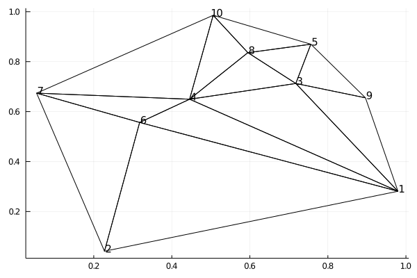

上一篇笔记，讨论了一个单独的`三角单元`。 本篇讨论，如何将任意给定平面区域刨分成`三角单元序列`。

本文用到了 python库`scipy.spatial.Delaunay`

**参考文献**： https://docs.scipy.org/doc/scipy/reference/generated/scipy.spatial.Delaunay.html


<!--more-->


```julia
# 奇怪：这个库必须放在最前面才能一次加载成功
using Plots
gr()
```

    Plots.GRBackend()


## 1) 随机生成玩具点集


```julia
using LinearAlgebra
using Random

# 随机生成平面点序(要求任意两点的距离不得太小)
n = 10
dmin = 0.1

X = zeros(n,2)
X[1,:] = [rand(),rand()]

i=2
while i <= n
    x = [rand(),rand()]
    if min([norm(X[j,:]-x) for j in 1:i-1]...) >= dmin
        X[i,:] = x
        i += 1
    end 
end
```

## 2) 生成Delaunay三角刨分


```julia
using SciPy: spatial

tri = spatial.Delaunay(X)

plot()
#plot(X[:,1], X[:,2], seriestype = :scatter, label="")
for i in 1:size(X)[1]
    plot!(; annotations=[ (X[i,1]+0.01,X[i,2]+0.01,text(i,10)) ] );
end

sp = tri.simplices .+ 1 
n, = size(sp)

for i in 1:n
    idx = sp[i,:] 
    pts = X[idx,:]
    plot!(pts[:,1], pts[:,2], color="black",label="")
    plot!(pts[[1,3],1], pts[[1,3],2], color="black",label="")
end
plot!()
```





通过下面的代码，可以准确理解`simplices`（三角形序列）和`neighbors`（邻居序列）这两个变量的含义。

`simplices`每一行代表：三个顶点索引（0起始索引）
`neighbors`每一行代表：三个顶点对面的三角形索引（0起始索引）

【注意： Julia数组是1起始索引，为了避免错误不妨先作转换】


```julia
# 转换成1起始索引，确保和Julia习惯一致
sp = tri.simplices .+ 1
# 注意，原本-1代表没有邻居，转换后0代表没有邻居
nb = tri.neighbors .+ 1

println("【和前图图对照即可明白】\r\n")
for j in eachindex(sp[:,1])
    println("第",j,"个三角形：",sp[j,:])
    for i in 1:3
        if nb[j,i] == 0
            println("\t此三角形的顶点",sp[j,i],"对面没有三角形邻居")
        else
            println("\t此三角形的顶点",sp[j,i],"对面的邻居第",nb[j,i],"个三角形：",sp[nb[j,i],:])
        end
    end
end
```

    【和前图图对照即可明白】
    
    第1个三角形：[4, 10, 7]
    	此三角形的顶点4对面没有三角形邻居
    	此三角形的顶点10对面的邻居第5个三角形：[6, 4, 7]
    	此三角形的顶点7对面的邻居第11个三角形：[4, 8, 10]
    第2个三角形：[6, 2, 1]
    	此三角形的顶点6对面没有三角形邻居
    	此三角形的顶点2对面的邻居第3个三角形：[4, 6, 1]
    	此三角形的顶点1对面的邻居第4个三角形：[2, 6, 7]
    第3个三角形：[4, 6, 1]
    	此三角形的顶点4对面的邻居第2个三角形：[6, 2, 1]
    	此三角形的顶点6对面的邻居第6个三角形：[3, 4, 1]
    	此三角形的顶点1对面的邻居第5个三角形：[6, 4, 7]
    第4个三角形：[2, 6, 7]
    	此三角形的顶点2对面的邻居第5个三角形：[6, 4, 7]
    	此三角形的顶点6对面没有三角形邻居
    	此三角形的顶点7对面的邻居第2个三角形：[6, 2, 1]
    第5个三角形：[6, 4, 7]
    	此三角形的顶点6对面的邻居第1个三角形：[4, 10, 7]
    	此三角形的顶点4对面的邻居第4个三角形：[2, 6, 7]
    	此三角形的顶点7对面的邻居第3个三角形：[4, 6, 1]
    第6个三角形：[3, 4, 1]
    	此三角形的顶点3对面的邻居第3个三角形：[4, 6, 1]
    	此三角形的顶点4对面的邻居第7个三角形：[9, 3, 1]
    	此三角形的顶点1对面的邻居第12个三角形：[3, 8, 4]
    第7个三角形：[9, 3, 1]
    	此三角形的顶点9对面的邻居第6个三角形：[3, 4, 1]
    	此三角形的顶点3对面没有三角形邻居
    	此三角形的顶点1对面的邻居第8个三角形：[5, 3, 9]
    第8个三角形：[5, 3, 9]
    	此三角形的顶点5对面的邻居第7个三角形：[9, 3, 1]
    	此三角形的顶点3对面没有三角形邻居
    	此三角形的顶点9对面的邻居第10个三角形：[5, 8, 3]
    第9个三角形：[8, 5, 10]
    	此三角形的顶点8对面没有三角形邻居
    	此三角形的顶点5对面的邻居第11个三角形：[4, 8, 10]
    	此三角形的顶点10对面的邻居第10个三角形：[5, 8, 3]
    第10个三角形：[5, 8, 3]
    	此三角形的顶点5对面的邻居第12个三角形：[3, 8, 4]
    	此三角形的顶点8对面的邻居第8个三角形：[5, 3, 9]
    	此三角形的顶点3对面的邻居第9个三角形：[8, 5, 10]
    第11个三角形：[4, 8, 10]
    	此三角形的顶点4对面的邻居第9个三角形：[8, 5, 10]
    	此三角形的顶点8对面的邻居第1个三角形：[4, 10, 7]
    	此三角形的顶点10对面的邻居第12个三角形：[3, 8, 4]
    第12个三角形：[3, 8, 4]
    	此三角形的顶点3对面的邻居第11个三角形：[4, 8, 10]
    	此三角形的顶点8对面的邻居第6个三角形：[3, 4, 1]
    	此三角形的顶点4对面的邻居第10个三角形：[5, 8, 3]
    

## 3）面积坐标（重心坐标）和普通坐标

在三角形情形中，`重心坐标`也叫`面积坐标`。 

### 1）根据普通坐标计算重心坐标

原则上，我们可根据下面的公式（参见：笔记$\color{blue}{《有限元之平面三角单元》}$）算出`重心坐标`。

$$
\boxed{\color{red}{\left\{\begin{aligned}l_1&=\frac{1}{2S}\left[(x_2 y_3-x_3 y_2)+(y_2-y_3)x+(x_3-x_2)y\right]\\ l_2&=\frac{1}{2S}\left[(x_3 y_1-x_1 y_3)+(y_3-y_1)x+(x_1-x_3)y\right]\\ l_3&=\frac{1}{2S}\left[(x_1 y_2-x_2 y_1)+(y_1-y_2)x+(x_2-x_1)y\right]\end{aligned} \right.}} \\ 2S=\begin{vmatrix}1 & x_1 & y_1 \\ 1 & x_2 & y_2 \\ 1 & x_3 & y_3 \end{vmatrix}  \\ \quad \\ l_1+l_2+l_3=1
$$

但`scipy.spatial.Delaunay`提供了相关的数据支持，我们可更方便计算（具体说明见代码注释）：


```julia
# 在三角形情形中，重心坐标也叫面积坐标
# 函数说明，transform(nsimplex, ndim+1, ndim)
# 定义： Tc = x - r
#
# 第i个三角形的inv(T)：transform(i, 1:ndim, 1:ndim)
# 第i个三角形的r：     transform(i, ndim+1, 1:ndim)
#
# 据此, 给定x可算出对应的重心坐标c 
# 注意：c是头两个重心坐标，第3个可用l3=1-l1-l2算出
# c = invT (x-r)

# 算出X所有点，相对第1个三角形的重心坐标
invT = tri.transform[1,1:2,1:2]
r = tri.transform[1,3:3,1:2]
# C的第i行，对应X第i行相对第1个三角形的重心坐标
C = (invT * (X .- r)')
C = vcat(C,1 .- sum(C,dims=1))'
```


    10×3 Adjoint{Float64,Array{Float64,2}}:
      3.50116      -0.986905    -1.51426
      2.55659      -1.8306       0.274005
      1.42283       0.235182    -0.658013
      1.0          -1.4325e-17   0.0
      0.979481      0.704615    -0.684097
      1.01646      -0.297105     0.280642
      0.0           0.0          1.0
      0.716278      0.575829    -0.292108
      2.0356        0.0987344   -1.13434
     -4.01303e-17   1.0          0.0


### 2）根据重心坐标计算普通坐标

直接用下面这个公式可直接算出：

$$
\color{red}{\boxed{\left\{\begin{aligned}x&=l_1 x_1 + l_2 x_2 + l_3 x_3 \\ y&=l_1 y_1 + l_2 y_2 + l_3 y_3 \end{aligned} \right.}}
$$


```julia
# 根据这个公式容易从相对第1个三角元的C算出（复原出）X
XX = C * X[sp[1,:],:]
```


    10×2 Array{Float64,2}:
     0.979552   0.281205
     0.227496   0.0412066
     0.717759   0.712636
     0.445581   0.649614
     0.756364   0.869728
     0.3176     0.556612
     0.0535513  0.673927
     0.594907   0.835987
     0.896243   0.655209
     0.506035   0.985608


```julia
# 验证是否正确复原

XX - X  |>  (expr->all(e->(e<0.000001),expr))  # 全零判断
```


    true


