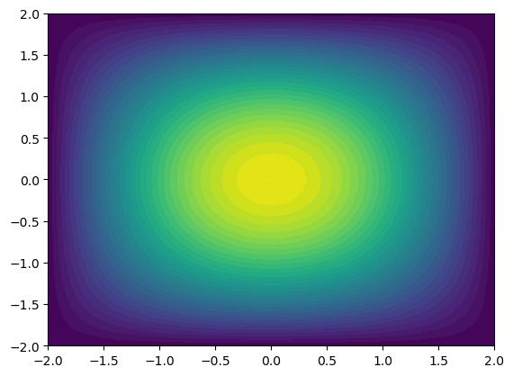
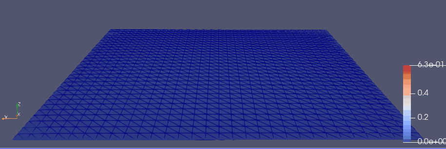
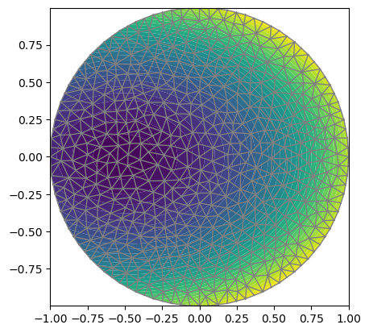
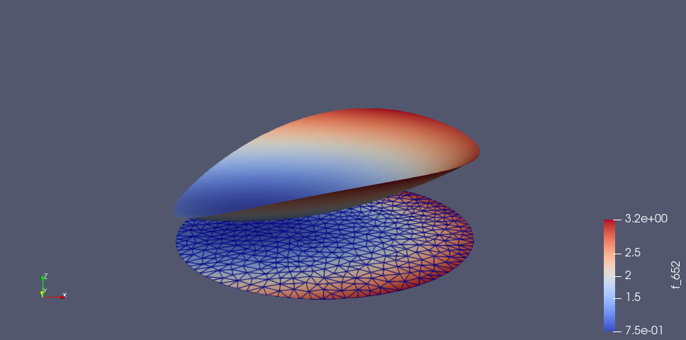

# 以泊松方程（第一边界条件）为例

$$
-\Delta u = f \qquad \boldsymbol{x} \in \Omega \\ u|_{\partial \Omega} =g
$$

范例而已， 本例提供的套路是通用的，大不了多看看文档。

关键的地方，我特意列出相关链接。

本文采用软件包： FEniCS。

<!--more-->

# 第1步：将问题转化成变分等式

$$
\begin{aligned}a(u,v)&=L(v)+\int_{\partial \Omega}{\frac{\partial g}{\partial n}vds}  \qquad \forall v \in \left\{v\in H^1(\Omega) \ : \ v|_{\partial \Omega} = g\right\} \\ a(u,v) &\overset{\Delta}{=} \int_\Omega{\nabla u \nabla v d\omega} \\ L(v) &\overset{\Delta}{=} \int_\Omega{f v d\omega} \end{aligned}
$$

因为第一边界条件可通过变换（$u \to u + g$）化归成0边值问题，所以只需要考虑对应的弱形式(0边界条件)：

$$
a(u,v)=L(v)  \qquad \forall v \in \left\{v\in H^1(\Omega) \ : \ v|_{\partial \Omega} = 0\right\} 
$$

解出0边值问题后，不难通过简单变换得到非零边值问题的解。（这步，`FEniCS`会自动帮我们作了，不必操心）。

**注意**：第二、三边界条件就没那么简单了，对应的`面积分项`是不可省略的。

问题具体化为，比如：

$$
\begin{aligned} f(x,y)&=-6 \\  g(x,y)&=1+x^2+2y^2 \\ & \\ \Omega&=\left\{(x,y)|x^2+y^2 \le 1\right\} \end{aligned}
$$

**特别说明**：后续Julia代码涉及的变量名，完全和上面的公式一致。

# 第2步：对求解域进行刨分

这里用到了`Circle`, 更多请查阅文档：

https://bitbucket.org/fenics-project/mshr/wiki/API

也可以通过一组顶点组成的多边形来逼近更复杂的求解域，然后再对这个多边形区域进行刨分，更详细查阅文档：

https://fenicsproject.org/docs/dolfin/1.4.0/python/demo/documented/mesh-generation/python/documentation.html

这里的求解域很简单，代码如下：


```julia
using Plots
pyplot()

using FEniCS

# 求解域Ω设定
Ω = Circle(Point([0.0,0.0]),1)
mesh = generate_mesh(Ω,16)

FEniCS.Plot(mesh)
```
    

    
    2-element Array{PyCall.PyObject,1}:
     PyObject <matplotlib.lines.Line2D object at 0x7f8ddf8bd7d0>
     PyObject <matplotlib.lines.Line2D object at 0x7f8ddf07d210>


# 第3步：构造基于网格的函数空间

`函数空间`(`FunctionSpace`)，记作$V$，其定义为：

$$
V = \left\{v\in H^1(\Omega)  \ : \ v|_{\partial \Omega} = g\right\}
$$

与此“孪生”对应：`测试函数空间`，记作$\hat{V}$：

$$
\hat{V} = \left\{v\in H^1(\Omega)  \ : \ v|_{\partial \Omega} = 0\right\}
$$

这里我们的`函数空间`选择最简单的线性插值。

- 所谓`试探函数`(`TrialFunction`), 特指$V$中的函数。

- 所谓`测试函数`(`testFunction`), 则特指$\hat{V}$中的函数。

https://fenicsproject.org/docs/dolfin/1.3.0/python/programmers-reference/functions/functionspace/FunctionSpace.html


```julia
# 试探函数空间
# 1阶多项式插值（线性插值）
V = FunctionSpace(mesh, "P", 1)

# 函数空间V上的试探函数u
u = TrialFunction(V)

# 函数空间V上的测试函数v
v = TestFunction(V);
```

# 第4步：边界条件及参数设定

关于边界条件的设定参数，可参见：

https://fenicsproject.org/docs/dolfin/1.4.0/python/programmers-reference/cpp/fem/DirichletBC.html


```julia
# 源f(x,y)
# f = Expression('-6', degree=0)
f = Constant(-6.0)

# 边界值g(x,y)
g = Expression("1 + x[0]*x[0] + 2*x[1]*x[1]", degree=2)

#function boundary(x, on_boundary)
#    return on_boundary
#end
bc = DirichletBC(V, g, "on_boundary");
```

# 第5步：变分方程的“直译”

几乎是前面数学公式的"直译", 需要注意的是： `dx` 是预定义量，代表`体元`, 对应公式中的$d\omega$。


```julia
# 定义变分问题(dx是预定的)
a = dot(grad(u), grad(v))*dx
L = f*v*dx;
```

# 第6步：求解并绘图

关于求解器`solve`，参见：

https://fenicsproject.org/docs/dolfin/1.3.0/python/programmers-reference/fem/solving/solve.html

但是在 `FEniCS.jl`中，分成了3个求解器（都是对fenics.solve的封装）：

https://github.com/SciML/FEniCS.jl/blob/master/src/jsolve.jl

1. 线性求解器: `solve`

2. 线性变分求解器： `lvsolve`   (本例所采用)

3. 非线性变分求解器： `nlvsolve`

至于`FeFunction`, 其实就是`fenics.Function`的封装：

- `FeFunction(V) = fenics.Function(V.pyobject)`


```julia
# 求解
u = FeFunction(V)  
lvsolve(a,L,u,bc)  

FEniCS.Plot(u)
FEniCS.Plot(mesh)
```
    


    Solving linear variational problem.

    2-element Array{PyCall.PyObject,1}:
     PyObject <matplotlib.lines.Line2D object at 0x7f8dde997910>
     PyObject <matplotlib.lines.Line2D object at 0x7f8dde997d10>

# 第7步：将数据导出，然后在ParaView中可视化

先用下面的代码导出数据为VTK文件。

然后在ParaView中打开，可以用交互的方式可视化（下图仅截图示意而已）

```julia
vtkfile = File("poisson/solution.pvd")
vtkfile << u.pyobject;  #exports the solution to a vtkfile
```


# 第8步：误差估计及其它

我们注意到，这个具体化的泊松问题的精确解，恰好就等于$g(x,y)=1+x^2+2y^2$，这种巧合源自：

$$
\Delta g(x,y) = 6
$$

恰好把$f(x,y)=-6$提供的源抵消了，也就是说，如果作变换： $u = U + g(x,y)$，可得到`无源零边界`的泊松问题, 对应的解$U=0$，所以精确解就是：$u=g(x,y)$。

于是可以计算标准差：

$$
E = \sqrt{\int_\Omega{(g-u)^2}d\omega}
$$

可用函数`errornorm`计算之：


```julia
errornorm(g, u, norm="L2")
```

    *** Warning: Degree of exact solution may be inadequate for accurate result in errornorm.

    0.00444692071683997

也可以直接计算标准差（**奇怪结果不一样，以后再细究**）：

```julia
#vertex_values_g = get_array(project(g, V))
# or
vertex_values_g = get_array(interpolate(g, V))
vertex_values_u = get_array(u)
sqrt(sum((vertex_values_g - vertex_values_u).^2))
```

    0.0541946910486183

查看结果数据：

- 1）根据表达式生成在网格顶点上的值(投影)

```julia
# pg = project(g, V)
# or
pg = interpolate(g, V)
```

    "Coefficient(FunctionSpace(Mesh(VectorElement(FiniteElement('Lagrange', triangle, 1), dim=2), 3), FiniteElement('Lagrange', triangle, 1)), 71)"

- 2) 查看网格顶点上的值,比如：

```julia
get_array(pg)
get_array(L)
get_array(u)
```

    549-element Array{Float64,1}:
     2.647985350348445
     2.593690657292863
     2.4339075463156465
     2.712889645782536
     2.3863642443300686
     2.1981490620535595
     2.1831070985479455
     2.4655691189520748
     2.7609431348948275
     2.5253575052502386
     2.302218396526692
     2.4686047402353437
     2.02311867450322
     ⋮
     2.261621580085735
     2.123167515460912
     2.1160030006867037
     2.2820357294253473
     2.2320866025105017
     2.176630600748635
     2.0517861914831785
     2.5936906572928624
     2.5253575052502386
     2.4686047402353433
     2.4007647581013947
     2.3454915028125263

# 初边值问题典型范例：热传导方程

$$
\left\{\begin{aligned}\frac{\partial u}{\partial t} &= \nabla^2 u + f   & \mathrm{on} \quad \Omega \times (0,T] \\ u &= u_D & \mathrm{on}\quad  \partial \Omega \times (0,T] \\ u &= u_0 & t=0  \end{aligned} \right .
$$

求解思路：对时间用差分法，对空间用有限元法。 进而有：

$$
\left\{\begin{aligned}a(u^{n+1},v) &= L_{n+1}(v) \qquad n\ge 1 , \quad  v \in \left\{v \in H^1(\Omega) \ : \ v|_{\partial \Omega} = 0\right\} \\ a(u,v) &\overset{\Delta}{=} \int_{\Omega}{(u v + \Delta t\nabla u \cdot \nabla v)d\omega}  \\ L_{n+1}(v) &\overset{\Delta}{=}  \int_{\Omega}{(u^n + \Delta t f^{n+1})v d\omega}  \\ u^0 &=  u_0  \end{aligned} \right .
$$

具体化为, 比如：

$$
\begin{aligned} f(x,y,t)&=0 \\  u_D(x,y,t)&=0 \\  u_0(x,y)&=e^{-a(x^2+y^2)},\quad a=5 \\ & \\ \Omega&=[-2,2]\times[-2,2], \quad t \in [0,2] \end{aligned}
$$


```julia

T = 2.0            # 时长
num_steps = 50     # 步数
Δt = T / num_steps # 步长

# 在解域空间生成网格
nx = ny = 30
mesh = RectangleMesh(Point([-2,-2]), Point([2,2]), nx, ny)

# 函数空间（线性插值）
V = FunctionSpace(mesh, "P", 1)

# 边界条件
bc = DirichletBC(V, Constant(0), "on_boundary")

# 初值
u_0 = Expression("exp(-a*pow(x[0], 2) - a*pow(x[1], 2))", degree=2, a=5)
u_n = interpolate(u_0, V)

# 定义变分问题
u = TrialFunction(V)
v = TestFunction(V)
f = Constant(0)

a = u*v*dx + Δt*dot(grad(u), grad(v))*dx
L = (u_n + Δt*f)*v*dx

# 创建VTK文件，用于保存解
vtkfile = File("heat_gaussian/solution.pvd")

# Time-stepping
u = FeFunction(V)
t = 0
for n in 1:num_steps
    # 当前时间
    t += Δt

    # 求解
    lvsolve(a,L,u,bc) 

    # 保存到文件，并叠加式绘图
    vtkfile << (u.pyobject, t)
    FEniCS.plot(u)

    # 更新上一时刻的解
    assign(u_n, u)
end
```



    
在ParaView中打开生成的VTK文件，进行适当可视化交互操作，然后录制成gif文件如下：



# 更复杂的边界条件（以泊松方程为例）

回到最开头的例子，但将泊松方程的边界条件修改为：

$$
\left\{\begin{aligned}-\Delta u &= f & \qquad \boldsymbol{x} \in \Omega \\ u &=u_L & \mathrm{on} \quad \partial \Omega_L \\ u &=u_R & \mathrm{on} \quad \partial \Omega_R  \\ \frac{\partial u}{\partial n} &=g & \mathrm{on} \quad \partial\Omega \end{aligned}\right.
$$

此时，对应的变分方程应改为：

$$
\begin{aligned}a(u,v)&=L(v) \qquad \forall v \in \left\{v\in H^1(\Omega) \ : \ v|_{\partial \Omega} = 0\right\} \\ a(u,v) &\overset{\Delta}{=} \int_\Omega{\nabla u \nabla v d\omega} \\ L(v) &\overset{\Delta}{=} \int_\Omega{f v d\omega} +\int_{\partial \Omega}{g v ds}  \end{aligned}
$$

问题具体化为(**注意**：提供的$u_L$和$u_R$必须保证其在边界上的连续性)，比如：

$$
\begin{aligned} f(x,y)&=-6 \\  u_L(x,y)&=2+x+y^2  \\  u_R(x,y)&=3+x^2 \\  g(x,y)&=4y \\ & \\ \Omega&=\left\{(x,y)|x^2+y^2 \le 1\right\} \\ \partial\Omega_L&=\left\{(x,y)|x^2+y^2 = 1, x \le 0 \right\} \\ \partial\Omega_R&=\left\{(x,y)|x^2+y^2 = 1, x > 0 \right\} \end{aligned}
$$

在下面的Julia代码中， 前两个边界条件体现在`DirichletBC`的设置中，而第三个边界条件体现在变分方程中。

**注意**：正如预定义量`dx`代表体元，`ds`也是预定义量，代表面元。


```julia
# 求解域Ω设定
Ω = Circle(Point([0.0,0.0]),1)
mesh = generate_mesh(Ω,16)

# 函数空间(线性插值)
V = FunctionSpace(mesh, "P", 1)
u = TrialFunction(V)
v = TestFunction(V)

# 源f(x,y)
f = Constant(-6.0)

# 左右边界条件
u_L = Expression("2 + x[0] + pow(x[1], 2)", degree=2)
bc_L = DirichletBC(V, u_L, "on_boundary && x[0]<=0")

u_R = Expression("3 + pow(x[0], 2)", degree=2)
bc_R = DirichletBC(V, u_L, "on_boundary && x[0]>0")

# 诺伊曼边界条件
g = Expression("4*x[1]", degree=1)

# 定义变分问题(dx 和 ds 都是预定义的)
a = dot(grad(u), grad(v))*dx
L = f*v*dx + g*v*ds

# 求解
u = FeFunction(V)  
lvsolve(a,L,u,[bc_L,bc_R]) 

vtkfile = File("poisson2/solution.pvd")
vtkfile << u.pyobject;  #exports the solution to a vtkfile

FEniCS.Plot(u)
FEniCS.Plot(mesh)

```

    



    Solving linear variational problem.

    2-element Array{PyCall.PyObject,1}:
     PyObject <matplotlib.lines.Line2D object at 0x7f4af82ef6d0>
     PyObject <matplotlib.lines.Line2D object at 0x7f4af82ef8d0>


在ParaView中打开生成的VTK文件，进行适当可视化交互操作，截图如下：




# 后记

本文着重有限元法的“套路”， 更多例子可参考：

https://fenicsproject.org/pub/tutorial/html/ftut1.html

至于，`ParaView`的用法，参考：

https://www.paraview.org/Wiki/The_ParaView_Tutorial
