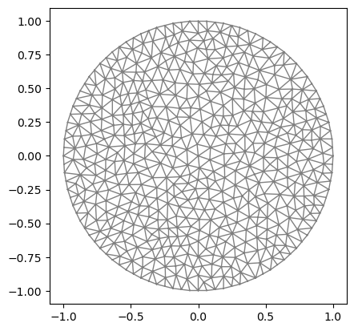
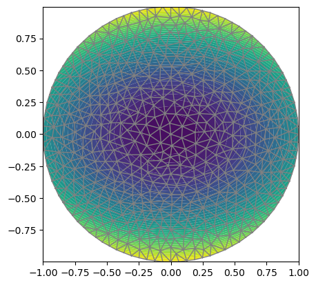
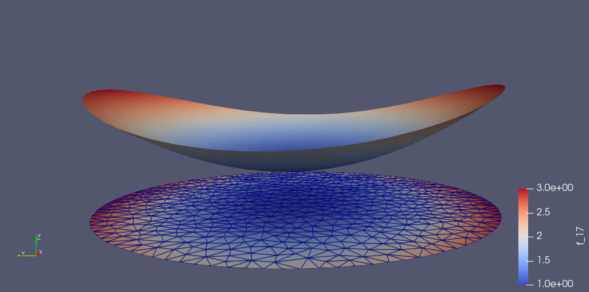

# 以泊松方程（第一边界条件）为例

$$
-\Delta u = f \qquad \boldsymbol{x} \in \Omega \\ u|_{\partial \Omega} =g
$$

范例而已， 本例提供的套路是通用的，大不了多看看文档。

关键的地方，我特意列出相关链接。

本文采用软件包： FEniCS。

<!--more-->

# 第1步：将问题转化成变分等式

$$
\begin{aligned}a(u,v)&=L(v)+\int_{\partial \Omega}{\frac{\partial g}{\partial n}vds}  \qquad \forall v \in \left\{v\in H^1(\Omega) \ : \ v|_{\partial \Omega} = g\right\} \\ a(u,v) &\overset{\Delta}{=} \int_\Omega{\nabla u \nabla v d\omega} \\ L(v) &\overset{\Delta}{=} \int_\Omega{f v d\omega} \end{aligned}
$$

但在`FEniCS`提供的算法中，我们只需要考虑对应的弱形式(0边界条件)：

$$
a(u,v)=L(v)  \qquad \forall v \in \left\{v\in H^1(\Omega) \ : \ v|_{\partial \Omega} = 0\right\} 
$$

至于消失的$\int_{\partial \Omega}{\frac{\partial g}{\partial n}vds}$，`FEniCS`提供的算法根据我们额外设定的边界条件，在内部帮我们自动处理了。

问题具体化为，比如：

$$
\begin{aligned} f(x,y)&=-6 \\  g(x,y)&=1+x^2+2y^2 \\ & \\ \Omega&=\left\{(x,y)|x^2+y^2 \le 1\right\} \end{aligned}
$$

**特别说明**：后续Julia代码涉及的变量名，完全和上面的公式一致。

# 第2步：对求解域进行刨分

这里用到了`Circle`, 更多请查阅文档：

https://bitbucket.org/fenics-project/mshr/wiki/API

也可以通过一组顶点组成的多边形来逼近更复杂的求解域，然后再对这个多边形区域进行刨分，更详细查阅文档：

https://fenicsproject.org/docs/dolfin/1.4.0/python/demo/documented/mesh-generation/python/documentation.html

这里的求解域很简单，代码如下：


```julia
using Plots
pyplot()

using FEniCS

# 求解域Ω设定
Ω = Circle(Point([0.0,0.0]),1)
mesh = generate_mesh(Ω,16)

FEniCS.Plot(mesh)
```
    

    
    2-element Array{PyCall.PyObject,1}:
     PyObject <matplotlib.lines.Line2D object at 0x7f8ddf8bd7d0>
     PyObject <matplotlib.lines.Line2D object at 0x7f8ddf07d210>


# 第3步：构造基于网格的试探函数空间

`函数空间`(`FunctionSpace`)，记作$V$，其定义为：

$$
V = \left\{v\in H^1(\Omega)  \ : \ v|_{\partial \Omega} = g\right\}
$$

与此“孪生”对应：`测试函数空间`，记作$\hat{V}$：

$$
\hat{V} = \left\{v\in H^1(\Omega)  \ : \ v|_{\partial \Omega} = 0\right\}
$$

这里我们的`函数空间`选择最简单的线性插值。

- 所谓`试探函数`(`TrialFunction`), 特指$V$中的函数。

- 所谓`测试函数`(`testFunction`), 则特指$\hat{V}$中的函数。

https://fenicsproject.org/docs/dolfin/1.3.0/python/programmers-reference/functions/functionspace/FunctionSpace.html


```julia
# 试探函数空间
# 1阶多项式插值（线性插值）
V = FunctionSpace(mesh, "P", 1)

# 函数空间V上的试探函数u
u = TrialFunction(V)

# 函数空间V上的测试函数v
v = TestFunction(V);
```

# 第4步：边界条件及参数设定

关于边界条件的设定参数，可参见：

https://fenicsproject.org/docs/dolfin/1.4.0/python/programmers-reference/cpp/fem/DirichletBC.html


```julia
# 源f(x,y)
# f = Expression('-6', degree=0)
f = Constant(-6.0)

# 边界值g(x,y)
g = Expression("1 + x[0]*x[0] + 2*x[1]*x[1]", degree=2)

#function boundary(x, on_boundary)
#    return on_boundary
#end
bc = DirichletBC(V, g, "on_boundary");
```

# 第5步：变分方程的“直译”

几乎是前面数学公式的"直译", 需要注意的是： `dx` 是预定义量，代表`体元`, 对应公式中的$d\omega$。


```julia
# 定义变分问题(dx是预定的)
a = dot(grad(u), grad(v))*dx
L = f*v*dx;
```

# 第6步：求解并绘图

关于求解器`solve`，参见：

https://fenicsproject.org/docs/dolfin/1.3.0/python/programmers-reference/fem/solving/solve.html

但是在 `FEniCS.jl`中，分成了3个求解器（都是对fenics.solve的封装）：

https://github.com/SciML/FEniCS.jl/blob/master/src/jsolve.jl

1. 线性求解器: `solve`

2. 线性变分求解器： `lvsolve`   (本例所采用)

3. 非线性变分求解器： `nlvsolve`

至于`FeFunction`, 其实就是`fenics.Function`的封装：

- `FeFunction(V) = fenics.Function(V.pyobject)`


```julia
# 求解
u = FeFunction(V)  
lvsolve(a,L,u,bc)  

FEniCS.Plot(u)
FEniCS.Plot(mesh)
```
    



    Solving linear variational problem.

    2-element Array{PyCall.PyObject,1}:
     PyObject <matplotlib.lines.Line2D object at 0x7f8dde997910>
     PyObject <matplotlib.lines.Line2D object at 0x7f8dde997d10>

# 第7步：将数据导出，然后在ParaView中可视化

先用下面的代码导出数据为VTK文件。

然后在ParaView中打开，可以用交互的方式可视化（下图仅截图示意而已）

```julia
vtkfile = File("poisson/solution.pvd")
vtkfile << u.pyobject;  #exports the solution to a vtkfile
```



# 第8步：误差估计及其它

我们注意到，这个具体化的泊松问题的精确解，恰好就等于$g(x,y)=1+x^2+2y^2$，这种巧合源自：

$$
\Delta g(x,y) = 6
$$

恰好把$f(x,y)=-6$提供的源抵消了，也就是说，如果作变换： $u = U + g(x,y)$，可得到`无源零边界`的泊松问题, 对应的解$U=0$，所以精确解就是：$u=g(x,y)$。

于是可以计算标准差：

$$
E = \sqrt{\int_\Omega{(g-u)^2}d\omega}
$$

可用函数`errornorm`计算之：


```julia
errornorm(g, u, norm="L2")
```

    *** Warning: Degree of exact solution may be inadequate for accurate result in errornorm.

    0.00444692071683997

也可以直接计算标准差（**奇怪结果不一样，以后再细究**）：

```julia
#vertex_values_g = get_array(project(g, V))
# or
vertex_values_g = get_array(interpolate(g, V))
vertex_values_u = get_array(u)
sqrt(sum((vertex_values_g - vertex_values_u).^2))
```

    0.0541946910486183

查看结果数据：

- 1）根据表达式生成在网格顶点上的值(投影)

```julia
# pg = project(g, V)
# or
pg = interpolate(g, V)
```

    "Coefficient(FunctionSpace(Mesh(VectorElement(FiniteElement('Lagrange', triangle, 1), dim=2), 3), FiniteElement('Lagrange', triangle, 1)), 71)"

- 2) 查看网格顶点上的值,比如：

```julia
get_array(pg)
get_array(L)
get_array(u)
```

    549-element Array{Float64,1}:
     2.647985350348445
     2.593690657292863
     2.4339075463156465
     2.712889645782536
     2.3863642443300686
     2.1981490620535595
     2.1831070985479455
     2.4655691189520748
     2.7609431348948275
     2.5253575052502386
     2.302218396526692
     2.4686047402353437
     2.02311867450322
     ⋮
     2.261621580085735
     2.123167515460912
     2.1160030006867037
     2.2820357294253473
     2.2320866025105017
     2.176630600748635
     2.0517861914831785
     2.5936906572928624
     2.5253575052502386
     2.4686047402353433
     2.4007647581013947
     2.3454915028125263

# 后记

本文着重有限元法的“套路”， 更多例子可参考：

https://fenicsproject.org/pub/tutorial/html/ftut1.html

至于，`ParaView`的用法，参考：

https://www.paraview.org/Wiki/The_ParaView_Tutorial
