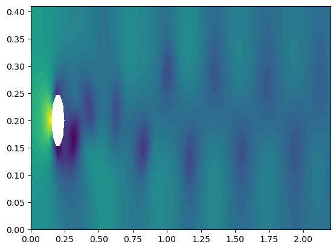
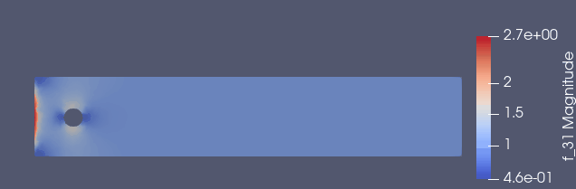
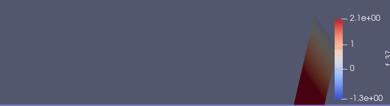

# 纳维-斯托克斯方程组

**纳维-斯托克斯方程**:

$$
\color{red}{\frac{\partial \boldsymbol{u}}{\partial t}+(\boldsymbol{u} \cdot \nabla)\boldsymbol{u}=\frac{1}{\rho}\nabla\cdot \boldsymbol{\sigma}+\boldsymbol{f}}
$$

其中，张量$\boldsymbol{\sigma}$是`应力张量`, 取决于具体流体的特性假设，比如：`牛顿流体`。

**连续性方程**：

$$
\frac{\partial \rho}{\partial t}+\nabla \cdot (\rho \boldsymbol{u})=0
$$

<!--more-->

特别地，对`不可压缩流体`而言：

$$
\color{red}{ \nabla \cdot \boldsymbol{u}=0}
$$

**牛顿流体的特性假设**：

$$
\color{blue}{\begin{aligned}\sigma(\boldsymbol{u},p) &= -p I + 2\mu \boldsymbol{\epsilon}(\boldsymbol{u}) \\ \boldsymbol{\epsilon}(\boldsymbol{u})&= \frac{1}{2}\left(\nabla \boldsymbol{u} + (\nabla \boldsymbol{u})^T \right)\end{aligned}}
$$

在$\color{blue}{牛顿流体假设}$下，这两个$\color{red}{红色方程}$的组成**不可压缩牛顿流体**的运动方程组。

对平面流体而言，这组方程有有三个方程，有三个待求量： 速度场$u(x,y,t)$和压强场$p(x,y,t)$。  给定边界条件，就可以求解了。

# 几个必要公式

$$
\begin{aligned}\boldsymbol{\epsilon}(\boldsymbol{u}) \cdot \nabla\boldsymbol{v}& =\epsilon_{ij}(\boldsymbol{u}) \frac{\partial v_i}{\partial x_j} \qquad \text{爱因斯坦求和约定} \\  &=\frac{1}{2}\left(\frac{\partial u_i}{\partial x_j}+\frac{\partial u_j}{\partial x_i}\right) \frac{\partial v_i}{\partial x_j}  \\  &=\frac{1}{2}\left(\frac{\partial u_i}{\partial x_j} \frac{\partial v_i}{\partial x_j}+\frac{\partial u_i}{\partial x_j}\frac{\partial v_j}{\partial x_i}\right) \qquad \text{括号中第二项：由于缩并，指标交换不变}  \\  &=\frac{\partial u_i}{\partial x_j}\frac{1}{2}\left(\frac{\partial v_i}{\partial x_j}+\frac{\partial v_j}{\partial x_i}\right) \\  &=\frac{1}{2}\left(\frac{\partial u_i}{\partial x_j}+\frac{\partial u_j}{\partial x_i}\right) \frac{1}{2}\left(\frac{\partial v_i}{\partial x_j}+\frac{\partial v_j}{\partial x_i}\right) \qquad \text{由于缩并，指标交换不变} \\  &=\boldsymbol{\epsilon}(\boldsymbol{u}) \cdot  \boldsymbol{\epsilon}(\boldsymbol{v}) \qquad \text{这里的点乘，实际是双重指标缩并} \end{aligned}
$$

即(同时有第二式)：

$$
\color{blue}{\boldsymbol{\epsilon}(\boldsymbol{u}) \cdot \nabla\boldsymbol{v} = \boldsymbol{\epsilon}(\boldsymbol{u}) \cdot  \boldsymbol{\epsilon}(\boldsymbol{v})  =  \nabla\boldsymbol{u} \cdot  \boldsymbol{\epsilon}(\boldsymbol{v}) }
$$

$$
\color{blue}{\boldsymbol{\sigma}(\boldsymbol{u},p) \cdot \nabla\boldsymbol{v} = \boldsymbol{\sigma}(\boldsymbol{u},p) \cdot  \boldsymbol{\epsilon}(\boldsymbol{v}) }
$$

不难根据“由于缩并，指标交换不变”类似推导出：

$$
\color{blue}{\boldsymbol{a} \cdot \left[\boldsymbol{\epsilon}(\boldsymbol{u}) \cdot \boldsymbol{v}\right] = \boldsymbol{a} \cdot \left[\nabla \boldsymbol{u} \cdot \boldsymbol{v}\right]}
$$

在此基础上，容易推导出：

$$
\color{red}{\left[\nabla \cdot \boldsymbol{\sigma}(\boldsymbol{u},p)\right]\cdot \boldsymbol{v} =2\mu\nabla \cdot \left[\nabla \boldsymbol{u} \cdot \boldsymbol{v}\right] -\nabla \cdot (p \boldsymbol{v})  - \boldsymbol{\sigma}(\boldsymbol{u},p) \cdot  \boldsymbol{\epsilon}(\boldsymbol{v})}
$$

# 将运动方程转换成变分等式

利用前面的公式，将纳维-斯托克斯方程改写成变分等式（同时用了`斯托克斯定理`）

$$
\left<\frac{\partial \boldsymbol{u}}{\partial t},\boldsymbol{v}\right>+\left<\boldsymbol{u}\cdot \nabla \boldsymbol{u},\boldsymbol{v}\right>+\frac{1}{\rho}\left<\boldsymbol{\sigma}(\boldsymbol{u},p),\boldsymbol{\epsilon}(\boldsymbol{v})\right> \\ \qquad \qquad  \qquad  \qquad  \qquad  + \frac{1}{\rho}\left< p \boldsymbol{n}, \boldsymbol{v} \right>_{\partial \Omega}-\frac{2\mu}{\rho}\left<\frac{\partial \boldsymbol{u}}{\partial n},\boldsymbol{v}\right>_{\partial \Omega} - \left<\boldsymbol{f},\boldsymbol{v}\right>=0
$$

约定：

$$
\left<\boldsymbol{u},\boldsymbol{v}\right> \overset{\Delta}{=}\int_\Omega{\boldsymbol{u} \cdot \boldsymbol{v}d\omega}\qquad \left<\boldsymbol{u},\boldsymbol{v}\right>_{\partial \Omega} \overset{\Delta}{=}\int_{\partial \Omega}{\boldsymbol{u} \cdot \boldsymbol{v}ds} 
$$

# 对时间有限差分 第1步：

已知$\boldsymbol{u}^n,p^n$，求$\color{red}{\boldsymbol{u}^*}$

$$
\boxed{\begin{aligned}\rho\left<\frac{\boldsymbol{u}^*-\boldsymbol{u}^n}{\Delta t} , \boldsymbol{v}\right>+\rho\left<\boldsymbol{u}^n\cdot \nabla \boldsymbol{u}^n,\boldsymbol{v}\right>+\left<\boldsymbol{\sigma} ( \boldsymbol{u}^{n+\frac{1}{2}},p^n),\boldsymbol{\epsilon}(\boldsymbol{v})\right> \\ +\left< p^n  \boldsymbol{n}, \boldsymbol{v} \right>_{\partial \Omega}-2\mu\left<\frac{\partial \boldsymbol{u}^{n+\frac{1}{2}}}{\partial n},\boldsymbol{v}\right>_{\partial \Omega}- \rho\left<\boldsymbol{f}^{n+1},\boldsymbol{v}\right>=0 \end{aligned}}
$$

其中：

$$
\frac{\partial \boldsymbol{u}}{\partial t} \approx \frac{\boldsymbol{u}^*-\boldsymbol{u}^n}{\Delta t}  \qquad \boldsymbol{u}^{n+\frac{1}{2}} \approx \frac{\boldsymbol{u}^*+\boldsymbol{u}^n}{2}
$$

# 对时间有限差分 第2步：

已知$\boldsymbol{u}^*,p^n$，求$\color{red}{p^{n+1}}$:

第1步对应得运动差分方程实际是：

$$
 \frac{\boldsymbol{u}^*-\boldsymbol{u}^n}{\Delta t}+(\boldsymbol{u}^n \cdot \nabla)\boldsymbol{u}^n=\frac{1}{\rho}\nabla\cdot \boldsymbol{\sigma}(\boldsymbol{u}^{n+\frac{1}{2}}, p^n)+\boldsymbol{f}^n
$$

第2步需要运动差分方程则是：

$$
 \frac{\boldsymbol{u}^{n+1}-\boldsymbol{u}^n}{\Delta t}+(\boldsymbol{u}^n \cdot \nabla)\boldsymbol{u}^n=\frac{1}{\rho}\nabla\cdot \boldsymbol{\sigma}(\boldsymbol{u}^{n+\frac{1}{2}},p^{n+1})+\boldsymbol{f}^n
$$

前后两式相减得：

$$
 \frac{\boldsymbol{u}^*-\boldsymbol{u}^{n+1}}{\Delta t}=\frac{1}{\rho}\left(\nabla p^{n+1}-\nabla p^n\right)
$$

考虑到$\nabla \cdot \boldsymbol{u}^{n+1}=0$，对上式两边求散度后得：

$$
\frac{\nabla \cdot \boldsymbol{u}^*}{\Delta t}=\frac{1}{\rho}\left(\nabla^2 p^{n+1}-\nabla^2 p^n\right)
$$

根据这个等式可构建出变分等式：

$$
\boxed{\left<\nabla p^{n+1},\nabla q\right>=\left<\nabla p^n,\nabla q\right>-\frac{\rho}{\Delta t}\left<\nabla \cdot u^*, q\right>}
$$

# 对时间有限差分 第3步：

已知$\boldsymbol{u}^*,p^n,p^{n+1}$，求$\color{red}{\boldsymbol{u}^{n+1}}$:

从第2步的公式：

$$
 \frac{\boldsymbol{u}^*-\boldsymbol{u}^{n+1}}{\Delta t}=\frac{1}{\rho}\left(\nabla p^{n+1}-\nabla p^n\right)
$$

出发, 根据这个等式可构建出变分等式：


$$
\boxed{\left<\boldsymbol{u}^{n+1},\boldsymbol{v}\right>=\left<\boldsymbol{u}^*,\boldsymbol{v}\right>-\frac{\Delta t}{\rho}\left<\nabla\left(p^{n+1}-p^n\right),\boldsymbol{v}\right>}
$$

# 实现代码

前面方框中的公式，将在下面的代码中直接用到。

求解区域如图：


具体边界条件见有详细注释的代码。


```julia
using Plots
pyplot()

using FEniCS

# 参数：ρ,μ,Δt
T = 5            
num_steps = 5000  
Δt = T / num_steps 
μ = 0.001 
ρ = 1

# 解域及网格生成
channel = Rectangle(Point([0.0, 0.0]), Point([2.2, 0.41]))
cylinder = Circle(Point([0.2, 0.2]), 0.05)
Ω = channel - cylinder
mesh = generate_mesh(Ω, 64)

# 函数空间：速度场空间 和 压强场空间
V = VectorFunctionSpace(mesh, "P", 2)
Q = FunctionSpace(mesh, "P", 1)

# 定义边界： 入口，出口，墙，圆柱障碍
inflow   = "near(x[0], 0)"
outflow  = "near(x[0], 2.2)"
walls    = "near(x[1], 0) || near(x[1], 0.41)"
cylinder = "on_boundary && x[0]>0.1 && x[0]<0.3 && x[1]>0.1 && x[1]<0.3"

# 入口边界的速度
inflow_profile = ("4.0*1.5*x[1]*(0.41 - x[1]) / pow(0.41, 2)", "0")

# 速度场边界条件
bcu_inflow = DirichletBC(V, Expression(inflow_profile, degree=2), inflow)
bcu_walls = DirichletBC(V, Constant((0, 0)), walls)
bcu_cylinder = DirichletBC(V, Constant((0, 0)), cylinder)
bcu = [bcu_inflow,bcu_walls,bcu_cylinder]

# 压力场边界条件
bcp_outflow = DirichletBC(Q, Constant(0), outflow)
bcp = [bcp_outflow]

# 下一时刻（待求）速度场u,  求解后保存在u_
u = TrialFunction(V)
u_ = FeFunction(V)

# 下一时刻（待求）压力场p,  求解后保存在p_
p = TrialFunction(Q)
p_ = FeFunction(Q)

# 速度场测试函数 和 压力场测试函数
v = TestFunction(V)
q = TestFunction(Q)

# 当前时刻（已知）速度场u 和 压力场p
u_n = FeFunction(V)
p_n = FeFunction(Q)


# (u^* + u^n)/2
# 注意：其中包含待求函数 u (即，u^*)
# 所以，包含U的变分方程F的a(u,v)必须用 lhs(F)求出
# 对应的L(v)则须用 rhs(F)求出
U  = 0.5*(u_n + u)

# 法线
n  = FacetNormal(mesh)

# 力
f  = Constant((0, 0))

# 对称梯度
function ϵ(u)
    return sym(nabla_grad(u))
end
# 引力张量
function σ(u, p)
    return 2*μ*ϵ(u) - p*Identity(len(u))
end

# 第1步的变分方程:  (u^n,p^n) ->  u^*      
# 待求的u^*采用u， 结果计划保存在u_
F1 = ρ*dot((u - u_n) / Δt, v)*dx  + ρ*dot(dot(u_n, nabla_grad(u_n)), v)*dx + 
            inner(σ(U, p_n), ϵ(v))*dx  + dot(p_n*n, v)*ds - 
            dot(2*μ*nabla_grad(U)*n, v)*ds   - ρ*dot(f, v)*dx
a1 = lhs(F1)
L1 = rhs(F1)

# 第2步的变分方程:  (u^*,p^n) ->  p^{n+1}  
# u^*  采用第1步的结果 u_
# 待求的p^{n+1}采用p， 结果计划保存在p_
a2 = dot(nabla_grad(p), nabla_grad(q))*dx
L2 = dot(nabla_grad(p_n), nabla_grad(q))*dx - (ρ/Δt)*div(u_)*q*dx

# 第3步的变分方程:  (u^*,p^n, p^{n+1}) ->  u^{n+1}   
# (u^*, p^{n+1})  分别采用第1、2步的结果 (u_,p_)
# 待求的u^{n+1}采用u， 结果计划保存在u_
a3 = dot(u, v)*dx
L3 = dot(u_, v)*dx - (Δt/ρ)*dot(nabla_grad(p_ - p_n), v)*dx

# 三个变分方程对应的矩阵
A1 = assemble(a1)
A2 = assemble(a2)
A3 = assemble(a3)

# 将边界条件附加到矩阵上
[apply(bc,A1) for bc in bcu]
[apply(bc,A2) for bc in bcp]

# 创建XDMF文件（可视化）
xdmffile_u = XDMFFile("navier_stokes_cylinder/velocity.xdmf")
xdmffile_p = XDMFFile("navier_stokes_cylinder/pressure.xdmf")

# 创建时间序列
timeseries_u = TimeSeries("navier_stokes_cylinder/velocity_series")
timeseries_p = TimeSeries("navier_stokes_cylinder/pressure_series")

# 保存网格
File("navier_stokes_cylinder/cylinder.xml.gz",mesh)

global t = 0
for n in 0:(num_steps-1)

    # 当前时间
    global t += Δt

    # 第一步
    # lvsolve(a1,L1,u_,bcu)  # 这个方法求解很慢
    # 下面的方法更块的原因是，在循环前已经生成了变分方程对应的矩阵
    b1 = assemble(L1)
    [apply(bc,b1) for bc in bcu]
    solve(A1, vector(u_), b1, "bicgstab", "hypre_amg")

    # 第二步
    # lvsolve(a2,L2,p_,bcp) 
    b2 = assemble(L2)
    [apply(bc,b2) for bc in bcp]
    solve(A2, vector(p_), b2, "bicgstab", "hypre_amg")

    # 第三步
    # lvsolve(a3,L3,u_,bcu) 
    b3 = assemble(L3)
    solve(A3, vector(u_), b3, "cg", "sor")
    
    # 更新数据
    assign(u_n,u_)
    assign(p_n,p_)
    
    if n%25 == 0 || n == num_steps-1
        write(xdmffile_u,u_, t)
        write(xdmffile_p,p_, t)
        
        store(timeseries_u,vector(u_), t)
        store(timeseries_p,vector(p_), t)
        
        println("第",n,"步\t max:", max(get_array(u_)...))
        
        # Plot solution
        FEniCS.plot(u_)
        FEniCS.plot(p_)
    end
end

# 确保文件不被损坏
xdmffile_u.close()
xdmffile_p.close()
```

    第0步	 max:2.739542375402953
    第25步	 max:1.9848943489237132
    第50步	 max:1.917539036089884

... ...

    第4950步	 max:2.178513430654289
    第4975步	 max:2.1431069545490455
    第4999步	 max:2.1574859438440463

    


用`ParaView`渲染的结果如下：





