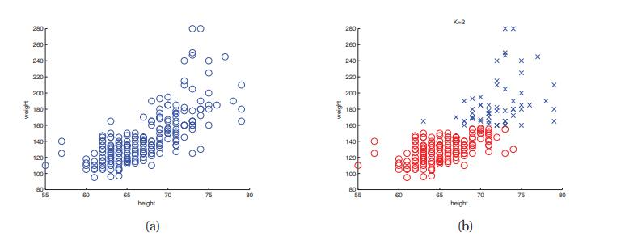
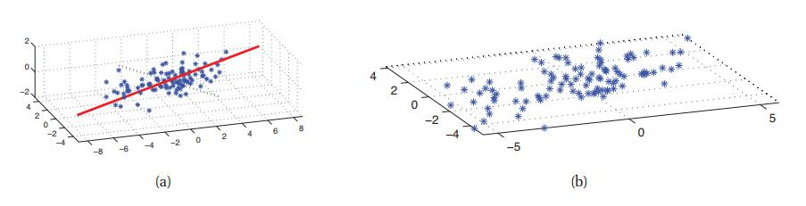
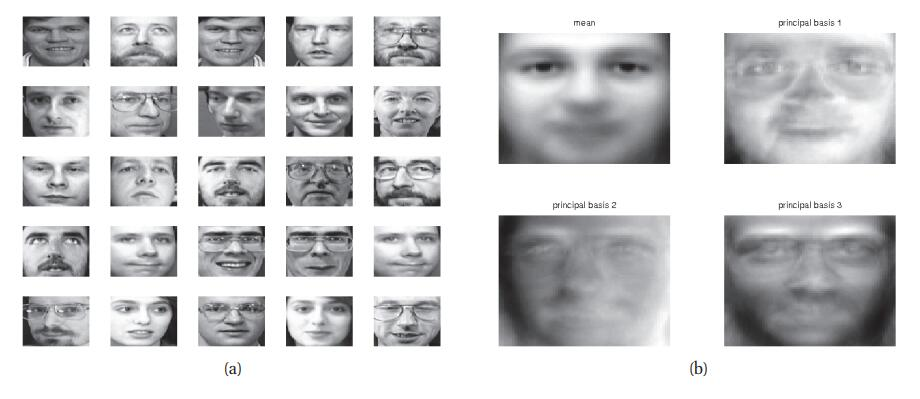
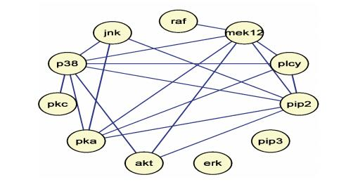
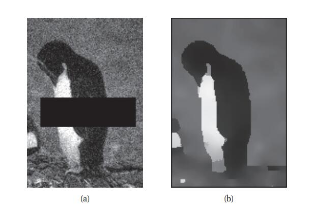
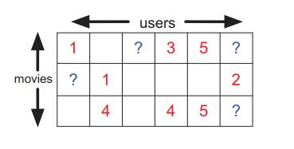

# 1.3 无监督学习

[**返回本章目录**]()

我们现在考虑**无监督学习**，我们只给出输出数据，没有任何输入。目标是在数据中发现“有趣的结构”;这有时被称为**知识发现**。与监督学习不同，我们没有被告知每个输入所期望输出是什么。相反，我们将我们的任务形式化为**密度估计**中的一种，也就是说，我们想要构建形如$$p(\boldsymbol{x}_i | \boldsymbol{\theta})$$的模型。与有监督情形有两点不同。首先，我们写了$$p(\boldsymbol{x}_i | \boldsymbol{\theta})$$而不是$$p(y_i | \boldsymbol{x}_i,\boldsymbol{\theta})$$;也就是说，监督学习是条件密度估计，而无监督学习是无条件密度估计。其次，$$\boldsymbol{x}_i$$是特征向量，因此我们需要创建多变量概率模型。相比之下，在监督学习中，$$y_i$$通常只是我们试图预测的单个变量。这意味着对于大多数监督学习问题，我们可以使用单变量概率模型（参数依赖的输入），这显着简化了问题。 （我们将在第19章讨论多输出分类，我们将在其中看到它还涉及多变量概率模型。）

无监督学习可以说是人类和动物学习的典型。 它也比监督学习更广泛适用，因为它不需要人类专家来手动标记数据。 标记数据不仅价格昂贵 ，而且它包含的信息相对较少，当然不足以可靠地估计复杂模型的参数。 多伦多大学着名ML教授Geoff Hinton说：

> 当我们学会看时，没有人告诉我们正确答案是什么 - 我们只是看看。 每隔一段时间，你的母亲就会说“那只狗”，但那信息很少。 如果您获得一些信息 - 即使每秒一位 - 那么你会很幸运。 大脑的视觉系统有$$10^{14}$$个神经连接。 而你只能活$$10^9$$秒。 所以每秒学习一位是没用的。 你需要更多像每秒$$10^5$$位。 而且只有一个地方可以获得那么多信息：来自输入本身。 - Geoffrey Hinton，1996年（引自（Gorder 2006））。

下面我们描述一些无监督学习的典型例子。

## 1.3.1 发现聚类

作为无监督学习的典型示例，考虑将数据聚集到各组的**聚类**问题。 例如，图1.8（a）绘制了一些2d数据，表示一组210人的身高和体重。 似乎可能存在各种集群或子集，尽管尚不清楚有多少集群或子集。 设$$K$$表示簇的数量。 我们的第一个目标是估计聚类数量的分布，$$p(K | \mathcal{D})$$; 这告诉我们数据中是否有子群体。 为简单起见，我们经常通过其众数来近似这个分布$$p(K | \mathcal{D}), K^{*} =\underset{K}{\rm argmax} p(K | \mathcal{D})$$。 在监督的情况下，我们被告知有两个类别（男性和女性），但在无监督的情况下，我们可以自由选择我们喜欢的多个或几个集簇。 挑选“正确”复杂度的模型称为模型选择，并将在下面详细讨论。

我们的第二个目标是估计每个点所属的簇。 令$$z_i\in {1,\dots,K}$$表示分配了数据点$$i$$的簇。 （$$z_i$$是**隐藏**或**潜在**变量的一个例子，因为在训练集中从未观察到它。）我们可以通过计算$$z_i^{*} =\underset{k}{\rm argmax} p(z_i = k | \boldsymbol{x}_i，\mathcal{D})$$来推断每个数据点属于哪个簇。 如图1.8（b）所示，我们使用不同的颜色来指示分配，假设$$K = 2$$。

> 如图1.8 \(a\) 一些人的身高和体重。 （b）使用K = 2簇的可能聚类。 由_kmeansHeightWeight_生成的图。

在本书中，我们关注**基于模型聚类**，这意味着我们将拟合一个概率模型到数据，而不是运行一些特设的算法。 基于模型的方法的优点是可以客观地比较不同类型的模型（就它们分配给数据的可能性而言），我们可以将它们组合成更大的系统，等等。这里有一些聚类的实际应用。

* 在天文学中，**AutoClass**系统（Cheeseman et al.1988）基于聚类天体物理测量发现了一种新型恒星。
* 在电子商务中，通常基于用户的购买或网上冲浪行为将用户聚类成组，然后向每个组发送定制的目标广告（参见例如（Berkhin 2006））。
* 在生物学中，通常将流式细胞术数据聚类成组，以发现不同的细胞亚群（参见例如（Lo等人，2009））。

## 1.3.2 发现潜在因素

在处理高维数据时，通过将数据投影到较低维度子空间\(以捕获数据“本质”\)来降低纬度，这通常是有用的。 这称为**降维**。 一个简单的例子如图1.9所示，我们将一些3d数据投影到2d平面。 2d近似是非常好的，因为大多数点靠近该子空间。 减少到1d将涉及将点投射到图1.9（a）中的红线上; 这将是一个相当差的近似值。 （我们将在第12章中使这一概念更加精确。）

这种技术背后的动机是尽管数据可能看起来很维数高，但可能只有少量的可变度，对应于**潜在因素**。 例如，在对人脸图像的外观进行建模时，可能只有少数潜在因素描述了大部分的可变性，例如照明，姿势，身份等，如图1.10所示。

> 图1.9 \(a\) 嵌入3d中的2d线性子空间上的一组点。 红色实线是第一个主要成分方向。 黑色虚线是第二个次要成分方向。 \(b\) 数据的2D表示。 由_pcaDemo3d_生成的图。

> 图1.10 a）来自Olivetti人脸数据库的25个随机选择的64×64像素图像。 （b）均值和前三个主成分基矢量（特征脸）。 由_pcaImageDemo_生成的图。

当用作其他统计模型的输入时，这种低维表示通常会产生更好的预测准确度，因为它们关注对象的“本质”，过滤掉不必要的特征。 而且，低维表示对于实现快速最近邻搜索是有用的，并且二维投影对于**可视化**高维数据非常有用。

降维的最常用方法称为**主成分分析**或**PCA**。 这可以被认为是（多输出）线性回归的无监督版本，其中我们观察到高维响应$$\boldsymbol{y}$$，而不是低维“原因”$$\boldsymbol{z}$$。 因此模型原本形式为$$\boldsymbol{z} \to \boldsymbol{y}$$; 在这里，我们必须“反转箭头”，并从观察到的高维$$\boldsymbol{y}$$推断出潜在的低维$$\boldsymbol{z}$$。 详细信息请参见第12.1节。

降维，特别是PCA，已经应用于许多不同领域。 包括以下一些例子：

* 在生物学中，通常使用PCA来解释基因微阵列数据，以解释这样的事实，即每个测量通常是许多基因的结果，这些基因通过它们属于不同生物途径的事实而与它们的行为相关。
* 在自然语言处理中，通常使用称为潜在语义分析的PCA变体来进行文档检索（参见第27.2.2节）。
* 在信号处理（例如，声学或神经信号）中，通常使用ICA（其是PCA的变体）将信号分离到它们的不同源中（参见第12.6节）。
* 在计算机图形学中，通常将运动捕捉数据投影到低维空间，并使用它来创建动画。 有关解决此类问题的一种方法，请参见第15.5节。

## 1.3.3 发现图结构

有时我们测量一组相关变量，我们想要发现哪些与其他变量最相关。 这可以用图$$G$$表示，其中节点代表变量，边代表变量之间的直接相关性（当我们讨论图形模型时，我们将在第10章中做到这一点）。 然后我们可以从数据中学习这个图结构，即我们计算$$\hat{G} = {\rm argmax} p(G | \mathcal{D})$$。

与一般的无监督学习一样，学习稀疏图有两个主要应用：发现新知识，并获得更好的联合概率密度估计。 我们现在给出一些例子。

* 学习稀疏图形模型的大部分动机来自系统生物学界。 例如，假设我们测量细胞中某些蛋白质的磷酸化状态（Sachs等人，2005）。 图1.11给出了从该数据中学习的图结构示例（使用第26.7.2节中讨论的方法）。 另一个例子是史密斯等人（2006）表明，人们可以从时间序列的脑电图数据中恢复某种鸟类神经“接线图”。 恢复的结构与这部分鸟脑的已知功能连接性非常匹配。
* 在某些情况下，我们对解释图形结构不感兴趣，我们只想用它来建模相关性并进行预测。 其中一个例子是金融投资组合管理，其中大量不同股票之间协方差的准确模型很重要。 Carvalho和West（2007）表明，通过学习稀疏图，然后使用它作为交易策略的基础，有可能比没有利用稀疏图的方法表现更好（即赚更多的钱）。 另一个例子是预测高速公路上的交通拥堵。 Horvitz等人（2005）描述了一个名为JamBayes的部署系统，用于预测西雅图地区的交通流量; 使用图形模型进行预测，其结构是从数据中学习的。

> 图1.11 使用图形lasso（第26.7.2节）学习的稀疏无向高斯图形模型应用于一些流式细胞仪数据（来自（Sachs等人2005）），其测量11种蛋白质的磷酸化状态。 由ggmLassoDemo生成的图。

## 1.3.4 矩阵完成

有时我们会丢失数据，即值未知的变量。 例如，我们可能进行了调查，有些人可能没有回答某些问题。 或者我们可能有各种传感器，其中一些传感器失效。 相应的设计矩阵将在其中具有“洞”; 这些缺失的条目通常由**NaN**表示，其代表“不是数字”。 **插补**的目的是推断缺失条目的合理值。 这有时称为**矩阵完成**\(matrix completion\)。 下面我们举一些示例应用程序。

### 1.3.4.1 图像修复

一个类似插补任务的有趣例子被称为图像修复。 目标是在具有真实纹理的图像中“填充”孔（例如，由于划痕或遮挡）。 如图1.12所示，我们对图像进行去噪处理，并对隐藏在遮挡后面的像素进行处理。 这可以通过在给定一组干净图像的情况下构建像素的联合概率模型，然后在给定已知变量（像素）的情况下推断未知变量（像素）来解决。 这有点像市场篮子分析，除了数据是实值和空间结构，因此我们使用的概率模型的种类是完全不同的。 有关可能的选择，请参见第19.6.2.7节和第13.8.4节。

> 图1.12 （a）带有遮挡物的嘈杂图像。 （b）基于成对MRF模型的基础像素强度的估计。 资料来源：（Felzenszwalb和Huttenlocher，2006年）的图8。 与Pedro Felzenszwalb的使用许可一起使用。

### 1.3.4.2 协同过滤

类似插补任务的另一个有趣示例称为**协同过滤**\(Collaborative filtering\)。 这方面的一个常见例子是根据他们和其他人如何评价已经看过的电影来预测人们想要观看的电影。 关键的想法是预测不是基于电影或用户的特征（尽管可能是），而仅仅基于评级矩阵。 更确切地说，我们有一个矩阵$$\boldsymbol{X}$$，其中$$\boldsymbol{X}(m,u)$$是电影$$m$$的用户$$u$$的评级（比如1到5之间的整数，其中1表示不喜欢，5表示）。 请注意，$$\boldsymbol{X}$$中的大多数条目都将丢失或未知，因为大多数用户不会评分大多数电影。 因此，我们只观察$$\boldsymbol{X}$$矩阵的一小部分，我们想要预测不同的子集。 特别是，对于任何给定的用户$$u$$，我们可能想要预测他/她最有可能想要观看哪些未评级的电影。

> 图1.13 电影评级数据的示例。 训练数据为红色，测试数据用？表示，空单元格未知。

为了鼓励这方面的研究，DVD租赁公司Netflix在2006年推出了一项奖金，奖金为100万美元（见[http://netflixprize.com/）。](http://netflixprize.com/）。) 特别是，他们提供了一个大的评级矩阵，范围为1到5级，用于约50万用户创作的约18,000部电影。 完整矩阵将具有$$9 \times 10^9$$个条目，但是仅观察到大约1％的条目，因此矩阵非常**稀疏**。 其中一部分用于培训，其余部分用于测试，如图1.13所示。 竞争的目标是比Netflix现有系统更准确地预测。 2009年9月21日，该奖项授予了一个名为“BellKor’s Pragmatic Chaos”的研究团队。 第27.6.2节讨论了他们的一些方法。 有关团队及其方法的更多详细信息，请访问 [http://www.netflixprize.com/community/viewtopic.php?id=1537](http://www.netflixprize.com/community/viewtopic.php?id=1537) 。

### 1.3.4.3 市场篮子分析

在商业数据挖掘中，人们对称为**市场购物篮分析**的任务很感兴趣。 数据由（通常非常大但稀疏的）二进制矩阵组成，其中每列表示项目或产品，每行代表一个事务。 如果在第$$i$$次交易中购买了商品$$j$$，我们设置$$x_{ij} = 1$$。 许多物品是一起购买的（例如，面包和黄油），因此比特之间会有相关性。 给定新的部分观察的位向量，表示消费者已经购买的项目的子集，目标是预测哪些其他位可能打开，表示消费者可能购买的其他项目。 （与协同过滤不同，我们经常假设培训数据中没有丢失的数据，因为我们知道每个客户过去的购物行为。）

除了建模购买模式之外，此任务还出现在其他领域。 例如，类似的技术可用于模拟复杂软件系统中的文件之间的依赖性。 在这种情况下，任务是在给定已经改变的文件子集的情况下预测哪些其他文件需要更新以确保一致性（参见例如（Hu等人，2010））。

通常使用**频繁项集挖掘**\(frequent itemset mining\)来解决这样的任务，其创建关联规则（参见例如（Hastie等人，2009，第14.2节）以获得细节）。 或者，我们可以采用概率方法，并将联合密度模型$$p(x_1,\dots,x_D)$$拟合到位向量，参见例如（Hu等人，2010）。 这些模型通常具有比关联规则更好的预测准确性，尽管它们可能不太可解释。 这是数据挖掘和机器学习之间典型的差异：在数据挖掘中，更多地强调可解释模型，而在机器学习中，更强调精确模型。

[**返回本章目录**]()

