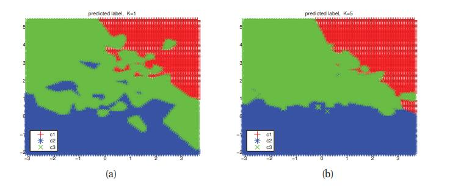

[**返回本章目录**]()

在本节中，我们将介绍机器学习中的一些关键思想。 我们将在本书后面对这些概念进行扩展，但我们将在此简要介绍它们，以便给引起大家兴趣。

<!--more-->

## 1.4.1 参数与非参数模型

在本书中，我们将重点关注形如$$p(y | \boldsymbol{x})$$或$$p(x)$$的概率模型，这取决于我们是否分别对有监督或无监督学习感兴趣。 有许多方法可以定义这样的模型，但最重要的区别是：模型是否具有固定数量的参数，或者参数的数量是否随着训练数据量的增加而增加？ 前者称为**参数模型**，后者称为**非参数模型**。 参数模型具有通常更快使用的优点，但缺点是对数据分布的性质做出更强的假设。 非参数模型更灵活，但对于大型数据集而言通常在计算上难以处理。 我们将在下面的部分中给出两种模型的示例。 尽管我们的许多讨论也适用于无监督学习，但我们只关注监督学习的简单性。

## 1.4.2 简单的非参数分类器：K-最近邻

> 图1.14 （a）2维$$K = 3$$的K-最近邻分类器的图示. 测试点的$$\boldsymbol{x}_1$$的3最近邻有标签1,1和0，因此我们预测$$p(y = 1 | \boldsymbol{x}_1,\mathcal{D},K = 3)= 2/3$$。 测试点$$\boldsymbol{x}_2$$的3最近邻具有标记0,0和0，因此我们预测$$p(y = 1 | \boldsymbol{x}_3,\mathcal{D},K = 3)= 0/3$$。 （b）由1-NN引起的Voronoi曲面细分的图示。 基于（Duda等人，2001）的图4.13。 由_knnVoronoi_生成的图。

> 图1.15 （a）2d中合成的3类训练数据。 （b）K = 10的KNN的第1类的概率。（c）第2类的概率。（d）类别标签的MAP估计。 由_knnClassifyDemo_生成的图。

非参数分类器的简单示例是K**最近邻**（**KNN**）分类器。 这只是“查看”训练集中最接近测试输入x的K点，计算每个类中有多少成员，并将经验分数作为估计返回，如图1.14所示。 更正式的，

$$
p(y=c|\boldsymbol{x},\mathcal{D},K) = \dfrac{1}{K} \sum_{i \in N_K(\boldsymbol{x},\mathcal{D})}{\mathbb{I}(y_i=c)} \tag{1.2}
$$

其中$$N_K(\boldsymbol{x},\mathcal{D})$$是$$\mathcal{D}$$中最接近$$\boldsymbol{x}$$的K个点（的索引）， 并且$$\mathbb{I}(e)$$是**指标函数**，其定义如下：

$$
\mathbb{I}(e)=\begin{cases}  1 & \text{if e is true} \\ 0 & \text{if e is false}\end{cases}  \tag{1.3}
$$

该方法是**基于记忆的学习**或**基于实例的学习**的示例。 它可以从第14.7.3节中解释的概率框架推导出来。 最常用的距离度量是欧几里德距离（限制这个技术对实值数据的适用性），当然还可以使用其他度量。

图1.15给出了一个实际操作方法的例子，其中输入是二维的，我们有三个类，$$K = 10$$.（我们在后面讨论$$K$$的效果。）面板（a）绘制训练数据。 图（b）绘制$$p(y = 1 | \boldsymbol{x},\mathcal{D})$$，其中$$\boldsymbol{x}$$在点网格上计算。 图（c）绘制$$p(y = 2 | \boldsymbol{x},\mathcal{D})$$。 我们不需要绘制$$p(y = 3 | \boldsymbol{x},\mathcal{D})$$，因为概率总和为1。 图（d）绘制MAP估计$$\hat{y}(\boldsymbol{x})=\underset{c}{\rm argmax} p(y = c | \boldsymbol{x},\mathcal{D})$$。

$$K = 1$$的KNN分类器诱导点的Voronoi曲面细分（见图1.14（b））。 这是空间的划分，其将区域$$V(\boldsymbol{x}_i)$$与每个点$$\boldsymbol{x}_i$$相关联，使得$$V(\boldsymbol{x}_i)$$中的所有点都更接近$$\boldsymbol{x}_i$$而不是任何其他点。 在每个单元格内，预测标签是相应训练点的标签。

## 1.4.3 维度的诅咒

KNN分类器很简单，并且可以很好地工作，只要它具有良好的距离度量并且具有足够的标记训练数据。 实际上，可以证明，如果$$N \to \infty$$，则KNN分类器可以在最佳可能性能的2倍之内（Cover and Hart 1967）。

然而，KNN分类器的主要问题是它们在高维输入时不能很好地工作。 高维设置中的糟糕表现是由于**维度的诅咒**。

为了解释这个诅咒，我们举了一些例子（Hastie et al.2009，p22）。 考虑将KNN分类器应用于在D维单元立方体中均匀分布的输入数据。 假设我们估计测试点$$\boldsymbol{x}$$周围的类标签密度（通过“增长”围绕$$\boldsymbol{x}$$的超立方体来直到数据占比达到$$f$$）。 此立方体的预期边长将为$$e_D(f)= f^{ 1 / D}$$. 如果$$D = 10$$，并且我们希望估计值是基于$$f=10\%$$数据的，我们得到$$e_{10}(0.1)= 0.8$$，因此我们需要沿$$\boldsymbol{x}$$的每个维度扩展80％的立方体。 即使我们只使用1％的数据，我们发现$$e_{10}(0.01)= 0.63$$：见图1.16。 由于沿着每个维度的整个数据范围仅为1，因此我们看到该方法不再是本地的，尽管名称为“最近邻居”。 查看距离较远的邻居的问题在于，它们可能不是关于给定点处输入 - 输出函数行为的良好预测器。

> 图1.16 维度诅咒的插图。 （a）我们在较大的单位立方体内嵌入一个小方块s。 （b）我们绘制一个立方体的边长，它是覆盖单位立方体的给定体积所需的尺寸的数量。 基于图2.6（Hastie等人，2009）。 由_curseDimensionality_生成的图。

## 1.4.4 用于分类和回归的参数模型

打破维度诅咒的主要方法是对数据分布的性质做出一些假设（监督问题的$$p(y | \boldsymbol{x})$$或无监督问题的$$p(\boldsymbol{x})$$）。 这些假设称为**归纳偏向**\(inductive bias\)，通常以**参数模型**的形式体现，参数模型是具有固定数量参数的统计模型。 下面我们简要介绍两个广泛使用的例子; 我们将在本书后面更深入地重新讨论这些和其他模型。

## 1.4.5 线性回归

最广泛使用的回归模型之一称为**线性回归**。 这断言响应是输入的线性函数。 这可以写成如下：

$$
y(\boldsymbol{x})=\boldsymbol{w}^T \boldsymbol{x} + \epsilon=\sum_{j=1}^D {w_i x_i} + \epsilon \tag{1.4}
$$

其中$$\boldsymbol{w}^T \boldsymbol{x}$$代表输入向量$$\boldsymbol{x}$$和模型**权重向量**$$\boldsymbol{w}$$ 之间的内部或**标量积**，并且$$\epsilon$$是我们的线性预测和真实响应之间的**残差**。

我们经常假设$$\epsilon$$具有**高斯**或**正态分布**。 我们用$$\epsilon \sim \mathcal{N}(\mu, \sigma^2)$$表示之，其中$$\mu$$是均值，$$\sigma^2$$是方差（详见第2章）。 当我们绘制这个分布时，我们得到了如图1.17（a）所示众所周知的**钟形曲线**。

为了使线性回归和高斯之间的联系更加明确，我们可以用以下形式重写模型：

$$
p(y|\boldsymbol{x},\boldsymbol{\theta})=\mathcal{N}(\mu(\boldsymbol{x}), \sigma^2(\boldsymbol{x})) \tag{1.5}
$$

这清楚地表明该模型是条件概率密度。 在最简单的情况下，我们假设$$\mu$$是$$\boldsymbol{x}$$的线性函数，因此$$\mu= \boldsymbol{w}^T \boldsymbol{x}$$，并且噪声是固定的，$$\sigma^2(\boldsymbol{x})=\sigma^2$$。 在这种情况下，$$\boldsymbol{\theta}=(\boldsymbol{w}，\sigma^2)$$是模型的参数。

例如，假设输入是1维的。 预期响应可表示如下：

$$
\mu(\boldsymbol{x}) = w_0+w_1 x= \boldsymbol{w}^T \boldsymbol{x} \tag{1.6}
$$

其中$$w_0$$是截距或**偏置**项，$$w_1$$是斜率，我们定义了向量$$\boldsymbol{x} =(1,x)$$。 （将一个常数1项加到输入向量上是一个常见的符号技巧，它允许我们将截距项与模型中的其他项组合。）如果$$w_1$$为正，则意味着我们期望输出随着输入的增加而增加。 这在图1.17（b）中的1d中说明; 图1.7（a）显示了一个更常规的平均响应与$$x$$的关系图。

> 图1.17 （a）均值为0方差为1的高斯pdf，.由_gaussPlotDemo_生成的图。 （b）条件密度模型的可视化$$p(y|x,\boldsymbol{\theta})=\mathcal{N}(y | w_0+w_1 x, \sigma^2)$$。 当我们离开回归线时，密度以指数方式快速下降。 由_linregWedgeDemo2_生成的图。

通过用输入的一些非线性函数$$\boldsymbol{\phi}(\boldsymbol{x})$$代替$$\boldsymbol{x}$$，可以用线性回归以模拟非线性关系。 也就是说，我们使用

$$
p(y|\boldsymbol{x},\boldsymbol{\theta})=\mathcal{N}(\boldsymbol{w}^T \boldsymbol{\phi}(\boldsymbol{x}), \sigma^2) \tag{1.7}
$$

这被称为**基函数扩展**。 例如，图1.18说明了对于$$d = 14$$和$$d = 20$$，$$\boldsymbol{\phi}(\boldsymbol{x})= [1,x,x^2,\dots,x^d ]$$的情况; 这被称为**多项式回归**。 我们将在本书的后面部分考虑其他类型的基函数。 事实上，许多流行的机器学习方法 - 例如支持向量机，神经网络，分类和回归树等 - 可以被视为从数据中估计基函数的不同方式，正如我们在第14章和第16章中讨论的那样。

> 图1.18 度数为14和20的多项式最小二乘拟合到21个数据点。 由_linregPolyVsDegree_生成的图。

## 1.4.6 逻辑斯蒂回归

> 图1.19 （a）sigmoid或logistic函数。 我们有$${\rm sigm}(-\infty)= 0$$，$${\rm sigm}(0)= 0.5$$，$${\rm sigm}(\infty)= 1$$。 由_sigmoidPlot_生成的图。 （b）SAT分数的逻辑斯蒂回归。 实心黑点是数据。 开放的红色圆圈是预测的概率。 绿色叉表示两个学生具有相同的SAT分数525（因此相同的输入表示$$x$$）但具有不同的训练标签（一个学生通过，$$y = 1$$，另一个失败，$$y = 0$$）。 因此，仅使用SAT功能就无法完全分离这些数据。 由_logregSATdemo_生成的图。

我们可以通过进行两次更改将线性回归推广到（二元）分类设置。 首先，我们用**伯努利分布**替换$$y$$的高斯分布，这更适合于响应是二元的情况，y∈{0,1}。 也就是说，我们使用

$$
p(y|\boldsymbol{x},\boldsymbol{w})= {\rm Ber}(y | \mu(\boldsymbol{x})) \tag{1.8}
$$

其中$$\mu (\boldsymbol{x})= \mathbb{E} [y | \boldsymbol{x} ] = p(y = 1 | \boldsymbol{x})$$。 其次，我们像以前一样计算输入的线性组合，但是我们定义一个满足$$0 \le \mu (\boldsymbol{x} ) \le 1$$的函数

$$
\mu(\boldsymbol{x}) = {\rm sigm}(\boldsymbol{w}^T \boldsymbol{x}) \tag{1.9}
$$

其中$${\rm sigm} (\eta)$$被称作**sigmoid**函数，也称为**logistic**或**logit**函数。 这被定义为

$$
{\rm sigm}(\eta)  \overset{\Delta}{=} \dfrac{1}{1+\exp(-\eta)}=\dfrac{e^\eta}{1+e^\eta} \tag{1.10}
$$

术语“sigmoid”意味着S形：见图1.19（a）。 它也被称为**压缩函数**，因为它将整个实数域映射到$$[0,1]$$，这对于将输出解释为概率是必要的。

$$
p(y|\boldsymbol{x},\boldsymbol{w})= {\rm Ber}(y |  {\rm sigm}(\boldsymbol{w}^T \boldsymbol{x})) \tag{1.11}
$$

这被称为**逻辑斯蒂回归**，因为它与线性回归相似（尽管它是一种分类形式，而不是回归！）。

逻辑斯蒂回归的一个简单例子如图1.19（b）所示，我们用下式绘制之

$$
p(y_i=1|x_i,\boldsymbol{w})={\rm sigm}(w_0+w_1 x_i) \tag{1.12}
$$

其中$$x_i$$是学生$$i$$的SAT分数，和$$y_i$$表示是否通过了课程。 实心黑点显示训练数据，红色圆圈显示$$p(y=1|\boldsymbol{x}_i,\hat{\boldsymbol{w}})$$，其中$$\hat{\boldsymbol{w}}$$是从训练数据估计的参数（我们将讨论如何在8.3.4节中计算这些估计值）。

如果我们将输出概率阈值设置为0.5，我们就可以引出**决策规则**的形式

$$
\hat{y}(x)=1 \Leftrightarrow p(y=1|\boldsymbol{x})>0.5 \tag{1.13}
$$

通过查看图1.19（b），我们看到对于$$x \approx 545= x^*$$，$${\rm sigm}(w_0+w_1 x)= 0.5$$。 我们可以想象在$$x = x^*$$处绘制一条垂直线; 这被称为**决策边界**。 该行左侧的所有内容都归类为0，该行右侧的所有内容都归类为1。

我们注意到，即使在训练集上，该决策规则也具有非零错误率。 这是因为数据不是**线性可分的**，即我们没有直线可以将0与1分开。 我们可以使用基函数展开创建具有非线性决策边界的模型，就像我们使用非线性回归一样。 我们将在本书后面看到许多这方面的例子。

## 1.4.7 过拟合

> 图1.20 在图1.15（a）中数据的KNN预测表面。 （a）K = 1。 （b）K = 5。 由_knnClassifyDemo_生成的图。

当我们拟合高度灵活的模型时，我们需要注意不要**过拟合**数据，也就是说，我们应该避免尝试对输入中的每个微小变化进行建模，因为这比真实信号更可能是噪声。 这在图1.18（b）中说明，其中我们看到使用高次多项式导致非常“摇摆”的曲线。 真正的函数不太可能具有如此极端的振荡。 因此，使用这样的模型可能导致无法对未来输出进行很好的预测。

作为另一个例子，考虑KNN分类器。 K的值会对此模型的行为产生很大影响。 当K = 1时，该方法在训练集上没有错误（因为我们只返回原始训练点的标签），但是得到的预测表面非常“摇摆”（见图1.20（a））。 因此，该方法可能无法很好地预测未来的数据。 在图1.20（b）中，我们看到使用K = 5可以得到更平滑的预测表面，因为我们在较大的邻域上求平均值。 随着K增加，预测变得更平滑，直到在K = N的极限中，我们最终预测整个数据集的多数标签。 下面我们讨论如何选择K的“正确”值。

## 1.4.8 模型选择

当我们有各种不同复杂度的模型时（例如，具有不同度多项式的线性或逻辑斯蒂回归模型，或具有不同K值的KNN分类器），我们应该如何选择正确的模型？ 一种自然的方法是计算每种方法的训练集的**误分率**。 这定义如下：

$$
{\rm err}(f,\mathcal{D})=\dfrac{1}{N}\sum_{i=1}^N {\mathbb{I}(f(\boldsymbol{x}_i) \ne y_i)} \tag{1.14}
$$

其中$$f(\boldsymbol{x})$$是我们的分类器。 在图1.21（a）中，我们绘制了KNN分类器（蓝色虚线）的误差率与K的关系曲线。 我们看到增加K会_增加_训练集的错误率，因为过度平滑。 如上所述，通过使用K = 1，我们可以在训练集上获得最小的误差，因为该模型只是记忆数据。

但是，我们关心的是**泛化误差**，它是对未来数据进行平均时误分类率的预期值（详见6.3节）。 这可以通过计算大型独立测试集上的错误分类率来近似，而不是在模型训练期间使用。 我们将图1.21（a）中的测试误差与K绘制成实心红色（上部曲线）。 现在我们看到一个**U形曲线**：对于复杂模型（小K），方法过度拟合，对于简单模型（大K），该方法**欠拟合**。 因此，选择K的一种明显方法是在测试集上选择具有最小误差的值（在此示例中，10到100之间的任何值都应该没问题）。

不幸的是，在训练模型时，我们无法访问测试集（假设），因此我们无法使用测试集来选择正确复杂度的模型。 但是，我们可以通过分区来创建测试集 训练集合为两个：一部分用于训练模型，第二部分称为**验证集**，用于选择模型复杂性。 然后，我们将所有模型拟合到训练集上，并在验证集上评估它们的性能，并选择最佳。 一旦我们选择了最好的，我们可以将其重新调整为所有可用数据。 如果我们有一个单独的测试集，我们可以评估它的性能，以便估计我们方法的准确性。 （我们将在第6.5.3节中更详细地讨论这个问题。）

我们经常使用大约80％的数据用于训练集，20％用于验证集。 但是，如果训练案例的数量很少，这种技术会遇到问题，因为该模型没有足够的数据来训练，我们将没有足够的数据来对未来的性能进行可靠的估计。

> 图1.21 （a）K-最近邻分类器中的误分类率与K的关系. 靠左边K更小，模型很复杂，因此我们过拟合。 靠右边，K很大，模型很简单，我们欠适合。 虚线蓝线：训练集（大小200）。 红色实线：测试集（大小500）。 （b）5折交叉验证的示意图。 由_knnClassifyDemo_生成的图。

一个简单但流行的解决方案是使用**交叉验证**（**CV**）。 这个想法很简单：我们将训练数据分成$$K$$个**折叠**; 然后，对于每个折叠$$k\in {1,\dots,K}$$，我们训练所有的折叠但是第k折叠排除在外，并且用来测试第k折叠，如此循环，如图1.21所示（b）。 然后，我们计算在所有折叠上平均误差，并将其用作测试误差的代理。 （注意，每个点只预测一次，虽然它将用于训练$$K -1$$次。）通常使用$$K = 5$$; 这被称为**5折CV**。 如果我们取$$K = N$$，那么我们得到一个名为**留1交叉验证**\(leave-one out cross validation\)或**LOOCV**的方法，因为在折叠$$i$$中，我们训练除$$i$$之外的所有数据情况，然后在$$i$$上进行测试。 练习1.3要求您计算测试误差与K的5折CV估计值，并将其与图1.21（a）中的经验测试误差进行比较。

为KNN分类器选择K是一个更普遍的问题（称为**模型选择**）的特例，我们必须在具有不同灵活性的模型之间进行选择。 交叉验证被广泛用于解决此类问题，尽管我们将在本书后面讨论其他方法。

## 1.4.9 无免费午餐定理

> 所有的模型都是错误的，但有些模型是有用的。 - George Box（Box and Draper 1987，p424）.

许多机器学习都涉及定制不同的模型，不同算法, 以适合它们的。 我们可以使用交叉验证等方法根据经验为我们的特定问题选择最佳方法。 然而，没有普遍最好的模型 - 这有时被称为**无免费午餐定理**（Wolpert 1996）。 这样做的原因是，在一个域中运行良好的一组假设可能在另一个域中运行不佳。

由于没有免费午餐定理，我们需要开发许多不同类型的模型，以涵盖现实世界中出现的各种各样的数据。 对于每个模型，我们可以使用许多不同的算法来训练模型，从而进行不同的速度 - 精度 - 复杂度权衡。 我们将在后续章节中研究这种数据，模型和算法的组合。

[**返回本章目录**]()

