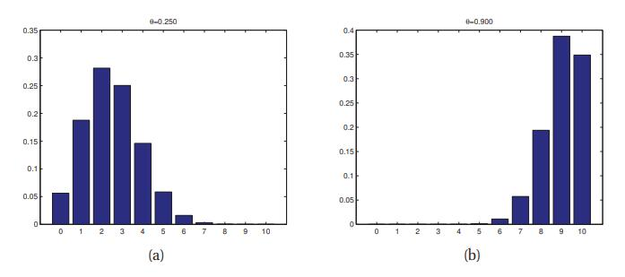
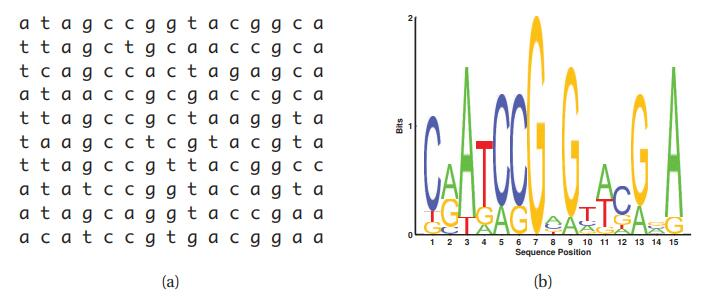
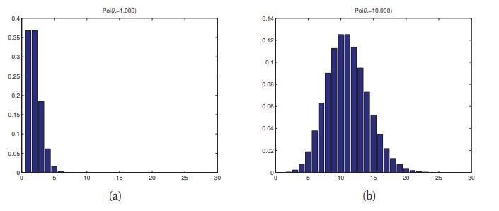

[**返回本章目录**]()

在本节中，我们将回顾在离散状态空间\(包括有限状态和可数无限状态\)上定义的一些常用参数分布。

<!--more-->

## 2.3.1 二项和伯努利分布

假设我们投掷硬币n次。 设$$X \in \{0,\dots,n\}$$为出现头部的次数。 如果出现头的概率是$$\theta$$，那么我们说$$X$$具有**二项分布**，写为$$X \sim {\rm Bin}(n,\theta)$$。 pmf由下式给出

$$
{\rm Bin}(k | n, \theta) \overset{\Delta}{=} \binom{n}{k} \theta^k (1-\theta)^{n-k} \tag{2.28}
$$

其中

$$
\binom{n}{k} \overset{\Delta}{=}\dfrac{n!}{(n-k)!k!} \tag{2.29}
$$

是从n中选择k项的方法数（这被称为**二项式系数**，读着为“n选k”）。 有关二项分布的一些示例，请参见图2.4。 此分布具有以下均值和方差：

$$
{\rm mean}=\theta, {\rm var}=n \theta(1-\theta)  \tag{2.30}
$$

现在假设我们只扔了一次硬币。 设$$X \in \{0,1\}$$为二值随机变量，“成功”或“头”的概率为$$\theta$$。 我们说$$X$$具有伯努利分布。 写为$$X \sim {\rm Ber}(\theta)$$，其pmf定义为

$$
{\rm Ber}(x |\theta) \overset{\Delta}{=} \theta^{\mathbb{I}(x=1)} (1-\theta)^{\mathbb{I}(x=0)} \tag{2.31}
$$

换句话说

$$
{\rm Ber}(x |\theta) \overset{\Delta}{=} \left\{
\begin{aligned}
\theta \quad & {\rm if} \quad x=1 \\
1-\theta \quad & {\rm if} \quad x=0 \\
\end{aligned}
\right. \tag{2.32}
$$

这显然只是二项分布的特殊情况\($$n = 1$$\)。

> 图2.4 二项分布的插图，$$n = 10$$ 和 $$\theta \in \{0.25, 0.9\}$$。 由_binomDistPlot_生成的图。

## 2.3.2多项和广义伯努利分布

二项分布可用于模拟硬币投掷的结果。 为了模拟抛掷具有K面的骰子的结果，我们可以使用**多项分布**。 这定义如下：令$$\boldsymbol{x} =(x_1,\dots,x_K)$$是随机向量，其中$$x_j$$是骰子的第$$j$$面出现的次数。 然后$$\boldsymbol{x}$$有以下pmf：

$$
{\rm Mu}(\boldsymbol{x}|n, \boldsymbol{\theta}) \overset{\Delta}{=} \binom{n}{x_1,\dots,x_K}\prod_{j=1}^K{\theta_j^{x_j}}     \tag{2.33}
$$

其中$$\theta_j$$是$$j$$面出现的概率，并且

$$
\binom{n}{x_1,\dots,x_K} \overset{\Delta}{=}\dfrac{n}{x_1!x_2!\dots x_K!}    \tag{2.34}
$$

是**多项式系数**（将大小为$$n = \sum_{k = 1}^K{x_k}$$的集合切分成大小依次为$$x_1$$到$$x_K$$的$$K$$个子集的方法数）。

现在假设n = 1.这就像滚动一个K侧骰子一样，因此$$\boldsymbol{x}$$将是0-1向量（位向量），只能有一个位置为1\(其它位置为0\)。 具体来说，如果骰子显示为面$$k$$，则第$$k$$位为1\(其它位置为0\)。 在这种情况下，我们可以将$$x$$视为具有K个状态（值）的标量分类随机变量，向量$$\boldsymbol{x}$$是标量$$x$$的**虚拟编码**\(**dummy encoding**\)，即$$\boldsymbol{x} = [\mathbb{I}(x=1),\dots,\mathbb{I}(x=K)]$$。 例如，如果K = 3，我们将状态1，2和3编码为$$(1,0,0)$$，$$(0,1,0)$$和$$(0,0,1)$$。 这也称为**单热编码**\(**one-hot encoding,**\)，因为我们想象$$K$$个位置中只有一个是“热”或“开”的。 在这种情况下，pmf变为

$$
{\rm Mu}(\boldsymbol{x}|1, \boldsymbol{\theta}) \overset{\Delta}{=} \prod_{j=1}^K{\theta_j^{\mathbb{I}(x_j=1)}}     \tag{2.35}
$$

有关示例参见图2.1（b-c）。 这种非常常见的特殊情况称为**分类**\(**categorical**\)或**离散**分布。 （Gustavo Lacerda建议我们将其称为**广义伯努利分布**\(**multinoulli distribution**\)，类比二项式/伯努利式的区别，我们将在本书中采用这一术语。）我们将使用以下符号表示此分布：

$$
{\rm Cat}(x|\boldsymbol{\theta}) \overset{\Delta}{=} {\rm Mu}(\boldsymbol{x}|1, \boldsymbol{\theta})    \tag{2.36}
$$

换句话说，如果$$x \sim {\rm Cat}(\boldsymbol{\theta})$$，则$$p(x = j | \boldsymbol{\theta})=\theta_j$$。 有关摘要，请参阅表2.1。

| 分布 | $$n$$ | $$k$$ | $$x$$ |
| :---: | :---: | :---: | :---: |
| 多项分布 | - | - | $$\boldsymbol{x} \in \{0,1,\dots,n\}^K, \sum_{k=1}^K{x_k}=n$$ |
| 广义伯努利分布 | 1 | - | $$\boldsymbol{x} \in \{0,1\}^K, \sum_{k=1}^K{x_k}=1$$ \(1-of-K 编码\) |
| 二项分布 | - | 1 | $$x \in \{0,1,\dots,n\}$$ |
| 伯努利分布 | 1 | 1 | $$x \in \{0,1\}$$ |

> 表2.1 多项分布及相关分布的摘要

### 2.3.2.1 应用：DNA序列基序

多项模型的一个有趣的应用出现在**生物序列分析**中。 假设我们有一组（对齐的）DNA序列，如图2.5（a）所示，其中有10行（序列）和15列（沿着基因组的位置）。 我们看到几个位置通过进化而保存（例如，因为它们是基因编码区的一部分），因为相应的列倾向于“纯”。 例如，第7列都是G'。

一种可视化汇总数据的方法是使用**序列标识**\(**sequence logo**\)：见图2.5（b）。 我们将字母A，C，G和T绘制成与其经验概率成比例的字体大小，并在顶部绘制最可能的字母。 位置$$t$$的经验概率分布$$\hat{\theta}_t$$是通过对计数向量进行归一化得到的（见公式3.48）：

$$
\begin{aligned}
\boldsymbol{N}_t = & \left(\sum_{i=1}^N{\mathbb{I}(X_{it}=1)},\sum_{i=1}^N{\mathbb{I}(X_{it}=2)},\sum_{i=1}^N{\mathbb{I}(X_{it}=3)}, \sum_{i=1}^N{\mathbb{I}(X_{it}=4)}\right)  \\
\hat{\boldsymbol{\theta}}_t = & \boldsymbol{N}_t/N
\end{aligned}  \tag{2.37-38}
$$

这种分布被称为**基序**\(**motif**\)。 我们还可以计算每个位置最可能的字母; 这被称为**共有序列**\(**consensus sequence**\)。

> 图2.5 （a）一些对齐的DNA序列。 （b）相应的序列标识。 由_seqlogoDemo_生成的图。

## 2.3.3 泊松分布

我们说$$X \in \{0,1,2,\dots\}$$具有参数$$\lambda> 0$$的**泊松分布**，写成$$X \sim {\rm Poi}(\lambda)$$，如果它的pmf是

$$
{\rm Poi}(x|\lambda) \overset{\Delta}{=}e^{-\lambda}\dfrac{\lambda^x}{x!}   \tag{2.39}
$$

第一项只是标准化常数，需要确保分布总和为1。

泊松分布通常用作放射性衰变和交通事故等罕见事件计数的模型。 见图2.6。

> 图2.6 λ∈{1,10}的一些泊松分布图。 为清晰起见，我们已将x轴截断为25，但分布的支持超过了所有非负整数。 由_poissonPlotDemo_生成的图。

## 2.3.4 经验分布

给定一组数据，$$\mathcal{D} = \{x_1,\dots,x_N\}$$，我们定义**经验分布**，也称为**经验度量**，如下：

$$
p_{\rm emp}(A)\overset{\Delta}{=}\dfrac{1}{N}\sum_{i=1}^N{\delta_{x_i}(A)}   \tag{2.40}
$$

其中$$\delta_{x}(A)$$是**狄拉克度量**，定义如下

$$
\delta_x(A)=\left\{
\begin{aligned}
0 \quad & if \quad x \notin A \\
1 \quad & if \quad x \in A \\
\end{aligned}
\right.   \tag{2.41}
$$

通常，我们可以为每个样本关联上一个“权重”：

$$
p(x) = \sum_{i=1}^N{w_i \delta_{x_i}(x)}   \tag{2.42}
$$

其中我们要求$$0 \le w_i \le 1$$和$$\sum_{i = 1}^N{w_i} = 1$$.我们可以将其视为直方图，在数据点$$x_i$$处具有“尖峰”，其中$$w_i$$确定尖峰$$i$$的高度。 此分布将0概率分配给不在数据集中的任何点。

[**返回本章目录**]()

