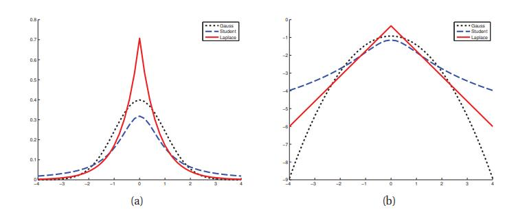
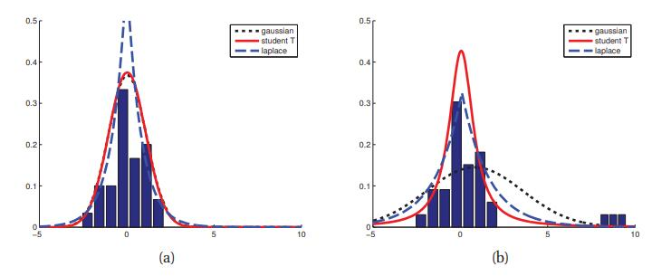
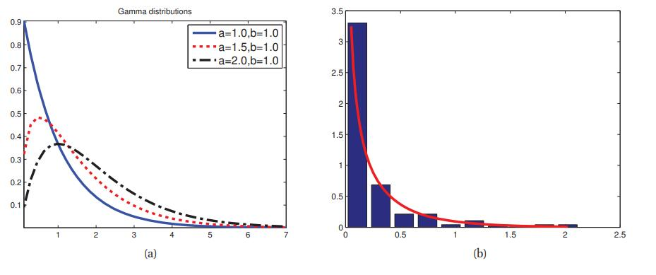
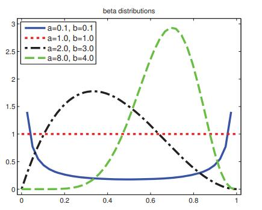
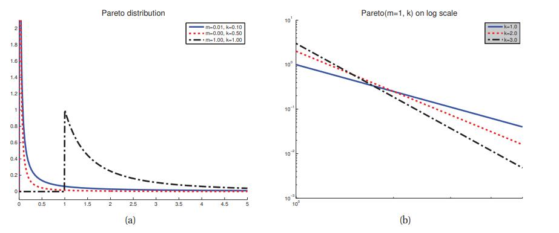

[**返回本章目录**]()

在本节中，我们展现了一些常用的单变量（一维）连续概率分布。

<!--more-->

## 2.4.1 高斯（正态）分布

统计学和机器学习中使用最广泛的分布是高斯分布或正态分布。 它的pdf是

$$
\mathcal{N}(x|\mu,\sigma^2) \overset{\Delta}{=} \dfrac{1}{\sqrt{2 \pi \sigma^2}} e^{-\frac{1}{2\sigma^2}(x-\mu)^2}   \tag{2.43}
$$

这里$\mu = \mathbb{E} [X]$是均值（和众数），$\sigma^2= {\rm var} [X]$是方差。 $\sqrt{2 \pi \sigma^2}$是确保密度积分为1的归一化常数（见练习2.11）。

我们用$X \sim \mathcal{N}(\mu,\sigma^2)$来表示$p(X=x)=\mathcal{N}(x |\mu,\sigma^2)$。 如果$X \sim \mathcal{N}(0,1)$，则说$X$服从**标准正态分布**。 有关此pdf的绘制参见图2.3（b）; 有时被称为**钟形曲线**。

我们经常谈的高斯**精度**，指的是逆方差：$\lambda = 1 /\sigma^2$。 高精度意味着以$\mu$为中心的窄分布（低方差）。

请注意，由于这是一个pdf，可以有$p(x)> 1$。为了看到这一点，考虑计算其中心$x=\mu$的密度。 我们有$N(\mu|\mu,\sigma^2)=(\sigma \sqrt{2 \pi})^{-1} e^0$，所以如果$\sigma<1 /\sqrt{2\pi}$，我们有$p(x)>1$。

高斯的累积分布函数或cdf定义为

$$
\Phi(x;\mu,\sigma^2) \overset{\Delta}{=} \int_{-\infty}^x{\mathcal{N}(z|\mu,\sigma^2)dz}   \tag{2.44}
$$

当$\mu = 0,\sigma^2= 1$ 时，cdf绘制见图2.3（a）。该积分没有封闭形式表达式，但内置于大多数软件包中。 特别是，我们可以根据**误差函数**（**erf**）计算它：

$$
\Phi(x;\mu,\sigma^2) = \dfrac{1}{2}[1+{\rm erf}(z/\sqrt{z})]  \tag{2.45}
$$

其中$z = (x-\mu)/\sigma$ 及

$$
{\rm erf}(x)\overset{\Delta}{=}\dfrac{2}{\sqrt{\pi}}\int_0^x{e^{-t^2}dt}   \tag{2.46}
$$

高斯分布是统计学中使用最广泛的分布。 有几个原因。 首先，它有两个易于解释的参数，它们捕获分布的一些最基本的属性，即它的均值和方差。 其次，中心极限定理（第2.6.3节）告诉我们，独立随机变量的总和近似高斯分布，使其成为建模残差或“噪声”的良好选择。 第三，高斯分布假设具有最小数量的假设（具有最大熵），受限于具有指定的均值和方差，如第9.2.6节所示; 这使它在许多情况下成为一个很好的默认选择。 最后，它有一个简单的数学形式，这导致易于实现，但通常是高效的方法\(我们将看到\)。 参见（Jaynes 2003，第7章）有关高斯如此广泛使用的更多讨论。

## 2.4.2 退化pdf

在$\sigma^2 \to 0$的极限中，高斯变为以$\mu$为中心的无限高且无限薄的“尖峰”：

$$
\lim_{\sigma^2 \to 0} \mathcal{N}(x|\mu,\sigma^2) = \delta(x-\mu)   \tag{2.47}
$$

其中δ称为**狄拉克函数**，定义为

$$
\delta(x)=\left\{
\begin{aligned}
\infty \quad & if \quad x=0 \\
0 \quad & if \quad x \ne 0 \\
\end{aligned}
\right.   \tag{2.48}
$$

满足

$$
\int_{-\infty}^{+\infty} {\delta(x)dx}=1   \tag{2.49}
$$

delta函数的一个有用性质是**筛选属性**\(**sifting property**\)，它从求和或积分中选择一个单独项：

$$
\int_{-\infty}^{+\infty} {f(x)\delta(x-\mu)dx}=f(\mu)   \tag{2.50}
$$

因为被积函数只在$x=\mu$处非零。

高斯分布的一个问题是它对异常值敏感，因为对数概率仅随距离中心的距离而平方衰减。 更稳健的分布是**学生t分布**，其pdf如下：

$$
\mathcal{T}(x|\mu,\sigma^2,\upsilon) \propto \left[1+\dfrac{1}{\upsilon}\left(\dfrac{x-\mu}{\sigma}\right)^2\right]^{-(\frac{\upsilon+1}{2})}    \tag{2.51}
$$

其中$\mu$是均值，$\sigma^2> 0$是比例参数，$\upsilon> 0$称为**自由度**。 参见图2.7。 供以后参考，我们注意到该分布具有以下属性：

$$
{\rm mean}=\mu,  {\rm mode}=\mu, {\rm var}=\dfrac{\upsilon \sigma^2}{(\upsilon-2)}  \tag{2.52}
$$

仅在$\upsilon > 2$ 时方差才有定义。仅在$\upsilon> 1$时均值才有定义。

> 图2.7 （a）对于$\mathcal{N}(0,1)$，$\mathcal{T}(0,1,1)$和${\rm Lap}(0,1/\sqrt{2})$的pdf。 对于高斯和拉普拉斯，其均值都为0并且其方差都为1。 当$\upsilon= 1$时，学生的均值和方差是不确定的。（b）这些pdf的对数。 请注意，对于任何参数值，学生分布都不是对数凹的，不像拉普拉斯分布，它总是对数凹（和对数凸...）然而，两者都是单峰的。 由_studentLaplacePdfPlot_生成的图。

为了说明学生分布的稳健性，请考虑图2.8。 在左侧，我们显示高斯和学生都适合某些数据，没有异常值。 在右边，我们添加了一些异常值。 我们看到高斯受到很大影响，而学生分布几乎没有变化。 这是因为学生有更重的尾巴，至少对于小的$\upsilon$（见图2.7）。

> 图2.8 异常值对拟合高斯，学生和拉普拉斯分布的影响的例证。 （a）没有异常值（高斯和学生曲线相互叠加）。 （b）有异常值。 我们看到高斯更多地受到异常值的影响而不是学生和拉普拉斯分布。 基于（Bishop 2006a）的图2.16。 由_robustDemo_生成的图。

如果$\upsilon= 1$，则该分布称为**柯西**或**洛伦兹**分布。 这是值得注意的是，具有如此重的尾部使得定义均值的积分不会收敛。

为了确保有限方差，我们要求$\upsilon> 2$。通常使用$\upsilon= 4$，这样就能在一系列问题中表现出良好的性能（Lange等，1989）。 对于$\upsilon \gg 5$ ，学生分布快速接近高斯分布并失去其稳健性\(鲁棒性\)。

## 2.4.3 拉普拉斯分布

具有重尾的另一种分布是**拉普拉斯分布** ，也称为**双侧指数分布**。 有以下pdf：

$$
{\rm Lap}(x|\mu,b) \overset{\Delta}{=}\dfrac{1}{2b} \exp\left(-\dfrac{|x-\mu|}{b}\right)   \tag{2.53}
$$

这里$\mu$是位置参数，$b> 0$是比例参数。 有关绘图参见图2.7。 此分布具有以下性质：

$$
{\rm mean}=\mu, {\rm mode}=\mu, {\rm var}=2b^2   \tag{2.54}
$$

它对异常值的稳健性如图2.8所示。 它还比高斯将更多的概率密度设置为0。 这个性质是在模型中增强稀疏的有用方法，我们将在第13.3节中看到。

## 2.4.4 伽玛分布

**伽玛分布**是对正实值随机变量$x>0$的灵活分布。它是根据两个参数定义的，称为形状$a> 0$且比率$b> 0$ ：

$$
{\rm Ga}(T|{\rm shap}=a,{\rm rate}=b)\overset{\Delta}{=}\dfrac{b^2}{\Gamma(a)}T^{a-1}e^{-Tb}   \tag{2.55}
$$

其中$\Gamma(a)$是伽马函数：

$$
\Gamma(x) \overset{\Delta}{=} \int_0^\infty {u^{x-1}e^{-u}du} \tag{2.56}
$$

参见图2.9。 供以后参考，我们注意到该分布具有以下属性：

$$
{\rm mean}=\dfrac{a}{b},{\rm mode}=\dfrac{a-1}{b},{\rm var}=\dfrac{a}{b^2}    \tag{2.57}
$$

> 图2.9 （a）一些${\rm Ga}(a,b = 1)$分布。 如果$a \le 1$，则众数为0，否则为$> 0$。当我们增加速率b时，可以减小水平尺度，从而向左和向上挤压一切。 由_gammaPlotDemo_生成的图。 （b）一些降雨数据的经验pdf，叠加了拟合的Gamma分布。 由_gammaRainfallDemo_生成的图。

有几种分布只是Gamma的特殊情况，我们将在下面讨论。

* **指数分布** 这由${\rm Expon}(x | \lambda) \overset{\Delta}{=} {\rm Ga}(x | 1, \lambda)$定义，其中$\lambda$ 是速率参数。 该分布描述了泊松过程中事件之间的时间，即事件以恒定平均速率$\lambda$连续且独立地发生的过程。
* **Erlang分布** 与伽马分布相同，其中$a$是整数。 固定$a = 2$是常见的，产生单参数Erlang分布，${\rm Erlang}(x |\lambda) = {\rm Ga}(x | 2, \lambda)$，其中$\lambda$是速率参数。
* **卡方分布** 由$\chi^2(x |\upsilon) \overset{\Delta}{=} {\rm Ga}(x |\frac{\upsilon}{2},\frac{1}{2})$ 定义。 这是平方高斯随机变量之和的分布。 更确切地说，如果$Z_i \sim \mathcal{N}(0,1)$ ，并且$S =\sum_{i= 1}^\upsilon{Z_i^2}$ ，那么$S \sim \chi_\upsilon^2$。

另一个有用的结果如下：如果$X \sim {\rm Ga}(a,b)$，则可以证明（练习2.10）$\frac{1}{X} \sim {\rm IG}(a,b)$，其中${\rm IG}$是由下式定义的**反伽马分布**：

$$
{\rm IG}(x|{\rm shape}=a, {\rm scale}=b)\overset{\Delta}{=}\dfrac{b^2}{\Gamma(a)}x^{-(a+1)}e^{-b/x}   \tag{2.58}
$$

分布具有这些性质

$$
{\rm mean}=\dfrac{b}{a-1}, {\rm mode}=\dfrac{b}{a+1},{\rm var}=\dfrac{b^2}{(a-1)^2(a-2)}   \tag{2.59}
$$

均值只在$a> 1$时存在。方差仅在$a> 2$时存在。

稍后我们将看到这些分布的应用。

## 2.4.5 贝塔分布

**贝塔分布**支持区间\[0,1\]，并定义如下：

$$
{\rm Beta}(x|a,b)=\dfrac{1}{B(a,b)}x^{a-1}(1-x)^{b-1}  \tag{2.60}
$$

其中$B(a,b)$是贝塔函数，

$$
B(a,b)\overset{\Delta}{=}\dfrac{\Gamma(a)\Gamma(b)}{\Gamma(a+b)}   \tag{2.61}
$$

有关一些贝塔分布，参见图2.10。 我们要求$a,b> 0$以确保分布是可积的（即，确保$B(a,b)$存在）。 如果$a = b = 1$，我们得到均匀分布。 如果a和b都小于1，我们得到双峰分布，其中“尖峰”为0和1; 如果a和b都大于1，则得到单峰分布。 为了以后的参考，我们注意到该分布具有以下属性（练习2.16）：

$$
{\rm mean}=\dfrac{a}{a+b},{\rm mode}=\dfrac{a-1}{a+b-2},{\rm var}=\dfrac{a b}{(a+b)^2(a+b+1)}    \tag{2.62}
$$

> 图2.10 一些贝塔分布。 由_betaPlotDemo_生成的图。

## 2.4.6 帕累托分布

**帕累托分布**用于模拟表现出**长尾**\(**重尾**\)量的分布。 例如，已经观察到英语中最频繁的单词（“the”）出现的频率大约是第二个最频繁的单词（“of”）的两倍，其发生频率是第四个最频繁的单词的两倍，等等。 如果我们绘制单词的频率与他们的等级，我们将得到一个幂律; 这被称为**齐夫定律**\(**Zipf’s law**\)。 财富有类似的偏差分布，特别是在美国这样的富豪中 。

帕累托的pdf定义如下：

$$
{\rm Pareto}(x|k,m)=k m^k x^{-(k+1)}\mathbb{I}(x \ge m)  \tag{2.63}
$$

这个密度断言$x$必须大于某个常数$m$，但不能太大，其中$k$控制的是“太多”。 当$k \to \infty$时，分布接近$\delta(x-m)$。 参见图2.11（a）。 如果我们在对数-对数标度上绘制分布，它形成一条直线，形如$\log p(x)=a \log x +c$, 其中a和c是常数。 有关说明参见图2.11（b）（这称为**幂律**）。 此分布具有以下属性

$$
{\rm mean}=\dfrac{k m}{k-1}\quad if \quad k>1,  {\rm mode}=m, {\rm var}=\dfrac{m^2 k}{(k-1)^2(k-2)} \quad if \quad k>2  \tag{2.64}
$$

> 图2.11 （a）帕累托分布${\rm Pareto}(x | m,k)（,m = 1$ 。（b）对数-对数刻度上的pdf。 由_paretoPlot_生成的图。

[**返回本章目录**]()

