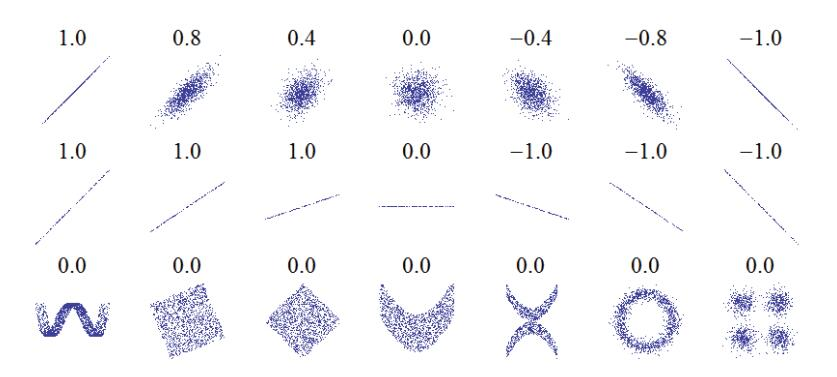
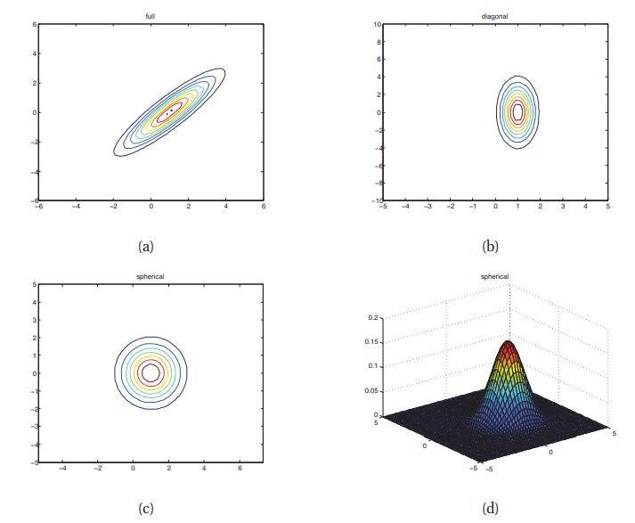
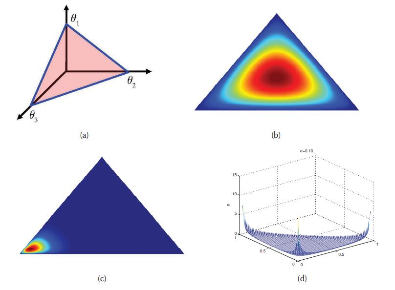
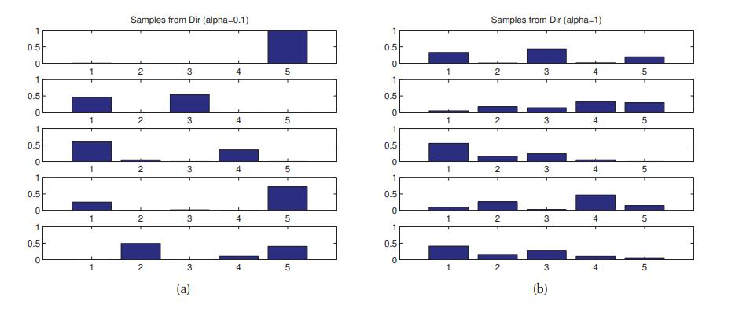

# 2.5 联合概率分布

[**返回本章目录**]()

到目前为止，我们一直专注于建模单变量概率分布。 在本节中，我们开始讨论在多个相关随机变量上建立联合概率分布的更具挑战性的问题; 这将是本书的核心主题。

**联合概率分布**形如$$p(x_1,\dots,x_D),D>1$$，并且模拟变量之间的（随机）关系。 如果所有变量都是离散的，我们可以将联合分布表示为一个大的多维数组，每个维度有一个变量。 但是，定义这种模型所需的参数数量是$$O(K^D)$$，其中K是每个变量的状态数。

<!--more-->

我们可以通过条件独立性假设使用更少的参数来定义高维联合分布，正如我们在第10章中解释的那样。在连续分布的情况下，另一种方法是将pdf的形式限制为某些函数形式，其中一些我们将在下面进行研究。

## 2.5.1 协方差和相关性

两个随机变量X和Y之间的**协方差**衡量了X和Y的（线性）相关度。 协方差定义为

$$
{\rm cov}[X,Y]\overset{\Delta}{=}\mathbb{E}[(X-\mathbb{E}[X])(Y-\mathbb{E}[Y])]=\mathbb{E}[XY]-\mathbb{E}[X]\mathbb{E}[Y]   \tag{2.65}
$$

如果$$\boldsymbol{x}$$是d维随机向量，则其**协方差矩阵**被定义为如下的对称正定矩阵：

$$
\begin{aligned}
{\rm cov}[\boldsymbol{x}] \overset{\Delta}{=} & \mathbb{E}\left[(\boldsymbol{x}-\mathbb{E}[\boldsymbol{x}])(\boldsymbol{x}-\mathbb{E}[\boldsymbol{x}])^T\right]   \\
\quad = & \left(\begin{matrix}{\rm var}[X_1] & {\rm cov}[X_1,Y_2] & \dots & {\rm cov}[X_1,Y_d]\\ {\rm cov}[X_2,Y_1] & {\rm var}[X_2] & \dots & {\rm cov}[X_2,Y_d]\\ \vdots & \vdots & \dots & \vdots\\ {\rm cov}[X_d,Y_1] & {\rm cov}[X_d,Y_2] & \dots & {\rm var}[X_d]\\ \end{matrix}\right) 
\end{aligned}  \tag{2.66-67}
$$

协方差可以在0和$$\infty$$之间。 有时使用标准化度量\(有上限\)更方便。 X和Y之间的（Pearson）**相关系数**定义为

$$
{\rm corr}[X,Y]\overset{\Delta}{=}\dfrac{{\rm cov}[X,Y]}{\sqrt{{\rm var}[X]{\rm var}[Y]}}  \tag{2.68}
$$

一个**相关系数矩阵**形如

$$
R =\left(\begin{matrix}1 & {\rm corr}[X_1,Y_2] & \dots & {\rm corr}[X_1,Y_d]\\ {\rm corr}[X_2,Y_1] & 1 & \dots & {\rm corr}[X_2,Y_d]\\ \vdots & \vdots & \dots & \vdots\\ {\rm corr}[X_d,Y_1] & {\rm corr}[X_d,Y_2] & \dots & 1\\ \end{matrix}\right) \tag{2.69}
$$

可以证明（练习4.3）$$-1 \le {\rm corr}[X,Y] \le 1$$。在相关系数矩阵中，对角线上的项都是1，而其他条目在-1和1之间。

也可以证明$${\rm corr} [X,Y] = 1$$，当且仅当，X和Y之间存在线性关系，即$$Y = a X + b, \exists a,b$$，（参见练习4.4）。 直观地，可以预期相关系数与回归线的斜率相关，即表达式$$Y=a X+b$$中的系数$$a$$。 然而，正如我们后面所在证明的公式7.99那样，回归系数实际上就是由$$a={\rm cov} [X,Y] / {\rm var} [X]$$给出的。 考虑相关系数的更好方法是线性度：见图2.12。

> 图2.12 几组\(x,y\)点，每组都反映了x和y的相关系数。 注意，相关反映了线性关系的噪声和方向（顶行），而不是反映了该关系的斜率（中间），也无法反映非线性关系的许多方面（底部）。 注意：中心的数字的斜率为0，但在这种情况下，相关系数是不确定的，因为Y的方差为零。 源自: [http://en.wikipedia.org/wiki/File:Correlation\_examples.png](http://en.wikipedia.org/wiki/File:Correlation_examples.png)

如果X和Y是独立的，意味着$$p(X,Y)=p(X)p(Y)$$（见2.2.4节），于是$${\rm cov} [X,Y] = 0$$，进而$${\rm corr} [X,,Y] = 0$$，因此它们是不相关的。 然而，反过来是不成立的：_不相关并不意味着独立_。 例如，设$$X \sim U(-1,1)$$和$$Y = X^2$$。 显然Y依赖于X（事实上，Y由X唯一确定），但是可以证明（练习4.1）$${\rm corr} [X,Y] = 0$$。 图2.12展示了这一事实的一些引人注目的例子。 这显示了几个数据集，其中X和Y之间存在明显的依赖关系，但相关系数为0。更一般的随机变量之间的依赖性度量是**互信息**\(**mutual information**\)，将在2.8.3节中讨论。 如果变量确实是独立的，那么它只能是零。

## 2.5.2 多元高斯分布

**多元高斯**或**多元正态**（**MVN**）是连续变量使用最广泛的联合概率密度函数。 我们将在第4章详细讨论MVN; 这里我们只给出一些定义和图表。

D维MVN的pdf由定义如下：

$$
\mathcal{N}(\boldsymbol{x}|\boldsymbol{\mu},\boldsymbol{\Sigma})\overset{\Delta}{=} \dfrac{1}{(2\pi)^{D/2}|\boldsymbol{\Sigma}|^{1/2}}\exp\left[-\dfrac{1}{2}(\boldsymbol{x}-\boldsymbol{\mu})^T\boldsymbol{\Sigma}^{-1}(\boldsymbol{x}-\boldsymbol{\mu})\right]  \tag{2.70}
$$

其中，$$\boldsymbol{\mu}= \mathbb{E} [\boldsymbol{x}] \in \mathbb{R}^D$$是均值向量，并且$$\boldsymbol{\Sigma}= {\rm cov} [\boldsymbol{x}]$$是D×D协方差矩阵。 有时我们会使用**精度矩阵**或**浓度矩阵**， 这只是逆协方差矩阵，$$\boldsymbol{\Lambda}=\boldsymbol{\Sigma}^{-1}$$。 归一化常数$$(2\pi)^{-D/2}|\boldsymbol{\Lambda}|^{1/2}$$只确保pdf积分为1（参见练习4.5）。

图2.13绘制了三种不同协方差矩阵的2维MVN密度。 完整的协方差矩阵具有$$D(D+1)/ 2$$个参数（由于$$\boldsymbol{\Sigma}$$是对称的，所以除以2）。 对角协方差矩阵则有D个参数（非对角线项为0）。 球面或各向同性协方差$$\boldsymbol{\Sigma}=\sigma^2\boldsymbol{I}_D$$只有一个自由参数。

> 图2.13 我们展示2维高斯的水平集。 （a）完全协方差矩阵具有椭圆等高线。 （b）对角协方差矩阵是轴对齐的椭圆。 （c）球形协方差矩阵具有圆形形状。 （d）绘制c中球形高斯的表面。 由_gaussPlot2Ddemo_生成的图。

## 2.5.3 多元学生t分布

比MVN的一个更稳健的替代方案是多变量学生t分布，其pdf由下式给出

$$
\begin{aligned}
\mathcal{T}(\boldsymbol{x}|\boldsymbol{\mu},\boldsymbol{\Sigma},v) = & \dfrac{\Gamma(v/2+D/2)}{\Gamma(v/2)}\dfrac{|\boldsymbol{\Sigma}|^{-1/2}}{v^{D/2}\pi^{D/2}}\left[1+\dfrac{1}{v}(\boldsymbol{x}-\boldsymbol{\mu})^T\boldsymbol{\Sigma}^{-1}(\boldsymbol{x}-\boldsymbol{\mu})\right]^{-\frac{v+D}{2}}   \\
\quad = & \dfrac{\Gamma(v/2+D/2)}{\Gamma(v/2)}|\pi \boldsymbol{V}|^{-1/2}\left[1+(\boldsymbol{x}-\boldsymbol{\mu})^T\boldsymbol{V}^{-1}(\boldsymbol{x}-\boldsymbol{\mu})\right]^{-\frac{v+D}{2}} 
\end{aligned}  \tag{2.71-72}
$$

其中，$$\boldsymbol{\Sigma}$$ 称为缩放矩阵（因为它不完全是协方差矩阵），$$\boldsymbol{V}=ν \boldsymbol{\Sigma}$$。 比高斯有更胖的尾巴。 ν越小，尾巴越胖。 当$$ν \to \infty$$时，分布趋于高斯分布。 这个分布有如下属性

$$
{\rm mean}= \boldsymbol{\mu}, {\rm mode}=\boldsymbol{\mu}, {\rm Cov}=\dfrac{v}{v-2}\boldsymbol{\Sigma} \tag{2.73}
$$

## 2.5.4 狄利克雷分布

贝塔分布的多元推广是Dirichlet分布，它支持如下定义的**概率单纯形**\(**probability simplex**\)

$$
S_K=\{\boldsymbol{x}:0 \le x_k \le 1, \sum_{k=1}^K{x_k}=1\}  \tag{2.74}
$$

其pdf定义如下:

$$
{\rm Dir}(\boldsymbol{x}|\boldsymbol{\alpha})\overset{\Delta}{=}\dfrac{1}{B(\boldsymbol{\alpha})}\prod_{i=1}^K{x_k^{\alpha_k-1}\mathbb{I}(\boldsymbol{x} \in S_k)}  \tag{2.75}
$$

其中，$$B(\alpha_1,\dots,\alpha_K)$$是贝塔函数对K变量的自然推广：

$$
B(\boldsymbol{\alpha})\overset{\Delta}{=}\dfrac{\prod_{k=1}^K{\Gamma(\alpha_k)}}{\Gamma(\alpha_0)}  \tag{2.76}
$$

其中，$$\alpha_0 \overset{\Delta}{=}\sum_{k=1}^K{\alpha_k}$$ 。

图2.14显示了K=3时狄利克雷分布的一些图，以及图2.15一些已采样的概率矢量。 我们看到$$\alpha_0 =\sum_{k=1}^K{\alpha_k}$$控制分布的强度（它是如何达到峰值），以及$$\alpha_k$$控制峰值出现在哪里。 例如，$${\rm Dir}(1,1,1)$$是均匀分布，$${\rm Dir}(2,2,2)$$是以\(1/3,1/3,1/3\)为中心的宽分布，和$${\rm Dir}(20,20,20)$$以\(1/3,1/3,1/3\)为中心的窄分布 。 如果$$\alpha_k<1,\forall k$$，我们将单形角的拐角处得到“尖峰”。

作为参考，此分布具有下述属性

$$
\mathbb{E}[x_k]=\dfrac{\alpha_k}{\alpha_0},{\rm mode}[x_k]=\dfrac{\alpha_k-1}{\alpha_0-1}, {\rm var}[x_k]=\dfrac{\alpha_k(\alpha_0-\alpha_k)}{\alpha_0^2(\alpha_0+1)} \tag{2.77}
$$

其中，$$\alpha_0 = \sum_k{\alpha_k}$$。 通常我们使用形如$$\alpha_k=\alpha/K$$的对称狄利克雷先验。 在这种情况下，均值变为1/K，方差变为$${\rm var}[x_k] = \frac{K-1}{K^2(\alpha+1)}$$。 因此，增加$$\alpha$$会增加分布的精度（减小方差）。

> 图2.14 （a）狄利克雷分布\(K=3\)定义了单纯形上的分布，可以由三角形表面表示。 该表面上的点满足 $$0 \le \theta_k \le 1$$ 和 $$\sum_{k =1}^3{\theta_k}=1$$ （b）当 $$\boldsymbol{\alpha} = (2,2,2)$$ 时，狄利克雷密度的图。 （c）$$\boldsymbol{\alpha} = (20,2,2)$$ 。 图由Jonathan Huang通过_visDirichletGui_生成。 （d） $$\boldsymbol{\alpha} = (0.1,0.1,0.1)$$ 。 （边缘上的梳状结构是绘图伪像。）由_dirichlet3dPlot_生成的图。

> 图2.15 Samples from a 5-dimensional symmetric Dirichlet distribution for different parameter values.\(a\) α = \(0.1,..., 0.1\). This results in very sparse distributions, with many 0s. \(b\) α = \(1,..., 1\). This results in more uniform \(and dense\) distributions. Figure generated by dirichletHistogramDemo.

[**返回本章目录**]()

