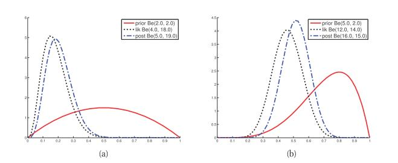

[**返回本章目录**]()

在给定一离散观察序列的情况下, 数字游戏涉及从有限假设空间推断出离散变量的分布, $$h \in \mathcal{H}$$。这使计算变得特别简单：我们只需要求和，乘和除。然而，在许多应用中，未知参数是连续的，因此假设空间是$$\mathbb{R}^K$$的某个子集, 其中$$K$$是参数的个数. 这使数学变得复杂，因为我们必须用积分代替和。但是，基本思路是一样的。

<!--more-->

我们将通过考虑一系列观察到的硬币投掷来推断硬币出现头部的可能性的问题来说明这一点。虽然这看似微不足道，但事实证明，这个模型构成了我们将在本书后面考虑的许多方法的基础，包括朴素的贝叶斯分类器，马尔可夫模型等。这在历史上很重要，因为它是一个例子。在贝叶斯1763年的原始论文中进行了分析。（贝叶斯的分析随后由皮埃尔·西蒙·拉普拉斯推广，创造了我们现在所说的“贝叶斯法则” - 参见（Stigler, 1986）了解更多历史细节。）

我们将遵循现在熟悉的指定拟然和先验的方法，并导出后验和后验预测。

## 3.3.1 拟然

假设$$X_i \sim {\rm Ber}(\theta)$$，其中$$X_i=1$$代表“正面”，$$X_i=0$$代表“反面”，并且$$\theta \in [0,1]$$是速率参数（"正面"的概率）。如果数据是独立同分布\(i.i.d\)，那么拟然形如下式:

$$
p( \mathcal{D} | \theta) = \theta^{N_1} (1-\theta)^{N_0} \tag{3.11}
$$

其中我们有$$N_1=\sum_{i=1}^N {\mathbb{I}(x_i=1)}$$个"正面" 和$$N_0=\sum_{i=0}^N {\mathbb{I}(x_i=1)}$$个"反面"。这两个计数被称为数据的**充分统计**，因为这是我们需要知道的关于$$\mathcal{D}$$推断出$$\theta$$的所有内容。 （另一组充分统计的数据是$$N_1$$和$$N=N_0 + N_1$$）。

更正式地，我们称$$s(\mathcal{D})$$是数据$$\mathcal{D}$$的充分统计, 如果$$p(\theta | \mathcal{D})=p(\theta | s(data))$$。如果我们使用一个均匀先验, 这等价于说, $$p(\mathcal{D} | \theta) \propto p(s(\mathcal{D}) | \theta)$$。因此，如果有两个具有相同充分统计的数据集，我们会推断出相同的$$\theta$$值。

现在假设数据由"正面"计数$$N_1$$ 和固定数观察$$N=N_1+N_0$$组成。在在这种情况下，我们有$$N_1 \sim {\rm Bin}(N,\theta)$$，其中 $${\rm Bin}$$表示二项分布，其具有以下pmf\(概率分布\)：

$$
{\rm Bin}(k | n, \theta)  \overset{\Delta}{=} \binom{n}{k} \theta^k (1-\theta)^{(n-k)} \tag{3.12}
$$

由于$$\binom{n}{k}$$ 是$$\theta$$无关的常数，二项采样模型的拟然等同与伯努利模型的拟然。因此，我们对$$\theta$$做出的任何推论都是相同的, 无论我们是观察$$\mathcal{D}=(N_1,N)$$的计数, 还是观察序列$$\mathcal{D}=\{x_1,\dots,x_N\}$$的计数。

## 3.3.2 先验

我们需要一个支持区间$$[0,1]$$的先验。为了使数学上更容易，如果先验和拟然具有相同的形式, 那会很方便的, 比如形如:

$$
p(\theta) \propto  \theta^{\gamma_1} (1-\theta)^{\gamma_2} \tag{3.13}
$$

其中, $$\gamma_1$$和$$\gamma_2$$是一些特定的先验参数。如果这样的话，那么我们可以很容易通过简单地增加指数来计算后验:

$$
p(\theta | \mathcal{D}) \propto p(\mathcal{D} | \theta) p(\theta)= \theta^{N_1} (1-\theta)^{N_0} \ \theta^{\gamma_1} (1-\theta)^{\gamma_2} = \theta^{N_1 + \gamma_1} (1-\theta)^{N_0 + \gamma_2} \tag{3.14}
$$

> 图3.6 （a）使用具有充分统计量$$N_1=3,N_0=17$$的二项拟然来更新$${\rm Beta}(2,2)$$以生成一个$${\rm Beta}(5,9)$$的后验。 （b）使用具有充分统计量$$N_1=11,,N_0=13$$的二项拟然来更新$${\rm Beta}(5,2)$$以生成一个$${\rm Beta}(16,15)$$的后验。

当在先验和后验具有相同的形式时，我们说，这个先验是相关拟然的**共轭先验**。共轭先验被广泛使用，因为它们简化了计算，并且易于解释， 正如上所示。

在伯努利的情况下，共轭先验是一个$$\beta$$分布，就是我们在第2.4.5节中将会遇到的:

$$
{\rm Beta}(\theta | a,b) \propto \theta^{a-1} (1-\theta)^{b-1} \tag{3.15}
$$

这个先验的参数被称为**超参数**。我们可以设置它们以编码我们先验信念。例如，为了编码我们的信念: $$\theta$$均值为0.7，标准差为0.2，我们可以设置$$a=2.957$$和$$b=1.275$$（练习3.15）。或编码我们的信念: $$\theta$$的均值为0.15，并且有一定概率落在区间$$(0.05,0.30)$$上，那么我们可以找到$$a=4.5$$和$$a=25.5$$ （练习3.16）。

如果我们对$$\theta$$ 一无所知, 除了知道其落在$$[0,1]$$中。 我们可以使用均匀先验，这是一种无信息先验之（详见5.4.2节）。均匀分布可以用的$$\beta$$分布表示, 只要取$$a=b=1$$ 。

## 3.3.3 后验

如果我们通过$$\beta$$先验乘上拟然, 可得到如下的后验\(依照方程3.14\)：

$$
p(\theta | \mathcal{D}) \propto  {\rm Bin}(N_1 | \theta,N_0+N_1) {\rm Beta}(\theta | a,b) \propto {\rm Beta}(\theta | N_1+a,N_0+b)  \tag{3.16}
$$

特别是，后验是通过将先前的超参数加上经验计数获得的。因此，超参数称为 **伪计数**\(pseudo counts\)。先验的强度，也称为先验的**有效样本大小**\(effective sample size\) ，是伪计数的总和,即$$a+b$$; 这起着类似于数据集大小的作用, $$N_1+N_0=N$$。

图3.6（a）给出了一个示例，其中我们使用有尖峰的似然函数来更新弱的$${\rm Beta}(2,2)$$，这是对与大样本量而言的; 我们可看到后验与拟然基本一样： 因为数据已经压倒了先验。图3.6（b）给出了一个示例，其中我们也使用尖峰似然函数来更新强的$${\rm Beta}(5,2)$$; 现在我们看到后验是先验和拟然之间的“妥协”。

请注意，顺序更新后验等效于一次性批量更新。为了看清这一点，假设我们有两个数据集$$\mathcal{D}_a$$和$$\mathcal{D}_b$$, 其充分统计量分别是$$N_1^a,N_0^a$$和$$N_1^b,N_0^b$$。设$$N_1=N_1^a+N_1^b$$和$$N_0=N_0^a+N_0^b$$是组合数据集的充分统计。在批量模式中，我们有:

$$
p(\theta | \mathcal{D}_a,\mathcal{D}_b) \propto  {\rm Bin}(N_1 | \theta,N_0+N_1) {\rm Beta}(\theta | a,b) \propto {\rm Beta}(\theta | N_1+a,N_0+b)  \tag{3.17}
$$

在顺序模式下，我们有:

$$
\begin{aligned}
p(\theta | \mathcal{D}_a,\mathcal{D}_b) & \propto   p(\mathcal{D}_b | \theta) \ p(\theta | \mathcal{D}_a) \\
\quad &  \propto {\rm Bin}(N_1^b | \theta,N_0^b+N_1^b) {\rm Beta}(\theta | N_1^a+a,N_0^a+b)  \\
&\propto {\rm Beta}(\theta | N_1^a+N_1^b+a,N_0^a+N_0^b+b)  
\end{aligned}  \tag{3.18-20}
$$

这使得贝叶斯推理特别适合**在线学习**，我们将在后面看到。

### 3.3.3.1 后验均值和众数\(mode\)

根据公式2.62，MAP估计可由下式给出:

$$
\hat{\theta}_{\rm MAP} = \dfrac{a+N_1-1}{a+b+N-2} \tag{3.21}
$$

如果我们使用均匀先验，那么MAP估计简化成MLE， 这正好是"正面"的经验值:

$$
\hat{\theta}_{\rm MLE} = \dfrac{N_1}{N} \tag{3.22}
$$

这复合直觉，但它也可以通过应用基础微积分来最大化式3.11中的似然函数推导出来 （练习3.1）。

相比之下，后验均值由下式给出:

$$
\bar{\theta} = \dfrac{a+N_1}{a+b+N} \tag{3.23}
$$

这种众数\(等于MAP\)和均值之间的差异将在以后着重证明。

我们现在将展示后验均值是先验均值和MLE的凸组合，它捕捉了后验是我们之前所认为的和数据告诉我们的这两种情况折衷的概念。

令$$\alpha_0=a+b$$ 表示先验的**等效样本尺寸**，通过它控制强度，进而先验均值可写成$$m_1=a/\alpha_0$$。然后，后验均值写成:

$$
\mathbb{E}[\theta|\mathcal{D}]=\dfrac{\alpha_0 m_1 + N_1}{N+\alpha_0}=\dfrac{\alpha_0}{N+\alpha_0}m_1+\dfrac{N}{N+\alpha_0} \dfrac{N_1}{N}=\lambda \ m_1+(1-\lambda) \ \hat{\theta}_{\rm MLE}  \tag{3.24}
$$

其中$$\lambda = \frac{\alpha_0}{N+\alpha_0}$$是先验和后验等效样本尺寸的比率。因此越弱的先验具有越小的$$\lambda$$，进而后验均值越接近MLE。类似可见后验众数是先验众数和MLE的凸组合，并且它也会收敛到MLE。

### 3.3.3.2 后验方差

均值和众数是点估计，但我们知道能够多大程度信任它, 也是是有用的。后验的方差是衡量这点的一种方法。 Beta后验的方差由下式给出:

$$
{\rm Var}[\theta | \mathcal{D}]=\dfrac{(a+N_1)(b+N_0)}{(a+N_1+b+N_0)^2(a+N_1+b+N_0+1)^2} \tag{3.25}
$$

如果$$N\gg a,b$$, 我们可以将这个"吓人"的表达式简化成:

$$
{\rm Var}[\theta | \mathcal{D}] \approx \dfrac{N_1 N_0}{N N N} =  \dfrac{\hat{\theta} (1-\hat{\theta})}{N} \tag{3.26}
$$

其中$$\hat{\theta}$$就是MLE。因此我们估计中的"误差条"（即后验标准差）由下式给出:

$$
\sigma=\sqrt{{\rm Var}[\theta | \mathcal{D}]} \approx \sqrt{\dfrac{\hat{\theta} (1-\hat{\theta})}{N}} \tag{3.27}
$$

我们看到，不确定性随着比率$$1/\sqrt{N}$$降低而降低 。但是请注意，当$$\hat{\theta}=0.5$$时, 不确定性（方差）最大, 而当$$\hat{\theta}$$接近0或1时最小。这意味着它更容易确保硬币偏置比，以确保它是公平。

## 3.3.4 后验预测分布

到目前为止，我们一直关注未知参数的推断。现在让我们把注意力转向预测未来的可观测数据。

考虑在单个未来试验中, 给定$${\rm Beta}(a,b)$$后验, 那么"正面"预测的概率是:

$$
\begin{aligned}
p(\tilde{x} = 1 | \mathcal{D}) & = \int_0^1 {p(x = 1 | \theta)  p(\theta | \mathcal{D}) d \theta}  \\
\quad &  =\int_0^1 {\theta \  {\rm Beta}(\theta | a,b) d \theta} = \mathbb{E}[\theta | \mathcal{D}] = \dfrac{a}{a+b}  
\end{aligned}  \tag{3.28-29}
$$

由此可见, **正例后验预测分布**可用**后验参数均值**等效插入, 进而完整的**后验预测分布**可写成:$$p(\tilde{x} | \mathcal{D})={\rm Ber}(\tilde{x} | \mathbb{E}[\theta | \mathcal{D}])$$。

### 3.3.4.1 过拟合和黑天鹅悖论

我们考虑用MLE近似插入, 即$$p(\tilde{x} | \mathcal{D})={\rm Ber}(\tilde{x} | \hat{\theta}_{\rm MLE})$$。 不幸的是，当样本量很小时，这种近似可能表现很差。例如，假设我们已经看到$$N=3$$个连续"反面"。MLE是$$\hat{\theta}=0/3=0$$，因为要尽可能用到所有观察到的数据。但是，使用这个估计，我们预测"正面"是不可能的。这被称为 **零计数问题** 或 **稀疏数据问题**，并且在从少量数据估计计数时经常发生。有人可能会认为，在“大数据”时代，这种担忧是无关紧要的，但请注意，一旦我们根据某些标准对数据进行区分 - 例如 _特定人员_从事_特定活动_的次数 - 样本量可以变的非常小。例如，当试图执行个性化推荐网页时, 会出现该问题。因此贝叶斯方法仍然有用，即使在大数据体系中也是如此（Jordan 2011）。

零计数问题类似于哲学中所谓**黑天鹅悖论**的问题。这是基于古老的西方观念，即所有天鹅都是白色的。在这种情况下，黑天鹅是一种不可能存在的隐喻。 （黑天鹅是17世纪欧洲探险家在澳大利亚发现的。）“黑天鹅悖论”这个词首先由著名的科学哲学家卡尔波普尔创造; 该术语也被用作最近一本畅销书（Taleb 2007）的标题。这个悖论被用来描述归纳问题，这是如何从过去的特定观察中得出关于未来的一般结论的问题。

现在让我们推导出一个简单的贝叶斯解决方案。我们将使用均匀先验，因此$$a = b = 1$$。在这种情况下，插入后验均值, 得到**拉普拉斯的继承规则**:

$$
p(\tilde{x} = 1 | \mathcal{D}) = \dfrac{N_1 + 1}{N_1+N_0 + 2} \tag{3.30}
$$

这种将经验计数加1，归一化, 然后插入的常见做法，被称为 **加1平滑**\(add-one smoothing\)。 （注意，在MAP参数中插入是不会有这种平滑效果，由于众数形如$$\hat{\theta} = \dfrac{a+N_1-1}{a+b+N-2}$$, 如果$$a = b = 1$$, 那么将变成MLE。）

### 3.3.4.1 预测多个未来试验的结果

假设，我们现在感兴趣的是, 在$$M$$次未来试验中, 预测出现"正面"的次数$$x$$. 可由下式表示:

$$
\begin{aligned}
p(x | \mathcal{D},M) & = \int_0^1{{\rm Bin}(x | \theta,M){\rm Beta}(\theta | a, b) \ d \theta}  \\
\quad &  =\binom{M}{x} \dfrac{1}{B(a, b)} \int_0^1{ \theta^x (1-\theta)^{M-x} \theta^{a-1} (1-\theta)^{b-1} \ d \theta}  
\end{aligned}   \tag{3.31-32}
$$

我们注意到$${\rm Beta}(a+x, M-x+b)$$分布可以积分得到归一化常数。因此

$$
\int_0^1{ \theta^x (1-\theta)^{M-x} \theta^{a-1} (1-\theta)^{b-1} \ d \theta}=B(a+x, M-x+b) \tag{3.33}
$$

于是，我们找到了后验预测的分布, 这就是被称作\(复合的\)$$\beta$$**-二项分布**:

$$
{\rm Bb}(x | a,b,M) \overset{\Delta}{=} \binom{M}{x} \dfrac{B(a+x, M-x+b)}{B(a, b)} \tag{3.34}
$$

该分布具有以下的均值和方差

$$
\mathbb{E}[x] = M \dfrac{a}{a+b}, \quad {\rm Var}[x]=\dfrac{M a b}{(a+b)^2} \dfrac{a+b+M}{a+b+1} \tag{3.35}
$$

如果$$M=1$$，于是$$x \in \{0,1\}$$，我们看到，均值变成$$\mathbb{E}[x | \mathcal{D}] =p(x=1 | \mathcal{D})= \dfrac{a}{a+b}$$，这与公式3.29是一致。

该过程如图3.7（a）所示。我们从$${\rm Beta}(2,2)$$先验开始，并绘制了在看到$$N_1=3$$个"正面"和$$N_0=17$$个"反面"的后验预测密度。图3.7（b）绘制了使用MAP的插入近似。我们看到贝叶斯预测具有更长的尾部，更广泛地扩展其概率质量，因此不太容易出现过拟合和黑天鹅类的悖论。

[**返回本章目录**]()

