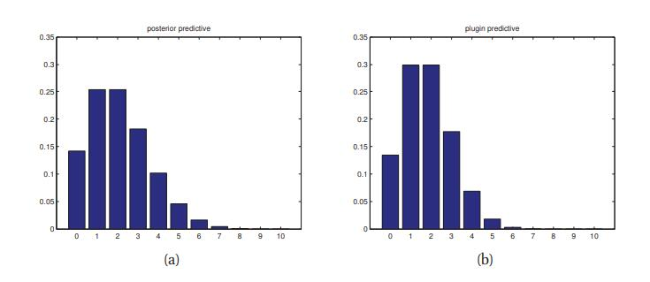
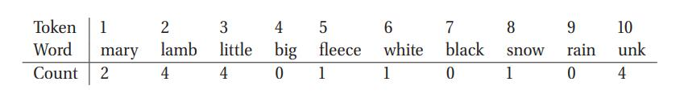

[**返回本章目录**]()

在上一节中，我们讨论了如何推断硬币"正面"出现的概率。在本节中，我们推广这些结果，以推断出有$$K$$面的骰子出现第$$k$$面的概率。这似乎是另一种玩具练习，但将在后面看到, 我们的研究方法将被广泛用于分析文本数据，生物序列数据等。

<!--more-->

## 3.4.1 拟然

我们观察丢$$N$$次骰子，$$\mathcal{D}=\{x_1,\dots,x_N\}$$ ，其中$$x_i \in \{1,\dots,K\}$$。如果假设数据是i.i.d的，那么似然形如下式:

$$
p(\mathcal{D} | \boldsymbol{\theta})= \prod_{k=1}^K {\theta_k^{N_k}} \tag{3.36}
$$

其中$$N_k=\sum_{i=1}^N {\mathbb{I}(x_i=k)}$$是事件$$k$$发生的次数（这是该模型的充分统计）。多项模型的拟然具有相同的形式，只相差一个不相关的常数因子。

> 图3.7 （a）在看到$$N_1=3,N_0=17$$后的后验预测。（b）绘制了使用MAP的插入近似。

## 3.4.2 先验

由于参数向量落在一个K维概率单纯形中，我们需要支持这个单纯形的先验，理想情况下它也是共轭的。幸运的是，狄利克雷分布（第2.5.4节）满足两个标准。所以我们将使用如下先验：

$$
{\rm Dir}(\boldsymbol{\theta} | \alpha)=\dfrac{1}{B(\alpha)}\prod_{k=1}^K {\theta_k^{\alpha_k - 1} \mathbb{I}(\boldsymbol{\theta} \in S_K)} \tag{3.37}
$$

## 3.4.3 后验

将上面的拟然乘上先验得到的后验, 也是狄利克雷分布分布:

$$
\begin{aligned}
p(\boldsymbol{\theta} | \mathcal{D}) & \propto p(\mathcal{D} | \boldsymbol{\theta}) p(\boldsymbol{\theta})  \\
\quad &  \propto \prod_{k=1}^K {\theta_k^{N_k} \  \theta_k^{\alpha_k - 1}} = \prod_{k=1}^K { \theta_k^{\alpha_k + N_k - 1}}   \\
\quad &  = {\rm Dir}(\boldsymbol{\theta} | \alpha_1+N_1,\dots,\alpha_K+N_K)  
\end{aligned} \tag{3.38-40} 
$$

我们看到，这个后验是通过先验的超参数（伪计数 ）$$\alpha_k$$加上经验计数$$N_k$$而获得的.。

我们可以通过使用微积分推导出该后验的众数（即，MAP估计）， 当然我们必须强制约束$$\sum_k {\theta_k} = 1$$  。我们可以使用拉格朗日乘子做到这一点 。受约束的目标函数，或 拉格朗日量，就是对数似然, 加上对数,再加上约束项:

$$
\ell(\boldsymbol{\theta}, \lambda) = \sum_k \ {N_k {\rm log} \theta_k}+\sum_k \ {(\alpha_k-1) {\rm log} \theta_k} + \lambda \left(1- \sum_k {\theta_k} \right) \tag{3.41}
$$

为了简化记号, 我们定义$$N_k^{'} \overset{\Delta}{=}N_k+\alpha_k-1$$ 。取$$\lambda$$取导数产生原始约束：

$$
\dfrac{\partial \ell}{\partial \lambda} = 1- \sum_k {\theta_k} = 0 \tag{3.42}
$$

对$$\theta_k$$求导数:

$$
\dfrac{\partial \ell}{\partial \theta_k} = \dfrac{N_k^{'}}{\theta_k}-\lambda=0 \tag{3.43}
$$

$$
N_k^{'}=\lambda \ \theta_k \tag{3.44}
$$

利用约束求和可以解出$$\lambda$$:

$$
\sum_k {N_k^{'}} = \lambda \sum_k {\theta_l} \tag{3.45}
$$

$$
N+\alpha_0-K = \lambda  \tag{3.46}
$$

其中 ，$$\alpha_0 \overset{\Delta}{=} \sum_{k=1}^K {\alpha_k}$$是先验的等效样本尺寸。因此，MAP估计由下式给出:

$$
\hat{\theta}_k=\dfrac{N_k+\alpha_k-1}{N+\alpha_0-K} \tag{3.47}
$$

这与公式2.77是一致。如果我们使用均匀先验$$\alpha_k=1$$，我们再次得到类似的MLE:

$$
\hat{\theta}_k=\dfrac{N_k}{N} \tag{3.48}
$$

这恰好是$$k$$面朝上的经验分式。

## 3.4.4 后验预测

这个后验预测分布, 是基于一个单独的多项试验, 表示如下:

$$
\begin{aligned}
p(X=j|\mathcal{D}) & = \int {p(X=j|\boldsymbol{\theta}) p(\boldsymbol{\theta} | \mathcal{D}) d\boldsymbol{\theta}}   \\
  \quad &  =  \int {p(X=j|\theta_j) \left[\int { p(\boldsymbol{\theta}_{-j},\theta_j | \mathcal{D}) d\boldsymbol{\theta}_{-j}} \right] d \theta_j}    \\
  \quad &  =  \int {\theta_j\ p(\theta_j | \mathcal{D}) d \theta_j}=\mathbb{E}[\theta_j | \mathcal{D}]=\dfrac{\alpha_j+N_j}{\sum_k {(\alpha_k+N_k)}}=\dfrac{\alpha_j+N_j}{\alpha_0+N}
\end{aligned}  \tag{3.49-51} 
$$

其中$$\boldsymbol{\theta}_{-j}$$表示从参数向量$$\boldsymbol{\theta}$$中剔除$$\theta_j$$后的降1维向量.。参考练习3.13。

正如我们在3.3.4.1节中看到的那样，上面的表达式避免了零计数问题。实际上，这种贝叶斯平滑的形式,在多项情况下比二项的情况更加重要，因为一旦我们开始将数据划分为多个类别, 数据稀疏的拟然会增加。

### 3.4.4.1 工作示例：使用词袋的语言模型

使用狄利克雷-多项模型进行贝叶斯平滑的一种应用是**语言建模**，这意味着要预测在一个句子中下个可能出现的单词。在这里，我们将采取一种非常简单的方法，假设第$$i$$个单词$$X_i \in {1,\dots,K}$$简单地独立于所有其他单词, 采用$${\rm Cat}(\boldsymbol{\theta})$$分布。称此为**词袋模型**\(bag of words model.\)。在获得已经出现的单词序列，我们如何预测下一个可能会出现哪一个？

例如，假设我们观察到如下的序列（儿童童谣的一部分）：

Mary had a little lamb, little lamb, little lamb,

Mary had a little lamb, its fleece as white as snow

此外，假设我们的词汇包括以下词语：

mary lamb little big fleece white black snow rain unk

1 2 3 4 5 6 7 8 9 10

这里**unk**代表未知，表示列表中没有出现的所有其他单词。为了编码童谣的每一行，我们首先去除标点符号，并删除任何**停止词** ，如“a”，“as”，“the”等。我们也可以执行**词干**，这意味着将词语缩减为基本形式, 比如删除复数尾部的s， 或 动词的ing（例如， _running_ 变得 _run_）。在这个例子中，没有词需要词干。最后，我们将每个单词用词汇表的索引替换：

1 10 3 2 3 2 3 2

1 10 3 2 10 5 10 6 8

我们现在忽略单词次序，并计算每个单词出现的频率，从而产生一个单词计数的直方图：

将上述计数记为$$N_j$$。如果我们对$$\boldsymbol{\theta}$$使用$${\rm Dir}(\alpha)$$先验，那么后验预测就是:

$$
p(\tilde{X}=j | \mathcal{D})=\mathbb{E}[\theta_j | \mathcal{D}] = \dfrac{\alpha_j+N_j}{\sum_{j^{'}} {(\alpha_{j^{'}}+N_{j^{'}})}}= \dfrac{1+N_j}{10+17} \tag{3.52}
$$

其中第二等式后, 取$$\alpha_j=1$$, 进而得到:

$$
p(\tilde{X}=j | \mathcal{D})=(3/27,5/27,5/27,1/27,2/27,2/27,1/27,2/27,1/27,5/27) \tag{3.53}
$$

这个模型的预测分布是$$X = 2$$（“lamb”）和 $$X = 10$$\(“unk”\)。请注意，"big”，“black”和“rain”这些词在未来也会以非零概率发生，即使它们以前从未见过。稍后我们将看到更复杂的语言模型。

[**返回本章目录**]()

