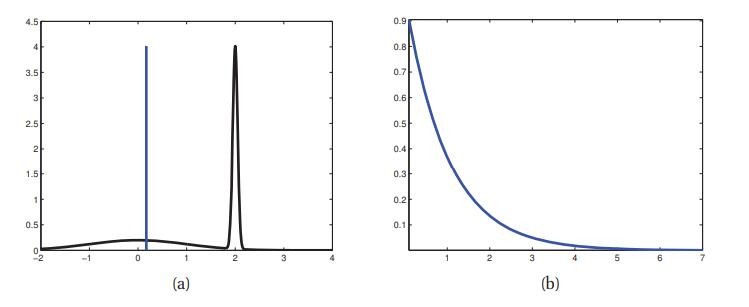
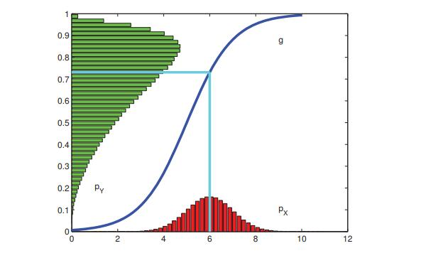
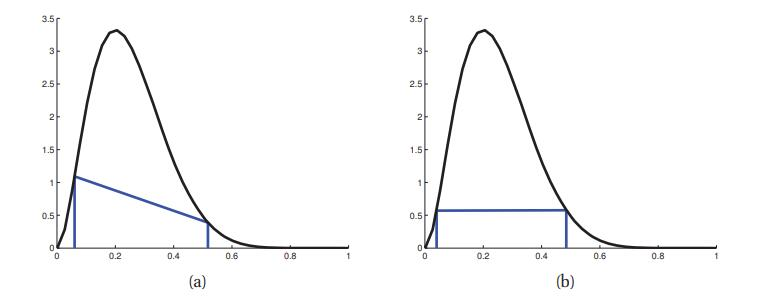
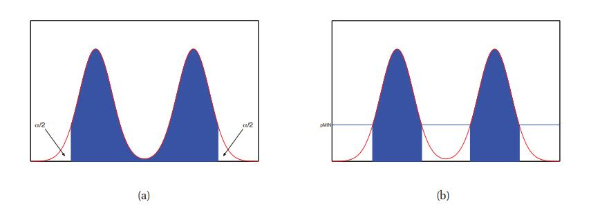
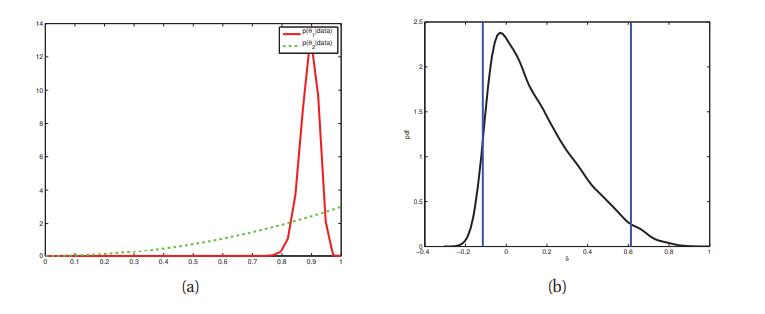

# 5.2 后验分布总结

[**返回本章目录**]()

后验$$p(\boldsymbol{\theta} | \mathcal{D})$$总结了我们所知道的关于未知量$$\boldsymbol{\theta}$$的一切。 在本节中，我们将讨论一些可以从概率分布中导出的简单量，例如后验。这些摘要统计数据通常比完整联合更容易理解和可视化。

<!--more-->

## 5.2.1 最大后验估计\(MAP\)

我们可以通过计算后验均值，中位数或众数来轻松计算未知量的**点估计**。在5.7节中，我们讨论了如何使用决策理论在这些方法之间进行选择。通常，后验均值或中位数是实际评估数量的最合适选择，后验边缘向量是离散量的最佳选择。然而，后验众数，即MAP估计，是最受欢迎的选择，因为它归结到优化问题，对于该优化问题，通常存在有效算法。此外，通过将对数先验视为正则化器，可以用非贝叶斯项来解释MAP估计（更多细节见6.5节）。

虽然这种方法具有计算吸引力，但重要的是要指出MAP估计存在各种缺点，我们将在下面简要讨论。这将为我们在本章后面（以及本书的其他部分）更彻底研究贝叶斯方法提供动力。

### 5.2.1.1 无法度量不确定性

MAP估计的最明显的缺点，实际上是任何其他**点估计**\(例如后验均值或中位数\)的缺点，就是它不提供不确定性的任何度量。在许多应用中，重要的是要知道可以多大程度上信任给定估计的。正如我们在5.2.2节中讨论的那样，我们可以从后验推导出这种置信度量。

### 5.2.1.2 MAP估计插入可能导致过拟合

在机器学习中，我们通常更关心预测准确性，而不是解释模型的参数。但是，如果我们不对参数中的不确定性进行建模，那么我们的预测分布就会过于自信。我们在第3章中看到了几个这样的例子，我们稍后会看到更多的例子。在我们可能厌恶风险的情况下，过度自信的预测尤其成问题; 详见5.7节。

### 5.2.1.3 众数是一个非典型点

选择众数作为后验分布的摘要通常是一个非常糟糕的选择，因为众数通常是非常不典型的分布，不像平均值或中位数。 对于1d连续空间，如图5.1（a）所示。基本问题是众数是零测度点，而平均值和中值考虑空间体积。 另一个例子如图5.1（b）所示：这里众数为0，但均值为非零。 在推断方差参数时，尤其是在分层模型中，通常会出现这种偏差分布。在这种情况下，MAP估计（以及因此MLE）显然是非常糟糕的估计。

> 图5.1 （a）双峰分布，其中众数非常不典型。细蓝色垂直线是均值，可以说是分布的更好总结，因为它接近概率质量的大部分。由_bimodalDemo_生成的图。（b）偏差分布，其中众数与均值完全不同。由_gammaPlotDemo_生成的图。

如果众数不是一个好的选择，我们应该如何摘要后验？ 答案是使用决策理论，我们将在5.7节中讨论。基本思想是指定一个损失函数，其中$$L(\theta,\hat{\theta})$$是你发生的损失，如果事实是$$\theta$$而你的估计是$$\hat{\theta})$$。如果我们使用0-1损失，$$L(\theta,\hat{\theta})=\mathbb{I}(\theta \ne \hat{\theta})$$，则最优估计是后验众数。0-1损失意味着如果你没有错误，你只能获得“积分”，否则你什么也得不到：在这个损失函数下没有“部分信用”！对于连续值，我们通常更喜欢使用平方误差损失，$$L(\theta,\hat{\theta})=(\theta-\hat{\theta})^2$$; 然后，相应的最优估计是后验均值，如5.7节所示。或者我们可以使用更鲁棒的损失函数，$$L(\theta,\hat{\theta})=\left|\theta-\hat{\theta}\right |$$，这会产生后验中位数。

### 5.2.1.4 MAP估计对重新参数化是不变的\*

> 图5.2 非线性变换下密度变换的例子。注意变换分布的众数不是原始众数的变换。 基于（Bishop 2006b）的练习1.4。由_bayesChangeOfVar_生成的图。

MAP估计的一个更微妙的问题是我们得到的结果取决于我们如何参数化概率分布。从一个表示变换到另一个等效表示结果变了，这是不太理想的，因为测量单位是任意的（例如，当测量距离时，我们可以使用厘米或英寸）。

要理解这个问题，假设我们计算$$x$$的后验。如果我们定义$$y = f(x)$$，则$$y$$的分布由公式2.87给出，为方便起见，我们在此再写一遍：

$$
p_y(y)=p_x(x)\left|\dfrac{dx}{dy}\right| \tag{5.1}
$$

$$\left|\dfrac{dy}{dx}\right|$$项称为雅可比式\(其推广便是雅可比行列式\)，它度量单位量经过$$f$$所引起的变化的大小。设$$\hat{x}=\underset{x}{\rm argmax} \ p_x(x)$$为$$x$$的MAP估计。一般来说，$$\hat{y}=\underset{y}{\rm argmax} \ p_y(y)$$不是由$$\hat{x}$$给出。 比如：设$$x \sim \mathcal{N}(6,1)$$和$$y=f(x)$$，这里

$$
f(x)=\dfrac{1}{1+\exp (-x+5)} \tag{5.2}
$$

我们可以使用蒙特卡罗模拟得出$$y$$的分布（参见第2.7.1节）。 结果如图5.2所示。我们看到原始高斯已经被非线性的S函数\(sigmoid\)“压扁”。特别地，我们看到变换分布的众数不等于原始众数的变换。

要了解在MAP估计的背景下如何出现此问题，请考虑以下由于Michael Jordan提供的示例。伯努利分布通常由其均值$$\mu$$参数化，因此$$p(y=1 | \mu)=\mu$$，其中$$y \in \{0,1\}$$。假设我们在单位区间上有一个均匀的先验：$$p_{\mu}(\mu)=\mathbb{I}(0 \le \mu \le 1)$$。如果没有数据，MAP估计只是先验的众数，可以是0到1之间的任何值。我们现在将展示不同的参数化可以任意选择该区间中的不同点。

首先设$$\theta=\sqrt{\mu}$$，于是$$\mu = \theta^2$$。那么新的先验是

$$
p_{\theta}(\theta)=p_{\mu}(\mu)\left|\dfrac{d\mu}{d\theta}\right|=2 \theta \tag{5.3}
$$

对$$\theta \in [0,1]$$，于是新的众数是

$$
\hat{\theta}_{\rm MAP} = \underset{\theta \in [0,1]}{\rm argmax} \ 2\theta=1 \tag{5.4}
$$

现在设$$\phi=1-\sqrt{1-\mu}$$。那么新的先验是

$$
p_{\phi}(\phi)=p_{\mu}(\mu)\left|\dfrac{d\mu}{d\phi}\right|=2 (\phi - 1) \tag{5.5}
$$

对$$\phi \in [0,1]$$，新的众数是

$$
\hat{\phi}_{\rm MAP} = \underset{\phi \in [0,1]}{\rm argmax} \ 2 (\phi - 1)=0 \tag{5.6}
$$

因此，MAP估计取决于参数化。MLE不会受此影响，因为拟然是函数，而不是概率密度。贝叶斯推断也不会遇到这个问题，因为在参数空间上积分时会考虑度量的变换。该问题的一个解决方案是优化以下目标函数：

$$
\hat{\boldsymbol{\theta}}=\underset{\theta}{\rm argmax} \ p(\mathcal{D} | \boldsymbol{\theta}) p(\boldsymbol{\theta})\left|\boldsymbol{I}(\boldsymbol{\theta})\right|^{-\frac{1}{2}} \tag{5.7}
$$

这里$$\boldsymbol{I}(\boldsymbol{\theta})$$是与$$p(\boldsymbol{x} | \boldsymbol{\theta})$$相关的Fisher信息矩阵\(the Fisher information matrix\)（见6.2.2节）。由于（Jermyn 2005; Druilhet and Marin 2007）中解释的原因，该估计是参数化独立的。不幸的是，公式5.7的优化通常很困难，这最大程度上减少了整个方法的吸引力。

## 5.2.2 可信区间\(Credible intervals\)

> 译者注: 本节稍后会区分: 频率派的**置信区间**\(confidence intervals\) 和 贝叶斯的**可信区间**\(Credible intervals\)。

除了点估计，我们常需要一定可信度。 某些（标量）量$$\theta$$的标准置信度是其后验分布的“宽度”。这可以使用$$100 (1-\alpha)\%$$**可信区间**来度量，该区间是（连续的）区域$$C=(l,u)$$（代表下上界），其包含后验概率质量的$$1-\alpha$$，即，

$$
C_{\alpha}(\mathcal{D})=(l,u):P(l \le \theta \le u | \mathcal{D})=1-\alpha \tag{5.8}
$$

可能这样的区间有很多\(不唯一\)，所以我们选择一个这样的区间，两边尾部有$$(1-\alpha)/2$$质量; 这被称为**中央区间**\(置信区间的一个特例\)。

如果后验具有已知的函数形式，我们可以使用$$l=F^{-1}(\alpha/2)$$和$$u=F^{-1}(1-\alpha/2)$$计算后验中心区间，其中F是后验的cdf。例如，如果后验是高斯的，$$p(\theta | \mathcal{D})=\mathcal{N}(0,1)$$和$$\alpha=0.05$$，那么我们有$$l=\Phi(\alpha/2)=-1.96$$和$$l=\Phi(1-\alpha/2)=1.96$$，其中$$\Phi$$表示高斯的cdf。如图2.3（c）所示。这证明了以$$\mu \pm 2 \sigma$$形式表示可信区间这种通常做法，其中$$\mu$$表示后验均值，$$\sigma$$表示后验标准差，2是对1.96的良好近似。

当然后验不总是高斯的。例如，在我们的硬币示例中，如果我们使用均匀先验并且我们观察$$N=100$$个试验中的$$N_1=47$$个"正面"，那么后验是β分布，$$p(\theta | \mathcal{D})={\rm Beta}(48,54)$$。 我们发现95％后验可信区间是$$(0.3749,0.5673)$$（参见我们用来计算本行的Matlab代码的betaCredibleInt中的一行）。

如果我们不知道函数形式，但我们可以从后验绘制样本，那么我们可以使用蒙特卡罗逼近后验分位数：我们简单地对$$S$$个样本进行排序，并沿着排序列表找到在$$\alpha/S$$位置发生的样本 。当$$S \to \infty$$时，这会收敛到真正的分位数。 有关演示，请参阅_mcQuantileDemo_。

人们经常混淆贝叶斯**可信区间**\(Credible intervals\)与频率派的**置信区间**\(confidence intervals\)。但是，它们并不是一样的，正如我们在6.6.1节中讨论的那样。一般来说，可信区间通常是人们想要计算的区间，但置信区间通常是他们实际计算的区间，因为大多数人都是被频率派统计教导而不是贝叶斯统计。幸运的是，计算可信区间的机制与计算置信区间一样简单（例如，如何在Matlab中计算, 参见betaCredibleInt）。

### 5.2.2.1 最高后验密度区域 \*

中心区间的问题是在CI之外可能存在具有较高概率密度的点。如图5.3（a）所示，我们看到最左侧CI边界外的点的密度高于最右侧CI边界内的点。

> 如图5.3 \(a\) 中心区间和 \(b\) Beta\(3,9\)先验的HPD区域。 CI \(0.06, 0.52\) 和 HPD \(0.04, 0.48\)。基于（Hoff 2009）的图3.6。 由_betaHPD_生成的图。

这引入了被称作**最高后验密度**或**HPD**区域的替代量。这被定义为总共构成概率质量$$100 (1-\alpha)\%$$的最可能（的一组）点。更正式地，我们在pdf上找到阈值$$p^{*}$$，使得

$$
1-\alpha = \int_{\theta:p(\theta|\mathcal{D})>p^{*}}{p(\theta|\mathcal{D})d\theta} \tag{5.9}
$$

然后将HPD定义为

$$
C_{\alpha}=\{\theta:p(\theta|\mathcal{D})\ge p^{*}\} \tag{5.10}
$$

在1维中，HPD区域有时被称为**最高密度区间**或**HDI**。例如，图5.3（b）显示了Beta（3,9）分布的95％HDI，即（0.04,0.48）。我们看到它比CI更窄，尽管它仍然包含95％的质量; 此外，它内部的每个点都具有比其外部的每个点更高的密度。

对于单峰分布，HDI将是围绕众数且包含95％质量的的最窄区间。为了看到这一点，想象一下“注水”的反向\(译者注: "抽水"可以使得水平面降低\)，我们降低水平面直到95％的质量被揭示，只有5％被淹没。这给出了在1维情况下计算HDI的简单算法：简单地搜索点，使得区间包含95％的质量并且具有最小宽度。如果我们知道分布的逆CDF，或者通过搜索已排序数据点（如果我们有一袋样本），那么可以通过1维数值优化来完成（参见演示的_betaHPD_）。

如果后验是多峰的，则HDI甚至可能不是连通区域：例如，见图5.4（b）。 然而，总结多峰后验总是很困难。

> 图5.4 \(a\) 中心区间和 \(b\) 基于多峰后验假设的HPD区域。 基于图2.2（Gelman等人，2004）。_postDensityIntervals_生成的图。

## 5.2.3 比例差异推断\(Inference for a difference in proportions\)

有时我们有多个参数，我们有兴趣计算这些参数的某些函数的后验分布。例如，假设您即将从Amazon.com购买东西，并且有两个卖家以相同的价格提供它。卖家1有90条正面评价和10条负面评价。卖家2有2条正面评价和0条负面评价。 你应该买谁？

从表面上看，你应该选择卖家2，但我们不能非常确信卖家2更好，因为它的评论很少。在本节中，我们勾画这个问题的贝叶斯分析。对各种其他设置的组, 可用类似的方法比较其比率或比例。

设$$\theta_1$$和$$\theta_2$$是两个卖家的未知可靠性。由于我们对它们知之甚少，我们将赋予它们均匀的先验，$$\theta_i \sim {\rm Beta}(1,1)$$。后验就是$$p(\theta_1 | \mathcal{D}_1)={\rm Beta}(91,11)$$和$$p(\theta_2 | \mathcal{D}_2)={\rm Beta}(3,1)$$。

我们希望计算$$p(\theta_1>\theta_2)$$。为方便起见，我们将$$\delta=\theta_1-\theta_2$$定义为比率的差异。（或者我们可能希望工作在对数优势比项上。）我们可以使用数值积分计算所需要的量：

$$
\begin{aligned}
p(\delta>0|\mathcal{D})=&\int_0^1{\int_0^1{\mathbb{I}(\theta_1>\theta_2){\rm Beta}(\theta_1|y_1+1,N_1-y_1+1)}}\\
\quad & {\rm Beta}(\theta_2|y_2+1,N_2-y_2+1)d\theta_1 d\theta_2 
\end{aligned} \tag{5.11}
$$

我们发现$$p(\delta>0|\mathcal{D})=0.710$$，这意味着你最好从卖家1购买！有关代码，请参阅_amazonSellerDemo_。 （也可以通过解这个积分分析问题（Cook2005）。）

解决这个问题的一种更简单的方法是通过蒙特卡罗采样来近似后验$$p(\delta|\mathcal{D})$$。这很容易，因为$$\theta_1$$和$$\theta_2$$是后验独立的，并且都具有β分布，可以使用标准方法对其进行采样。分布$$p(\theta_i|\mathcal{D})$$如图5.5（a）所示，对$$p(\delta|\mathcal{D})$$的MC近似，以及95％HPD，如图5.5（b）所示。 通计数$$\theta_1>\theta_2$$的样本占比，得到对$$p(\delta>0|\mathcal{D})$$的MC近似。 结果是0.718，非常接近确切的值。 （有关代码，请参阅amazonSellerDemo。）

> 如图5.5 \(a\) 精确后验$$p(\theta_i|\mathcal{D})$$。 \(b\) 蒙特卡罗近似到$$p(\delta|\mathcal{D})$$。 我们使用核密度估计来获得平滑的图。 垂直线包围95％的中心间隔。 由_amazonSellerDemo_生成的图。

[**返回本章目录**]()

