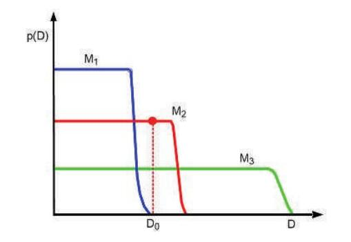
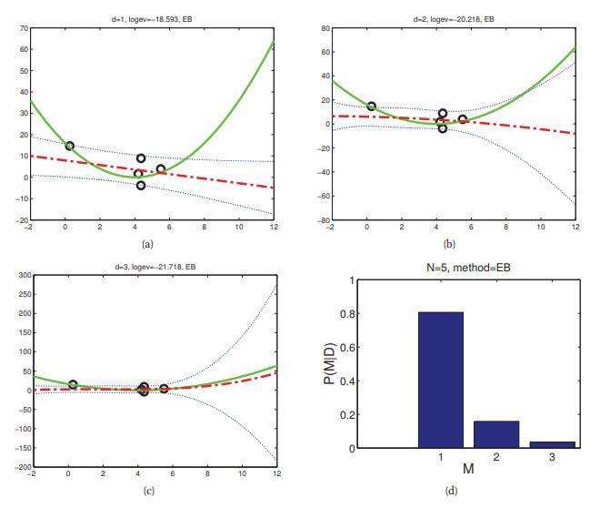
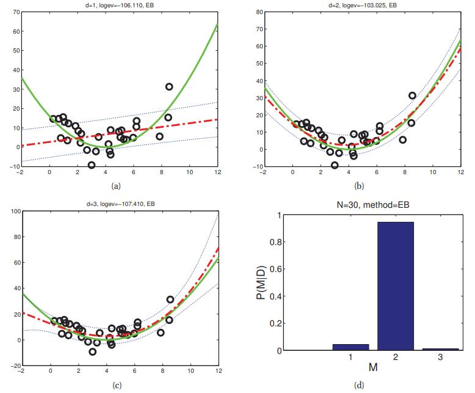
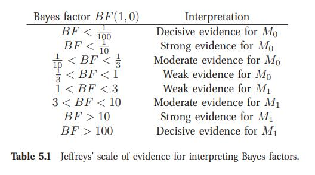
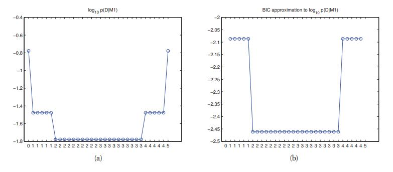

[**返回本章目录**]()

在图1.18中，我们看到使用过高度数多项式会导致过拟合，而使用过低度数会导致欠拟合。类似地，在图7.8（a）中，我们看到使用太小正则化参数会导致过拟合，而太大值会导致欠拟合。一般来说，当面对一组不同复杂度的模型（即参数分布族）时，我们应该如何选择最好的模型呢？这称为**模型选择**问题。

<!--more-->

一种方法是使用交叉验证来估计所有候选模型的泛化误差，然后选择看起来最好的模型。然而，这需要将每个模型拟合K次，其中K是CV折叠的数量。一种更有效的方法是计算模型后验，

$$
p(m|\mathcal{D})=\dfrac{p(\mathcal{D}|m)p(m)}{\sum_{m\in \mathcal{M}}(m,\mathcal{D})} \tag{5.12}
$$

据此, 我们可以容易计算MAP模型，$$\hat{m}=\underset{m}{\rm argmax} \ p(m|\mathcal{D})$$。这被称为**贝叶斯模型选择**。

如果我们使用均匀的先验模型，$$p(m) \propto 1$$，这相当于选择模型使得最大化的下式

$$
p(\mathcal{D}|m)=\int{p(\mathcal{D}|\boldsymbol{\theta})p(\boldsymbol{\theta}|m)d\boldsymbol{\theta}} \tag{5.13}
$$

此量被称为模型m的**边际拟然**，**积分拟然**或**证据**。有关如何执行此积分的详细信息将在第5.3.2节中讨论。但首先，我们会直观地解释了这个量意味着什么。

## 5.3.1 贝叶斯奥卡姆剃刀

有人可能认为使用$$p(\mathcal{D}|m)$$来选择模型总是偏爱具有最多参数的模型。如果我们使用$$p(\mathcal{D}|\hat{\boldsymbol{\theta}}_m)$$来选择模型，上述观点这是正确的，其中$$\hat{\boldsymbol{\theta}}_m$$是模型$$m$$参数的MLE或MAP估计，因为具有更多参数的模型将更好地拟合数据，因此实现更高拟然。但是，如果我们对参数积分而不是最大化它们，我们会自动防止过度拟合：具有更多参数的模型不一定具有更高的边际拟然。这被称为贝叶斯奥卡姆的剃刀效应（MacKay 1995b; Murray和Ghahramani 2005），以奥卡姆剃刀的原则命名，它说应该选择能够充分解释数据的最简单的模型。

理解贝叶斯奥卡姆剃刀的一种方法是注意到边际拟然可以根据概率链规则重写如下（公式2.5）：

$$
p(\mathcal{D})=p(y_1)p(y_2|y_1)p(y_3|y_{1:2})\dots p(y_N|y_{1:N-1}) \tag{5.14}
$$

这里我们为了简洁而放弃了数据的$$x$$部分。这类似于拟然的留一交叉验证估计（第1.4.8节），因为给定所有以前的点我们预测了未来点。 （当然，上述表达式中数据的顺序无关紧要。）如果一个模型过于复杂，它将过拟合“早期”的例子，然后会很难预测其余的模型。

理解贝叶斯奥卡姆剃刀效果的另一种方法是注意概率必须总和为1。因此$$\sum_{\mathcal{D}^{'}}{p(\mathcal{D}^{'}|m)}=1$$，这里的求和是对所有可能的数据集的。可以预测许多事物的复杂模型必须将它们的概率质量分散，因此任何给定数据集的简单模型都不会获得过大的概率。这有时被称为**概率质量守恒原理**\(the conservation of probability mass principle\)，如图5.6所示。在横轴上，我们按照复杂性增加的顺序绘制所有可能的数据集（在某种抽象意义上测量）。在纵轴上，我们绘制了3种可能模型的预测：一个简单的模型$$M_1$$; 中等的$$M_2$$; 一个复杂的$$M_3$$。我们还用垂直线表示实际观察到的数据$$\mathcal{D}_0$$。模型1太简单，并且给$$\mathcal{D}_0$$分配的概率很低。模型3还是指定$$\mathcal{D}_0$$相对较低的概率，因为它可以预测许多数据集，因此它可以相当广泛和薄地传播其概率。模型2“恰到好处”：它以合理的置信度预测观测数据，但不能预测太多其他事物。因此，模型2是最可能的模型。

> 如图5.6 贝叶斯奥卡姆剃刀的示意图。宽（绿色）曲线对应于复杂模型，窄（蓝色）曲线对应于简单模型，中间（红色）曲线恰好对应。 基于（Bishop 2006a）的图3.13。 另见（Murray和Ghahramani 2005，图2）在真实数据上产生的类似图。

作为贝叶斯奥卡姆剃刀的具体示例，请考虑图5.7中的数据。我们绘制度数为1,2和3的多项式拟合N = 5个数据点。它还显示了模型后验，这里我们使用了一个高斯先验（详见7.6节）。没有足够的数据来证明复杂模型的合理性，因此MAP模型的d = 1。图5.8显示了当N = 30时发生什么。现在很清楚，d = 2是正确的模型（数据实际上是从二次方生成的）。

> 图5.7 \(a-c\) 我们使用经验贝叶斯绘制度数为1,2和3的多项式拟合N = 5个数据点。 实线绿色曲线是真实函数，虚线红色曲线是预测（蓝色虚线表示平均值周围的±σ）。 \(d\) 我们绘制模型后验$$p(d|\mathcal{D})$$，假设均匀先验$$p(d) \propto 1$$。 基于Zoubin Ghahramani的数字。 由_linregEbModelSelVsN_生成的图。

> 图5.8 与图5.7相同，但现在N = 30.由_linregEbModelSelVsN_生成的图。

作为另一个例子，图7.8（c）绘制了对于多项式岭回归模型的$$\log \ p(\mathcal{D}|\lambda)$$ v.s. $$\log(\lambda)$$，其中$$\lambda$$在CV实验中使用的同一组值。我们看到最大证据出现在与测试MSE的最小值大致相同的点上，也对应于CV选择的点。

当使用贝叶斯方法时，我们不限于在有限的网格值下评估证据。相反，我们可以使用数值优化来找到$$\lambda^{*}=\underset{\lambda}{\rm argmax} \ p(\mathcal{D}|\lambda)$$。这种技术称为**经验贝叶斯**或**II型最大似然**（详见5.6节）。 图7.8（b）中显示了一个示例：我们看到曲线具有与CV估计相似的形状，但可以更有效地计算。

## 5.3.2 计算边际拟然（证据）

在讨论固定模型的参数推断时，我们经常写成

$$
p(\boldsymbol{\theta} | \mathcal{D}, m)  \propto  p(\boldsymbol{\theta} | m)  p(\mathcal{D} | \boldsymbol{\theta}, m)  \tag{5.15}
$$

这里忽略有归一化常量$$p(\mathcal{D}|m)$$。 这是有效的，因为$$p(\mathcal{D}|m)$$是关于$$\boldsymbol{\theta}$$的常数。但是，在比较模型时，我们需要知道如何计算边际似然$$p(\mathcal{D}|m)$$。一般来说，这可能非常困难，因为我们必须对所有可能的参数值积分，但是当我们有一个共轭先验时，它很容易计算，正如我们现在所示。

设$$p(\boldsymbol{\theta})=q(\boldsymbol{\theta})/Z_0$$为我们的先验，其中$$q(\boldsymbol{\theta})$$为非归一化分布，$$Z_0$$为先验的归一化常数。 令$$p(\mathcal{D}|\boldsymbol{\theta})=q(\mathcal{D}|\boldsymbol{\theta})/Z_l$$为拟然，其中$$Z_l$$包含似然中的所有常数因子。最后让$$p(\boldsymbol{\theta}|\mathcal{D})=q(\boldsymbol{\theta}|\mathcal{D})/Z_N$$为我们后验，其中$$q(\boldsymbol{\theta}|\mathcal{D})=q(\mathcal{D}|\boldsymbol{\theta})q(\boldsymbol{\theta})$$为非归一化后验，$$Z_N$$为后验的归一化常数。我们有

$$
\begin{aligned}
p(\boldsymbol{\theta}|\mathcal{D}) =&\dfrac{p(\mathcal{D}|\boldsymbol{\theta})p(\boldsymbol{\theta})}{p(\mathcal{D})}  \\
\dfrac{q(\boldsymbol{\theta}|\mathcal{D})}{Z_N} =&\dfrac{q(\mathcal{D}|\boldsymbol{\theta})q(\boldsymbol{\theta})}{Z_l Z_0p(\mathcal{D})}  \\
p(\mathcal{D}) =&\dfrac{Z_N}{Z_l Z_0 } 
\end{aligned} \tag{5.16-18}
$$

因此，假设相关的归一化常数易于处理，我们有一种简单的方法来计算边际拟然。我们在下面给出一些例子。

### 5.3.2.1 $\beta$-二项模型

让我们将上述结果应用于$$\beta$$-二项模型。由于我们知道$$p(\theta|\mathcal{D})={\rm Beta}(\theta | a^{'},b^{'})$$，其中$$a^{'} = a + N_1$$和$$b^{'} = b + N_0$$，我们知道后验的归一化常数是$$B(a^{'},b^{'})$$。于是

$$
\begin{aligned}
p(\theta|\mathcal{D}) = & \dfrac{p(\mathcal{D}|\theta)p(\theta)}{p(\mathcal{D})}  \\
\quad =& \dfrac{1}{p(\mathcal{D})} \left[\dfrac{1}{B(a,b)} \theta^{a-1}(1-\theta)^{b-1}\right]\left[\binom{N}{N_1}  \theta^{N_1}(1-\theta)^{N_0}\right]  \\
\quad =& \binom{N}{N_1}\dfrac{1}{p(\mathcal{D})}\dfrac{1}{B(a,b)} \left[ \theta^{a+N_1-1}(1-\theta)^{b+N_0-1}\right] 
\end{aligned} \tag{5.19-21}
$$

所以

$$
\begin{aligned}
\dfrac{1}{B(a+N_1,b+N_0)}= & \binom{N}{N_1}\dfrac{1}{p(\mathcal{D})}\dfrac{1}{B(a,b)}  \\
p(\mathcal{D})= & \binom{N}{N_1}\dfrac{B(a+N_1,b+N_0)}{B(a,b)} 
\end{aligned}  \tag{5.22-23}
$$

Beta-伯努利模型的边际拟然与上述相同，只是缺少$$\binom{N}{N_1}$$项。

### 5.3.2.2 狄利克雷-多项模型

基于Beta-伯努利情形相同的原因，可知狄利克雷-多项模型的边际拟然由下式给出：

$$
p(\mathcal{D})=\dfrac{B(\boldsymbol{N}+\boldsymbol{\alpha})}{B(\boldsymbol{\alpha})} \tag{5.24}
$$

这里

$$
B(\boldsymbol{\alpha})=\dfrac{\prod_{k=1}^K{\Gamma(\alpha_k)}}{\Gamma(\sum_{k=1}^K{\alpha_k})} \tag{5.25}
$$

因此，我们可以用以下形式重写上述结果，这通常是文献中所呈现的：

$$
p(\mathcal{D})=\dfrac{\Gamma(\sum_{k=1}^K{\alpha_k})}{\Gamma(N+\sum_{k=1}^K{\alpha_k})}\prod_{k=1}^K{\dfrac{\Gamma(N_k+\alpha_k)}{\Gamma(\alpha_k)}}  \tag{5.26}
$$

我们稍后会看到这个等式的许多应用。

### 5.3.2.3 Gaussian-Gaussian-Wishart模型

考虑共轭NIW先验的MVN情况。 令$$Z_0$$为先验的归一化常数，$$Z_N$$为后验的归一化常数，并且令$$Z_l =(2\pi)^{N D/2}$$为似然的归一化常数。 然后很容易看出来

$$
\begin{aligned}
p(\mathcal{D})=&\dfrac{Z_N}{Z_0 Z_l}  \\
\quad =& \dfrac{1}{\pi^{N D /2}} \dfrac{1}{2^{N D /2}} \dfrac{\left(\dfrac{2 \pi}{\kappa_N}\right)^{D/2} \left|\boldsymbol{S}_N\right|^{-v_N/2} 2^{(v_0+N)D/2}\Gamma_D(v_N/2)}{\left(\dfrac{2 \pi}{\kappa_0}\right)^{D/2} \left|\boldsymbol{S}_0\right|^{-v_0/2} 2^{v_0 D/2}\Gamma_D(v_0/2)}  \\
\quad =& \dfrac{1}{\pi^{N D /2}}  \left(\dfrac{\kappa_0}{\kappa_N}\right)^{D/2} \dfrac{ \left|\boldsymbol{S}_N\right|^{-v_N/2} \Gamma_D(v_N/2)}{ \left|\boldsymbol{S}_0\right|^{-v_0/2} \Gamma_D(v_0/2)} 
\end{aligned} \tag{5.27-29}
$$

这个等式将在以后证明有用。

### 5.3.2.4 对数边际似然的BIC近似

通常，计算公式5.13中的积分可能非常困难。 一个简单但流行的近似被称为**贝叶斯信息准则**或**BIC**，形如下式（Schwarz 1978）：

$$
{\rm BIC} \overset{\Delta}{=} \log p(\mathcal{D}|\hat{\boldsymbol{\theta}})-\dfrac{{\rm dof}(\hat{\boldsymbol{\theta}})}{2} \log N \approx \log p(\mathcal{D}) \tag{5.30}
$$

其中$${\rm dof}(\hat{\boldsymbol{\theta}})$$是模型中的**自由度**，$$\hat{\boldsymbol{\theta}}$$是模型的MLE。 我们看到它具有**惩罚对数似然**的形式，其中惩罚项取决于模型的复杂性。 有关BIC分数的推导，请参阅第8.4.2节。

例如，考虑线性回归。 正如我们在7.3节中所示，MLE由$$\hat{\boldsymbol{w}} =(\boldsymbol{X}^T \boldsymbol{X})^{-1}\boldsymbol{X}^T \boldsymbol{y}$$和$$\hat{\sigma}^2= {\rm RSS}/N$$给出，其中$${\rm RSS} = \sum_{i = 1}^N {(y_i - \hat{\boldsymbol{w}}_{\rm mle}^T \boldsymbol{x}_i)^2}$$。 相应的对数似然由下式给出

$$
\log p(\mathcal{D}|\hat{\boldsymbol{\theta}}) = -\dfrac{N}{2} \log (2\pi\hat{\sigma}^2)-\dfrac{N}{2} \tag{5.31}
$$

于是BIC得分表示如下（删除了常数项）

$$
{\rm BIC}=-\dfrac{N}{2} \log (\hat{\sigma}^2)-\dfrac{D}{2} \log (N) \tag{5.32}
$$

其中D是模型中变量的数量。 在统计文献中，通常使用BIC的替代定义，我们将其称为**BIC成本**（因为我们希望将其最小化）：

$$
{\rm BIC_{cost}}\overset{\Delta}{=}-2 \log p(\mathcal{D}|\hat{\boldsymbol{\theta}}) + {\rm dof} (\hat{\boldsymbol{\theta}}) \log N \approx -2 \log p(\mathcal{D}) \tag{5.33}
$$

在线性回归的背景下，这变成了

$$
{\rm BIC_{cost}}=N \log (\hat{\sigma}^2)+D \log (N) \tag{5.34}
$$

BIC方法与**最小描述长度**\(minimum description length\)或**MDL**原则密切相关，MDL原理表征模型在数据拟合程度方面的得分，再减去模型定义的复杂程度的扣分。 有关详细信息，请参阅（Hansen和Yu 2001）

还有一个和BIC / MDL的表达式非常相似准则，称为**赤池信息量准则**\(Akaike information criterion\)或**AIC**，定义为

$$
{\rm AIC}(m,\mathcal{D})\overset{\Delta}{=} \log p(\mathcal{D}|\hat{\boldsymbol{\theta}}_{\rm MLE})-{\rm dof}(m) \tag{5.35}
$$

这源于频率派框架，不能解释为边际拟然的近似值。 然而，这种表达形式与BIC非常相似。 我们看到AIC的罚款低于BIC。 这导致AIC选择更复杂的模型。 但是，这可以带来更好的预测准确性。 参见例如（Clarke等人，2009，第10.2节）以进一步讨论此类信息标准。

### 5.3.2.5 先验的影响

有时候不清楚如何设置先验。 当我们进行后验推理时，先验的细节可能并不重要，因为无论如何这种拟然通常会压倒先验。 但是在计算边际拟然时，先验发挥了更重要的作用，因为我们要先验为权重，对所有可能的参数设置的拟然进行平均。

在图5.7和5.8中，我们展示了线性回归的模型选择，我们使用形如$$p(\boldsymbol{w})=\mathcal{N}(\boldsymbol{0}，\alpha^{-1} \boldsymbol{I})$$的先验。 这里$$\alpha$$是一个调整参数，用于控制先验的强度。 正如我们在7.5节中讨论的那样，这个参数会产生很大的影响。 直观地，如果$$\alpha$$很大，则“强制”权重变小，因此我们需要使用具有许多小参数（例如，高次多项式）的复杂模型来拟合数据。 相反，如果$$\alpha$$很小，我们将倾向于更简单的模型，因为每个参数“允许”大量变化。

如果先验未知，则正确的贝叶斯过程是添加一个先验作为先验。 也就是说，我们应该在超参数$$\alpha$$也添加加上一个先验, 正如参数$$\boldsymbol{w}$$上的先验。 为了计算边际拟然，我们应该对所有参数进行积分，即我们应该计算

$$
p(\mathcal{D}|m)=\iint {p(\mathcal{D}|\boldsymbol{w})p(\boldsymbol{w}|\alpha,m)p(\alpha|m)d\boldsymbol{w}d\alpha} \tag{5.36}
$$

当然，这需要指定超先验\(译者注: 超参数对应的先验\)。 幸运的是，我们在贝叶斯层次结构中越高，对先验设置的结果越不敏感。 因此，我们通常可以使超先验无信息。

计算捷径是优化α而不是将其积分。 也就是说，我们使用

$$
p(\mathcal{D}|m) \approx \int {p(\mathcal{D}|\boldsymbol{w})p(\boldsymbol{w}|\hat{\alpha},m)d\boldsymbol{w}} \tag{5.37}
$$

其中

$$
\hat{\alpha} =\underset{\alpha}{\rm argmax} \  p(\mathcal{D}|\alpha,m)=\underset{\alpha}{\rm argmax} \  \int {p(\mathcal{D}|\boldsymbol{w})p(\boldsymbol{w}|\alpha,m)d\boldsymbol{w}} \tag{5.38}
$$

这种方法称为**经验贝叶斯**（**EB**），在5.6节中有更详细的讨论。 这是图5.7和5.8中使用的方法。

## 5.3.3 贝叶斯因子

假设我们模型的先验是均匀的，$$p(m) \propto 1$$。那么模型选择相当于选择边际拟然最高的模型。 现在假设我们只有两个我们正在考虑的模型，称之为**零假设**$$M_0$$和**替代假设**$$M_1$$。 将**贝叶斯因子**定义为边际拟然的比率：

$$
{\rm BF}_{1,0} \overset{\Delta}{=} \dfrac{p(\mathcal{D}|M_1)}{p(\mathcal{D}|M_0)} = \dfrac{p(M_1|\mathcal{D})}{p(M_0|\mathcal{D})} /  \dfrac{p(M_1)}{p(M_0)}   \tag{5.39}
$$

（这就像一个**似然比**，除了对参数积分，这使我们可以比较不同复杂度的模型。）如果$${\rm BF}_{1,0} > 1$$，那么我们更喜欢模型1，否则我们更喜欢模型0。

当然，$${\rm BF}_{1,0}$$可能仅是略大于1。在这种情况下，我们不太相信模型1更好。Jeffreys（1961）提出了一个解释贝叶斯因子大小的证据量表，如表5.1所示。 这是对频率派**p值**\(p-value\)概念的贝叶斯替代。 另外，我们可以将贝叶斯因子转换为后验模型。 如果$$p(M_1)= p(M_0)= 0.5$$，我们有

$$
p(M_0|\mathcal{D}) = \dfrac{{\rm BF}_{0,1}}{1+{\rm BF}_{0,1}} = \dfrac{1}{1+{\rm BF}_{1,0}}    \tag{5.40}
$$

### 5.3.3.1 示例：测试硬币是否公平

假设我们观察了一些硬币投掷，并且想要确定数据是由公平硬币生成的，$$\theta= 0.5$$，还是可能有偏差的硬币，其中$$\theta$$可以是$$[0,1]$$中的任何值。 让我们用$$M_0$$表示第一个模型，用$$M_1$$表示第二个模型。 $$M_0$$下的边际拟然简单如下

$$
p(\mathcal{D}|M_0)=\left(\dfrac{1}{2}\right)^N \tag{5.41}
$$

其中$$N$$是硬币投掷次数。 $$M_1$$使用Beta先验的边际拟然

$$
p(\mathcal{D}|M_1)=\int{p(\mathcal{D}|\theta)p(\theta)d\theta} = \dfrac{{\rm B}(\alpha_1+N_1,
\alpha_0+N_0)}{{\rm B}(\alpha_1,
\alpha_0)}\tag{5.42}
$$

图5.9（a）中，我们绘制$$\log p(\mathcal{D} | M_1)$$与"正面"次数$$N_1$$的关系，假设$$N = 5$$且$$\alpha_1=\alpha_0= 1$$.（曲线的形状对$$\alpha_1$$和$$\alpha_0$$不是很敏感，只要 因为$$\alpha_1=\alpha_0$$。） 如果我们观察到2"正面"或3个"正面"，则无偏硬币假设$$M_0$$比$$M_1$$更可能，因为$$M_0$$是一个更简单的模型（它没有自由参数） - 如果硬币有偏差，那将是一个可疑的巧合 但碰巧产生了几乎正好50/50的"正"/"反"。 然而，随着计数变得更加极端，我们赞成有偏见的硬币假设。 注意，如果我们绘制对数贝叶斯因子，$$\log {\rm BF}_{1,0}$$，它将具有完全相同的形状，因为$$\log p(\mathcal{D} | M_0)$$是常量。 另见练习3.18。

在图5.9（b）中显示了5.3.3节中我们偏置硬币示例$$\log p(\mathcal{D} | M_1)$$的BIC近似值。 我们看到曲线与精确的对数边际似然具有大致相同的形状，这对于模型选择目的而言都很重要，因为绝对尺度是无关紧要的。 特别是，它支持更简单的模型，除非数据绝大多数支持更复杂的模型。

> 图5.9 （a）硬币示例的对数边际拟然。 （b）BIC近似。 由_coinsModelSelDemo_生成的图。

## 5.3.4 杰弗里斯 - 林德利悖论 \(Jeffreys-Lindley paradox\)\*

当我们使用不适当的先验（即，先验没有归一化）进行模型选择/假设检验时可能会出现问题，即使这些先验可能是其他目的可接受的。 例如，考虑两个测试假设$$M_0:\theta \in \Theta_0$$ v.s. $$M_1:\theta \in \Theta_1$$。 为了定义$$\theta$$上的边际密度，我们使用以下混合模型

$$
p(\theta) = p(\theta | M_0) p(M_0) + p(\theta | M_1) p(M_1) \tag{5.43}
$$

这仅在$$p(\theta | M_0)$$和$$p(\theta | M_1)$$是适当的（归一化的）密度函数时才有意义。 在这种情况下，后验是由下式给出

$$
\begin{aligned}
p(M_0|\mathcal{D})=& \dfrac{p(M_0)p(\mathcal{D}|M_0)}{p(M_0)p(\mathcal{D}|M_0) + p(M_1)p(\mathcal{D}|M_1)} \\
\quad = & \dfrac{p(M_0) \int_{\Theta_0}{p(\mathcal{D}|\theta) p(\theta|M_0) d\theta}  }{p(M_0)\int_{\Theta_0}{p(\mathcal{D}|\theta) p(\theta|M_0) d\theta} + p(M_1)\int_{\Theta_1}{p(\mathcal{D}|\theta) p(\theta|M_1) d\theta}}  
\end{aligned} \tag{5.44-45}
$$

现在假设我们使用不恰当的先验，$$p(\theta | M_0) \propto c_0$$和$$p(\theta | M_1) \propto c_1$$。 那么

$$
\begin{aligned}
p(M_0|\mathcal{D})=&  \dfrac{p(M_0) c_0 \int_{\Theta_0} {p(\mathcal{D}|\theta)  d\theta}  }{p(M_0) c_0 \int_{\Theta_0}{p(\mathcal{D}|\theta) d\theta} + p(M_1)c_1\int_{\Theta_1}{p(\mathcal{D}|\theta) d\theta}} \\
\quad = & \dfrac{p(M_0) c_0 l_0  }{p(M_0) c_0 l_0 + p(M_1)c_1l_1}  
\end{aligned} \tag{5.46-47}
$$

其中$$l_i=\int_{\Theta_i} {p(\mathcal{D}|\theta) d\theta}$$是关于第$$i$$个模型的积分，或边际拟然。现在令$$p(M_0)=p(M_1)=\frac{1}{2}$$。于是

$$
p(M_0|\mathcal{D})=\dfrac{ c_0 l_0  }{ c_0 l_0 + c_1l_1}=\dfrac{ l_0  }{l_0 + (c_1/c_0)l_1} \tag{5.48}
$$

因此，我们可以随意选择$$c_1$$和$$c_0$$来任意改变后验。 请注意，使用适当但非常模糊的先验可能会导致类似的问题。 特别是，贝叶斯因子总是倾向于更简单的模型，因为在具有非常分散的先验的复杂模型下，观测数据的概率将非常小。 这被称为**杰弗里斯 - 林德利悖论**。

因此，在进行模型选择时使用适当的先验是很重要的。 但是，请注意，如果$$M_0$$和$$M_1$$在参数的子集上共享相同的先验，那么部分先验可能是不恰当的，因为相应的归一化常数将被抵消。

[**返回本章目录**]()

