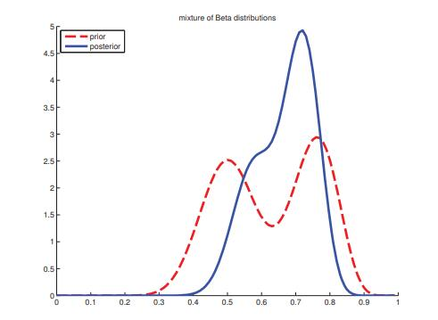

[**返回本章目录**]()

贝叶斯统计数据中最具争议的方面是它依赖于先验。 贝叶斯认为这是不可避免的，因为没有人是**白板**\(**tabula rasa**或**blank slate**\)：所有的推论都必须以某些关于世界的假设为条件。 然而，人们可能有兴趣尽量减少先验假设的影响。 我们将在下面简要讨论一些方法。

<!--more-->

## 5.4.1 无信息先验

如果我们对$$\theta$$没有强烈的信念，那么通常使用**无信息**\(**uninformative**或**non-informative**\)先验，并“让数据说明一切”。

设计无信息先验的问题实际有点棘手。 用一个例子来说明其难度，考虑伯努利参数，$$\theta \in [0,1]$$。 一个可能想法，信息最少的先验就是均匀分布，$${\rm Beta}(1,1)$$。 但在这种情况下的后验均值是$$\mathbb{E} [\theta| \mathcal{D}] = \frac{N_1 + 1} {N_1 + N_0 + 2}$$，而MLE是$$\frac{N_1} {N_1 + N_0}$$。 因此，有人可能会争辩说，先验并不是完全没有信息。

显然，通过减少伪计数的大小，我们可以减轻先验的影响。 通过上述论证，最无信息的先验是

$$
\lim_{c \to 0} {\rm Beta}(c,c)={\rm Beta}(0,0) \tag{5.49}
$$

它是0和1处两个等质量点的混合（见（Zhu和Lu 2004））。 这也称为**Haldane先验**。 请注意，Haldane先验是一个不恰当的先验，意味着它不是积分到1的.但是，只要我们看到至少一个"正面"和至少一个"反面"，后验都将是正确的。

在5.4.2.1节中，我们将论证“正确的”无信息先验实际上是$${\rm Beta}(\frac{1}{2},\frac{1}{2})$$。 显然，这三个先验之间的实践差异很可能是微不足道的。 一般来说，建议进行某种**敏感性**分析，以检查一个人的结论或预测随着建模假设的变化而变化多少，其中包括先验的选择，以及拟然的选择及任何种类的数据预处理。 如果结论对建模假设相对不敏感，那么人们可以对结果更有信心。

## 5.4.2 Jeffreys先验\*

Harold Jeffreys 设计了一种用于创建无信息先验的通用技术。 结果被称为**Jeffreys先验**\( Jeffreys priors\)。 关键的观察是，如果$$p(\phi)$$是无信息的，那么先验的任何重新参数化，诸如$$\theta= h(\phi)$$的某些函数$$h$$，也应该是无信息的。 现在，通过变量替换公式，

$$
p_{\theta}(\theta)=p_{\phi}(\phi)\left|\dfrac{d\phi}{d\theta}\right| \tag{5.50}
$$

所以先验一般也会改变的。 但是，让我们选择

$$
p_{\phi}(\phi) \propto \left(I(\phi)\right)^{\frac{1}{2}} \tag{5.51}
$$

其中$$I(\phi)$$是**费雪信息**\(Fisher information\)：

$$
I(\phi)  \overset{\Delta}{=} - \mathbb{E} \left[\left(\dfrac{d \log p(\boldsymbol{X}|\phi)}{d\phi} \right)^2\right] \tag{5.52}
$$

这是负对数似然曲率期望的度量，因此是MLE稳定性的度量（参见第6.2.2节）。 现在

$$
\dfrac{d \log p(x|\theta)}{d\theta}=\dfrac{d \log p(x|\phi)}{d\phi}\left|\dfrac{d\phi}{d\theta}\right| \tag{5.53}
$$

进而我们有

$$
\begin{aligned}
I(\theta) =& - \mathbb{E} \left[\left(\dfrac{d \log p(\boldsymbol{X}|\theta)}{d\theta} \right)^2\right] =   I(\phi) \left(\dfrac{d\phi}{d\theta}\right)^2 \\
I(\theta)^{\frac{1}{2}} =&  I(\phi)^{\frac{1}{2}} \left|\dfrac{d\phi}{d\theta}\right| 
\end{aligned} \tag{5.54-55}
$$

所以我们找到转换后的先验

$$
p_{\theta}(\theta)=p_{\phi}(\phi)\left|\dfrac{d\phi}{d\theta}\right| \propto \left(I(\phi)\right)^{\frac{1}{2}}\left|\dfrac{d\phi}{d\theta}\right|=I(\theta)^{\frac{1}{2}} \tag{5.56}
$$

所以$$p_{\theta}(\theta)$$和$$p_{\phi}(\phi)$$是相同的。

一些例子将使这更清楚

### 5.4.2.1示例：伯努利和多项分布的Jeffreys先验

假设$$X \sim {\rm Ber}(\theta)$$。 单个样本的对数似然性是

$$
\log p(X|\theta) = X \log \theta + (1-X) \log (1-\theta) \tag{5.57}
$$

**得分函数**只是对数似然的梯度：

$$
s(\theta) \overset{\Delta}{=} \dfrac{d}{d\theta} \log p(X|\theta)=\dfrac{X}{\theta}-\dfrac{1-X}{1-\theta} \tag{5.58}
$$

**已观测信息**\(observed information\)是对数似然的二阶导数：

$$
J(\theta)=-\dfrac{d^2}{d\theta^2} \log p(X|\theta)=-s^{'}(\theta|X)= \dfrac{X}{\theta^2}+\dfrac{1-X}{(1-\theta)^2} \tag{5.59}
$$

**费雪信息**\(Fisher information\)是已观测信息的期望：

$$
I(\theta) = \mathbb{E} [J(\theta|X)|X \sim \theta]=\dfrac{\theta}{\theta^2}+\dfrac{1-\theta}{(1-\theta)^2}=\dfrac{1}{\theta (1-\theta)} \tag{5.60}
$$

于是Jeffreys先验就是

$$
p(\theta) \propto \theta^{-\frac{1}{2}}(1-\theta)^{-\frac{1}{2}} = \dfrac{1}{\sqrt{\theta(1-\theta)}} \propto {\rm Beta}(\dfrac{1}{2},\dfrac{1}{2}) \tag{5.61}
$$

现在考虑具有K个状态的多项分布随机变量。 可证明对应的Jeffreys先验是

$$
p(\theta) \propto {\rm Dir}(\dfrac{1}{2},\dots,\dfrac{1}{2}) \tag{5.62}
$$

请注意，这与更明显的选择$${\rm Dir}(\frac{1}{K},\dots,\frac{1}{K})$$或$${\rm Dir}(1,\dots,1)$$有所不同。

### 5.4.2.2示例：位置和尺度参数的Jeffreys先验

一方面，考虑位置参数的Jeffreys先验，比如高斯均值，$$p(\mu) \propto 1$$。因此这是**平移不变先验**\(translation invariant prior\)的例子，满足任意指定区间$$[A,B]$$的概率质量与平移后区间$$[A-c,B-c]$$的概率质量相同。

$$
\int_{A-c}^{B-c}{p(\mu)d\mu}=(A-c)-(B-c) = (A-B)=\int_{A}^{B}{p(\mu)d\mu} \tag{5.63}
$$

这可由$$p(\mu) \propto 1$$来实现，我们可以通过使用具有无穷方差的高斯$$p(\mu)= \mathcal{N}(\mu | 0, \infty)$$来近似。 注意，这是一个**不恰当先验**\(improper prior\)，因为它不能积分到1。 只要后验是恰当的，使用不恰当先验也不错，我们看到$$N \ge 1$$个数据点就是这种情况，因为我们可以在看到单个数据点后立即“确定”该位置。

类似地，可以展示Jeffreys先验的尺度参数，比如高斯方差$$p(\sigma^2) \propto 1/\sigma^2$$。 这是**缩放不变先验**\(scale invariant prior\)的例子，满足任意指定区间$$[A,B]$$的概率质量与缩放后区间$$[A/c,B/c]$$的概率质量相同，其中缩放常数因子$$c> 0$$.（例如，如果我们将单位从米改为英尺，我们不希望这会影响我们的推论。）这可以通过下式来实现

$$
p(s) \propto 1/s \tag{5.64}
$$

为了看到这点，只需注意

$$
\begin{aligned}
\int_{A/c}^{B/c}{p(s)ds}=& \left[\ln s\right]_{A/c}^{B/c}=\ln(B/c)-\ln(A/c) \\
\quad =& \ln(B)-\ln(A)=\int_{A}^{B}{p(s)ds} 
\end{aligned} \tag{5.65-66}
$$

我们可以使用退化Gamma分布（第2.4.4节）$$p(s)= {\rm Ga}(s|0,0)$$来近似。 这个先验$$p(s) \propto 1/ s$$也是不恰当的，但只要我们看到N≥2个数据点（因为我们需要至少两个数据点来估计方差），后验就是恰当的。

## 5.4.3 鲁棒先验

在许多情况下，我们并不确信我们的先验，因此我们希望确保它不会对结果产生不恰当的影响。 这可以通过使用**鲁棒先验**（**robust priors**, Insua和Ruggeri 2000）来完成，它通常具有厚重的尾部，这避免了迫使事件过于接近先验均值。

让我们考虑一个例子（Berger 1985，p7）。 假设$$x \sim \mathcal{N}(\theta,1)$$。 我们观察到$$x = 5$$并且我们想要估计$$\theta$$。 MLE当然是$$\hat{\theta}= 5$$，这似乎是合理的。 均匀先验下的后验均值也是$$\bar{\theta}= 5$$。但是现在假设我们知道先验中位数是0，而先验4分位数是-1和1，所以$$p(\theta \le -1)= p(-1 < \theta \le 0)= p(0 < \theta \le 1)= p(1 < \theta)= 0.25$$。 让我们假设先验是平滑且单峰的。

很容易证明形式为$$\mathcal{N}(\theta|0, 2.19^2)$$的高斯先验满足这些先验约束。 但在这种情况下，后验均值为3.43，这似乎不太令人满意。

现在假设我们使用Cauchy先验$$\mathcal{T}(\theta| 0,1,1)$$。 这也满足了我们示例的先验约束。 但是这一次我们发现（使用数值积分：参见代码_robustPriorDemo_），后验均值约为4.6，这似乎更合理。

## 5.4.4 混合共轭先验

鲁棒先验是有用的，但使用起来计算成本很高。 共轭先验简化了计算，但通常不够稳健，并且不够灵活，无法编码我们的先验知识。 然而，事实证明，**混合共轭先验**\(**mixture of conjugate priors**\)也是共轭的（练习5.1），并且可以近似任何类型的先验（Dallal和Hall 1983; Diaconis和Ylvisaker 1985）。 因此，这些先验提供了计算方便性和灵活性之间的良好折衷。

例如，假设我们正在建模投掷硬币，我们认为硬币要么公平，要么偏向于"正面"。 这不能用beta分布表示。 但是，我们可以使用两个beta分布的混合来对其进行建模。 例如，我们可能会使用

$$
p(\theta) = 0.5 \ {\rm Beta}(\theta|20,20) + 0.5 \ {\rm Beta}(\theta|30,10) \tag{5.67}
$$

如果$$\theta$$来自第一个分布，硬币是公平的，但如果它来自第二个，它偏向于"正面"。

我们可以通过引入隐变量$$z$$来表示混合，其中$$z = k$$意味着$$\theta$$来自第$$k$$个混合分分。 先验可表示如下:

$$
p(\theta) = \sum_k{p(z=k) p(\theta|z=k)} \tag{5.68}
$$

其中每个$$p(\theta|z=k)$$是共轭的，并且$$p(z = k)$$被称为（先验的）混合权重。 可以证明（练习5.1）后验也可以写成共轭分布的混合，如下所示：

$$
p(\theta | \mathcal{D}) =  \sum_k{p(z=k | \mathcal{D}) p(\theta|\mathcal{D},z=k)} \tag{5.69}
$$

其中$$p(Z=k | \mathcal{D})$$是后验混合权重

$$
p(Z=k | \mathcal{D}) = \dfrac{p(Z=k) p(\mathcal{D} | Z=k )}{\sum_{k^{'}}{p(Z=k^{'}) p(\mathcal{D} | Z=k^{'} )}} \tag{5.70}
$$

这里量$$p(\mathcal{D} | Z=k )$$是第$$k$$个混合成分边际拟然（见5.3.2.1节）。

### 5.4.4.1 示例

假设我们使用混合先验

$$
p(\theta) = 0.5 \ {\rm Beta}(\theta|a_1,b_1) + 0.5 \ {\rm Beta}(\theta|a_2,b_2) \tag{5.71}
$$

其中$$a_1= b_1 = 20$$且$$a_2 = b_2 = 10$$.我们观察到$$N_1$$个"正面"和$$N_0$$个"反面"。 后验变成了

$$
p(\theta | \mathcal{D}) =  p(Z=1 | \mathcal{D}) {\rm Beta}(\theta|a_1+N_1,b_1+N_0) +p(Z=2 | \mathcal{D}) {\rm Beta} (\theta|a_2+N_1,b_2+N_0)  \tag{5.72}
$$

如果$$N_1 = 20$$个"正面"$$N_0 = 10$$个"反面"，则使用公式5.23，后验变为

$$
p(\theta | \mathcal{D}) =  0.346 \ {\rm Beta}(\theta|40,30) +0.654 \ {\rm Beta} (\theta|30,20)  \tag{5.73}
$$

参考图5.10所示。

> 图5.10 两种Beta分布的混合。 _mixBetaDemo_生成的图。

### 5.4.4.2 应用：寻找DNA和蛋白质序列中的保守区域

我们提到狄利克雷-多项模型广泛用于生物序列分析。 让我们举一个简单的例子来说明已经发展起来的一些机制。 具体来说，请考虑第2.3.2.1节中讨论的序列标识。 现在假设我们想要找到代表基因组编码区的位置。 由于进化压力，这些位置通常在所有序列上具有相同的字母。 所以我们需要找到“纯粹”\(或接近纯粹\)的列，在这种意义下, 要么大部分都是As，要么大部分都是Ts，要么大部分都是Cs，或者要么大部分都是Gs。 一种方法是寻找低熵列; 这些将是几乎确定性（纯粹）的分布。

但是假设我们想要将置信度量与我们的纯度估计值联系起来。 如果我们认为相邻位置是一起保存的，这可能很有用。 在这种情况下，如果位置$$t$$是保守的，则令$$Z_t = 1$$，否则$$Z_t = 0$$。 然后我们可以使用马尔可夫链在相邻的$$Z_t$$变量之间添加依赖关系; 详见第17章。

在任何情况下，我们都需要定义似然模型$$p(\boldsymbol{N}_t | Z_t)$$，其中$$\boldsymbol{N}_t$$是列$$t$$的$$(A，C，G，T)$$计数向量。 将其作为具有参数$$\boldsymbol{\theta}_t$$的多项分布是很自然的。 由于每列具有不同的分布，我们将希望对$$\boldsymbol{\theta}_t$$积分，从而计算边际拟然

$$
p(\boldsymbol{N}_t | Z_t) = \int {p(\boldsymbol{N}_t | \boldsymbol{\theta}_t) p(\boldsymbol{\theta}_t | Z_t) d\boldsymbol{\theta}_t} \tag{5.74}
$$

但是我们对$$\boldsymbol{\theta}_t$$应该使用什么先验？ 当$$Z_t = 0$$时，我们可以使用均匀先验$$p(\theta| Z_t = 0)= {\rm Dir}(1,1,1,1)$$，但是如果$$Z_t = 1$$，我们应该使用什么？ 毕竟，如果该列是保守的，它可以是（几乎）纯的As，Cs，Gs或Ts列。 一种自然的方法是使用狄利克雷先验的混合，其中每个都“倾”向4维单纯形的一个适当的角落，例如，

$$
p(\boldsymbol{\theta} | Z_t=1) = \dfrac{1}{4} {\rm Dir}(\boldsymbol{\theta} | (10,1,1,1)) + \dots +  \dfrac{1}{4} {\rm Dir}(\boldsymbol{\theta} | (1,1,1,10)) \tag{5.75}
$$

由于这是共轭的，我们可以很容易地计算$$p(\boldsymbol{N}_t | Z_t)$$。 参见（Brown等人，1993）将这些想法应用于真实的生物序列问题。

[**返回本章目录**]()

