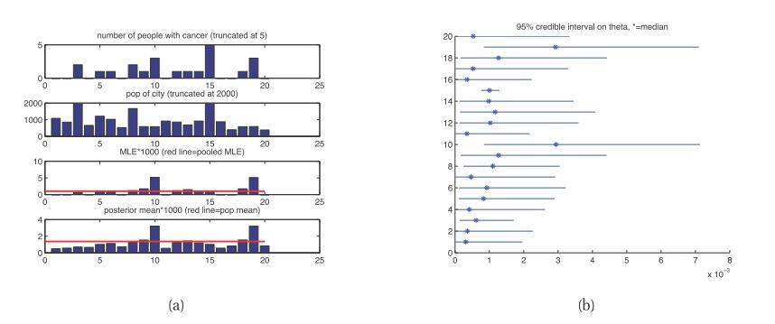

[**返回本章目录**]()

计算后验$p(\boldsymbol{\theta} | \mathcal{D})$的关键要求是先验$p(\boldsymbol{\theta} | \boldsymbol{\eta})$的指定，其中$\boldsymbol{\eta}$是超参数。 如果我们不知道如何设置$\boldsymbol{\eta}$怎么办？ 在某些情况下，我们可以使用无信息的先验，我们在上面讨论过。 更多贝叶斯方法是在我们的先验前再放置一个先验！ 在图模型（第10章）术语下，我们可以表示如下情况：

$$
\boldsymbol{\eta} \to \boldsymbol{\theta} \to \mathcal{D} \tag{5.76}
$$

<!--more-->

这是**分层贝叶斯模型**\( **hierarchical Bayesian model**\)的一个示例，也称为**多级模型**\(**multi-level model**\)，因为存在多个级别的未知量。 我们在下面给出一个简单的例子，我们将在本书后面看到许多其他的例子。

## 5.5.1 示例：癌症发病率建模

考虑在各个城市预测癌症发病率的问题（这个例子来自（Johnson and Albert 1999，p24））。特别地，假设我们测量不同城市的人数$N_i$，以及这些城市中死于癌症的人数$x_i$。我们假设$x_i \sim {\rm Bin}(N_i，\theta_i)$，并且我们想要估计癌症率$\theta_i$。一种方法是单独估计它们，但是这将受到稀疏数据问题（低估由于小的$N_i$引起的癌症速率）的影响。另一种方法是假设所有$\theta_i$都相同;这称为**参数绑定**\(**parameter tying**\)。由此产生的混合MLE恰好是只$\hat{\theta}=\frac{\sum_i{x_i}}{\sum_i{N_i}}$。但是所有城市具有相同比率的假设是相当强的。一种折衷的方法是假设$\theta_i$是相似的，但可能存在城市特定的变化。这可以通过假设$\theta_i$是从一些共同分布中得出来建模，比如$\theta_i \sim {\rm Beta}(a,b)$。完整的联合分布可以写成

$$
p(\mathcal{D}, \boldsymbol{\theta}, \boldsymbol{\eta} | \boldsymbol{N}) = p(\boldsymbol{\eta}) \prod_{i=1}^N {{\rm Bin}(x_i | N_i, \theta_i) {\rm Beta}(\theta_i | \boldsymbol{\eta}) } \tag{5.77}
$$

其中: $\boldsymbol{\eta}=(a,b)$。

注意，我们从数据推断$\boldsymbol{\eta}=(a,b)$是至关重要的; 如果我们只是将它固定成一个常数，$\theta_i$将是条件独立的，并且它们之间将没有信息流。 相比之下，通过将$\boldsymbol{\eta}$视为未知（隐藏变量），我们允许从数据丰富的城市**借用统计力量**应用到数据贫乏的城市。

假设我们要计算联合后验$p(\boldsymbol{\eta}，\boldsymbol{\theta} | \mathcal{D})$。 由此我们可以得到边缘后验$p(\theta_i | \mathcal{D})$。 在图5.11（a）中，我们绘制了后验均值$\mathbb{E} [\theta_i | \mathcal{D}]$\(蓝色条\)，以及人口水平均值$\mathbb{E} [a /(a + b) | \mathcal{D}]$\(显示为红线 , 这代表$\theta_i$的均值）。 我们看到，对于样本量小的城市$N_i$，相对更强的汇总估计, 后验均值会更小,。 例如，城市1和城市20都有0观察到的癌症发病率，但城市20的人口较少，因此相对城市1, 其人口水平估计（即，它更接近水平红线）的比率更低。

> 图5.11 （a）使用来自（Johnson和Albert 1999，第24页）的数据来拟合模型的结果。 第一行：密苏里州20个城市的癌症事件数量$x_i$。 第二行：人口规模$N_i$。 最大的城市（编号15）的人口为$N_{15} = 53637$, 和$x_{15} = 54$个事件，但我们截断了前两行的垂直轴，以便可以看到其他城市之间的差异。 第三排：MLE$\hat{\theta}_i$。 红线是汇集的MLE。 第四行：后验均值$\mathbb{E} [\theta_i | \mathcal{D}]$。 红线是$\mathbb{E} [a /(a+b) | \mathcal{D}]$，即人口水平均值。 （b）癌症发病率的95％后验可信区间。 由_cancerRatesEb_生成的图

图5.11（b）显示了$\theta_i$的95％后验可信区间。 我们看到，人口众多（53,637人）的城市15具有较小的后验不确定性。 因此，这个城市对$\boldsymbol{\eta}$的后验估计影响最大，这反过来将影响其他城市的癌症率估计。 具有最高MLE的城市10和19也具有最高的后验不确定性，反映出这样的高估计与先验（与所有其他城市估计）相矛盾的事实。

在上面的例子中，我们每个城市有一个参数，来建模响应的概率。 通过使伯努利率参数成为协变量的函数，$\theta_i= {\rm sigm}(\boldsymbol{w}_i^T \boldsymbol{x})$，我们可以建模多个相关逻辑斯蒂回归任务。 这称为**多任务学习**，将在第9.5节中详细讨论。

[**返回本章目录**]()

