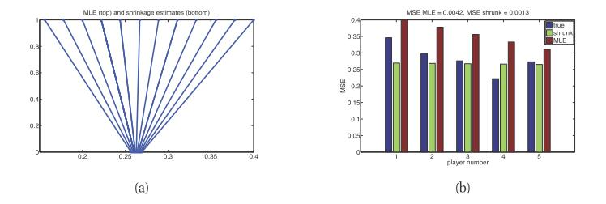

[**返回本章目录**]()

在分层贝叶斯模型中，我们需要计算多个级别潜在变量的后验。 例如，在两级模型中，我们需要计算

$$
p(\boldsymbol{\eta}, \boldsymbol{\theta} | \mathcal{D}) \propto p(\mathcal{D} | \boldsymbol{\theta}) p(\boldsymbol{\theta} | \boldsymbol{\eta}) p(\boldsymbol{\eta})  \tag{5.78}
$$

<!--more-->

在某些情况下，我们可以分析地将$$\boldsymbol{\theta}$$边缘化; 每个分量只是计算$$p(\boldsymbol{\eta} | \mathcal{D})$$的简单问题。

作为计算捷径，我们可以用点估计近似超参数的后验，$$p(\boldsymbol{\eta} | \mathcal{D}) \approx \delta_{\hat{\boldsymbol{\eta}}} (\boldsymbol{\eta})$$，其中$$\hat{\boldsymbol{\eta}}= {\rm argmax} \ p(\boldsymbol{\eta} | \mathcal{D})$$。 由于$$\boldsymbol{\eta}$$在维数上通常远小于$$\boldsymbol{\theta}$$，因此不太容易过拟合，因此我们可以安全地在$$\boldsymbol{\eta}$$上使用均匀的先验。 然后估计变成了

$$
\hat{\boldsymbol{\eta}}= {\rm argmax}  \ p(\boldsymbol{\eta} | \mathcal{D}) = {\rm argmax}  \ \left[\int {p(\mathcal{D}|\boldsymbol{\theta}) p(\boldsymbol{\theta} | \boldsymbol{\eta}) d \boldsymbol{\theta}} \right] \tag{5.79}
$$

括号内的量是边际或积分拟然，有时称为证据。 这种整体方法称为**经验贝叶斯**（EB）或**II型最大似然**。 在机器学习中，它有时被称为**证据程序**。

经验贝叶斯违反了先验应该独立于数据选择的原则。 然而，我们可以将其视为分层贝叶斯模型中推理的计算上便宜的近似，正如我们将MAP估计视为一级模型$$\boldsymbol{\theta} \to \mathcal{D}$$中的推理近似。 事实上，我们可以构建一个层次结构，然后执行积分，“更多的贝叶斯”如下：

| 方法 | 定义 |
| :---: | :---: |
| 最大拟然 | $$\hat{\boldsymbol{\theta}}={\rm argmax}_{\boldsymbol{\theta}} \  p(\mathcal{D} \| \boldsymbol{\theta})$$ |
| MAP估计 | $$\hat{\boldsymbol{\theta}}={\rm argmax}_{\boldsymbol{\theta}} \  p(\mathcal{D} \| \boldsymbol{\theta}) p(\boldsymbol{\theta} \| \boldsymbol{\eta})$$ |
| ML-II\(经验贝叶斯\) | $$\hat{\boldsymbol{\eta}}={\rm argmax}_{\boldsymbol{\eta}}  \int {p(\mathcal{D} \| \boldsymbol{\theta}) p(\boldsymbol{\theta} \| \boldsymbol{\eta})d \boldsymbol{\theta}}= {\rm argmax}_{\boldsymbol{\eta}} \  p(\mathcal{D} \| \boldsymbol{\eta})$$ |
| MAP-II | $$\hat{\boldsymbol{\eta}}={\rm argmax}_{\boldsymbol{\eta}}  \int {p(\mathcal{D} \| \boldsymbol{\theta}) p(\boldsymbol{\theta} \| \boldsymbol{\eta}) p(\boldsymbol{\eta})d \boldsymbol{\theta}}= {\rm argmax}_{\boldsymbol{\eta}} \  p(\mathcal{D} \| \boldsymbol{\eta})p(\boldsymbol{\eta})$$ |
| 完全贝叶斯 | $$p(\boldsymbol{\eta}, \boldsymbol{\theta} \| \mathcal{D}) \propto p(\mathcal{D} \| \boldsymbol{\theta}) p(\boldsymbol{\theta} \| \boldsymbol{\eta}) p(\boldsymbol{\eta})$$ |

注意，EB可以显示具有良好的频率属性（参见例如（Carlin和Louis 1996; Efron 2010）），因此它被非贝叶斯主义者广泛使用。 例如，在6.3.3.2节中讨论的流行的James-Stein估计可以使用EB导出。

## 5.6.1示例：贝塔-二项模型

让我们回到癌症发病率模型。 我们可以分析地积分$$\theta_i$$，并直接写下边际拟然：

$$
\begin{aligned}
p(\mathcal{D} | a,b) = & \prod_i{\int{{\rm Bin}(x_i|N_i,\theta_i){\rm Beta}(\theta_i|a,b)d\theta_i}} \\
\quad = & \prod_i{\dfrac{B(a+x_i,b+N_i-x_i)}{B(a,b)}} 
\end{aligned} \tag{5.80-81}
$$

在（Minka 2000e）中讨论了使这个关于a和b最大化的各种方法。

估计了a和b之后，我们可以使用共轭分析以常规方式插入超参数来计算后验$$p(\theta_i | \hat{a},\hat{b},\mathcal{D})$$。 最终结果是每个$$\theta_i$$的后验均值是依赖于$$\boldsymbol{\eta}=(a,b)$$的局部MLE和先验均值的加权平均; 但由于$$\boldsymbol{\eta}$$是根据所有数据估算的，因此每个$$\theta_i$$都受到所有数据的影响。

## 5.6.2 示例：高斯-高斯模型

我们现在研究另一个类似于癌症率例子的例子，除了数据是实值的。 我们将使用高斯似然和高斯先验。 这将允许我们分析地写下解决方案。

特别是，假设我们有来自多个相关组的数据。 例如，$$x_{ij}$$可以是学校$$j$$中的学生$$i$$的考试分数，$$j = 1:D$$且$$i = 1:N_j$$。 我们想要估算每所学校的平均分数$$\theta_j$$。 然而，由于样本大小$$N_j$$对于某些学校来说可能很小，我们可以通过使用分层贝叶斯模型来规范化问题，其中我们假设$$\theta_j$$来自共同的先验$$N(\mu，\tau^2)$$。

联合分布具有以下形式：

$$
p(\boldsymbol{\theta},\mathcal{D}|\boldsymbol{\eta}, \sigma^2)= \prod_{j=1}^D{\mathcal{N}(\theta_j|\mu,\tau^2)\prod_{i=1}^{N_j}{\mathcal{N}(x_{ij}|\theta_j,\sigma^2)}} \tag{5.82}
$$

我们假设$$\sigma^2$$是已知的简单的。 （我们在练习24.4中放松了这个假设。）我们解释如何估计下面的$$\boldsymbol{\eta}$$。 一旦我们估计了$$\boldsymbol{\eta}=(\mu,\tau)$$，我们就可以计算$$\theta_j$$上的后验。 要做到这一点，以下面的形式简化重写联合分布，利用值为$$x_{ij}$$和方差$$\sigma^2$$的$$N_j$$个高斯测量相当于值为$$\bar{x}_j \overset{\Delta}{=}\frac{1}{N_j}\sum_{i=1}^{N_j}{x_{ij}}$$方差为$$\sigma_j^2\overset{\Delta}{=}\sigma^2/N_j$$的一次测量的事实。 这会产生

$$
p(\boldsymbol{\theta},\mathcal{D}|\hat{\boldsymbol{\eta}}, \sigma^2)= \prod_{j=1}^D{\mathcal{N}(\theta_j|\hat{\mu},\hat{\tau}^2)\mathcal{N}(\bar{x}_j|\theta_j,\sigma_j^2)} \tag{5.83}
$$

从这一点可以看出，依据第4.4.1节的结果, 后验可由下式给出

$$
\begin{aligned}
p(\theta_j|\mathcal{D},\hat{\mu},\hat{\tau}^2) = & \mathcal{N}(\theta_j|\hat{B}_j \hat{\mu} + (1-\hat{B}_j)\bar{x}_j,(1-\hat{B}_j)\sigma_j^2)  \\
\hat{B}_j \overset{\Delta}{=} & \dfrac{\sigma_j^2}{
\sigma_j^2+\hat{\tau}^2} 
\end{aligned} \tag{5.84-85}
$$

其中$$\hat{\mu}= \bar{x}$$和$$\hat{\tau}^2$$将在下面定义。

量$$0 \le \hat{B}_j \le 1$$控制朝向总体平均值$$\mu$$的**收缩**程度。 如果数据对于组$$j$$是可靠的（例如，因为样本大小$$N_j$$很大），则$$\sigma_j^2$$相对于$$\tau^2$$将是小的; 因此$$\hat{B}_j$$会很小，当估算$$\theta_j$$时我们会更加重视$$\bar{x}_j$$。 然而，样本量较小的组将更加规范化（缩小到整体平均$$\mu$$）。 我们将在下面看到一个例子。

如果所有组$$j$$的$$\sigma_j=\sigma$$，则后验均值变为

$$
\hat{\theta}_j=\hat{B} \bar{x} + (1-\hat{B})\bar{x}_j = \bar{x} +  (1-\hat{B})(\bar{x}_j-\bar{x}) \tag{5.86}
$$

这与第6.3.3.2节中讨论的James Stein估计完全相同。

### 5.6.2.1 示例：预测棒球比分

> 图5.12 （a）MLE参数（上）和相应的缩减估计（下）。 （b）我们绘制了5个玩家的真实参数（蓝色），后验平均估计值（绿色）和MLE（红色）。 由_shrinkageDemoBaseball_生成的图。

我们现在给出一个应用于棒球击球平均值的收缩的例子，来自（Efron和Morris 1975）。 我们观察了在第一场T = 45场比赛中D = 18名球员的命中数。 命中数$$b_i$$， 我们假设$$b_j \sim {\rm Bin}(T，\theta_j)$$，其中$$\theta_j$$是球员$$j$$的“真实”击球平均值。 目标是估计$$\theta_j$$。 MLE当然是$$\hat{\theta}_j= x_j$$，其中$$x_j = b_j / T$$是经验击球均值。 但是，我们可以使用EB方法做得更好。

为了应用上述高斯收缩方法，我们要求似然是高斯$$x_j \sim \mathcal{N}(\theta_j,\sigma^2)$$的\(已知$$\sigma^2$$\)。 （因为我们假设$$N_j = 1$$，所以我们删除了$$i$$下标，因为$$x_j$$已经代表了球员$$j$$的平均值。）但是，在这个例子中我们有二项似然。 虽然这具有正确的均值$$\mathbb{E} [x_j] =\theta_j$$，但方差不是常数：

$$
{\rm var}[x_j] = \dfrac{1}{T} {\rm var}[b_j]=\dfrac{T\theta_j(1-\theta_j)}{T^2}=\dfrac{\theta_j(1-\theta_j)}{T} \tag{5.87}
$$

因此，让我们将**方差稳定变换**\(**variance stabilizing transform**\) 应用于$$x_j$$以更好地匹配高斯假设：

$$
y_j \to f(y_j)=\sqrt{T} \arcsin (2y_j-1) \tag{5.88}
$$

现在我们有近似$$y_j \sim \mathcal{N}(f(\theta_j),1)= \mathcal{N}(\mu_j,1)$$。 我们使用高斯收缩来估计$$\mu_j$$，利用了公式5.86并取$$\sigma^2= 1$$，然后我们作一个逆变换

$$
\hat{\theta}_j=0.5(\sin(\hat{\mu}_j/\sqrt{T})+1) \tag{5.89}
$$

结果如图5.12（a-b）所示。 在（a）中，我们绘制了MLE$$\hat{\theta}_j$$和后验均值$$\bar{\theta}_j$$。我们看到所有估计都缩小到全局均值0.265。 在（b）中，我们绘制真值$$\theta_j$$，MLE$$\hat{\theta}_j$$和后验均值$$\bar{\theta}_j$$。 （$$\theta_j$$的“真实”值是从大量独立游戏中估算出来的。）我们看到，平均而言，收缩估计比MLE更接近真实参数。 具体而言，对定义为$${\rm MSE} = \dfrac{1}{N}\sum_{j=1}^D{(\theta_j-\bar{\theta})^2}$$的均方误差而言, 使用收缩估计$$\bar{\theta}_j$$比使用MLE的$$\hat{\theta}_j$$小三倍。

### 5.6.2.2 估计超参数

在本节中，我们给出了估计$$\boldsymbol{\eta}$$的算法。 首先假设$$\sigma_j^2=\sigma^2$$对于所有组都是相同的。 在这种情况下，我们可以推导出EB的封闭式估计值，正如我们现在所示。 从公式4.126，我们有

$$
p(\bar{x}_j|\mu,\tau^2,\sigma^2) = \int{\mathcal{N}(\bar(x)_j|\theta_j,\sigma^2)\mathcal{N}(\theta_j|\mu,\tau^2)d\theta_j} = \mathcal{N}(\bar{x}_j | \mu,\tau^2+\sigma^2) \tag{5.90}
$$

因此，边际拟然是

$$
p(\mathcal{D}|\mu,\tau^2,\sigma^2) = \prod_{j=1}^D {\mathcal{N}(\bar{x}_j | \mu,\tau^2+\sigma^2)} \tag{5.91}
$$

因此，我们可以使用通常的MLE估计高斯参数。 对于$$\mu$$，我们有

$$
\hat{\mu} = \dfrac{1}{D}\sum_{j=1}^D{\bar{x}_j} = \bar{x} \tag{5.92}
$$

这是整体均值。

对于方差，我们可以使用矩匹配（相当于高斯的MLE）：我们简单地将模型方差等同于经验方差：

$$
\hat{\tau}^2 + \sigma^2 = \dfrac{1}{D} \sum_{j=1}^D{(\bar{x}_j-\bar{x})^2} \overset{\Delta}{=} s^2 \tag{5.93}
$$

所以$$\hat{\tau}^2= s^2 - \sigma^2$$。 由于我们知道$$\tau^2$$必须是正数，因此通常使用以下修订估算：

$$
\hat{\tau}^2=\max\{0,s^2-\sigma^2\}=(s^2-\sigma^2)_+ \tag{5.94}
$$

因此收缩因子是

$$
\hat{B}=\dfrac{\sigma^2}{\sigma^2+\hat{\tau}^2} = \dfrac{\sigma^2}{\sigma^2+(s^2-\sigma^2)_+}   \tag{5.95}
$$

在$$\sigma_j^2$$不同的情况下，我们不能再以封闭形式得出解。 练习11.13讨论了如何使用EM算法导出EB估计，练习24.4讨论了如何在此层次模型中执行完全贝叶斯推理。

[**返回本章目录**]()

