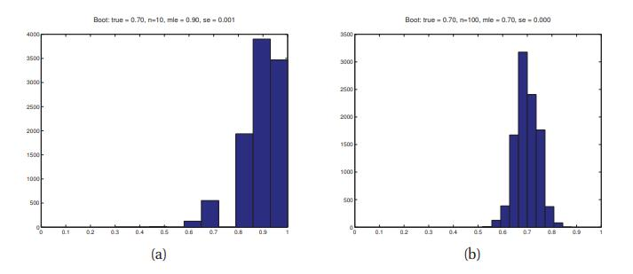

# 6.2 估计器的采样分布

[**返回本章目录**]()

在频率派统计中，通过将**估计器**$$\delta$$应用在某些数据$$\mathcal{D}$$来计算参数估计$$\hat{\boldsymbol{\theta}}$$，因此$$\hat{\boldsymbol{\theta}}=δ(\mathcal{D})$$。 该参数被视为固定的，并且数据被视为随机的，这与贝叶斯方法完全相反。 可以通过计算估计器的**采样分布**来测量参数估计的不确定性。 为了理解这个概念，想象从一些真实模型$$p(·|\boldsymbol{\theta}^*)$$中采样许多不同的数据集$$\mathcal{D}^{(s)}$$，即让$$\mathcal{D}^{(s)}= \left\{x_i^{(s)}\right\}_{i=1}^N$$，其中$$x_i^s \sim p(·|\boldsymbol{\theta}^*)$$，$$\boldsymbol{\theta}^*$$是真实参数。 这里$$s = 1:S$$已采样数据集的索引，$$N$$是每个这样的数据集的大小。 现在将估计器$$\hat{\theta}(·)$$应用到每个$$\mathcal{D}^{(s)}$$以获得一组估计$$\{\hat{\boldsymbol{\theta}}(\mathcal{D}^{(s)})\}$$。 当我们让$$S\to \infty$$时，在$$\hat{\theta}(·)$$上诱导的分布就是估计器的采样分布。 我们将在后面的章节中讨论使用采样分布的各种方法。 但首先我们描绘了两种计算采样分布本身的方法。

<!--more-->

## 6.2.1 自举\(Bootstrap\)

> 图6.1 对伯努利分布的$$\hat{\theta}$$的采样分布的自举近似。 我们使用$$B = 10000$$个自举样本。 N个数据库由$${\rm Ber}(\theta= 0.7)$$生成。 （a）$$N = 10$$的MLE。（b）$$N = 100$$的MLE。由_bootstrapDemoBer_生成的图。

**自举**\(**Bootstrap**\)是一种简单的蒙特卡罗技术，用于近似采样分布。 这在估计器是真实参数的复杂函数的情况下特别有用。

这个想法很简单。 如果我们知道真实参数$$\boldsymbol{\theta}^{\\*}$$，我们可以从真实分布生成许多（比如S个）假数据集，每个大小都为$$N$$，即$$x_i^s \sim p(·|\boldsymbol{\theta}^{\\*}), s=1:S,i=1:N$$。然后，我们可以从每个样本计算我们的估计量$$\hat{\boldsymbol{\theta}}^s= f(x_{1:N}^s)$$，并使用所得样本的经验分布作为我们对采样分布的估计。 由于$$\boldsymbol{\theta}$$未知，**参数自举**\(**parametric bootstrap**\)的思想是使用$$\hat{\boldsymbol{\theta}}(\mathcal{D})$$作为替代来生成样本。 另一种称为**非参数自举**\(**non-parametric bootstrap**\)的方法是从原始数据$$\mathcal{D}$$中采样$$x_i^s$$（替换），然后像以前一样计算诱导分布。 在（Kleiner等人，2011）中讨论了一些在应用于海量数据集时加速自举的方法。

图6.1展示了一个示例，我们使用参数自举来计算伯努利的MLE采样分布。 （使用非参数自举的结果基本相同。）当N = 10时，我们看到采样分布是不对称的，因此离高斯相当远; 当N = 100时，分布看起来更高斯，正如理论所暗示的那样（见下文）。

一个自然的问题是：由自举计算的参数估计值$$\hat{\boldsymbol{\theta}}^s=\hat{\boldsymbol{\theta}}(x_{1:N}^s)$$与从后验采样的参数值$$\boldsymbol{\theta}^s \sim p(·| \mathcal{D})$$之间的关系是什么？ 从概念上讲，它们完全不同。 但在常见的情况下，先验不是很强，它们可能非常相似。 例如，图6.1（c-d）展现的一个例子，我们使用均匀的$${\rm Beta}(1,1)$$先验计算后验，然后从中进行采样。 我们看到后验和采样分布非常相似。 因此，人们可以将自举分布视为“穷人”的后验; 有关详细信息，请参阅（Hastie等，2001，第235页）。

然而，也许令人惊讶的是，自举可能比后验采样慢。 原因是自举必须拟合模型S次，而在后验采样中，我们通常只拟合模型一次（找到局部众数），然后围绕众数进行局部探索。 这种局部探索通常比从头开始拟合模型快得多。

## 6.2.2 MLE的大样本理论\*

在某些情况下，可以分析地计算某些估计器的采样分布。 特别是，可以证明，在某些条件下，当样本大小趋于无穷大时，MLE的采样分布变为高斯分布。 非正式地，对此结果的要求是模型中的每个参数都“看到”无限量的数据，并且模型是可识别的。 不幸的是，这排除了许多对机器学习感兴趣的模型。 然而，让我们假设我们处于定理所在的简单环境中。

高斯的中心将是MLE $$\hat{\boldsymbol{\theta}}$$。 但是这个高斯的方差呢？ 直观地，估计器的方差将（相反地）与可能性表面在其峰值处的曲率量相关。 如果曲率很大，峰值将“尖锐”，方差低; 在这种情况下，估计是“很好地确定”。 相反，如果曲率很小，峰值将几乎“平坦”，因此方差很高。

现在让我们正式化这种直觉。 将**得分函数**定义为在某点$$\hat{\boldsymbol{\theta}}$$计算的对数似然梯度：

$$
s(\hat{\boldsymbol{\theta}})\overset{\Delta}{=}\left.\nabla \log p(\mathcal{D}|\boldsymbol{\theta})\right|_{\hat{\boldsymbol{\theta}}} \tag{6.1}
$$

将**观察到的信息矩阵**\(**observed information matrix**\)定义为得分函数的负梯度，或等效地，NLL的Hessian：

$$
\boldsymbol{J}(\hat{\boldsymbol{\theta}}|\mathcal{D})\overset{\Delta}{=}-\nabla s(\hat{\boldsymbol{\theta}})=-\left.\nabla_{\boldsymbol{\theta}}^2 \log p(\mathcal{D}|\boldsymbol{\theta})\right|_{\hat{\boldsymbol{\theta}}} \tag{6.2}
$$

在1维情况下, 上式变成

$$
J(\hat{\theta}|\mathcal{D})=-\left.\dfrac{d^2}{d\theta^2} \log p(\mathcal{D}|\theta)\right|_{\hat{\theta}} \tag{6.3}
$$

这只是$$\hat{\theta}$$处对数似然函数曲率的度量。

由于我们正在研究采样分布，因此$$\mathcal{D} =(\boldsymbol{x}_1,\dots,\boldsymbol{x}_N)$$ 是一组随机变量。 **Fisher信息矩阵**被定义为观察到的信息矩阵的预期值：

$$
\boldsymbol{I}_N(\hat{\boldsymbol{\theta}|\boldsymbol{\theta}^{\\*}})\overset{\Delta}{=}\mathbb{E}_{\boldsymbol{\theta}^{\\*}}\left[\boldsymbol{J}(\hat{\boldsymbol{\theta}}|\mathcal{D})\right] \tag{6.4}
$$

其中$$\mathbb{E}_{\boldsymbol{\theta}^{\\*}} [\boldsymbol{f}(\mathcal{D})]\overset{\Delta}{=} \frac{1}{N}\sum_{i=1}^N{ \boldsymbol{f}(\boldsymbol{x}_i)p(\boldsymbol{x}_i | \boldsymbol{\theta}^{\\*})}$$ 是当应用于从$$\boldsymbol{\theta}^{\\*}$$采样的数据的函数$$\boldsymbol{f}$$的期望值。 通常$$\boldsymbol{\theta}^{\\*}$$表示生成数据的“真实参数”，被假设为已知，因此我们只写更短的形式$$\boldsymbol{I}_N(\hat{\boldsymbol{\theta}})\overset{\Delta}{=}\boldsymbol{I}_N(\hat{\boldsymbol{\theta}}|\boldsymbol{\theta}^{\\*})$$。 此外，很容易看出$$\boldsymbol{I}_N(\hat{\boldsymbol{\theta}})=N \boldsymbol{I}_1(\hat{\boldsymbol{\theta}})$$，因为大小为N的样本的对数似然仅比大小为1的样本的对数似然的“陡”$$N$$倍。所以我们 可以删除1下标，只写$$\boldsymbol{I}(\hat{\boldsymbol{\theta}})\overset{\Delta}{=}\boldsymbol{I}_1(\hat{\boldsymbol{\theta}})$$。 这是通常使用的符号。

现在让$$\hat{\boldsymbol{\theta}}\overset{\Delta}{=}\hat{\boldsymbol{\theta}}_{\rm mle}(\mathcal{D})$$ 为MLE，其中$$\mathcal{D} \sim \boldsymbol{\theta}^{\\*}$$。 可以证明

$$
\hat{\boldsymbol{\theta}} \to \mathcal{N}(\boldsymbol{\theta}^{\\*},\boldsymbol{I}(\boldsymbol{\theta}^{\\*})^{-1}) \tag{6.5}
$$

当$$N\to \infty$$（参见例如（Rice 1995，p265）作为证据）。 我们说MLE的采样分布是**渐近正态的**\(**asymptotically normal**\)。

MLE的方差\(可用来衡量MLE的信任度\)怎么样呢？ 不幸的是，$$\boldsymbol{\theta}^{\\*}$$是未知的，因此我们无法评估采样分布的方差。 但是，我们可以通过用$$\hat{\boldsymbol{\theta}}$$代替$$\boldsymbol{\theta}^{\\*}$$来近似采样分布。 因此，$$\hat{\theta}_k$$的近似**标准误差**\(**standard errors** \)由下式给出

$$
\hat{\rm se}_k\overset{\Delta}{=}\boldsymbol{I}_N(\hat{\boldsymbol{\theta}})_{kk}^{-\frac{1}{2}} \tag{6.6}
$$

例如，根据公式5.60，我们知道二项采样模型的Fisher信息是

$$
I(\theta)=\dfrac{1}{\theta(1-\theta)} \tag{6.7}
$$

因此，MLE的近似标准误差是

$$
\hat{\rm se}_k=\dfrac{1}{\sqrt{I_N(\hat{\theta})}}=\dfrac{1}{\sqrt{N I(\hat{\theta})}}=\sqrt{\dfrac{\hat{\theta}(1-\hat{\theta})}{N}} \tag{6.8}
$$

其中$$\hat{\theta}= \frac{1}{N}\sum_i{X_i}$$。 将其与公式3.27进行比较，公式3.27是均匀先验下的后验标准差。

[**返回本章目录**]()

​

