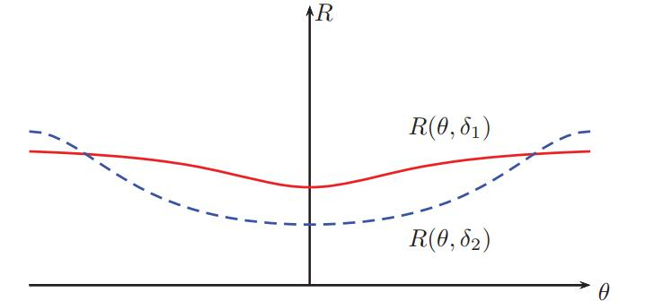
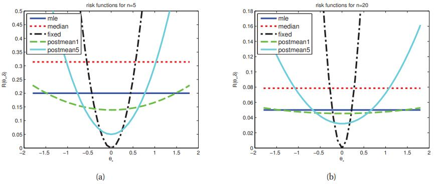

[**返回本章目录**]()

在频率派或经典决策理论中，存在一个损失函数和一个拟然，但没有先验因而没有后验或后验预期损失。 因此，与贝叶斯情况不同，没有自动推导出最优估计器的方法。 相反，在频率派方法中，我们可以自由选择我们想要的任何估计器或决策程序$$\delta：\mathcal{X} \to \mathcal{A}$$。 

选择估计器后，我们将其预期损失或**风险**定义如下：

$$
R(\theta^{\\*},\delta)\overset{\Delta}{=}\mathbb{E}_{p(\tilde{\mathcal{D}}|\theta^{\\*})}\left[L(\theta^{\\*},\delta(\tilde{\mathcal{D}}))\right]=\int{L(\theta^{\\*},\delta(\tilde{\mathcal{D}}))p(\tilde{\mathcal{D}}|\theta^{\\*})d\tilde{\mathcal{D}}} \tag{6.9}
$$

<!--more-->

其中$$\tilde{\mathcal{D}}$$是从“自然分布”中采样的数据，其由参数$$\theta^{\\*}$$表示。 换句话说，期望是关于估计器采样分布的。 将此与贝叶斯后验预期损失进行比较：

$$
\rho(a|\mathcal{D},\pi)\overset{\Delta}{=}\mathbb{E}_{p(\theta|\mathcal{D},\pi)}\left[L(\theta,a)\right]=\int_\Theta{L(\theta^{\\*},a)p(\theta|\mathcal{D},\pi)d\theta} \tag{6.10}
$$

我们看到贝叶斯方法关于$$\theta$$均值（未知）和$$\mathcal{D}$$上的条件（已知），而频率派方法在$$\tilde{\mathcal{D}}$$上的均值（因此忽略观测到的数据），$$\theta^{\\*}$$上的条件（未知）。

频率派不仅定义不自然，甚至无法计算，因为$$\theta^{\\*}$$未知。 因此，我们无法比较不同的估计器的频率派风险来。 我们将在下面讨论各种解决方案。

## 6.3.1 贝叶斯风险

我们如何在估计器中进行选择？ 我们需要一些方法将$$R(\boldsymbol{\theta}^{\\*},\delta)$$转换为一个单独的度量$$R(\delta)$$，要求不依赖于知道$$\boldsymbol{\theta}^{\\*}$$。 一种方法是在$$\boldsymbol{\theta}^{\\*}$$上放置先验，然后如下定义一个估计器的**贝叶斯风险**或**积分风险**\(**integrated risk**\)：

$$
R_B(\delta)\overset{\Delta}{=}\mathbb{E}_{p(\boldsymbol{\theta}^{\\*})}\left[R(\boldsymbol{\theta}^{\\*},\delta)\right]=\int{R(\boldsymbol{\theta}^{\\*},\delta)p(\boldsymbol{\theta}^{\\*})d \boldsymbol{\theta}^{\\*}} \tag{6.11}
$$

**贝叶斯估计器**或**贝叶斯决策规则**是最小化预期风险：

$$
\delta_B \overset{\Delta}{=} \underset{\delta}{\rm argmin} \ R_B(\delta) \tag{6.12}
$$

请注意，**积分风险**也称为**预后验风险**\(**pre-posterior risk**\)，因为它是在我们看到数据之前。 对其进行最小化对于试验设计是有用的。

我们现在将证明一个非常重要的定理，将贝叶斯和频率派方法与决策理论联系起来。

**定理6.3.1.** 可以通过对每个$$\boldsymbol{x}$$最小化后验预期损失来获得贝叶斯估计器。

证明: 通过改变积分顺序，我们有

$$
\begin{aligned}
R_B(\delta)=& \int{\left[\sum_{\boldsymbol{x}}{\sum_y{L(y,\delta(\boldsymbol{x}))p(\boldsymbol{x},y|\boldsymbol{\theta}^{*})}}\right]p(\boldsymbol{\theta}^{*})d\boldsymbol{\theta}^{*}} \\
\quad = & \sum_{\boldsymbol{x}}{\sum_y{\int_\Theta{L(y,\delta(\boldsymbol{x}))p(\boldsymbol{x},y,\boldsymbol{\theta}^{*})d\boldsymbol{\theta}^{*}}}} \\
\quad = & \sum_{\boldsymbol{x}}{\left[\sum_y{L(y,\delta(\boldsymbol{x}))p(y | \boldsymbol{x})}\right]p(\boldsymbol{x})}  \\
\quad = & \sum_{\boldsymbol{x}}{\rho(\delta(\boldsymbol{x})|\boldsymbol{x})p(\boldsymbol{x})} 
\end{aligned}  \tag{6.13-16}
$$

为了最小化整体期望，我们只是最小化每个$$\boldsymbol{x}$$对应的内部项，因此我们的决策规则是

$$
\delta_B(\boldsymbol{x})=\underset{a\in\mathcal{A}}{\rm argmin} \ \rho(a|\boldsymbol{x}) \tag{6.17}
$$

因此，我们看到根据具体情况（如贝叶斯方法）选择最优行动是平均最优的（如在频率派方法中）。 换句话说，贝叶斯方法提供了实现频率派目标的好方法。 事实上，人们可以进一步证明以下几点。

**定理6.3.2.**（Wald，1950） 每个可接受的决策规则都是关于某些（可能是不正确的）先验分布的贝叶斯决策规则。

这个定理表明，最小化频率派风险的最好方法是贝叶斯！ 参见（Bernardo和Smith 1994，第448页）进一步讨论这一点。

## 6.3.2 最小极大风险

显然，一些频率派的人不喜欢使用贝叶斯风险，因为它需要选择先验（尽管只出现在估计器计算时，不一定是其构造的一部分）。 另一种方法如下。 将估计器的**最大风险**定义为

$$
R_{\max}(\delta)\overset{\Delta}{=}\underset{\boldsymbol{\theta}^{\\*}}{\max} \ R(\boldsymbol{\theta}^{\\*},\delta) \tag{6.18}
$$

最小极大规则\(**minimax rule** \)是最小化最大风险：

$$
\delta_{MM}\overset{\Delta}{=}\underset{\delta}{\rm argmin} \ R_{\max}(\delta)  \tag{6.19}
$$

> 图6.2 两个决策程序δ1和δ2的风险函数。 由于δ1具有较低的最坏情况风险，因此它是最小极大值估计器，尽管δ2对于大多数θ值具有较低的风险。 因此，极小极大估计器过于保守。

例如，在图6.2中，我们看到在$$\theta^{\\*}$$的所有可能值范围，$$\delta_1$$的最坏情况风险低于$$\delta_2$$，因此它是最小极大估计器（有关实际模型中如何计算风险函数的解释，请参见第6.3.3.1节）。

最小极大估计器具有一定的吸引力。 但是，计算它们可能很难。 并且非常悲观。 事实上，人们可以证明所有极小极大估计器都等同于**最不利先验**\(**least favorable prior**\)下的贝叶斯估计器。 在大多数统计情况下（不包括博弈论），假设自然是对手，是一个不合理的假设。

## 6.3.3 可接受的估计器\(Admissible estimators\)

频率派决策理论的基本问题是它依赖知道的真实分布$$p(·|\theta^{\\*})$$来评估风险。 然而，无论$$\theta^{\\*}$$的值如何，有些估计器可能比另一些更差。 特别地，如果$$R(\theta,\delta_1) \le R(\theta,\delta_2), \forall \theta \in \Theta$$，那么我们说$$\delta_1$$**支配**$$\delta_2$$。 如果对$$\theta$$，前述不等式严格成立，那么该支配被认为是严格的。 如果一个估计器不受任何其他估计器的严格支配，则可以认为该估计器是**可接受的**\(**admissible**\)。

### 6.3.3.1 示例

让我们举一个例子，基于（Bernardo和Smith 1994）。 考虑估计高斯均值的问题。 我们假设数据是采样自$$x_i \sim \mathcal{N}(\theta^{\\*},\sigma^2= 1)$$ ，并使用二次损失$$L(\theta,\hat{\theta})=(\theta-\hat{\theta})^2$$。 相应的风险函数是MSE。 一些可能的决策规则或估计器$$\hat{\theta}(\boldsymbol{x})=\delta(\boldsymbol{x})$$如下：

* $$\delta_1(\boldsymbol{x}) = \bar{\boldsymbol{x}}$$, 样本均值
* $$\delta_2(\boldsymbol{x}) = \tilde{\boldsymbol{x}}$$ , 样本中位数
* $$\delta_3(\boldsymbol{x}) = \theta_0$$ , 固定值
* $$\delta_{\kappa}(\boldsymbol{x})$$ , $$\mathcal{N}(\theta|\theta_0,\sigma^2/\kappa)$$先验下的后验均值:

$$
\delta_{\kappa}(\boldsymbol{x})=\dfrac{N}{N+\kappa}\bar{x}+\dfrac{\kappa}{N+\kappa}\theta_0 = w \bar{x}+ (1-w)\theta_0  \tag{6.20}
$$

对于$$\delta_{\kappa}$$，我们考虑一个弱先验$$\kappa=1$$和更强的先验$$\kappa=1$$。先验均值是$$\theta_0$$，一些固定值。 我们假设$$\sigma^2$$是已知的。 （因此$$\delta_3(\boldsymbol{x})$$ 与具有无穷强的先验的$$\delta_{\kappa}(\boldsymbol{x}), \kappa \to \infty$$相同。）

现在让我们分析地推导出风险函数。 （我们可以这样做，因为在这个玩具示例中，我们知道真实参数$$\theta^{\\*}$$。）在6.4.4节中，我们证明了MSE可以分解为平方偏差加方差：

$$
{\rm MSE}(\hat{\theta}(\cdot)|\theta^{\\*})={\rm var}\left[\hat{\theta}\right]+{\rm bias}^2(\hat{\theta}) \tag{6.21}
$$

样本均值是无偏的，因此其风险为:

$$
{\rm MSE}(\delta_1|\theta^{\\*})={\rm var}[\bar{x}]=\dfrac{\sigma^2}{N} \tag{6.22}
$$

样本中位数也是无偏的。 可以证明方差近似为$$\pi/(2N)$$，因此

$$
{\rm MSE}(\delta_2|\theta^{\\*})=\dfrac{\pi}{2N} \tag{6.23}
$$

对于$$\delta_3(x)=\theta_0$$，方差为零，因此

$$
{\rm MSE}(\delta_2|\theta^{\\*})=(\theta^{\\*}-\theta_0)^2 \tag{6.24}
$$

最后，对于后验均值，我们有

$$
\begin{aligned}
{\rm MSE}(\delta_\kappa|\theta^{*}) = & \mathbb{E}\left[(w \bar{x}+(1-w)\theta_0-\theta^{*})^2\right]  \\
\quad = & \mathbb{E}\left[(w(\bar{x}-\theta^{*})+(1-w)(\theta_0-\theta^{*}))^2\right] \\
\quad = & w^2\dfrac{\sigma^2}{N}+(1-w)^2(\theta_0-\theta^{*})^2  \\
\quad = & \dfrac{1}{(N+\kappa)^2}(N\sigma^2+\kappa^2(\theta_0-\theta^{*})^2)  
\end{aligned} \tag{6.25-28}
$$

对于$$N \in \{5,20\}$$，这些函数绘制在图6.3中。 我们看到，一般来说，最佳估计器取依于$$\theta^{\\*}$$的值，这是未知的。 如果非常$$\theta^{\\*}$$接近$$\theta_0$$，则$$\delta_3$$（仅预测$$\theta_0$$）最佳。 如果$$\theta^{\\*}$$在$$\theta_0$$附近的某个合理范围内，那么将$$\theta_0$$的先验猜测与实际数据相结合的后验均值是最佳的。 如果$$\theta^{\\*}$$远离$$\theta_0$$，则MLE最佳。 这一点都不应该令人惊讶：假设我们的先验均值是合理的，通常需要少量收缩（使用具有弱先验的后验均值）。

> 图6.3 估计采样自$$\mathcal{N}(\theta^{\\*},\sigma^2= 1)$$的高斯均值的风险函数。 实心深蓝色水平线是MLE，当κ= 5时，实心浅蓝色曲线是后验均值。左：N = 5个样本。 右：N = 20个样本。 基于图B.1（Bernardo和Smith 1994）。 由_riskFnGauss_生成的图。

更令人惊讶的是，对于$$\theta^{\\*}$$的每个值，决策规则$$\delta_2$$（样本中位数）的风险总是高于$$\delta_1$$（样本均值）的风险。 因此，针对该特定问题（假设数据来自高斯）, 样本中位数是不可接受的估计器。

在实践中，样本中位数通常优于样本均值，因为它对异常值更加稳健。 如果我们假设数据来自拉普拉斯分布，其尾部比高斯分布更重，那么可以证明（Minka 2000d）中位数是贝叶斯估计器（在平方损失之下）。 更一般地，我们可以通过使用我们数据的灵活模型（例如混合模型或非参数密度估计器（第14.7.2节））构建稳健\(鲁棒\)估计器，然后计算后验均值或中位数。

### 6.3.3.2 Stein悖论\*

假设我们有N个iid随机变量$$X_i \sim \mathcal{N}(\theta_i,1)$$ ，我们想估计$$\theta_i$$。 明显的估计是MLE，在这种情况下设置$$\hat{\theta}_i= x_i$$。 事实证明，当$$N \ge 4$$时，这是二次损失下的不可接受的估计器。

为了证明这一点，只要构建一个更好的估计器就足够了。 James-Stein估计器就是这样一个估计器，定义如下：

$$
\hat{\theta}_i=\hat{B}\bar{x}+(1-\hat{B})x_i=\bar{x}+(1-\hat{B})(x_i-\bar{x}) \tag{6.29}
$$

其中$$\bar{x} = \dfrac{1}{N}\sum_{i=1}^N{x_i}$$，并且$$0 \le B \le 1$$是调节常数。 该估计将$$\theta_i$$“收缩”到整体均值。 （我们在5.6.2节中使用经验贝叶斯方法推导出这个估计器。）

可以证明，对于N≥4，这种收缩估计器比MLE（样本均值）有更低的频率派风险（MSE）。这被称为**Stein悖论**。 下面的例子说明了它被称为悖论的原因。 假设$$\theta_0$$是学生$$i$$的“真实”智商，而$$X_i$$是他的考试成绩。 为什么我对$$\theta_i$$的估计值依赖全局均值$$\bar{x}$$，进而依赖于他学生的分数？ 通过使不同维度不同量上的差异，可以构建更多自相矛盾的例子，例如，$$\theta_1$$是我的智商，$$\theta_2$$是温哥华的平均降雨量等。

悖论的解决方案如下。 如果你的目标只是估计$$\theta_i$$，你不能比使用$$x_i$$更好，但如果目标是估计整个矢量$$\boldsymbol{\theta}$$，并且你使用平方误差作为你的损失函数，那么收缩就会有所帮助。 为了看到这一点，假设我们想要从单个样本$$\boldsymbol{x} \sim \mathcal{N}(\boldsymbol{\theta},\boldsymbol{I})$$估计$$\|\boldsymbol{\theta}\|_2^2$$。 一个简单的估计是$$\|\boldsymbol{x}\|_2^2$$，但这会高估结果，因为

$$
\mathbb{E}[\|x\|_2^2]=\mathbb{E}\left[\sum_i{x_i^2}\right]=\sum_{i=1}^N{1+\theta_i^2}=N+\|\boldsymbol{\theta}\|_2^2 \tag{6.30}
$$

因此，我们可以通过汇集信息来降低风险，甚至可以从不相关的来源汇集信息，并缩小到整体均值。 在5.6.2节中，我们给出了贝叶斯的解释。 另见（Efron和Morris 1975）。

### 6.3.3.3 可接受还是不够的

很明显，我们可以将我们对良好估计器的搜索限制在可接受的估计器类中。 但事实上，构建可接受的估计量很容易，如下例所示。

**定理6.3.3.** 设$$X \sim \mathcal{N}(\theta, 1)$$，并考虑在平方损失下估计$$\theta$$。 设$$\delta_1(x)=\theta_0$$是与数据无关的常数。 这就是一个可接受的估计器。

证明: 假设不对。 那么还有一些其他估计器$$\delta_2$$具有较小的风险，因此$$R(\theta^{\\*},\delta_2) \le R(\theta^{\\*},\delta_1)$$，其中不等式必须对某些$$\theta^{\\*}$$是严格的。 设真实参数是$$\theta^{\\*} =\theta_0$$。 于是$$R(\theta^{\\*},\delta_1)=0$$ ，并且

$$
R(\theta^{\\*},\delta_2)=\int{(\delta_2(x)-\theta_0)^2p(x|\theta_0)dx} \tag{6.31}
$$

由于$$0 \le R(\theta^{\\*},\delta_2) \le R(\theta^{\\*},\delta_1)$$ ，并且$$R(\theta^{\\*},\delta_1)= 0$$，因此我们得到$$R(\theta^{\\*},\delta_2)= 0$$，进而$$\delta_2(x)= \theta_0=\delta_1(x)$$。 因此，在某个特定点$$\theta_0$$，$$\delta_2$$可以避免比$$\delta_1$$具有更高风险的唯一方法是等于$$\delta_1$$。 因此，没有其他估计器$$\delta_2$$具有严格较低的风险，因此$$\delta_2$$是可接受的。

[**返回本章目录**]()

