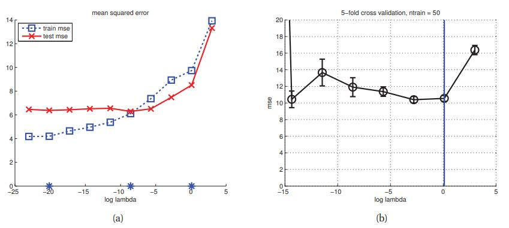
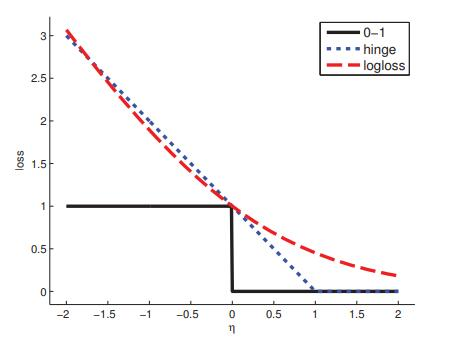

[**返回本章目录**]()

频率派决策理论存在一个根本问题，即人们实际上无法计算风险函数，因为它依赖于知道真实的数据分布。 （相比之下，贝叶斯后验预期损失总是可以计算，因为它更取决于数据，而不是$$\theta^{\\*}$$。）但是，有一个设置可以避免这个问题，这就是预测可观察性量的任务，而不是估计隐藏变量或参数。 也就是说，不再关注形如$$L(\boldsymbol{\theta},\delta(\mathcal{D}))$$的损失函数，其中$$\boldsymbol{\theta}$$是真实但未知的参数，而$$\delta(\mathcal{D})$$是我们的估计器; 而是让我们关注形如$$L(y,\delta(\boldsymbol{x}))$$的损失函数，其中$$y$$是真实但未知的响应，$$\delta(\boldsymbol{x})$$是给定输入$$\boldsymbol{x}$$的预测。 在这种情况下，频率派风险变为

$$
R(p_{\\*},\delta)\overset{\Delta}{=}\mathbb{E}_{(\boldsymbol{x},y) \sim p_{\\*}}\left[L(y,\delta(\boldsymbol{x}))\right]=\sum_{\boldsymbol{x}}{\sum_y{L(y,\delta(\boldsymbol{x}))p_{\\*}(\boldsymbol{x},y)}}   \tag{6.47}
$$

<!--more-->

其中$$p_{\\*}$$代表“自然的分布”。 当然，这种分布是未知的，但一种简单的方法是使用从一些训练数据导出的经验分布来近似$$p^{\\*}$$，即，

$$
p_{\\*}(\boldsymbol{x},y) \approx p_{\rm emp}(\boldsymbol{x},y)\overset{\Delta}{=}\dfrac{1}{N}\sum_{i=1}^N{\delta_{\boldsymbol{x}_i}(\boldsymbol{x})\delta_{y_i}(y)}    \tag{6.48}
$$

然后我们将**经验风险**定义如下：

$$
R_{\rm emp}(\mathcal{D},\mathcal{D})\overset{\Delta}{=}R(p_{\rm emp},\delta)=\dfrac{1}{N}\sum_{i=1}^N{L(y_i,\delta(\boldsymbol{x}_i))}    \tag{6.49}
$$

在0-1损失的情况下，$$L(y,\delta(\boldsymbol{x}))=\mathbb{I} (y \ne \delta(\boldsymbol{x}))$$ 变成了**错分率**\(**misclassification rate**\)。 在平方误差损失的情况下，$$L(y,\delta(\boldsymbol{x}))=(y - \delta(\boldsymbol{x}))^2$$，这变为**均方误差**\(**mean squared error**\)。 我们将**经验风险最小化**或**ERM**的任务定义为寻找决策程序（通常是分类规则）以使最小化经验风险：

$$
\delta_{\rm ERM}(\mathcal{D})=\underset{\delta}{\rm argmin} \ R_{\rm emp}(\mathcal{D},\delta)   \tag{6.50}
$$

在无监督的情况下，我们消除对$$y$$的所有引用，并用$$L(\boldsymbol{x},\delta(\boldsymbol{x}))$$代替$$L(y,\delta(\boldsymbol{x}))$$，比如$$L(\boldsymbol{x},\delta(\boldsymbol{x}))= \| \boldsymbol{x} - \delta(\boldsymbol{x})\|_2^2$$被用来度量重建误差。 我们可以使用$$\delta(\boldsymbol{x})= {\rm decode}({\rm encode}(\boldsymbol{x}))$$定义决策规则，用作**矢量量化**（第11.4.2.6节）或**PCA**（第12.2节）。 最后，我们将**经验风险**定义为

$$
R_{\rm emp}(\mathcal{D},\delta)=\dfrac{1}{N}\sum_{i=1}^N{L(\boldsymbol{x}_i,\delta(\boldsymbol{x}_i))}  \tag{6.51}
$$

当然，我们总是可以通过设置$$\delta(\boldsymbol{x})= \boldsymbol{x}$$来最小化这种风险，因此编码器-解码器通过某种瓶颈是至关重要的。

## 6.5.1 正则化风险最小化

请注意，如果我们的先验相关的“自然分布”与经验分布完全相等（Minka 2001b），则经验风险等于贝叶斯风险：

$$
\mathbb{E}\left[R(p_{\\*},\delta)_{p_{\\*}=p_{\rm emp}}\right]=R_{\rm emp}(\mathcal{D},\delta)    \tag{6.52}
$$

因此，最小化经验风险通常会导致过度拟合。 因此，经常需要为目标函数添加复杂性惩罚：

$$
R'(\mathcal{D},\delta)=R_{\rm emp}(\mathcal{D},\delta)+\lambda C(\delta)   \tag{6.53}
$$

其中$$C(\delta)$$度量了预测函数$$\delta{\boldsymbol{x}}$$的复杂度，$$\lambda$$控制了复杂性惩罚的强度。 这种方法称为**正则化风险最小化**（**RRM**）。 注意，如果损失函数是负对数似然，并且正则化项是负对数先验，则这相当于MAP估计。

RRM中的两个关键问题是：我们如何度量复杂性，以及如何选择$$\lambda$$。 对于线性模型，我们可以根据第7.5.3节中讨论的自由度来定义复杂性。 对于更一般的模型，我们可以使用第6.5.4节中讨论的VC维度。 至于$$\lambda$$的选择，我们可以使用第6.5.2节中讨论的方法。

## 6.5.2 结构风险最小化

正则化风险最小化原则表明，对于给定的复杂性惩罚，我们应该通过使用下式来拟合模型

$$
\hat{\delta}_\lambda = \underset{\delta}{\rm argmin} \left[R_{\rm emp}(\mathcal{D},\delta)+\lambda C(\delta)\right]  \tag{6.54}
$$

但是我们该怎么选择$$\lambda$$呢？ 我们不能使用训练集，因为这会低估真正的风险，这个问题被称为**训练误差的乐观**\(**optimism of the training error**\)。 作为替代方案，我们可以使用以下规则，称为**结构风险最小化**原则：（Vapnik 1998）：

$$
\hat{\lambda}=\underset{\lambda}{\rm argmin} \ \hat{R}(\hat{\delta}_\lambda)    \tag{6.55}
$$

其中$$\hat{R}(\delta)$$是风险的估计值。 有两种广泛使用的估计：交叉验证和风险的理论上限。 我们将在下面讨论这两个方面。

## 6.5.3 使用交叉验证估计风险

我们可以使用验证集来估计某些估算器的风险。 如果我们没有单独的验证集，我们可以使用**交叉验证**（**CV**），正如我们在1.4.8节中简要讨论的那样。 更确切地说，CV定义如下。 在训练集中令$$N = |\mathcal{D}|$$。 用$$\mathcal{D}_k$$表示第k折叠的测试数据，用$$\mathcal{D}_{-k}$$表示所有其他数据。 （在**分层CV**\(**stratified CV**\)中，选择的这些折叠使得每个类的占比（如果存在离散标签）在每个折叠中大致相等。）设$$\mathcal{F}$$是一个基于数据集和第$$m$$模型上的学习算法或拟合函数（这个索引$$m$$可能是 离散索引，例如多项式的次数，或连续索引，例如正则化器的强度）并返回参数向量：

$$
\hat{\boldsymbol{\theta}}_m = \mathcal{F}(\mathcal{D},m)   \tag{6.56}
$$

最后，让$$\mathcal{P}$$为预测函数，它接受输入和参数向量并返回预测：

$$
\hat{y} =  \mathcal{P}(\boldsymbol{x},\hat{\boldsymbol{\theta}})=f(\boldsymbol{x},\hat{\boldsymbol{\theta}})  \tag{6.57}
$$

因此，组合得到的**拟合-预测循环**表示为

$$
f_m(\boldsymbol{x},\mathcal{D})=\mathcal{P}(\boldsymbol{x},\mathcal{F}(\mathcal{D},m))   \tag{6.58}
$$

$$f_m$$风险的K折CV估计定义为

$$
R(m,\mathcal{D},K)\overset{\Delta}{=}\dfrac{1}{N}\sum_{k=1}^K{\sum_{i\in\mathcal{D}_k}{L(y_i,\mathcal{P}(\boldsymbol{x}_i,\mathcal{F}(\mathcal{D}_{-k},m)))}}    \tag{6.59}
$$

请注意，我们可以每折都调用拟合算法一次。 令$$f_m^k(\boldsymbol{x})=\mathcal{P}(\boldsymbol{x},\mathcal{F}(\mathcal{D}_{-k},m))$$ 是除了$$k$$折测试数据之外的所有数据上训练的函数。 于是我们可以将CV估计重写为

$$
R(m,\mathcal{D},K)=\dfrac{1}{N}\sum_{k=1}^K{\sum_{i\in\mathcal{D}_k}{L(y_i,f_m^k(\boldsymbol{x}_i))}}=\dfrac{1}{N}\sum_{i=1}^N{L(y_i,f_m^{k(i)}(\boldsymbol{x}_i))}    \tag{6.60}
$$

其中$$k(i)$$是第$$i$$个数据被用作测试数据所在的折叠。 换句话说，我们使用在不包含$$\boldsymbol{x}_i$$的数据上训练模型来预测$$y_i$$。

在$$K = N$$的情况下，该方法被称为**留一交叉验证**或**LOOCV**。 在这种情况下，估计的风险就变成了

$$
R(m,\mathcal{D},K)=\dfrac{1}{N}\sum_{i=1}^N{L(y_i,f_m^{-i}(\boldsymbol{x}_i))}    \tag{6.61}
$$

其中$$f_m^i(\boldsymbol{x})=\mathcal{P}(\boldsymbol{x},\mathcal{F}(\mathcal{D}_{-i},m))$$。 这需要将模型拟合N次，其中$$f_m^{-i}$$我们省略了第$$i$$个训练案例。 幸运的是，对于某些模型类和损失函数（即线性模型和二次损失），我们可以将模型拟合一次，并在分析地“消除”第$$i$$个训练案例的效果。 这称为**广义交叉验证**或**GCV**。

### 6.5.3.1 示例：使用CV为岭回归选择λ

作为一个具体的例子，考虑在惩罚线性回归中选择$$l_2$$正则化强度。 我们使用以下规则：

$$
\hat{\lambda}=\underset{\lambda \in [\lambda_{\min},\lambda_{\max}]}{\rm argmin} \ R(\lambda,\mathcal{D}_{\rm train},K)   \tag{6.62}
$$

其中$$[\lambda_{\min},\lambda_{\max}]$$是我们搜索的$$\lambda$$值的有限范围，$$R(\lambda,\mathcal{D}_{\rm train},K)$$是使用$$\lambda$$的K折CV风险估计值，由下式给出：

$$
R(\lambda,\mathcal{D}_{\rm train},K)=\dfrac{1}{|\mathcal{D}_{\rm train}|}\sum_{k=1}^K{\sum_{i\in\mathcal{D}_k}{L(y_i,f_\lambda^k(\boldsymbol{x}_i))}}   \tag{6.63}
$$

其中$$f_\lambda^k(\boldsymbol{x})=\boldsymbol{x}^T \hat{\boldsymbol{w}}_\lambda(\mathcal{D}_{-k})$$ 是在不包括$$k$$折叠数据上训练的预测函数，并且$$\hat{\boldsymbol{w}}_\lambda(\mathcal{D})= \underset{\boldsymbol{w}}{\rm argmin}\left[{\rm NLL}(\boldsymbol{w},\mathcal{D})+\lambda \| \boldsymbol{w} \|_2^2\right]$$ 是MAP估计。 图6.6（b）给出了风险v.s.$$\log(\lambda)$$的CV估计的一个例子，其中损失函数是平方误差。

> 图6.6 （a）14阶多项式回归的$$l_2$$惩罚v.s.对数正则化的均方误差。 与图7.8相同，除了现在我们有N = 50个训练点而不是21个。星形对应于图7.7中用于绘制函数的值。 （b）CV估计。 为清楚起见，垂直刻度被截断。 蓝线对应于基于标准误差规则选择的值。 由_linregPolyVsRegDemo_生成的图。

进行分类时，我们通常使用0-1损失。 在这种情况下，我们通过优化经验风险的凸上界来估计$$\boldsymbol{w}_\lambda$$，但我们优化（CV估计）风险本身来估计$$\lambda$$。 我们可以在估计$$\lambda$$时处理非平滑0-1损失函数，因为我们在整个（一维）空间上使用强力搜索。

当我们有超过一个或两个调整参数时，这种方法变得不可行。 在这种情况下，可以使用经验贝叶斯，这允许人们使用基于梯度的优化器而不是强力搜索来优化大量超参数。 详细信息请参见第5.6节。

### 6.5.3.2 一个标准误差规则\(one-standard error rule\)

上述估计风险程序，没有给出任何不确定性的衡量标准。 关于估计不确定性的标准频率派度量是均值的标准误差，由定义如下

$$
{\rm se} = \dfrac{\hat{\sigma}}{\sqrt{N}}=\sqrt{\dfrac{\hat{\sigma}^2}{N}}   \tag{6.64}
$$

其中$$\hat{\sigma}^2$$是损失方差的一个估计：

$$
\hat{\sigma}^2 = \dfrac{1}{N}\sum_{i=1}^N{(L_i-\bar{L})^2},L_i=L(y_i,f_m^{k(i)}(\boldsymbol{x}_i)),\bar{L}=\dfrac{1}{N}\sum_{i=1}^N{L_i}  \tag{6.65}
$$

请注意，$$\sigma$$度量所有样本损失$$L_i$$的内在变化，而$${\rm se}$$测量我们关于均值$$\bar{L}$$的不确定性。

假设我们将CV应用于一组模型并计算其风险估计的均值和标准误差。 从这些噪声估计中挑选模型的常用启发式方法是选择对应于最简单模型的值，该模型的风险不超过最佳模型风险的一个标准误差; 这被称为**一个标准误差规则**（Hastie等，2001，第216页）。 例如，在图6.6中，我们看到这种启发式算法并没有选择曲线上的最低点，而是略微偏向右侧，因为这对应于具有基本相同经验性能的更严格的正则化模型。

### 6.5.3.3 非概率无监督学习中CV模型选择

如果我们正在进行无监督学习，我们必须使用形如$$L(\boldsymbol{x},\delta(\boldsymbol{x}))= \| \boldsymbol{x} - \delta(\boldsymbol{x})\|_2^2$$的损失函数，它度量了重建误差。 这里$$\delta(\boldsymbol{x})$$是一些编码-解码方案。 然而，正如我们在第11.5.2节中讨论的那样，我们不能使用CV来确定$$\delta$$的复杂性，因为即使在测试集上进行评估，我们也总能通过更复杂的模型获得更低的损失。 这是因为更复杂的模型会减少压缩数据，并减少失真。 因此，我们必须使用概率模型，或发明其他启发式。

## 6.5.4 使用统计学习理论的风险上限\*

交叉验证的主要问题是它很慢，因为我们不得不多次拟合模型。 这激发了对分析近似或泛化误差界限的计算欲望。 这是在**统计学习理论**（**SLT**）领域中所研究的。 更确切地说，SLT试图根据经验风险$$R_{\rm emp}(\mathcal{D},h)$$ ，样本大小$$N =| \mathcal{D} |$$，以及假设空间$$\mathcal{H}$$的大小， 限制任意一个数据分布$$p_{\\*}$$和假设$$h \in \mathcal{H}$$ 的风险$$R(p_{\\*},h)$$。

让我们首先考虑假设空间是有限的情况，其大小为$${\rm dim}(\mathcal{H})= | \mathcal{H} |$$。 换句话说，我们从有限列表中选择一个模型/假设，而不是优化实值参数。然后我们可以证明以下内容。

**定理6.5.1.** 对于任何数据分布 $$p_{\\*}$$ ，以及从 $$p_{\\*}$$ 中提取的任何大小为$$N$$的数据集$$\mathcal{D}$$，对一个有限大小的假设空间$$\mathcal{H}$$而言，有如下不等式成立：

$$
P\left(\underset{h\in\mathcal{H}}{\rm max}\left|R_{\rm emp}(\mathcal{D},h)-R(p_{\\*},h)\right|>\epsilon\right)\le 2 \ {\rm dim}(\mathcal{H}) e^{-2N\epsilon^2}    \tag{6.66}
$$

证明: 为了证明这一点，我们需要两个有用的结果。 首先，**Hoeffding不等式**，它表明如果$$X_1,\dots,X_N \sim {\rm Ber}(\theta)$$，那么，

$$
P\left(|\bar{x}-\theta|>\epsilon\right) \le 2 \ e^{-2N\epsilon^2}   \tag{6.67}
$$

其中$$\bar{x}=\frac{1}{N} \sum_{i = 1}^N{x_i}$$。 其次，**联合上界**，即如果$$A_1,\dots,A_d$$是一组事件，那么$$P(\bigcup_{i=1}^d{A_i}) \le \sum_{i= 1}^d{P(A_i)}$$。

最后，为了符号简洁性，让$$R(h)= R(h,p_{\\*})$$表示真实风险，$$\hat{R}_N(h)= R_{\rm emp}(\mathcal{D},h)$$表示经验风险。

使用这些结果，我们有

$$
\begin{aligned}
P\left(\underset{h \in \mathcal{H}}{\rm max}\left|\hat{R}_N(h)-R(h)\right|>\epsilon\right) = & P\left(\bigcup_{h \in \mathcal{H}}\left|\hat{R}_N(h)-R(h)\right|>\epsilon\right)  \\
\quad \le & \bigcup_{h \in \mathcal{H}}P\left(\left|\hat{R}_N(h)-R(h)\right|>\epsilon\right)    \\
\quad \le & \bigcup_{h \in \mathcal{H}}{2 \ e^{-2N\epsilon^2}} = 2 \ {\rm dim}(\mathcal{H}) e^{-2N\epsilon^2}    \\
\end{aligned} \tag{6.68-70}
$$

这个上界告诉我们，训练误差的乐观程度随着$${\rm dim}(\mathcal{H})$$而增加，但随着$$N = | \mathcal{D} |$$而减小，正如预期的那样。

如果假设空间$$\mathcal{H}$$是无穷大的（比如，实值参数），我们就不能使用$${\rm dim}(\mathcal{H})= | \mathcal{H} |$$。 相反，我们可以使用称为**Vapnik-Chervonenkis**的量或假设类的**VC**维度。 有关详细信息，请参阅（Vapnik 1998）。

统计学习理论背后的关键直觉非常简单。 假设我们找到了一个较低经验风险的模型。 如果相对于数据大小，假设空间$$\mathcal{H}$$非常大，那么很可能我们只是“幸运”地用我们选择的函数为给定数据集就很好建模了。 然而，这并不意味着这样的函数具有低泛化误差。 但是，如果假设类的大小受到足够的约束，和/或，训练集足够大，那么我们不太可能以这种方式获得幸运，所以低经验风险是低真实风险的证据。

请注意，训练误差的乐观性不一定随模型复杂性而增加，但它确实随着搜索的不同模型的数量而增加。

与CV相比，统计学习理论的优势在于风险界限的计算比使用CV更快。 缺点是很难为许多有趣的模型计算VC维度，并且上限通常非常松散（尽管参见（Kaariainen和Langford 2005））。

人们可以通过考虑学习者的计算复杂性来扩展统计学习理论。 该领域称为**计算学习理论**或**COLT**。 这项工作大部分集中在$$h$$是二元分类器并且损失函数是0-1损失的情况下。 如果我们观察到低经验风险，并且假设空间适当地“小”，那么我们可以说我们的估计函数**可能近似正确**或**PAC**。 如果存在一个多项式时间算法，可以识别一个函数是PAC的，那么假设空间被**有效地PAC学习**。 有关详细信息，请参阅（Kearns和Vazirani 1994）。

## 6.5.5 代理损失函数\( Surrogate loss functions\)

最小化ERM / RRM框架中的损失并非易事。 例如，我们可能想要优化AUC或F1分数。 或者更简单地说，我们可能只想最小化0-1损失，这在分类中很常见。 不幸的是，0-1风险是一个非常不平滑的目标，因此难以优化。 一种替代方案是使用最大似然估计，因为对数似然是0-1风险的平滑凸上限，如下所示。

为了看到这一点，考虑二元逻辑斯蒂回归，并令$$y_i \in \{-1,+1\}$$。 假设我们的决策函数计算**对数比值比**\(**log-odds ratio**\)，

$$
f(\boldsymbol{x}_i)=\log \dfrac{p(y=1|\boldsymbol{x}_i,\boldsymbol{w})}{p(y=-1|\boldsymbol{x}_i,\boldsymbol{w})}=\boldsymbol{w}^T\boldsymbol{x}_i=\eta_i   \tag{6.71}
$$

然后输出标签上的相应概率分布是

$$
p(y_i|\boldsymbol{x}_i,\boldsymbol{w})={\rm sigm}(y_i \eta_i)    \tag{6.72}
$$

让我们将**对数损失**\(**log-loss**\)定义为

$$
L_{\rm nll}(y,\eta) = - \log \ p(y|\boldsymbol{x},\boldsymbol{w})=\log (1+e^{-y \eta})    \tag{6.73}
$$

很明显，最小化对数损失平均等价于最大化拟然。

> 图6.7 二进制分类的各种损失函数的描述。 横轴是边缘$$y \eta$$，纵轴是损失。 对数损失使用基于2的对数.由_hingeLossPlot_生成的图。

现在考虑计算最可能的标签，这等价于，如果$$\eta_i<0$$ 则$$y = -1$$;如果$$\eta_i \ge 0$$则$$y = 1$$。 我们函数的0-1损失变成

$$
L_{01}(y,\eta)=\mathbb{I}(y \ne \hat{y})=\mathbb{I}(y \eta<0)    \tag{6.74}
$$

图6.7绘制了这两个损失函数。 我们看到NLL确实是0-1损失的上限。

对数损失是**代理损失函数**\(**surrogate loss function**\)的一个例子。 另一个例子是**合页损失**\(**hinge loss**\)：

$$
L_{\rm hinge}(y,\eta)=\max(0,1-y\eta)    \tag{6.75}
$$

请参见图6.7的绘图。 我们看到该函数看起来像一个门合页，因此得名。 这种损失函数构成了一种流行的分类方法的基础，称为支持向量机（SVM），我们将在14.5节中讨论。

代理通常被选择为凸上界，因为凸函数易于最小化。 例如，参见（Bartlett等人，2006）以获得更多信息。

[**返回本章目录**]()

